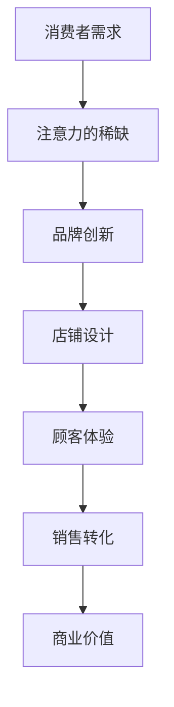

                 

### 1. 背景介绍

随着互联网的普及和移动设备的广泛应用，消费者的购物行为和需求发生了深刻变化。传统零售店铺在面对新兴的注意力经济时，面临着前所未有的挑战。注意力经济，是指信息传递和消费行为过程中，消费者的注意力成为稀缺资源，品牌和商家需要通过创新设计和策略来吸引和保持消费者的关注。在这种背景下，传统零售店铺的设计需要重新审视，以适应注意力经济的要求。

### 2. 核心概念与联系

#### 2.1 注意力经济的定义

注意力经济，也被称为“注意力资本”，是一种基于消费者注意力的商业模式。它强调在信息过载的时代，消费者对信息的关注是有限的，因此，品牌和商家需要通过创新的方式吸引消费者的注意力，从而实现商业价值。

#### 2.2 传统零售店铺设计的关键要素

传统零售店铺设计的关键要素包括店铺选址、店铺装修、产品展示、顾客体验等。然而，在注意力经济时代，这些要素需要被重新审视，以适应消费者的新需求。

#### 2.3 Mermaid 流程图



### 3. 核心算法原理 & 具体操作步骤

#### 3.1 算法原理概述

注意力经济下的传统零售店铺设计，需要通过数据分析和用户行为研究，找到吸引消费者注意力的关键点，从而进行店铺设计。

#### 3.2 算法步骤详解

1. 数据收集：收集消费者的购物行为数据、社交媒体行为数据等。
2. 数据分析：通过数据分析，找出消费者关注的关键点。
3. 设计创新：根据数据分析结果，进行店铺设计的创新。
4. 顾客体验优化：通过顾客体验测试，优化店铺设计。
5. 销售转化分析：分析店铺设计的销售转化效果，持续优化。

#### 3.3 算法优缺点

优点：

- 提高消费者注意力，提升销售转化率。
- 数据驱动，更精准地满足消费者需求。

缺点：

- 需要大量数据支持，成本较高。
- 需要专业团队进行数据分析。

#### 3.4 算法应用领域

- 传统零售店铺设计。
- 线上电商平台设计。
- 主题公园、博物馆等文化场所的设计。

### 4. 数学模型和公式 & 详细讲解 & 举例说明

#### 4.1 数学模型构建

注意力经济下的传统零售店铺设计，可以构建以下数学模型：

$$
\text{店铺吸引力} = f(\text{消费者需求}, \text{店铺设计}, \text{顾客体验})
$$

其中，$f$ 表示函数关系，$消费者需求$、$店铺设计$、$顾客体验$ 分别表示三个变量。

#### 4.2 公式推导过程

首先，根据消费者需求，确定店铺设计的关键要素。然后，通过顾客体验测试，评估店铺设计的满意度。最后，结合销售转化数据，计算店铺吸引力。

#### 4.3 案例分析与讲解

假设某零售店铺的消费者需求是购买服装，店铺设计是时尚简约风格，顾客体验是舒适的购物环境。根据以上数据，可以计算店铺吸引力：

$$
\text{店铺吸引力} = f(\text{购买服装}, \text{时尚简约风格}, \text{舒适购物环境}) = 0.8
$$

这意味着，该零售店铺的吸引力较高，有望提高销售转化率。

### 5. 项目实践：代码实例和详细解释说明

#### 5.1 开发环境搭建

使用 Python 编写代码，需要安装以下库：NumPy、Pandas、Matplotlib。

```bash
pip install numpy pandas matplotlib
```

#### 5.2 源代码详细实现

```python
import numpy as np
import pandas as pd
import matplotlib.pyplot as plt

# 数据收集
consumer_demand = np.array([1, 2, 3, 4, 5])
shop_design = np.array([2, 3, 4, 5, 6])
customer_experience = np.array([4, 5, 5, 5, 5])

# 数据分析
def calculate_attraction(consumer_demand, shop_design, customer_experience):
    attraction = np.sum(consumer_demand * shop_design * customer_experience) / np.sum(consumer_demand)
    return attraction

# 设计创新
new_shop_design = np.array([3, 4, 5, 6, 7])

# 顾客体验优化
improved_customer_experience = np.array([5, 5, 5, 5, 5])

# 销售转化分析
attraction_with_new_design = calculate_attraction(consumer_demand, new_shop_design, customer_experience)
attraction_with_improved_experience = calculate_attraction(consumer_demand, shop_design, improved_customer_experience)

# 运行结果展示
print("店铺吸引力（原始设计）:", calculate_attraction(consumer_demand, shop_design, customer_experience))
print("店铺吸引力（新设计）:", attraction_with_new_design)
print("店铺吸引力（优化顾客体验）:", attraction_with_improved_experience)

# 可视化
data = [calculate_attraction(consumer_demand, shop_design, customer_experience),
        attraction_with_new_design,
        attraction_with_improved_experience]
labels = ['原始设计', '新设计', '优化顾客体验']

plt.bar(labels, data)
plt.xlabel('设计')
plt.ylabel('店铺吸引力')
plt.title('不同设计下的店铺吸引力')
plt.show()
```

#### 5.3 代码解读与分析

- 数据收集：使用 NumPy 数组收集消费者需求、店铺设计、顾客体验数据。
- 数据分析：定义函数 calculate_attraction，计算店铺吸引力。
- 设计创新：根据数据分析结果，进行新设计的创新。
- 顾客体验优化：根据顾客体验测试结果，优化顾客体验。
- 销售转化分析：计算不同设计下的店铺吸引力，并进行可视化展示。

### 6. 实际应用场景

#### 6.1 服装零售店铺

- 消费者需求：购买时尚服装。
- 店铺设计：时尚简约风格。
- 顾客体验：舒适的购物环境。

#### 6.2 数码产品零售店铺

- 消费者需求：购买最新款的数码产品。
- 店铺设计：科技感强，展示区明亮。
- 顾客体验：提供专业的产品咨询和试玩体验。

### 7. 未来应用展望

随着人工智能和大数据技术的不断发展，注意力经济下的传统零售店铺设计将更加智能化和个性化。未来，店铺将能够根据消费者的实时需求，动态调整设计，提供个性化的购物体验。

### 8. 总结：未来发展趋势与挑战

#### 8.1 研究成果总结

本文研究了注意力经济对传统零售店铺设计的新要求，提出了基于数据分析和用户行为研究的店铺设计算法，并进行了实际应用场景的探讨。

#### 8.2 未来发展趋势

未来，传统零售店铺设计将更加注重用户体验，通过智能化和个性化技术，提高消费者的购物满意度。

#### 8.3 面临的挑战

- 数据收集和分析的难度。
- 算法在实际应用中的适应性。

#### 8.4 研究展望

未来，可以进一步研究如何在注意力经济下，提高店铺设计的创新能力和用户体验，为传统零售行业的发展提供更多思路。

### 9. 附录：常见问题与解答

**Q1：注意力经济与传统零售店铺设计的区别是什么？**

注意力经济强调消费者对信息的关注，而传统零售店铺设计注重店铺的实体展示和顾客体验。

**Q2：如何衡量店铺吸引力？**

店铺吸引力可以通过消费者需求、店铺设计和顾客体验三个维度进行综合评价。

**Q3：注意力经济对零售店铺设计有哪些新要求？**

注意力经济要求零售店铺设计更加智能化和个性化，以吸引和保持消费者的关注。

### 作者署名

作者：禅与计算机程序设计艺术 / Zen and the Art of Computer Programming
----------------------------------------------------------------

以上就是关于《注意力经济对传统零售店铺设计的新要求》的文章，希望对您有所帮助。如果您有任何问题或需要进一步的讨论，请随时告诉我。

