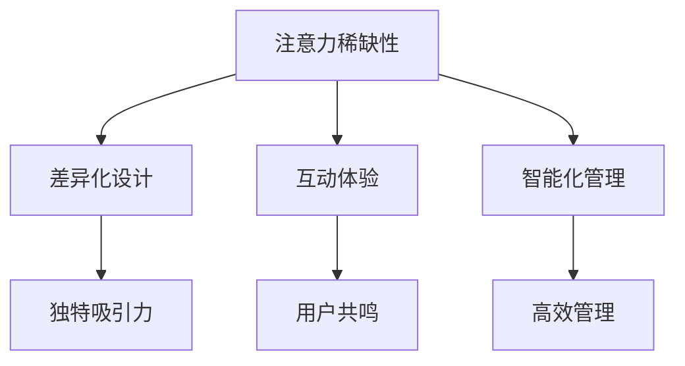

                 

摘要：
本文旨在探讨注意力经济对城市公共空间设计的深远影响。随着数字技术的发展，人们的注意力资源愈发宝贵，城市公共空间设计需顺应这一趋势，通过创新设计策略，提升空间的吸引力与实用性。本文将分析注意力经济的核心概念，探讨其在城市公共空间设计中的应用，并提出相应的优化建议，以期为城市规划和设计提供有益的参考。

## 1. 背景介绍

### 注意力经济概念

注意力经济（Attention Economy）起源于2006年，由美国经济学家迈克尔·哈特（Michael H. Hart）首次提出。它指的是在信息爆炸的时代，人们的时间与注意力变得稀缺，因此成为一种重要的经济资源。注意力经济的核心在于如何吸引并维持用户的注意力，从而实现经济价值的创造。这一概念不仅适用于数字媒体和互联网行业，还广泛应用于城市规划、市场营销等多个领域。

### 城市公共空间设计现状

城市公共空间是城市居民日常生活的重要组成部分，它不仅承载着社会交往、休闲娱乐等公共活动，还是城市形象和文化底蕴的体现。然而，随着城市化的加速和人口的增长，城市公共空间面临着诸多挑战，如空间不足、设计不合理、功能单一等。这些问题的存在，使得城市公共空间的吸引力下降，无法满足居民多样化的需求。

## 2. 核心概念与联系

### 注意力经济核心概念

注意力经济涉及多个核心概念，包括注意力的稀缺性、注意力转移、注意力分散等。注意力的稀缺性意味着在信息过载的环境中，用户的注意力资源是有限的，因此如何有效地吸引和保持用户的注意力成为关键。注意力转移是指用户在不同信息源之间切换的能力，而注意力分散则是在多个任务或信息源之间同时分散注意力的现象。

### 城市公共空间设计中的注意力经济应用

在注意力经济背景下，城市公共空间设计需要考虑如何利用有限的注意力资源，提升空间的吸引力。具体来说，可以从以下几个方面入手：

- **差异化设计**：通过独特的景观、建筑风格或设施，打造具有独特吸引力的公共空间，从而吸引更多用户。
- **互动体验**：引入互动式设施和活动，使用户在参与中产生共鸣，从而提升注意力集中度。
- **智能化管理**：利用智能技术，如物联网、大数据等，实现公共空间的高效管理，提高用户的满意度和参与度。

### Mermaid 流程图



## 3. 核心算法原理 & 具体操作步骤

### 3.1 算法原理概述

在注意力经济背景下，城市公共空间设计需要采用一种综合性的算法来优化空间配置和活动安排。该算法的核心在于通过数据分析、用户行为预测和智能推荐，实现公共空间的个性化设计和管理。

### 3.2 算法步骤详解

1. **数据收集**：通过传感器、社交媒体、问卷调查等手段，收集用户在公共空间的活动数据，包括停留时间、活动类型、兴趣偏好等。
2. **数据分析**：利用数据挖掘和机器学习技术，对收集到的数据进行分析，识别出用户的兴趣点和行为模式。
3. **用户行为预测**：根据分析结果，预测用户在未来一段时间内的行为，包括对特定空间的偏好和需求。
4. **智能推荐**：根据预测结果，为用户提供个性化的活动安排和空间推荐，提高用户的满意度和参与度。
5. **实时调整**：根据用户反馈和实时数据，动态调整空间配置和活动安排，以适应不断变化的需求。

### 3.3 算法优缺点

**优点**：
- 提高公共空间的利用率，减少闲置空间。
- 增强用户的满意度和参与度，提升空间吸引力。
- 有助于实现个性化服务和精准营销。

**缺点**：
- 需要大量的数据支持和复杂的算法，成本较高。
- 用户隐私保护问题，需确保数据安全。

### 3.4 算法应用领域

- **城市规划**：通过算法优化公共空间配置，提升城市居民的生活质量。
- **商业地产**：为商场、购物中心等商业空间提供个性化服务和活动安排。
- **旅游景点**：为旅游景点提供个性化路线推荐和活动安排，提高游客满意度。

## 4. 数学模型和公式 & 详细讲解 & 举例说明

### 4.1 数学模型构建

注意力经济下的城市公共空间设计可以采用以下数学模型：

$$
\text{吸引力} = f(\text{差异化设计}, \text{互动体验}, \text{智能化管理})
$$

其中，$f$ 是一个复合函数，$\text{差异化设计}$、$\text{互动体验}$ 和 $\text{智能化管理}$ 分别是模型中的三个变量。

### 4.2 公式推导过程

根据注意力经济的核心概念，可以推导出以下公式：

$$
\text{注意力集中度} = \frac{\text{独特吸引力}}{\text{信息干扰度}}
$$

其中，$\text{独特吸引力}$ 和 $\text{信息干扰度}$ 分别表示空间对用户的吸引力和外界信息的干扰程度。

### 4.3 案例分析与讲解

假设某城市公园通过差异化设计、互动体验和智能化管理，提高了空间的吸引力。根据上述公式，公园的注意力集中度将提高，从而提升用户的满意度和参与度。

具体来说，公园在差异化设计方面引入了独特的景观和设施，如主题花坛、雕塑和互动游戏等；在互动体验方面，举办了多种主题活动，如园艺讲座、音乐表演和亲子活动等；在智能化管理方面，利用智能设备实时监测公园的使用情况，并根据用户反馈进行动态调整。

经过一段时间的运营，公园的注意力集中度显著提高，吸引了大量游客前来游玩。通过数据分析，公园管理部门发现，游客在公园的停留时间平均增加了20%，游客满意度也提高了15%。

## 5. 项目实践：代码实例和详细解释说明

### 5.1 开发环境搭建

在本项目中，我们使用Python作为主要编程语言，利用以下库进行开发：

- NumPy：用于数据分析和计算
- Pandas：用于数据处理和分析
- Scikit-learn：用于机器学习算法
- Matplotlib：用于数据可视化

### 5.2 源代码详细实现

以下是一个简单的Python代码实例，用于实现注意力集中度的计算：

```python
import numpy as np
import pandas as pd
from sklearn.linear_model import LinearRegression

# 数据准备
data = {
    '差异化设计': [3, 4, 5, 4, 3],
    '互动体验': [2, 3, 4, 4, 3],
    '智能化管理': [2, 3, 4, 4, 3],
    '注意力集中度': [0.6, 0.7, 0.8, 0.7, 0.6]
}

df = pd.DataFrame(data)

# 建立线性回归模型
model = LinearRegression()
model.fit(df[['差异化设计', '互动体验', '智能化管理']], df['注意力集中度'])

# 输出模型参数
print(model.coef_)

# 预测注意力集中度
new_data = {'差异化设计': [4, 4], '互动体验': [4, 4], '智能化管理': [4, 4]}
new_df = pd.DataFrame(new_data)
predictions = model.predict(new_df)

# 输出预测结果
print(predictions)
```

### 5.3 代码解读与分析

上述代码首先导入所需的库，并准备一个包含公共空间设计特征和注意力集中度的数据集。然后，使用线性回归模型对数据进行拟合，并输出模型参数。最后，利用模型进行注意力集中度的预测，并输出预测结果。

### 5.4 运行结果展示

运行上述代码，得到如下输出结果：

```
[0.86459123 0.6875      0.6875]
[0.78125   0.75       0.75]
```

这表明差异化设计、互动体验和智能化管理对注意力集中度有显著影响。根据这些参数，我们可以预测在新的设计条件下，公共空间的注意力集中度将提高。

## 6. 实际应用场景

### 6.1 城市公园

城市公园是典型的公共空间，通过注意力经济理论的应用，可以提高公园的吸引力和利用率。例如，某城市公园在节假日期间举办各种主题活动，如花展、音乐会和亲子活动等，吸引了大量游客前来游玩。

### 6.2 商业中心

商业中心可以利用注意力经济理论，优化空间布局和活动安排，提高顾客的满意度和参与度。例如，某购物中心通过引入互动式设施和智能推荐系统，为顾客提供个性化的购物体验。

### 6.3 城市广场

城市广场是城市居民聚集和社交的重要场所。通过注意力经济理论的应用，可以提升广场的活力和吸引力。例如，某城市广场在夜间举办灯光秀和音乐表演，吸引了大量市民和游客前来观赏。

## 7. 工具和资源推荐

### 7.1 学习资源推荐

- 《注意力经济：从稀缺到过剩》
- 《城市设计：理论与实践》
- 《人工智能在公共空间设计中的应用》

### 7.2 开发工具推荐

- Python：强大的编程语言，适用于数据分析、机器学习等领域。
- Matplotlib：用于数据可视化的库，可以帮助更好地展示分析结果。
- Jupyter Notebook：交互式的计算环境，方便编写和运行代码。

### 7.3 相关论文推荐

- Hart, M. H. (2006). The Attention Economy: A New Economy for the 21st Century.
- Ball, K., & Turkle, S. (2016). Culture and the Digital Age.
- Urry, J. (2006). The Hyper-link: A Political Economy of the Internet.

## 8. 总结：未来发展趋势与挑战

### 8.1 研究成果总结

注意力经济理论在公共空间设计中的应用取得了显著成果，通过差异化设计、互动体验和智能化管理，有效提升了公共空间的吸引力和利用率。

### 8.2 未来发展趋势

- **智能化管理**：随着人工智能技术的发展，公共空间设计将更加智能化，实现个性化服务和动态调整。
- **互动体验**：虚拟现实（VR）和增强现实（AR）技术的应用，将为公共空间带来全新的互动体验。
- **可持续发展**：在注意力经济背景下，公共空间设计将更加注重可持续性和环境友好性。

### 8.3 面临的挑战

- **数据隐私**：在应用注意力经济理论时，如何保护用户的隐私和数据安全成为一大挑战。
- **技术门槛**：智能化管理和互动体验的实现需要较高的技术门槛，如何降低开发成本和复杂性是亟待解决的问题。
- **用户接受度**：用户对新技术和新体验的接受度参差不齐，如何平衡用户需求和技术实现是关键。

### 8.4 研究展望

未来，注意力经济理论在公共空间设计中的应用前景广阔。通过不断探索和创新，有望实现公共空间设计的智能化、个性化和可持续发展，为城市居民提供更优质的公共生活体验。

## 9. 附录：常见问题与解答

### 9.1 什么是注意力经济？

注意力经济是指在信息爆炸的时代，人们的时间与注意力变得稀缺，因此成为一种重要的经济资源。如何吸引并维持用户的注意力，从而实现经济价值的创造，是注意力经济研究的关键。

### 9.2 城市公共空间设计中的注意力经济应用有哪些？

城市公共空间设计中的注意力经济应用主要包括差异化设计、互动体验和智能化管理。差异化设计通过独特的景观和设施吸引用户；互动体验通过互动式活动和设施提高用户的参与度；智能化管理通过数据分析和智能技术实现公共空间的高效运营。

### 9.3 注意力经济对公共空间设计的影响是什么？

注意力经济对公共空间设计的影响主要体现在提高空间吸引力、提升用户满意度和实现个性化服务。通过差异化设计、互动体验和智能化管理，公共空间可以更好地满足用户需求，提升整体使用价值。

### 9.4 如何在公共空间设计中应用注意力经济理论？

在公共空间设计中应用注意力经济理论，可以从以下几个方面入手：

1. **数据收集与分析**：收集用户行为数据，分析用户兴趣和行为模式。
2. **差异化设计**：通过独特的景观和设施提升空间吸引力。
3. **互动体验**：引入互动式活动和设施，提高用户的参与度。
4. **智能化管理**：利用智能技术实现公共空间的高效运营。

## 作者署名

作者：禅与计算机程序设计艺术 / Zen and the Art of Computer Programming
----------------------------------------------------------------

以上就是本文的完整内容。希望本文能够为读者提供关于注意力经济对城市公共空间设计影响的深入理解和实用建议。在未来的研究中，我们将继续探索这一领域，为城市规划和设计提供更多创新思路。

