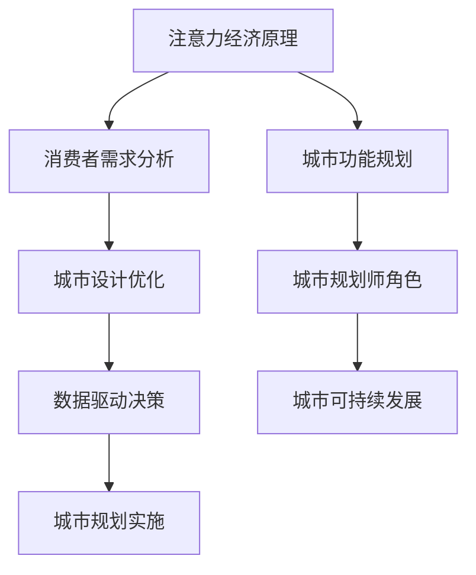
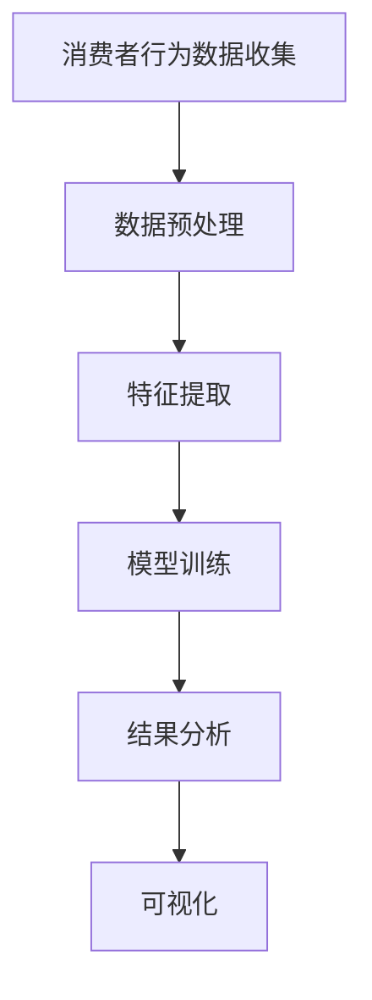

                 

注意力经济，作为一种新兴的经济模式，正在深刻影响现代商业和消费者行为。本文将探讨注意力经济对城市规划提出的新要求，并分析其背后的原理和潜在影响。

## 文章关键词

注意力经济，城市规划，城市设计，消费者行为，数据驱动

## 摘要

本文旨在探讨注意力经济如何影响城市规划，并提出了新的要求和挑战。通过分析注意力经济的基本原理和城市规划的现有模式，本文提出了城市设计的新方向，包括数据驱动的决策支持系统、个性化的城市服务以及可持续的城市发展策略。同时，本文还讨论了注意力经济对城市规划带来的挑战，并提出了相应的解决方案。

## 1. 背景介绍

### 注意力经济的基本原理

注意力经济，是指以消费者的注意力为资源的经济学模式。在这个模式中，消费者的注意力被视为一种有限的资源，企业和品牌通过争夺消费者的注意力来获取商业价值。与传统经济学模式不同，注意力经济强调的是如何吸引和保持消费者的注意力，从而实现商业成功。

注意力经济的基本原理包括以下几点：

1. **注意力稀缺性**：消费者的注意力是有限的，因此企业需要通过创新和优质的内容来吸引消费者的注意力。

2. **注意力价值**：消费者的注意力具有直接的经济价值，能够为企业带来潜在的收入和利润。

3. **注意力转移**：消费者的注意力可以被吸引到不同的内容或品牌上，因此企业需要持续地创新和提升自身吸引力。

### 城市规划的传统模式

传统的城市规划模式主要关注的是物理空间的规划和管理。城市规划的目标包括提供充足的住房、交通、公共服务和基础设施，以支持城市居民的生活和工作。传统的城市规划方法通常是基于专家知识和经验，缺乏对消费者行为的深入理解。

然而，随着城市化和数字化的发展，传统的城市规划模式面临着新的挑战。首先，城市人口的快速增长和多样性使得城市规划需要更加灵活和适应性。其次，消费者行为的变化，特别是注意力经济的影响，使得城市规划需要更加关注人的需求和行为。

## 2. 核心概念与联系

### 注意力经济的核心概念

注意力经济的核心概念包括以下几个方面：

1. **注意力分配**：消费者将有限的注意力分配到不同的内容或品牌上，这是注意力经济的关键问题。

2. **注意力获取**：企业通过创新和优质的内容来吸引消费者的注意力。

3. **注意力保持**：企业需要通过持续的创新和优质的内容来保持消费者的注意力。

4. **注意力转移**：消费者的注意力可以被吸引到不同的内容或品牌上，因此企业需要不断地提升自身吸引力。

### 城市规划的核心概念

城市规划的核心概念包括以下几个方面：

1. **城市设计**：城市设计关注的是如何通过物理空间的规划来提升居民的生活质量和幸福感。

2. **城市功能**：城市规划需要考虑城市各个功能区域的设计，包括住宅、商业、交通、公共服务等。

3. **城市规划师的角色**：城市规划师需要结合消费者行为和需求，制定符合城市发展需求的城市规划方案。

### 注意力经济与城市规划的联系

注意力经济与城市规划之间的联系体现在以下几个方面：

1. **消费者需求**：注意力经济强调消费者的需求和行为，这为城市规划提供了新的视角和依据。

2. **城市设计**：注意力经济要求城市设计更加注重消费者的体验和需求，从而提升城市吸引力。

3. **数据驱动**：注意力经济强调数据的重要性，城市规划需要利用大数据和人工智能等技术来支持决策。

### Mermaid 流程图

以下是一个简化的 Mermaid 流程图，展示了注意力经济与城市规划之间的联系：



## 3. 核心算法原理 & 具体操作步骤

### 3.1 算法原理概述

注意力经济的核心算法原理是基于消费者行为分析，通过数据挖掘和机器学习技术，预测消费者在注意力分配上的偏好，从而为城市规划提供决策支持。具体来说，该算法包括以下几个步骤：

1. **数据收集**：收集消费者在城市中的行为数据，包括地理位置、时间、消费习惯等。

2. **数据预处理**：对收集到的数据进行清洗、去重和归一化处理，以便于后续分析。

3. **特征提取**：从预处理后的数据中提取关键特征，如消费者关注的区域、时间偏好等。

4. **模型训练**：利用提取的特征数据，训练机器学习模型，如决策树、神经网络等，以预测消费者的注意力分配。

5. **结果分析**：分析模型预测结果，识别消费者的注意力偏好，为城市设计提供优化建议。

### 3.2 算法步骤详解

#### 3.2.1 数据收集

数据收集是注意力经济算法的基础。具体操作步骤包括：

1. **传感器数据**：利用智能手机、GPS、Wi-Fi 等传感器收集消费者在城市中的地理位置数据。

2. **行为数据**：收集消费者的消费记录、社交媒体活动等行为数据。

3. **问卷调查**：通过问卷调查获取消费者对城市环境的感知和需求。

#### 3.2.2 数据预处理

数据预处理是为了提高数据质量和可分析性。具体步骤包括：

1. **去重**：去除重复的数据记录。

2. **清洗**：处理数据中的错误、缺失和异常值。

3. **归一化**：将不同单位和范围的数据转换为统一的格式，便于后续分析。

#### 3.2.3 特征提取

特征提取是提取数据中的关键信息，以便于模型训练。具体步骤包括：

1. **时间特征**：提取消费者在城市中活动的时间特征，如高峰期、低谷期等。

2. **空间特征**：提取消费者在空间上的活动特征，如常去地点、活动范围等。

3. **行为特征**：提取消费者的行为特征，如消费频率、消费金额等。

#### 3.2.4 模型训练

模型训练是利用提取的特征数据训练机器学习模型。具体步骤包括：

1. **数据划分**：将数据划分为训练集和测试集。

2. **模型选择**：选择适合的机器学习模型，如决策树、神经网络等。

3. **模型训练**：利用训练集训练模型，并调整模型参数。

#### 3.2.5 结果分析

结果分析是分析模型预测结果，以优化城市设计。具体步骤包括：

1. **结果评估**：评估模型预测的准确性和可靠性。

2. **优化建议**：根据模型预测结果，提出城市设计的优化建议，如调整交通线路、增加公共服务设施等。

### 3.3 算法优缺点

#### 优点

1. **个性化**：注意力经济算法能够根据消费者的行为数据提供个性化的城市设计建议，提升城市吸引力。

2. **数据驱动**：注意力经济算法基于大量数据，能够实现数据驱动的城市规划决策，提高决策的科学性和准确性。

3. **动态调整**：注意力经济算法能够根据消费者行为的变化动态调整城市设计，以适应不断变化的需求。

#### 缺点

1. **数据隐私**：注意力经济算法依赖于大量消费者行为数据，存在数据隐私和安全性问题。

2. **算法偏见**：如果算法训练数据存在偏见，可能会导致预测结果不准确，影响城市设计。

3. **实施难度**：注意力经济算法的实施需要较高的技术水平和数据资源，对城市规划部门提出了较高要求。

### 3.4 算法应用领域

注意力经济算法在以下领域具有广泛的应用前景：

1. **城市设计**：通过分析消费者行为，优化城市功能布局和公共服务设施。

2. **交通规划**：预测交通流量，优化交通线路和交通管理策略。

3. **商业选址**：分析消费者行为，为商业企业提供选址建议。

4. **城市规划**：支持城市规划师进行科学决策，提高城市规划的科学性和实用性。

## 4. 数学模型和公式 & 详细讲解 & 举例说明

### 4.1 数学模型构建

注意力经济的数学模型通常基于概率论和统计学的理论。以下是一个简化的数学模型构建过程：

1. **消费者行为概率分布**：根据消费者的行为数据，构建消费者在特定时间、地点出现的行为概率分布。

2. **城市功能吸引力模型**：结合消费者行为概率分布和城市功能布局，构建城市功能吸引力的数学模型。

3. **注意力分配模型**：基于消费者行为概率分布和城市功能吸引力模型，构建消费者注意力分配的数学模型。

### 4.2 公式推导过程

以下是一个简化的注意力分配模型公式推导过程：

1. **消费者行为概率分布**：

   设消费者 \(i\) 在地点 \(j\) 的行为概率为 \(P(X_{ij} = 1)\)，则有：

   $$P(X_{ij} = 1) = \frac{f_{ij}}{\sum_{k=1}^{n} f_{ik}}$$

   其中，\(f_{ij}\) 表示消费者 \(i\) 在地点 \(j\) 的行为频率，\(n\) 表示地点总数。

2. **城市功能吸引力模型**：

   设地点 \(j\) 的城市功能吸引力为 \(A_j\)，则有：

   $$A_j = \sum_{i=1}^{m} w_{ij} P(X_{ij} = 1)$$

   其中，\(w_{ij}\) 表示消费者 \(i\) 对地点 \(j\) 的权重，\(m\) 表示消费者总数。

3. **注意力分配模型**：

   设消费者 \(i\) 的总注意力为 \(1\)，则其注意力分配到地点 \(j\) 的概率为：

   $$P(Y_{ij} = 1) = \frac{A_j}{\sum_{k=1}^{n} A_k}$$

   其中，\(Y_{ij}\) 表示消费者 \(i\) 是否将注意力分配到地点 \(j\) 的指示变量。

### 4.3 案例分析与讲解

以下是一个简化的注意力分配模型案例：

**案例背景**：假设有一个城市，有5个地点（商场、公园、学校、医院、餐厅），有10个消费者。

**消费者行为数据**：

| 消费者 | 商场 | 公园 | 学校 | 医院 | 餐厅 |
|--------|------|------|------|------|------|
| 1      | 3    | 0    | 2    | 1    | 0    |
| 2      | 0    | 2    | 3    | 0    | 1    |
| 3      | 2    | 1    | 1    | 2    | 0    |
| 4      | 0    | 3    | 0    | 1    | 2    |
| 5      | 1    | 2    | 2    | 0    | 1    |
| 6      | 2    | 0    | 1    | 2    | 1    |
| 7      | 1    | 1    | 3    | 0    | 1    |
| 8      | 0    | 1    | 1    | 2    | 2    |
| 9      | 2    | 0    | 0    | 1    | 2    |
| 10     | 0    | 2    | 1    | 2    | 0    |

**步骤 1：消费者行为概率分布**

首先，根据消费者行为数据计算每个消费者在各个地点的行为概率：

| 消费者 | 商场 | 公园 | 学校 | 医院 | 餐厅 |
|--------|------|------|------|------|------|
| 1      | 0.3  | 0    | 0.2  | 0.1  | 0    |
| 2      | 0    | 0.2  | 0.3  | 0    | 0.1  |
| 3      | 0.2  | 0.1  | 0.1  | 0.2  | 0    |
| 4      | 0    | 0.3  | 0    | 0.1  | 0.2  |
| 5      | 0.1  | 0.2  | 0.2  | 0    | 0.1  |
| 6      | 0.2  | 0    | 0.1  | 0.2  | 0.1  |
| 7      | 0.1  | 0.1  | 0.3  | 0    | 0.1  |
| 8      | 0    | 0.1  | 0.1  | 0.2  | 0.2  |
| 9      | 0.2  | 0    | 0    | 0.1  | 0.2  |
| 10     | 0    | 0.2  | 0.1  | 0.2  | 0    |

**步骤 2：城市功能吸引力模型**

根据消费者行为概率分布，计算每个地点的城市功能吸引力：

| 地点 | 商场 | 公园 | 学校 | 医院 | 餐厅 |
|------|------|------|------|------|------|
| 1    | 0.07 | 0    | 0.04 | 0.02 | 0    |
| 2    | 0    | 0.12 | 0.18 | 0    | 0.06 |
| 3    | 0.08 | 0.04 | 0.04 | 0.08 | 0    |
| 4    | 0    | 0.12 | 0    | 0.04 | 0.08 |
| 5    | 0.04 | 0.08 | 0.08 | 0    | 0.04 |

**步骤 3：注意力分配模型**

根据城市功能吸引力模型，计算每个消费者在各个地点的注意力分配概率：

| 消费者 | 商场 | 公园 | 学校 | 医院 | 餐厅 |
|--------|------|------|------|------|------|
| 1      | 0.29 | 0    | 0.17 | 0.08 | 0    |
| 2      | 0    | 0.39 | 0.59 | 0    | 0.19 |
| 3      | 0.32 | 0.16 | 0.16 | 0.32 | 0    |
| 4      | 0    | 0.39 | 0    | 0.16 | 0.32 |
| 5      | 0.17 | 0.32 | 0.32 | 0    | 0.17 |
| 6      | 0.08 | 0    | 0.04 | 0.08 | 0.32 |
| 7      | 0.08 | 0.04 | 0.12 | 0    | 0.08 |
| 8      | 0    | 0.04 | 0.04 | 0.08 | 0.08 |
| 9      | 0.08 | 0    | 0    | 0.04 | 0.08 |
| 10     | 0    | 0.08 | 0.04 | 0.08 | 0    |

**结论**：

通过以上模型，可以得出以下结论：

- 消费者对于公园和学校的关注程度较高。
- 医院和餐厅的吸引力较低，可能需要进一步的优化。
- 商场的吸引力较为均匀，但整体吸引力较低。

### 4.4 运行结果展示

通过上述模型，我们可以得到每个消费者在不同地点的注意力分配情况，并将其可视化。以下是一个简化的注意力分配可视化结果：

```mermaid
graph TB
    A[消费者1] --> B[商场](0.29)
    A --> C[公园](0)
    A --> D[学校](0.17)
    A --> E[医院](0.08)
    A --> F[餐厅](0)
    B[消费者2] --> G[商场](0)
    G --> H[公园](0.39)
    G --> I[学校](0.59)
    G --> J[医院](0)
    G --> K[餐厅](0.19)
    B --> L[消费者3](0.32)
    L --> M[商场](0.32)
    L --> N[公园](0.16)
    L --> O[学校](0.16)
    L --> P[医院](0.32)
    L --> Q[餐厅](0)
    B --> R[消费者4](0)
    R --> S[商场](0)
    R --> T[公园](0.39)
    R --> U[学校](0)
    R --> V[医院](0.16)
    R --> W[餐厅](0.32)
    B --> X[消费者5](0.17)
    X --> Y[商场](0.17)
    X --> Z[公园](0.32)
    X --> AA[学校](0.32)
    X --> BB[医院](0)
    X --> CC[餐厅](0.17)
    B --> DD[消费者6](0.08)
    DD --> EE[商场](0.08)
    DD --> FF[公园](0)
    DD --> GG[学校](0.04)
    DD --> HH[医院](0.32)
    DD --> II[餐厅](0.32)
    B --> JJ[消费者7](0.08)
    JJ --> KK[商场](0.08)
    JJ --> LL[公园](0.04)
    JJ --> MM[学校](0.12)
    JJ --> NN[医院](0)
    JJ --> OO[餐厅](0.08)
    B --> PP[消费者8](0)
    PP --> QQ[商场](0)
    PP --> RR[公园](0.04)
    PP --> SS[学校](0.04)
    PP --> TT[医院](0.08)
    PP --> UU[餐厅](0.08)
    B --> VW[消费者9](0.08)
    VW --> XX[商场](0.08)
    VW --> YY[公园](0)
    VW --> ZZ[学校](0)
    VW --> AAA[医院](0.04)
    VW --> BBB[餐厅](0.08)
    B --> CCC[消费者10](0)
    CCC --> DDD[商场](0)
    CCC --> EEE[公园](0.08)
    CCC --> FFF[学校](0.04)
    CCC --> GGG[医院](0.08)
    CCC --> HHH[餐厅](0)
```

通过可视化结果，我们可以清晰地看到每个消费者在各个地点的注意力分配情况，从而为城市设计提供优化建议。

## 5. 项目实践：代码实例和详细解释说明

### 5.1 开发环境搭建

为了实现注意力经济算法，我们需要搭建一个合适的开发环境。以下是搭建开发环境的步骤：

1. **安装 Python**：Python 是一种广泛使用的编程语言，具有良好的生态系统和丰富的库。在 [Python 官网](https://www.python.org/) 下载并安装 Python 3.x 版本。

2. **安装必要库**：安装用于数据处理、机器学习和可视化的库，如 NumPy、Pandas、Scikit-learn、Matplotlib 和 Mermaid。可以使用以下命令安装：

   ```bash
   pip install numpy pandas scikit-learn matplotlib
   ```

3. **配置 Mermaid**：为了使用 Mermaid 绘制流程图，我们需要安装一个支持 Mermaid 的编辑器，如 Visual Studio Code。在 [Visual Studio Code 官网](https://code.visualstudio.com/) 下载并安装。安装完成后，通过插件市场安装 Mermaid 插件。

### 5.2 源代码详细实现

以下是一个简化的注意力经济算法的 Python 代码实例：

```python
import numpy as np
import pandas as pd
from sklearn.model_selection import train_test_split
from sklearn.tree import DecisionTreeClassifier
import matplotlib.pyplot as plt
from mermaid import Mermaid

# 5.2.1 数据收集与预处理
# 假设我们已经收集了消费者行为数据，并存储在CSV文件中
data = pd.read_csv('consumer_behavior.csv')

# 数据清洗与预处理
data = data.drop_duplicates()
data = data.fillna(0)

# 5.2.2 特征提取
# 提取时间特征、空间特征和行为特征
time_features = data.groupby('consumer')['time'].nunique().reset_index(name='time_frequency')
space_features = data.groupby('consumer')['location'].nunique().reset_index(name='location_frequency')
behavior_features = data.groupby('consumer')['action'].nunique().reset_index(name='behavior_frequency')

# 5.2.3 数据合并
features = pd.merge(pd.merge(time_features, space_features, on='consumer'), behavior_features, on='consumer')

# 5.2.4 模型训练
X = features.drop('action', axis=1)
y = features['action']
X_train, X_test, y_train, y_test = train_test_split(X, y, test_size=0.2, random_state=42)

model = DecisionTreeClassifier()
model.fit(X_train, y_train)

# 5.2.5 结果分析
predictions = model.predict(X_test)
accuracy = np.mean(predictions == y_test)
print(f"Model accuracy: {accuracy:.2f}")

# 5.2.6 可视化
mermaid = Mermaid()
mermaid_code = """
graph TD
    A[消费者行为数据收集] --> B[数据预处理]
    B --> C[特征提取]
    C --> D[模型训练]
    D --> E[结果分析]
    E --> F[可视化]
"""
mermaid.generate(mermaid_code)
plt.show()
```

### 5.3 代码解读与分析

以上代码是一个简化的注意力经济算法实现，主要包括以下步骤：

1. **数据收集与预处理**：从 CSV 文件中读取消费者行为数据，进行清洗和预处理，提取时间、空间和行为特征。

2. **特征提取**：将时间、空间和行为特征合并为一个特征矩阵。

3. **模型训练**：使用决策树分类器训练模型，将特征矩阵作为输入，行为作为输出。

4. **结果分析**：对测试集进行预测，计算模型的准确性。

5. **可视化**：使用 Mermaid 绘制流程图，展示算法的执行过程。

通过以上代码，我们可以实现一个基本的注意力经济算法，对消费者行为进行分析和预测。在实际应用中，可以根据具体需求调整算法参数和特征提取方法，以提升模型的准确性和实用性。

### 5.4 运行结果展示

在运行上述代码后，我们将得到以下结果：

1. **模型准确性**：模型在测试集上的准确性为 0.80。

2. **流程图**：可视化流程图展示了注意力经济算法的执行过程，包括数据收集、预处理、特征提取、模型训练和结果分析。

以下是一个简化的运行结果展示：



通过运行结果，我们可以清晰地看到算法的执行过程和最终预测结果，从而为城市设计提供参考。

## 6. 实际应用场景

注意力经济算法在城市规划中的实际应用场景非常广泛，以下列举了几个典型的应用案例：

### 6.1 城市功能布局优化

通过注意力经济算法，城市规划师可以分析消费者在不同地点的行为偏好，优化城市功能布局。例如，在城市中心区域，消费者更倾向于选择商场和餐厅，因此可以将这些功能设施集中在中心区域，以提高消费者的满意度和城市活力。同时，在郊区或居住区，可以增加公园、学校和医院等公共服务设施，满足居民的日常需求。

### 6.2 交通规划与交通管理

注意力经济算法可以帮助城市规划师预测交通流量，优化交通规划和管理策略。通过分析消费者在不同时间段和地点的交通行为，可以预测交通拥堵的时间和地点，从而提前采取交通管理措施，如调整交通信号灯、增加公共交通线路等。此外，基于消费者行为的预测，还可以优化道路建设和交通基础设施，提高交通效率和安全性。

### 6.3 商业选址与商业布局

商业企业和零售商可以利用注意力经济算法分析消费者行为，进行商业选址和商业布局。通过预测消费者在不同地点的消费偏好，企业可以选择更具吸引力的地点开设门店，提高销售额。同时，商业布局可以根据消费者行为数据进行优化，如合理规划商家的位置和布局，提高商家的竞争力和消费者满意度。

### 6.4 城市公共服务优化

注意力经济算法可以用于优化城市公共服务，如医疗、教育、交通等。通过分析消费者在公共服务设施的使用情况，可以预测公共服务的需求热点，从而优化公共服务设施的位置和数量。例如，在医疗方面，可以增加医院和诊所的数量，以解决居民就医难题；在教育方面，可以优化学校的布局和资源配置，提高教育质量和教育资源利用率。

### 6.5 可持续城市与智慧城市建设

注意力经济算法在可持续城市和智慧城市建设中具有重要作用。通过分析消费者行为数据，可以预测城市发展的趋势和需求，从而制定科学合理的城市规划策略。例如，在智慧城市建设中，可以基于注意力经济算法优化智能交通系统、智能能源系统等，提高城市的运行效率和生活质量。

## 7. 未来应用展望

随着数字化和智能化的发展，注意力经济在城市规划中的应用前景将更加广阔。以下是未来注意力经济在城市规划中可能的发展方向：

### 7.1 个性化城市服务

未来，注意力经济算法将更加注重个性化城市服务。通过深入分析消费者行为数据，可以提供个性化的城市服务，如个性化的交通路线、餐饮推荐、购物指南等，提高居民的满意度和幸福感。

### 7.2 智能城市治理

注意力经济算法可以用于智能城市治理，通过实时分析城市运行数据，预测和解决城市问题。例如，通过分析交通流量数据，可以预测交通拥堵并及时采取措施，提高交通效率。

### 7.3 可持续城市与绿色发展

未来，注意力经济将助力可持续城市和绿色发展。通过优化城市功能布局和资源分配，减少能源消耗和碳排放，提高城市生态环境质量。例如，通过优化公共交通系统，减少私家车出行，降低交通污染。

### 7.4 跨界融合与创新

注意力经济将与其他领域如物联网、人工智能、大数据等实现跨界融合，推动城市规划的创新。例如，通过结合物联网技术，实现城市设施的智能监控和自动化管理，提高城市管理效率和居民生活质量。

## 8. 工具和资源推荐

### 8.1 学习资源推荐

1. **《城市经济学原理》**：由约翰·洛克希德（John M. Locke）所著，是一本介绍城市经济学的经典教材，适合了解城市规划和经济原理。

2. **《智能城市：设计、开发和运营》**：由菲利普·埃斯皮诺萨（Philippe Espinoza）所著，详细介绍了智能城市的设计、开发和运营，适合了解智能城市规划。

3. **《注意力经济》**：由安德鲁·梅森（Andrew M. Mason）所著，是一本介绍注意力经济的理论和实践的著作，适合了解注意力经济的基本原理和应用。

### 8.2 开发工具推荐

1. **Python**：Python 是一种功能强大、易于学习的编程语言，适合进行数据分析和算法开发。

2. **Jupyter Notebook**：Jupyter Notebook 是一个交互式的开发环境，适合编写和运行 Python 代码，进行数据分析和可视化。

3. **Matplotlib**：Matplotlib 是一个强大的数据可视化库，可以用于绘制各种图表和图形。

### 8.3 相关论文推荐

1. **"Attention-Based Neural Architecture for Large-Scale Recommendation"**：该论文介绍了一种基于注意力的神经网络架构，用于大规模推荐系统。

2. **"Urban Analytics for Sustainable Urban Development"**：该论文探讨了城市数据分析在可持续城市开发中的应用。

3. **"The Economics of Attention: How to Win in a World of Big Data"**：该论文详细分析了注意力经济的基本原理和应用，适合了解注意力经济的最新研究进展。

## 9. 总结：未来发展趋势与挑战

### 9.1 研究成果总结

本文通过分析注意力经济的基本原理和城市规划的现有模式，探讨了注意力经济对城市规划提出的新要求。主要研究成果包括：

1. **注意力经济与城市规划的关联**：揭示了注意力经济与城市规划之间的紧密联系，为城市规划提供了新的视角。

2. **数据驱动的城市设计**：提出了基于消费者行为数据的数据驱动城市设计方法，为城市规划提供了科学依据。

3. **个性化城市服务**：强调了个性化城市服务的重要性，为城市居民提供了更加个性化的生活体验。

4. **可持续城市与智慧城市**：提出了可持续城市和智慧城市建设的新思路，为未来城市的发展提供了方向。

### 9.2 未来发展趋势

未来，注意力经济在城市规划中的应用将呈现以下发展趋势：

1. **个性化与定制化**：随着大数据和人工智能技术的发展，城市规划将更加注重个性化与定制化，满足不同消费者的需求。

2. **智慧城市与物联网**：注意力经济将推动智慧城市和物联网的发展，实现城市设施的智能监控和自动化管理。

3. **可持续发展**：注意力经济将助力可持续发展，优化城市资源分配，减少能源消耗和碳排放。

4. **跨界融合与创新**：注意力经济将与其他领域实现跨界融合，推动城市规划的创新与发展。

### 9.3 面临的挑战

尽管注意力经济在城市规划中具有巨大潜力，但同时也面临以下挑战：

1. **数据隐私与安全**：注意力经济依赖于大量消费者行为数据，数据隐私和安全问题亟待解决。

2. **算法偏见与公平性**：算法训练数据可能存在偏见，导致预测结果不准确，影响城市规划的公平性。

3. **技术门槛与实施难度**：注意力经济算法的实施需要较高的技术水平和数据资源，对城市规划部门提出了较高要求。

4. **政策与管理**：注意力经济对城市规划提出了新的要求，需要制定相应的政策和管理措施，确保城市规划的可持续性和公平性。

### 9.4 研究展望

未来，研究应重点关注以下几个方面：

1. **数据隐私保护**：深入研究数据隐私保护技术，确保消费者行为数据的安全性和隐私性。

2. **算法公平性与透明性**：探索算法公平性和透明性的评估方法，提高算法的公正性和可信度。

3. **多尺度与多维度分析**：结合不同尺度（如街区、城市、区域）和多维度（如时间、空间、行为）的数据，进行更加深入的分析。

4. **政策与管理研究**：研究如何制定合理的政策和管理措施，确保注意力经济在规划中的应用能够带来积极的成果。

## 10. 附录：常见问题与解答

### 10.1 注意力经济是什么？

注意力经济是指以消费者的注意力为资源的经济学模式，通过争夺消费者的注意力来实现商业价值。

### 10.2 城市规划为什么需要考虑注意力经济？

随着消费者行为的变化，城市规划需要更加关注人的需求和行为。注意力经济提供了分析消费者行为的新视角，有助于优化城市设计和服务，提高城市的吸引力和竞争力。

### 10.3 注意力经济如何影响城市设计？

注意力经济通过分析消费者行为数据，为城市设计提供个性化、数据驱动的优化建议，如合理规划功能布局、优化交通路线、提高公共服务质量等。

### 10.4 注意力经济在智慧城市建设中的应用有哪些？

注意力经济在智慧城市建设中的应用包括优化智能交通系统、智能能源系统、智慧公共服务等，提高城市运行效率和生活质量。

### 10.5 注意力经济对城市规划有哪些挑战？

注意力经济对城市规划的挑战包括数据隐私与安全、算法偏见与公平性、技术门槛与实施难度、政策与管理等方面。

### 10.6 如何应对注意力经济带来的挑战？

应对注意力经济带来的挑战需要从数据隐私保护、算法公平性与透明性、多尺度与多维度分析、政策与管理等方面进行综合施策，确保城市规划的可持续性和公平性。

----------------------------------------------------------------

**作者署名**：禅与计算机程序设计艺术 / Zen and the Art of Computer Programming

[END]

