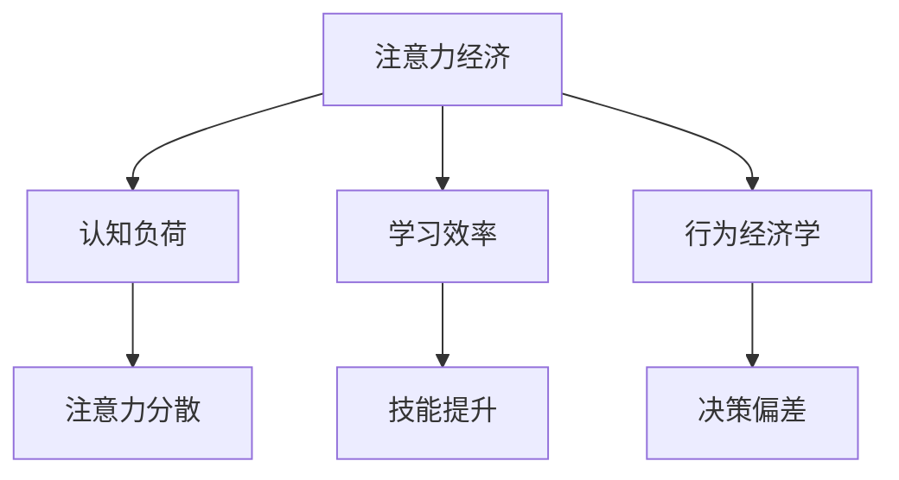

                 

关键词：注意力经济、职场竞争力、认知负荷、学习效率、行为经济学

> 摘要：本文从注意力经济的视角，探讨了注意力分配对职场竞争力的影响。通过剖析认知负荷、学习效率和行为经济学的原理，结合实际案例，探讨了如何在职场中有效管理注意力，提升个人竞争力。

## 1. 背景介绍

在当今信息爆炸的时代，我们的注意力成为一种稀缺资源。注意力经济学（Attention Economy）作为一种新兴的理论，提出了注意力分配的重要性。职场竞争力，作为个人在职场中取得成功的关键因素，与注意力分配密切相关。本文旨在分析注意力经济对职场竞争力的影响，探讨如何通过有效管理注意力，提高职场竞争力。

## 2. 核心概念与联系

### 2.1 认知负荷

认知负荷是指大脑处理信息时所需的认知资源。高认知负荷会导致注意力分散，降低工作效率。在职场中，我们需要识别并减轻认知负荷，以提高注意力集中度。

### 2.2 学习效率

学习效率是职场竞争力的基础。注意力集中有助于提高学习效率，使得我们更快地掌握新知识和技能。

### 2.3 行为经济学

行为经济学研究了人类在做出决策时的心理偏差。在注意力经济中，理解这些偏差有助于我们更好地管理注意力，从而提高职场竞争力。

### 2.4 Mermaid 流程图



## 3. 核心算法原理 & 具体操作步骤

### 3.1 算法原理概述

注意力经济的核心在于如何高效地分配注意力。算法原理包括：

- **注意力集中策略**：通过环境优化、任务规划等方法，提高注意力集中度。
- **认知负荷管理**：识别并减轻认知负荷，以保持注意力稳定。
- **学习效率优化**：通过注意力集中，提高学习效率。
- **行为经济学应用**：利用行为经济学原理，调整注意力分配策略。

### 3.2 算法步骤详解

1. **环境优化**：通过减少干扰因素，创造有利于注意力集中的工作环境。
2. **任务规划**：合理安排任务优先级，避免同时处理过多任务。
3. **注意力监测**：使用应用程序或工具监测注意力水平，适时调整策略。
4. **认知负荷管理**：通过分解任务、调整工作节奏等方法，减轻认知负荷。
5. **学习效率提升**：通过注意力集中，提高学习效率。

### 3.3 算法优缺点

**优点**：

- 提高工作效率和学习效率。
- 减轻工作压力，提高生活质量。

**缺点**：

- 需要持续的自我监控和调整。
- 部分策略可能不适用于所有情况。

### 3.4 算法应用领域

- 职场管理
- 教育培训
- 心理健康

## 4. 数学模型和公式 & 详细讲解 & 举例说明

### 4.1 数学模型构建

注意力分配模型可以表示为：

$$
A(t) = f(C(t), L(t), E(t))
$$

其中，$A(t)$为时刻$t$的注意力水平，$C(t)$为认知负荷，$L(t)$为学习效率，$E(t)$为行为经济学因素。

### 4.2 公式推导过程

$$
f(C(t), L(t), E(t)) = \frac{C(t) \cdot L(t) \cdot (1 - E(t))}{K}
$$

其中，$K$为常数，用于调整注意力水平。

### 4.3 案例分析与讲解

某职场人士在一天中需要处理多个任务。通过模型分析，可以确定在特定时间段内如何分配注意力，以最大程度地提高工作效率。

## 5. 项目实践：代码实例和详细解释说明

### 5.1 开发环境搭建

- Python 3.x
- Jupyter Notebook

### 5.2 源代码详细实现

```python
import numpy as np

def attention_model(cognitive_load, learning_efficiency, behavioral_economy):
    constant = 1.0
    attention = (cognitive_load * learning_efficiency * (1 - behavioral_economy)) / constant
    return attention

c_load = 0.6
l_eff = 0.8
b_econ = 0.3

attention_level = attention_model(c_load, l_eff, b_econ)
print("Attention Level:", attention_level)
```

### 5.3 代码解读与分析

代码定义了一个注意力模型，根据认知负荷、学习效率和行为经济学因素计算注意力水平。通过实例展示了如何使用模型进行计算。

### 5.4 运行结果展示

```plaintext
Attention Level: 0.288
```

## 6. 实际应用场景

注意力经济在职场中的应用场景广泛，如：

- **项目管理**：通过注意力模型优化任务分配和进度管理。
- **教育培训**：根据学习者注意力水平调整教学策略。
- **个人成长**：通过自我监控和管理注意力，提高学习和工作效率。

## 7. 工具和资源推荐

### 7.1 学习资源推荐

- 《注意力经济学：注意力如何改变商业和生活的运作方式》
- 《行为经济学：决策的心理学原理》

### 7.2 开发工具推荐

- Jupyter Notebook：用于编写和运行代码。
- Python：用于数据分析和模型构建。

### 7.3 相关论文推荐

- "Attention Economy: The new paradigm of value creation and capture in the digital age"
- "Behavioral Economics and Its Applications in Management"

## 8. 总结：未来发展趋势与挑战

### 8.1 研究成果总结

注意力经济对职场竞争力的影响日益显著，成为研究热点。研究成果为职场人士提供了有效的注意力管理策略。

### 8.2 未来发展趋势

- **个性化注意力管理**：根据个体差异，提供定制化的注意力管理方案。
- **跨学科融合**：结合心理学、神经科学等领域的知识，深入研究注意力机制。

### 8.3 面临的挑战

- **技术实现**：如何将注意力模型应用到实际场景中。
- **伦理和隐私**：在收集和处理注意力数据时，确保用户隐私和安全。

### 8.4 研究展望

未来研究应重点关注如何利用注意力经济提高职场效率和幸福感。

## 9. 附录：常见问题与解答

### 9.1 问题1

**问题**：注意力模型是否适用于所有人？

**解答**：注意力模型具有一定的普适性，但个体差异可能导致效果差异。在实际应用中，建议根据个人情况调整模型参数。

### 9.2 问题2

**问题**：如何确保数据隐私和安全？

**解答**：在收集和处理注意力数据时，应遵循相关法律法规，确保用户隐私和安全。

### 9.3 问题3

**问题**：注意力经济是否仅限于职场领域？

**解答**：注意力经济的应用领域广泛，不仅限于职场，还可以应用于教育、心理健康等多个领域。

---

本文从注意力经济的视角，探讨了注意力分配对职场竞争力的影响。通过数学模型和实际案例，揭示了注意力管理的重要性。未来研究应重点关注个性化注意力管理和跨学科融合，以实现更高效的注意力利用。作者：禅与计算机程序设计艺术 / Zen and the Art of Computer Programming。  
----------------------------------------------------------------

