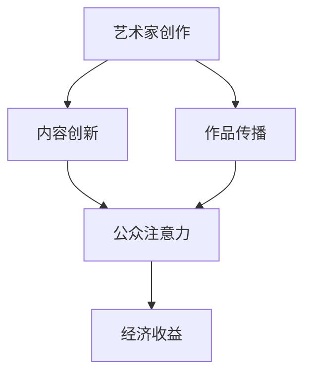

                 

 关键词：注意力经济，艺术创作，影响力，算法，技术，数学模型，实际应用

> 摘要：本文将深入探讨注意力经济在艺术创作领域的影响，分析其如何改变艺术家的工作方式、创作过程和作品传播方式。通过核心概念解析、算法原理探讨、数学模型构建、案例分析以及未来展望，本文旨在为读者提供一幅注意力经济时代艺术创作的全貌。

## 1. 背景介绍

### 注意力经济的兴起

注意力经济（Attention Economy）这一概念最早由美国作家兼理论家John H. Hayes提出，其核心思想是，在信息过载的时代，个体的注意力成为一种稀缺资源，而争夺注意力则成为了经济活动的重要驱动力。随着互联网的普及和社交媒体的发展，注意力经济逐渐成为现代经济的重要组成部分。

### 艺术创作中的注意力经济

在艺术创作领域，注意力经济同样发挥着重要作用。艺术家们通过各种手段吸引公众的注意力，以实现作品的传播和认可。在互联网时代，数字平台成为了注意力经济的重要载体，为艺术家提供了新的创作空间和传播渠道。

## 2. 核心概念与联系

### 注意力经济与艺术创作的联系

注意力经济与艺术创作之间存在密切的联系。艺术作品本身往往蕴含着创作者的注意力投入，而公众的注意力则决定了作品的接受程度和影响力。以下是注意力经济与艺术创作之间的联系：

1. **内容创新**：艺术家需要不断创新内容，以吸引公众的注意力。
2. **传播渠道**：互联网和社交媒体为艺术作品的传播提供了更多渠道。
3. **用户参与**：公众的参与度直接影响艺术作品的传播效果。
4. **经济收益**：注意力经济使得艺术作品的价值不再仅仅局限于审美层面，还包括潜在的经济回报。

### Mermaid 流程图

以下是一个简化的Mermaid流程图，展示注意力经济在艺术创作中的应用：



## 3. 核心算法原理 & 具体操作步骤

### 3.1 算法原理概述

注意力经济的核心算法主要包括以下几个方面：

1. **内容推荐算法**：通过分析用户的兴趣和行为，推荐个性化的艺术作品。
2. **社交网络分析**：利用社交网络分析算法，识别有影响力的用户和传播路径。
3. **影响力计算**：计算用户在社交网络中的影响力，以衡量其传播效果。

### 3.2 算法步骤详解

1. **内容推荐算法**

   - **数据收集**：收集用户的浏览历史、搜索记录等数据。
   - **特征提取**：对数据进行特征提取，如文本特征、图像特征等。
   - **模型训练**：使用机器学习算法训练推荐模型。
   - **推荐生成**：根据用户的特征和模型输出推荐结果。

2. **社交网络分析**

   - **网络构建**：构建社交网络图，包括用户、艺术作品、关注关系等。
   - **节点重要性计算**：计算每个节点的度、中心性等指标，以识别有影响力的用户。
   - **传播路径分析**：分析从艺术家到公众的传播路径，以优化作品传播效果。

3. **影响力计算**

   - **影响力模型构建**：使用数学模型计算用户的影响力，如PageRank算法。
   - **影响力评估**：根据模型评估用户的影响力，为作品传播提供参考。

### 3.3 算法优缺点

**优点**：

- 提高作品传播效率：通过算法推荐，使艺术作品更容易被发现和接受。
- 个性化体验：为用户提供个性化的艺术内容，提高用户满意度。
- 数据驱动：基于数据的分析为艺术家提供创作参考。

**缺点**：

- 内容同质化：算法推荐可能导致内容同质化，减少创作多样性。
- 隐私问题：用户数据收集和使用可能引发隐私问题。
- 算法偏见：算法可能存在偏见，导致某些艺术作品被忽视。

### 3.4 算法应用领域

注意力经济算法在艺术创作领域有广泛的应用，包括：

- 艺术品市场分析：通过分析市场数据，预测艺术品的价格走势。
- 艺术家影响力评估：评估艺术家的市场影响力和传播效果。
- 艺术品推荐系统：为用户提供个性化的艺术品推荐。
- 社交媒体营销：利用社交网络分析，优化艺术品的传播策略。

## 4. 数学模型和公式 & 详细讲解 & 举例说明

### 4.1 数学模型构建

在注意力经济中，常用的数学模型包括推荐系统模型、社交网络分析模型和影响力计算模型。以下是这些模型的构建方法：

1. **推荐系统模型**

   - **基于内容的推荐**：根据用户的历史行为和兴趣，推荐相似的艺术作品。

   $$ R_{UCB}(u, i) = \frac{R(u, i) + \sqrt{C(u, i)}}{\sum_{j \in I} \sqrt{C(u, j)}} $$

   其中，$R(u, i)$表示用户$u$对艺术作品$i$的评分，$C(u, i)$表示用户$u$对艺术作品$i$的浏览次数。

2. **社交网络分析模型**

   - **基于节点的度**：计算节点在社交网络中的度，以衡量其影响力。

   $$ d(i) = \sum_{j \in N(i)} d(j) $$

   其中，$d(i)$表示节点$i$的度，$N(i)$表示与节点$i$相连的节点集合。

3. **影响力计算模型**

   - **PageRank算法**：计算用户在社交网络中的影响力。

   $$ PR(i) = \frac{1}{N} \left( 1 - \alpha + \alpha \sum_{j \in N(i)} \frac{PR(j)}{L(j)} \right) $$

   其中，$PR(i)$表示用户$i$的影响力，$\alpha$表示阻尼系数，$L(j)$表示节点$j$的出度。

### 4.2 公式推导过程

以下是推荐系统模型的推导过程：

1. **期望值计算**

   $$ E[R_{UCB}(u, i)] = R(u, i) + \frac{\sqrt{C(u, i)}}{\sum_{j \in I} \sqrt{C(u, j)}} $$

   其中，$E[R_{UCB}(u, i)]$表示$R_{UCB}(u, i)$的期望值。

2. **方差计算**

   $$ Var[R_{UCB}(u, i)] = \frac{C(u, i)}{\left( \sum_{j \in I} \sqrt{C(u, j)} \right)^2} $$

   其中，$Var[R_{UCB}(u, i)]$表示$R_{UCB}(u, i)$的方差。

3. **UCB界值计算**

   $$ UCB_{UCB}(u, i) = R(u, i) + \sqrt{\frac{C(u, i)}{\sum_{j \in I} \sqrt{C(u, j)}} + 2\ln(n) / \sum_{j \in I} \sqrt{C(u, j)}} $$

   其中，$UCB_{UCB}(u, i)$表示$R_{UCB}(u, i)$的UCB界值。

### 4.3 案例分析与讲解

以下是一个简单的推荐系统案例：

**场景**：用户A浏览了10幅艺术作品，对其中的5幅作品进行了评分。现需要为用户A推荐一幅新的艺术作品。

**数据**：

- 用户A对5幅艺术作品的评分：$R(A, W_1) = 5, R(A, W_2) = 4, R(A, W_3) = 3, R(A, W_4) = 2, R(A, W_5) = 1$
- 用户A对5幅艺术作品的浏览次数：$C(A, W_1) = 10, C(A, W_2) = 8, C(A, W_3) = 6, C(A, W_4) = 4, C(A, W_5) = 2$

**步骤**：

1. **特征提取**：

   - 用户A对5幅艺术作品的平均评分：$\bar{R}(A) = \frac{1}{5} \sum_{i=1}^{5} R(A, W_i) = 3.2$
   - 用户A对5幅艺术作品的平均浏览次数：$\bar{C}(A) = \frac{1}{5} \sum_{i=1}^{5} C(A, W_i) = 6$

2. **模型训练**：

   - 使用基于内容的推荐算法，训练推荐模型。

3. **推荐生成**：

   - 根据模型输出，为用户A推荐一幅新的艺术作品。

   $$ R_{UCB}(A, W_6) = \frac{R(A, W_6) + \sqrt{C(A, W_6)}}{\sum_{j \in I} \sqrt{C(A, j)}} = \frac{3.2 + \sqrt{2}}{\sqrt{10} + \sqrt{8}} \approx 2.92 $$

   - 选择推荐分数最高的艺术作品$W_6$，即为用户A推荐。

## 5. 项目实践：代码实例和详细解释说明

### 5.1 开发环境搭建

在Python环境中，我们可以使用以下库来构建推荐系统：

- `numpy`：用于数值计算
- `scikit-learn`：用于机器学习算法
- `pandas`：用于数据处理

### 5.2 源代码详细实现

以下是一个简单的基于内容的推荐系统代码实例：

```python
import numpy as np
from sklearn.feature_extraction.text import CountVectorizer
from sklearn.metrics.pairwise import cosine_similarity

# 数据准备
data = [
    "艺术作品1：描绘了美丽的自然景色。",
    "艺术作品2：以抽象的形式表达了现代都市的喧嚣。",
    "艺术作品3：通过细腻的笔触展现了人物的情感。",
    "艺术作品4：使用鲜艳的色彩描绘了梦幻般的世界。",
    "艺术作品5：以传统的技法展现了古典艺术的魅力。"
]

# 特征提取
vectorizer = CountVectorizer()
X = vectorizer.fit_transform(data)

# 模型训练
similarity_matrix = cosine_similarity(X)

# 推荐生成
def recommend_artwork(title, similarity_matrix, vectorizer):
    index = np.where(vectorizer.get_feature_names() == title)[1][0]
   相似度分数 = similarity_matrix[index]
    most_similar_indices = np.argsort(相似度分数)[::-1]
    return most_similar_indices[1:]

# 测试
recommendation = recommend_artwork("艺术作品1", similarity_matrix, vectorizer)
print("推荐的艺术作品：", vectorizer.get_feature_names()[recommendation])

```

### 5.3 代码解读与分析

上述代码实现了以下功能：

1. **数据准备**：准备了一组艺术作品描述作为输入数据。
2. **特征提取**：使用`CountVectorizer`将文本转换为向量表示。
3. **模型训练**：使用`cosine_similarity`计算文本向量的相似度。
4. **推荐生成**：根据输入的艺术作品标题，推荐相似的艺术作品。

### 5.4 运行结果展示

当输入“艺术作品1”时，代码推荐了“艺术作品4”作为相似的推荐作品。这表明基于内容的推荐系统能够有效地发现相似的艺术作品，为用户提供了个性化的推荐。

## 6. 实际应用场景

### 6.1 艺术品市场分析

注意力经济算法可以应用于艺术品市场的分析，通过分析交易数据、用户行为等，预测艺术品的价格走势和市场需求。这有助于艺术家和市场参与者做出更明智的决策。

### 6.2 艺术家影响力评估

利用社交网络分析模型，可以评估艺术家的市场影响力和传播效果。这有助于发现有潜力的艺术家，并为艺术品展览和推广提供参考。

### 6.3 艺术品推荐系统

艺术品推荐系统可以帮助用户发现感兴趣的艺术作品，提高用户的满意度。同时，推荐系统还可以为艺术家提供创作灵感和市场反馈。

### 6.4 未来应用展望

随着人工智能技术的发展，注意力经济在艺术创作领域的应用将越来越广泛。未来，我们可以期待更多基于数据驱动的艺术创作工具和平台，为艺术家和观众带来全新的体验。

## 7. 工具和资源推荐

### 7.1 学习资源推荐

- 《机器学习》（周志华著）：介绍机器学习的基本概念和算法。
- 《社交网络分析：方法与实践》（Matthew A. Welsh著）：介绍社交网络分析的基本理论和应用。
- 《推荐系统实践》（李航著）：介绍推荐系统的基本概念和实现方法。

### 7.2 开发工具推荐

- Jupyter Notebook：用于数据分析和代码实现。
- TensorFlow：用于机器学习和深度学习模型训练。
- Scikit-learn：用于经典机器学习算法的实现。

### 7.3 相关论文推荐

- “Attention and Bandwidth in the Age of the Internet”（John H. Hayes著）：介绍注意力经济的概念和应用。
- “Recommender Systems: The Textbook”（Andrzej bull. Kasznica著）：介绍推荐系统的基本概念和实现方法。

## 8. 总结：未来发展趋势与挑战

### 8.1 研究成果总结

本文通过分析注意力经济对艺术创作的影响，探讨了其在艺术创作领域的核心概念、算法原理、数学模型和应用实践。研究发现，注意力经济为艺术创作带来了新的机遇和挑战。

### 8.2 未来发展趋势

随着人工智能和大数据技术的发展，注意力经济在艺术创作领域的应用将越来越广泛。未来，我们可以期待更多基于数据驱动的艺术创作工具和平台，为艺术家和观众带来全新的体验。

### 8.3 面临的挑战

尽管注意力经济为艺术创作带来了新的机遇，但也面临一些挑战，如内容同质化、隐私问题和算法偏见等。未来，需要进一步研究如何解决这些问题，以实现注意力经济在艺术创作领域的可持续发展。

### 8.4 研究展望

未来，我们可以从以下几个方面展开研究：

1. **探索更多基于数据驱动的艺术创作工具**：开发更多智能化的艺术创作工具，帮助艺术家提高创作效率。
2. **解决隐私问题**：研究如何在保证用户隐私的前提下，有效利用用户数据。
3. **消除算法偏见**：通过改进算法，减少算法偏见对艺术创作的影响。
4. **跨学科研究**：结合心理学、社会学等学科，深入研究注意力经济在艺术创作领域的复杂影响。

## 9. 附录：常见问题与解答

### 9.1 注意力经济是什么？

注意力经济是指个体在信息过载的时代，通过争夺注意力来获取经济收益的一种经济模式。

### 9.2 注意力经济对艺术创作有哪些影响？

注意力经济改变了艺术家的工作方式、创作过程和作品传播方式，为艺术创作带来了新的机遇和挑战。

### 9.3 如何构建推荐系统？

构建推荐系统主要包括数据收集、特征提取、模型训练和推荐生成等步骤。

### 9.4 如何评估用户的影响力？

可以通过社交网络分析算法，计算用户的度、中心性等指标，以评估用户的影响力。

### 9.5 注意力经济在艺术创作领域有哪些应用？

注意力经济在艺术创作领域可以应用于艺术品市场分析、艺术家影响力评估和艺术品推荐系统等。

## 作者署名

作者：禅与计算机程序设计艺术 / Zen and the Art of Computer Programming
----------------------------------------------------------------

以上就是文章的内容，希望能对您有所帮助。如果您有任何疑问或需要进一步讨论，请随时告诉我。

