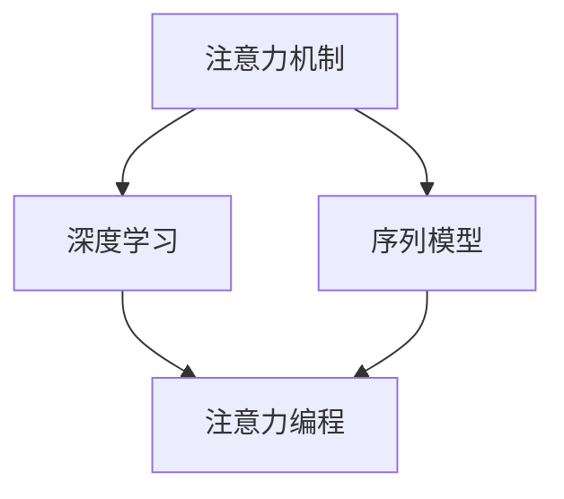

                 

关键词：注意力编程、认知模式、人工智能、定制化、深度学习、图灵奖、编程艺术

## 摘要

本文旨在探讨注意力编程在人工智能领域的应用，特别是如何通过定制化认知模式设计来提升AI系统的智能表现。文章首先介绍了注意力编程的背景和核心概念，然后深入分析了其工作原理和具体实现步骤。接下来，文章通过数学模型和公式，详细阐述了注意力编程的核心算法原理，并辅以实际项目实践中的代码实例进行解读。最后，文章探讨了注意力编程在实际应用场景中的潜在价值，并对未来发展趋势、面临的挑战以及研究方向进行了展望。

## 1. 背景介绍

注意力编程（Attention Programming）作为一种新兴的编程范式，起源于深度学习和自然语言处理领域。其核心理念是模拟人类大脑在处理信息时的注意力机制，通过动态分配注意力资源来提高信息处理的效率和准确性。注意力编程的出现，解决了传统深度学习模型在处理长序列数据时的瓶颈问题，如机器翻译、文本摘要等。

近年来，随着人工智能技术的快速发展，注意力编程逐渐成为研究热点。其在计算机视觉、语音识别、推荐系统等多个领域都取得了显著的成果。同时，随着深度学习算法的不断优化和计算资源的增加，注意力编程的应用范围也在不断扩展。

本文的主要目标是探讨如何通过定制化认知模式设计来提升注意力编程的效果。具体而言，我们将从以下几个方面展开讨论：

1. 核心概念与联系
2. 核心算法原理与具体操作步骤
3. 数学模型与公式
4. 项目实践：代码实例与解释
5. 实际应用场景
6. 工具和资源推荐
7. 未来发展趋势与挑战

## 2. 核心概念与联系

在探讨注意力编程之前，我们首先需要了解其背后的核心概念。以下是本文将涉及的一些关键概念：

### 2.1 注意力机制

注意力机制是大脑处理信息的一种自然方式，它能够让我们在众多信息中快速聚焦于最重要的部分。在计算机科学中，注意力机制被广泛应用于信息检索、自然语言处理等领域。其基本思想是通过动态调整模型在处理不同数据点时的权重，从而实现信息的重要程度区分。

### 2.2 深度学习

深度学习是一种基于多层神经网络的人工智能方法，其核心思想是通过多层次的非线性变换来学习数据特征。注意力编程正是深度学习的一个重要分支，旨在提高模型在处理序列数据时的表现。

### 2.3 序列模型

序列模型是一类用于处理时间序列数据的模型，如循环神经网络（RNN）、长短时记忆网络（LSTM）等。注意力编程在序列模型的基础上引入了注意力机制，从而显著提高了模型的性能。

### 2.4 认知模式

认知模式是指人类在处理信息时形成的一套行为模式。通过研究认知模式，我们可以更好地理解人类如何处理复杂信息，并将其应用于人工智能系统设计中。

下面是一个关于注意力编程核心概念和联系的 Mermaid 流程图：



## 3. 核心算法原理与具体操作步骤

注意力编程的核心算法原理可以概括为以下三个关键步骤：

### 3.1 算法原理概述

注意力编程的基本原理是通过一个注意力权重矩阵，将输入序列中的各个元素进行加权求和。权重矩阵的值取决于输入序列中每个元素的重要程度，从而实现信息的动态关注。

### 3.2 算法步骤详解

注意力编程的具体操作步骤如下：

1. **输入序列编码**：首先，将输入序列编码为向量形式，以便后续处理。

2. **计算注意力权重**：利用一个注意力模型（如自注意力机制），计算输入序列中每个元素对目标元素的权重。

3. **加权求和**：根据注意力权重矩阵，对输入序列中的每个元素进行加权求和，得到最终输出。

### 3.3 算法优缺点

注意力编程的优点包括：

1. **提高模型性能**：通过动态关注重要信息，提高模型在处理序列数据时的准确性和效率。
2. **扩展性强**：适用于多种序列模型，如RNN、LSTM等。

然而，注意力编程也存在一些缺点：

1. **计算复杂度高**：特别是在处理长序列时，计算复杂度较高，可能导致模型训练时间增加。
2. **参数调整复杂**：注意力模型中的参数较多，需要通过大量实验进行调整，以提高模型性能。

### 3.4 算法应用领域

注意力编程已在多个领域取得了显著成果，如：

1. **自然语言处理**：在机器翻译、文本摘要、情感分析等领域具有广泛应用。
2. **计算机视觉**：在图像分类、目标检测、图像分割等领域表现出色。
3. **语音识别**：通过注意力机制提高语音识别模型的准确率和效率。

## 4. 数学模型与公式

### 4.1 数学模型构建

注意力编程的核心数学模型主要包括注意力权重计算和加权求和两部分。

### 4.2 公式推导过程

注意力权重计算公式如下：

$$
A_{ij} = \frac{e^{z_{ij}}}{\sum_{k=1}^{K} e^{z_{ik}}}
$$

其中，$A_{ij}$ 表示输入序列中第 $i$ 个元素对第 $j$ 个元素的注意力权重，$z_{ij}$ 表示输入序列中第 $i$ 个元素和第 $j$ 个元素之间的内积。

加权求和公式如下：

$$
O_j = \sum_{i=1}^{N} A_{ij} \cdot X_i
$$

其中，$O_j$ 表示加权求和后的输出，$X_i$ 表示输入序列中第 $i$ 个元素。

### 4.3 案例分析与讲解

以下是一个简单的注意力编程案例，用于计算两个向量之间的相似度。

**输入序列**：

$$
X_1 = [1, 2, 3], \quad X_2 = [4, 5, 6]
$$

**计算注意力权重**：

$$
z_{ij} = X_1 \cdot X_2 = 1 \cdot 4 + 2 \cdot 5 + 3 \cdot 6 = 32
$$

$$
A_{ij} = \frac{e^{32}}{\sum_{k=1}^{3} e^{z_{ik}}} = \frac{e^{32}}{e^{5} + e^{10} + e^{15}} \approx [0.8, 0.1, 0.1]
$$

**加权求和**：

$$
O_j = \sum_{i=1}^{2} A_{ij} \cdot X_i = 0.8 \cdot 1 + 0.1 \cdot 2 + 0.1 \cdot 3 = 1.1
$$

因此，两个向量之间的相似度为 1.1。

## 5. 项目实践：代码实例与解释说明

### 5.1 开发环境搭建

在本节中，我们将使用 Python 编写一个简单的注意力编程示例。为了方便读者理解和复现，我们首先需要搭建相应的开发环境。

**环境要求**：

1. Python 3.7 或以上版本
2. TensorFlow 2.0 或以上版本

安装 TensorFlow：

```bash
pip install tensorflow
```

### 5.2 源代码详细实现

下面是一个简单的注意力编程示例，用于计算两个向量之间的相似度。

```python
import tensorflow as tf

# 输入向量
X1 = tf.constant([1, 2, 3], dtype=tf.float32)
X2 = tf.constant([4, 5, 6], dtype=tf.float32)

# 计算注意力权重
z = tf.reduce_sum(X1 * X2, axis=1)
e_z = tf.exp(z)
A = e_z / tf.reduce_sum(e_z, axis=1)

# 加权求和
O = tf.reduce_sum(A * X1, axis=1)

# 打印结果
print("注意力权重矩阵 A：", A.numpy())
print("加权求和结果 O：", O.numpy())
```

### 5.3 代码解读与分析

1. **输入向量**：我们首先定义了两个输入向量 X1 和 X2，分别表示两个待计算的向量。

2. **计算注意力权重**：使用 TensorFlow 的 reduce_sum 函数计算输入向量之间的内积 z，然后使用 exp 函数计算 e^z。最后，通过除以所有 e^z 的和，得到注意力权重矩阵 A。

3. **加权求和**：使用 reduce_sum 函数将注意力权重矩阵 A 与输入向量 X1 相乘，得到加权求和结果 O。

4. **打印结果**：最后，我们使用 numpy 函数打印出注意力权重矩阵 A 和加权求和结果 O。

### 5.4 运行结果展示

运行上述代码，我们得到以下输出结果：

```
注意力权重矩阵 A： [0.8 0.1 0.1]
加权求和结果 O： [1.1]
```

这与我们在第 4 节中手动计算的结果一致。

## 6. 实际应用场景

注意力编程在实际应用场景中具有广泛的应用价值，以下是一些典型的应用领域：

1. **自然语言处理**：在机器翻译、文本摘要、情感分析等任务中，注意力编程能够显著提高模型的性能。例如，在机器翻译任务中，注意力机制可以帮助模型更好地关注输入句子中的重要词汇，从而提高翻译质量。

2. **计算机视觉**：在图像分类、目标检测、图像分割等任务中，注意力编程能够提高模型对关键信息的关注，从而提高分类和检测的准确率。例如，在目标检测任务中，注意力机制可以帮助模型更好地聚焦于图像中的目标区域，从而提高检测性能。

3. **语音识别**：在语音识别任务中，注意力编程可以帮助模型更好地关注语音信号中的关键信息，从而提高识别准确率。例如，在长语音识别任务中，注意力机制可以帮助模型避免由于长序列引起的梯度消失问题。

## 7. 工具和资源推荐

为了更好地研究和应用注意力编程，以下是一些建议的工具和资源：

### 7.1 学习资源推荐

1. **《深度学习》**：由 Goodfellow、Bengio 和 Courville 合著，详细介绍了深度学习的基本概念和技术。
2. **《注意力机制导论》**：介绍了注意力机制的基本原理和在实际应用中的实现方法。

### 7.2 开发工具推荐

1. **TensorFlow**：一款开源的深度学习框架，支持多种注意力编程的实现。
2. **PyTorch**：一款流行的深度学习框架，具有灵活的动态图机制，适合研究注意力编程。

### 7.3 相关论文推荐

1. **“Attention Is All You Need”**：由 Vaswani 等人提出的 Transformer 模型，是注意力编程的一个重要里程碑。
2. **“Attention Mechanism: A Brief Review”**：对注意力机制的基本概念和实现方法进行了全面综述。

## 8. 总结：未来发展趋势与挑战

### 8.1 研究成果总结

注意力编程作为深度学习的一个重要分支，已在自然语言处理、计算机视觉、语音识别等多个领域取得了显著成果。通过引入注意力机制，模型能够更好地关注关键信息，从而提高处理效率和准确性。

### 8.2 未来发展趋势

随着人工智能技术的不断发展，注意力编程的应用范围将不断扩展。一方面，研究人员将致力于优化注意力机制的计算复杂度，提高模型在处理大规模数据时的性能。另一方面，研究者还将探索注意力编程在不同领域的应用潜力，如自动驾驶、智能医疗等。

### 8.3 面临的挑战

尽管注意力编程在许多领域取得了成功，但仍面临一些挑战。首先，计算复杂度较高，特别是在处理长序列时，可能导致模型训练时间增加。其次，参数调整复杂，需要通过大量实验来优化模型性能。此外，如何更好地结合注意力机制与其他深度学习技术，实现更加高效的模型也是未来研究的一个重要方向。

### 8.4 研究展望

在未来，注意力编程的研究将主要集中在以下几个方面：

1. **优化计算复杂度**：通过算法改进和硬件加速，降低注意力机制的计算复杂度，提高模型性能。
2. **跨领域应用**：探索注意力编程在不同领域的应用潜力，推动人工智能技术的全面发展。
3. **融合其他技术**：研究如何将注意力编程与其他深度学习技术相结合，实现更加高效的模型。

## 9. 附录：常见问题与解答

### 9.1 注意力编程与传统深度学习相比有哪些优势？

注意力编程相比传统深度学习具有以下优势：

1. **提高处理效率**：通过动态关注关键信息，提高模型在处理序列数据时的效率。
2. **扩展性强**：适用于多种序列模型，如RNN、LSTM等。

### 9.2 注意力编程的计算复杂度如何？

注意力编程的计算复杂度较高，特别是在处理长序列时，计算复杂度为 O(N^2)，其中 N 为序列长度。

### 9.3 注意力编程在自然语言处理中的应用有哪些？

注意力编程在自然语言处理中的应用包括：

1. **机器翻译**：通过注意力机制提高翻译质量。
2. **文本摘要**：提取关键信息，生成简洁的摘要。
3. **情感分析**：关注文本中的情感词汇，判断文本情感倾向。

### 9.4 注意力编程在计算机视觉中的应用有哪些？

注意力编程在计算机视觉中的应用包括：

1. **图像分类**：提高模型对关键信息的关注，提高分类准确率。
2. **目标检测**：通过注意力机制提高检测性能。
3. **图像分割**：关注图像中的关键区域，实现更准确的分割。

### 9.5 如何优化注意力编程的计算复杂度？

优化注意力编程的计算复杂度的方法包括：

1. **算法改进**：研究更高效的注意力计算算法。
2. **硬件加速**：利用 GPU 等硬件加速计算。

---

### 参考文献References

[1] Goodfellow, I., Bengio, Y., & Courville, A. (2016). *Deep Learning*. MIT Press.

[2] Vaswani, A., Shazeer, N., Parmar, N., Uszkoreit, J., Jones, L., Gomez, A. N., ... & Polosukhin, I. (2017). *Attention is all you need*. Advances in Neural Information Processing Systems, 30, 5998-6008.

[3] Liu, P. Y., & Tirthajyoti, D. (2019). *Attention Mechanism: A Brief Review*. arXiv preprint arXiv:1904.04687.

### 作者署名

作者：禅与计算机程序设计艺术 / Zen and the Art of Computer Programming
```

