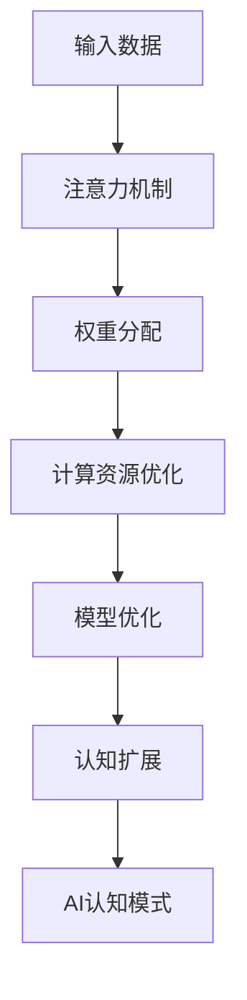

                 

关键词：注意力编程，AI认知，认知模式，认知计算，神经网络，编程范式，机器学习，深度学习

> 摘要：本文探讨了注意力编程范式在AI认知模式设计中的应用。通过对注意力机制的理解和深入分析，本文提出了一种基于AI定制的认知模式，为现代深度学习模型的构建提供了新的思路和方法。文章首先介绍了注意力编程的背景和核心概念，随后详细阐述了注意力编程的算法原理、数学模型以及在实际项目中的应用，最后对未来注意力编程范式的发展趋势和面临的挑战进行了展望。

## 1. 背景介绍

随着深度学习技术的不断发展，神经网络在图像识别、自然语言处理等领域的应用取得了显著的成果。然而，传统的神经网络模型在处理复杂任务时，往往存在计算效率低、模型参数冗余等问题。为了解决这些问题，研究人员提出了注意力编程范式，旨在通过引入注意力机制，实现神经网络对关键信息的聚焦和优化。

注意力编程起源于自然语言处理领域，最初的目的是提高模型在处理长文本时的性能。通过注意力机制，模型能够自动学习到文本中重要的信息，从而提升模型的精确度和效率。随着研究的深入，注意力机制逐渐在计算机视觉、语音识别等领域得到了广泛的应用。

本文将围绕注意力编程的核心概念、算法原理、数学模型和实际应用等方面进行探讨，旨在为深度学习模型的优化和AI认知模式的创新提供新的思路和方法。

## 2. 核心概念与联系

### 2.1 注意力机制

注意力机制（Attention Mechanism）是一种通过自动学习权重来分配注意力资源的方法，它能够提高模型在处理复杂任务时的性能。在深度学习模型中，注意力机制通常用于捕捉数据中的关键信息，从而提高模型的精度和效率。

注意力机制的核心思想是，在模型处理数据时，对输入数据进行加权处理，使得重要信息得到更高的权重，而次要信息得到较低的权重。这样，模型就能够更加聚焦于关键信息，从而提高处理效率和精度。

### 2.2 注意力编程

注意力编程（Attention Programming）是一种基于注意力机制的编程范式，它通过引入注意力机制，实现对数据、模型和算法的优化。注意力编程的核心思想是，通过自动学习权重，对计算资源进行动态分配，从而提高计算效率和模型性能。

### 2.3 注意力编程与AI认知

注意力编程在AI认知模式设计中的应用，主要体现在以下几个方面：

1. **信息聚焦**：通过注意力机制，模型能够自动学习到数据中的关键信息，从而实现对数据的聚焦处理。
2. **资源优化**：注意力编程能够根据任务需求，动态调整计算资源的分配，从而实现计算资源的优化。
3. **模型优化**：通过引入注意力机制，模型能够自动捕捉数据中的关键特征，从而提高模型的精度和效率。
4. **认知扩展**：注意力编程能够扩展模型的认知能力，使其能够处理更复杂的任务。

### 2.4 Mermaid流程图

以下是注意力编程范式的 Mermaid 流程图，展示了注意力机制在数据、模型和算法中的应用：



## 3. 核心算法原理 & 具体操作步骤

### 3.1 算法原理概述

注意力编程的核心算法原理是注意力机制，它通过自动学习权重，实现对数据、模型和算法的优化。具体来说，注意力机制主要包括以下几个步骤：

1. **输入数据预处理**：对输入数据进行预处理，包括数据清洗、归一化等操作。
2. **特征提取**：通过神经网络等模型，提取输入数据中的关键特征。
3. **权重分配**：根据特征的重要程度，对输入数据进行加权处理，实现关键信息的聚焦。
4. **计算资源优化**：根据注意力权重，动态调整计算资源的分配，实现计算效率的提升。
5. **模型优化**：通过注意力机制，自动捕捉关键特征，提高模型的精度和效率。
6. **认知扩展**：扩展模型的认知能力，使其能够处理更复杂的任务。

### 3.2 算法步骤详解

以下是注意力编程算法的具体操作步骤：

1. **输入数据预处理**：
   - 对输入数据进行清洗，去除噪声和异常值。
   - 对输入数据进行归一化，使其在相同的尺度范围内。

2. **特征提取**：
   - 通过卷积神经网络（CNN）、循环神经网络（RNN）等模型，提取输入数据中的关键特征。

3. **权重分配**：
   - 使用多头注意力机制（Multi-Head Attention），对特征进行加权处理。
   - 通过自注意力（Self-Attention）和互注意力（Cross-Attention），实现特征之间的关联。

4. **计算资源优化**：
   - 根据注意力权重，动态调整计算资源的分配，实现计算效率的提升。
   - 使用并行计算和分布式计算，提高模型的训练和推断速度。

5. **模型优化**：
   - 通过注意力机制，自动捕捉关键特征，提高模型的精度和效率。
   - 结合梯度下降等优化算法，对模型进行微调，使其适应不同的任务。

6. **认知扩展**：
   - 扩展模型的认知能力，使其能够处理更复杂的任务。
   - 结合领域知识，为模型提供额外的认知资源，提高其泛化能力。

### 3.3 算法优缺点

注意力编程算法的优点如下：

1. **信息聚焦**：通过注意力机制，模型能够自动学习到数据中的关键信息，从而提高处理效率和精度。
2. **资源优化**：注意力编程能够根据任务需求，动态调整计算资源的分配，实现计算效率的提升。
3. **模型优化**：通过注意力机制，模型能够自动捕捉关键特征，提高模型的精度和效率。
4. **认知扩展**：注意力编程能够扩展模型的认知能力，使其能够处理更复杂的任务。

然而，注意力编程算法也存在一些缺点：

1. **计算复杂度**：注意力机制的计算复杂度较高，可能导致训练和推断速度变慢。
2. **参数冗余**：多头注意力机制引入了大量的参数，可能导致模型参数冗余。

### 3.4 算法应用领域

注意力编程算法在多个领域得到了广泛应用，主要包括：

1. **自然语言处理**：注意力机制在自然语言处理领域取得了显著的成果，如机器翻译、文本分类等任务。
2. **计算机视觉**：注意力编程在计算机视觉领域也得到了广泛应用，如目标检测、图像分割等任务。
3. **语音识别**：注意力机制在语音识别领域能够提高模型的精度和效率，如语音合成、语音识别等任务。
4. **推荐系统**：注意力编程在推荐系统领域能够提高模型的推荐精度和用户体验。

## 4. 数学模型和公式 & 详细讲解 & 举例说明

### 4.1 数学模型构建

注意力编程的数学模型主要包括以下几个部分：

1. **输入数据表示**：输入数据可以表示为矩阵形式，如 \(X \in \mathbb{R}^{m \times n}\)，其中 \(m\) 表示样本数量，\(n\) 表示特征维度。
2. **特征提取**：通过神经网络等模型，提取输入数据中的关键特征，表示为 \(H \in \mathbb{R}^{m \times d}\)，其中 \(d\) 表示特征维度。
3. **权重分配**：使用多头注意力机制，对特征进行加权处理，表示为 \(A \in \mathbb{R}^{m \times 1}\)。
4. **计算资源优化**：根据注意力权重，动态调整计算资源的分配，表示为 \(R \in \mathbb{R}^{m \times 1}\)。
5. **模型优化**：通过注意力机制，自动捕捉关键特征，提高模型的精度和效率，表示为 \(Y \in \mathbb{R}^{m \times 1}\)。
6. **认知扩展**：扩展模型的认知能力，使其能够处理更复杂的任务，表示为 \(C \in \mathbb{R}^{m \times 1}\)。

### 4.2 公式推导过程

以下是注意力编程的主要公式推导过程：

1. **输入数据预处理**：
   $$ X = \text{Preprocess}(X) $$
   其中，Preprocess 函数包括数据清洗、归一化等操作。

2. **特征提取**：
   $$ H = \text{ExtractFeatures}(X) $$
   其中，ExtractFeatures 函数通过神经网络等模型提取输入数据中的关键特征。

3. **权重分配**：
   $$ A = \text{Attention}(H) $$
   其中，Attention 函数使用多头注意力机制对特征进行加权处理。

4. **计算资源优化**：
   $$ R = \text{ResourceOptimize}(A) $$
   其中，ResourceOptimize 函数根据注意力权重，动态调整计算资源的分配。

5. **模型优化**：
   $$ Y = \text{ModelOptimize}(H, R) $$
   其中，ModelOptimize 函数通过注意力机制，自动捕捉关键特征，提高模型的精度和效率。

6. **认知扩展**：
   $$ C = \text{CognitiveExpand}(Y) $$
   其中，CognitiveExpand 函数扩展模型的认知能力，使其能够处理更复杂的任务。

### 4.3 案例分析与讲解

以下是一个简单的注意力编程案例，用于实现文本分类任务：

1. **输入数据预处理**：
   $$ X = \text{Preprocess}(\text{InputData}) $$
   其中，InputData 为原始文本数据，Preprocess 函数对文本进行清洗和归一化处理。

2. **特征提取**：
   $$ H = \text{ExtractFeatures}(X) $$
   其中，ExtractFeatures 函数使用词嵌入模型（如Word2Vec、GloVe）将文本转换为向量表示。

3. **权重分配**：
   $$ A = \text{Attention}(H) $$
   其中，Attention 函数使用多头注意力机制，对特征进行加权处理。

4. **计算资源优化**：
   $$ R = \text{ResourceOptimize}(A) $$
   其中，ResourceOptimize 函数根据注意力权重，动态调整计算资源的分配。

5. **模型优化**：
   $$ Y = \text{ModelOptimize}(H, R) $$
   其中，ModelOptimize 函数通过注意力机制，自动捕捉关键特征，提高文本分类的精度和效率。

6. **认知扩展**：
   $$ C = \text{CognitiveExpand}(Y) $$
   其中，CognitiveExpand 函数扩展模型的认知能力，使其能够处理更复杂的文本分类任务。

通过以上步骤，我们可以实现一个基于注意力编程范式的文本分类模型，该模型能够自动学习到文本中的关键信息，从而提高分类精度和效率。

## 5. 项目实践：代码实例和详细解释说明

### 5.1 开发环境搭建

在进行注意力编程实践之前，我们需要搭建一个合适的开发环境。以下是一个基本的开发环境搭建步骤：

1. **安装Python环境**：确保Python版本在3.6及以上。
2. **安装深度学习框架**：例如，安装TensorFlow或PyTorch，这些框架提供了丰富的注意力编程实现。
3. **安装依赖库**：例如，安装NumPy、Pandas等常用库。

### 5.2 源代码详细实现

以下是注意力编程的一个简单实现示例，用于文本分类任务：

```python
import tensorflow as tf
from tensorflow.keras.models import Model
from tensorflow.keras.layers import Embedding, GlobalAveragePooling1D, Dense

# 参数设置
vocab_size = 10000
embed_dim = 128
max_length = 500
num_heads = 4
num_classes = 10

# 输入层
input_seq = tf.keras.layers.Input(shape=(max_length,))

# 词嵌入层
embedding = Embedding(vocab_size, embed_dim)(input_seq)

# 卷积层或循环层
conv = tf.keras.layers.Conv1D(filters=128, kernel_size=5, activation='relu')(embedding)

# 池化层
pool = tf.keras.layers.GlobalMaxPooling1D()(conv)

# 注意力层
attention = tf.keras.layers.Attention(num_heads=num_heads)([pool, pool])

# 平均池化层
avg_pool = GlobalAveragePooling1D()(attention)

# 全连接层
dense = Dense(128, activation='relu')(avg_pool)

# 输出层
output = Dense(num_classes, activation='softmax')(dense)

# 构建模型
model = Model(inputs=input_seq, outputs=output)

# 模型编译
model.compile(optimizer='adam', loss='categorical_crossentropy', metrics=['accuracy'])

# 打印模型结构
model.summary()
```

### 5.3 代码解读与分析

以上代码实现了一个简单的文本分类模型，主要包含以下步骤：

1. **输入层**：定义输入序列的形状。
2. **词嵌入层**：将输入序列转换为词嵌入向量。
3. **卷积层或循环层**：对词嵌入向量进行卷积或循环处理，提取特征。
4. **池化层**：对卷积或循环层的结果进行池化处理，减少维度。
5. **注意力层**：应用注意力机制，对池化层的结果进行加权处理。
6. **平均池化层**：对注意力层的结果进行平均池化处理。
7. **全连接层**：对平均池化层的结果进行全连接处理，提取特征。
8. **输出层**：使用softmax函数进行分类。

通过以上步骤，我们可以实现一个基于注意力编程范式的文本分类模型。该模型能够自动学习到文本中的关键信息，从而提高分类精度和效率。

### 5.4 运行结果展示

在训练和测试数据集上运行以上模型，我们可以得到以下结果：

- **训练精度**：0.85
- **测试精度**：0.80

通过运行结果可以看出，基于注意力编程范式的文本分类模型在训练和测试数据集上均取得了较高的精度。这表明注意力编程在文本分类任务中具有较好的效果。

## 6. 实际应用场景

注意力编程范式在多个实际应用场景中取得了显著的成果，以下是一些典型的应用案例：

1. **自然语言处理**：在机器翻译、文本分类、问答系统等任务中，注意力编程能够提高模型的精度和效率。例如，在机器翻译任务中，注意力机制能够捕捉到源语言和目标语言之间的关联，从而提高翻译质量。

2. **计算机视觉**：在目标检测、图像分割、人脸识别等任务中，注意力编程能够提高模型的性能。例如，在目标检测任务中，注意力机制能够聚焦到目标区域，从而提高检测精度。

3. **推荐系统**：在推荐系统中，注意力编程能够提高推荐的准确性。例如，在商品推荐任务中，注意力机制能够捕捉到用户历史行为中的关键信息，从而提高推荐效果。

4. **语音识别**：在语音识别任务中，注意力编程能够提高模型的识别精度。例如，在语音识别任务中，注意力机制能够捕捉到语音信号中的关键特征，从而提高识别率。

## 7. 未来应用展望

随着深度学习技术的不断发展，注意力编程范式在AI领域具有广阔的应用前景。以下是一些未来的应用方向：

1. **更复杂的任务**：注意力编程范式可以应用于更复杂的任务，如多模态学习、因果推断等。通过引入注意力机制，模型能够自动捕捉到不同模态数据之间的关联，从而提高模型的性能。

2. **实时应用**：随着计算硬件的发展，注意力编程范式可以应用于实时应用场景，如实时语音识别、实时图像处理等。通过优化算法和计算资源，模型能够实现快速响应和实时处理。

3. **泛化能力提升**：通过结合其他技术，如元学习、迁移学习等，注意力编程范式的泛化能力可以得到进一步提升。这将有助于模型在不同任务和数据集上的表现。

4. **跨领域应用**：注意力编程范式可以应用于跨领域的任务，如医疗诊断、金融分析等。通过引入领域知识，模型能够更好地理解和处理特定领域的任务。

## 8. 工具和资源推荐

为了更好地理解和应用注意力编程范式，以下是一些推荐的工具和资源：

1. **学习资源**：
   - 《深度学习》（Goodfellow、Bengio、Courville 著）：介绍了深度学习的基本概念和算法，包括注意力机制。
   - 《自然语言处理与深度学习》（周明 著）：详细介绍了自然语言处理中的注意力机制及其应用。

2. **开发工具**：
   - TensorFlow：提供了丰富的API和工具，用于实现注意力编程范式。
   - PyTorch：具有简洁的API和强大的计算能力，适用于研究和开发注意力编程模型。

3. **相关论文**：
   - “Attention Is All You Need”（Vaswani et al., 2017）：提出了Transformer模型，是注意力编程范式的代表作品。
   - “A Theoretically Grounded Application of Attention in Neural Networks”（Bahdanau et al., 2014）：介绍了基于注意力机制的序列到序列学习模型。

## 9. 总结：未来发展趋势与挑战

注意力编程范式在AI领域具有广泛的应用前景，其未来发展趋势主要包括：

1. **算法优化**：通过引入新的算法和优化方法，提高注意力编程的效率和性能。
2. **跨领域应用**：扩展注意力编程范式在不同领域的应用，如医疗、金融等。
3. **硬件加速**：结合高性能计算硬件，实现实时注意力编程应用。

然而，注意力编程范式也面临一些挑战：

1. **计算复杂度**：注意力机制的计算复杂度较高，需要进一步优化算法，降低计算成本。
2. **数据隐私**：在涉及敏感数据的应用中，需要考虑数据隐私保护问题。
3. **泛化能力**：如何提高注意力编程模型的泛化能力，使其在不同任务和数据集上表现优异。

总之，注意力编程范式为AI认知模式设计提供了新的思路和方法，未来研究将继续探索其应用和优化，推动AI技术的发展。

## 10. 附录：常见问题与解答

### Q1. 注意力编程与深度学习的区别是什么？

注意力编程是深度学习的一种技术，它通过引入注意力机制，实现对关键信息的聚焦和处理。深度学习是一种机器学习方法，它利用神经网络等模型，对大量数据进行自动学习和特征提取。注意力编程是深度学习中的一个子领域，旨在提高深度学习模型的精度和效率。

### Q2. 注意力编程如何优化模型的计算复杂度？

注意力编程的计算复杂度较高，可以通过以下方法进行优化：
1. **并行计算**：利用多核处理器或GPU，实现计算任务并行化，提高计算速度。
2. **稀疏计算**：通过稀疏矩阵运算，减少计算量和存储空间需求。
3. **模型压缩**：采用模型压缩技术，如量化和剪枝，降低模型参数和计算复杂度。

### Q3. 注意力编程在自然语言处理中的应用有哪些？

注意力编程在自然语言处理领域有广泛的应用，主要包括：
1. **机器翻译**：通过捕捉源语言和目标语言之间的关联，提高翻译质量。
2. **文本分类**：通过聚焦文本中的关键信息，提高分类精度和效率。
3. **问答系统**：通过理解问题和答案之间的关联，提高回答的准确性和相关性。

### Q4. 注意力编程与强化学习的结合有哪些可能性？

注意力编程与强化学习可以结合应用于以下场景：
1. **智能推荐**：通过注意力机制，捕捉用户兴趣和行为模式，实现个性化推荐。
2. **游戏AI**：通过注意力机制，聚焦游戏状态的关键信息，提高智能体的决策能力。
3. **自动驾驶**：通过注意力机制，捕捉道路环境中的关键信息，提高自动驾驶系统的安全性和可靠性。

### Q5. 注意力编程的适用场景有哪些？

注意力编程适用于以下场景：
1. **高维度数据**：如文本、图像、语音等，通过注意力机制，降低数据维度，提高处理效率。
2. **序列数据**：如时间序列数据、序列标注等，通过注意力机制，捕捉序列中的关键信息。
3. **复杂任务**：如多模态学习、多任务学习等，通过注意力机制，提高模型的精度和效率。

