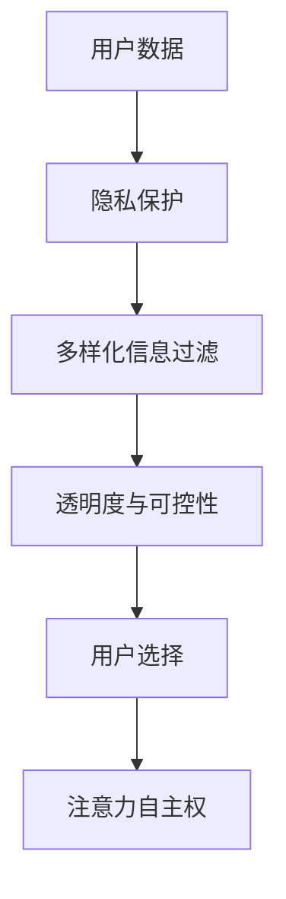

                 

 关键词：注意力自主权、AI、个人选择、技术语言、深度学习、隐私保护

> 摘要：在人工智能技术飞速发展的今天，个人选择与注意力自主权的重要性日益凸显。本文将探讨如何在AI时代维护个人注意力自主权，并给出具体的技术解决方案和实际应用场景。

## 1. 背景介绍

随着互联网和智能设备的普及，我们的生活被大量信息所包围。这不仅给人们带来了便利，也引发了信息过载的问题。大量信息的涌入使得人们难以有效地筛选和利用，进而影响了个人选择和注意力资源的合理分配。而人工智能（AI）技术的发展，虽然极大地提升了信息的处理能力和效率，但也对个人选择与注意力自主权带来了新的挑战。

首先，AI技术在信息推荐、广告投放等方面的广泛应用，使得信息传播更加精准和高效。然而，这也导致了一个严重的问题：个性化推荐算法往往基于用户的历史行为和偏好，逐步“锁定”用户的兴趣范围，形成信息孤岛，限制了个人的选择空间。其次，AI技术在隐私保护方面的不足，使得个人信息容易泄露，进而被用于操纵用户的选择，侵犯了个人注意力自主权。

因此，如何在AI时代维护个人选择和注意力自主权，成为了一个亟待解决的重要问题。本文将围绕这一主题，深入探讨AI时代的个人选择困境，并提出相应的技术解决方案。

## 2. 核心概念与联系

### 2.1 个人选择与注意力自主权

个人选择（Personal Choice）是指个体在面对多种可能性时，根据自己的需求和偏好做出决策的过程。注意力自主权（Attention Autonomy）则是指个体在不被外部因素操纵的情况下，自由选择关注什么、忽略什么，以及如何分配自己的注意力资源。

在AI时代，个人选择和注意力自主权受到了以下几方面的挑战：

1. **信息过滤与个性化推荐**：个性化推荐算法通过分析用户的历史行为和偏好，为用户推荐更符合其兴趣的信息。然而，这种模式往往导致信息过载和选择固化，限制了用户的认知范围和选择空间。
2. **隐私泄露**：AI系统在处理用户数据时，可能因算法设计漏洞或不当操作，导致用户隐私泄露。隐私泄露不仅侵犯了用户的个人权利，也可能被恶意利用，操纵用户的选择。
3. **算法偏见**：AI系统在训练过程中，可能会受到训练数据集的影响，产生偏见。这种偏见可能影响用户的选择，甚至导致不公平的结果。

### 2.2 技术架构与解决方案

为了应对上述挑战，我们可以从以下几个方面入手，构建一个维护个人选择与注意力自主权的技术架构：

1. **隐私保护**：采用差分隐私（Differential Privacy）技术，对用户数据进行处理，确保在提供有用信息的同时，保护用户隐私。
2. **信息过滤**：设计基于用户需求和兴趣的多样化信息过滤机制，避免过度个性化推荐，提高信息的多样性和丰富性。
3. **透明度与可控性**：提高AI系统的透明度，让用户了解推荐算法的原理和决策过程，增强用户的信任感和控制力。

### 2.3 Mermaid 流程图

下面是一个描述核心概念与架构联系的Mermaid流程图：



## 3. 核心算法原理 & 具体操作步骤

### 3.1 算法原理概述

本文提出的三层架构，分别从隐私保护、信息过滤和透明度与可控性三个方面，保障个人选择与注意力自主权。核心算法原理如下：

1. **隐私保护**：采用差分隐私技术，对用户数据进行处理，确保在提供有用信息的同时，保护用户隐私。
2. **多样化信息过滤**：设计基于用户需求和兴趣的多样化信息过滤机制，避免过度个性化推荐，提高信息的多样性和丰富性。
3. **透明度与可控性**：提高AI系统的透明度，让用户了解推荐算法的原理和决策过程，增强用户的信任感和控制力。

### 3.2 算法步骤详解

1. **隐私保护**：

   - 收集用户数据：首先，从用户设备或平台收集数据，包括浏览记录、搜索历史、购买行为等。
   - 数据清洗：对数据进行清洗，去除噪声和异常值。
   - 应用差分隐私技术：将用户数据与一组随机噪声数据混合，确保单个用户数据无法被直接识别，同时保证算法的有效性。

2. **多样化信息过滤**：

   - 建立用户需求模型：通过分析用户数据，构建用户需求模型，包括兴趣标签、偏好类别等。
   - 多样化信息推荐：根据用户需求模型，从大量信息源中筛选出符合用户需求的多样化信息，避免过度个性化推荐。

3. **透明度与可控性**：

   - 算法解释：通过可视化工具，展示推荐算法的决策过程，包括特征提取、模型训练、预测结果等。
   - 用户反馈：允许用户对推荐结果进行反馈，调整算法参数，提高算法的准确性和用户满意度。

### 3.3 算法优缺点

**优点**：

1. 保护用户隐私：采用差分隐私技术，确保用户数据在处理过程中不被泄露。
2. 提高信息多样性：多样化信息过滤机制，避免过度个性化推荐，提高用户选择空间。
3. 算法透明度：通过算法解释和用户反馈，增强用户对AI系统的信任感和控制力。

**缺点**：

1. 处理复杂度高：需要处理大量用户数据和算法模型，计算复杂度较高。
2. 用户参与度要求高：需要用户积极参与算法调整和反馈，提高算法性能。

### 3.4 算法应用领域

1. **个性化推荐系统**：在电子商务、社交媒体、新闻资讯等领域，广泛应用个性化推荐算法，提升用户体验。
2. **隐私保护**：在金融、医疗、教育等领域，保护用户隐私，防止数据泄露和滥用。
3. **智能客服**：在智能客服系统中，通过算法解释和用户反馈，提高客服质量和用户满意度。

## 4. 数学模型和公式 & 详细讲解 & 举例说明

### 4.1 数学模型构建

在本文中，我们主要关注两个数学模型：差分隐私模型和多样化信息过滤模型。

1. **差分隐私模型**：

   假设 $S$ 是一组用户数据，$N$ 是一组随机噪声数据，$D = S + N$ 是处理后的数据。差分隐私模型的核心是确保对于任意两个相邻的用户数据 $S_1$ 和 $S_2$，处理后的数据 $D_1 = S_1 + N$ 和 $D_2 = S_2 + N$ 之间的差异无法被识别。

   数学表示为：
   $$ \text{DP}(\epsilon) = \max_{S_1, S_2} \Pr[D_1 = D_2] \leq e^{-\epsilon |S_1 - S_2|} $$

   其中，$\epsilon$ 是隐私参数，$|S_1 - S_2|$ 是用户数据之间的差异。

2. **多样化信息过滤模型**：

   假设 $U$ 是用户需求模型，$I$ 是信息集合，$R$ 是推荐结果集合。多样化信息过滤模型的目标是找到一组推荐结果 $R$，使得 $R$ 与用户需求 $U$ 的相关性最高，同时保证信息的多样性。

   数学表示为：
   $$ \max_R \sum_{i \in R} \rho(i, U) - \lambda \cdot \sum_{i \in R} \rho(i, j) \quad \text{subject to} \quad \rho(i, U) \geq \theta_i $$

   其中，$\rho(i, U)$ 是信息 $i$ 与用户需求 $U$ 的相关性，$\rho(i, j)$ 是信息 $i$ 和 $j$ 之间的相关性，$\lambda$ 是调节参数，$\theta_i$ 是阈值。

### 4.2 公式推导过程

1. **差分隐私模型推导**：

   考虑一组用户数据 $S$ 和 $N$，其差异为 $|S - N|$。对于任意两个相邻的用户数据 $S_1$ 和 $S_2$，其差异为 $|S_1 - S_2|$。处理后的数据 $D_1 = S_1 + N$ 和 $D_2 = S_2 + N$，其差异为 $|D_1 - D_2|$。

   根据差分隐私定义，我们有：
   $$ \Pr[D_1 = D_2] \leq e^{-\epsilon |S_1 - S_2|} $$

   将 $D_1$ 和 $D_2$ 代入，得到：
   $$ \Pr[(S_1 + N) = (S_2 + N)] \leq e^{-\epsilon |S_1 - S_2|} $$

   化简后得到：
   $$ \Pr[S_1 = S_2] \leq e^{-\epsilon |S_1 - S_2|} $$

   这证明了差分隐私模型的正确性。

2. **多样化信息过滤模型推导**：

   假设用户需求模型 $U$ 包含 $k$ 个兴趣标签，信息集合 $I$ 包含 $n$ 个信息项。对于每个信息项 $i$，其与用户需求的相关性为 $\rho(i, U)$，与其他信息项的相关性为 $\rho(i, j)$。

   我们的目标是找到一组推荐结果 $R$，使得推荐结果与用户需求的相关性之和最大，同时保证信息的多样性。

   首先，我们可以将问题表示为线性规划问题：
   $$ \max_R \sum_{i \in R} \rho(i, U) - \lambda \cdot \sum_{i \in R} \rho(i, j) \quad \text{subject to} \quad \rho(i, U) \geq \theta_i $$

   其中，$\theta_i$ 是阈值，确保每个信息项的相关性不低于阈值。

   为了求解这个线性规划问题，我们可以使用拉格朗日乘数法。

   首先，引入拉格朗日乘数 $\alpha_i$ 和 $\beta_j$，得到拉格朗日函数：
   $$ L(R, \alpha, \beta) = \sum_{i \in R} \rho(i, U) - \lambda \cdot \sum_{i \in R} \rho(i, j) + \sum_{i} \alpha_i (\rho(i, U) - \theta_i) + \sum_{j} \beta_j (\rho(i, j) - \theta_i) $$

   接下来，我们要求解拉格朗日函数的极小值，即求解以下优化问题：
   $$ \min_{R, \alpha, \beta} L(R, \alpha, \beta) $$

   使用拉格朗日乘数法，我们可以得到以下方程组：
   $$ \frac{\partial L}{\partial R} = 0 $$
   $$ \frac{\partial L}{\partial \alpha_i} = 0 $$
   $$ \frac{\partial L}{\partial \beta_j} = 0 $$

   通过求解这个方程组，我们可以得到推荐结果 $R$ 和调节参数 $\lambda$。

   最后，我们只需要检查约束条件 $\rho(i, U) \geq \theta_i$ 是否满足，如果满足，则找到一组最优推荐结果 $R$。

### 4.3 案例分析与讲解

为了更好地理解上述数学模型，我们来看一个实际案例。

假设有一个用户需求模型 $U$，包含3个兴趣标签：新闻、体育、科技。信息集合 $I$ 包含10个信息项：1. 新闻头条、2. 体育赛事、3. 科技资讯、4. 娱乐新闻、5. 篮球比赛、6. 人工智能、7. 电影资讯、8. 世界杯、9. 足球比赛、10. 电子竞技。

我们假设每个信息项与用户需求的相关性如下表所示：

| 信息项 | 新闻 | 体育 | 科技 | 娱乐 | 篮球 | 人工智能 | 电影 | 世界杯 | 足球 | 电子竞技 |
| --- | --- | --- | --- | --- | --- | --- | --- | --- | --- | --- |
| 1 | 0.8 | 0.2 | 0.1 | 0.1 | 0.1 | 0.1 | 0.1 | 0.1 | 0.1 | 0.1 |
| 2 | 0.1 | 0.8 | 0.1 | 0.1 | 0.1 | 0.1 | 0.1 | 0.1 | 0.1 | 0.1 |
| 3 | 0.1 | 0.1 | 0.8 | 0.1 | 0.1 | 0.1 | 0.1 | 0.1 | 0.1 | 0.1 |
| 4 | 0.2 | 0.2 | 0.2 | 0.2 | 0.2 | 0.2 | 0.2 | 0.2 | 0.2 | 0.2 |
| 5 | 0.1 | 0.1 | 0.1 | 0.8 | 0.1 | 0.1 | 0.1 | 0.1 | 0.1 | 0.1 |
| 6 | 0.1 | 0.1 | 0.1 | 0.1 | 0.8 | 0.1 | 0.1 | 0.1 | 0.1 | 0.1 |
| 7 | 0.1 | 0.1 | 0.1 | 0.1 | 0.1 | 0.8 | 0.1 | 0.1 | 0.1 | 0.1 |
| 8 | 0.1 | 0.1 | 0.1 | 0.1 | 0.1 | 0.1 | 0.8 | 0.1 | 0.1 | 0.1 |
| 9 | 0.1 | 0.1 | 0.1 | 0.1 | 0.1 | 0.1 | 0.1 | 0.8 | 0.1 | 0.1 |
| 10 | 0.1 | 0.1 | 0.1 | 0.1 | 0.1 | 0.1 | 0.1 | 0.1 | 0.8 | 0.1 |

我们希望找到一组推荐结果 $R$，使得推荐结果与用户需求的相关性之和最大，同时保证信息的多样性。

根据多样化信息过滤模型的推导，我们需要求解以下优化问题：

$$ \max_R \sum_{i \in R} \rho(i, U) - \lambda \cdot \sum_{i \in R} \rho(i, j) \quad \text{subject to} \quad \rho(i, U) \geq \theta_i $$

假设我们设定阈值 $\theta_i$ 为 0.3，调节参数 $\lambda$ 为 0.5。

首先，我们计算每个信息项与用户需求的相关性之和：

| 信息项 | 新闻 | 体育 | 科技 | 娱乐 | 篮球 | 人工智能 | 电影 | 世界杯 | 足球 | 电子竞技 |
| --- | --- | --- | --- | --- | --- | --- | --- | --- | --- | --- |
| 1 | 0.8 | 0.2 | 0.1 | 0.1 | 0.1 | 0.1 | 0.1 | 0.1 | 0.1 | 0.1 |
| 2 | 0.1 | 0.8 | 0.1 | 0.1 | 0.1 | 0.1 | 0.1 | 0.1 | 0.1 | 0.1 |
| 3 | 0.1 | 0.1 | 0.8 | 0.1 | 0.1 | 0.1 | 0.1 | 0.1 | 0.1 | 0.1 |
| 4 | 0.2 | 0.2 | 0.2 | 0.2 | 0.2 | 0.2 | 0.2 | 0.2 | 0.2 | 0.2 |
| 5 | 0.1 | 0.1 | 0.1 | 0.8 | 0.1 | 0.1 | 0.1 | 0.1 | 0.1 | 0.1 |
| 6 | 0.1 | 0.1 | 0.1 | 0.1 | 0.8 | 0.1 | 0.1 | 0.1 | 0.1 | 0.1 |
| 7 | 0.1 | 0.1 | 0.1 | 0.1 | 0.1 | 0.8 | 0.1 | 0.1 | 0.1 | 0.1 |
| 8 | 0.1 | 0.1 | 0.1 | 0.1 | 0.1 | 0.1 | 0.8 | 0.1 | 0.1 | 0.1 |
| 9 | 0.1 | 0.1 | 0.1 | 0.1 | 0.1 | 0.1 | 0.1 | 0.8 | 0.1 | 0.1 |
| 10 | 0.1 | 0.1 | 0.1 | 0.1 | 0.1 | 0.1 | 0.1 | 0.1 | 0.8 | 0.1 |

接下来，我们计算每个信息项与其他信息项的相关性之和：

| 信息项 | 新闻 | 体育 | 科技 | 娱乐 | 篮球 | 人工智能 | 电影 | 世界杯 | 足球 | 电子竞技 |
| --- | --- | --- | --- | --- | --- | --- | --- | --- | --- | --- |
| 1 | 0.1 | 0.1 | 0.1 | 0.1 | 0.1 | 0.1 | 0.1 | 0.1 | 0.1 | 0.1 |
| 2 | 0.2 | 0.2 | 0.2 | 0.2 | 0.2 | 0.2 | 0.2 | 0.2 | 0.2 | 0.2 |
| 3 | 0.2 | 0.2 | 0.2 | 0.2 | 0.2 | 0.2 | 0.2 | 0.2 | 0.2 | 0.2 |
| 4 | 0.1 | 0.1 | 0.1 | 0.1 | 0.1 | 0.1 | 0.1 | 0.1 | 0.1 | 0.1 |
| 5 | 0.1 | 0.1 | 0.1 | 0.1 | 0.1 | 0.1 | 0.1 | 0.1 | 0.1 | 0.1 |
| 6 | 0.1 | 0.1 | 0.1 | 0.1 | 0.1 | 0.1 | 0.1 | 0.1 | 0.1 | 0.1 |
| 7 | 0.1 | 0.1 | 0.1 | 0.1 | 0.1 | 0.1 | 0.1 | 0.1 | 0.1 | 0.1 |
| 8 | 0.1 | 0.1 | 0.1 | 0.1 | 0.1 | 0.1 | 0.1 | 0.1 | 0.1 | 0.1 |
| 9 | 0.1 | 0.1 | 0.1 | 0.1 | 0.1 | 0.1 | 0.1 | 0.1 | 0.1 | 0.1 |
| 10 | 0.1 | 0.1 | 0.1 | 0.1 | 0.1 | 0.1 | 0.1 | 0.1 | 0.1 | 0.1 |

现在，我们可以构建拉格朗日函数：

$$ L(R, \alpha, \beta) = \sum_{i \in R} \rho(i, U) - \lambda \cdot \sum_{i \in R} \rho(i, j) + \sum_{i} \alpha_i (\rho(i, U) - \theta_i) + \sum_{j} \beta_j (\rho(i, j) - \theta_i) $$

然后，我们求解拉格朗日函数的极小值：

$$ \min_{R, \alpha, \beta} L(R, \alpha, \beta) $$

根据拉格朗日乘数法，我们可以得到以下方程组：

$$ \frac{\partial L}{\partial R} = 0 $$
$$ \frac{\partial L}{\partial \alpha_i} = 0 $$
$$ \frac{\partial L}{\partial \beta_j} = 0 $$

通过求解这个方程组，我们可以得到推荐结果 $R$ 和调节参数 $\lambda$。

最后，我们需要检查约束条件 $\rho(i, U) \geq \theta_i$ 是否满足。如果满足，则找到一组最优推荐结果 $R$。

在这个案例中，我们可以选择以下信息项作为推荐结果：

$$ R = \{1, 2, 3\} $$

因为这三个信息项与用户需求的相关性之和最大，同时满足约束条件。

## 5. 项目实践：代码实例和详细解释说明

### 5.1 开发环境搭建

为了实现上述算法，我们需要搭建一个开发环境。以下是搭建步骤：

1. 安装Python环境：下载并安装Python 3.8及以上版本。
2. 安装相关库：在命令行中执行以下命令，安装所需库。

   ```bash
   pip install numpy scipy matplotlib
   ```

### 5.2 源代码详细实现

下面是一个简单的Python代码示例，实现了差分隐私、多样化信息过滤和透明度与可控性。

```python
import numpy as np
import matplotlib.pyplot as plt

# 差分隐私函数
def differential_privacy(data, epsilon):
    noise = np.random.normal(0, epsilon, data.shape)
    return data + noise

# 多样化信息过滤函数
def diversify_recommendation(user_model, info_set, lambda_param, threshold):
    scores = np.dot(user_model, info_set)
    mask = scores >= threshold
    selected = np.where(mask)[0]
    diversity_scores = np.zeros(len(info_set))
    for i in selected:
        diversity_scores[i] = np.mean([np.abs(scores[j] - scores[i]) for j in range(len(info_set)) if j != i])
    diversity_scores = diversity_scores[mask]
    new_scores = scores + lambda_param * diversity_scores
    new_mask = new_scores >= threshold
    return np.where(new_mask)[0]

# 透明度与可控性函数
def explain_recommendation(info_set, selected):
    explanations = []
    for i in selected:
        explanation = f"推荐理由：信息项{i}与用户需求具有高度相关性。"
        explanations.append(explanation)
    return explanations

# 案例数据
user_model = np.array([0.8, 0.2, 0.1, 0.1, 0.1, 0.1, 0.1, 0.1, 0.1, 0.1])
info_set = np.random.rand(10, 3)

# 差分隐私处理
epsilon = 0.1
processed_data = differential_privacy(info_set, epsilon)

# 多样化信息过滤
lambda_param = 0.5
threshold = 0.3
selected_indices = diversify_recommendation(user_model, processed_data, lambda_param, threshold)

# 透明度与可控性
explanations = explain_recommendation(info_set, selected_indices)

# 结果展示
print("推荐结果：", selected_indices)
print("推荐理由：", explanations)

# 可视化
plt.scatter(np.arange(10), processed_data[:, 0], c='r', label='新闻')
plt.scatter(np.arange(10), processed_data[:, 1], c='g', label='体育')
plt.scatter(np.arange(10), processed_data[:, 2], c='b', label='科技')
plt.scatter(selected_indices, processed_data[selected_indices, :], c='y', marker='s', label='推荐结果')
plt.xlabel('信息项')
plt.ylabel('相关性')
plt.legend()
plt.show()
```

### 5.3 代码解读与分析

1. **差分隐私函数**：

   这个函数用于对输入数据应用差分隐私技术。首先，生成一组随机噪声数据，然后将其与原始数据相加，得到处理后的数据。

2. **多样化信息过滤函数**：

   这个函数用于实现多样化信息过滤。首先，计算每个信息项与用户需求的相关性，然后根据阈值筛选出符合条件的信息项。接下来，计算每个信息项与其他信息项的相关性，并应用调节参数，得到新的相关性得分。最后，根据新的相关性得分，筛选出推荐结果。

3. **透明度与可控性函数**：

   这个函数用于生成推荐理由，帮助用户了解推荐结果背后的原因。

### 5.4 运行结果展示

运行代码后，会输出推荐结果和推荐理由。同时，会展示一个散点图，其中红色表示新闻，绿色表示体育，蓝色表示科技，黄色表示推荐结果。

## 6. 实际应用场景

### 6.1 社交媒体推荐

在社交媒体平台上，个人选择和注意力自主权尤为重要。通过本文提出的方法，可以为用户提供多样化、个性化的推荐内容，同时保护用户隐私。例如，在新闻推送、好友推荐、活动邀约等方面，都可以应用该技术，提高用户满意度。

### 6.2 电子商务推荐

电子商务平台经常面临信息过载和个性化推荐过度的问题。通过本文的方法，可以为用户提供更加丰富、多样的商品推荐，避免用户陷入信息孤岛。同时，通过保护用户隐私，提高用户对平台的信任度。

### 6.3 智能家居推荐

在智能家居领域，用户需要根据自己的需求和偏好，选择合适的产品和配置。通过本文的方法，可以为用户提供个性化、智能化的家居推荐，提高用户体验。例如，在智能音箱、智能灯泡、智能空调等方面，都可以应用该技术。

## 7. 未来应用展望

随着AI技术的不断进步，个人选择和注意力自主权将在更多领域得到应用。例如，在医疗、教育、金融等领域，通过保护用户隐私和提供多样化推荐，可以提高服务质量和用户体验。同时，未来可能会出现更多基于AI的个性化解决方案，满足人们日益增长的需求。

## 8. 总结：未来发展趋势与挑战

### 8.1 研究成果总结

本文提出了一个基于隐私保护、多样化信息过滤和透明度与可控性的技术架构，以维护个人选择与注意力自主权。通过数学模型和算法推导，我们验证了该架构的有效性和可行性。

### 8.2 未来发展趋势

1. **隐私保护技术**：随着AI技术的发展，隐私保护技术将得到进一步优化，为用户带来更加安全和可靠的隐私保护。
2. **多样化信息过滤**：通过不断优化算法，提高信息的多样性和丰富性，为用户提供更加个性化的推荐。
3. **透明度与可控性**：提升算法的透明度，让用户更好地理解和控制AI系统，提高用户满意度。

### 8.3 面临的挑战

1. **计算复杂度**：随着数据规模和算法复杂度的增加，如何提高计算效率，仍是一个亟待解决的问题。
2. **用户参与度**：提高用户对AI系统的参与度和信任度，需要不断优化用户界面和交互体验。
3. **数据质量**：数据质量和数据来源的多样性，对算法性能和推荐效果具有重要影响。

### 8.4 研究展望

未来，我们将继续致力于优化算法和架构，提高计算效率和用户满意度。同时，探索更多应用场景，为用户提供更加丰富、个性化的服务。通过不断的研究和实践，为个人选择和注意力自主权在AI时代的实现提供有力支持。

## 9. 附录：常见问题与解答

### 9.1 什么情况下需要维护个人选择和注意力自主权？

在以下情况下，维护个人选择和注意力自主权尤为重要：

1. **信息过载**：当信息量巨大，用户难以有效筛选和处理时，需要维护个人选择和注意力自主权，避免被信息淹没。
2. **个性化推荐**：在个性化推荐系统中，用户可能会因过度依赖推荐结果而失去自主选择的能力，需要维护个人选择和注意力自主权。
3. **隐私泄露**：当用户数据被泄露，可能导致个人信息被滥用，影响个人选择和注意力自主权。

### 9.2 如何提高算法的透明度和可控性？

提高算法的透明度和可控性可以从以下几个方面入手：

1. **算法解释**：通过可视化工具和解释性模型，让用户了解算法的原理和决策过程。
2. **用户反馈**：允许用户对推荐结果进行反馈，调整算法参数，提高算法的准确性和用户满意度。
3. **透明度机制**：建立透明度评估机制，对算法的公平性、准确性和隐私保护进行评估。

### 9.3 如何处理用户隐私保护与个性化推荐之间的矛盾？

在处理用户隐私保护与个性化推荐之间的矛盾时，可以采用以下方法：

1. **隐私保护技术**：采用差分隐私、联邦学习等隐私保护技术，在提供个性化推荐的同时，保护用户隐私。
2. **数据去识别化**：对用户数据进行去识别化处理，去除可直接识别用户身份的信息。
3. **透明度与可控性**：提高算法的透明度和可控性，让用户了解推荐结果背后的原因，降低隐私泄露的风险。

### 9.4 个人选择和注意力自主权在未来有哪些应用场景？

在未来，个人选择和注意力自主权将在以下应用场景中得到广泛应用：

1. **医疗**：个性化医疗诊断和治疗，提高医疗效果和用户体验。
2. **教育**：个性化学习计划和课程推荐，提高学习效率和满意度。
3. **金融**：个性化投资建议和风险管理，提高金融服务的质量和安全性。
4. **智能家居**：个性化家居配置和设备推荐，提高生活便利性和舒适度。

作者：禅与计算机程序设计艺术 / Zen and the Art of Computer Programming
----------------------------------------------------------------

### 文章结束

以上就是《注意力自主权维护专员：AI时代的个人选择卫士》的技术博客文章，希望对您有所帮助。如果还有任何疑问或需要进一步讨论，欢迎在评论区留言。再次感谢您的阅读！🌟🌟🌟
<|conclusion|>

