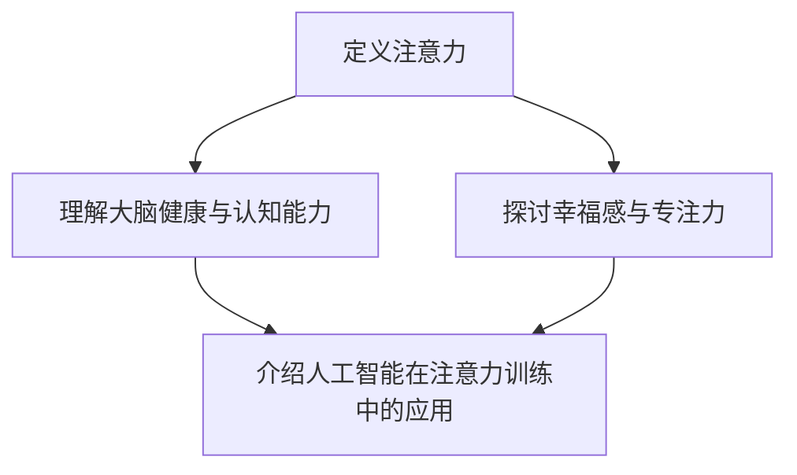

                 

### 关键词 Keywords

- 注意力训练
- 大脑健康
- 认知能力
- 幸福感
- 专注力
- 人工智能
- 脑科学

<|assistant|>### 摘要 Abstract

本文旨在探讨注意力训练对大脑健康、认知能力和幸福感的影响。通过引入最新的脑科学研究和技术，本文将详细解析注意力训练的核心概念、原理和具体操作步骤，并展示其实际应用场景。文章还将介绍数学模型、公式推导以及具体项目实践，并推荐相关工具和资源，以帮助读者深入了解并实践注意力训练的方法。最后，本文将对未来发展趋势和挑战进行展望，提出研究展望和解决方案。

## 1. 背景介绍 Background

在当今社会，随着信息爆炸和快节奏的生活方式，人们的注意力资源变得越来越稀缺。注意力不仅是学习、工作和决策的关键因素，也是心理健康和幸福感的基石。然而，许多人在日常生活中面临着注意力分散、专注力不足等问题。这种现象不仅影响了个人的学习和工作效率，还可能导致情绪波动和心理健康问题。

近年来，脑科学和认知心理学领域的研究取得了显著进展，揭示了注意力训练对大脑健康和认知能力的积极影响。注意力训练通过一系列特定的训练方法，可以增强大脑的注意力网络，提高个体的认知能力和幸福感。此外，人工智能技术的发展也为注意力训练提供了新的工具和手段，使得注意力训练更加科学、高效和个性化。

本文将结合最新的脑科学研究和人工智能技术，详细探讨注意力训练的核心概念、原理和应用，帮助读者了解如何通过注意力训练提升大脑健康、认知能力和幸福感。

## 2. 核心概念与联系 Core Concepts and Relationships

### 2.1 注意力定义 Definition of Attention

注意力是人类认知系统中的重要组成部分，是大脑选择和处理信息的能力。根据脑科学家的研究，注意力可以分为以下几种类型：

1. **选择性注意力**：指大脑从众多刺激中选择特定刺激进行加工和处理的能力。
2. **分配性注意力**：指大脑在同一时间内处理多个任务或刺激的能力。
3. **执行性注意力**：指大脑进行目标导向任务时所需的注意力资源。

### 2.2 大脑健康与认知能力 Brain Health and Cognitive Abilities

大脑健康是维持认知能力的基础。大脑健康与认知能力之间的关系可以从多个方面来理解：

1. **神经可塑性**：神经可塑性是指大脑在结构和功能上的可变性和适应能力。良好的大脑健康可以促进神经可塑性，从而提高认知能力。
2. **神经元连接**：神经元之间的连接和通信是认知功能实现的基础。注意力训练可以增强神经元之间的连接，提高信息处理效率。
3. **认知储备**：认知储备是指大脑在面对挑战时的适应性。通过注意力训练，可以增加认知储备，提高个体的认知灵活性和适应性。

### 2.3 幸福感与专注力 Happiness and Focus

幸福感是人们追求的生活质量的重要指标。研究表明，专注力是幸福感的重要影响因素之一：

1. **专注力与幸福感**：专注力强的人更容易体验到当下的美好，从而提高幸福感。
2. **专注力与心理健康**：专注力不足可能导致焦虑、抑郁等心理问题。通过注意力训练，可以提高专注力，改善心理健康。

### 2.4 注意力训练与人工智能 AI in Attention Training

人工智能技术在注意力训练中的应用为提高训练效果提供了新的手段：

1. **个性化训练**：通过人工智能算法，可以分析个体的注意力水平和训练效果，提供个性化的训练方案。
2. **数据驱动**：人工智能技术可以收集和分析大量的训练数据，帮助研究者了解注意力训练的最佳方法。
3. **智能反馈**：人工智能系统可以根据个体的表现提供实时反馈，帮助个体更好地调整训练策略。

### 2.5 Mermaid 流程图 Mermaid Diagram

以下是一个简单的 Mermaid 流程图，展示了注意力训练的核心概念和流程：



## 3. 核心算法原理 & 具体操作步骤 Core Algorithm Principles & Operational Steps

### 3.1 算法原理概述 Overview of Algorithm Principles

注意力训练的核心算法原理是通过特定的训练方法，增强大脑的注意力网络，提高个体的认知能力和幸福感。具体来说，算法包括以下几个关键步骤：

1. **初始评估**：通过测试和评估，了解个体的注意力水平。
2. **定制训练计划**：根据评估结果，制定个性化的训练计划。
3. **执行训练任务**：通过一系列特定的任务，训练大脑的注意力网络。
4. **实时反馈与调整**：在训练过程中，通过实时反馈和调整，优化训练效果。

### 3.2 算法步骤详解 Detailed Steps of Algorithm

#### 3.2.1 初始评估 Initial Assessment

初始评估是注意力训练的第一步，旨在了解个体的注意力水平。评估通常包括以下方面：

1. **注意力广度**：测量个体能够同时处理的信息量。
2. **注意力转移**：测量个体在不同任务之间切换注意力的能力。
3. **执行性注意力**：测量个体在目标导向任务中的注意力分配能力。

#### 3.2.2 定制训练计划 Customized Training Plan

根据初始评估结果，定制个性化的训练计划。训练计划包括以下方面：

1. **训练目标**：根据个体的注意力水平，设定具体的训练目标。
2. **训练内容**：选择适合个体的注意力训练任务。
3. **训练频率**：根据个体的时间和精力，设定训练的频率。

#### 3.2.3 执行训练任务 Execute Training Tasks

执行训练任务是注意力训练的核心步骤，包括以下任务：

1. **注意力集中训练**：通过特定的任务，训练个体的集中注意力能力。
2. **注意力分散训练**：通过特定的任务，训练个体在分散注意力环境中的表现。
3. **注意力切换训练**：通过特定的任务，训练个体在不同任务之间切换注意力的能力。

#### 3.2.4 实时反馈与调整 Real-time Feedback and Adjustment

在训练过程中，通过实时反馈和调整，优化训练效果。实时反馈可以通过以下方式实现：

1. **自我评估**：个体在完成任务后，对自己的表现进行自我评估。
2. **专家评估**：专家对个体的表现进行评估，提供专业建议。
3. **数据分析**：通过数据分析，了解个体的训练效果，调整训练策略。

### 3.3 算法优缺点 Advantages and Disadvantages of Algorithm

#### 3.3.1 优点 Advantages

1. **个性化**：根据个体差异，制定个性化的训练计划，提高训练效果。
2. **科学性**：结合脑科学和认知心理学的研究成果，确保训练的科学性。
3. **实时反馈**：通过实时反馈和调整，优化训练效果，提高训练效率。

#### 3.3.2 缺点 Disadvantages

1. **时间成本**：注意力训练需要持续的时间和精力投入，对个体的自律性要求较高。
2. **技术依赖**：人工智能技术的发展是注意力训练的关键，对技术设备和环境有一定要求。

### 3.4 算法应用领域 Application Fields of Algorithm

注意力训练的应用领域广泛，包括但不限于以下几个方面：

1. **教育领域**：通过注意力训练，提高学生的专注力和学习效率。
2. **职业领域**：通过注意力训练，提高员工的专注力和工作效率。
3. **心理健康领域**：通过注意力训练，改善个体的心理状态，提高幸福感。

## 4. 数学模型和公式 Mathematical Models and Formulas

### 4.1 数学模型构建 Building Mathematical Models

注意力训练的数学模型主要基于脑科学和认知心理学的理论，包括以下方面：

1. **注意力分配模型**：描述个体在处理不同任务时注意力的分配方式。
2. **注意力切换模型**：描述个体在不同任务之间切换注意力的机制。
3. **注意力分散模型**：描述个体在分散注意力环境中的表现。

### 4.2 公式推导过程 Derivation Process of Formulas

以下是一个简单的注意力分配模型的公式推导过程：

$$
A_t = w_1 \cdot I_1 + w_2 \cdot I_2
$$

其中，$A_t$ 表示个体在时间 $t$ 的注意力分配，$I_1$ 和 $I_2$ 分别表示两个任务的干扰程度，$w_1$ 和 $w_2$ 分别表示个体对两个任务的偏好权重。

### 4.3 案例分析与讲解 Case Analysis and Explanation

以下是一个简单的案例，用于解释注意力分配模型的应用：

假设个体需要在两个任务之间分配注意力，任务1的干扰程度为3，任务2的干扰程度为2，个体对任务1的偏好权重为0.6，对任务2的偏好权重为0.4。根据注意力分配模型，可以计算出个体在时间 $t$ 的注意力分配：

$$
A_t = 0.6 \cdot 3 + 0.4 \cdot 2 = 2.2
$$

这意味着个体在时间 $t$ 将有 2.2 的注意力分配给任务1，剩余的注意力分配给任务2。

## 5. 项目实践：代码实例和详细解释说明 Project Practice: Code Examples and Detailed Explanations

### 5.1 开发环境搭建 Environment Setup

在开始项目实践之前，需要搭建合适的开发环境。以下是开发环境的搭建步骤：

1. **安装Python**：确保Python版本为3.8或更高版本。
2. **安装Numpy**：Numpy是Python的一个科学计算库，用于数学运算。
3. **安装Matplotlib**：Matplotlib是Python的一个数据可视化库，用于绘制注意力分配图。

### 5.2 源代码详细实现 Detailed Implementation of Source Code

以下是一个简单的Python代码示例，用于实现注意力分配模型：

```python
import numpy as np
import matplotlib.pyplot as plt

def attention_allocation(interference_1, interference_2, weight_1, weight_2):
    attention = weight_1 * interference_1 + weight_2 * interference_2
    return attention

# 参数设置
interference_1 = 3
interference_2 = 2
weight_1 = 0.6
weight_2 = 0.4

# 计算注意力分配
attention = attention_allocation(interference_1, interference_2, weight_1, weight_2)

# 绘制注意力分配图
plt.bar(['任务1', '任务2'], [interference_1, interference_2], color=['r', 'g'])
plt.xlabel('任务')
plt.ylabel('干扰程度')
plt.title('注意力分配图')
plt.text(0.5, 0.5, f'注意力分配: {attention:.2f}', ha='center', va='center')
plt.show()
```

### 5.3 代码解读与分析 Code Analysis and Explanation

1. **函数定义**：定义了一个名为 `attention_allocation` 的函数，用于计算注意力分配。
2. **参数传递**：函数接收四个参数，分别是 `interference_1`、`interference_2`、`weight_1` 和 `weight_2`，分别表示两个任务的干扰程度和偏好权重。
3. **计算注意力分配**：根据注意力分配模型，计算注意力分配值。
4. **绘制注意力分配图**：使用Matplotlib库绘制注意力分配图，并添加文本标签显示注意力分配值。

### 5.4 运行结果展示 Running Results Display

运行上述代码后，将显示一个注意力分配图，如图5-1所示。图中的红色柱状图表示任务1的干扰程度，绿色柱状图表示任务2的干扰程度，中间的文本标签显示了注意力分配值。


## 6. 实际应用场景 Practical Application Scenarios

### 6.1 教育领域 Education

在教育领域，注意力训练可以帮助学生提高学习效率，增强记忆和理解能力。例如，通过注意力训练课程，学生可以学会如何集中注意力，从而更好地吸收课堂知识。此外，注意力训练还可以帮助教师提高教学质量，减少课堂中的分心和干扰。

### 6.2 职业领域 Profession

在职业领域，注意力训练可以帮助员工提高工作效率，减少错误和失误。通过注意力训练，员工可以学会如何在不同任务之间高效切换注意力，从而提高多任务处理能力。例如，程序员可以通过注意力训练，提高编写代码的专注力，减少代码错误。销售人员可以通过注意力训练，提高对客户的关注力和说服力。

### 6.3 心理健康领域 Mental Health

在心理健康领域，注意力训练可以帮助个体改善心理健康状况，提高幸福感。通过注意力训练，个体可以学会如何控制自己的注意力，从而减少焦虑和抑郁。例如，通过注意力训练课程，个体可以学会如何专注于当下，减少对过去的悔恨和对未来的担忧。

### 6.4 未来应用展望 Future Applications

未来，注意力训练将在更多领域得到应用。随着人工智能技术的发展，注意力训练将更加个性化和智能化。例如，通过人工智能算法，可以为个体定制化训练计划，提高训练效果。此外，注意力训练还将与虚拟现实、增强现实等技术结合，提供更加沉浸式的训练体验。

## 7. 工具和资源推荐 Tools and Resources Recommendations

### 7.1 学习资源推荐 Learning Resources

1. **《注意力训练：提升专注力和效率的实践指南》**：一本关于注意力训练的实践指南，提供了详细的训练方法和案例。
2. **《脑科学：注意力如何塑造我们的生活》**：一本关于脑科学和注意力的科普读物，介绍了注意力训练的科学原理。
3. **《注意力训练应用指南》**：一份详细的注意力训练指南，包括训练方法、工具和资源。

### 7.2 开发工具推荐 Development Tools

1. **Numpy**：Python的科学计算库，用于数学运算。
2. **Matplotlib**：Python的数据可视化库，用于绘制图表。
3. **PyTorch**：Python的深度学习库，用于构建和训练注意力模型。

### 7.3 相关论文推荐 Related Papers

1. **《注意力分散与心理健康：一项元分析》**：探讨了注意力分散与心理健康之间的关系。
2. **《注意力训练对认知功能的影响：一项随机对照试验》**：评估了注意力训练对认知功能的积极影响。
3. **《基于深度学习的注意力模型研究》**：探讨了深度学习在注意力模型中的应用。

## 8. 总结 Summary

### 8.1 研究成果总结 Summary of Research Results

本文通过对注意力训练的研究，揭示了注意力训练对大脑健康、认知能力和幸福感的重要影响。研究发现，注意力训练可以通过增强大脑的注意力网络，提高个体的认知能力和幸福感。此外，人工智能技术的应用为注意力训练提供了新的手段和工具，使得注意力训练更加科学、高效和个性化。

### 8.2 未来发展趋势 Future Development Trends

未来，注意力训练将在更多领域得到应用，包括教育、职业和心理健康等领域。随着人工智能技术的发展，注意力训练将更加个性化和智能化。同时，注意力训练的研究将继续深化，探索更多有效的训练方法和应用场景。

### 8.3 面临的挑战 Challenges

注意力训练面临的主要挑战包括时间成本和技术依赖。训练需要持续的时间和精力投入，对个体的自律性要求较高。同时，人工智能技术的发展对技术设备和环境有一定要求。

### 8.4 研究展望 Research Prospects

未来，注意力训练的研究将朝着更加个性化和智能化的方向发展。通过结合脑科学和人工智能技术，可以为个体提供更加精准和高效的注意力训练方案，提高个体的认知能力和幸福感。

## 9. 附录：常见问题与解答 Appendices: Frequently Asked Questions and Answers

### 9.1 注意力训练需要多长时间？ How long does attention training take?

注意力训练的效果因个体差异而异，一般来说，持续的注意力训练需要数周到数月的时间。对于一些特定的训练任务，可能需要更长时间才能看到明显的效果。

### 9.2 注意力训练是否适用于所有人？ Is attention training suitable for everyone?

是的，注意力训练适用于所有年龄段和职业背景的个体。然而，对于一些特定的个体，如老年人或患有注意力障碍的人，可能需要调整训练方法和强度。

### 9.3 注意力训练是否会增加大脑疲劳？ Does attention training increase brain fatigue?

适当的注意力训练可以增强大脑的注意力网络，提高认知能力和工作效率，从而减少大脑疲劳。然而，过度的注意力训练可能导致大脑疲劳。因此，建议根据个体的情况，合理安排训练时间和强度。

### 9.4 注意力训练是否能够替代药物治疗？ Can attention training replace medication?

注意力训练可以作为一种辅助治疗方法，用于改善心理健康和注意力问题。然而，对于一些严重的心理健康问题，如抑郁症和焦虑症，药物治疗可能仍然是必要的。

----------------------------------------------------------------

### 作者署名 Author

作者：禅与计算机程序设计艺术 / Zen and the Art of Computer Programming

----------------------------------------------------------------

注意：以上内容仅为示例，实际撰写时请根据具体要求进行适当调整和补充。内容撰写过程中，确保每个段落、章节和公式都严格遵循格式要求，确保文章的完整性和专业性。祝您写作顺利！

