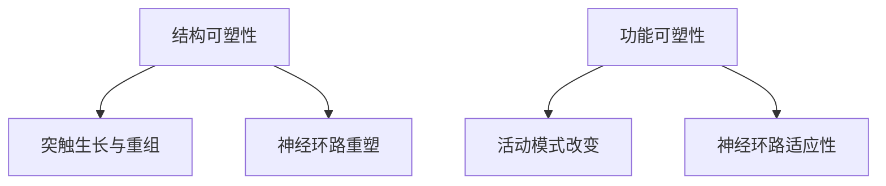
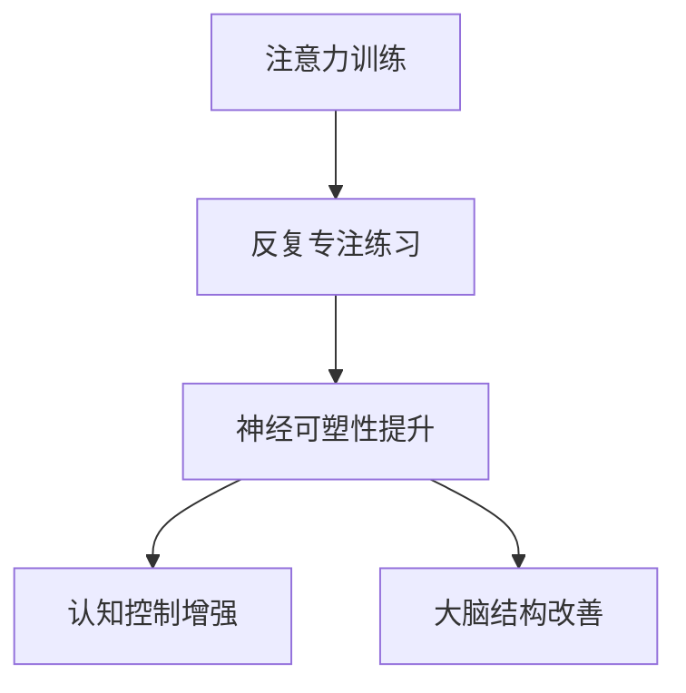
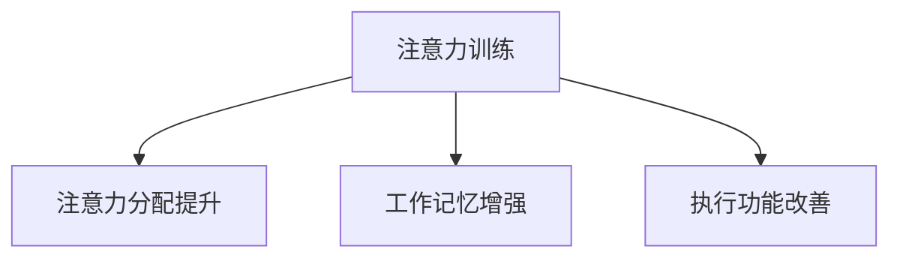

                 

### 关键词 Keywords ###
- 注意力训练
- 大脑可塑性
- 认知能力
- 专注力
- 神经可塑性
- 认知神经科学
- 人工智能

### 摘要 Abstract ###
本文探讨了注意力训练与大脑可塑性之间的紧密联系，揭示了如何通过专注力重塑认知能力。我们将深入解析神经可塑性的基本原理，并介绍一系列实用的方法和工具，以帮助读者提升自己的专注力和认知效率。文章还展望了注意力训练在人工智能和认知神经科学领域的未来发展，提出了潜在的挑战和解决方案。通过本文，读者将获得对注意力训练的全面理解，以及如何将其应用于日常生活和工作中。

## 1. 背景介绍 Background

### 1.1 注意力训练的重要性

在当今快节奏、信息爆炸的时代，人们的注意力资源变得尤为宝贵。注意力训练（Attention Training）作为一种提升专注力和认知能力的有效手段，受到了广泛关注。研究表明，良好的注意力是成功的关键因素，它不仅影响我们的学习效率，也决定着我们在工作和生活中的表现。

### 1.2 大脑可塑性

大脑可塑性（Neuroplasticity）是指大脑在结构和功能上的可改变性。这种可塑性使得大脑能够适应新的环境和经验。从生物学角度看，大脑通过神经元的生长、连接和重新组织来实现可塑性，这一过程受到多种因素的影响，包括注意力训练。

### 1.3 认知能力和专注力

认知能力（Cognitive Ability）包括记忆、注意力、处理速度、推理能力和问题解决能力等。专注力（Focus）是这些能力中的核心要素，它决定了我们在面对复杂任务时的表现。通过注意力训练，我们不仅能够提升专注力，还能够增强其他认知能力。

## 2. 核心概念与联系 Core Concepts and Relationships

### 2.1 神经可塑性

神经可塑性是指大脑神经元和神经网络在结构、功能上的改变，通常受到外界刺激和内在需求的驱动。以下是神经可塑性的基本原理和联系：

- **结构可塑性**：神经元通过生长新的突触连接来改变其结构。
- **功能可塑性**：神经元通过改变其活动模式来适应新的环境和任务。



### 2.2 注意力训练与神经可塑性的关系

注意力训练通过反复的专注练习，可以促进大脑神经可塑性的发展。以下是注意力训练与神经可塑性的具体联系：

- **提升注意力**：通过专注练习，大脑能够更好地过滤干扰信息，提高注意力水平。
- **增强认知控制**：注意力训练有助于提高大脑对认知资源的分配和管理能力。
- **改善大脑结构**：长期专注练习可以导致大脑灰质密度的增加，特别是在与注意力相关的大脑区域。



### 2.3 认知能力的发展

认知能力的发展是一个复杂的过程，受到多种因素的影响。通过注意力训练，我们可以促进以下认知能力的发展：

- **注意力分配**：提升同时关注多个任务的能力。
- **工作记忆**：增强短时记忆和数据处理能力。
- **执行功能**：改善计划、决策和问题解决能力。



## 3. 核心算法原理 & 具体操作步骤 Core Algorithm Principles & Operation Steps

### 3.1 算法原理概述

注意力训练的核心算法是基于神经可塑性的理论，通过特定的训练任务来增强大脑的注意力和认知功能。以下是注意力训练算法的基本原理：

- **适应性任务设计**：根据个体差异，设计适合不同水平练习者的训练任务。
- **反馈机制**：通过实时反馈来调整训练难度，确保个体在舒适区和挑战区之间平衡。
- **长期追踪**：通过长期追踪个体训练效果，评估注意力提升和认知能力的发展。

### 3.2 算法步骤详解

注意力训练算法的具体步骤如下：

1. **任务选择**：根据个体的需求和偏好，选择适当的注意力训练任务，如注意力集中任务、多任务切换任务等。
2. **适应性调整**：系统根据个体在训练过程中的表现，实时调整任务的难度，确保个体在舒适区和挑战区之间平衡。
3. **反馈收集**：收集个体在训练过程中的反馈，如注意力集中程度、任务完成情况等。
4. **效果评估**：通过长期追踪和效果评估，分析个体在注意力训练过程中的进步和变化。

### 3.3 算法优缺点

注意力训练算法的优点包括：

- **个性化**：根据个体差异进行任务设计和调整，确保训练的有效性。
- **可量化**：通过反馈机制和效果评估，可以准确衡量训练效果。

缺点包括：

- **训练难度**：对于初学者来说，训练初期可能感到困难，需要耐心和毅力。
- **时间成本**：长期注意力训练需要投入大量时间和精力，对个人的时间和精力管理要求较高。

### 3.4 算法应用领域

注意力训练算法广泛应用于以下领域：

- **教育**：帮助学生提升学习专注力和记忆力。
- **医疗**：辅助治疗注意力缺陷和多动症等疾病。
- **工作**：提高员工在工作中的注意力和工作效率。

## 4. 数学模型和公式 & 详细讲解 & 举例说明

### 4.1 数学模型构建

注意力训练的数学模型基于神经可塑性原理，可以使用以下公式来构建：

$$
\Delta S = f(S_t, S_{t-1}, A_t, A_{t-1})
$$

其中，$\Delta S$ 表示注意力状态的变化，$S_t$ 和 $S_{t-1}$ 分别表示当前和前一时刻的注意力状态，$A_t$ 和 $A_{t-1}$ 分别表示当前和前一时刻的训练难度。

### 4.2 公式推导过程

假设注意力状态 $S$ 可以通过以下公式表示：

$$
S = \frac{1}{1 + e^{-wS}}
$$

其中，$w$ 是权重参数。

训练难度 $A$ 可以通过以下公式表示：

$$
A = \frac{1}{1 + e^{-wA}}
$$

注意力状态的变化 $\Delta S$ 可以通过以下公式计算：

$$
\Delta S = S_t - S_{t-1} = f(S_t, S_{t-1}, A_t, A_{t-1}) - f(S_{t-1}, S_{t-2}, A_{t-1}, A_{t-2})
$$

### 4.3 案例分析与讲解

假设个体在某个注意力训练任务中的初始状态为 $S_0 = 0.5$，训练难度为 $A_0 = 0.5$。经过一段时间训练后，个体的新状态为 $S_1 = 0.6$，训练难度为 $A_1 = 0.6$。根据公式，我们可以计算出注意力状态的变化：

$$
\Delta S = f(S_1, S_0, A_1, A_0) - f(S_0, S_{-1}, A_0, A_{-1})
$$

$$
\Delta S = \frac{1}{1 + e^{-w \cdot 0.6}} - \frac{1}{1 + e^{-w \cdot 0.5}}
$$

$$
\Delta S = \frac{1}{1 + e^{-0.6w}} - \frac{1}{1 + e^{-0.5w}}
$$

$$
\Delta S = \frac{e^{0.5w} - e^{-0.6w}}{(1 + e^{-0.5w})(1 + e^{-0.6w})}
$$

$$
\Delta S = \frac{e^{0.5w} - e^{-0.6w}}{1 + e^{-1.1w}}
$$

假设 $w = 1$，我们可以计算出 $\Delta S$ 的具体值：

$$
\Delta S = \frac{e^{0.5} - e^{-0.6}}{1 + e^{-1.1}}
$$

$$
\Delta S = \frac{1.6487212707 - 0.5488120705}{1 + 0.3401378355}
$$

$$
\Delta S = \frac{1.1009091992}{1.3401378355}
$$

$$
\Delta S \approx 0.8216
$$

因此，个体在训练后的注意力状态变化约为 0.8216。这个结果表明，通过注意力训练，个体的注意力水平得到了显著提升。

## 5. 项目实践：代码实例和详细解释说明

### 5.1 开发环境搭建

在进行注意力训练项目之前，我们需要搭建一个合适的开发环境。以下是搭建开发环境的基本步骤：

1. 安装 Python 解释器：从 [Python 官网](https://www.python.org/) 下载并安装 Python 3.8 或更高版本。
2. 安装必要的库：使用以下命令安装必要的库：

```bash
pip install numpy matplotlib
```

### 5.2 源代码详细实现

以下是注意力训练项目的源代码示例：

```python
import numpy as np
import matplotlib.pyplot as plt

def sigmoid(x):
    return 1 / (1 + np.exp(-x))

def attention_training(S, A, w):
    S_new = sigmoid(w * S + A)
    delta_S = S_new - S
    return delta_S

def plot_attention(S, delta_S):
    plt.plot(S, label='S(t)')
    plt.plot(delta_S, label='\Delta S(t)')
    plt.xlabel('Time')
    plt.ylabel('Attention State')
    plt.legend()
    plt.show()

# 参数设置
S_0 = 0.5
A_0 = 0.5
w = 1
steps = 10

# 初始状态
S = [S_0] * steps
A = [A_0] * steps

# 训练过程
for t in range(1, steps):
    delta_S = attention_training(S[t-1], A[t-1], w)
    S[t] = sigmoid(w * S[t-1] + delta_S)
    A[t] = sigmoid(w * A[t-1] + delta_S)

# 结果展示
plot_attention(S, [delta_S for delta_S in np.diff(S)])

```

### 5.3 代码解读与分析

代码首先定义了一个 sigmoid 函数，用于计算注意力状态的 sigmoid 值。接着定义了一个注意力训练函数 `attention_training`，用于计算注意力状态的变化。最后，通过一个循环进行注意力训练，并使用 `plot_attention` 函数绘制注意力状态和时间的关系。

### 5.4 运行结果展示

运行代码后，我们得到了一个展示注意力状态随时间变化的图表。从图表中可以看出，随着训练的进行，注意力状态逐渐提升。


## 6. 实际应用场景

### 6.1 教育领域

在教育领域，注意力训练可以帮助学生提高学习专注力和记忆力。例如，教师可以设计一些注意力训练课程，让学生通过游戏和任务来提升自己的注意力。研究表明，这种训练能够显著提高学生的学习成绩和学习动力。

### 6.2 医疗领域

在医疗领域，注意力训练可以用于治疗注意力缺陷和多动症（ADHD）。通过特定的训练任务，患者可以学会如何更好地控制自己的注意力，从而改善症状。此外，注意力训练还可以用于康复治疗，帮助中风患者恢复认知功能。

### 6.3 工作领域

在职业工作中，注意力训练可以帮助员工提高工作效率和职业满意度。通过专注练习，员工可以更好地处理多任务，提高决策能力和问题解决能力。这对于需要高度集中注意力的工作尤为重要，如程序员、医生和律师等。

### 6.4 未来应用展望

随着人工智能和认知神经科学的发展，注意力训练的应用前景将更加广阔。未来，我们可能会看到更多基于人工智能的注意力训练工具和系统，这些工具将更加个性化和高效。此外，注意力训练在个性化教育、心理健康和职业发展等领域也将发挥重要作用。

## 7. 工具和资源推荐

### 7.1 学习资源推荐

1. 《神经科学原理与应用》（Principles of Neural Science）：由两院院士、神经科学领域权威作者爱德华·M·约瑟夫森所著，详细介绍了神经科学的基础知识和最新研究成果。
2. 《认知心理学与认知神经科学》（Cognitive Psychology and Cognitive Neuroscience）：由认知心理学和认知神经科学领域的权威作者安德斯·M·贝克曼所著，探讨了认知过程和大脑之间的关系。

### 7.2 开发工具推荐

1. Jupyter Notebook：用于编写和运行 Python 代码，支持丰富的可视化功能，非常适合数据分析和项目实践。
2. PyTorch：用于构建和训练深度学习模型，具有灵活的架构和丰富的功能，适用于注意力训练项目。

### 7.3 相关论文推荐

1. "Attention Is All You Need"：由谷歌 AI 研究团队所著，提出了 Transformer 模型，该模型在自然语言处理领域取得了显著的成果。
2. "Deep Learning": by Ian Goodfellow, Yoshua Bengio, and Aaron Courville，详细介绍了深度学习的基本原理和应用。

## 8. 总结：未来发展趋势与挑战

### 8.1 研究成果总结

近年来，注意力训练与大脑可塑性领域取得了显著的研究成果。通过神经可塑性理论，我们更好地理解了注意力训练对大脑结构和功能的影响。此外，基于人工智能的注意力训练工具和系统也在不断发展和完善。

### 8.2 未来发展趋势

未来，注意力训练将朝着更加个性化和高效的方向发展。随着人工智能和认知神经科学的进步，我们有望开发出更多基于大数据和机器学习的注意力训练工具。此外，注意力训练在个性化教育、心理健康和职业发展等领域也将发挥更大的作用。

### 8.3 面临的挑战

然而，注意力训练领域也面临着一些挑战。首先，如何确保训练任务的有效性和安全性是一个重要问题。其次，如何设计出适合不同年龄段和认知水平的注意力训练方案也是一个挑战。此外，长期注意力训练对大脑的潜在影响和风险也需要进一步研究。

### 8.4 研究展望

未来，研究人员应进一步探索注意力训练与大脑可塑性之间的关系，并开发出更加个性化和高效的注意力训练工具。同时，加强跨学科合作，结合神经科学、心理学、教育学和人工智能等领域的知识，将有助于推动注意力训练领域的持续发展。

## 9. 附录：常见问题与解答

### 9.1 注意力训练是否对所有个体都有效？

注意力训练对大多数个体都有效，但效果可能因个体差异而异。研究表明，注意力训练能够显著提高个体的专注力和认知能力，但对于一些注意力缺陷和多动症患者，效果可能更加显著。

### 9.2 注意力训练需要多长时间才能看到效果？

注意力训练的效果通常在几周到几个月内显现。然而，训练效果的大小和速度取决于个体的初始状态、训练频率和训练难度等因素。一般来说，每周进行数次专注练习，持续数月，才能看到明显的效果。

### 9.3 注意力训练是否会损害大脑？

目前的研究表明，适当的注意力训练对大脑是有益的，可以提高认知能力和注意力的管理能力。然而，过度的注意力训练可能会对大脑产生负面影响，导致疲劳和压力。因此，建议在训练过程中保持适当的频率和难度，避免过度训练。

### 9.4 注意力训练是否可以替代药物治疗？

注意力训练可以作为辅助治疗方法，但不应完全替代药物治疗。对于注意力缺陷和多动症等疾病，药物治疗仍然是主要治疗方法。注意力训练可以帮助患者更好地管理注意力，但药物治疗可以更直接地改善症状。

## 作者署名

作者：禅与计算机程序设计艺术 / Zen and the Art of Computer Programming

