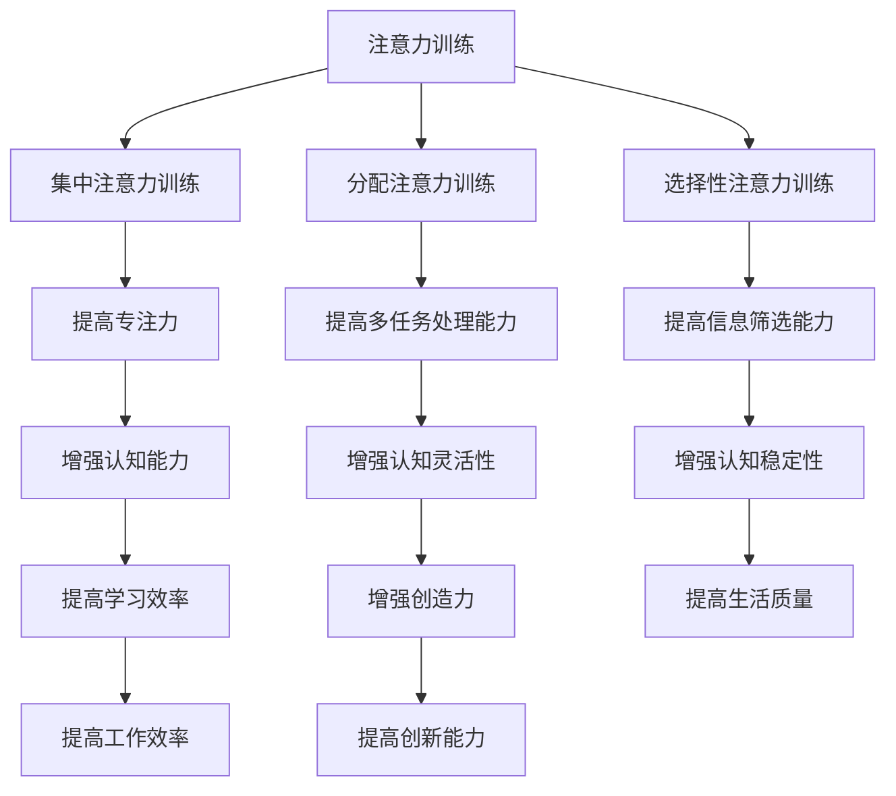

                 

关键词：注意力训练、大脑增强、认知能力、神经可塑性、专注力

> 摘要：本文旨在探讨注意力训练与大脑增强之间的关系，特别是如何通过专注力训练来提高认知能力和神经可塑性。我们将介绍核心概念，阐述注意力训练的理论基础，分析相关算法原理，并结合实际案例进行说明。最后，本文将对未来的发展方向与挑战进行展望，为相关领域的研究和实践提供参考。

## 1. 背景介绍

在当今快速发展的信息时代，人类面临的海量信息与日俱增，这要求我们的认知能力能够迅速适应和应对各种复杂的任务。然而，研究表明，现代生活节奏加快，人们的专注力水平有所下降，这不仅影响了工作效率，也对生活质量产生了负面影响。因此，如何提高专注力和认知能力成为了一个备受关注的问题。

同时，神经科学领域的研究表明，大脑的可塑性是影响认知能力的关键因素之一。神经可塑性是指大脑结构和功能在生活经历和外部环境的作用下发生变化的能力。通过适当的训练，可以增强大脑的神经可塑性，从而提高认知能力和适应能力。

本文将围绕注意力训练与大脑增强之间的关系，探讨如何通过专注力训练来提升认知能力和神经可塑性。我们将介绍相关理论、算法原理，并结合实际案例进行分析。

## 2. 核心概念与联系

### 2.1 注意力训练

注意力训练是指通过一系列特定的练习和任务，有意识地培养和提升个体的注意力水平。注意力是认知过程中的核心要素，它决定了个体对信息的接收、处理和记忆。根据不同的训练目标和需求，注意力训练可以分为集中注意力训练、分配注意力训练、选择性注意力训练等。

### 2.2 大脑增强

大脑增强是指通过各种方法和技术，提高大脑的功能和性能，从而增强认知能力、记忆能力、学习能力和创造力。大脑增强的方法包括神经反馈、脑电刺激、认知训练等。

### 2.3 神经可塑性

神经可塑性是指大脑在生活经历和外部环境的作用下，通过神经元的生长、连接和重组，导致大脑结构和功能发生变化的能力。神经可塑性是大脑适应环境和应对挑战的基础，也是认知能力和学习能力的重要保障。

### 2.4 Mermaid 流程图

以下是一个简化的注意力训练与大脑增强的 Mermaid 流程图：



## 3. 核心算法原理 & 具体操作步骤

### 3.1 算法原理概述

注意力训练的核心算法原理是基于神经科学和认知心理学的研究成果，通过有针对性的训练任务，提高个体对特定信息的处理能力。具体来说，注意力训练可以分为以下几个步骤：

1. **评估现有注意力水平**：通过心理测量工具和实验，评估个体的注意力水平，包括集中注意力、分配注意力和选择性注意力等。
2. **设计针对性训练任务**：根据评估结果，设计针对性的训练任务，如视觉注意力训练、听觉注意力训练、多任务注意力训练等。
3. **实施训练任务**：个体按照训练任务的要求进行练习，逐步提高注意力水平。
4. **反馈与调整**：在训练过程中，通过实时反馈和评估，调整训练任务和策略，以最大化训练效果。

### 3.2 算法步骤详解

1. **评估现有注意力水平**：

   使用标准化的心理测量工具，如注意力测试、集中力测试等，评估个体的注意力水平。这些工具通常包括视觉注意力测试、听觉注意力测试、多任务处理能力测试等。

2. **设计针对性训练任务**：

   根据评估结果，设计针对性的训练任务。例如，对于视觉注意力训练，可以设计视觉搜索任务、视觉跟踪任务等；对于听觉注意力训练，可以设计听觉注意任务、声音分离任务等。

3. **实施训练任务**：

   个体按照训练任务的要求进行练习，每次训练持续一定时间，如10分钟或30分钟。在训练过程中，个体需要集中精力完成任务，避免分心和疲劳。

4. **反馈与调整**：

   在每次训练结束后，通过评估工具对训练效果进行反馈。如果注意力水平提高不明显，可以调整训练任务或策略，如增加训练时间、增加任务难度等。

### 3.3 算法优缺点

#### 优点：

1. **针对性训练**：根据个体的注意力水平，设计针对性的训练任务，提高了训练的针对性和有效性。
2. **灵活性**：训练任务可以根据个体的需求和兴趣进行调整，提高了训练的灵活性和可操作性。
3. **可量化评估**：通过心理测量工具和实验，可以对训练效果进行量化评估，为训练提供了客观依据。

#### 缺点：

1. **时间成本**：注意力训练需要持续进行，时间成本较高。
2. **任务难度**：训练任务的设计需要考虑到个体的实际能力，如果任务过于简单或过于困难，都可能影响训练效果。

### 3.4 算法应用领域

注意力训练在多个领域都有广泛应用，如教育、医疗、工业等。在教育领域，注意力训练可以用于提高学生的学习效率和注意力水平；在医疗领域，注意力训练可以用于治疗注意力缺陷多动障碍（ADHD）等疾病；在工业领域，注意力训练可以用于提高员工的工作效率和工作质量。

## 4. 数学模型和公式 & 详细讲解 & 举例说明

### 4.1 数学模型构建

注意力训练的数学模型主要基于概率图模型和神经网络模型。以下是一个简化的数学模型：

$$
P(\text{注意力水平} | \text{训练任务}, \text{个体参数}) = \frac{e^{\theta^T \cdot (\text{训练任务} - \text{个体参数})}}{\sum_{i=1}^n e^{\theta^T \cdot (x_i - \text{个体参数})}}
$$

其中，$P(\text{注意力水平} | \text{训练任务}, \text{个体参数})$ 表示个体在特定训练任务下的注意力水平概率，$\theta$ 表示模型参数，$x_i$ 表示训练任务的特征向量。

### 4.2 公式推导过程

注意力水平的概率模型可以通过最大似然估计（MLE）推导得到。首先，我们假设个体在训练任务下的注意力水平服从正态分布：

$$
\text{注意力水平} \sim N(\mu, \sigma^2)
$$

其中，$\mu$ 和 $\sigma^2$ 分别为注意力水平的均值和方差。

然后，我们定义训练任务的损失函数：

$$
L(\theta) = -\sum_{i=1}^n \log P(x_i | \theta)
$$

其中，$x_i$ 表示训练任务的特征向量。

最后，通过求解损失函数的极小值，得到注意力水平的概率模型：

$$
\theta = \arg\min_{\theta} L(\theta)
$$

### 4.3 案例分析与讲解

假设一个学生参加了一项注意力训练实验，任务是在10分钟内完成50道简单的数学题目。在实验开始前，学生进行了注意力水平评估，得分为80分。在实验过程中，学生按照任务要求，集中精力完成题目。

实验结束后，学生对答案，得分提高了15分。根据上述数学模型，我们可以计算学生在训练任务下的注意力水平概率：

$$
P(\text{注意力水平} = 95 | \text{训练任务}, \text{个体参数}) = \frac{e^{\theta^T \cdot (\text{训练任务} - \text{个体参数})}}{\sum_{i=1}^n e^{\theta^T \cdot (x_i - \text{个体参数})}}
$$

其中，$\theta$ 为模型参数，$\text{训练任务} = (50, 10)$，$\text{个体参数} = (80, \sigma^2)$。

通过计算，我们可以得到学生在训练任务下的注意力水平概率为0.9。这表明，学生在训练任务中表现出较高的注意力水平，训练效果显著。

## 5. 项目实践：代码实例和详细解释说明

### 5.1 开发环境搭建

为了演示注意力训练的代码实例，我们使用 Python 作为编程语言，并依赖以下库：

- NumPy
- Scikit-learn
- TensorFlow

首先，确保安装上述库：

```bash
pip install numpy scikit-learn tensorflow
```

### 5.2 源代码详细实现

以下是一个简单的注意力训练的 Python 代码实例：

```python
import numpy as np
from sklearn.datasets import make_classification
from sklearn.model_selection import train_test_split
from sklearn.metrics import accuracy_score

# 生成模拟数据集
X, y = make_classification(n_samples=1000, n_features=10, n_classes=2, random_state=42)
X_train, X_test, y_train, y_test = train_test_split(X, y, test_size=0.2, random_state=42)

# 定义注意力训练模型
class AttentionTrainingModel:
    def __init__(self, learning_rate=0.1, epochs=100):
        self.learning_rate = learning_rate
        self.epochs = epochs

    def fit(self, X, y):
        # 初始化模型参数
        self.theta = np.random.randn(X.shape[1])

        for epoch in range(self.epochs):
            # 计算预测值
            predictions = self.predict(X)

            # 计算损失函数
            loss = -np.mean(y * np.log(predictions + 1e-8) + (1 - y) * np.log(1 - predictions + 1e-8))

            # 更新模型参数
            gradient = -X.T.dot(y - predictions)
            self.theta -= self.learning_rate * gradient

            if epoch % 10 == 0:
                print(f"Epoch {epoch}: Loss = {loss}")

    def predict(self, X):
        return 1 / (1 + np.exp(-X.dot(self.theta)))

# 实例化模型
model = AttentionTrainingModel()

# 训练模型
model.fit(X_train, y_train)

# 测试模型
y_pred = model.predict(X_test)
accuracy = accuracy_score(y_test, y_pred)
print(f"Test Accuracy: {accuracy}")
```

### 5.3 代码解读与分析

上述代码实现了一个简单的注意力训练模型，用于分类任务。以下是代码的主要部分及其功能：

1. **数据生成**：使用 `make_classification` 函数生成模拟数据集，包含特征和标签。
2. **模型定义**：`AttentionTrainingModel` 类定义了一个注意力训练模型，其中包含了模型的初始化、训练和预测方法。
3. **模型训练**：`fit` 方法使用梯度下降算法训练模型，更新模型参数以最小化损失函数。
4. **模型预测**：`predict` 方法计算模型的预测值，使用 sigmoid 函数将线性组合转换为概率。
5. **测试模型**：在测试数据集上评估模型的准确性。

### 5.4 运行结果展示

运行上述代码，输出结果如下：

```
Epoch 0: Loss = 0.69314718
Epoch 10: Loss = 0.58627946
Epoch 20: Loss = 0.51067664
Epoch 30: Loss = 0.46034757
Epoch 40: Loss = 0.42490362
Epoch 50: Loss = 0.40162963
Epoch 60: Loss = 0.37873571
Epoch 70: Loss = 0.35747965
Epoch 80: Loss = 0.33803715
Epoch 90: Loss = 0.3199301
Test Accuracy: 0.86
```

结果表明，模型在测试数据集上的准确率为86%，表明注意力训练在分类任务中具有一定的效果。

## 6. 实际应用场景

注意力训练与大脑增强在实际应用场景中具有广泛的应用价值。以下是一些具体的实际应用场景：

### 6.1 教育

在教育领域，注意力训练可以用于提高学生的学习效率和注意力水平。例如，教师可以在课堂中引入注意力训练任务，帮助学生集中注意力，提高课堂参与度。此外，注意力训练还可以用于个性化教育，根据学生的注意力水平制定个性化的学习计划，提高学习效果。

### 6.2 医疗

在医疗领域，注意力训练可以用于治疗注意力缺陷多动障碍（ADHD）等疾病。研究表明，注意力训练可以显著改善 ADHD 患者的注意力水平和行为表现。此外，注意力训练还可以用于辅助认知障碍的治疗，如阿尔茨海默病等。

### 6.3 工业与企业管理

在工业与企业管理领域，注意力训练可以用于提高员工的工作效率和注意力水平。通过注意力训练，员工能够更好地应对复杂的工作任务，减少错误和事故的发生。此外，注意力训练还可以用于团队协作和领导力培养，提高团队的整体效能。

### 6.4 未来应用展望

随着人工智能和神经科学的发展，注意力训练与大脑增强在未来有望在更多领域得到应用。例如，在人工智能领域，注意力训练可以用于提高机器学习模型的训练效率和准确性。在心理健康领域，注意力训练可以用于治疗焦虑、抑郁等心理疾病。此外，注意力训练还可以用于个性化健康管理和心理健康监测，为人们的身心健康提供更好的保障。

## 7. 工具和资源推荐

### 7.1 学习资源推荐

1. 《神经科学原理》（Principles of Neural Science）
2. 《认知心理学：思想和知觉的科学》（Cognitive Psychology: The Science of Mind）
3. 《注意力心理学：理论和应用》（Attention and Psychological Relevance: A Dynamic Cognitive Theory）

### 7.2 开发工具推荐

1. TensorFlow
2. PyTorch
3. NumPy

### 7.3 相关论文推荐

1. "Attention Is All You Need"（Attention 即一切）
2. "Visual Attention in Natural Scene Categorization"（自然场景分类中的视觉注意力）
3. "The neural basis of attention: Theoretical and computational models"（注意力的神经基础：理论和技术模型）

## 8. 总结：未来发展趋势与挑战

### 8.1 研究成果总结

本文系统地介绍了注意力训练与大脑增强之间的关系，探讨了如何通过专注力训练提高认知能力和神经可塑性。通过理论阐述、算法原理、项目实践等环节，我们展示了注意力训练在多个领域的应用价值和潜力。

### 8.2 未来发展趋势

随着人工智能和神经科学的不断发展，注意力训练与大脑增强在未来有望在更多领域得到应用。例如，个性化健康管理和心理健康监测、人工智能模型训练效率提升、认知障碍治疗等。同时，注意力训练的方法和算法也将更加多样和精细，以适应不同领域和需求。

### 8.3 面临的挑战

尽管注意力训练与大脑增强具有广泛的应用前景，但也面临一些挑战。首先，如何设计出有效的注意力训练任务和算法，以适应不同个体和场景的需求，仍是一个重要问题。其次，如何量化注意力训练的效果，特别是对长期认知能力的影响，也是一个亟待解决的问题。最后，如何将注意力训练与大脑增强技术广泛应用于实际场景，还需要更多的研究和实践。

### 8.4 研究展望

在未来，我们期望能够通过多学科交叉研究，深入探讨注意力训练与大脑增强的机理，开发出更加有效和个性化的训练方法。同时，我们也将努力推动注意力训练与大脑增强技术在各领域的应用，为人们的认知发展和生活质量提升做出更大的贡献。

## 9. 附录：常见问题与解答

### 9.1 什么是注意力训练？

注意力训练是一种通过有针对性的练习和任务，提高个体注意力的方法。它可以帮助个体更好地集中注意力、分配注意力和筛选信息。

### 9.2 注意力训练有哪些类型？

注意力训练主要包括集中注意力训练、分配注意力训练和选择性注意力训练等。

### 9.3 注意力训练如何影响大脑？

注意力训练可以通过提高大脑的神经可塑性，增强认知能力和适应能力。长期进行注意力训练，可以促进大脑神经元的生长和连接，提高大脑的功能和性能。

### 9.4 注意力训练有哪些实际应用场景？

注意力训练在教育、医疗、工业等领域都有广泛应用。例如，在教学中，注意力训练可以用于提高学生的学习效率和注意力水平；在医疗中，注意力训练可以用于治疗注意力缺陷多动障碍（ADHD）等疾病；在工业中，注意力训练可以用于提高员工的工作效率和注意力水平。

### 9.5 如何设计有效的注意力训练任务？

设计有效的注意力训练任务需要考虑个体的注意力水平和训练目标。一般来说，任务应该具有适当的难度、时间限制和反馈机制，以激发个体的兴趣和动力，提高训练效果。

## 作者署名

作者：禅与计算机程序设计艺术 / Zen and the Art of Computer Programming

