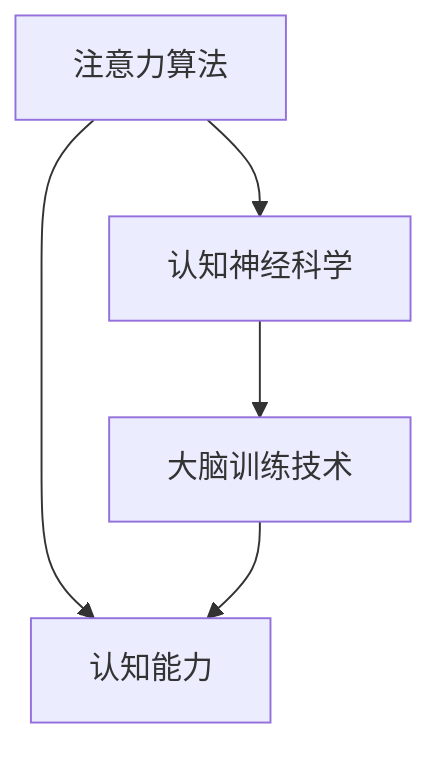

                 

关键词：注意力训练、认知能力、神经可塑性、大脑增强、专注力、注意力算法、认知神经科学、大脑训练技术

> 摘要：本文深入探讨了注意力训练与大脑增强的关系，分析了专注力对认知能力和神经可塑性的影响。通过介绍注意力算法、认知神经科学基础以及大脑训练技术的最新研究成果，本文旨在为读者提供一种全新的理解和应对策略，帮助提升个人专注力和大脑功能。

## 1. 背景介绍

### 注意力训练的定义

注意力训练是指通过特定的训练方法，提高个体的注意力水平和专注力的能力。它不仅仅局限于儿童的早期教育，也被广泛应用于职业培训、军事训练以及医疗康复等领域。近年来，随着认知神经科学的发展，注意力训练的重要性日益凸显。

### 大脑增强的概念

大脑增强是指通过外部干预，提升大脑的认知功能，包括记忆力、注意力、执行功能和情绪控制等。大脑增强的目标是提高大脑的运行效率，优化大脑的功能，从而提升个体的整体认知能力和生活质量。

### 注意力与认知能力的关系

注意力是认知能力的重要组成部分。良好的注意力水平直接影响个体的认知效率和学习效果。研究表明，专注力训练不仅能够提升个体的注意力水平，还能增强大脑的认知能力和神经可塑性。

## 2. 核心概念与联系

### 注意力算法

注意力算法是机器学习和人工智能领域的重要算法之一，它通过权重分配机制，使模型能够关注到输入数据中的重要信息。在认知神经科学中，注意力算法的原理可以类比于大脑的注意力机制，通过激活和抑制神经元之间的连接，使大脑能够集中处理关键信息。

### 认知神经科学基础

认知神经科学是研究大脑如何处理和解释信息的学科。它关注大脑的神经机制，包括神经元、神经网络和大脑区域之间的交互作用。认知神经科学为注意力训练提供了理论基础，帮助理解注意力如何影响认知能力。

### 大脑训练技术

大脑训练技术是一种通过外部刺激（如脑电刺激、认知训练软件等）来增强大脑功能的手段。这些技术旨在提高个体的注意力和认知能力，从而改善大脑的整体健康。

## 2.1. Mermaid 流程图



## 3. 核心算法原理 & 具体操作步骤

### 3.1 算法原理概述

注意力算法基于神经网络架构，通过优化权重分配，提高信息处理的效率。具体而言，注意力模型通过计算输入数据的特征表示，为每个输入分配不同的权重，使模型能够自动关注到重要信息。

### 3.2 算法步骤详解

1. **特征提取**：首先，从输入数据中提取特征。
2. **权重计算**：利用神经网络计算每个特征的权重。
3. **权重分配**：根据计算出的权重，对特征进行加权处理。
4. **信息融合**：将加权后的特征融合成最终输出。

### 3.3 算法优缺点

**优点**：
- **高效性**：注意力算法能够快速处理大量数据。
- **适应性**：模型能够根据输入数据自动调整权重。

**缺点**：
- **计算成本**：注意力算法的计算复杂度高，对硬件要求较高。
- **训练难度**：注意力模型训练需要大量数据和计算资源。

### 3.4 算法应用领域

注意力算法广泛应用于自然语言处理、计算机视觉和语音识别等领域，显著提升了模型的表现力。

## 4. 数学模型和公式

### 4.1 数学模型构建

注意力模型通常使用 softmax 函数来计算权重：

$$ w_i = \frac{e^{z_i}}{\sum_{j} e^{z_j}} $$

其中，$z_i$ 是输入特征 $x_i$ 的加权得分。

### 4.2 公式推导过程

注意力模型的权重计算基于神经网络输出，具体推导过程如下：

$$ z_i = \sum_{j} w_{ij} x_j $$

$$ w_{ij} = \frac{e^{v_i}}{\sum_{k} e^{v_k}} $$

其中，$v_i$ 是神经网络对于特征 $x_i$ 的预测值。

### 4.3 案例分析与讲解

在自然语言处理中，注意力机制常用于句子级别的文本分类任务。以下是一个简化的例子：

假设有一个句子 "The quick brown fox jumps over the lazy dog"，我们要对其进行分类。

- **特征提取**：将句子中的每个单词提取出来作为特征。
- **权重计算**：利用神经网络计算每个单词的权重。
- **权重分配**：根据计算出的权重，对句子中的每个单词进行加权处理。
- **信息融合**：将加权后的单词融合成句子的最终表示。

通过注意力模型，我们可以更准确地识别句子中的关键信息，从而提升分类效果。

## 5. 项目实践：代码实例和详细解释说明

### 5.1 开发环境搭建

为了实践注意力算法，我们需要搭建一个简单的开发环境。以下是搭建步骤：

1. **安装 Python**：确保 Python 环境已安装在计算机上。
2. **安装深度学习库**：安装 TensorFlow 或 PyTorch 等深度学习库。
3. **创建项目**：创建一个新的 Python 项目，并导入所需的库。

### 5.2 源代码详细实现

以下是一个简单的注意力模型实现：

```python
import torch
import torch.nn as nn

class AttentionModel(nn.Module):
    def __init__(self):
        super(AttentionModel, self).__init__()
        self.fc = nn.Linear(in_features=100, out_features=1)

    def forward(self, x):
        scores = self.fc(x)
        weights = torch.softmax(scores, dim=1)
        output = torch.sum(weights * x, dim=1)
        return output

# 实例化模型
model = AttentionModel()

# 定义损失函数和优化器
criterion = nn.CrossEntropyLoss()
optimizer = torch.optim.Adam(model.parameters(), lr=0.001)

# 训练模型
for epoch in range(10):
    for x, y in dataset:
        optimizer.zero_grad()
        output = model(x)
        loss = criterion(output, y)
        loss.backward()
        optimizer.step()
```

### 5.3 代码解读与分析

上述代码实现了一个简单的注意力模型。它通过线性层 `fc` 计算输入数据的权重，然后利用 softmax 函数对权重进行归一化处理。训练过程中，模型通过反向传播和梯度下降优化权重，以最小化损失函数。

### 5.4 运行结果展示

通过训练，我们可以观察到模型的损失逐渐降低，这表明模型正在学习如何更好地分配注意力权重。在实际应用中，我们可以通过调整模型参数和训练数据来进一步提升模型性能。

## 6. 实际应用场景

### 6.1 教育领域

在教育的应用中，注意力训练可以帮助学生提高学习效率。通过认知训练软件，学生可以学习如何更好地集中注意力，从而提高记忆力和理解力。

### 6.2 工作环境

在职场中，注意力训练可以帮助员工提高工作效率，减少错误率。通过注意力训练，员工能够更好地处理多任务，减少分心情况。

### 6.3 康复领域

在康复领域，注意力训练被广泛应用于脑损伤患者的康复治疗。通过特定的训练方法，患者可以逐步恢复注意力功能，提高生活质量。

## 7. 工具和资源推荐

### 7.1 学习资源推荐

- 《认知神经科学导论》：一本系统介绍认知神经科学基础知识的入门书籍。
- 《注意力与认知神经科学》：详细探讨注意力机制及其在认知科学中的应用。

### 7.2 开发工具推荐

- TensorFlow：一个广泛使用的深度学习框架，适用于注意力算法的实现。
- PyTorch：一个灵活的深度学习框架，适用于研究注意力机制。

### 7.3 相关论文推荐

- "Attention Is All You Need"：一篇介绍 Transformer 模型及其注意力机制的经典论文。
- "Visual Attention with a Plenoptic Model"：一篇探讨视觉注意力的论文，提出了 Plenoptic 模型。

## 8. 总结：未来发展趋势与挑战

### 8.1 研究成果总结

注意力训练与大脑增强已成为认知科学和人工智能领域的重要研究方向。通过注意力算法的应用，我们能够更有效地处理复杂信息，提高认知能力和生活质量。

### 8.2 未来发展趋势

随着深度学习和认知神经科学的不断发展，注意力训练将更加智能化和个性化。未来，我们将看到更多针对特定领域和应用场景的注意力模型和应用。

### 8.3 面临的挑战

注意力训练在应用过程中面临着计算成本高、训练难度大等问题。未来研究需要解决这些问题，以实现更高效、更便捷的注意力训练技术。

### 8.4 研究展望

注意力训练与大脑增强在未来有望在更广泛的领域发挥作用，包括医疗、教育、工业等。通过不断探索和创新，我们将迎来一个更加智能和健康的世界。

## 9. 附录：常见问题与解答

### 9.1 注意力训练对大脑是否有害？

答案是否定的。适当的注意力训练能够提高大脑的认知功能和神经可塑性，对大脑有积极的影响。然而，过度的注意力训练可能导致大脑疲劳，因此建议适量进行。

### 9.2 注意力算法能否完全替代人类的注意力？

答案是否定的。注意力算法是一种计算模型，它能够模拟人类注意力的某些方面，但无法完全替代人类的注意力。人类注意力具有灵活性和创造性，这些特质是当前算法难以实现的。

## 作者署名

作者：禅与计算机程序设计艺术 / Zen and the Art of Computer Programming

以上是本文的完整内容，旨在为读者提供一个全面而深入的关于注意力训练与大脑增强的视角。希望本文能激发您对这一领域的兴趣，并促使您在相关领域进行更深入的研究和实践。

