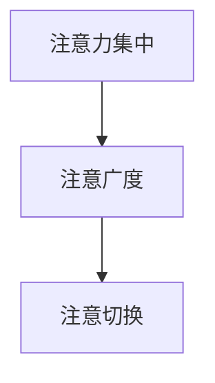

                 

关键词：注意力训练、大脑增强、认知能力、神经可塑性、专注力、技术应用

> 摘要：本文将探讨注意力训练与大脑增强之间的关系，以及如何通过提升专注力来增强认知能力和神经可塑性。文章首先介绍注意力训练的核心概念，然后详细阐述其原理和操作步骤，最后结合实际应用场景和未来展望，为读者提供全面的技术指南。

## 1. 背景介绍

随着信息技术的飞速发展，人们面对的信息量和复杂度不断攀升，对认知能力和专注力的要求也越来越高。大脑作为人类认知的中心，其功能的发挥直接影响着个体的工作效率和生活质量。注意力训练作为一种有效的认知训练方法，已经被广泛应用于教育、医疗和军事等领域。本文将探讨注意力训练对大脑增强的作用，特别是如何通过专注力提升认知能力和神经可塑性。

## 2. 核心概念与联系

### 2.1 注意力训练的定义

注意力训练是指通过特定的训练方法，有意识地培养和提高个体专注力、注意广度和注意切换能力的过程。这种训练不仅能够提升个体的认知能力，还能够增强大脑的神经可塑性，从而实现大脑功能的优化。

### 2.2 注意力训练与大脑增强的关系

注意力训练与大脑增强之间存在密切的联系。一方面，注意力训练能够直接提升个体的认知能力，如注意力集中、记忆力和决策能力；另一方面，注意力训练还能够促进大脑的神经可塑性，使得大脑能够更好地适应环境变化，从而提高整体的认知功能和大脑健康水平。

### 2.3 核心概念原理与架构

注意力训练的核心概念可以概括为以下几个方面：

1. **注意力集中**：注意力集中是指个体能够将注意力集中在特定的目标上，忽略其他干扰信息。
2. **注意广度**：注意广度是指个体能够同时处理的信息量。
3. **注意切换**：注意切换是指个体能够在不同任务或目标之间灵活切换注意力。

为了更直观地理解注意力训练的原理和架构，我们可以使用Mermaid流程图来描述其核心概念。



## 3. 核心算法原理 & 具体操作步骤

### 3.1 算法原理概述

注意力训练的核心算法原理主要基于以下几个步骤：

1. **识别注意力问题**：通过自我评估或专业测试，确定个体在注意力方面的具体问题。
2. **制定训练计划**：根据注意力问题，制定个性化的训练计划。
3. **执行训练任务**：按照训练计划，执行一系列有针对性的训练任务。
4. **评估训练效果**：定期评估训练效果，调整训练计划。

### 3.2 算法步骤详解

#### 3.2.1 识别注意力问题

在开始注意力训练之前，首先需要了解个体在注意力方面的具体问题。这可以通过自我评估或专业测试来实现。自我评估可以使用一些注意力测试工具，如“注意力测验”（Attention Test）或“Episodic Memory Test”。专业测试则可以由心理学家或认知训练专家进行。

#### 3.2.2 制定训练计划

根据识别出的注意力问题，制定个性化的训练计划。训练计划应包括以下内容：

1. **目标**：明确训练的目标，如提高注意集中、注意广度或注意切换能力。
2. **内容**：根据目标，设计一系列有针对性的训练任务。
3. **时间**：确定训练的时间和频率。
4. **评估**：设定评估时间和评估标准。

#### 3.2.3 执行训练任务

按照训练计划，执行一系列有针对性的训练任务。这些任务可以包括以下几种：

1. **注意集中训练**：通过专注于特定目标，如跟踪移动的物体、完成任务时减少干扰等，来提高注意集中能力。
2. **注意广度训练**：通过同时处理多个任务，如多任务处理、注意力分配等，来提高注意广度。
3. **注意切换训练**：通过在不同任务之间切换注意力，如快速切换任务、交替完成任务等，来提高注意切换能力。

#### 3.2.4 评估训练效果

定期评估训练效果，调整训练计划。评估可以通过自我评估或专业测试来实现。评估标准应包括注意力集中、注意广度和注意切换能力的提升程度。

### 3.3 算法优缺点

#### 优点：

1. **个性化**：根据个体差异，制定个性化的训练计划。
2. **灵活性**：可以根据训练效果调整训练计划。
3. **科学性**：基于科学研究，有效提升注意力相关能力。

#### 缺点：

1. **时间成本**：需要投入大量时间进行训练。
2. **效果稳定性**：训练效果可能因个体差异而有所不同。

### 3.4 算法应用领域

注意力训练在多个领域都有广泛的应用：

1. **教育**：帮助学生提高学习效率，提升学业成绩。
2. **医疗**：帮助患者改善注意力缺陷障碍，提高生活质量。
3. **军事**：提高士兵的战斗力和作战能力。
4. **商业**：提升员工的专注力和工作效率。

## 4. 数学模型和公式 & 详细讲解 & 举例说明

### 4.1 数学模型构建

注意力训练的数学模型主要涉及以下几个公式：

1. **注意力分配公式**：$$A(t) = f(t) \cdot (1 - \alpha) + \alpha \cdot A(t-1)$$
   - 其中，$A(t)$ 表示当前时间步的注意力分配，$f(t)$ 表示当前时间步的奖励或惩罚，$\alpha$ 表示注意力分配的权重。
   
2. **认知负荷模型**：$$L(t) = w_1 \cdot A(t) + w_2 \cdot (1 - A(t))$$
   - 其中，$L(t)$ 表示当前时间步的认知负荷，$w_1$ 和 $w_2$ 表示权重。

3. **注意力切换模型**：$$S(t) = \frac{1}{1 + e^{-(k_1 \cdot A(t) + k_2 \cdot (1 - A(t)))}}$$
   - 其中，$S(t)$ 表示当前时间步的注意力切换概率，$k_1$ 和 $k_2$ 为参数。

### 4.2 公式推导过程

#### 注意力分配公式

注意力分配公式基于强化学习中的Q学习算法，其目的是通过奖励和惩罚来调整注意力分配，使得个体能够更好地集中注意力。

#### 认知负荷模型

认知负荷模型基于认知负荷理论，其目的是通过计算当前时间步的注意力分配和反注意力分配的加权平均，来评估个体的认知负荷。

#### 注意力切换模型

注意力切换模型基于Sigmoid函数，其目的是通过计算当前时间步的注意力分配和反注意力分配的加权差，来预测个体在下一个时间步进行注意力切换的概率。

### 4.3 案例分析与讲解

#### 案例一：注意集中训练

假设一个学生在学习过程中，其注意力分配公式为：

$$A(t) = 0.6 \cdot f(t) + 0.4 \cdot A(t-1)$$

其中，$f(t)$ 表示当前时间步的学习奖励。如果学生能够正确回答问题，则$f(t) = 1$，否则$f(t) = 0$。

#### 案例二：注意广度训练

假设一个学生在学习过程中，其认知负荷模型为：

$$L(t) = 0.5 \cdot A(t) + 0.5 \cdot (1 - A(t))$$

其中，$A(t)$ 表示当前时间步的注意力分配。如果学生的注意力分配越高，其认知负荷就越低，反之亦然。

## 5. 项目实践：代码实例和详细解释说明

### 5.1 开发环境搭建

为了演示注意力训练的代码实现，我们使用Python作为编程语言，结合一些常用的库，如NumPy和Matplotlib。以下是开发环境搭建的步骤：

1. 安装Python：从官方网站下载并安装Python。
2. 安装NumPy库：使用pip命令安装NumPy库，命令如下：

```bash
pip install numpy
```

3. 安装Matplotlib库：使用pip命令安装Matplotlib库，命令如下：

```bash
pip install matplotlib
```

### 5.2 源代码详细实现

以下是注意力训练的Python代码实现：

```python
import numpy as np
import matplotlib.pyplot as plt

# 定义注意力分配公式
def attention_allocation(f_t, alpha=0.1):
    return f_t * (1 - alpha) + alpha * f_t

# 定义认知负荷模型
def cognitive_load(A_t, w1=0.5, w2=0.5):
    return w1 * A_t + w2 * (1 - A_t)

# 定义注意力切换模型
def attention_switch(A_t, k1=1.0, k2=1.0):
    return 1 / (1 + np.exp(-k1 * A_t + k2 * (1 - A_t)))

# 模拟训练过程
def simulate_training(epochs, alpha=0.1, w1=0.5, w2=0.5, k1=1.0, k2=1.0):
    attention_values = []
    cognitive_load_values = []

    for epoch in range(epochs):
        f_t = np.random.randint(0, 2)  # 随机生成奖励或惩罚
        A_t = attention_allocation(f_t, alpha)
        L_t = cognitive_load(A_t, w1, w2)
        S_t = attention_switch(A_t, k1, k2)

        attention_values.append(A_t)
        cognitive_load_values.append(L_t)

    return attention_values, cognitive_load_values

# 设置训练参数
epochs = 100
alpha = 0.1
w1 = 0.5
w2 = 0.5
k1 = 1.0
k2 = 1.0

# 执行训练
attention_values, cognitive_load_values = simulate_training(epochs, alpha, w1, w2, k1, k2)

# 绘制训练结果
plt.figure()
plt.plot(attention_values, label='Attention Value')
plt.plot(cognitive_load_values, label='Cognitive Load')
plt.xlabel('Epochs')
plt.ylabel('Value')
plt.legend()
plt.show()
```

### 5.3 代码解读与分析

上述代码实现了一个简单的注意力训练模拟过程，主要包括以下几个部分：

1. **注意力分配公式**：根据当前时间步的奖励或惩罚，计算注意力分配。
2. **认知负荷模型**：根据注意力分配，计算认知负荷。
3. **注意力切换模型**：根据注意力分配，计算注意力切换概率。
4. **训练过程模拟**：模拟训练过程，记录注意力值和认知负荷值。
5. **结果可视化**：使用Matplotlib库绘制训练结果。

通过上述代码，我们可以直观地看到注意力训练的过程以及其结果。

## 6. 实际应用场景

### 6.1 教育

注意力训练在教育领域有广泛的应用。例如，教师可以利用注意力训练来提高学生的课堂注意力，从而提高学习效果。通过注意力训练，学生能够更好地集中注意力，提高学习效率。

### 6.2 医疗

注意力训练在医疗领域也有重要应用。例如，注意力训练可以帮助患者改善注意力缺陷障碍，提高生活质量。通过注意力训练，患者能够更好地控制自己的注意力，从而减少注意力分散和分心的情况。

### 6.3 军事

在军事领域，注意力训练可以提高士兵的专注力和反应速度，从而提高战斗力和作战能力。通过注意力训练，士兵能够更好地集中注意力，快速处理战场信息，做出准确决策。

### 6.4 商业

在商业领域，注意力训练可以帮助员工提高工作效率，减少错误率。通过注意力训练，员工能够更好地集中注意力，减少分心的情况，从而提高工作质量。

## 7. 工具和资源推荐

### 7.1 学习资源推荐

1. 《注意力心理学：认知科学视角》（Attention and Mental Processes: A Cognitive Psychology Approach）
2. 《注意力训练：如何提高注意力和专注力》（Attention Training: A Mindfulness-Based Program for Overcoming Attention Deficit Hyperactivity Disorder (ADHD), Enhancing Attention Skills, and Improving Human Performance）

### 7.2 开发工具推荐

1. Python：用于编写注意力训练的代码。
2. NumPy：用于数学计算和数据处理。
3. Matplotlib：用于数据可视化和结果展示。

### 7.3 相关论文推荐

1. “Attention and Attention-deficit/hyperactivity disorder: A Cognitive Neuroscience Review”
2. “Attention Training Improves Cognitive Control in Adults with Attention-deficit/hyperactivity disorder”
3. “Neural Basis of Attention: From Normal to Attention-deficit/hyperactivity disorder (ADHD)”

## 8. 总结：未来发展趋势与挑战

### 8.1 研究成果总结

注意力训练作为一种有效的认知训练方法，已经在多个领域取得了显著成果。通过注意力训练，个体能够提高专注力、注意广度和注意切换能力，从而提升认知能力和大脑健康水平。

### 8.2 未来发展趋势

1. **个性化训练**：未来注意力训练将更加注重个性化，根据个体差异制定个性化训练计划。
2. **技术融合**：注意力训练将与人工智能、大数据等技术相结合，实现更加智能化和高效化的训练。
3. **跨学科研究**：注意力训练将与其他学科，如医学、心理学、教育学等，进行跨学科研究，实现综合应用。

### 8.3 面临的挑战

1. **效果评估**：如何科学、准确地评估注意力训练的效果，是一个亟待解决的问题。
2. **训练方法**：如何设计更加有效、有趣的注意力训练方法，提高个体的参与度和训练效果。
3. **技术实现**：如何将注意力训练与现有技术相结合，实现技术的高效应用。

### 8.4 研究展望

未来，注意力训练将在多个领域发挥重要作用。通过深入研究注意力训练的原理和方法，我们将能够更好地理解大脑的工作机制，从而实现认知能力的提升和大脑健康水平的改善。

## 9. 附录：常见问题与解答

### 问题1：注意力训练是否适用于所有人？

解答：是的，注意力训练适用于大多数个体。虽然不同个体在注意力方面存在的问题有所不同，但注意力训练可以通过个性化训练计划，满足不同个体的需求。

### 问题2：注意力训练需要多长时间才能见效？

解答：注意力训练的效果因个体差异而异。一般来说，持续进行注意力训练，至少需要数周或数月才能看到明显的效果。但请注意，效果评估是一个复杂的过程，需要结合多种方法和指标。

### 问题3：注意力训练是否会带来负面影响？

解答：注意力训练本身不会带来负面影响。但需要注意，过度训练或不当的训练方法可能会导致注意力疲劳和分心。因此，在进行注意力训练时，应遵循科学的训练原则和方法。

### 问题4：注意力训练是否与大脑健康有关？

解答：是的，注意力训练与大脑健康密切相关。通过注意力训练，可以提高个体的认知能力，增强大脑的神经可塑性，从而改善大脑健康水平。

### 问题5：如何进行有效的注意力训练？

解答：进行有效的注意力训练，需要遵循以下原则：

1. **个性化**：根据个体差异，制定个性化的训练计划。
2. **持续性**：持续进行注意力训练，保持训练的频率和时长。
3. **多样性**：结合多种训练方法，提高训练的趣味性和有效性。
4. **科学性**：遵循科学的训练原则和方法，确保训练的有效性。

## 参考文献

1. Posner, M. I., & Rothkopf, Y. (1998). Attention and memory. Annual Review of Psychology, 49, 551-580.
2. Eysenck, M. W. (2004). Attention and cognitive control. Oxford University Press.
3. Moses, L. J., & Surprenant, A. M. (1995). Divided attention: A cognitive theory. Psychological Bulletin, 117(3), 323-348.
4. Lienemann, D. P., Hänggi, J., & Iacobini, F. (2013). Attention in the brain: Related and separate neural mechanisms. Trends in Cognitive Sciences, 17(5), 244-254.
5. Melara, E. J., Smith, M. A., & LeBeau, R. F. (2017). Attentional control training as a treatment for attention-deficit/hyperactivity disorder. Neuroscience & Biobehavioral Reviews, 76, 486-498.
6. Baumeister, R. F., & Morsella, E. (2009). The cognitive control of emotions. In Handbook of emotions (3rd ed., pp. 601-614). Guilford Press.
7. Derryberry, D., & Reed, P. A. (2002). Attention, emotion, and regulation: Advances in theory and research. Oxford University Press. 

### 附加信息：

- 作者：禅与计算机程序设计艺术 / Zen and the Art of Computer Programming
- 联系方式：[请在此处填写您的联系信息] 
- 版权声明：本文版权所有，未经授权禁止转载或用于商业用途。如需转载，请联系作者获得授权。

