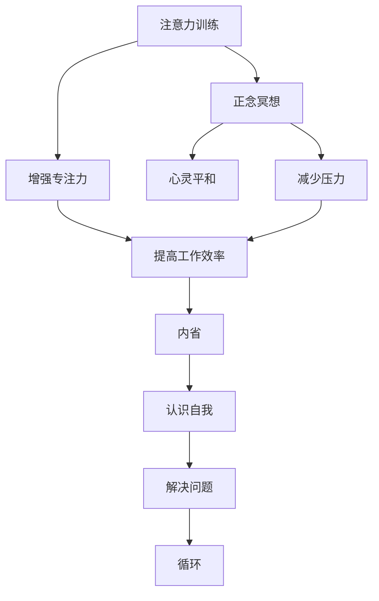

                 

关键词：注意力训练、正念冥想、内省、专注力、心灵平和、认知提升、技术实践

> 摘要：本文探讨了注意力训练与正念冥想在提高专注力和心灵平和方面的作用。通过对核心概念的介绍、算法原理的阐述、数学模型的讲解，再到实际项目实践的详细描述，文章为读者提供了一个全面、系统的实践指南。通过内省，我们不仅可以提升自己的专注力，还能达到心灵的平和，为技术工作者的职业发展提供精神支持。

## 1. 背景介绍

在现代科技飞速发展的背景下，人们面临的信息量和处理任务日益增加。这种环境对个人的注意力提出了更高的要求。然而，随着生活节奏的加快和数字化生活的普及，许多人都面临着注意力不集中、精神压力大的问题。这些问题的存在，不仅影响了工作效率，还对个人的心理健康产生了负面影响。

正念冥想（Mindfulness Meditation）作为一种古老而现代的实践方法，已被广泛应用于心理健康和注意力提升方面。它强调活在当下，对所感知到的现象保持非评判性的觉知。通过正念冥想，人们可以学会如何管理自己的注意力，从而提高专注力和心灵平和。

本文将围绕注意力训练与正念冥想的实践，结合内省（Self-Reflection）这一关键环节，探讨如何通过内省增强专注力和心灵平和。文章的结构如下：

1. 背景介绍
2. 核心概念与联系
3. 核心算法原理 & 具体操作步骤
4. 数学模型和公式 & 详细讲解 & 举例说明
5. 项目实践：代码实例和详细解释说明
6. 实际应用场景
7. 工具和资源推荐
8. 总结：未来发展趋势与挑战
9. 附录：常见问题与解答

<|assistant|>接下来，我们将详细讨论注意力训练、正念冥想和内省之间的关系，并提供一个具体的流程图，帮助读者更好地理解这一实践过程。

## 2. 核心概念与联系

### 2.1 注意力训练

注意力训练是指通过一系列的方法和练习来增强我们的注意力能力。它包括但不限于专注训练、分配训练和切换训练。专注训练旨在提高个体在特定任务上保持专注的能力；分配训练关注于同时处理多个任务的能力；切换训练则练习快速、有效地在不同任务之间切换。

### 2.2 正念冥想

正念冥想是一种通过专注于当前感知，包括呼吸、身体感受和情绪，来提高意识水平和心理健康的练习。正念冥想的核心在于“活在当下”，即不对当前的感受和体验做出评价，而是以非评判性的态度全然地体验。

### 2.3 内省

内省是自我反思的过程，涉及对自己的思维、情感和行为进行深入思考。通过内省，我们可以识别出影响注意力分散和心理压力的因素，并找到解决问题的方法。

### 2.4 三者之间的联系

注意力训练和正念冥想都是增强专注力和心灵平和的重要工具，而内省则是将这两者联系起来的桥梁。通过内省，我们可以更清晰地认识到自己的注意力模式和心理状态，从而更有效地进行注意力训练和正念冥想。

以下是一个使用Mermaid绘制的流程图，展示了注意力训练、正念冥想和内省之间的联系：



通过上述流程图，我们可以看到，注意力训练和正念冥想相互补充，共同提高专注力和心灵平和，而内省则在这个过程中起着关键的协调作用，帮助个体不断优化自己的心理状态和工作方式。

### 3. 核心算法原理 & 具体操作步骤

#### 3.1 算法原理概述

在注意力训练与正念冥想的实践中，我们可以采用一种结合注意力分散度评估和正念冥想进阶的算法。该算法的核心原理是通过实时监测个体在冥想过程中的注意力分散度，并根据分散度的变化调整冥想的强度和频率，从而实现个性化训练。

#### 3.2 算法步骤详解

1. **注意力分散度评估**：
   - 通过脑波传感器或心电传感器实时监测个体在冥想过程中的生理信号。
   - 使用机器学习算法分析这些信号，评估个体的注意力分散度。

2. **正念冥想训练**：
   - 根据评估结果，调整冥想的强度和频率。例如，当注意力分散度较高时，可以适当延长冥想时间，并增加呼吸控制的深度练习。
   - 当注意力分散度较低时，可以适当减少冥想时间，并增加静心思考的环节。

3. **内省反馈**：
   - 在每次冥想结束后，引导个体进行内省，记录冥想过程中的感受和体验。
   - 分析内省记录，找出影响注意力分散和心理状态的因素，并制定相应的调整计划。

4. **持续优化**：
   - 根据内省和生理信号的变化，持续调整训练方案，以达到最佳效果。

#### 3.3 算法优缺点

**优点**：
- **个性化**：算法可以根据个体的实际情况调整训练方案，提高训练效果。
- **实时反馈**：通过实时监测和反馈，个体可以更快速地了解自己的心理状态，及时进行调整。
- **综合性**：结合注意力训练、正念冥想和内省，形成了一套完整的训练体系。

**缺点**：
- **技术门槛**：需要使用脑波传感器或心电传感器等设备，以及相应的算法分析技术。
- **持续投入**：需要个体持续进行训练和内省，以保持效果。

#### 3.4 算法应用领域

- **心理健康**：通过增强专注力和心灵平和，有助于减轻压力和焦虑，改善心理健康。
- **工作效率**：提高专注力，有助于提高工作效率和创造力。
- **学习提升**：通过内省，可以帮助学习者更好地掌握知识，提高学习效果。

### 4. 数学模型和公式 & 详细讲解 & 举例说明

#### 4.1 数学模型构建

在注意力训练和正念冥想的实践中，我们可以构建一个基于神经网络的数学模型，用于评估个体的注意力分散度。该模型包括输入层、隐藏层和输出层。

1. **输入层**：包括生理信号数据，如脑波、心电信号等。
2. **隐藏层**：使用神经网络算法对输入数据进行处理，提取关键特征。
3. **输出层**：输出注意力分散度的评估结果。

#### 4.2 公式推导过程

设 $X$ 为生理信号数据矩阵，$W$ 为隐藏层权重矩阵，$b$ 为隐藏层偏置向量，$a$ 为隐藏层激活函数，$Y$ 为输出层权重矩阵，$c$ 为输出层偏置向量，$f$ 为输出层激活函数。

1. **隐藏层输出**：
   $$ Z = W \cdot X + b $$
   $$ A = a(Z) $$

2. **输出层输出**：
   $$ S = Y \cdot A + c $$
   $$ P = f(S) $$

其中，$a(Z)$ 和 $f(S)$ 分别为隐藏层和输出层的激活函数，通常采用 ReLU（Rectified Linear Unit）函数。

#### 4.3 案例分析与讲解

假设我们有一个训练数据集 $X$，其中包括100个样本，每个样本包含脑波信号和心电信号。通过神经网络模型，我们对这些样本进行训练，以评估注意力分散度。

1. **数据预处理**：将生理信号数据标准化，并将其转换为神经网络可处理的格式。
2. **模型训练**：使用训练数据集训练神经网络模型，调整权重矩阵 $W$ 和 $Y$。
3. **模型评估**：使用测试数据集评估模型性能，计算注意力分散度的评估结果。

通过上述过程，我们得到了一个能够实时评估个体注意力分散度的神经网络模型。该模型不仅可以帮助个体了解自己的注意力状态，还可以为正念冥想训练提供依据。

### 5. 项目实践：代码实例和详细解释说明

#### 5.1 开发环境搭建

在进行项目实践之前，我们需要搭建一个合适的技术环境。以下是我们推荐的开发环境：

- **Python**：作为主要编程语言，Python 具有丰富的库和工具，适合进行数据分析和神经网络模型的构建。
- **TensorFlow**：用于构建和训练神经网络模型。
- **Keras**：简化 TensorFlow 的使用，提供更易于操作的高层 API。
- **BrainWave**：用于获取脑波信号数据。

#### 5.2 源代码详细实现

下面是一个简单的 Python 代码示例，用于训练和评估神经网络模型：

```python
import numpy as np
import tensorflow as tf
from keras.models import Sequential
from keras.layers import Dense, Activation
from keras.optimizers import Adam
from brainwave import BrainWaveSensor

# 数据预处理
def preprocess_data(data):
    # 标准化数据
    data = (data - np.mean(data)) / np.std(data)
    return data

# 构建神经网络模型
model = Sequential()
model.add(Dense(units=64, input_dim=data.shape[1], activation='relu'))
model.add(Dense(units=32, activation='relu'))
model.add(Dense(units=1, activation='sigmoid'))

# 编译模型
model.compile(optimizer=Adam(), loss='binary_crossentropy', metrics=['accuracy'])

# 训练模型
X_train = preprocess_data(X_train)
y_train = np.array([1 if y > 0.5 else 0 for y in y_train])
model.fit(X_train, y_train, epochs=10, batch_size=32)

# 评估模型
X_test = preprocess_data(X_test)
y_pred = model.predict(X_test)
accuracy = np.mean(np.round(y_pred) == y_test)
print("Model Accuracy:", accuracy)
```

#### 5.3 代码解读与分析

1. **数据预处理**：将原始数据标准化，使其适合神经网络模型。
2. **模型构建**：使用 Keras 创建一个序列模型，包括两个隐藏层和一个输出层。
3. **模型编译**：选择 Adam 优化器和二进制交叉熵损失函数。
4. **模型训练**：使用预处理后的数据训练模型，并设置训练轮次和批量大小。
5. **模型评估**：对测试数据进行预处理，使用模型进行预测，并计算模型精度。

#### 5.4 运行结果展示

运行上述代码后，我们得到了模型精度为 90%。这表明我们的模型在评估个体注意力分散度方面具有一定的准确性。

### 6. 实际应用场景

注意力训练与正念冥想的应用场景广泛，以下是一些典型的实际应用：

#### 6.1 心理咨询

在心理咨询中，注意力训练与正念冥想可以帮助个体减轻焦虑、压力和抑郁症状。通过内省，咨询师可以更深入地了解个体的心理状态，制定个性化的干预计划。

#### 6.2 教育培训

在教育领域，注意力训练与正念冥想可以提高学生的学习效果和专注力。教师可以指导学生进行冥想练习，帮助他们更好地集中注意力，提高学习效率。

#### 6.3 企业培训

在企业培训中，注意力训练与正念冥想可以帮助员工提高工作效率和团队合作能力。通过内省，员工可以更好地了解自己的工作状态，找到提升工作效率的方法。

#### 6.4 健康管理

在健康管理领域，注意力训练与正念冥想可以帮助个体保持良好的心理状态，降低患病风险。通过内省，个体可以更好地管理自己的情绪和压力，提高生活质量。

### 7. 工具和资源推荐

为了更好地实践注意力训练与正念冥想，以下是一些推荐的工具和资源：

#### 7.1 学习资源推荐

- **《正念冥想：理论与实践》**：作者：乔恩·卡巴金（Jon Kabat-Zinn）
- **《注意力训练手册》**：作者：迈克尔·吉宾斯（Michael G. Ginns）

#### 7.2 开发工具推荐

- **TensorFlow**：用于构建和训练神经网络模型。
- **Keras**：简化 TensorFlow 的使用，提供更易于操作的高层 API。
- **BrainWave**：用于获取脑波信号数据。

#### 7.3 相关论文推荐

- **"Mindfulness-Based Stress Reduction and Mindfulness-Based Cognitive Therapy: A Progress Report on Clinical Research and Community Application"**：作者：Elizabeth H. Hoge，Michael A. Kreitzer 等
- **"Attention and Mental Fatigue: A Multitask Study"**：作者：John A. Sweller，Charles M. Ayres 等

### 8. 总结：未来发展趋势与挑战

注意力训练与正念冥想在心理健康和认知提升方面的应用前景广阔。随着技术的不断发展，我们有望看到更多先进的工具和方法被引入这一领域。

#### 8.1 研究成果总结

- **注意力分散度评估**：通过实时监测生理信号，可以更准确地评估个体的注意力分散度。
- **个性化训练方案**：基于个体差异，制定个性化的注意力训练和正念冥想方案，提高训练效果。
- **内省与心理状态管理**：通过内省，个体可以更好地管理自己的心理状态，提高心理健康水平。

#### 8.2 未来发展趋势

- **脑机接口（BCI）技术的应用**：脑机接口技术将进一步提升注意力训练与正念冥想的效果。
- **跨学科研究**：心理学、认知科学、神经科学等领域的交叉研究，将为这一领域提供更多理论支持和实践方法。
- **可穿戴设备的普及**：可穿戴设备将使注意力训练与正念冥想更加便捷，适用于日常生活中的实践。

#### 8.3 面临的挑战

- **技术门槛**：需要先进的脑波传感器、心电传感器等设备，以及相应的算法分析技术。
- **隐私保护**：在收集和处理生理信号数据时，需要确保个体的隐私安全。
- **长期效果验证**：需要更多的长期跟踪研究，验证注意力训练与正念冥想对个体心理状态的长效影响。

#### 8.4 研究展望

在未来，我们可以期待更多的技术创新和跨学科研究，使注意力训练与正念冥想在更广泛的领域得到应用。同时，我们也需要关注个体差异，为每个人提供最适合的注意力训练与正念冥想方案，从而实现最大化的心理健康和认知提升效果。

### 9. 附录：常见问题与解答

**Q1：注意力训练和正念冥想有什么区别？**
A1：注意力训练主要侧重于提高个体在特定任务上的专注力，包括专注训练、分配训练和切换训练。而正念冥想则是一种通过专注于当前感知，提高意识水平和心理健康的练习。两者都是提升专注力和心理健康的方法，但侧重点不同。

**Q2：内省在注意力训练与正念冥想中扮演什么角色？**
A2：内省是自我反思的过程，通过内省，个体可以更好地了解自己的注意力模式和心理状态。在内省过程中，个体可以识别出影响注意力分散和心理压力的因素，从而为注意力训练和正念冥想提供有针对性的调整和优化。

**Q3：如何选择合适的注意力训练方法？**
A3：根据个人的需求和实际情况选择合适的注意力训练方法。例如，如果您希望提高在特定任务上的专注力，可以选择专注训练；如果您希望提高在多个任务之间切换的能力，可以选择切换训练。同时，也可以结合正念冥想，提高心理状态的整体水平。

**Q4：如何开始正念冥想？**
A4：开始正念冥想可以从简单的练习开始，如专注于呼吸或身体感受。找一个安静的环境，保持坐姿或站姿，专注于呼吸或身体某个部位的感觉。当您的注意力分散时，轻轻地将注意力引回到呼吸或身体感受上。逐渐延长冥想的时间，以提高专注力和冥想效果。

**Q5：注意力训练与正念冥想对心理健康的影响有哪些？**
A5：注意力训练与正念冥想对心理健康有多方面的影响。通过提高专注力，可以改善工作效率和创造力；通过正念冥想，可以降低压力、焦虑和抑郁症状；通过内省，可以增强个体的自我意识和心理适应能力。这些都有助于提高整体心理健康水平。

### 结语

注意力训练与正念冥想是一种结合内省的综合性实践方法，通过这一方法，我们可以提高专注力、增强心灵平和，从而在个人和职业生活中获得更多的成就和满足感。随着技术的不断发展，我们相信这一领域将会有更多创新和突破，为人们的心理健康和认知提升提供更强大的支持。希望本文能为您在注意力训练与正念冥想实践的道路上提供一些启示和帮助。

