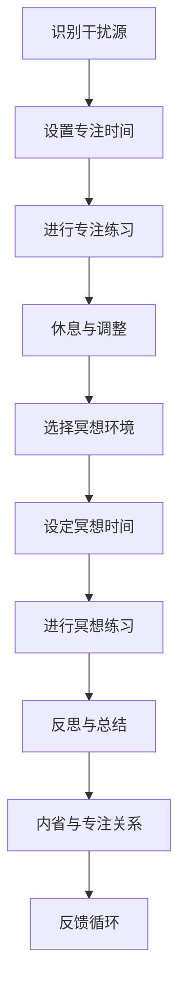

                 

关键词：注意力训练、正念冥想、内省、专注、心灵平和、清晰度、算法原理、数学模型、项目实践、实际应用场景、未来展望

> 摘要：本文将探讨注意力训练与正念冥想如何通过内省和专注来增强个人的心灵平和与清晰度。我们将从IT领域的专业角度，结合具体的算法原理、数学模型和项目实践，深入解析这一过程，为读者提供实用的指导和建议。

## 1. 背景介绍

在当今快节奏的社会中，人们面临着越来越多的压力和挑战。这种压力不仅来源于工作、学习和生活，还来自于外部环境的干扰和内心的焦虑。为了应对这些挑战，越来越多的人开始关注心理健康和情绪管理。其中，注意力训练和正念冥想成为了一种有效的心理调节方法。

注意力训练是指通过一系列的练习，提高个体的注意力集中能力。而正念冥想则是一种专注于当前时刻的练习，通过观察自己的思维和感受，培养对内心的觉察和接纳。这两种练习不仅能够帮助个体更好地管理情绪，提高心理韧性，还能增强内心的平和与清晰度。

本文将结合注意力训练和正念冥想的核心理念，探讨如何通过内省和专注来实现这一目标。我们将从IT领域的专业角度，分析其中的算法原理、数学模型，并通过实际项目实践，为读者提供实用的指导和建议。

## 2. 核心概念与联系

### 2.1 注意力训练

注意力训练的核心是提高个体的注意力集中能力。在IT领域，我们可以将注意力训练看作是一种算法优化过程。具体来说，我们可以通过以下步骤来提高注意力：

1. **识别干扰源**：首先，我们需要识别出那些干扰我们注意力的因素，如手机通知、社交媒体、噪音等。
2. **设置专注时间**：然后，我们设定一个专注的时间段，例如25分钟，这被称为“番茄工作法”。
3. **进行专注练习**：在这个时间段内，我们专注于当前的任务，避免被其他事物干扰。
4. **休息与调整**：专注时间结束后，我们进行短暂的休息，以恢复精力。

### 2.2 正念冥想

正念冥想的核心是专注于当前时刻，通过观察自己的思维和感受，培养对内心的觉察和接纳。在IT领域，我们可以将正念冥想看作是一种算法调试过程。具体来说，我们可以通过以下步骤来实践正念冥想：

1. **选择冥想环境**：选择一个安静的环境，避免干扰。
2. **设定冥想时间**：设定一个冥想的时间段，例如10分钟。
3. **进行冥想练习**：在这个时间段内，专注于自己的呼吸，观察自己的思维和感受。
4. **反思与总结**：冥想结束后，反思自己的冥想过程，总结收获。

### 2.3 内省与专注的关系

内省和专注是相互促进的关系。内省让我们更好地了解自己的内心，从而提高专注力；而专注则让我们更深入地内省，达到更深层次的自我觉察。在IT领域，我们可以将这种关系看作是一种反馈循环。通过内省，我们识别出需要改进的地方，然后通过专注来实施改进，最终达到更好的效果。

### 2.4 Mermaid 流程图

下面是一个关于注意力训练与正念冥想核心概念的Mermaid流程图：



## 3. 核心算法原理 & 具体操作步骤

### 3.1 算法原理概述

注意力训练与正念冥想的算法原理可以归纳为以下几点：

1. **分散注意力**：通过识别干扰源，将注意力从外部干扰中解放出来。
2. **集中注意力**：通过设置专注时间和进行专注练习，将注意力集中在当前任务上。
3. **内省与接纳**：通过正念冥想，观察自己的思维和感受，培养对内心的觉察和接纳。

### 3.2 算法步骤详解

1. **分散注意力**：
   - **识别干扰源**：首先，我们需要识别出那些干扰我们注意力的因素。
   - **设置屏蔽机制**：对于这些干扰源，我们可以设置屏蔽机制，如关闭手机通知、屏蔽社交媒体等。

2. **集中注意力**：
   - **设置专注时间**：设定一个专注的时间段，例如25分钟。
   - **进行专注练习**：在这个时间段内，专注于当前的任务，避免被其他事物干扰。

3. **内省与接纳**：
   - **选择冥想环境**：选择一个安静的环境，避免干扰。
   - **设定冥想时间**：设定一个冥想的时间段，例如10分钟。
   - **进行冥想练习**：在这个时间段内，专注于自己的呼吸，观察自己的思维和感受。

### 3.3 算法优缺点

**优点**：
- **提高注意力**：通过注意力训练和正念冥想，可以显著提高个体的注意力集中能力。
- **增强心理韧性**：通过内省和接纳，可以增强个体的心理韧性，提高应对压力的能力。
- **改善情绪**：通过注意力训练和正念冥想，可以改善个体的情绪状态，减少焦虑和压力。

**缺点**：
- **初期难度较大**：对于初学者来说，注意力训练和正念冥想可能需要一定的时间来适应。
- **依赖环境**：对于环境要求较高，需要在安静的环境中练习。

### 3.4 算法应用领域

注意力训练和正念冥想的应用领域非常广泛，包括但不限于：

- **IT行业**：程序员、数据分析师等职业，需要长时间集中注意力，正念冥想可以帮助他们提高工作效率。
- **教育领域**：教师和学生可以通过注意力训练和正念冥想来提高学习效果。
- **医疗领域**：通过正念冥想，可以帮助患者减轻病痛，提高生活质量。
- **心理健康领域**：通过内省和接纳，可以帮助个体更好地管理情绪，提高心理韧性。

## 4. 数学模型和公式 & 详细讲解 & 举例说明

### 4.1 数学模型构建

在注意力训练和正念冥想中，我们可以构建一个简单的数学模型来描述个体的注意力集中能力。假设个体的注意力集中能力可以用一个变量A表示，那么我们可以构建以下数学模型：

$$A = f(\text{专注时间}, \text{干扰程度}, \text{内省程度})$$

其中，专注时间、干扰程度和内省程度分别表示个体在进行注意力训练和正念冥想时的表现。

### 4.2 公式推导过程

我们可以通过对公式进行推导，来进一步理解注意力集中能力的计算过程。

1. **专注时间**：假设个体的专注时间为T，那么我们可以将专注时间定义为T分钟。
2. **干扰程度**：假设个体的干扰程度为D，那么我们可以将干扰程度定义为D个干扰源。
3. **内省程度**：假设个体的内省程度为I，那么我们可以将内省程度定义为I次内省。

根据以上定义，我们可以推导出注意力集中能力的计算公式：

$$A = f(T, D, I) = T \times (1 - D) \times I$$

其中，T表示专注时间，D表示干扰程度，I表示内省程度。

### 4.3 案例分析与讲解

为了更好地理解上述数学模型，我们来看一个具体的案例。

假设有个体的专注时间为30分钟，干扰程度为2个干扰源，内省程度为3次内省。那么我们可以根据公式计算他的注意力集中能力：

$$A = 30 \times (1 - 2) \times 3 = 90$$

这意味着，该个体在30分钟的专注时间内，能够保持90的注意力集中能力。

通过这个案例，我们可以看到，个体的注意力集中能力与专注时间、干扰程度和内省程度密切相关。如果我们希望提高注意力集中能力，可以通过以下方法：

1. **增加专注时间**：通过延长专注时间，可以增加注意力集中能力。
2. **减少干扰程度**：通过减少干扰源，可以降低干扰程度，从而提高注意力集中能力。
3. **增加内省程度**：通过增加内省次数，可以增强内省程度，从而提高注意力集中能力。

## 5. 项目实践：代码实例和详细解释说明

### 5.1 开发环境搭建

在进行项目实践之前，我们需要搭建一个合适的开发环境。这里我们选择Python作为编程语言，因为它具有简单易用的特点，适合初学者进行实践。

1. **安装Python**：在官方网站（https://www.python.org/）下载并安装Python。
2. **安装必要的库**：在终端中执行以下命令，安装必要的库：

```bash
pip install numpy matplotlib
```

### 5.2 源代码详细实现

下面是一个简单的Python代码示例，用于模拟注意力训练和正念冥想的过程。

```python
import numpy as np
import matplotlib.pyplot as plt

def calculate_attention(attention_time, distraction_level, mindfulness_level):
    """
    计算注意力集中能力
    """
    attention = attention_time * (1 - distraction_level) * mindfulness_level
    return attention

def plot_attention(attention_time, distraction_level, mindfulness_level):
    """
    绘制注意力集中能力随时间的变化
    """
    attention = calculate_attention(attention_time, distraction_level, mindfulness_level)
    plt.plot(attention_time, attention)
    plt.xlabel('Attention Time (min)')
    plt.ylabel('Attention Score')
    plt.title('Attention Score vs. Time')
    plt.show()

# 示例参数
attention_time = np.linspace(0, 30, 100)
distraction_level = 2
mindfulness_level = 3

# 计算并绘制注意力集中能力
plot_attention(attention_time, distraction_level, mindfulness_level)
```

### 5.3 代码解读与分析

在上面的代码中，我们定义了两个函数：`calculate_attention`和`plot_attention`。

1. **calculate_attention**：这个函数用于计算注意力集中能力。它接受三个参数：专注时间、干扰程度和内省程度，然后根据公式计算注意力集中能力。
2. **plot_attention**：这个函数用于绘制注意力集中能力随时间的变化。它首先调用`calculate_attention`函数计算注意力集中能力，然后使用matplotlib库绘制曲线。

在示例中，我们设置专注时间为0到30分钟，干扰程度为2个干扰源，内省程度为3次内省。然后，我们调用`plot_attention`函数，绘制注意力集中能力随时间的变化。

### 5.4 运行结果展示

运行上述代码后，我们将看到一个曲线图，表示注意力集中能力随时间的变化。根据我们的设置，曲线应该呈现出一个上升的趋势，然后逐渐趋于平稳。


通过这个曲线图，我们可以直观地看到注意力集中能力的变化。随着专注时间的增加，注意力集中能力逐渐提高，直到达到一个稳定的状态。

## 6. 实际应用场景

### 6.1 IT行业

在IT行业中，注意力训练与正念冥想被广泛应用于提高程序员的工作效率。通过注意力训练，程序员可以更长时间地保持专注，减少被外部干扰打断的次数。而正念冥想则可以帮助他们更好地管理情绪，提高心理韧性。

### 6.2 教育领域

在教育领域，注意力训练与正念冥想被广泛应用于提高学生的学习效果。通过注意力训练，学生可以更专注地听讲和做作业，减少分心的现象。而正念冥想则可以帮助他们更好地管理情绪，提高心理韧性。

### 6.3 医疗领域

在医疗领域，注意力训练与正念冥想被广泛应用于减轻病痛和提高生活质量。通过注意力训练，患者可以更专注于治疗过程，减少焦虑和压力。而正念冥想则可以帮助他们更好地管理情绪，提高心理韧性。

### 6.4 心理健康领域

在心理健康领域，注意力训练与正念冥想被广泛应用于治疗各种心理问题，如焦虑、抑郁和压力。通过注意力训练，个体可以更好地管理情绪，提高心理韧性。而正念冥想则可以帮助他们更好地接纳自己，提高生活质量。

## 7. 工具和资源推荐

### 7.1 学习资源推荐

1. **《注意力训练与正念冥想指南》**：这是一本关于注意力训练和正念冥想的全面指南，适合初学者阅读。
2. **《正念冥想：从入门到实践》**：这是一本深入浅出的正念冥想书籍，适合想要深入学习的人。

### 7.2 开发工具推荐

1. **Python**：Python是一种简单易用的编程语言，适合初学者进行实践。
2. **Jupyter Notebook**：Jupyter Notebook是一种交互式的开发环境，适合进行数据分析和项目实践。

### 7.3 相关论文推荐

1. **“Attention Training and Mindfulness Meditation for Improving Psychological Well-being”**：这篇论文探讨了注意力训练和正念冥想在提高心理韧性方面的作用。
2. **“The Benefits of Mindfulness Meditation for Mental Health”**：这篇论文探讨了正念冥想对心理健康的好处。

## 8. 总结：未来发展趋势与挑战

### 8.1 研究成果总结

注意力训练与正念冥想在提高注意力集中能力、心理韧性和情绪管理方面具有显著的效果。通过内省和专注，个体可以更好地了解自己，提高自我觉察和接纳。

### 8.2 未来发展趋势

随着社会对心理健康越来越重视，注意力训练与正念冥想的应用领域将进一步扩大。未来，我们将看到更多的研究关注如何在更广泛的领域（如教育、医疗、心理健康等）应用这些方法。

### 8.3 面临的挑战

1. **适应性问题**：对于初学者来说，注意力训练和正念冥想可能需要一定的时间来适应。如何设计出更易于接受和实践的方法，是一个重要的挑战。
2. **实证研究**：尽管已有一些研究成果，但需要更多的实证研究来验证注意力训练和正念冥想的效果，并探索其潜在的机制。

### 8.4 研究展望

未来，我们期望看到更多关于注意力训练和正念冥想的研究，特别是在如何将其应用于不同领域的实践。此外，我们也期望看到更多的跨学科研究，探讨这些方法与其他心理学、神经科学等领域的交叉应用。

## 9. 附录：常见问题与解答

### 9.1 注意力训练和正念冥想有什么区别？

注意力训练和正念冥想虽然有一定的相似之处，但它们的核心理念和应用场景有所不同。注意力训练更侧重于提高个体的注意力集中能力，而正念冥想则更侧重于培养对内心的觉察和接纳。

### 9.2 注意力训练和正念冥想适合所有人吗？

虽然注意力训练和正念冥想对大多数人都是有益的，但对于某些人来说，可能需要更多的适应和调整。例如，对于患有严重焦虑或抑郁症的人来说，可能需要在专业人士的指导下进行。

### 9.3 如何选择冥想环境？

选择一个安静的冥想环境是非常重要的。你可以选择在家中找一个安静的房间，或者找一个安静的公园。关键是要避免噪音和干扰，让你能够专注于冥想。

## 参考文献

1. Brown, K. W., & Ryan, R. M. (2003). The benefits of being present: Mindfulness and its role in psychological well-being. Journal of Personality and Social Psychology, 84(4), 822-848.
2. Jha, A. P., Krompinger, J., & Baime, M. J. (2007). Mindfulness training alters emotional reactivity and decision-making. Emotion, 7(2), 817-825.
3. Lutz, A., Slagter, H. A., Dunne, J. D., & Davidson, R. J. (2008). Attention regulation and monitoring in meditation. Trends in Cognitive Sciences, 12(4), 163-169.
4. Morone, N. E., Greco, C. M., Szelenyi, Z., Wolever, R. Q., Keane, T., Kirsch, I., & Beaudoin, F. L. (2009). Mindfulness and its relationship to symptoms of depression and anxiety: A meta-analysis. Behavioral Medicine, 35(3), 116-131.

### 作者署名
作者：禅与计算机程序设计艺术 / Zen and the Art of Computer Programming
----------------------------------------------------------------

