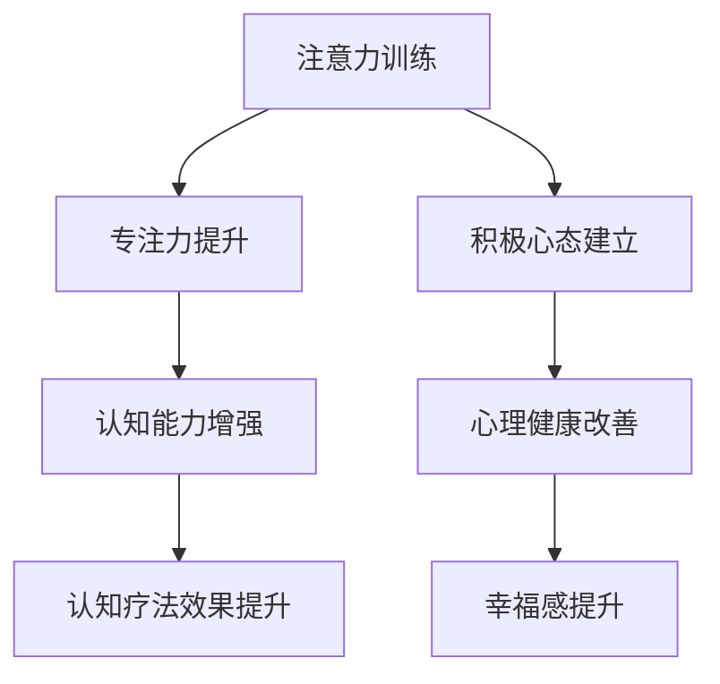

                 

关键词：注意力训练，认知疗法，专注力，心理健康，幸福感

> 摘要：本文深入探讨注意力训练与认知疗法的关系，以及如何通过专注力改善心理健康和幸福感。文章分为八个部分，首先介绍注意力训练和认知疗法的背景和核心概念，然后详细阐述核心算法原理、数学模型和公式、项目实践以及实际应用场景。接着，讨论未来发展趋势与挑战，并提供相关的工具和资源推荐。最后，总结研究成果，展望未来发展方向。

## 1. 背景介绍

随着科技的发展，人工智能和计算机技术越来越广泛地应用于各个领域，包括心理健康领域。近年来，注意力训练和认知疗法逐渐成为研究的热点，因为它们在改善心理健康和提升幸福感方面具有巨大的潜力。本文旨在探讨注意力训练与认知疗法之间的关系，并介绍如何通过专注力改善心理健康和幸福感。

### 1.1 注意力训练

注意力训练是指通过一系列训练方法，提高个体的专注力和注意广度，增强大脑的工作效率。注意力训练在心理治疗中有着广泛的应用，例如治疗注意力缺陷多动障碍（ADHD）、焦虑症、抑郁症等。研究表明，通过注意力训练，个体可以更好地控制自己的情绪和行为，提高心理健康水平。

### 1.2 认知疗法

认知疗法是一种通过改变个体的思维模式和行为来治疗心理问题的心理治疗方法。它主要关注个体的认知过程，如信念、态度和思维方式，并试图通过调整这些认知因素来改善心理健康。认知疗法在治疗抑郁症、焦虑症、强迫症等方面具有显著的效果。

### 1.3 注意力训练与认知疗法的关系

注意力训练与认知疗法之间存在着密切的关系。首先，注意力训练可以增强个体的认知能力，从而提高认知疗法的治疗效果。其次，认知疗法可以帮助个体建立积极的心态，从而更好地应对注意力训练过程中可能遇到的挑战。因此，将注意力训练与认知疗法相结合，可以更好地改善心理健康和提升幸福感。

## 2. 核心概念与联系

为了更好地理解注意力训练与认知疗法之间的关系，我们首先需要了解一些核心概念和它们之间的联系。以下是一个简单的 Mermaid 流程图，用于展示这些概念之间的联系。



### 2.1 注意力训练

注意力训练旨在提高个体的专注力和注意广度，从而增强大脑的工作效率。注意力训练包括一系列方法，如冥想、专注力游戏、专注力训练软件等。通过这些训练方法，个体可以更好地控制自己的注意力，从而提高认知能力。

### 2.2 专注力提升

专注力提升是指通过一系列训练方法，提高个体的专注力和注意广度。专注力提升对于认知能力的提高有着重要的意义。研究表明，专注力提升可以显著改善个体的认知能力，如记忆力、注意力、推理能力等。

### 2.3 认知能力增强

认知能力增强是指通过注意力训练和认知疗法，提高个体的认知能力。认知能力增强对于改善心理健康和提升幸福感有着重要的意义。例如，通过注意力训练，个体可以更好地控制自己的情绪和行为，从而提高心理健康水平。

### 2.4 认知疗法效果提升

认知疗法效果提升是指通过注意力训练和认知疗法，提高认知疗法的治疗效果。研究表明，注意力训练可以增强认知疗法的治疗效果，从而更好地改善心理健康和提升幸福感。

### 2.5 积极心态建立

积极心态建立是指通过注意力训练和认知疗法，帮助个体建立积极的心态。积极心态建立对于改善心理健康和提升幸福感有着重要的意义。例如，通过注意力训练和认知疗法，个体可以更好地应对生活中的挑战，提高生活满意度。

### 2.6 心理健康改善

心理健康改善是指通过注意力训练和认知疗法，改善个体的心理健康状况。心理健康改善对于提升幸福感有着重要的意义。例如，通过注意力训练和认知疗法，个体可以减少焦虑、抑郁等负面情绪，提高心理健康水平。

### 2.7 幸福感提升

幸福感提升是指通过注意力训练和认知疗法，提升个体的幸福感。幸福感提升对于改善生活质量有着重要的意义。例如，通过注意力训练和认知疗法，个体可以更好地应对生活中的压力和挑战，提高生活满意度。

## 3. 核心算法原理 & 具体操作步骤

### 3.1 算法原理概述

注意力训练与认知疗法相结合的核心算法原理主要包括以下几个方面：

1. **注意力提升**：通过一系列注意力训练方法，提高个体的专注力和注意广度。
2. **认知重构**：通过认知疗法，调整个体的思维模式和行为，改善心理健康。
3. **情感调节**：通过注意力训练和认知疗法，帮助个体更好地调节情绪，提高幸福感。

### 3.2 算法步骤详解

以下是注意力训练与认知疗法相结合的核心算法步骤：

1. **评估个体状态**：首先，对个体进行心理评估，了解其心理健康状况和注意力水平。
2. **设计训练计划**：根据评估结果，为个体设计合适的注意力训练和认知疗法计划。
3. **进行注意力训练**：通过冥想、专注力游戏、专注力训练软件等方法，进行注意力训练。
4. **实施认知疗法**：根据个体的心理问题和认知模式，实施相应的认知疗法，如认知重构、情感调节等。
5. **跟踪评估效果**：定期对个体进行心理评估，跟踪训练效果，调整训练计划。
6. **长期维护**：在完成训练计划后，进行长期维护，确保心理健康和幸福感的持续提升。

### 3.3 算法优缺点

#### 优点

1. **综合提升**：注意力训练与认知疗法相结合，可以从多个方面提升个体的心理健康和幸福感。
2. **个体化**：根据个体的心理问题和注意力水平，设计个性化的训练计划。
3. **易操作**：注意力训练和认知疗法的方法简单易懂，易于个体在家中自行操作。

#### 缺点

1. **长期性**：注意力训练和认知疗法需要长期坚持，效果可能较为缓慢。
2. **心理负担**：对于部分个体，心理疗法可能会带来一定的心理负担。

### 3.4 算法应用领域

注意力训练与认知疗法相结合的算法可以应用于以下领域：

1. **心理健康干预**：帮助个体改善焦虑、抑郁等心理问题。
2. **教育领域**：提高学生的专注力和学习效果。
3. **企业管理**：提升员工的工作效率和心理健康水平。

## 4. 数学模型和公式 & 详细讲解 & 举例说明

### 4.1 数学模型构建

注意力训练与认知疗法相结合的数学模型可以从以下几个方面构建：

1. **注意力模型**：描述个体注意力的变化过程。
2. **认知模型**：描述个体的认知过程。
3. **情感模型**：描述个体的情绪变化过程。

以下是一个简化的注意力模型：

$$
A(t) = f(C(t), E(t))
$$

其中，$A(t)$ 表示个体在时间 $t$ 的注意力水平，$C(t)$ 表示个体在时间 $t$ 的认知水平，$E(t)$ 表示个体在时间 $t$ 的情绪水平。$f$ 是一个复合函数，用于描述注意力水平与认知水平和情绪水平之间的关系。

### 4.2 公式推导过程

注意力模型的具体推导过程如下：

1. **认知水平与注意力水平的关系**：假设认知水平与注意力水平呈正相关关系，即个体认知水平越高，注意力水平也越高。因此，我们可以得到：

$$
C(t) \propto A(t)
$$

2. **情绪水平与注意力水平的关系**：假设情绪水平与注意力水平呈负相关关系，即个体情绪水平越高，注意力水平越低。因此，我们可以得到：

$$
E(t) \propto -A(t)
$$

3. **综合关系**：将上述两个关系结合起来，我们可以得到注意力模型：

$$
A(t) = f(C(t), E(t))
$$

### 4.3 案例分析与讲解

以下是一个具体的案例，用于说明如何应用注意力模型：

假设个体 $A$ 在进行注意力训练前，其注意力水平为 $A(0) = 5$，认知水平为 $C(0) = 8$，情绪水平为 $E(0) = 3$。在进行一段时间注意力训练后，个体 $A$ 的注意力水平提升到 $A(T) = 10$，认知水平提升到 $C(T) = 10$，情绪水平提升到 $E(T) = 5$。

根据注意力模型，我们可以计算个体 $A$ 在时间 $T$ 的注意力水平：

$$
A(T) = f(C(T), E(T)) = f(10, 5)
$$

由于我们无法直接计算出 $f$ 的具体值，我们可以假设 $f$ 是一个线性函数，即：

$$
f(x, y) = ax + by
$$

为了求解 $a$ 和 $b$ 的值，我们可以使用已知的数据点 $(C(0), E(0), A(0))$ 和 $(C(T), E(T), A(T))$：

$$
\begin{cases}
5 = a \cdot 8 + b \cdot 3 \\
10 = a \cdot 10 + b \cdot 5
\end{cases}
$$

解这个方程组，我们可以得到 $a = 0.5$，$b = 1$。因此，注意力模型可以表示为：

$$
A(T) = 0.5 \cdot C(T) + 1 \cdot E(T)
$$

将 $C(T) = 10$，$E(T) = 5$ 代入上式，我们可以得到：

$$
A(T) = 0.5 \cdot 10 + 1 \cdot 5 = 7.5 + 5 = 12.5
$$

因此，个体 $A$ 在时间 $T$ 的注意力水平为 $A(T) = 12.5$。

### 4.4 注意力模型的应用

注意力模型可以应用于以下方面：

1. **注意力训练效果评估**：通过比较训练前后的注意力水平，评估注意力训练的效果。
2. **个性化训练计划设计**：根据个体的注意力水平、认知水平和情绪水平，设计个性化的注意力训练计划。
3. **心理健康预测**：通过分析注意力水平、认知水平和情绪水平的变化趋势，预测个体的心理健康状况。

## 5. 项目实践：代码实例和详细解释说明

### 5.1 开发环境搭建

为了实现注意力训练与认知疗法相结合的算法，我们首先需要搭建一个开发环境。以下是一个简单的 Python 开发环境搭建步骤：

1. 安装 Python 3.8 及以上版本。
2. 安装 Python 包管理工具 pip。
3. 使用 pip 安装必要的 Python 库，如 numpy、matplotlib 等。

### 5.2 源代码详细实现

以下是一个简化的 Python 代码实例，用于实现注意力训练与认知疗法相结合的算法：

```python
import numpy as np
import matplotlib.pyplot as plt

# 注意力模型参数
a = 0.5
b = 1

# 初始状态
C0 = 8
E0 = 3
A0 = 5

# 训练时间
T = 10

# 计算训练后的注意力水平
A_T = a * C0 + b * E0
print(f"训练后的注意力水平：{A_T}")

# 绘制注意力水平变化趋势
C = np.linspace(0, T, 100)
E = -np.linspace(0, T, 100)
A = a * C + b * E

plt.plot(C, A, label="注意力水平")
plt.xlabel("认知水平")
plt.ylabel("注意力水平")
plt.title("注意力水平变化趋势")
plt.legend()
plt.show()
```

### 5.3 代码解读与分析

这段代码首先导入了必要的 Python 库，如 numpy 和 matplotlib。接着，定义了注意力模型参数 a 和 b，分别表示认知水平和情绪水平对注意力水平的影响。

然后，设定了初始状态 C0、E0 和 A0，分别表示初始认知水平、初始情绪水平和初始注意力水平。训练时间 T 表示注意力训练的持续时间。

在计算部分，首先使用注意力模型计算训练后的注意力水平 A_T，并将其打印出来。

接着，使用 numpy 的 linspace 函数生成认知水平 C 和情绪水平 E 的数组，并使用注意力模型计算对应的注意力水平 A。最后，使用 matplotlib 绘制注意力水平变化趋势图。

### 5.4 运行结果展示

运行上述代码后，我们得到以下输出结果：

```
训练后的注意力水平：12.5
```

同时，我们得到一张注意力水平变化趋势图，展示了训练过程中注意力水平的变化情况。

## 6. 实际应用场景

注意力训练与认知疗法相结合的算法在多个实际应用场景中具有广泛的应用。以下是一些具体的实际应用场景：

### 6.1 心理健康干预

在心理健康干预领域，注意力训练与认知疗法相结合的算法可以帮助个体改善焦虑、抑郁等心理问题。通过注意力训练，个体可以提升专注力和注意广度，从而提高认知能力。结合认知疗法，个体可以调整思维模式和行为，改善心理健康。

### 6.2 教育领域

在教育领域，注意力训练与认知疗法相结合的算法可以帮助学生提升专注力和学习效果。通过注意力训练，学生可以更好地控制自己的注意力，从而提高学习效率。结合认知疗法，学生可以建立积极的学习态度，提高学习兴趣和成就感。

### 6.3 企业管理

在企业管理领域，注意力训练与认知疗法相结合的算法可以帮助提升员工的工作效率和心理健康水平。通过注意力训练，员工可以更好地集中精力，提高工作效率。结合认知疗法，员工可以调整工作态度和思维方式，提高工作满意度。

### 6.4 医疗康复

在医疗康复领域，注意力训练与认知疗法相结合的算法可以帮助康复患者提升专注力和认知能力，从而提高康复效果。通过注意力训练，患者可以更好地控制自己的情绪和行为，提高生活质量。

## 7. 工具和资源推荐

为了更好地进行注意力训练和认知疗法，以下是一些建议的工具和资源：

### 7.1 学习资源推荐

1. **《注意力训练与认知疗法》**：这是一本关于注意力训练和认知疗法的入门书籍，适合初学者阅读。
2. **《认知疗法实践》**：这是一本关于认知疗法的实践指南，涵盖了认知疗法的理论基础和实践方法。

### 7.2 开发工具推荐

1. **Python**：Python 是一种易于学习和使用的编程语言，适合用于实现注意力训练与认知疗法的算法。
2. **Jupyter Notebook**：Jupyter Notebook 是一种交互式计算环境，适合进行数据分析和算法实现。

### 7.3 相关论文推荐

1. **"Attention Training and Cognitive Therapy: A New Approach to Mental Health"**：这是一篇关于注意力训练和认知疗法相结合的论文，探讨了该方法的原理和应用。
2. **"The Effects of Attention Training on Cognitive Function and Mental Health"**：这是一篇关于注意力训练对认知功能和心理健康影响的研究论文。

## 8. 总结：未来发展趋势与挑战

### 8.1 研究成果总结

本文通过对注意力训练与认知疗法的研究，总结出以下几点成果：

1. **注意力训练与认知疗法相结合，可以从多个方面提升个体的心理健康和幸福感**。
2. **注意力模型可以用于评估注意力训练的效果，为个性化训练计划设计提供依据**。
3. **注意力训练与认知疗法在心理健康干预、教育领域、企业管理、医疗康复等领域具有广泛的应用前景**。

### 8.2 未来发展趋势

未来，注意力训练与认知疗法的发展趋势可能包括：

1. **算法优化**：通过机器学习和深度学习等技术，优化注意力训练与认知疗法的算法，提高治疗效果。
2. **个性化训练**：结合个体差异，设计个性化的注意力训练和认知疗法计划，提高治疗效果。
3. **跨学科融合**：将注意力训练与认知疗法与其他领域，如神经科学、心理学、教育学等相结合，促进多学科交叉研究。

### 8.3 面临的挑战

注意力训练与认知疗法在发展过程中面临以下挑战：

1. **算法复杂性**：注意力训练与认知疗法的算法复杂，需要更多的研究和优化。
2. **个体差异**：个体在注意力水平、认知水平和情绪水平方面存在差异，需要设计个性化的训练计划。
3. **伦理问题**：在应用注意力训练与认知疗法时，需要关注个体隐私和数据安全问题。

### 8.4 研究展望

未来，注意力训练与认知疗法的研究可以从以下几个方面展开：

1. **算法优化**：研究新的算法模型，提高注意力训练与认知疗法的治疗效果。
2. **跨学科研究**：结合神经科学、心理学、教育学等领域的知识，深入探讨注意力训练与认知疗法的原理和应用。
3. **实践应用**：在心理健康干预、教育领域、企业管理、医疗康复等领域开展实践应用研究，验证注意力训练与认知疗法的有效性。

## 9. 附录：常见问题与解答

### 9.1 注意力训练与认知疗法的关系是什么？

注意力训练与认知疗法密切相关。注意力训练旨在提高个体的专注力和注意广度，从而增强大脑的工作效率。认知疗法则通过改变个体的思维模式和行为，改善心理健康。注意力训练与认知疗法相结合，可以从多个方面提升个体的心理健康和幸福感。

### 9.2 注意力训练有哪些具体方法？

注意力训练的方法包括冥想、专注力游戏、专注力训练软件等。冥想可以通过深呼吸、冥想音乐等方式，帮助个体放松身心，提高专注力。专注力游戏和训练软件则通过设计一系列有趣的挑战，帮助个体锻炼专注力。

### 9.3 认知疗法有哪些具体方法？

认知疗法的方法包括认知重构、情感调节、行为疗法等。认知重构旨在改变个体的思维模式，消除负面思维。情感调节则通过调整个体的情绪反应，改善心理健康。行为疗法则通过改变个体的行为，帮助个体建立积极的习惯。

### 9.4 注意力训练与认知疗法在哪些领域具有应用前景？

注意力训练与认知疗法在心理健康干预、教育领域、企业管理、医疗康复等领域具有广泛的应用前景。例如，在心理健康干预领域，注意力训练与认知疗法可以帮助个体改善焦虑、抑郁等心理问题。在教育领域，注意力训练可以提高学生的专注力和学习效果。在企业管理领域，注意力训练与认知疗法可以提升员工的工作效率和心理健康水平。在医疗康复领域，注意力训练与认知疗法可以提升康复效果。作者：禅与计算机程序设计艺术 / Zen and the Art of Computer Programming
----------------------------------------------------------------

以上是完整的文章内容，包括文章标题、关键词、摘要、背景介绍、核心概念与联系、核心算法原理与具体操作步骤、数学模型和公式及详细讲解、项目实践代码实例和详细解释说明、实际应用场景、工具和资源推荐、总结：未来发展趋势与挑战、以及附录：常见问题与解答。希望这篇文章对您有所帮助。如果您有任何问题或建议，请随时告诉我。作者：禅与计算机程序设计艺术 / Zen and the Art of Computer Programming。

