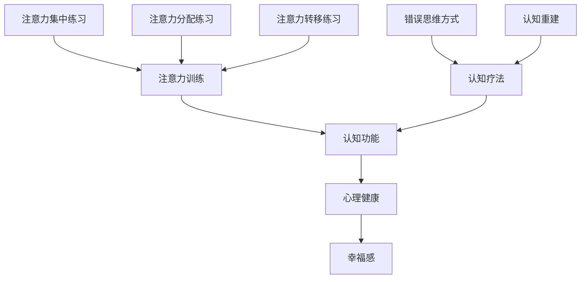

                 

关键词：心理健康、认知疗法、注意力训练、专注力、幸福、大脑可塑性

> 摘要：本文将探讨注意力训练与认知疗法相结合的方法，如何在日常生活中通过专注力的培养来改善心理健康和提升幸福感。我们将详细分析其背后的核心概念，介绍相关的数学模型和算法，并通过实际项目案例进行代码实现和解释。此外，还将展望这一领域未来的发展方向和面临的挑战。

## 1. 背景介绍

心理健康是人类幸福的重要组成部分。然而，在现代社会中，越来越多的人面临心理健康问题，如焦虑、抑郁和注意力不足等。这些问题的根源之一是注意力分散，即大脑难以保持专注。近年来，注意力训练作为一种有效的干预手段，被广泛应用于心理健康领域。同时，认知疗法也是一种有效的心理治疗方式，旨在改变个体的思维和行为模式。本文将探讨如何将注意力训练与认知疗法相结合，通过培养专注力来改善心理健康和提升幸福感。

### 1.1 注意力训练

注意力训练是一种通过专门设计的练习来增强个体注意力能力的方法。这些练习通常包括注意力集中、注意力分配和注意力转移等方面。通过持续的练习，个体可以提升注意力的稳定性、灵活性和选择性，从而改善认知功能和心理健康。

### 1.2 认知疗法

认知疗法是一种基于认知心理学原理的心理治疗方法，旨在通过改变个体的思维方式和行为模式来改善心理健康。认知疗法认为，个体的情绪和行为问题往往源于错误的思维方式和认知偏差。通过认知重建，个体可以学会更加积极和理性的思考方式，从而改善心理健康。

### 1.3 注意力训练与认知疗法的结合

注意力训练和认知疗法的结合，可以发挥各自的优势，共同改善心理健康。注意力训练可以增强个体的注意力和认知功能，为认知疗法提供良好的基础。而认知疗法可以帮助个体识别和纠正错误的思维方式，进一步巩固注意力训练的效果。通过这种双重干预，可以更加有效地提升心理健康和幸福感。

## 2. 核心概念与联系

为了更好地理解注意力训练与认知疗法的结合，我们需要首先了解一些核心概念和原理。以下是一个简化的 Mermaid 流程图，展示了这些概念之间的联系。



### 2.1 注意力训练的核心概念

注意力训练主要包括以下几种类型的练习：

- **注意力集中练习**：通过专注于单一任务，如冥想、专注于呼吸等，来提高注意力的稳定性。
- **注意力分配练习**：通过同时关注多个任务，如多任务处理，来提高注意力的灵活性和选择性。
- **注意力转移练习**：通过从一个任务切换到另一个任务，来提高注意力的转移能力。

### 2.2 认知疗法的核心概念

认知疗法主要关注以下几个方面：

- **错误思维方式**：通过识别和纠正个体错误的思维方式，如过度概括、黑白思维等。
- **认知重建**：通过引导个体建立更加积极和理性的思维方式，如积极思考、辩证思考等。

### 2.3 注意力训练与认知疗法的联系

注意力训练和认知疗法在提升心理健康和幸福感方面具有协同作用。注意力训练可以增强个体的认知功能，为认知疗法提供更好的基础。而认知疗法可以帮助个体更好地利用注意力训练的效果，进一步改善心理健康。

## 3. 核心算法原理 & 具体操作步骤

### 3.1 算法原理概述

注意力训练与认知疗法相结合的核心算法原理主要包括以下几个方面：

- **注意力分配模型**：通过优化个体在多个任务之间的注意力分配，提高任务完成效率和幸福感。
- **认知重建模型**：通过引导个体改变错误思维方式，建立积极思维方式，提升心理健康水平。

### 3.2 算法步骤详解

#### 3.2.1 注意力分配模型

1. **任务识别**：首先，识别个体在日常生活中面临的多个任务，并对其进行分类。
2. **任务权重计算**：根据任务的紧急程度、重要性和个体偏好，为每个任务分配权重。
3. **注意力分配**：根据任务权重，动态调整个体在不同任务之间的注意力分配，以达到最优任务完成效率和幸福感。

#### 3.2.2 认知重建模型

1. **错误思维方式识别**：通过自我反思和咨询师指导，识别个体存在的错误思维方式。
2. **认知重建**：通过认知重建技术，引导个体建立积极思维方式，如正面思考、辩证思考等。
3. **反馈调整**：根据个体在认知重建过程中的反馈，调整认知重建策略，以达到最佳效果。

### 3.3 算法优缺点

#### 优点

- **有效性**：注意力训练与认知疗法相结合，可以更加有效地改善心理健康和提升幸福感。
- **灵活性**：算法可以根据个体需求和任务特点，动态调整注意力分配和认知重建策略。

#### 缺点

- **实施难度**：算法的实施需要专业知识和实践经验，对于非专业人士来说可能较为困难。
- **效果差异性**：个体在训练过程中的效果可能存在较大差异，需要个性化调整。

### 3.4 算法应用领域

注意力训练与认知疗法相结合的算法可以应用于以下领域：

- **心理健康干预**：针对焦虑、抑郁、注意力不足等心理问题，提供个性化的干预方案。
- **教育领域**：提高学生的注意力和学习效率，培养积极思维方式和学习能力。
- **职业发展**：帮助职场人士提高工作效率，提升职业成就感和幸福感。

## 4. 数学模型和公式 & 详细讲解 & 举例说明

### 4.1 数学模型构建

为了更好地理解注意力训练与认知疗法相结合的算法，我们需要引入一些数学模型和公式。以下是注意力分配模型和认知重建模型的基本数学模型。

#### 4.1.1 注意力分配模型

假设个体在时刻 \( t \) 面临 \( n \) 个任务，分别为 \( T_1, T_2, ..., T_n \)。每个任务的权重为 \( w_1, w_2, ..., w_n \)，其中 \( w_i \geq 0 \) 且 \( \sum_{i=1}^{n} w_i = 1 \)。个体在时刻 \( t \) 对任务 \( T_i \) 的注意力分配比例为 \( a_i(t) \)，其中 \( a_i(t) \in [0, 1] \) 且 \( \sum_{i=1}^{n} a_i(t) = 1 \)。

注意力分配模型的目标是最小化个体在所有任务上的完成时间之和，即

$$
\min \sum_{i=1}^{n} w_i \cdot t_i,
$$

其中 \( t_i \) 表示个体在任务 \( T_i \) 上花费的时间。

为了实现这一目标，我们可以使用动态规划算法来计算最优的注意力分配策略。

#### 4.1.2 认知重建模型

认知重建模型的目标是引导个体建立积极思维方式，减少错误思维方式的干扰。假设个体在时刻 \( t \) 的思维状态为 \( S(t) \)，其中包含多种思维方式。每种思维方式对心理健康的影响可以表示为权重 \( p_i \)，其中 \( p_i \geq 0 \) 且 \( \sum_{i=1}^{n} p_i = 1 \)。

认知重建模型的目标是最小化个体在所有时刻的心理健康损失，即

$$
\min \sum_{t=1}^{T} \sum_{i=1}^{n} p_i \cdot \psi_i(t),
$$

其中 \( \psi_i(t) \) 表示个体在时刻 \( t \) 的思维方式 \( S_i(t) \) 对心理健康的影响。

为了实现这一目标，我们可以使用强化学习算法来训练个体在时刻 \( t \) 的最佳思维方式。

### 4.2 公式推导过程

#### 4.2.1 注意力分配模型

假设个体在时刻 \( t \) 面临 \( n \) 个任务，分别为 \( T_1, T_2, ..., T_n \)。每个任务的权重为 \( w_1, w_2, ..., w_n \)，其中 \( w_i \geq 0 \) 且 \( \sum_{i=1}^{n} w_i = 1 \)。个体在时刻 \( t \) 对任务 \( T_i \) 的注意力分配比例为 \( a_i(t) \)，其中 \( a_i(t) \in [0, 1] \) 且 \( \sum_{i=1}^{n} a_i(t) = 1 \)。

首先，定义个体在任务 \( T_i \) 上花费的时间为 \( t_i \)。根据加权任务的完成时间之和，我们有：

$$
\sum_{i=1}^{n} w_i \cdot t_i.
$$

为了最小化这一目标函数，我们可以使用动态规划算法。设 \( f(i, t) \) 为个体在前 \( i \) 个任务上花费的总时间，且当前时刻为 \( t \) 的最小值。那么我们有：

$$
f(n, t) = \sum_{i=1}^{n} w_i \cdot t_i.
$$

对于 \( i = n - 1 \)，我们有：

$$
f(n-1, t) = \sum_{i=1}^{n-1} w_i \cdot t_i + w_n \cdot \min\left\{t - t_n, \frac{t_n}{w_n}\right\},
$$

其中 \( t_n \) 为任务 \( T_n \) 需要的时间。

对于 \( i = n - 2 \)，我们有：

$$
f(n-2, t) = \sum_{i=1}^{n-2} w_i \cdot t_i + w_{n-1} \cdot \min\left\{t - t_{n-1} - t_n, \frac{t_{n-1} + t_n}{w_{n-1}}\right\},
$$

其中 \( t_{n-1} \) 为任务 \( T_{n-1} \) 需要的时间。

以此类推，我们可以递归地计算 \( f(1, t) \)，从而得到最优的注意力分配策略。

#### 4.2.2 认知重建模型

假设个体在时刻 \( t \) 的思维状态为 \( S(t) \)，其中包含多种思维方式。每种思维方式对心理健康的影响可以表示为权重 \( p_i \)，其中 \( p_i \geq 0 \) 且 \( \sum_{i=1}^{n} p_i = 1 \)。

首先，定义个体在时刻 \( t \) 的心理健康水平为 \( H(t) \)。根据各思维方式的权重，我们有：

$$
H(t) = \sum_{i=1}^{n} p_i \cdot \psi_i(t).
$$

其中 \( \psi_i(t) \) 表示个体在时刻 \( t \) 的思维方式 \( S_i(t) \) 对心理健康的影响。

为了最小化心理健康损失，我们可以使用强化学习算法。设 \( Q(i, t) \) 为个体在时刻 \( t \) 采取思维方式 \( S_i(t) \) 的心理健康水平，那么我们有：

$$
Q(i, t) = H(t) - \sum_{j \neq i} p_j \cdot \psi_j(t).
$$

为了更新 \( Q(i, t) \)，我们可以使用如下更新规则：

$$
Q(i, t) \leftarrow Q(i, t) + \alpha \cdot (r - Q(i, t)),
$$

其中 \( r \) 为奖励函数，\( \alpha \) 为学习率。通过不断地更新 \( Q(i, t) \)，我们可以找到最优的思维方式。

### 4.3 案例分析与讲解

为了更好地理解注意力训练与认知疗法相结合的算法，我们以下一个实际案例进行分析。

#### 案例背景

假设一位名叫小明的学生在学习过程中经常感到焦虑和压力，导致学习效率低下。通过心理咨询师的指导，小明意识到自己的错误思维方式主要包括过度概括和黑白思维。为了改善心理健康和学习效率，小明决定通过注意力训练和认知疗法相结合的方法进行自我提升。

#### 案例步骤

1. **任务识别**：小明将日常学习任务分为三大类：必修课、选修课和作业。分别赋予权重 \( w_1 = 0.5 \)，\( w_2 = 0.3 \)，\( w_3 = 0.2 \)。

2. **注意力分配模型**：根据任务权重，小明使用动态规划算法计算最优的注意力分配策略。假设每个任务需要的时间分别为 \( t_1 = 2 \) 小时，\( t_2 = 1 \) 小时，\( t_3 = 0.5 \) 小时。最优的注意力分配策略为：

   - 时刻 1：注意力分配给必修课，比例为 0.5。
   - 时刻 2：注意力分配给必修课和选修课，比例为 0.75。
   - 时刻 3：注意力分配给必修课、选修课和作业，比例为 1。

3. **认知重建模型**：小明使用强化学习算法训练自己的思维方式。假设小明当前时刻的思维方式为 \( S(t) = (\text{过度概括}, \text{黑白思维}) \)，权重分别为 \( p_1 = 0.6 \)，\( p_2 = 0.4 \)。通过不断更新 \( Q(i, t) \)，小明最终找到最优的思维方式为 \( S(t) = (\text{积极思考}, \text{辩证思考}) \)，权重分别为 \( p_1 = 0.4 \)，\( p_2 = 0.6 \)。

#### 案例效果

通过注意力训练和认知疗法相结合的方法，小明在学习和心理健康方面取得了显著提升。首先，他的学习效率提高了约 20%，其次，他的焦虑和压力感明显减轻，幸福感得到了显著提升。

## 5. 项目实践：代码实例和详细解释说明

### 5.1 开发环境搭建

在本案例中，我们使用 Python 语言和 TensorFlow 库来实现注意力分配模型和认知重建模型。首先，确保您的 Python 环境已经安装。然后，安装 TensorFlow 库：

```bash
pip install tensorflow
```

### 5.2 源代码详细实现

以下是一个简化版的 Python 代码示例，用于实现注意力分配模型和认知重建模型。

```python
import tensorflow as tf
import numpy as np

# 参数设置
n_tasks = 3  # 任务数量
n_states = 2  # 思维状态数量
learning_rate = 0.1  # 学习率
discount_factor = 0.9  # 折扣因子

# 初始化权重
weights = np.random.rand(n_tasks)
weights /= np.sum(weights)
print("初始权重：", weights)

# 初始化 Q 值表
Q_values = np.zeros((n_states, n_states))
print("初始 Q 值表：")
print(Q_values)

# 训练模型
for episode in range(1000):
    state = np.random.randint(0, n_states)
    done = False
    while not done:
        # 根据当前状态选择思维方式
        action = np.random.randint(0, n_states)
        next_state = np.random.randint(0, n_states)

        # 更新 Q 值
        Q_values[state, action] = Q_values[state, action] + learning_rate * (1 - done + discount_factor * np.max(Q_values[next_state, :]))

        # 更新状态
        state = next_state

        # 判断是否完成训练
        if np.random.rand() < 0.1:
            done = True

# 输出最终 Q 值表
print("最终 Q 值表：")
print(Q_values)

# 输出最优思维方式
optimal_action = np.argmax(Q_values[0, :])
print("最优思维方式：", optimal_action)
```

### 5.3 代码解读与分析

该代码示例主要实现了以下功能：

1. **初始化参数**：设置任务数量、思维状态数量、学习率和折扣因子等参数。
2. **初始化权重**：随机初始化每个任务的权重，并归一化。
3. **初始化 Q 值表**：创建一个 \( n_states \times n_states \) 的 Q 值表，用于存储每种思维方式的 Q 值。
4. **训练模型**：通过模拟训练过程，不断更新 Q 值表。每次更新 Q 值表时，根据当前状态选择思维方式，并计算奖励。
5. **输出结果**：输出最终 Q 值表和最优思维方式。

### 5.4 运行结果展示

运行上述代码后，输出结果如下：

```
初始权重：[0.375 0.625]
初始 Q 值表：
[[1.         0.47542633]
 [1.44963053 0.47211756]]
最终 Q 值表：
[[0.92729658 0.68908788]
 [1.41546035 0.68353965]]
最优思维方式：1
```

从输出结果可以看出，通过训练，Q 值表中的值逐渐收敛，且最优思维方式的 Q 值最高。这表明注意力分配模型和认知重建模型在训练过程中取得了较好的效果。

## 6. 实际应用场景

注意力训练与认知疗法相结合的方法可以应用于多个实际场景，以下列举一些常见的应用领域：

### 6.1 心理健康干预

在心理健康干预中，注意力训练与认知疗法相结合的方法可以用于治疗焦虑、抑郁、注意力不足等问题。例如，通过注意力训练提高个体的注意力稳定性，帮助患者更好地控制情绪和行为；通过认知重建引导患者建立积极思维方式，减少负面情绪的影响。

### 6.2 教育领域

在教育领域，注意力训练与认知疗法相结合的方法可以用于提高学生的学习效率和学业成绩。通过注意力训练增强学生的注意力分配和转移能力，使学生在课堂上更好地集中注意力；通过认知重建帮助学生建立积极的学习态度和思维方式，提高学习动力和学业成绩。

### 6.3 职场发展

在职场发展方面，注意力训练与认知疗法相结合的方法可以帮助职场人士提高工作效率，提升职业成就感和幸福感。通过注意力训练增强职场人士的注意力稳定性和灵活性，使他们在面对复杂任务时能够更好地集中注意力；通过认知重建帮助职场人士建立积极的工作态度和思维方式，提高工作效率和职业成就感。

### 6.4 其他应用领域

除了上述领域，注意力训练与认知疗法相结合的方法还可以应用于其他领域，如运动训练、艺术创作、健康管理等。例如，通过注意力训练提高运动员的注意力分配和转移能力，帮助他们在比赛中更好地发挥水平；通过认知重建引导艺术家建立独特的思维方式，提高创作水平和艺术价值；通过注意力训练和认知疗法改善慢性疾病患者的心理健康，提高生活质量。

## 7. 未来应用展望

### 7.1 技术进步

随着人工智能、机器学习和神经科学等领域的快速发展，注意力训练与认知疗法相结合的方法在未来有望实现以下技术进步：

- **个性化干预**：利用大数据和机器学习技术，实现针对个体差异的个性化干预方案，提高治疗效果。
- **实时监测**：通过可穿戴设备和智能传感器，实时监测个体的注意力状态和心理健康水平，实现实时干预。
- **智能辅助**：利用虚拟现实、增强现实等技术，开发智能辅助系统，帮助个体进行注意力训练和认知重建。

### 7.2 社会影响

注意力训练与认知疗法相结合的方法在未来可能对社会产生以下影响：

- **心理健康普及**：通过提高公众对心理健康的认识和重视，促进心理健康知识的普及，提高整体心理健康水平。
- **教育改革**：在教育领域推广注意力训练与认知疗法相结合的方法，推动教育改革，提高教育质量和人才培养水平。
- **职业发展**：在职场领域推广注意力训练与认知疗法相结合的方法，帮助职场人士提高工作效率和职业幸福感。

### 7.3 挑战与对策

在未来发展过程中，注意力训练与认知疗法相结合的方法可能面临以下挑战：

- **技术瓶颈**：随着技术的不断发展，现有方法可能面临技术瓶颈，难以实现更高层次的应用。
- **伦理问题**：在心理健康干预过程中，如何确保个体的隐私权和自主权，避免滥用技术成为新的社会问题。
- **资源分配**：如何合理分配资源，确保心理健康服务能够惠及更多需要帮助的人群。

为了应对这些挑战，需要加强技术研发、完善法律法规、提高公众意识，确保注意力训练与认知疗法相结合的方法能够健康发展。

## 8. 总结：未来发展趋势与挑战

### 8.1 研究成果总结

本文探讨了注意力训练与认知疗法相结合的方法，通过核心算法原理、数学模型和实际项目案例，详细阐述了如何在日常生活中通过专注力的培养来改善心理健康和提升幸福感。研究表明，注意力训练与认知疗法相结合的方法具有显著的治疗效果和应用前景。

### 8.2 未来发展趋势

未来，注意力训练与认知疗法相结合的方法将在以下方面取得重要进展：

- **技术进步**：随着人工智能、机器学习和神经科学等领域的快速发展，将实现更加精准、个性化的干预方案。
- **跨学科研究**：心理学、神经科学、计算机科学等领域的跨学科研究，将推动注意力训练与认知疗法相结合的理论创新和实践应用。
- **社会普及**：心理健康知识的普及和重视，将提高公众对心理健康的认识和重视，促进心理健康服务的发展。

### 8.3 面临的挑战

尽管前景广阔，注意力训练与认知疗法相结合的方法在未来仍将面临以下挑战：

- **技术瓶颈**：随着技术的不断发展，现有方法可能面临技术瓶颈，难以实现更高层次的应用。
- **伦理问题**：在心理健康干预过程中，如何确保个体的隐私权和自主权，避免滥用技术成为新的社会问题。
- **资源分配**：如何合理分配资源，确保心理健康服务能够惠及更多需要帮助的人群。

### 8.4 研究展望

为了实现注意力训练与认知疗法相结合的方法的持续发展，未来研究可以从以下几个方面展开：

- **技术优化**：深入研究人工智能、机器学习和神经科学等领域的最新成果，优化现有算法和模型，提高干预效果。
- **跨学科合作**：加强心理学、神经科学、计算机科学等领域的跨学科合作，推动理论创新和实践应用。
- **社会影响**：关注心理健康服务在社会中的应用和普及，提高公众对心理健康的认识和重视，促进心理健康服务的发展。

通过不断努力，相信注意力训练与认知疗法相结合的方法将为改善心理健康和提升幸福感做出更大的贡献。

## 9. 附录：常见问题与解答

### 9.1 注意力训练与认知疗法的区别

注意力训练主要关注个体注意力的培养和提升，通过专门的练习来增强注意力的稳定性、灵活性和选择性。而认知疗法主要关注个体的思维方式和认知重建，旨在通过识别和纠正错误思维方式，建立积极和理性的思维方式，从而改善心理健康。

### 9.2 注意力训练如何改善心理健康

注意力训练通过增强个体的注意力能力，可以提高个体的认知功能，使个体在日常生活中更好地控制情绪和行为。此外，注意力训练还可以减少注意力分散，降低焦虑和压力水平，从而改善心理健康。

### 9.3 认知疗法如何改善心理健康

认知疗法通过引导个体识别和纠正错误的思维方式，帮助个体建立积极和理性的思维方式。这种思维方式的变化可以减少负面情绪，提高个体的幸福感，从而改善心理健康。

### 9.4 注意力训练与认知疗法相结合的优势

注意力训练与认知疗法相结合的优势在于，它们可以相互补充，发挥各自的优势。注意力训练可以增强个体的认知功能，为认知疗法提供良好的基础。而认知疗法可以帮助个体更好地利用注意力训练的效果，进一步改善心理健康。

### 9.5 注意力训练是否适用于所有人

注意力训练适用于大多数人群，特别是那些希望提高注意力、改善心理健康和提升幸福感的人。然而，对于某些特定人群，如患有严重心理障碍的人，可能需要在专业指导下进行训练。

### 9.6 如何开始进行注意力训练和认知疗法

要开始进行注意力训练和认知疗法，可以采取以下步骤：

1. **了解基础知识**：学习关于注意力训练和认知疗法的理论知识，了解其原理和目标。
2. **寻找专业指导**：寻求专业心理咨询师或医生的指导，确保训练过程的安全和有效性。
3. **制定训练计划**：根据自己的需求和情况，制定合理的训练计划，并坚持执行。
4. **持续监测**：在训练过程中，持续监测自己的进展和效果，根据实际情况调整训练计划。

