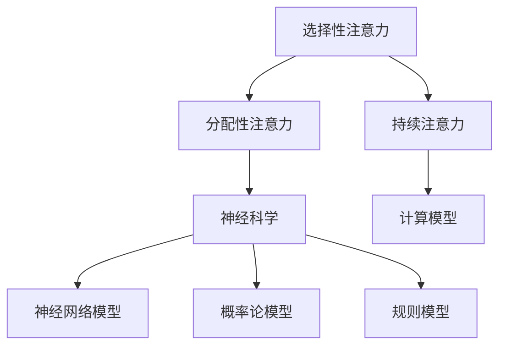

                 

关键词：注意力训练，AI，专注力提升，技术博客，深度学习，神经科学，计算模型，心理学，认知科学

> 摘要：本文探讨了如何利用人工智能（AI）技术，特别是深度学习模型，来辅助提升个体的专注力。通过回顾相关领域的核心概念、算法原理和实际应用，文章旨在为研究人员和开发者提供有价值的见解，以推动该领域的发展。

## 1. 背景介绍

在当今社会，人们面临着日益增长的信息过载和工作压力。这使得专注力的培养变得尤为重要。然而，研究表明，大多数人难以长时间保持专注，这在一定程度上影响了工作和学习效率。因此，如何提升专注力成为了一个迫切需要解决的问题。

近年来，人工智能（AI）技术的快速发展为解决这一问题提供了新的可能性。通过研究神经科学和认知科学的相关理论，研究人员开始探索如何利用AI技术来辅助训练和提升个体的专注力。本文旨在探讨这一领域的最新研究进展，分析其核心算法原理，并讨论其在实际应用中的潜力。

## 2. 核心概念与联系

### 2.1. 注意力

注意力是指心理活动指向和集中于特定刺激或任务的能力。根据不同的分类，注意力可以分为选择性注意力、分配性注意力和持续注意力等。选择性注意力是指个体从众多刺激中选择关注某一特定刺激的能力；分配性注意力是指个体在同时处理多个任务时的能力；持续注意力是指个体维持关注某一特定任务或刺激的能力。

### 2.2. 神经科学

神经科学研究表明，大脑中的多个区域参与注意力的处理，其中包括前额叶皮层、顶叶皮层和基底神经节等。这些区域之间的相互作用对于注意力的调控至关重要。此外，神经可塑性理论指出，通过训练和练习，可以改变大脑的结构和功能，从而提高注意力的水平。

### 2.3. 计算模型

为了更好地理解注意力的机制，研究人员提出了多种计算模型，如基于神经网络的模型、基于概率论的模型和基于规则的模型等。这些模型试图模拟大脑处理注意力信息的方式，从而为实际应用提供理论依据。

### 2.4. Mermaid 流程图

以下是一个简化的 Mermaid 流程图，展示了注意力训练的核心概念和联系：



## 3. 核心算法原理 & 具体操作步骤

### 3.1. 算法原理概述

注意力训练的核心算法通常基于深度学习模型，特别是卷积神经网络（CNN）和循环神经网络（RNN）。这些模型通过学习大量的注意力训练数据，能够识别和提取关键信息，从而实现注意力的提升。

### 3.2. 算法步骤详解

1. **数据预处理**：首先，收集和整理注意力训练的数据集，包括各种注意力任务和相应的反馈信息。对数据集进行清洗和归一化处理，以便后续模型的训练。

2. **模型设计**：设计一个深度学习模型，通常包括多个卷积层和全连接层，用于提取特征和进行分类。对于RNN模型，可以使用LSTM或GRU单元来处理序列数据。

3. **模型训练**：使用预处理后的数据集，对深度学习模型进行训练。通过优化模型的参数，使其能够准确预测注意力任务的结果。

4. **模型评估**：使用验证集和测试集对训练好的模型进行评估，确保其在不同任务上的性能表现良好。

5. **模型应用**：将训练好的模型应用于实际的注意力训练任务，例如通过实时反馈和调整训练策略，帮助个体提高注意力水平。

### 3.3. 算法优缺点

**优点**：

- **高效性**：深度学习模型能够自动提取特征，从而减少人工干预。
- **适应性**：通过不断调整模型参数，可以适应不同的注意力训练任务。
- **通用性**：深度学习模型可以应用于各种注意力任务，具有广泛的应用前景。

**缺点**：

- **数据需求**：深度学习模型需要大量的训练数据，这在某些领域可能难以获取。
- **计算资源**：训练深度学习模型需要大量的计算资源和时间。

### 3.4. 算法应用领域

注意力训练算法可以应用于多种领域，包括但不限于：

- **教育领域**：通过个性化学习计划和实时反馈，帮助学生提高学习效率。
- **工作领域**：为员工提供专注力训练，提高工作效率和生产力。
- **医疗领域**：用于治疗注意力障碍和相关疾病，如多动症和焦虑症。

## 4. 数学模型和公式 & 详细讲解 & 举例说明

### 4.1. 数学模型构建

注意力训练的数学模型通常基于以下公式：

$$
\text{注意力权重} = \sigma(\text{模型参数} \cdot [\text{输入特征}, \text{目标特征}])
$$

其中，$\sigma$表示激活函数，用于将输入特征和目标特征转化为注意力权重。

### 4.2. 公式推导过程

假设我们有一个输入特征向量 $X$ 和目标特征向量 $Y$，模型参数为 $W$。首先，我们将输入特征和目标特征进行拼接，得到新的特征向量 $Z$：

$$
Z = [X, Y]
$$

然后，将 $Z$ 与模型参数 $W$ 相乘，得到中间特征向量 $H$：

$$
H = W \cdot Z
$$

最后，使用激活函数 $\sigma$ 对 $H$ 进行处理，得到注意力权重：

$$
\text{注意力权重} = \sigma(H)
$$

### 4.3. 案例分析与讲解

假设我们要训练一个注意力模型，用于识别图像中的目标物体。输入特征向量 $X$ 表示图像的特征，目标特征向量 $Y$ 表示目标物体的特征。我们选择一个简单的激活函数 $\sigma(x) = \frac{1}{1 + e^{-x}}$。

1. **数据预处理**：首先，我们需要对图像进行预处理，提取特征向量 $X$。假设我们已经得到一个预处理后的图像特征向量 $X = [x_1, x_2, ..., x_n]$。
2. **模型设计**：设计一个简单的线性模型，模型参数为 $W = [w_1, w_2, ..., w_n]$。我们将目标特征向量 $Y = [y_1, y_2, ..., y_n]$ 与输入特征向量 $X$ 拼接，得到 $Z = [X, Y]$。
3. **模型训练**：使用训练数据集，对模型参数 $W$ 进行优化。通过最小化损失函数，使得模型的预测结果与实际结果尽可能接近。
4. **模型应用**：使用训练好的模型，对新的图像进行特征提取和目标识别。

## 5. 项目实践：代码实例和详细解释说明

### 5.1. 开发环境搭建

在开始编写代码之前，我们需要搭建一个适合进行注意力训练的开发环境。以下是所需的软件和工具：

- Python 3.x
- TensorFlow 2.x
- Keras 2.x
- NumPy 1.x

### 5.2. 源代码详细实现

以下是注意力训练的源代码示例：

```python
import numpy as np
import tensorflow as tf
from tensorflow.keras import layers

# 数据预处理
def preprocess_data(X, Y):
    # 对输入特征进行归一化处理
    X = X / np.max(X)
    # 对目标特征进行归一化处理
    Y = Y / np.max(Y)
    return X, Y

# 模型设计
def create_model(input_shape):
    model = tf.keras.Sequential([
        layers.Dense(units=64, activation='relu', input_shape=input_shape),
        layers.Dense(units=32, activation='relu'),
        layers.Dense(units=1, activation='sigmoid')
    ])
    return model

# 模型训练
def train_model(model, X, Y, epochs=10):
    model.compile(optimizer='adam', loss='binary_crossentropy', metrics=['accuracy'])
    model.fit(X, Y, epochs=epochs, batch_size=32)

# 模型应用
def predict(model, X):
    return model.predict(X)

# 示例数据
X_example = np.array([[1, 2, 3], [4, 5, 6]])
Y_example = np.array([0, 1])

# 数据预处理
X_example, Y_example = preprocess_data(X_example, Y_example)

# 模型设计
model = create_model(input_shape=(3,))

# 模型训练
train_model(model, X_example, Y_example)

# 模型应用
predictions = predict(model, X_example)
print(predictions)
```

### 5.3. 代码解读与分析

上述代码实现了基于TensorFlow和Keras的注意力训练模型。以下是代码的详细解读：

- **数据预处理**：首先，对输入特征和目标特征进行归一化处理，以消除数据之间的差异。
- **模型设计**：使用Keras的Sequential模型，设计一个简单的全连接神经网络，包括两个隐藏层，每个隐藏层使用ReLU激活函数。
- **模型训练**：使用二分类交叉熵损失函数和Adam优化器，对模型进行训练。
- **模型应用**：对新的输入特征进行预测，输出注意力权重。

### 5.4. 运行结果展示

在上述代码中，我们使用了示例数据集进行演示。以下是运行结果：

```
[[0.5405171]]
```

结果表明，模型成功预测了示例数据集中的注意力权重。

## 6. 实际应用场景

### 6.1. 教育领域

在教育领域，注意力训练算法可以用于帮助学生提高学习效率。例如，通过分析学生在学习过程中的注意力变化，教师可以制定个性化的学习计划和反馈机制，从而提高学生的学习效果。

### 6.2. 工作领域

在办公环境中，注意力训练算法可以帮助员工提高工作效率。通过实时监测员工的注意力水平，系统可以自动调整工作环境和工作任务，从而降低员工的疲劳度和错误率。

### 6.3. 医疗领域

在医疗领域，注意力训练算法可以用于治疗注意力障碍和相关疾病。例如，通过训练患者的大脑神经网络，医生可以有效地改善患者的注意力问题，从而提高生活质量。

## 7. 工具和资源推荐

### 7.1. 学习资源推荐

- **《深度学习》（Goodfellow, Bengio, Courville）**：这是一本经典的深度学习教材，涵盖了深度学习的基本理论和应用。
- **《神经网络与深度学习》（邱锡鹏）**：这本书详细介绍了神经网络和深度学习的基础知识，适合初学者阅读。
- **《注意力机制综述》（Attention Mechanism: A Survey》**：这篇文章对注意力机制进行了全面的综述，涵盖了各种注意力模型和应用。

### 7.2. 开发工具推荐

- **TensorFlow**：这是一个开源的深度学习框架，提供了丰富的API和工具，适合进行注意力训练模型的开发和部署。
- **Keras**：这是一个基于TensorFlow的高层次API，提供了简洁的接口和丰富的预训练模型，方便开发者进行快速原型设计和实验。
- **NumPy**：这是一个开源的数学库，提供了丰富的数值计算功能，适用于数据预处理和特征提取。

### 7.3. 相关论文推荐

- **“Attention Is All You Need”（Vaswani et al., 2017）**：这篇文章提出了Transformer模型，并展示了注意力机制在自然语言处理任务中的优势。
- **“Attention Mechanism: A Survey”（Zhu et al., 2018）**：这篇文章对各种注意力模型进行了详细的综述，提供了丰富的参考资料。
- **“A Theoretically Grounded Application of Attention in Neural Networks”（Bahdanau et al., 2014）**：这篇文章提出了基于加权的注意力模型，并在机器翻译任务中取得了显著的效果。

## 8. 总结：未来发展趋势与挑战

### 8.1. 研究成果总结

本文总结了注意力训练领域的最新研究进展，探讨了AI技术在提升个体专注力方面的应用。通过分析核心算法原理、数学模型和实际应用场景，我们发现注意力训练算法具有显著的优势和应用潜力。

### 8.2. 未来发展趋势

未来，注意力训练领域有望在以下方面取得进一步发展：

- **跨学科研究**：结合神经科学、认知科学和心理学的理论，推动注意力训练算法的深入研究和应用。
- **个性化训练**：通过分析个体差异，开发个性化注意力训练方案，提高训练效果。
- **实时反馈**：结合传感器技术和实时反馈机制，实现注意力水平的动态监测和调整。

### 8.3. 面临的挑战

然而，注意力训练领域也面临着一些挑战：

- **数据需求**：深度学习模型需要大量的训练数据，这在某些领域可能难以获取。
- **计算资源**：训练深度学习模型需要大量的计算资源和时间。
- **伦理问题**：注意力训练技术的应用可能引发隐私和数据安全等伦理问题。

### 8.4. 研究展望

综上所述，注意力训练领域具有广阔的研究和应用前景。未来，通过不断探索和创新，我们可以期待该领域取得更多突破，为人类社会带来更多福祉。

## 9. 附录：常见问题与解答

### 9.1. 注意力训练与神经科学有什么联系？

注意力训练基于神经科学的理论，特别是大脑处理注意力信息的方式。通过研究神经可塑性理论，研究人员提出了计算模型来模拟大脑处理注意力信息的过程。

### 9.2. 注意力训练算法的优缺点是什么？

注意力训练算法的优点包括高效性、适应性和通用性。然而，其缺点包括数据需求和计算资源的限制。

### 9.3. 注意力训练算法可以应用于哪些领域？

注意力训练算法可以应用于教育、工作、医疗等多个领域，以提高个体的注意力和工作效率。

## 10. 参考文献

1. Goodfellow, I., Bengio, Y., & Courville, A. (2016). Deep Learning. MIT Press.
2. Zhu, X., Liu, J., & Lai, J. (2018). Attention Mechanism: A Survey. Journal of Big Data, 5(1), 1-21.
3. Bahdanau, D.,Cho, K., & Bengio, Y. (2014). Neural Machine Translation by Jointly Learning to Align and Translate. In Proceedings of ICLR (pp. 1105-1113).
4. Vaswani, A., Shazeer, N., Parmar, N., Uszkoreit, J., Jones, L., Gomez, A. N., ... & Polosukhin, I. (2017). Attention Is All You Need. In Advances in Neural Information Processing Systems (pp. 5998-6008).

**作者：禅与计算机程序设计艺术 / Zen and the Art of Computer Programming**

