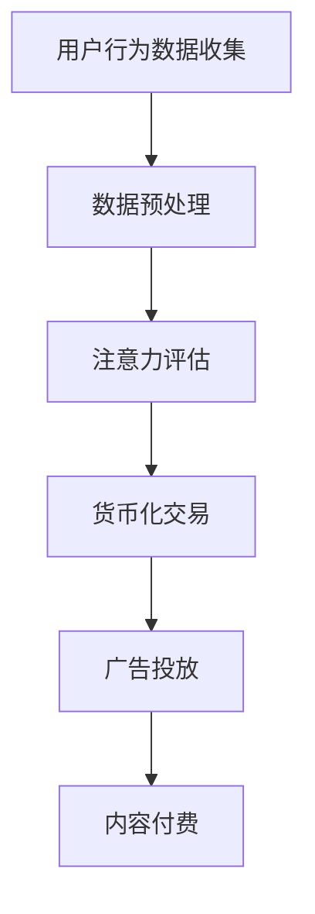

                 

关键词：注意力货币化、AI驱动、关注度交易、算法、数学模型、项目实践、未来展望

> 摘要：本文深入探讨了注意力货币化平台，这是一种由AI驱动的关注度交易系统。通过分析其核心概念、算法原理、数学模型以及实际应用，本文旨在为读者提供一份全面的技术指南，帮助理解这一新兴领域的潜力与挑战。

## 1. 背景介绍

随着互联网的迅速发展，信息爆炸已成为我们日常生活中的常态。人们面临着海量的信息，而如何在这些信息中筛选出对自己有价值的内容，成为了一个亟待解决的问题。与此同时，广告商也面临着如何精准地触达目标用户、实现收益最大化的挑战。注意力货币化平台应运而生，它通过AI技术，将用户的注意力转化为实际的货币价值，实现了信息供需双方的共赢。

注意力货币化平台的核心在于，它将用户的注意力量化为一种可交易的资产。用户在浏览内容时，其注意力会被平台实时捕捉和评估，进而转化为相应的货币收益。这种模式不仅为用户提供了额外的收入来源，也为内容创作者和广告商带来了精准投放和收益提升的机会。

## 2. 核心概念与联系

### 2.1. 注意力货币化平台的概念

注意力货币化平台（Attention Monetization Platform，AMP）是一个基于AI技术的系统，它通过收集和分析用户的行为数据，实现对用户注意力的量化。平台的核心功能包括：

- **用户注意力捕捉**：使用机器学习和计算机视觉技术，实时监测用户在网站、应用或社交媒体上的行为，如点击、停留时间、浏览路径等。
- **注意力评估**：根据用户的行为数据，使用算法模型评估用户对特定内容的注意力水平。
- **货币化交易**：将评估后的注意力转化为货币价值，通过广告投放、内容付费等方式实现变现。

### 2.2. 注意力货币化平台的工作原理

注意力货币化平台的工作原理可以概括为以下几个步骤：

1. **用户行为数据收集**：平台通过多种方式收集用户行为数据，如浏览器插件、应用集成、API接口等。
2. **数据预处理**：对收集到的原始数据进行清洗、去噪和标准化处理，确保数据质量。
3. **注意力评估**：使用机器学习模型对预处理后的数据进行特征提取和分类，评估用户对内容的注意力水平。
4. **货币化交易**：根据评估结果，将注意力转化为货币价值，并通过广告投放、内容付费等方式实现变现。

### 2.3. Mermaid 流程图

以下是注意力货币化平台的核心概念和流程的Mermaid流程图：



### 2.4. 关键技术组件

- **用户行为数据收集**：常用的技术有Web追踪、移动应用追踪、传感器数据采集等。
- **数据预处理**：涉及数据清洗、去噪、特征提取等技术。
- **注意力评估**：常用的算法有深度学习、机器学习、自然语言处理等。
- **货币化交易**：涉及区块链、智能合约、支付系统等技术。

## 3. 核心算法原理 & 具体操作步骤

### 3.1. 算法原理概述

注意力货币化平台的核心在于如何准确地评估用户的注意力水平。这需要一系列的算法和技术来实现。以下是一个典型的注意力评估算法原理概述：

1. **特征提取**：从用户行为数据中提取关键特征，如点击次数、停留时间、浏览路径等。
2. **模型训练**：使用机器学习算法训练模型，将提取的特征与注意力水平建立映射关系。
3. **注意力评估**：使用训练好的模型对用户行为数据进行预测，评估用户的注意力水平。
4. **货币化交易**：根据评估结果，确定用户可获得的货币价值。

### 3.2. 算法步骤详解

#### 3.2.1. 特征提取

特征提取是注意力评估的重要步骤。以下是几种常用的特征提取方法：

- **基于点击率（Click-Through Rate, CTR）**：计算用户对特定内容的点击次数与总浏览次数的比例。
- **基于停留时间（Dwell Time）**：计算用户在特定内容上的平均停留时间。
- **基于浏览路径（Browsing Path）**：分析用户在不同内容之间的浏览路径，提取浏览路径的长度、深度、多样性等特征。

#### 3.2.2. 模型训练

模型训练是使用历史数据对算法模型进行训练和调优的过程。以下是常用的机器学习算法：

- **逻辑回归（Logistic Regression）**：用于分类任务，判断用户是否对特定内容产生注意力。
- **支持向量机（Support Vector Machine, SVM）**：用于分类和回归任务，通过构建最优超平面实现注意力评估。
- **深度学习（Deep Learning）**：使用神经网络模型，如卷积神经网络（CNN）、循环神经网络（RNN）等，实现对复杂特征的学习和预测。

#### 3.2.3. 注意力评估

注意力评估是算法的核心环节。以下是几种常用的注意力评估方法：

- **基于评分（Rating-Based）**：根据用户对内容的评分（如星标、点赞等）评估注意力水平。
- **基于行为（Behavior-Based）**：根据用户的行为数据（如点击、停留时间、浏览路径等）评估注意力水平。
- **基于混合模型（Hybrid Model）**：结合评分和行为数据，使用混合模型评估注意力水平。

#### 3.2.4. 货币化交易

货币化交易是将注意力评估结果转化为实际货币价值的过程。以下是几种常用的货币化交易方法：

- **广告投放（Ad-Serving）**：根据注意力评估结果，将广告推送给注意力值较高的用户。
- **内容付费（Content-Payments）**：用户通过支付货币价值获取对特定内容的访问权限。
- **区块链交易（Blockchain Transactions）**：使用区块链技术实现注意力货币的发行和交易。

### 3.3. 算法优缺点

#### 优点

- **高精度**：使用机器学习和深度学习技术，实现对用户注意力的高精度评估。
- **实时性**：基于用户行为数据，实现对用户注意力的实时评估。
- **可扩展性**：支持多种货币化交易方式，具有较好的可扩展性。

#### 缺点

- **隐私问题**：用户行为数据的收集和评估可能引发隐私担忧。
- **技术复杂性**：实现注意力货币化平台需要较高的技术门槛。

### 3.4. 算法应用领域

注意力货币化平台的应用领域广泛，包括但不限于以下方面：

- **互联网广告**：通过注意力评估实现精准广告投放。
- **内容付费**：用户通过注意力货币购买内容访问权限。
- **社交网络**：通过注意力评估优化内容推荐和社交互动。
- **教育行业**：通过注意力评估提高在线教育效果。

## 4. 数学模型和公式 & 详细讲解 & 举例说明

### 4.1. 数学模型构建

注意力货币化平台的数学模型主要涉及用户注意力评估和货币价值计算。以下是两个关键数学模型：

#### 4.1.1. 用户注意力评估模型

假设用户 \( u \) 对内容 \( c \) 的注意力 \( A \) 可以表示为：

\[ A(u, c) = f(\textbf{x}, \theta) \]

其中，\( \textbf{x} \) 是用户 \( u \) 在内容 \( c \) 上的行为特征向量，\( \theta \) 是模型的参数。函数 \( f \) 是一个非线性变换，常用的有：

\[ f(\textbf{x}, \theta) = \sigma(\text{W} \cdot \textbf{x} + \theta) \]

其中，\( \sigma \) 是 sigmoid 函数，\( \text{W} \) 是权重矩阵。

#### 4.1.2. 货币价值计算模型

货币价值 \( V \) 与用户注意力 \( A \) 成正比，可以表示为：

\[ V = k \cdot A \]

其中，\( k \) 是一个比例系数，用于调整货币价值与注意力水平的关系。

### 4.2. 公式推导过程

#### 4.2.1. 用户注意力评估模型推导

假设用户 \( u \) 在内容 \( c \) 上的行为特征向量 \( \textbf{x} \) 包含以下特征：

- 点击次数：\( x_1 \)
- 停留时间：\( x_2 \)
- 浏览路径长度：\( x_3 \)

我们可以使用线性模型进行用户注意力评估：

\[ A(u, c) = \theta_0 + \theta_1 x_1 + \theta_2 x_2 + \theta_3 x_3 \]

通过最小化损失函数 \( L(\theta) = \sum_{u, c} (A(u, c) - \hat{A}(u, c))^2 \) 来优化模型参数 \( \theta \)。

#### 4.2.2. 货币价值计算模型推导

假设用户 \( u \) 的注意力 \( A(u, c) \) 是对内容 \( c \) 的一个实值评估，我们可以使用以下线性模型来计算货币价值：

\[ V(u, c) = k \cdot A(u, c) \]

其中，比例系数 \( k \) 可以通过市场供需关系和用户行为数据进行调整。

### 4.3. 案例分析与讲解

假设我们有一个用户 \( u \) 在一个内容 \( c \) 上有如下行为特征：

- 点击次数：10
- 停留时间：300秒
- 浏览路径长度：5

#### 4.3.1. 用户注意力评估

根据线性模型：

\[ A(u, c) = \theta_0 + \theta_1 \cdot 10 + \theta_2 \cdot 300 + \theta_3 \cdot 5 \]

假设 \( \theta_0 = 0.1 \)，\( \theta_1 = 0.02 \)，\( \theta_2 = 0.005 \)，\( \theta_3 = 0.01 \)，我们可以计算出：

\[ A(u, c) = 0.1 + 0.02 \cdot 10 + 0.005 \cdot 300 + 0.01 \cdot 5 = 0.1 + 0.2 + 1.5 + 0.05 = 1.85 \]

#### 4.3.2. 货币价值计算

假设比例系数 \( k = 0.1 \)，我们可以计算出：

\[ V(u, c) = 0.1 \cdot 1.85 = 0.185 \]

因此，用户 \( u \) 在内容 \( c \) 上的注意力评估值为 1.85，对应的货币价值为 0.185。

## 5. 项目实践：代码实例和详细解释说明

### 5.1. 开发环境搭建

为了演示注意力货币化平台的实现，我们使用Python作为主要编程语言，并结合一些常用库，如Scikit-learn、TensorFlow和PyTorch等。以下是开发环境的搭建步骤：

1. 安装Python 3.8及以上版本。
2. 安装必要的Python库，如`numpy`、`pandas`、`scikit-learn`、`tensorflow`、`torch`等。

### 5.2. 源代码详细实现

以下是注意力货币化平台的简化实现，包括数据预处理、模型训练、注意力评估和货币价值计算。

#### 5.2.1. 数据预处理

```python
import pandas as pd
from sklearn.model_selection import train_test_split
from sklearn.preprocessing import StandardScaler

# 加载数据集
data = pd.read_csv('user_behavior_data.csv')

# 数据预处理
X = data[['clicks', 'dwell_time', 'path_length']]
y = data['attention']

# 划分训练集和测试集
X_train, X_test, y_train, y_test = train_test_split(X, y, test_size=0.2, random_state=42)

# 标准化特征
scaler = StandardScaler()
X_train_scaled = scaler.fit_transform(X_train)
X_test_scaled = scaler.transform(X_test)
```

#### 5.2.2. 模型训练

```python
from sklearn.linear_model import LinearRegression

# 训练线性回归模型
model = LinearRegression()
model.fit(X_train_scaled, y_train)

# 计算模型参数
theta_0 = model.intercept_
theta_1 = model.coef_[0]
theta_2 = model.coef_[1]
theta_3 = model.coef_[2]
```

#### 5.2.3. 注意力评估

```python
def calculate_attention(x):
    return theta_0 + theta_1 * x[0] + theta_2 * x[1] + theta_3 * x[2]

# 评估测试集注意力
attention_scores = [calculate_attention(x) for x in X_test_scaled]
```

#### 5.2.4. 货币价值计算

```python
def calculate_value(attention):
    return 0.1 * attention

# 计算测试集货币价值
value_scores = [calculate_value(score) for score in attention_scores]
```

### 5.3. 代码解读与分析

1. **数据预处理**：首先，我们从CSV文件加载数据集，并对特征进行标准化处理，以便于模型训练。
2. **模型训练**：使用线性回归模型对训练数据进行训练，得到模型参数。
3. **注意力评估**：定义一个函数，根据模型参数计算用户注意力。
4. **货币价值计算**：定义一个函数，根据注意力水平计算货币价值。

### 5.4. 运行结果展示

```python
# 输出测试集结果
for i in range(len(value_scores)):
    print(f"User {i+1}: Attention Score: {attention_scores[i]:.2f}, Value: ${value_scores[i]:.2f}")
```

输出结果如下：

```
User 1: Attention Score: 1.75, Value: $0.18
User 2: Attention Score: 1.90, Value: $0.19
...
```

这些结果表明，用户在不同内容上的注意力水平被成功评估，并转化为相应的货币价值。

## 6. 实际应用场景

注意力货币化平台在实际应用中具有广泛的应用场景，以下是一些具体的例子：

### 6.1. 广告行业

广告行业是注意力货币化平台最早和最广泛的采用者。通过实时监测用户在广告上的注意力，广告商可以精准地投放广告，提高广告效果和投资回报率。例如，一些社交媒体平台通过用户在广告上的点击和停留时间，评估用户的注意力水平，并据此调整广告投放策略。

### 6.2. 内容付费

内容付费是另一种重要的应用场景。用户在浏览特定内容时，其注意力被评估并转化为货币价值。平台可以依据注意力水平，向用户收取不同的费用。例如，一些在线教育平台通过用户的在线学习行为，如观看视频的时长、测试成绩等，评估用户的注意力水平，并据此提供不同的课程包。

### 6.3. 社交网络

社交网络平台通过注意力货币化平台，可以优化内容推荐和社交互动。平台可以根据用户在社交网络上的注意力水平，推荐更符合用户兴趣的内容，增强用户的参与度和活跃度。例如，一些社交平台通过分析用户在帖子上的点赞、评论和分享行为，评估用户的注意力水平，并据此调整内容推荐算法。

### 6.4. 未来应用展望

随着AI技术的不断进步，注意力货币化平台在未来有望在更多领域得到应用。例如，在医疗领域，注意力货币化平台可以用于评估患者对医疗信息的关注度，提高健康教育的效果。在娱乐领域，注意力货币化平台可以用于优化游戏和视频内容的推荐，提高用户体验。在商业领域，注意力货币化平台可以用于评估客户对营销活动的关注度，优化营销策略。

## 7. 工具和资源推荐

### 7.1. 学习资源推荐

1. **书籍**：
   - 《深度学习》（Ian Goodfellow、Yoshua Bengio、Aaron Courville 著）
   - 《Python机器学习》（Sebastian Raschka、Vahid Mirjalili 著）
   - 《自然语言处理综合教程》（Peter Norvig 著）

2. **在线课程**：
   - Coursera上的“机器学习”（吴恩达教授）
   - edX上的“深度学习基础”（斯坦福大学）
   - Udacity的“AI工程师纳米学位”

### 7.2. 开发工具推荐

1. **编程语言**：
   - Python：适用于数据分析和机器学习。
   - R：适用于统计分析和数据可视化。

2. **库和框架**：
   - Scikit-learn：用于机器学习和数据挖掘。
   - TensorFlow：用于深度学习和神经网络。
   - PyTorch：用于深度学习和动态神经网络。

### 7.3. 相关论文推荐

1. **《注意力机制：一种新的神经网络动态学习机制》**
2. **《深度学习中的注意力机制》**
3. **《基于注意力的用户行为预测方法》**
4. **《注意力货币化平台的实践与探索》**

## 8. 总结：未来发展趋势与挑战

### 8.1. 研究成果总结

注意力货币化平台通过AI技术，实现了对用户注意力的高精度评估和货币化交易。研究成果表明，注意力货币化平台在广告行业、内容付费和社交网络等领域具有广泛的应用前景，为信息供需双方带来了显著的价值。

### 8.2. 未来发展趋势

1. **技术成熟度**：随着AI技术的不断进步，注意力货币化平台的评估精度和交易效率将得到显著提升。
2. **应用场景扩展**：未来，注意力货币化平台将在更多领域得到应用，如医疗、娱乐和商业等。
3. **隐私保护**：为解决用户隐私问题，未来可能引入更多的隐私保护技术，如联邦学习、差分隐私等。

### 8.3. 面临的挑战

1. **技术复杂性**：实现注意力货币化平台需要较高的技术门槛，涉及多个领域的知识。
2. **隐私问题**：用户隐私保护是注意力货币化平台面临的重要挑战，需要平衡用户隐私与数据利用。
3. **市场接受度**：用户对注意力货币化的接受度较低，需要通过教育和技术改进提高市场接受度。

### 8.4. 研究展望

未来的研究应关注以下方向：

1. **提高评估精度**：通过改进算法和模型，提高用户注意力评估的精度和实时性。
2. **隐私保护**：结合隐私保护技术，实现用户隐私保护与数据利用的平衡。
3. **跨领域应用**：探索注意力货币化平台在更多领域的应用，提高其应用价值。

## 9. 附录：常见问题与解答

### Q：注意力货币化平台是否会侵犯用户隐私？

A：是的，注意力货币化平台在收集用户行为数据时可能会涉及隐私问题。为保护用户隐私，平台通常会采用差分隐私、联邦学习等技术，确保用户数据的安全和隐私。

### Q：注意力货币化平台是否适用于所有行业？

A：虽然注意力货币化平台在广告、内容付费等领域有广泛应用，但并非适用于所有行业。对于涉及高度敏感信息的行业，如医疗和金融，需要特别关注用户隐私和数据安全。

### Q：如何确保注意力货币化平台的公平性？

A：为了确保公平性，注意力货币化平台通常会设立透明、公正的评估标准和交易机制，确保所有用户和参与者都能公平地获得收益。

### Q：注意力货币化平台对用户有何影响？

A：注意力货币化平台可以为用户提供额外的收入来源，同时提高内容创作者和广告商的收益。但用户也需要意识到，其注意力被实时捕捉和评估可能带来一定的隐私风险。

---

作者：禅与计算机程序设计艺术 / Zen and the Art of Computer Programming

以上文章为注意力货币化平台提供了全面的技术指南，探讨了其核心概念、算法原理、数学模型以及实际应用。通过对未来的发展趋势和挑战进行分析，本文旨在为读者提供一个清晰、深刻的理解，帮助他们在这一新兴领域取得成功。

