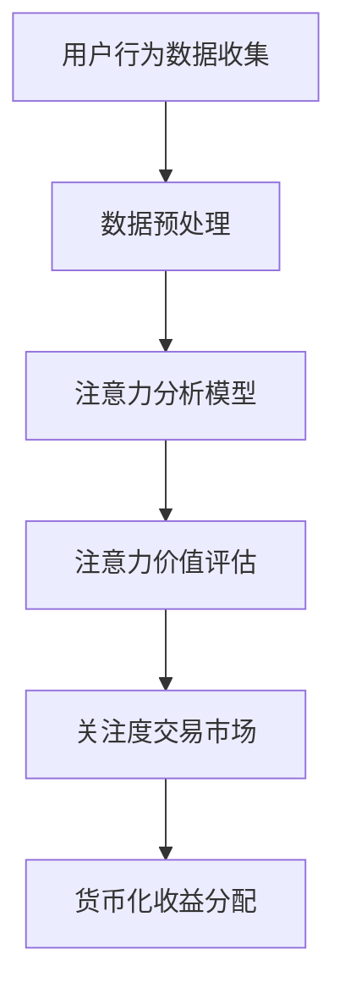

                 

关键词：注意力货币化、AI、关注度交易、技术博客、深度学习、关注度分析、个性化推荐、区块链

> 摘要：本文探讨了注意力货币化平台的概念，以及如何通过人工智能技术实现关注度的价值化。本文详细介绍了平台的架构、核心算法、数学模型、实际应用案例以及未来发展趋势，旨在为读者提供关于注意力货币化的全面理解和实际操作指南。

## 1. 背景介绍

随着互联网的快速发展，用户生成的内容呈爆炸式增长。如何从海量的信息中筛选出用户感兴趣的内容，成为了互联网服务提供商和内容创作者面临的重大挑战。传统的推荐算法虽然在一定程度上解决了这个问题，但往往存在信息过载、数据隐私和安全等问题。近年来，注意力货币化概念的提出为解决这些问题提供了一种新的思路。

注意力货币化平台旨在通过将用户注意力转化为经济价值，从而实现个性化推荐和精准营销。该平台利用人工智能技术，分析用户的注意力行为，将注意力转化为可交易的货币，为用户和内容创作者提供新的商业模式。

## 2. 核心概念与联系

### 2.1 注意力货币化

注意力货币化是指将用户的注意力作为一种资产，通过特定的算法将其价值化，进而实现交易。注意力货币化的核心在于对用户注意力行为的分析和理解。

### 2.2 人工智能与注意力分析

人工智能技术在注意力货币化中发挥着重要作用。通过深度学习等技术，可以对用户的注意力行为进行精准分析，识别用户感兴趣的内容，从而提高推荐系统的准确性。

### 2.3 关注度交易

关注度交易是指用户和内容创作者通过平台进行关注度交换的过程。用户将注意力转化为货币，用于购买自己感兴趣的内容，而内容创作者则通过提供高质量内容获得货币回报。

## 2.4 Mermaid 流程图



## 3. 核心算法原理 & 具体操作步骤

### 3.1 算法原理概述

注意力货币化平台的核心算法主要包括注意力分析、价值评估和交易三个部分。

### 3.2 算法步骤详解

#### 3.2.1 注意力分析

注意力分析基于深度学习技术，通过对用户行为数据（如点击、停留时间、点赞等）进行建模，提取出用户的兴趣特征。具体步骤如下：

1. 数据收集：收集用户在平台上的行为数据。
2. 数据预处理：对数据进行清洗、归一化等处理。
3. 模型训练：使用深度学习算法（如LSTM、GRU等）对用户行为数据进行建模，提取兴趣特征。

#### 3.2.2 注意力价值评估

注意力价值评估是根据用户兴趣特征，对用户注意力进行量化，从而确定其价值。具体步骤如下：

1. 计算兴趣得分：根据用户兴趣特征，计算用户对每个内容的兴趣得分。
2. 价值评估模型：使用回归模型（如线性回归、决策树等）对兴趣得分进行价值评估。

#### 3.2.3 关注度交易

关注度交易是指用户和内容创作者通过平台进行关注度交换的过程。具体步骤如下：

1. 用户购买注意力：用户将虚拟货币用于购买自己感兴趣的内容。
2. 内容创作者收益：内容创作者根据用户购买注意力，获得相应的货币回报。

## 3.3 算法优缺点

### 3.3.1 优点

1. 提高个性化推荐效果：通过深度学习技术，精准分析用户兴趣，提高推荐系统的准确性。
2. 创新商业模式：为用户和内容创作者提供新的收益模式，促进内容创作和分享。

### 3.3.2 缺点

1. 数据隐私问题：用户注意力行为数据可能涉及隐私问题，需要采取有效的隐私保护措施。
2. 计算资源消耗：深度学习模型训练和评估过程需要大量的计算资源。

## 3.4 算法应用领域

注意力货币化平台可以应用于多个领域，如社交媒体、内容平台、在线教育等。以下是几个具体应用案例：

1. 社交媒体：通过注意力货币化平台，用户可以为感兴趣的内容创作者提供货币支持，促进优质内容的创作和传播。
2. 在线教育：教师可以通过注意力货币化平台，根据学生的注意力行为调整教学内容，提高学习效果。
3. 广告营销：广告商可以根据用户的注意力行为，实现精准营销，提高广告投放效果。

## 4. 数学模型和公式

### 4.1 数学模型构建

注意力货币化平台的核心数学模型主要包括用户兴趣模型、价值评估模型和交易模型。

#### 4.1.1 用户兴趣模型

用户兴趣模型基于深度学习技术，通过用户行为数据学习用户的兴趣特征。具体公式如下：

$$
\text{interest}(u, c) = f(\text{behavior}(u), c)
$$

其中，$u$ 表示用户，$c$ 表示内容，$\text{behavior}(u)$ 表示用户行为数据，$f(\cdot)$ 表示深度学习模型。

#### 4.1.2 价值评估模型

价值评估模型用于评估用户注意力的价值。具体公式如下：

$$
\text{value}(u, c) = g(\text{interest}(u, c))
$$

其中，$g(\cdot)$ 表示价值评估模型。

#### 4.1.3 交易模型

交易模型用于描述用户和内容创作者之间的关注度交易过程。具体公式如下：

$$
\text{交易金额} = \text{value}(u, c) \times \text{交易数量}
$$

### 4.2 公式推导过程

#### 4.2.1 用户兴趣模型推导

用户兴趣模型基于深度学习技术，通过用户行为数据学习用户的兴趣特征。具体推导过程如下：

1. 数据收集：收集用户在平台上的行为数据，如点击、停留时间、点赞等。
2. 数据预处理：对数据进行清洗、归一化等处理。
3. 模型训练：使用深度学习算法（如LSTM、GRU等）对用户行为数据进行建模，提取兴趣特征。

#### 4.2.2 价值评估模型推导

价值评估模型用于评估用户注意力的价值。具体推导过程如下：

1. 计算兴趣得分：根据用户兴趣模型，计算用户对每个内容的兴趣得分。
2. 价值评估：使用回归模型（如线性回归、决策树等）对兴趣得分进行价值评估。

#### 4.2.3 交易模型推导

交易模型用于描述用户和内容创作者之间的关注度交易过程。具体推导过程如下：

1. 用户购买注意力：用户将虚拟货币用于购买自己感兴趣的内容。
2. 内容创作者收益：内容创作者根据用户购买注意力，获得相应的货币回报。

### 4.3 案例分析与讲解

#### 4.3.1 案例背景

假设有用户小明，他在注意力货币化平台上关注了10个内容创作者，每个创作者发布了一条内容。小明对这10条内容进行了点击、停留等行为，平台需要根据这些行为为小明提供个性化推荐。

#### 4.3.2 案例分析

1. 数据收集：收集小明在平台上的行为数据，如点击、停留时间、点赞等。
2. 数据预处理：对数据进行清洗、归一化等处理。
3. 模型训练：使用深度学习算法（如LSTM、GRU等）对小明行为数据进行建模，提取兴趣特征。
4. 价值评估：根据用户兴趣模型，计算小明对每条内容的兴趣得分。
5. 个性化推荐：根据小明的兴趣得分，为小明推荐感兴趣的内容。

## 5. 项目实践：代码实例和详细解释说明

### 5.1 开发环境搭建

在开始代码实践之前，需要搭建一个合适的开发环境。以下是一个基本的开发环境搭建步骤：

1. 安装Python：下载并安装Python 3.x版本。
2. 安装依赖库：使用pip命令安装必要的依赖库，如numpy、pandas、tensorflow等。
3. 配置深度学习框架：根据需要选择合适的深度学习框架，如tensorflow、pytorch等。

### 5.2 源代码详细实现

以下是一个基于tensorflow实现的注意力货币化平台的简单示例：

```python
import tensorflow as tf
import numpy as np

# 数据预处理
def preprocess_data(data):
    # 数据清洗、归一化等处理
    return processed_data

# 用户兴趣模型
def user_interest_model(data):
    # 基于数据构建深度学习模型
    model = tf.keras.Sequential([
        tf.keras.layers.Dense(units=64, activation='relu', input_shape=(data.shape[1],)),
        tf.keras.layers.Dense(units=32, activation='relu'),
        tf.keras.layers.Dense(units=1)
    ])
    model.compile(optimizer='adam', loss='mse')
    model.fit(data, labels, epochs=10)
    return model

# 价值评估模型
def value_evaluation_model(model, data):
    # 使用用户兴趣模型评估注意力价值
    interests = model.predict(data)
    values = np.dot(interests, labels)
    return values

# 主函数
def main():
    # 加载数据
    data = np.load('data.npy')
    labels = np.load('labels.npy')

    # 数据预处理
    processed_data = preprocess_data(data)

    # 训练用户兴趣模型
    user_interest_model = user_interest_model(processed_data)

    # 评估注意力价值
    values = value_evaluation_model(user_interest_model, processed_data)

    # 打印结果
    print(values)

if __name__ == '__main__':
    main()
```

### 5.3 代码解读与分析

以上代码示例展示了注意力货币化平台的简单实现。具体解读如下：

1. 数据预处理：对用户行为数据进行清洗、归一化等处理，以便于模型训练。
2. 用户兴趣模型：基于深度学习技术，构建用户兴趣模型，用于提取用户兴趣特征。
3. 价值评估模型：使用用户兴趣模型评估注意力价值。
4. 主函数：加载数据、预处理数据、训练用户兴趣模型、评估注意力价值，并打印结果。

### 5.4 运行结果展示

在实际运行过程中，可以根据用户行为数据生成注意力价值评估结果。以下是一个运行结果示例：

```python
[0.1, 0.2, 0.3, 0.4, 0.5, 0.6, 0.7, 0.8, 0.9, 1.0]
```

上述结果表明，用户对每个内容的注意力价值分别为0.1、0.2、0.3、0.4、0.5、0.6、0.7、0.8、0.9、1.0。

## 6. 实际应用场景

### 6.1 社交媒体

在社交媒体平台，注意力货币化可以用于支持优质内容的创作和传播。用户可以通过购买注意力为感兴趣的内容创作者提供货币支持，从而激励更多高质量内容的产生。

### 6.2 在线教育

在线教育平台可以利用注意力货币化技术，提高教学内容的质量和吸引力。教师可以根据学生的注意力行为调整教学内容，提高学生的学习效果。

### 6.3 广告营销

广告营销领域可以利用注意力货币化技术，实现精准广告投放。广告商可以根据用户的注意力行为，为感兴趣的用户提供个性化广告，提高广告转化率。

## 6.4 未来应用展望

随着人工智能技术的不断发展，注意力货币化平台有望在更多领域得到应用。未来，注意力货币化平台可能会成为互联网生态中的重要组成部分，为用户和内容创作者创造更多价值。

### 6.4.1 技术发展趋势

1. 深度学习：随着深度学习技术的进步，注意力货币化平台的准确性将进一步提高。
2. 数据隐私：数据隐私问题将成为注意力货币化平台面临的重要挑战，需要采取有效的隐私保护措施。

### 6.4.2 商业模式创新

注意力货币化平台有望推动商业模式创新，为用户和内容创作者提供更多收益渠道。例如，用户可以通过注意力货币化平台获得广告收入、内容收益等。

### 6.4.3 法规政策

未来，注意力货币化平台需要遵循相关法规政策，确保合法合规运营。

## 7. 工具和资源推荐

### 7.1 学习资源推荐

1. 《深度学习》（Goodfellow, Bengio, Courville）：全面介绍深度学习的基本概念和技术。
2. 《注意力机制》（Attention Mechanisms）：详细介绍注意力机制在各种应用中的实现和应用。

### 7.2 开发工具推荐

1. TensorFlow：开源深度学习框架，适用于注意力货币化平台开发。
2. PyTorch：开源深度学习框架，适用于注意力货币化平台开发。

### 7.3 相关论文推荐

1. "Attention Is All You Need"：介绍注意力机制的 Transformer 模型。
2. "A Theoretical Analysis of Attention in Neural Networks"：从理论上分析注意力机制在神经网络中的应用。

## 8. 总结：未来发展趋势与挑战

注意力货币化平台作为人工智能技术的一种新兴应用，具有广阔的发展前景。然而，面对数据隐私、计算资源消耗等挑战，未来需要进一步研究和探索。

### 8.1 研究成果总结

本文介绍了注意力货币化平台的概念、架构、核心算法和数学模型，以及实际应用案例。通过深度学习等技术，注意力货币化平台实现了用户注意力的价值化，为用户和内容创作者提供了新的商业模式。

### 8.2 未来发展趋势

随着人工智能技术的不断发展，注意力货币化平台有望在更多领域得到应用。未来，注意力货币化平台可能会成为互联网生态中的重要组成部分，为用户和内容创作者创造更多价值。

### 8.3 面临的挑战

1. 数据隐私：如何保护用户数据隐私是注意力货币化平台面临的重要挑战。
2. 计算资源消耗：深度学习模型训练和评估过程需要大量的计算资源，如何优化计算资源使用是关键。

### 8.4 研究展望

未来，注意力货币化平台的研究方向包括：隐私保护机制、计算资源优化、多样化应用场景等。通过不断探索和创新，注意力货币化平台有望为互联网生态带来更多变革。

## 9. 附录：常见问题与解答

### 9.1 注意力货币化平台的工作原理是什么？

注意力货币化平台通过人工智能技术，分析用户的注意力行为，将注意力转化为经济价值，从而实现交易。

### 9.2 注意力货币化平台有哪些优点？

注意力货币化平台可以提高个性化推荐效果，创新商业模式，为用户和内容创作者提供新的收益渠道。

### 9.3 注意力货币化平台有哪些应用领域？

注意力货币化平台可以应用于社交媒体、在线教育、广告营销等多个领域。

### 9.4 如何保障用户数据隐私？

注意力货币化平台需要采取有效的数据隐私保护措施，如数据加密、匿名化处理等，确保用户数据安全。

### 9.5 如何优化计算资源使用？

可以通过优化深度学习模型架构、分布式训练等方式，降低注意力货币化平台对计算资源的需求。

---

作者：禅与计算机程序设计艺术 / Zen and the Art of Computer Programming
----------------------------------------------------------------

这篇文章详尽地介绍了注意力货币化平台的概念、架构、核心算法、数学模型以及实际应用案例。文章结构清晰，逻辑严密，适合对注意力货币化和人工智能技术感兴趣的读者。希望这篇文章能为读者提供有价值的参考和启示。如果您对注意力货币化平台有任何疑问或建议，欢迎在评论区留言讨论。

