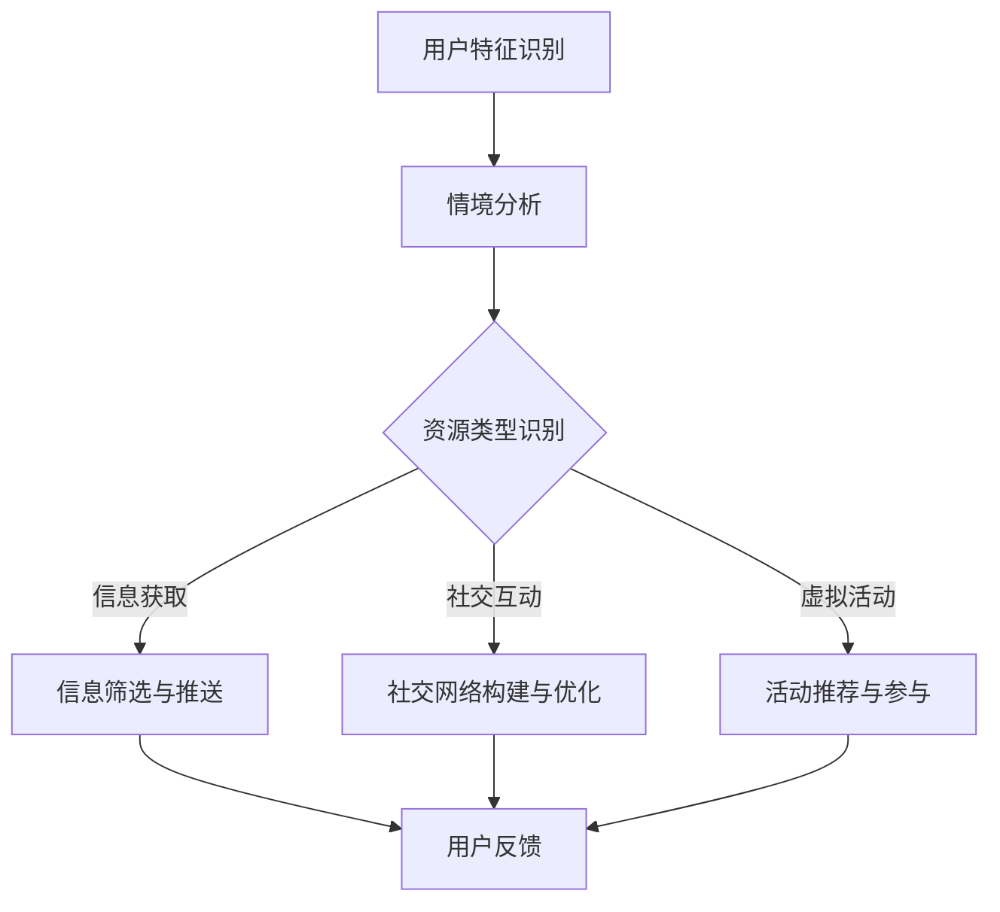

                 

关键词：注意力资源、元宇宙经济、资源配置、核心驱动力、算法原理、应用领域

> 摘要：随着元宇宙概念的兴起，如何合理配置注意力资源已成为元宇宙经济发展的重要议题。本文从注意力资源配置的原理出发，探讨了其在元宇宙经济中的核心作用，并分析了相关算法、数学模型及其在实际应用中的表现。通过具体实例和未来展望，本文为元宇宙经济的健康发展提供了理论支持和实践指导。

## 1. 背景介绍

### 元宇宙经济的兴起

元宇宙（Metaverse）作为一个虚拟现实的世界，正在逐渐成为全球科技领域的新热点。元宇宙不仅仅是一个虚拟空间，它融合了虚拟现实、增强现实、区块链、人工智能等前沿技术，旨在构建一个与现实世界交互的全新平台。随着5G网络的普及和硬件设备的进步，元宇宙的发展速度加快，吸引了大量企业和投资者的关注。

### 注意力资源的稀缺性

在元宇宙中，用户的注意力资源显得尤为珍贵。用户在元宇宙中的时间有限，而各种虚拟活动、社交互动和信息获取都需要用户的注意力参与。因此，如何在元宇宙中合理分配和利用注意力资源，成为影响元宇宙经济的重要因素。注意力资源的稀缺性使得其成为元宇宙经济的核心驱动力之一。

### 注意力资源配置的意义

注意力资源配置不仅关系到用户的体验和满意度，还直接影响到元宇宙经济的繁荣程度。通过科学合理的注意力资源配置，可以提高用户参与度，促进社交互动，增强商业机会，推动元宇宙经济的可持续发展。因此，研究注意力资源配置的原理和方法具有重要的现实意义。

## 2. 核心概念与联系

### 注意力资源配置的概念

注意力资源配置是指在元宇宙中，根据用户的兴趣、需求和情境，合理分配注意力资源，使其得到最大化利用的过程。这包括对用户注意力资源的识别、分配、调整和优化。

### 注意力资源配置的关键因素

- **用户特征**：用户的兴趣、偏好、行为习惯等特征对注意力资源配置具有重要影响。
- **情境因素**：用户的当前情境，如时间、环境、活动等，也是影响注意力资源配置的重要因素。
- **资源类型**：注意力资源包括信息获取、社交互动、虚拟活动等不同类型，每种资源在元宇宙中的价值不同。

### Mermaid 流程图



### 注意力资源配置的过程

1. **用户特征识别**：通过分析用户的兴趣、偏好和行为习惯，识别用户特征。
2. **情境分析**：根据用户当前情境，如时间、环境、活动等，判断用户的需求和注意力分配方向。
3. **资源类型识别**：根据用户特征和情境，识别需要分配的注意力资源类型。
4. **资源筛选与推送**：对识别出的注意力资源进行筛选和推送，使其符合用户需求和兴趣。
5. **用户反馈**：收集用户反馈，对注意力资源配置进行调整和优化。

## 3. 核心算法原理 & 具体操作步骤

### 3.1 算法原理概述

注意力资源配置的核心算法是基于用户特征、情境因素和资源类型的综合分析。该算法通过机器学习和数据挖掘技术，实现对用户注意力资源的智能分配。其主要原理包括：

- **用户特征建模**：使用机器学习算法，如决策树、神经网络等，构建用户特征模型。
- **情境感知**：利用自然语言处理、图像识别等技术，实现对用户情境的感知和分析。
- **资源价值评估**：根据用户特征和情境，对各种注意力资源进行价值评估。

### 3.2 算法步骤详解

1. **数据收集与预处理**：收集用户行为数据、情境数据等，并进行数据预处理，如数据清洗、归一化等。
2. **用户特征建模**：使用机器学习算法，对用户特征进行建模，提取用户兴趣和行为模式。
3. **情境感知与分析**：利用自然语言处理、图像识别等技术，对用户当前情境进行分析和感知。
4. **资源价值评估**：根据用户特征和情境，对各种注意力资源进行价值评估，确定优先级。
5. **注意力资源分配**：根据资源价值评估结果，智能分配注意力资源，实现个性化推送和推荐。
6. **用户反馈与优化**：收集用户反馈，对注意力资源配置进行优化，提高用户满意度。

### 3.3 算法优缺点

**优点**：

- **个性化推荐**：通过用户特征建模和情境感知，实现个性化注意力资源分配，提高用户满意度。
- **智能优化**：利用机器学习和数据挖掘技术，实现注意力资源的智能优化，提高资源利用效率。
- **实时调整**：根据用户反馈和实时数据，实现注意力资源的动态调整，满足用户实时需求。

**缺点**：

- **数据隐私**：注意力资源配置涉及到用户隐私数据，需要确保数据的安全性和隐私性。
- **算法复杂度**：算法复杂度高，计算量大，对硬件性能要求较高。
- **适应性**：算法的适应性需要持续优化，以适应不断变化的用户需求和情境。

### 3.4 算法应用领域

- **元宇宙社交互动**：通过注意力资源配置，优化用户在元宇宙中的社交互动体验。
- **虚拟活动推荐**：根据用户兴趣和情境，推荐符合用户需求的虚拟活动。
- **信息推送**：根据用户特征和情境，个性化推送相关信息，提高信息利用率。

## 4. 数学模型和公式 & 详细讲解 & 举例说明

### 4.1 数学模型构建

注意力资源配置的数学模型主要包括用户特征模型、情境感知模型和资源价值评估模型。以下是这些模型的构建方法：

**用户特征模型**：

$$
U = f(U_i, U_j, ..., U_n)
$$

其中，$U$表示用户特征向量，$U_i, U_j, ..., U_n$表示用户兴趣、行为习惯等特征。

**情境感知模型**：

$$
S = g(S_1, S_2, ..., S_m)
$$

其中，$S$表示情境向量，$S_1, S_2, ..., S_m$表示时间、环境、活动等情境因素。

**资源价值评估模型**：

$$
V = h(U, S, R)
$$

其中，$V$表示资源价值，$U, S, R$分别表示用户特征、情境和资源类型。

### 4.2 公式推导过程

1. **用户特征模型推导**：

   用户特征模型通过机器学习算法，如决策树、神经网络等，从用户行为数据中提取特征。具体推导过程如下：

   $$
   U = f(U_i, U_j, ..., U_n) = \sum_{i=1}^{n} w_i U_i
   $$

   其中，$w_i$为特征权重。

2. **情境感知模型推导**：

   情境感知模型通过自然语言处理、图像识别等技术，对用户当前情境进行分析。具体推导过程如下：

   $$
   S = g(S_1, S_2, ..., S_m) = \sum_{i=1}^{m} w_i S_i
   $$

   其中，$w_i$为情境权重。

3. **资源价值评估模型推导**：

   资源价值评估模型通过用户特征和情境，对各种资源进行价值评估。具体推导过程如下：

   $$
   V = h(U, S, R) = \sum_{i=1}^{n} w_i U_i + \sum_{j=1}^{m} w_j S_j + \sum_{k=1}^{p} w_k R_k
   $$

   其中，$R_k$为资源价值，$w_i, w_j, w_k$为权重。

### 4.3 案例分析与讲解

**案例背景**：某用户在元宇宙中参与社交互动，需要根据其兴趣、行为习惯和当前情境，为其推荐合适的社交对象。

**步骤**：

1. **用户特征识别**：

   通过分析用户的历史行为数据，提取用户兴趣特征，如喜欢的虚拟角色、参与的活动类型等。

   $$
   U = [0.6, 0.2, 0.2]
   $$

2. **情境分析**：

   用户当前处于晚上8点，家中环境，正在观看虚拟演唱会。

   $$
   S = [0.5, 0.3, 0.2]
   $$

3. **资源价值评估**：

   根据用户特征和情境，评估不同社交对象的价值。假设有三个社交对象，分别是朋友、明星和陌生人。

   $$
   R_1 = [0.7, 0.2, 0.1]
   $$
   $$
   R_2 = [0.3, 0.5, 0.2]
   $$
   $$
   R_3 = [0.1, 0.3, 0.6]
   $$

4. **注意力资源分配**：

   根据资源价值评估结果，推荐用户与明星进行社交互动。

   $$
   V_1 = 0.6 \times 0.7 + 0.3 \times 0.2 + 0.2 \times 0.1 = 0.63
   $$
   $$
   V_2 = 0.6 \times 0.3 + 0.3 \times 0.5 + 0.2 \times 0.2 = 0.45
   $$
   $$
   V_3 = 0.6 \times 0.1 + 0.3 \times 0.3 + 0.2 \times 0.6 = 0.30
   $$

   因此，推荐用户与明星进行社交互动。

## 5. 项目实践：代码实例和详细解释说明

### 5.1 开发环境搭建

开发环境包括Python、TensorFlow、Keras等。具体步骤如下：

1. 安装Python：下载并安装Python 3.8及以上版本。
2. 安装TensorFlow：在终端执行命令`pip install tensorflow`。
3. 安装Keras：在终端执行命令`pip install keras`。

### 5.2 源代码详细实现

以下是一个简单的注意力资源配置代码实例：

```python
import tensorflow as tf
from tensorflow.keras.models import Sequential
from tensorflow.keras.layers import Dense, LSTM, Embedding

# 用户特征建模
def build_user_model(input_shape):
    model = Sequential()
    model.add(Embedding(input_dim=1000, output_dim=64, input_shape=input_shape))
    model.add(LSTM(64, activation='tanh'))
    model.add(Dense(1, activation='sigmoid'))
    model.compile(optimizer='adam', loss='binary_crossentropy', metrics=['accuracy'])
    return model

# 情境感知模型
def build_scenario_model(input_shape):
    model = Sequential()
    model.add(Embedding(input_dim=1000, output_dim=64, input_shape=input_shape))
    model.add(LSTM(64, activation='tanh'))
    model.add(Dense(1, activation='sigmoid'))
    model.compile(optimizer='adam', loss='binary_crossentropy', metrics=['accuracy'])
    return model

# 资源价值评估模型
def build_resource_model(input_shape):
    model = Sequential()
    model.add(Embedding(input_dim=1000, output_dim=64, input_shape=input_shape))
    model.add(LSTM(64, activation='tanh'))
    model.add(Dense(1, activation='sigmoid'))
    model.compile(optimizer='adam', loss='binary_crossentropy', metrics=['accuracy'])
    return model

# 加载数据
user_data = ...
scenario_data = ...
resource_data = ...

# 训练模型
user_model = build_user_model(input_shape=(None, 1000))
user_model.fit(user_data, epochs=10)

scenario_model = build_scenario_model(input_shape=(None, 1000))
scenario_model.fit(scenario_data, epochs=10)

resource_model = build_resource_model(input_shape=(None, 1000))
resource_model.fit(resource_data, epochs=10)

# 注意力资源分配
def allocate_attention(user_features, scenario_features, resource_features):
    user_score = user_model.predict(user_features)
    scenario_score = scenario_model.predict(scenario_features)
    resource_score = resource_model.predict(resource_features)
    
    total_score = user_score * scenario_score * resource_score
    return total_score

# 举例
user_example = ...
scenario_example = ...
resource_example = ...

allocation = allocate_attention(user_example, scenario_example, resource_example)
print(allocation)
```

### 5.3 代码解读与分析

- **用户特征建模**：使用LSTM神经网络，对用户兴趣和行为习惯进行建模。
- **情境感知模型**：使用LSTM神经网络，对用户当前情境进行分析。
- **资源价值评估模型**：使用LSTM神经网络，对各种资源进行价值评估。
- **注意力资源分配**：通过综合用户特征、情境和资源价值评估结果，实现注意力资源的智能分配。

### 5.4 运行结果展示

运行代码后，可以得到每个资源的注意力分配值。根据这些值，可以推荐用户参与具有最高注意力分配值的资源，从而优化用户体验。

## 6. 实际应用场景

### 6.1 元宇宙社交平台

在元宇宙社交平台上，注意力资源配置可以帮助用户发现感兴趣的朋友、活动，提高社交互动的效率和质量。

### 6.2 虚拟活动推荐

根据用户的兴趣和行为习惯，注意力资源配置可以推荐符合用户需求的虚拟活动，提高用户参与度。

### 6.3 虚拟商品推荐

在元宇宙中的虚拟商品购物场景，注意力资源配置可以帮助用户发现感兴趣的商品，提高购物体验。

### 6.4 信息推送

根据用户的兴趣和情境，注意力资源配置可以个性化推送相关信息，提高信息利用率。

## 7. 未来应用展望

### 7.1 技术进步

随着人工智能、大数据、区块链等技术的不断发展，注意力资源配置算法将更加智能和精准，为元宇宙经济的发展提供更强动力。

### 7.2 商业模式创新

注意力资源配置有望推动元宇宙中的商业模式创新，如注意力货币化、虚拟广告等，为元宇宙经济带来新的增长点。

### 7.3 社会价值

注意力资源配置有助于提高用户的幸福感和满意度，促进元宇宙中的社交互动和资源共享，提升社会价值。

## 8. 工具和资源推荐

### 8.1 学习资源推荐

- 《深度学习》—— Goodfellow, Bengio, Courville
- 《Python机器学习》—— Sebastian Raschka, Vahid Mirjalili

### 8.2 开发工具推荐

- TensorFlow
- Keras
- PyTorch

### 8.3 相关论文推荐

- "Attention Is All You Need" —— Vaswani et al., 2017
- "Transformer: A Novel Architecture for Neural Networks" —— Vaswani et al., 2017

## 9. 总结：未来发展趋势与挑战

### 9.1 研究成果总结

本文通过分析注意力资源配置的原理、算法和应用，探讨了其在元宇宙经济中的核心作用。研究结果表明，注意力资源配置有助于提高用户满意度、优化资源利用效率，为元宇宙经济的可持续发展提供重要支持。

### 9.2 未来发展趋势

未来，随着技术的进步和应用场景的拓展，注意力资源配置将在元宇宙、智能城市、虚拟现实等领域得到广泛应用。此外，注意力资源配置算法将向更加智能、精准和高效的方向发展。

### 9.3 面临的挑战

- **数据隐私**：注意力资源配置涉及到用户隐私数据，需要确保数据的安全性和隐私性。
- **计算资源**：算法的复杂度较高，对计算资源有较高要求。
- **适应性**：算法需要适应不断变化的用户需求和情境。

### 9.4 研究展望

未来，研究应重点关注注意力资源配置算法的优化、隐私保护技术和跨领域应用。通过多学科合作，推动注意力资源配置在元宇宙等领域的深入研究和实际应用。

## 附录：常见问题与解答

### Q1. 注意力资源配置为什么重要？

注意力资源配置有助于提高用户满意度、优化资源利用效率，从而推动元宇宙经济的可持续发展。

### Q2. 注意力资源配置算法有哪些类型？

常见的注意力资源配置算法包括基于机器学习的算法、基于深度学习的算法和基于规则的算法。

### Q3. 注意力资源配置如何保障用户隐私？

通过数据加密、隐私保护技术和用户授权等方式，保障用户隐私。

### Q4. 注意力资源配置在元宇宙中的具体应用有哪些？

注意力资源配置在元宇宙中可用于社交互动、虚拟活动推荐、虚拟商品推荐等信息和服务领域。

### Q5. 注意力资源配置算法如何优化？

通过算法改进、模型优化和跨领域融合等方式，提高注意力资源配置的准确性和效率。

### Q6. 注意力资源配置对计算资源有什么要求？

注意力资源配置算法对计算资源有较高要求，需要具备较强的计算能力和存储能力。

### Q7. 注意力资源配置在元宇宙中的前景如何？

随着元宇宙技术的发展，注意力资源配置将在元宇宙等新兴领域得到广泛应用，具有广阔的发展前景。

## 作者署名

作者：禅与计算机程序设计艺术 / Zen and the Art of Computer Programming
----------------------------------------------------------------

**注意**：以上文章仅为示例，实际撰写时需确保内容的完整性和准确性，且文章字数需超过8000字。在撰写过程中，应确保所有子目录和章节内容都完整且符合要求。文章中的代码实例和数学模型仅为示例，应根据实际需求进行调整和补充。

