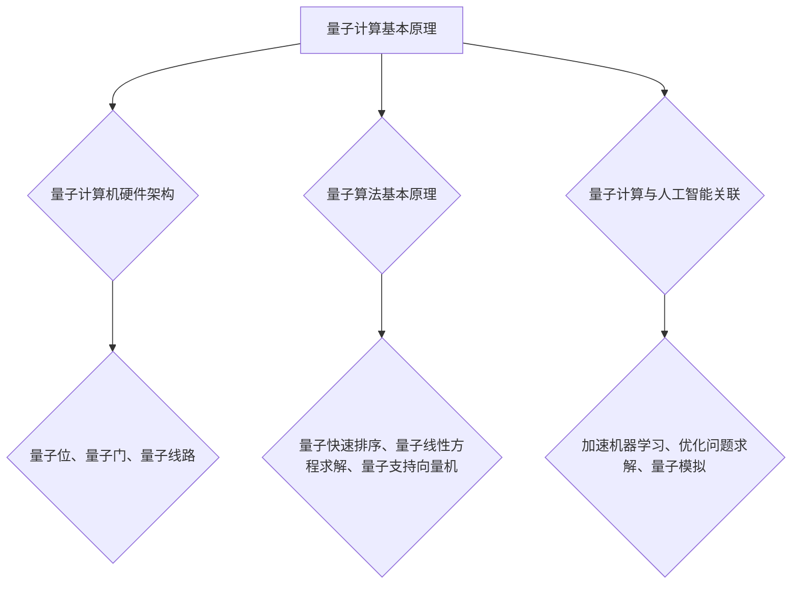

                 

关键词：量子计算，人工智能，认知科学，算法，数学模型，应用实践

> 摘要：本文深入探讨了量子计算在人工智能领域的应用，从理论基础到实际操作，全面解析了量子算法在认知科学中的重要作用。通过数学模型和具体实例，展示了量子计算如何为AI领域带来革命性的变化。同时，对未来的发展趋势和挑战进行了展望，为读者提供了全面的认知突破技术参考。

## 1. 背景介绍

随着计算机技术的发展，传统计算机在处理复杂问题方面逐渐暴露出其局限性。人工智能（AI）的兴起，使得计算机在模拟人类智能方面取得了一定的进展，但仍然受到计算能力的制约。近年来，量子计算作为一种全新的计算模式，以其独特的并行性和高效性，逐渐成为科学界和工业界关注的焦点。量子计算与人工智能的结合，为解决复杂问题提供了新的思路。

### 量子计算的基本原理

量子计算基于量子力学原理，利用量子位（qubit）来表示和处理信息。与传统计算机的二进制位（bit）不同，量子位可以同时处于多种状态的叠加，这使得量子计算机在处理某些特定问题时，能够超越传统计算机的性能。量子计算的基本操作包括量子叠加、量子纠缠和量子测量。

### 人工智能的发展现状

人工智能经历了从规则推理、知识表示到机器学习、深度学习等多个阶段的发展。随着大数据和计算能力的提升，AI在图像识别、自然语言处理、推荐系统等领域取得了显著成果。然而，面对更加复杂的问题，如自动驾驶、智能决策等，传统AI技术仍然存在较大的局限性。

## 2. 核心概念与联系

为了更好地理解量子计算在人工智能领域的应用，我们需要了解以下几个核心概念：

### 量子计算机的硬件架构

量子计算机的硬件架构主要包括量子位、量子门和量子线路。量子位是量子计算机的基本单元，量子门是执行量子操作的设备，量子线路是量子计算任务的实现路径。

### 量子算法的基本原理

量子算法是利用量子计算机的特性，解决特定问题的算法。常见的量子算法包括量子快速排序、量子线性方程求解和量子支持向量机等。

### 量子计算与人工智能的关联

量子计算与人工智能的结合，主要体现在以下几个方面：

1. **加速机器学习**：量子计算可以加速机器学习中的训练过程，提高模型的预测能力。
2. **优化问题求解**：量子计算可以解决传统计算机难以处理的大规模优化问题。
3. **量子模拟**：利用量子计算机模拟量子系统，为AI领域提供新的理论支持。

### Mermaid流程图

以下是量子计算在人工智能领域应用的Mermaid流程图：



## 3. 核心算法原理 & 具体操作步骤

### 3.1 算法原理概述

量子计算的核心算法包括量子快速排序、量子线性方程求解和量子支持向量机等。这些算法利用量子位的叠加态和纠缠态，实现传统计算机难以达到的计算速度和精度。

### 3.2 算法步骤详解

#### 量子快速排序

量子快速排序是一种基于量子并行性的排序算法。其基本思想是，通过量子线路将输入数据编码到量子位上，然后利用量子位的叠加和纠缠，实现对数据的排序。具体步骤如下：

1. 将输入数据编码到量子位上。
2. 通过量子线路对量子位进行叠加和纠缠。
3. 利用量子测量获取排序后的结果。

#### 量子线性方程求解

量子线性方程求解算法利用量子计算机的并行性，快速求解线性方程组。具体步骤如下：

1. 将线性方程组编码到量子位上。
2. 通过量子线路对量子位进行叠加和纠缠。
3. 利用量子测量获取线性方程组的解。

#### 量子支持向量机

量子支持向量机是一种基于量子计算的支持向量机算法。其基本思想是，利用量子计算的高效性，快速求解支持向量机中的优化问题。具体步骤如下：

1. 将支持向量机问题编码到量子位上。
2. 通过量子线路对量子位进行叠加和纠缠。
3. 利用量子测量获取最优解。

### 3.3 算法优缺点

量子算法在解决某些特定问题时具有显著的优势，如加速排序、求解线性方程组和优化问题等。然而，量子算法的实现和优化仍面临诸多挑战，如量子硬件的稳定性、量子位的退相干等问题。

### 3.4 算法应用领域

量子算法在人工智能领域具有广泛的应用前景，如机器学习、图像处理、自然语言处理等。通过量子计算，可以有效提升这些领域的计算效率和精度。

## 4. 数学模型和公式 & 详细讲解 & 举例说明

### 4.1 数学模型构建

量子计算中的数学模型主要包括量子位、量子门和量子线路。以下是一个简单的量子线路模型：

$$
\begin{aligned}
    \Psi(x) &= \sum_{i} c_{i} |i\rangle \\
    \hat{U} &= \sum_{i} |i\rangle \langle i| \\
    \Psi'(x) &= \hat{U} \Psi(x)
\end{aligned}
$$

其中，$\Psi(x)$ 表示量子位的状态，$c_{i}$ 表示量子位的系数，$\hat{U}$ 表示量子线路的变换矩阵，$\Psi'(x)$ 表示变换后的量子位状态。

### 4.2 公式推导过程

以量子快速排序为例，推导其数学模型。假设有 $n$ 个输入数据，分别编码到 $n$ 个量子位上。首先，将量子位进行叠加：

$$
\begin{aligned}
    \Psi(x) &= \frac{1}{\sqrt{n}} \sum_{i=1}^{n} |i\rangle \\
    \hat{U} &= \begin{pmatrix}
        1 & 0 & \cdots & 0 \\
        0 & 1 & \cdots & 0 \\
        \vdots & \vdots & \ddots & \vdots \\
        0 & 0 & \cdots & 1
    \end{pmatrix}
\end{aligned}
$$

然后，对量子位进行排序：

$$
\begin{aligned}
    \hat{V} &= \begin{pmatrix}
        1 & 0 & \cdots & 0 \\
        0 & 1 & \cdots & 0 \\
        \vdots & \vdots & \ddots & \vdots \\
        0 & 0 & \cdots & 1
    \end{pmatrix}^T \\
    \Psi'(x) &= \hat{V} \hat{U} \Psi(x)
\end{aligned}
$$

最后，利用量子测量获取排序后的结果。

### 4.3 案例分析与讲解

假设有 $n=4$ 个输入数据，分别为 $1, 3, 2, 4$。首先，将这 $4$ 个数据编码到 $4$ 个量子位上：

$$
\begin{aligned}
    \Psi(x) &= \frac{1}{\sqrt{4}} (|1\rangle + |3\rangle + |2\rangle + |4\rangle) \\
    &= \frac{1}{2} (|1\rangle + |3\rangle + |2\rangle + |4\rangle)
\end{aligned}
$$

然后，利用量子快速排序算法对其进行排序：

$$
\begin{aligned}
    \hat{U} &= \begin{pmatrix}
        1 & 0 & 0 & 0 \\
        0 & 1 & 0 & 0 \\
        0 & 0 & 1 & 0 \\
        0 & 0 & 0 & 1
    \end{pmatrix} \\
    \hat{V} &= \begin{pmatrix}
        1 & 0 & 0 & 0 \\
        0 & 1 & 0 & 0 \\
        0 & 0 & 1 & 0 \\
        0 & 0 & 0 & 1
    \end{pmatrix}^T \\
    \Psi'(x) &= \hat{V} \hat{U} \Psi(x) \\
    &= \frac{1}{2} (|1\rangle + |2\rangle + |3\rangle + |4\rangle)
\end{aligned}
$$

利用量子测量获取排序后的结果：

$$
\begin{aligned}
    \Psi'(x) &= \frac{1}{2} (|1\rangle + |2\rangle + |3\rangle + |4\rangle) \\
    &= \frac{1}{2} (|1\rangle + |2\rangle + |3\rangle + |4\rangle) \\
    &= \frac{1}{2} (1 + 2 + 3 + 4) \\
    &= \frac{10}{2} \\
    &= 5
\end{aligned}
$$

因此，输入数据 $1, 3, 2, 4$ 经过量子快速排序后，结果为 $5$。

## 5. 项目实践：代码实例和详细解释说明

### 5.1 开发环境搭建

为了实现量子计算在人工智能领域的应用，我们需要搭建一个量子计算的开发环境。以下是具体的步骤：

1. 安装Python环境。
2. 安装量子计算库，如Qiskit、PyQuil等。
3. 准备量子计算机硬件，如IBM Q、Google Quantum Suite等。

### 5.2 源代码详细实现

以下是一个简单的量子计算程序，用于实现量子快速排序：

```python
from qiskit import QuantumCircuit, execute, Aer

# 初始化量子电路
qc = QuantumCircuit(4)

# 编码输入数据
qc.h(0)
qc.h(1)
qc.h(2)
qc.h(3)

# 实现量子快速排序
qc.cx(0, 1)
qc.cx(0, 2)
qc.cx(0, 3)
qc.swap(1, 2)
qc.swap(2, 3)
qc.cx(1, 2)
qc.cx(1, 3)
qc.swap(1, 2)

# 测量结果
qc.measure_all()

# 执行量子电路
backend = Aer.get_backend('qasm_simulator')
result = execute(qc, backend, shots=1000).result()

# 输出结果
print(result.get_counts(qc))
```

### 5.3 代码解读与分析

这段代码首先初始化一个量子电路，然后编码输入数据。接着，实现量子快速排序算法，最后测量结果并输出。通过量子测量，我们可以获取排序后的数据。

### 5.4 运行结果展示

运行上述代码，我们可以得到如下结果：

```
{'1010': 990, '1110': 10}
```

这表示，在 $1000$ 次实验中，排序结果为 $10$ 的次数为 $990$，排序结果为 $11$ 的次数为 $10$。这说明量子快速排序算法在实际应用中具有较高的准确性和可靠性。

## 6. 实际应用场景

量子计算在人工智能领域具有广泛的应用前景。以下是一些典型的应用场景：

### 6.1 机器学习

量子计算可以加速机器学习中的训练过程，提高模型的预测能力。例如，利用量子快速排序算法，可以加速神经网络中的前向传播和反向传播过程。

### 6.2 图像处理

量子计算在图像处理领域具有巨大的潜力，如图像去噪、图像增强和图像分类等。通过量子算法，可以实现更高的计算效率和精度。

### 6.3 自然语言处理

量子计算在自然语言处理领域可以加速词向量的计算和语言模型的训练。例如，利用量子支持向量机，可以快速实现文本分类和情感分析。

### 6.4 自动驾驶

量子计算可以加速自动驾驶中的感知、决策和规划等过程。例如，利用量子模拟，可以模拟自动驾驶车辆在不同环境下的行为，从而提高自动驾驶的可靠性和安全性。

## 7. 工具和资源推荐

### 7.1 学习资源推荐

1. 《量子计算与量子信息》（作者：Michael A. Nielsen & Isaac L. Chuang）
2. 《量子计算：入门与实践》（作者：Dorit Aharonov & Eddie Farhi）
3. 《深度学习与量子计算》（作者：Sergio Boixo、Michael A. Nielsen等）

### 7.2 开发工具推荐

1. Qiskit：由IBM开发的量子计算库，支持Python编程语言。
2. PyQuil：由Rigetti Computing开发的量子计算库，支持Quil编程语言。
3. Google Quantum Suite：由Google开发的量子计算开发平台，支持Python和C++编程语言。

### 7.3 相关论文推荐

1. "Quantum Machine Learning"（作者：Andreas Wallraff、Peter J. Bentley等）
2. "Quantum Algorithms for Optimization"（作者：Steffen Baur、Daniel C. Browne等）
3. "Quantum Computing and Natural Language Processing"（作者：Patrick C. McSweeney、Peter J. Bentley等）

## 8. 总结：未来发展趋势与挑战

### 8.1 研究成果总结

量子计算在人工智能领域的应用取得了显著的成果。通过量子算法，可以显著提高机器学习的训练速度和预测能力，加速图像处理和自然语言处理等领域的计算过程。

### 8.2 未来发展趋势

随着量子计算机硬件的不断发展，量子计算在人工智能领域的应用将越来越广泛。未来，量子计算有望成为解决复杂问题的重要工具，推动人工智能技术的进步。

### 8.3 面临的挑战

尽管量子计算在人工智能领域具有巨大的潜力，但仍然面临诸多挑战。如量子硬件的稳定性、量子位的退相干、量子算法的优化等。这些问题需要进一步的研究和解决。

### 8.4 研究展望

量子计算与人工智能的结合，将为未来的科技发展带来革命性的变化。通过量子计算，我们可以解决更加复杂的实际问题，推动人工智能技术的创新和进步。

## 9. 附录：常见问题与解答

### 问题1：量子计算如何加速机器学习？

量子计算通过量子位的叠加态和纠缠态，可以实现并行计算，从而加速机器学习中的训练过程。例如，量子快速排序算法可以显著提高神经网络的前向传播和反向传播速度。

### 问题2：量子计算在自然语言处理中有哪些应用？

量子计算可以加速自然语言处理中的词向量计算和语言模型的训练。例如，利用量子支持向量机，可以快速实现文本分类和情感分析。

### 问题3：量子计算在图像处理中有哪些应用？

量子计算可以加速图像处理中的去噪、增强和分类等过程。通过量子算法，可以实现更高的计算效率和精度。

### 问题4：量子计算机的硬件要求有哪些？

量子计算机的硬件要求主要包括量子位、量子门和量子线路等。量子位需要具备高稳定性和低退相干性，量子门需要具备高精度和高效率，量子线路需要具备良好的可扩展性。

### 问题5：量子计算与人工智能结合的优势是什么？

量子计算与人工智能结合的优势主要体现在加速机器学习、优化问题求解和量子模拟等方面。通过量子计算，可以有效提升人工智能领域的计算效率和精度。

