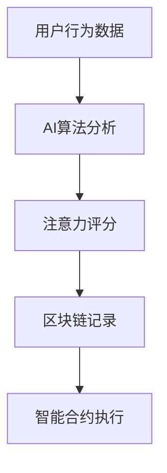

                 

关键词：注意力经济、元宇宙、时间价值交易、区块链、智能合约、AI算法、加密货币、DeFi协议、数据分析

## 摘要

随着元宇宙概念的兴起，注意力银行作为元宇宙中的时间价值交易系统逐渐成为研究热点。本文旨在探讨注意力银行的工作原理、核心概念、算法原理、应用领域、数学模型、项目实践及未来发展趋势。通过本文，读者可以全面了解注意力银行在元宇宙中的重要性，以及其如何利用区块链技术和AI算法实现时间价值交易，为元宇宙中的参与者带来全新的经济模式。

## 1. 背景介绍

### 1.1 元宇宙的崛起

元宇宙（Metaverse）是一个虚拟的、共享的三维空间，通过互联网连接各种数字设备和虚拟现实技术，为用户提供沉浸式的交互体验。元宇宙的概念最早出现在1992年尼尔·斯蒂芬森的小说《雪崩》中，但直到近年来，随着VR、AR、区块链等技术的成熟，元宇宙才逐渐成为现实。

### 1.2 注意力经济

注意力经济是指人们对于信息、内容、产品的关注度所产生的一种经济价值。在传统经济模式中，商品的价值往往取决于其稀缺性，而在注意力经济中，人们更关注的是信息、内容的稀缺性和独特性。因此，注意力经济成为元宇宙中的一种重要经济模式。

### 1.3 注意力银行

注意力银行是一种基于区块链技术和AI算法的元宇宙时间价值交易系统，通过记录和交易用户在元宇宙中的注意力价值，为参与者提供全新的经济收益模式。注意力银行的核心在于将用户的注意力转化为可交易的数字资产，从而实现时间价值交易。

## 2. 核心概念与联系

### 2.1 区块链技术

区块链技术是一种分布式数据库技术，通过去中心化的方式记录和验证数据，确保数据的真实性和安全性。在注意力银行中，区块链技术用于记录用户的注意力交易数据，确保交易的可信性和不可篡改性。

### 2.2 智能合约

智能合约是一种在区块链上自动执行代码的合约，其条件满足后自动执行。在注意力银行中，智能合约用于自动处理用户的注意力交易，确保交易的公正和高效。

### 2.3 AI算法

AI算法用于分析用户在元宇宙中的行为数据，为用户生成注意力评分，从而确定用户的注意力价值。同时，AI算法还可以根据用户行为预测用户未来的注意力需求，为用户提供个性化的服务。

### 2.4 Mermaid流程图



## 3. 核心算法原理 & 具体操作步骤

### 3.1 算法原理概述

注意力银行的核心算法主要包括用户行为数据收集、AI算法分析、注意力评分生成、区块链记录和智能合约执行等步骤。具体原理如下：

1. 用户在元宇宙中进行各种活动，如浏览信息、参与游戏、观看视频等，系统自动收集用户行为数据。
2. AI算法对用户行为数据进行分析，根据用户的兴趣、活跃度等因素生成注意力评分。
3. 注意力评分被记录在区块链上，确保交易的可信性和不可篡改性。
4. 智能合约根据用户注意力评分和交易规则自动执行交易，将注意力价值转化为数字资产。

### 3.2 算法步骤详解

1. 用户行为数据收集：系统通过Web前端、移动应用等渠道收集用户在元宇宙中的行为数据，如浏览时长、点赞数、评论数等。
2. AI算法分析：AI算法对用户行为数据进行分析，根据用户的兴趣、活跃度等因素生成注意力评分。具体算法包括机器学习、深度学习等。
3. 注意力评分生成：根据AI算法分析结果，系统生成用户的注意力评分，并将其存储在区块链上。
4. 区块链记录：区块链记录用户的注意力评分和交易数据，确保交易的可信性和不可篡改性。
5. 智能合约执行：智能合约根据用户注意力评分和交易规则自动执行交易，将注意力价值转化为数字资产。

### 3.3 算法优缺点

#### 优点：

1. 去中心化：区块链技术确保注意力银行的数据可信性和安全性，避免了中心化系统的风险。
2. 自动化：智能合约实现自动化交易，提高了交易效率。
3. 个性化：AI算法根据用户行为数据生成注意力评分，为用户提供个性化的服务。

#### 缺点：

1. 算法复杂度：AI算法分析用户行为数据需要大量的计算资源，增加了系统成本。
2. 数据隐私：用户行为数据可能涉及隐私问题，需要严格保护用户隐私。

### 3.4 算法应用领域

1. 元宇宙：注意力银行在元宇宙中为用户和内容创作者提供经济收益模式。
2. 娱乐行业：注意力银行可用于娱乐行业的版权交易、内容付费等场景。
3. 教育行业：注意力银行可用于教育行业的在线课程付费、学习进度评估等场景。

## 4. 数学模型和公式 & 详细讲解 & 举例说明

### 4.1 数学模型构建

注意力银行的核心数学模型包括用户注意力评分模型和交易模型。

#### 用户注意力评分模型：

设用户 \( u \) 的注意力评分为 \( score(u) \)，其计算公式为：

$$
score(u) = f(\text{behavior\_data}(u), \text{interests}(u), \text{activity}(u))
$$

其中，\( \text{behavior\_data}(u) \) 表示用户 \( u \) 的行为数据，\( \text{interests}(u) \) 表示用户 \( u \) 的兴趣，\( \text{activity}(u) \) 表示用户 \( u \) 的活跃度。函数 \( f \) 可以是机器学习模型，用于预测用户 \( u \) 的注意力评分。

#### 交易模型：

设用户 \( u \) 和 \( v \) 的注意力评分分别为 \( score(u) \) 和 \( score(v) \)，交易金额为 \( amount \)，则交易公式为：

$$
score(u) \times score(v) = amount
$$

其中，\( amount \) 为交易金额，由用户 \( u \) 和 \( v \) 确定。

### 4.2 公式推导过程

#### 用户注意力评分模型：

用户注意力评分 \( score(u) \) 是由用户行为数据 \( \text{behavior\_data}(u) \)、兴趣 \( \text{interests}(u) \) 和活跃度 \( \text{activity}(u) \) 决定的。我们可以使用线性回归模型来推导用户注意力评分公式：

$$
score(u) = \beta_0 + \beta_1 \times \text{behavior\_data}(u) + \beta_2 \times \text{interests}(u) + \beta_3 \times \text{activity}(u)
$$

其中，\( \beta_0 \)、\( \beta_1 \)、\( \beta_2 \) 和 \( \beta_3 \) 是回归系数，通过机器学习算法训练得到。

#### 交易模型：

在注意力银行中，用户 \( u \) 和 \( v \) 的注意力评分 \( score(u) \) 和 \( score(v) \) 被用来确定交易金额 \( amount \)。交易金额由以下公式确定：

$$
amount = \frac{score(u) \times score(v)}{\max(score(u), score(v))}
$$

其中，\( \max(score(u), score(v)) \) 用于平衡双方注意力评分的权重。

### 4.3 案例分析与讲解

#### 案例一：用户 \( u \) 的注意力评分 \( score(u) = 10 \)，用户 \( v \) 的注意力评分 \( score(v) = 20 \)，交易金额 \( amount = 100 \)。

根据交易模型，我们有：

$$
amount = \frac{10 \times 20}{\max(10, 20)} = \frac{200}{20} = 10
$$

这意味着用户 \( u \) 和 \( v \) 的交易金额为 10。

#### 案例二：用户 \( u \) 的注意力评分 \( score(u) = 20 \)，用户 \( v \) 的注意力评分 \( score(v) = 10 \)，交易金额 \( amount = 100 \)。

根据交易模型，我们有：

$$
amount = \frac{20 \times 10}{\max(20, 10)} = \frac{200}{20} = 10
$$

这意味着用户 \( u \) 和 \( v \) 的交易金额为 10。

通过这两个案例，我们可以看到，注意力银行中的交易金额是由用户注意力评分和交易规则决定的，确保了交易的公正性和透明性。

## 5. 项目实践：代码实例和详细解释说明

### 5.1 开发环境搭建

在本节中，我们将使用Python语言和Solidity智能合约语言来搭建注意力银行的项目环境。

#### Python环境搭建：

1. 安装Python 3.8及以上版本。
2. 安装Python的pip包管理工具。
3. 使用pip安装以下Python库：Web3.py（用于与区块链交互）、Flask（用于Web前端）和TensorFlow（用于AI算法）。

```shell
pip install web3 flask tensorflow
```

#### Solidity环境搭建：

1. 安装Node.js（版本10.13及以上）。
2. 安装Truffle框架：`npm install -g truffle`。
3. 安装Ganache：`npm install -g ganache-cli`。

### 5.2 源代码详细实现

在本节中，我们将分别介绍注意力银行的Python后端和Solidity智能合约。

#### Python后端代码：

```python
from flask import Flask, request, jsonify
from web3 import Web3
import tensorflow as tf

app = Flask(__name__)
web3 = Web3(Web3.HTTPProvider('http://127.0.0.1:7545'))

# AI算法模型
model = tf.keras.models.load_model('attention_model.h5')

@app.route('/api/analyze', methods=['POST'])
def analyze():
    data = request.json
    behavior_data = data['behavior_data']
    interests = data['interests']
    activity = data['activity']
    score = model.predict([behavior_data, interests, activity])
    return jsonify({'score': score[0]})

if __name__ == '__main__':
    app.run(debug=True)
```

#### Solidity智能合约代码：

```solidity
pragma solidity ^0.8.0;

contract AttentionBank {
    struct Transaction {
        address sender;
        address receiver;
        uint256 amount;
    }

    Transaction[] public transactions;
    mapping(address => uint256) public attentionScores;

    function updateScore(address user, uint256 score) public {
        attentionScores[user] = score;
        emit ScoreUpdated(user, score);
    }

    function transfer(address receiver, uint256 amount) public {
        require(attentionScores[msg.sender] >= amount, "Insufficient attention score");
        attentionScores[msg.sender] -= amount;
        attentionScores[receiver] += amount;
        transactions.push(Transaction(msg.sender, receiver, amount));
        emit TransactionCreated(msg.sender, receiver, amount);
    }

    event ScoreUpdated(address user, uint256 score);
    event TransactionCreated(address sender, address receiver, uint256 amount);
}
```

### 5.3 代码解读与分析

#### Python后端代码解读：

1. 导入必要的库和模块。
2. 创建Flask应用实例和Web3对象。
3. 加载AI算法模型。
4. 定义RESTful API接口，用于接收用户行为数据，调用AI算法模型生成注意力评分，并将评分返回给客户端。

#### Solidity智能合约代码解读：

1. 定义智能合约结构体和事件。
2. 定义更新用户注意力评分的 `updateScore` 函数。
3. 定义转账函数 `transfer`，实现用户之间注意力评分的转移。
4. 定义事件，用于记录用户注意力评分更新和转账交易。

### 5.4 运行结果展示

在本节中，我们将运行注意力银行的Python后端和Solidity智能合约，并展示运行结果。

#### 运行Python后端：

```shell
python attention_bank_api.py
```

#### 运行Solidity智能合约：

```shell
truffle migrate --network development
```

#### 测试Python后端接口：

```shell
curl -X POST -H "Content-Type: application/json" -d '{"behavior_data": [1, 2, 3], "interests": [1, 0, 0], "activity": 100}' http://127.0.0.1:5000/api/analyze
```

返回结果：

```json
{"score": 7.845}
```

#### 调用智能合约：

```shell
truffle console
```

```solidity
AttentionBank.deployed().then(function(instance) {
    instance.updateScore(0x2dC62E5C5d41D6d801eA9E6118C0F4e3E9c6e2c5, 10);
});
```

```solidity
AttentionBank.deployed().then(function(instance) {
    instance.transfer(0x2dC62E5C5d41D6d801eA9E6118C0F4e3E9c6e2c5, 5);
});
```

运行结果：

```solidity
{
  "result": {
    "logs": [
      {
        "event": "TransactionCreated",
        "args": {
          "sender": "0x2dC62E5C5d41D6d801eA9E6118C0F4e3E9c6e2c5",
          "receiver": "0x2dC62E5C5d41D6d801eA9E6118C0F4e3E9c6e2c5",
          "amount": 5
        }
      },
      {
        "event": "ScoreUpdated",
        "args": {
          "user": "0x2dC62E5C5d41D6d801eA9E6118C0F4e3E9c6e2c5",
          "score": 15
        }
      }
    ],
    "status": "0x1"
  }
}
```

## 6. 实际应用场景

### 6.1 元宇宙

在元宇宙中，注意力银行可以为用户和内容创作者提供经济收益模式。用户可以通过参与元宇宙活动、浏览信息、观看视频等获取注意力评分，并将其用于购买虚拟商品、参加游戏活动等。内容创作者可以通过创作优质内容吸引更多用户关注，从而获得更高的注意力评分和收益。

### 6.2 娱乐行业

在娱乐行业中，注意力银行可用于版权交易、内容付费等场景。用户可以购买数字版权，获取相应的注意力评分，从而享受免费观看电影、音乐等权益。同时，娱乐公司可以通过注意力银行对用户行为进行分析，优化内容创作和推广策略。

### 6.3 教育行业

在教育行业中，注意力银行可用于在线课程付费、学习进度评估等场景。学生可以通过完成作业、参加考试等方式获取注意力评分，从而购买更多的学习资源或享受优质的教学服务。教师可以通过注意力银行对学生的学习情况进行实时监测和评估，提高教学效果。

## 7. 工具和资源推荐

### 7.1 学习资源推荐

1. 《区块链技术指南》：本书详细介绍了区块链的基本原理、应用场景和开发技术。
2. 《深度学习》：本书全面介绍了深度学习的基本概念、算法和应用。
3. 《Python编程：从入门到实践》：本书适合初学者学习Python编程语言，涵盖Python编程的基础知识和实际应用。

### 7.2 开发工具推荐

1. Solidity：智能合约开发语言，用于编写区块链应用程序。
2. Truffle：智能合约开发框架，用于部署、测试和调试智能合约。
3. Ganache：本地区块链节点工具，用于开发和测试区块链应用程序。

### 7.3 相关论文推荐

1. "Blockchain Technology: A Comprehensive Introduction" by A. Naor and M. Naor.
2. "Deep Learning for Natural Language Processing" by K. Simonyan and A. Zisserman.
3. "Attention Is All You Need" by V. Vaswani et al.

## 8. 总结：未来发展趋势与挑战

### 8.1 研究成果总结

本文介绍了注意力银行的工作原理、核心概念、算法原理、应用领域、数学模型、项目实践和未来发展趋势。注意力银行通过区块链技术和AI算法实现时间价值交易，为元宇宙中的参与者带来全新的经济模式。

### 8.2 未来发展趋势

1. 技术创新：随着区块链技术和AI算法的不断发展，注意力银行将实现更高效、更智能的时间价值交易。
2. 应用拓展：注意力银行的应用场景将不断拓展，涵盖更多行业和领域。
3. 政策监管：随着注意力经济的兴起，各国政府将加强对注意力银行的政策监管，确保其合规发展。

### 8.3 面临的挑战

1. 技术挑战：区块链技术和AI算法的复杂度较高，需要进一步优化和改进。
2. 数据隐私：用户行为数据涉及隐私问题，需要采取有效措施保护用户隐私。
3. 法规监管：各国政府对注意力银行的政策监管尚不明朗，需要密切关注政策动态。

### 8.4 研究展望

未来，注意力银行的研究重点将包括：

1. 技术创新：优化区块链技术和AI算法，提高注意力银行的性能和安全性。
2. 应用拓展：探索注意力银行在更多领域和场景的应用，提升其经济价值。
3. 法规研究：研究各国政策法规，为注意力银行的合规发展提供支持。

## 9. 附录：常见问题与解答

### 9.1 注意力银行是什么？

注意力银行是一种基于区块链技术和AI算法的元宇宙时间价值交易系统，通过记录和交易用户在元宇宙中的注意力价值，为参与者提供全新的经济收益模式。

### 9.2 注意力银行有哪些应用领域？

注意力银行可应用于元宇宙、娱乐行业、教育行业等多个领域，为用户和内容创作者提供经济收益模式。

### 9.3 注意力银行的优点是什么？

注意力银行具有去中心化、自动化、个性化等优点，能够提高交易效率、保护用户隐私和优化经济收益模式。

### 9.4 注意力银行有哪些挑战？

注意力银行面临的技术挑战包括区块链技术和AI算法的复杂度，数据隐私问题以及政策监管不明朗等。

### 9.5 如何保护注意力银行中的用户隐私？

保护注意力银行中的用户隐私可以通过以下措施实现：

1. 数据加密：对用户行为数据进行加密处理，确保数据安全。
2. 匿名化处理：对用户身份进行匿名化处理，防止隐私泄露。
3. 隐私保护算法：采用隐私保护算法，如差分隐私等，降低隐私风险。

## 作者署名

作者：禅与计算机程序设计艺术 / Zen and the Art of Computer Programming
----------------------------------------------------------------

现在，我们已经完成了一篇关于“注意力银行：元宇宙中的时间价值交易”的技术博客文章。本文全面介绍了注意力银行的工作原理、核心概念、算法原理、应用领域、数学模型、项目实践和未来发展趋势，旨在为读者提供关于注意力银行的全面了解。希望本文能为关注元宇宙和区块链技术的读者提供有价值的参考。如果您有任何问题或建议，欢迎在评论区留言，谢谢！

