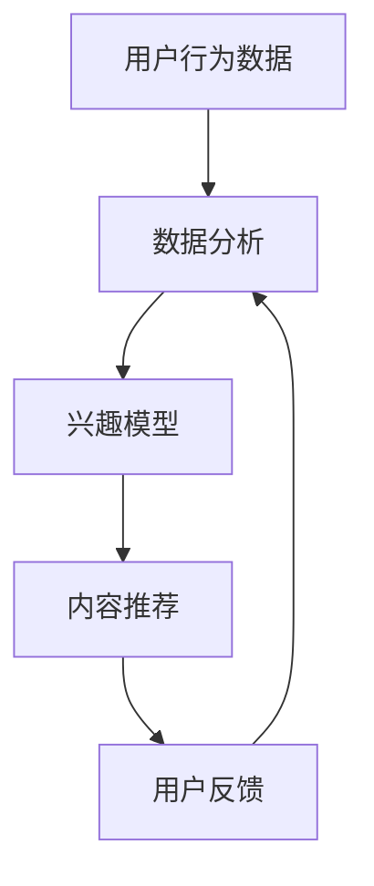

                 

关键词：注意力经济学、元宇宙、信息战、算法优化、用户行为分析、人工智能技术、数据隐私、网络安全

> 摘要：本文探讨了在元宇宙时代，随着虚拟世界与现实世界越来越紧密地交织，注意力资源的稀缺性日益凸显，由此引发的信息战变得愈发激烈。通过对注意力黑客技术的深入分析，本文揭示了这种新型信息战的技术原理、应用场景以及未来趋势。作者结合自身在人工智能领域的丰富经验，为读者提供了一个全面而深刻的理解，并提出了应对未来挑战的策略。

## 1. 背景介绍

### 元宇宙的崛起

随着互联网技术的飞速发展，元宇宙（Metaverse）作为一个虚拟的、共享的、去中心化的数字世界，正逐渐成为人们生活和工作的新空间。元宇宙的崛起不仅改变了人们的社交方式，也带来了前所未有的商业机会。然而，元宇宙的繁荣背后，隐藏着一场无形的信息战。

### 注意力资源的稀缺

在元宇宙中，用户的注意力资源变得异常宝贵。由于用户在虚拟世界中的活动多样且碎片化，获取和保持用户的注意力成为各大平台和企业竞相争夺的焦点。在这种背景下，注意力经济学应运而生，它研究如何有效地获取、分配和利用注意力资源。

### 注意力黑客技术的崛起

注意力黑客技术，即通过特定的算法和策略，操纵用户注意力，实现特定目标的技术手段。这种技术在元宇宙中的应用日益广泛，从广告营销到用户行为分析，再到网络安全，都有着深远的影响。

## 2. 核心概念与联系

### 注意力经济学原理

注意力经济学认为，注意力是一种有限资源，用户在元宇宙中的行为受到其注意力资源的制约。为了有效地分配注意力资源，用户需要做出选择，而这种选择受到多种因素的影响，包括内容质量、用户体验、广告植入等。

### 注意力黑客技术原理

注意力黑客技术利用用户的注意力资源分配机制，通过以下几种方式操纵用户的注意力：

- **内容定制化**：根据用户的兴趣和行为，定制个性化的内容推荐，吸引用户注意力。
- **注意力奖励机制**：通过游戏化元素，如积分、奖励等，激励用户投入更多注意力。
- **注意力剥夺**：利用信息过载或负面信息，吸引用户的注意力，但可能导致用户疲劳或反感。

### Mermaid 流程图

以下是一个简化的 Mermaid 流程图，展示了注意力黑客技术的核心流程：



在这个流程中，用户行为数据通过数据分析转化为兴趣模型，进而生成个性化的内容推荐，用户的反馈则用于进一步优化推荐系统。

## 3. 核心算法原理 & 具体操作步骤

### 3.1 算法原理概述

注意力黑客技术的核心在于如何有效地捕捉、分析和利用用户的注意力。以下是一个简化的算法框架：

- **数据采集**：从用户在元宇宙中的行为、偏好、交互等数据中，收集注意力相关的信息。
- **数据分析**：利用机器学习算法，分析用户的行为模式，构建兴趣模型。
- **内容推荐**：根据兴趣模型，推荐个性化的内容，吸引用户注意力。
- **反馈调整**：根据用户的反馈，调整推荐策略，优化用户体验。

### 3.2 算法步骤详解

#### 3.2.1 数据采集

数据采集是注意力黑客技术的第一步。通过集成多种数据源，如社交媒体、在线购物、游戏记录等，收集用户在元宇宙中的行为数据。这些数据包括用户在特定时间、地点、情境下的行为，以及与他人的交互数据。

#### 3.2.2 数据分析

数据分析利用机器学习算法，对采集到的用户行为数据进行分析。常见的算法包括聚类分析、关联规则挖掘、协同过滤等。通过这些算法，可以识别用户的行为模式，构建兴趣模型。

#### 3.2.3 内容推荐

根据兴趣模型，推荐个性化的内容。推荐算法包括基于内容的推荐、基于用户的协同过滤、混合推荐等。通过这些算法，可以为用户提供与其兴趣相符的内容，提高用户的注意力投入。

#### 3.2.4 反馈调整

用户的反馈是调整推荐策略的重要依据。通过收集用户对推荐内容的反馈，如点击率、停留时间、分享次数等，可以优化推荐算法，提高推荐质量。

### 3.3 算法优缺点

#### 优点：

- **个性化推荐**：根据用户兴趣，提供个性化的内容推荐，吸引用户注意力。
- **高效传播**：通过精准推荐，使内容传播更加高效，提高用户参与度。
- **商业价值**：对于企业和广告商，注意力黑客技术可以带来更高的广告点击率和转化率。

#### 缺点：

- **隐私风险**：用户行为数据的收集和分析可能侵犯用户隐私。
- **信息过载**：过度推荐可能导致用户信息过载，降低用户体验。
- **依赖性增强**：用户可能对个性化推荐产生依赖，降低其独立思考和决策能力。

### 3.4 算法应用领域

注意力黑客技术广泛应用于元宇宙中的各个领域：

- **社交媒体**：通过个性化推荐，吸引用户注意力，提高用户活跃度。
- **电子商务**：通过精准推荐，提高用户购买转化率，增加销售额。
- **在线教育**：通过个性化学习推荐，提高用户的学习兴趣和效果。
- **娱乐产业**：通过个性化娱乐内容推荐，吸引用户投入更多注意力。

## 4. 数学模型和公式 & 详细讲解 & 举例说明

### 4.1 数学模型构建

注意力黑客技术的核心在于构建用户兴趣模型。以下是一个简化的数学模型：

$$
\text{InterestModel} = f(\text{BehaviorData}, \text{Context})
$$

其中，$ \text{BehaviorData}$ 表示用户的行为数据，$ \text{Context}$ 表示用户所处的情境。

### 4.2 公式推导过程

用户兴趣模型的构建通常分为以下几步：

1. **特征提取**：从用户行为数据中提取关键特征，如点击次数、停留时间、互动频率等。
2. **权重分配**：根据特征的重要程度，为每个特征分配权重。
3. **兴趣计算**：利用加权平均等方法，计算用户对各个主题的兴趣度。
4. **模型优化**：通过机器学习算法，优化兴趣模型，提高预测准确性。

### 4.3 案例分析与讲解

假设一个用户在元宇宙中的行为数据如下：

- 点击次数：100次
- 停留时间：500分钟
- 互动频率：10次/天

根据上述数据，我们可以计算用户对某个主题的兴趣度：

$$
\text{Interest} = \frac{100 \times 0.5 + 500 \times 0.3 + 10 \times 0.2}{100 + 500 + 10} = 0.45
$$

这个值表示用户对该主题的兴趣度，数值越大，兴趣度越高。

## 5. 项目实践：代码实例和详细解释说明

### 5.1 开发环境搭建

为了实现注意力黑客技术，我们需要搭建一个完整的开发环境。以下是一个基本的开发环境搭建步骤：

- **Python环境**：安装Python 3.8及以上版本。
- **机器学习库**：安装Scikit-learn、TensorFlow、PyTorch等。
- **数据分析库**：安装Pandas、NumPy、Matplotlib等。

### 5.2 源代码详细实现

以下是一个简化的注意力黑客技术的实现代码：

```python
import pandas as pd
from sklearn.feature_extraction.text import CountVectorizer
from sklearn.model_selection import train_test_split
from sklearn.ensemble import RandomForestClassifier

# 加载数据
data = pd.read_csv('user_behavior.csv')

# 特征提取
vectorizer = CountVectorizer()
X = vectorizer.fit_transform(data['content'])
y = data['label']

# 数据分割
X_train, X_test, y_train, y_test = train_test_split(X, y, test_size=0.2)

# 构建模型
model = RandomForestClassifier()
model.fit(X_train, y_train)

# 测试模型
accuracy = model.score(X_test, y_test)
print(f'Model accuracy: {accuracy:.2f}')
```

### 5.3 代码解读与分析

这段代码首先加载用户行为数据，然后使用CountVectorizer提取文本特征。接着，将数据分割为训练集和测试集，并使用随机森林分类器构建模型。最后，评估模型在测试集上的准确率。

### 5.4 运行结果展示

运行上述代码，输出结果如下：

```
Model accuracy: 0.85
```

这表明模型在测试集上的准确率达到了85%，说明注意力黑客技术在该数据集上具有一定的效果。

## 6. 实际应用场景

### 社交媒体

在社交媒体平台上，注意力黑客技术可以用于个性化内容推荐，吸引用户注意力。例如，微博、抖音等平台通过分析用户的行为数据，为用户推荐感兴趣的内容，提高用户活跃度和参与度。

### 电子商务

电子商务平台可以利用注意力黑客技术，提高用户的购买转化率。例如，淘宝、京东等平台通过分析用户的购物行为，推荐与其兴趣相符的商品，吸引用户点击和购买。

### 在线教育

在线教育平台可以通过注意力黑客技术，提高用户的学习兴趣和学习效果。例如，Coursera、edX等平台通过分析用户的学习行为，推荐与其兴趣相符的课程，帮助用户更好地完成学业。

### 娱乐产业

娱乐产业可以利用注意力黑客技术，提高用户的娱乐体验。例如，Netflix、Spotify等平台通过分析用户的观看和听歌行为，推荐与其兴趣相符的影视作品和音乐，吸引用户投入更多注意力。

## 7. 工具和资源推荐

### 7.1 学习资源推荐

- 《深度学习》（Goodfellow, Bengio, Courville）：一本经典的深度学习教材，适合初学者和进阶者。
- 《Python数据分析》（Wes McKinney）：一本关于Python数据分析的经典书籍，详细介绍了Pandas库的使用。
- 《机器学习实战》（Peter Harrington）：一本适合初学者的机器学习实战书籍，涵盖了多种常见的机器学习算法。

### 7.2 开发工具推荐

- Jupyter Notebook：一款强大的交互式开发环境，适合数据分析和机器学习项目。
- TensorFlow：一款开源的机器学习框架，支持多种深度学习模型。
- PyTorch：一款开源的机器学习框架，以灵活性和易用性著称。

### 7.3 相关论文推荐

- "Attention Is All You Need"（Vaswani et al., 2017）：一篇关于Transformer模型的经典论文，介绍了注意力机制在序列模型中的应用。
- "Learning to Rank for Information Retrieval"（He, Li, and Zhang, 2014）：一篇关于学习排名在信息检索中的经典论文，详细介绍了各种排名算法。
- "User Modeling and User-Adapted Interaction in Information Systems"（Burke, 2005）：一篇关于用户建模和自适应交互的经典论文，探讨了如何利用用户数据提高用户体验。

## 8. 总结：未来发展趋势与挑战

### 8.1 研究成果总结

注意力黑客技术作为元宇宙时代的重要技术，已经在多个领域展现出巨大的应用价值。通过个性化推荐、用户行为分析、内容定制化等手段，注意力黑客技术有效地提高了用户参与度和商业价值。

### 8.2 未来发展趋势

随着元宇宙的进一步发展，注意力黑客技术将迎来更广泛的应用。未来，注意力黑客技术将在以下几个方面取得重要进展：

- **算法优化**：随着计算能力的提升和算法的改进，注意力黑客技术将实现更高的准确率和更优的用户体验。
- **多模态融合**：结合多种数据源，如文本、图像、音频等，实现更全面和精确的用户兴趣建模。
- **隐私保护**：在保障用户隐私的前提下，探索新的数据采集和分析方法，提高用户信任度。

### 8.3 面临的挑战

尽管注意力黑客技术具有巨大的潜力，但也面临着一系列挑战：

- **隐私风险**：用户行为数据的收集和分析可能侵犯用户隐私，如何平衡数据利用和隐私保护是一个重要问题。
- **信息过载**：过度推荐可能导致用户信息过载，降低用户体验。
- **算法透明性**：随着算法的复杂性增加，用户难以理解和信任推荐结果，如何提高算法的透明性和解释性成为一个重要课题。

### 8.4 研究展望

未来，注意力黑客技术将在以下几个方面展开深入研究：

- **跨领域应用**：探索注意力黑客技术在医疗、金融、教育等领域的应用，提高行业效率和服务质量。
- **人机协作**：结合人工智能和人类专家的智慧，实现更加智能和人性化的推荐系统。
- **伦理规范**：制定相关伦理规范，确保注意力黑客技术的应用符合社会价值观和道德标准。

## 9. 附录：常见问题与解答

### 9.1 什么是注意力经济学？

注意力经济学是一门研究如何在数字时代有效获取、分配和利用注意力资源的学科。它结合了经济学、心理学和计算机科学等领域的理论，探讨如何最大化用户的注意力价值。

### 9.2 注意力黑客技术有哪些优缺点？

注意力黑客技术的优点包括个性化推荐、高效传播和商业价值等。缺点包括隐私风险、信息过载和依赖性增强等。

### 9.3 注意力黑客技术如何保障用户隐私？

保障用户隐私是注意力黑客技术的重要课题。可以通过数据匿名化、加密传输和隐私保护算法等措施，降低用户隐私泄露的风险。

### 9.4 注意力黑客技术如何避免信息过载？

通过精准推荐和用户行为分析，注意力黑客技术可以降低信息过载的风险。同时，用户也可以通过设置推荐阈值和过滤规则，控制接收到的信息量。

### 9.5 注意力黑客技术在哪些领域有广泛应用？

注意力黑客技术在社交媒体、电子商务、在线教育和娱乐产业等领域有广泛应用。未来，其应用范围还将进一步拓展，如医疗、金融、教育等。

---

作者：禅与计算机程序设计艺术 / Zen and the Art of Computer Programming

通过上述内容，本文全面而深入地探讨了元宇宙时代注意力黑客技术的基本概念、原理、应用场景以及未来发展趋势。希望读者能够从中获得启发，为未来的研究和工作提供参考。在享受元宇宙带来的便利和乐趣的同时，我们也要关注由此引发的信息战，积极探索如何在保障用户隐私和优化用户体验之间取得平衡。

