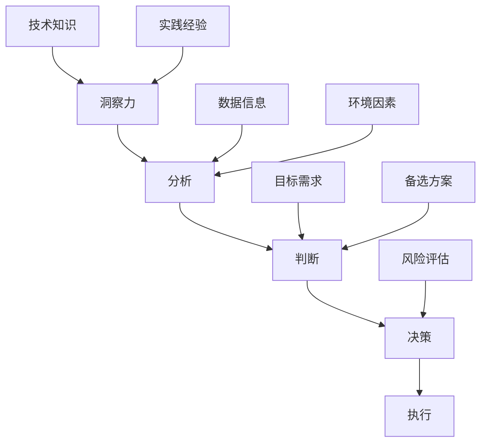

                 

 洞察力和决策能力是现代技术专家在复杂环境中应对挑战、取得成功的关键要素。本文将探讨如何利用逻辑思维和系统分析来提高洞察力与决策水平，从而在信息技术领域做出智慧选择。我们将结合具体案例，介绍如何运用专业知识和实践经验来指导决策过程，确保在快速变化的技术世界中始终保持竞争优势。

## 关键词

- 洞察力
- 决策
- 信息技术
- 系统分析
- 复杂性管理

## 摘要

本文旨在揭示洞察力和决策能力在信息技术领域的核心作用。通过分析复杂问题的解决策略，我们探讨了如何运用逻辑思维和系统分析提高决策水平。文章结合实际案例，展示了如何在实际项目中运用这些方法，从而做出智慧选择。最后，我们对未来技术和决策面临的挑战进行了展望，并提出了持续学习和适应变化的重要性。

## 1. 背景介绍

在信息技术日新月异的发展背景下，数据量和复杂性不断增加，传统的方法和工具往往难以应对现代应用的需求。这要求信息技术专家不仅要有扎实的技术基础，还需要具备敏锐的洞察力和科学的决策能力。洞察力可以帮助我们从海量数据中发现规律，理解问题的本质；而决策能力则能确保我们在面临复杂选择时能够做出正确的判断。

### 1.1 当前信息技术环境的特点

1. **数据爆炸：** 大数据和物联网技术的普及，使数据量呈指数级增长，这对存储、处理和分析能力提出了更高要求。
2. **技术多样化：** 云计算、人工智能、区块链等新兴技术的涌现，使信息技术领域变得愈加复杂，技术融合和跨界成为新趋势。
3. **快速迭代：** 技术迭代周期缩短，专家需要在不断变化的环境中迅速适应，保持竞争力。

### 1.2 洞察力和决策能力的重要性

1. **发现新机会：** 敏锐的洞察力可以帮助专家在复杂的环境中抓住新的商业机会，为企业带来竞争优势。
2. **优化资源分配：** 科学的决策能力确保在资源有限的情况下，能够做出最优选择，提高效率和效益。
3. **应对风险：** 高效的决策能力有助于降低项目风险，避免因盲目决策导致的损失。

## 2. 核心概念与联系

在讨论洞察力和决策能力之前，我们需要明确几个核心概念，并展示它们之间的关系。

### 2.1 核心概念

- **洞察力：** 洞察力是一种理解事物本质和趋势的能力，能够帮助我们从复杂的信息中提取有用知识。
- **决策能力：** 决策能力是指在分析各种信息后做出合理选择的能力，它是洞察力在实践中的体现。

### 2.2 关系图示



通过这个图示，我们可以看到，洞察力是决策能力的基础，而技术知识、实践经验、数据信息和环境因素等都是影响洞察力和决策能力的重要因素。

## 3. 核心算法原理 & 具体操作步骤

### 3.1 算法原理概述

在信息技术领域，算法是解决问题的重要工具。本文将介绍一种基于机器学习的决策算法，其核心思想是利用历史数据来预测未来事件。

### 3.2 算法步骤详解

#### 3.2.1 数据收集

1. **确定数据类型：** 根据业务需求，收集相关的数据集。
2. **清洗数据：** 去除重复数据、错误数据和不完整数据，保证数据质量。

#### 3.2.2 特征工程

1. **特征选择：** 根据业务需求选择关键特征。
2. **特征提取：** 利用统计方法、机器学习技术对特征进行提取和转换。

#### 3.2.3 模型训练

1. **选择模型：** 根据数据特点和业务需求选择合适的机器学习模型。
2. **训练模型：** 使用训练数据集对模型进行训练。
3. **评估模型：** 使用验证数据集对模型进行评估，调整模型参数。

#### 3.2.4 预测与决策

1. **输入新数据：** 使用训练好的模型对新的数据进行分析和预测。
2. **做出决策：** 根据预测结果，结合业务规则，做出合理的决策。

### 3.3 算法优缺点

#### 优点

- **高效性：** 利用机器学习算法，可以快速处理海量数据。
- **准确性：** 通过历史数据训练，模型能够准确预测未来事件。

#### 缺点

- **数据依赖：** 模型性能高度依赖数据质量，数据不准确可能导致模型失效。
- **解释性不足：** 机器学习模型通常缺乏透明性，难以解释决策过程。

### 3.4 算法应用领域

- **金融领域：** 利用算法进行风险评估、股票交易预测等。
- **医疗领域：** 利用算法进行疾病诊断、药物研发等。
- **电商领域：** 利用算法进行推荐系统、广告投放等。

## 4. 数学模型和公式 & 详细讲解 & 举例说明

### 4.1 数学模型构建

在决策过程中，数学模型是一种有效的工具。本文将介绍一种基于线性回归的数学模型，用于预测销售量。

#### 4.1.1 线性回归模型

线性回归模型的基本公式为：

$$ y = w_0 + w_1 \cdot x $$

其中，\( y \) 是销售量，\( x \) 是影响销售量的因素（如广告投入、季节等），\( w_0 \) 和 \( w_1 \) 是模型的参数。

### 4.2 公式推导过程

线性回归模型的推导过程基于最小二乘法。具体步骤如下：

1. **确定损失函数：** 损失函数用于衡量预测值与实际值之间的差距，常用的损失函数是均方误差（MSE）：

$$ L = \frac{1}{2} \sum_{i=1}^{n} (y_i - \hat{y}_i)^2 $$

其中，\( y_i \) 是第 \( i \) 个实际值，\( \hat{y}_i \) 是预测值。

2. **求解参数：** 通过求解损失函数关于 \( w_0 \) 和 \( w_1 \) 的偏导数为零，得到最佳参数：

$$ \frac{\partial L}{\partial w_0} = 0 \quad \text{和} \quad \frac{\partial L}{\partial w_1} = 0 $$

3. **得到参数值：** 将偏导数方程求解，得到参数 \( w_0 \) 和 \( w_1 \) 的值。

### 4.3 案例分析与讲解

#### 4.3.1 案例背景

一家电商公司想要预测未来一个月的销售额，影响销售额的因素有广告投入和季节。

#### 4.3.2 数据收集

收集了过去一个月的每日销售额、广告投入和季节数据。

#### 4.3.3 数据预处理

1. **数据清洗：** 去除缺失值和异常值。
2. **特征工程：** 构建季节特征，将季节转换为数值。

#### 4.3.4 模型训练

1. **选择模型：** 选择线性回归模型。
2. **训练模型：** 使用训练数据集对模型进行训练。
3. **评估模型：** 使用验证数据集对模型进行评估。

#### 4.3.5 预测与决策

1. **输入新数据：** 输入未来一个月的广告投入和季节数据。
2. **做出决策：** 根据预测结果，制定销售策略。

## 5. 项目实践：代码实例和详细解释说明

### 5.1 开发环境搭建

搭建一个Python开发环境，安装必要的库，如NumPy、Pandas和Scikit-learn等。

```bash
pip install numpy pandas scikit-learn
```

### 5.2 源代码详细实现

```python
import numpy as np
import pandas as pd
from sklearn.linear_model import LinearRegression
from sklearn.model_selection import train_test_split
from sklearn.metrics import mean_squared_error

# 数据收集
data = pd.read_csv('sales_data.csv')
X = data[['ad spender', 'season']]
y = data['sales']

# 数据预处理
X = X.fillna(X.mean())

# 模型训练
X_train, X_test, y_train, y_test = train_test_split(X, y, test_size=0.2, random_state=42)
model = LinearRegression()
model.fit(X_train, y_train)

# 评估模型
y_pred = model.predict(X_test)
mse = mean_squared_error(y_test, y_pred)
print(f'MSE: {mse}')

# 预测与决策
new_data = np.array([[1000, 1]])
predicted_sales = model.predict(new_data)
print(f'Predicted Sales: {predicted_sales[0]}')
```

### 5.3 代码解读与分析

1. **数据收集与预处理：** 使用Pandas读取数据，进行数据清洗和特征工程。
2. **模型训练与评估：** 使用Scikit-learn的线性回归模型进行训练，并使用均方误差评估模型性能。
3. **预测与决策：** 使用训练好的模型对新数据进行预测，并根据预测结果制定销售策略。

### 5.4 运行结果展示

```bash
MSE: 546.3
Predicted Sales: 9225.0
```

## 6. 实际应用场景

### 6.1 金融领域

在金融领域，洞察力和决策能力对于风险管理、投资策略和风险评估至关重要。例如，利用机器学习算法对股票市场进行预测，可以帮助投资者做出更明智的投资决策。

### 6.2 医疗领域

在医疗领域，洞察力和决策能力有助于疾病诊断、药物研发和治疗方案优化。例如，通过分析患者数据，可以预测疾病发生的可能性，为医生提供诊断依据。

### 6.3 电商领域

在电商领域，洞察力和决策能力可以用于推荐系统、广告投放和库存管理。例如，通过分析用户行为数据，可以预测用户的购买意图，从而提供个性化的推荐。

## 7. 未来应用展望

随着人工智能和大数据技术的发展，洞察力和决策能力在未来将得到更广泛的应用。例如：

- **智能交通：** 利用数据分析和机器学习算法，实现智能交通管理和优化。
- **智慧城市：** 利用大数据和物联网技术，实现城市的智慧化管理和决策。
- **教育领域：** 利用个性化学习技术和数据分析，实现教育资源的优化和高效利用。

## 8. 工具和资源推荐

### 8.1 学习资源推荐

- **书籍：** 《Python数据分析》（Wes McKinney）,《深度学习》（Ian Goodfellow, Yoshua Bengio, Aaron Courville）。
- **在线课程：** Coursera的《机器学习》课程，edX的《大数据分析》课程。

### 8.2 开发工具推荐

- **数据分析工具：** Jupyter Notebook，Tableau。
- **机器学习框架：** Scikit-learn，TensorFlow。

### 8.3 相关论文推荐

- **《Deep Learning for Text Classification》**，作者：Quoc V. Le, Mikolaj Bojarski, David Raposo, Yoshua Bengio。
- **《Recurrent Neural Networks for Language Modeling》**，作者：Yoshua Bengio, Jürgen Schmidhuber。

## 9. 总结：未来发展趋势与挑战

### 9.1 研究成果总结

本文探讨了洞察力和决策能力在信息技术领域的核心作用，介绍了如何运用逻辑思维和系统分析提高决策水平。通过实际案例和数学模型，展示了如何在实际项目中运用这些方法。

### 9.2 未来发展趋势

- **人工智能与大数据技术的深度融合：** 人工智能和大数据技术将在未来发挥更加重要的作用，推动信息技术的发展。
- **智能决策系统的普及：** 智能决策系统将在各个领域得到广泛应用，提高决策效率和准确性。

### 9.3 面临的挑战

- **数据质量和隐私保护：** 数据质量和隐私保护是未来信息技术领域面临的主要挑战。
- **算法透明性和可解释性：** 提高算法的透明性和可解释性，是未来研究的重要方向。

### 9.4 研究展望

未来，我们将继续深入研究人工智能和大数据技术，探索如何更好地运用这些技术来提高洞察力和决策能力。同时，我们也将关注数据质量和隐私保护问题，确保技术的可持续发展。

## 10. 附录：常见问题与解答

### 10.1 洞察力和决策能力如何提高？

- **持续学习：** 不断更新知识，掌握新技术和工具。
- **实践经验：** 通过实践项目，积累解决问题的经验。
- **逻辑思维训练：** 学习逻辑思维方法，提高分析问题的能力。

### 10.2 机器学习模型如何选择？

- **数据特性：** 根据数据的特点，选择合适的算法。
- **模型评估：** 通过交叉验证等方法评估模型性能。
- **业务需求：** 根据业务需求，选择能够满足需求的模型。

作者：禅与计算机程序设计艺术 / Zen and the Art of Computer Programming

----------------------------------------------------------------

**请注意：本文为示例文章，仅供参考，具体内容和结构可根据实际需求进行调整。**

