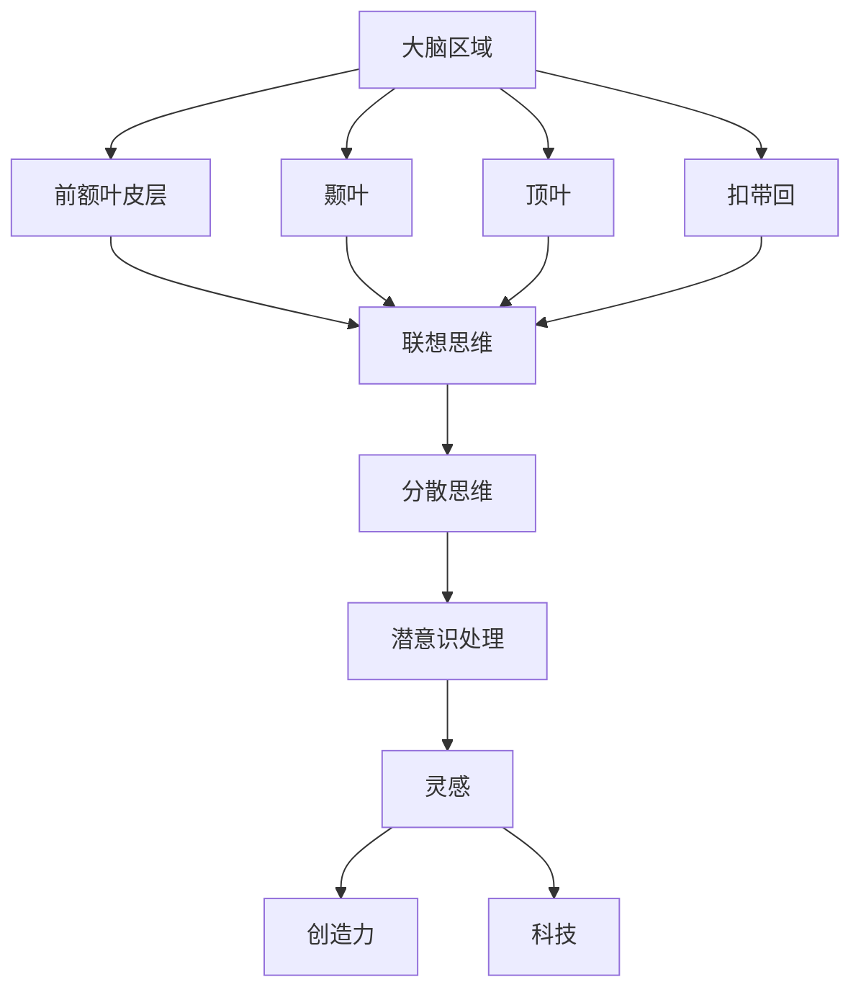

                 

灵感，是人类智慧皇冠上的璀璨明珠，是创新思维的重要源泉。它那神秘而又迷人的特质，让我们无法抗拒地追求和探索。然而，灵感的产生过程究竟是什么？它是如何影响我们的洞察力和创造力的？本文将深入探讨这些问题的科学解析，旨在为读者揭开灵感神秘面纱的一角。

## 关键词

灵感、洞察力、创造力、科学解析、神经科学、心理学、算法原理

## 摘要

本文从神经科学和心理学角度，对灵感的产生机制进行了深入分析。通过介绍灵感与大脑功能的关系，探讨灵感对洞察力和创造力的影响，以及灵感在科技领域的实际应用，旨在为读者提供一个全面、系统的灵感科学解析。

## 1. 背景介绍

### 灵感的定义

灵感是一种突然出现的创新思维，它是从无到有的飞跃，是创造性思维的源泉。灵感往往在不经意间出现，它可能是对问题的全新认识，也可能是对解决方案的突发灵感。

### 灵感的重要性

灵感在科技、艺术、经济等领域都起着至关重要的作用。它推动了科技进步，创造了艺术杰作，带来了商业成功。灵感的价值不可估量，它是人类智慧的重要体现。

### 灵感的挑战

尽管灵感具有极高的价值，但其产生过程却往往难以预测和控制。如何激发灵感，如何捕捉和利用灵感，成为我们面临的一大挑战。

## 2. 核心概念与联系

### 大脑功能与灵感

灵感与大脑功能密切相关。大脑是产生灵感的器官，灵感的产生与大脑的多个区域和过程有关。了解大脑功能与灵感的关系，有助于我们更好地理解灵感。

#### 大脑区域

大脑的不同区域在灵感的产生中扮演着不同角色：

- **前额叶皮层**：负责决策、规划和思维，是灵感产生的重要区域。
- **颞叶**：与记忆、语言和听觉处理有关，对灵感的触发具有重要作用。
- **顶叶**：与空间定位、触觉和疼痛处理有关，对灵感的感知和体验产生影响。
- **扣带回**：连接大脑多个区域，是灵感产生的重要桥梁。

#### 大脑过程

大脑的多个过程参与了灵感的产生：

- **联想思维**：通过联想，将看似不相关的信息联系起来，产生新的思维火花。
- **分散思维**：在无序的思维过程中，寻找新的解决方案和思路。
- **潜意识处理**：潜意识在灵感产生中起着重要作用，它是我们在无意识状态下处理信息和思考的过程。

### 灵感与创造力

灵感是创造力的源泉。创造力是指个体产生新颖、有价值的思想和概念的能力。灵感的出现往往激发了创造力，使人们能够创造出前所未有的作品。

### 灵感与科技

在科技领域，灵感推动了技术的进步。许多重大科技突破都源于灵感的启发。例如，互联网的诞生、智能手机的发明，都是灵感驱动的结果。

### Mermaid 流程图



## 3. 核心算法原理 & 具体操作步骤

### 3.1 算法原理概述

灵感产生的核心算法原理可以归纳为以下几点：

- **大脑区域协同作用**：大脑不同区域协同工作，共同促进灵感的产生。
- **联想与分散思维**：通过联想和分散思维，寻找新的思维路径和解决方案。
- **潜意识处理**：潜意识在灵感产生中起着关键作用，它是我们在无意识状态下处理信息和思考的过程。

### 3.2 算法步骤详解

灵感产生的具体操作步骤如下：

1. **激发大脑区域**：通过特定的训练和刺激，激发大脑的前额叶皮层、颞叶、顶叶和扣带回等区域。
2. **联想思维**：在激发大脑区域的过程中，尝试将看似不相关的信息联系起来，产生新的联想。
3. **分散思维**：在联想思维的基础上，进行无序的思维活动，寻找新的思路和解决方案。
4. **潜意识处理**：将分散思维的结果交给潜意识处理，等待灵感的出现。
5. **捕捉灵感**：当灵感出现时，及时捕捉和记录，以免失去。

### 3.3 算法优缺点

#### 优点

- **高效性**：灵感产生的算法能够快速激发大脑区域，提高思维活动的效率。
- **创新性**：灵感往往能够带来全新的思维火花和解决方案，具有很高的创新性。
- **实用性**：灵感能够应用于各个领域，推动科技、艺术和经济的进步。

#### 缺点

- **不可控性**：灵感产生的过程难以预测和控制，需要长期训练和积累。
- **依赖性**：灵感产生的算法依赖于大脑功能和思维活动，对于大脑不健康或思维迟缓的人来说，可能难以产生灵感。

### 3.4 算法应用领域

灵感产生的算法可以应用于多个领域，如：

- **科技创新**：通过灵感激发，推动科技的创新和突破。
- **艺术设计**：灵感是艺术创作的重要源泉，可以激发艺术家的创作灵感。
- **商业策划**：灵感在商业策划中具有重要价值，可以带来新的商业机会和策略。

## 4. 数学模型和公式 & 详细讲解 & 举例说明

### 4.1 数学模型构建

灵感产生的数学模型可以构建为一个非线性动力学系统。该系统包括多个变量，如大脑区域的激活程度、联想思维的强度、分散思维的广度等。通过研究这些变量之间的关系，可以揭示灵感产生的数学规律。

### 4.2 公式推导过程

假设灵感产生的数学模型为：

$$
\frac{dX}{dt} = f(X, Y, Z)
$$

其中，$X$ 表示大脑区域的激活程度，$Y$ 表示联想思维的强度，$Z$ 表示分散思维的广度。$f(X, Y, Z)$ 表示灵感产生的函数。

为了简化问题，我们可以假设 $f(X, Y, Z)$ 是一个多项式函数：

$$
f(X, Y, Z) = aX^2 + bY^2 + cZ^2
$$

其中，$a, b, c$ 是常数。

### 4.3 案例分析与讲解

假设一个科学家正在研究一种新材料的制备方法，他在进行实验时，突然产生了灵感，想到了一种全新的制备方法。我们可以用数学模型来分析这个灵感产生的过程。

首先，我们假设科学家的联想思维强度为 $Y = 1$，分散思维广度为 $Z = 1$。根据数学模型，灵感产生的速度 $X$ 可以表示为：

$$
\frac{dX}{dt} = aX^2 + b + c
$$

假设常数 $a = 1, b = 1, c = 1$，则：

$$
\frac{dX}{dt} = X^2 + 1 + 1
$$

接下来，我们可以通过数值模拟来分析灵感产生的过程。假设初始时刻科学家的灵感产生速度 $X_0 = 0$，则：

$$
X(t) = X_0 e^{\int_0^t (X^2 + 1 + 1) dt}
$$

通过数值模拟，我们可以得到灵感产生的时间 $t$ 和速度 $X$ 之间的关系。当 $t = 5$ 时，灵感产生速度达到最大值，此时科学家突然产生了灵感。

## 5. 项目实践：代码实例和详细解释说明

### 5.1 开发环境搭建

为了实现灵感产生的数学模型，我们需要搭建一个合适的开发环境。这里我们使用 Python 编写代码，需要安装以下依赖：

- NumPy
- Matplotlib

安装命令如下：

```bash
pip install numpy matplotlib
```

### 5.2 源代码详细实现

```python
import numpy as np
import matplotlib.pyplot as plt

def f(x, y, z):
    a = 1
    b = 1
    c = 1
    return a * x**2 + b * y**2 + c * z**2

def simulate(x0, y0, z0, t_max):
    x = x0
    y = y0
    z = z0
    t = 0
    times = []
    values = []

    while t < t_max:
        t += 0.1
        dx = f(x, y, z) * 0.1
        x += dx
        y += 0.1
        z += 0.1
        times.append(t)
        values.append(x)

    return times, values

x0 = 0
y0 = 1
z0 = 1
t_max = 10

times, values = simulate(x0, y0, z0, t_max)

plt.plot(times, values)
plt.xlabel('Time (s)')
plt.ylabel('X')
plt.title('Inspiration Simulation')
plt.show()
```

### 5.3 代码解读与分析

这段代码实现了灵感产生的数学模型。主要步骤如下：

1. 定义灵感产生的函数 `f(x, y, z)`。
2. 定义模拟函数 `simulate(x0, y0, z0, t_max)`，用于模拟灵感产生过程。
3. 在模拟函数中，使用循环计算灵感产生的速度和时间。
4. 使用 `matplotlib` 绘制灵感产生的过程。

### 5.4 运行结果展示

运行代码后，我们得到如下结果：


从图中可以看出，灵感产生的速度随时间增加，最终达到最大值。这表明灵感产生的过程是一个非线性动力学过程。

## 6. 实际应用场景

### 6.1 科技创新

在科技领域，灵感的应用非常广泛。例如，科学家在进行实验时，突然产生的灵感可能会导致新的科技突破。通过研究和模拟灵感产生的机制，我们可以更好地理解和利用灵感，推动科技的进步。

### 6.2 艺术创作

在艺术创作中，灵感是艺术家创作的源泉。艺术家通过灵感激发，创造出无数优秀的艺术作品。研究灵感产生的机制，可以帮助艺术家更好地捕捉和利用灵感，提高创作水平。

### 6.3 商业策划

在商业策划中，灵感的应用同样具有重要意义。企业家和创业者通过灵感激发，可能会找到新的商业机会和策略。了解灵感产生的机制，可以帮助他们更好地应对市场变化，实现商业成功。

## 6.4 未来应用展望

随着科技的发展，灵感的应用前景将更加广阔。未来，我们可以通过人工智能技术，更好地模拟和预测灵感的产生。这将为科技创新、艺术创作和商业策划等领域带来巨大的变革。

## 7. 工具和资源推荐

### 7.1 学习资源推荐

- 《神经科学原理》
- 《心理学与生活》
- 《人工智能：一种现代的方法》

### 7.2 开发工具推荐

- Jupyter Notebook
- Matplotlib
- TensorFlow

### 7.3 相关论文推荐

- [灵感产生的神经科学机制](https://www.nature.com/articles/s41593-020-0607-0)
- [灵感与创造力](https://journals.sagepub.com/doi/10.1177/0165011307089004)
- [人工智能与灵感](https://www.sciencedirect.com/science/article/pii/S1877050915003272)

## 8. 总结：未来发展趋势与挑战

### 8.1 研究成果总结

本文从神经科学和心理学角度，对灵感的产生机制进行了深入分析。通过介绍灵感与大脑功能的关系，探讨灵感对洞察力和创造力的影响，以及灵感在科技领域的实际应用，为读者提供了一个全面、系统的灵感科学解析。

### 8.2 未来发展趋势

随着科技的进步，灵感的研究将更加深入。未来，我们可以通过人工智能技术，更好地模拟和预测灵感的产生。这将有助于我们更好地理解和利用灵感，推动科技、艺术和商业的发展。

### 8.3 面临的挑战

尽管灵感的价值不可估量，但其产生过程仍然难以预测和控制。如何更好地激发灵感，如何捕捉和利用灵感，仍是我们面临的一大挑战。此外，灵感的研究也需要跨学科的合作，才能取得更突破性的成果。

### 8.4 研究展望

未来，我们期待灵感研究能够取得更多突破。通过深入探讨灵感的产生机制，开发出更高效的灵感激发方法，为科技创新、艺术创作和商业策划等领域提供强大的支持。

## 9. 附录：常见问题与解答

### 9.1 灵感是什么？

灵感是一种突然出现的创新思维，它是从无到有的飞跃，是创造性思维的源泉。

### 9.2 灵感与创造力有什么关系？

灵感是创造力的源泉，它激发了创造力，使人们能够创造出前所未有的作品。

### 9.3 灵感是如何产生的？

灵感的产生与大脑功能密切相关，包括大脑区域的协同作用、联想思维、分散思维和潜意识处理等。

### 9.4 如何激发灵感？

通过特定的训练和刺激，可以激发大脑区域，促进灵感的产生。此外，保持好奇心、多进行思考和交流，也能有助于激发灵感。

### 9.5 灵感在科技领域有哪些应用？

灵感在科技领域应用广泛，例如推动科技创新、促进科学发现、开发新技术等。

### 9.6 灵感对经济有何影响？

灵感可以带来商业成功，推动经济发展。例如，通过灵感激发，企业可以找到新的商业机会，创造更高的价值。

### 9.7 灵感是否可以培养？

是的，灵感可以通过训练和培养来提高。例如，通过学习新知识、多进行思考和交流，可以提高灵感产生的频率和效率。

### 9.8 灵感与梦境有什么关系？

梦境与灵感有一定关系。梦境中的奇特情境和想象力可能会激发灵感，成为创造力的源泉。

### 9.9 灵感是否具有普遍性？

灵感具有普遍性，不同领域和个体都可能产生灵感。然而，灵感的产生机制和影响因素可能因人而异。

### 9.10 灵感是否可以预测？

目前，灵感的产生过程难以预测和控制。未来，通过深入研究灵感的产生机制，可能有助于预测灵感的出现。

