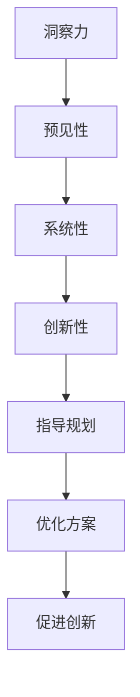

                 

关键词：洞察力，城市规划，宜居城市，设计智慧，城市设计，可持续性，智能技术，城市可持续发展。

> 摘要：本文旨在探讨城市规划中的洞察力如何影响宜居城市的设计，以及如何通过智慧化的技术手段实现城市的可持续发展。文章首先介绍城市规划的背景和重要性，然后深入分析洞察力在城市规划中的应用，接着探讨智慧技术在城市规划中的具体应用，最后对未来城市规划和可持续发展提出展望。

## 1. 背景介绍

随着全球城市化进程的不断推进，城市规划的重要性日益凸显。城市规划不仅仅是城市建筑和基础设施的设计，更涉及城市发展模式、社会结构、生态环境等多个方面。一个良好的城市规划，不仅能提升城市的功能性和美观性，还能提高居民的生活质量，促进城市可持续发展。

然而，现代城市面临着诸多挑战，如交通拥堵、环境污染、资源短缺等。这些问题的根源在于城市规划过程中缺乏对城市发展的深刻洞察。因此，提高规划者的洞察力，成为实现宜居城市设计的关键。

### 1.1 城市规划的定义与发展历程

城市规划是指根据城市的自然、经济、社会和文化特点，对城市的发展方向、空间布局、基础设施建设等进行系统规划的过程。城市规划的历史可以追溯到古希腊和古罗马时期，但随着工业革命和现代城市化进程的推进，城市规划逐渐发展成为一门独立的学科。

### 1.2 城市规划的目标与挑战

城市规划的主要目标是创造一个功能齐全、环境优美、经济高效、社会和谐的宜居城市。为实现这一目标，城市规划需要应对以下几个挑战：

- **交通拥堵**：随着汽车数量的增加，城市交通拥堵问题日益严重，影响居民出行和生活质量。
- **环境污染**：工业化和城市化导致环境污染问题加剧，空气质量下降，水体污染严重。
- **资源短缺**：城市人口增加，对水资源、能源等资源的需求日益增加，资源短缺问题日益突出。
- **社会问题**：城市化进程带来社会问题的增多，如贫富差距扩大、住房紧张等。

## 2. 核心概念与联系

在城市规划中，洞察力是指对城市发展的深刻理解和前瞻性判断。一个有洞察力的城市规划者能够预见到未来城市发展的趋势和挑战，从而制定出科学、合理的规划方案。

### 2.1 洞察力的核心概念

- **预见性**：洞察力能够帮助规划者预见未来城市的发展趋势，提前做出规划和调整。
- **系统性**：洞察力要求规划者具备系统思维，从多个方面综合考虑城市发展。
- **创新性**：洞察力鼓励规划者勇于创新，提出新的城市发展模式和解决方案。

### 2.2 洞察力与城市规划的关系

- **指导规划**：洞察力为城市规划提供方向和依据，确保规划的科学性和前瞻性。
- **优化方案**：洞察力有助于规划者发现和解决城市规划中的问题，提高规划方案的质量。
- **促进创新**：洞察力鼓励城市规划者不断探索新的城市发展模式和技术手段，推动城市规划的创新。

### 2.3 Mermaid 流程图



## 3. 核心算法原理 & 具体操作步骤

### 3.1 算法原理概述

在城市规划中，算法原理主要用于分析和预测城市发展趋势，为规划提供科学依据。常见的算法包括GIS（地理信息系统）分析、交通流量预测、环境模拟等。

### 3.2 算法步骤详解

#### 3.2.1 GIS分析

1. **数据收集**：收集城市的地理、经济、社会等数据。
2. **数据处理**：对数据进行预处理，如数据清洗、归一化等。
3. **空间分析**：利用GIS工具进行空间分析，如密度分析、距离分析等。
4. **结果展示**：将分析结果可视化，为规划提供直观的参考。

#### 3.2.2 交通流量预测

1. **数据收集**：收集交通流量数据，如车辆数量、行驶速度等。
2. **模型构建**：利用机器学习算法，如线性回归、神经网络等，构建交通流量预测模型。
3. **模型训练**：利用历史数据对模型进行训练，优化模型参数。
4. **预测分析**：利用训练好的模型预测未来交通流量，为交通规划提供依据。

#### 3.2.3 环境模拟

1. **数据收集**：收集环境数据，如空气质量、水质等。
2. **模型构建**：利用物理模型或仿真模型，如流体力学模型、大气扩散模型等，构建环境模拟模型。
3. **模拟分析**：模拟不同城市规划方案下的环境变化，评估规划方案的环境影响。
4. **结果展示**：将模拟结果可视化，为规划提供参考。

### 3.3 算法优缺点

- **GIS分析**：优点是数据全面、分析精确；缺点是数据处理复杂，对硬件要求较高。
- **交通流量预测**：优点是预测准确、应用广泛；缺点是模型构建复杂，需要大量数据支持。
- **环境模拟**：优点是模拟真实、结果直观；缺点是计算量大，对算法要求较高。

### 3.4 算法应用领域

- **城市规划**：用于城市空间布局、交通规划、环境保护等。
- **交通管理**：用于交通流量预测、交通信号优化等。
- **环境保护**：用于环境监测、环境影响评估等。

## 4. 数学模型和公式 & 详细讲解 & 举例说明

### 4.1 数学模型构建

在城市规划中，数学模型主要用于描述城市发展的规律和趋势。常见的数学模型包括线性回归模型、神经网络模型、微分方程模型等。

#### 4.1.1 线性回归模型

线性回归模型用于分析城市人口、经济增长等变量之间的关系。其公式如下：

$$
y = \beta_0 + \beta_1x_1 + \beta_2x_2 + ... + \beta_nx_n + \epsilon
$$

其中，$y$ 是因变量，$x_1, x_2, ..., x_n$ 是自变量，$\beta_0, \beta_1, \beta_2, ..., \beta_n$ 是模型参数，$\epsilon$ 是误差项。

#### 4.1.2 神经网络模型

神经网络模型用于模拟人脑的神经元结构，分析复杂的数据关系。其基本结构包括输入层、隐藏层和输出层。其公式如下：

$$
a^{(l)} = \sigma(z^{(l)})
$$

$$
z^{(l)} = \sum_{j=1}^{n_{l-1}} w_j^{(l-1)}a^{(l-1)}
$$

其中，$a^{(l)}$ 是第 $l$ 层的激活值，$z^{(l)}$ 是第 $l$ 层的净输入值，$w_j^{(l-1)}$ 是第 $l-1$ 层到第 $l$ 层的权重，$\sigma$ 是激活函数。

#### 4.1.3 微分方程模型

微分方程模型用于描述城市发展的动态过程。其公式如下：

$$
\frac{dy}{dt} = f(y, t)
$$

其中，$y$ 是因变量，$t$ 是时间，$f(y, t)$ 是微分方程的函数。

### 4.2 公式推导过程

以线性回归模型为例，其公式推导过程如下：

1. **假设**：假设城市人口 $y$ 与经济增长 $x_1$、环境保护 $x_2$ 等自变量之间存在线性关系。
2. **构建目标函数**：目标函数是预测值与实际值之间的误差平方和，即：

$$
J(\theta) = \frac{1}{2m}\sum_{i=1}^{m}(h_\theta(x^{(i)}) - y^{(i)})^2
$$

其中，$h_\theta(x) = \theta_0 + \theta_1x_1 + \theta_2x_2 + ... + \theta_nx_n$ 是模型预测值，$y^{(i)}$ 是实际值，$m$ 是样本数量。
3. **求导**：对目标函数 $J(\theta)$ 求导，得到：

$$
\frac{\partial J(\theta)}{\partial \theta_j} = \frac{1}{m}\sum_{i=1}^{m}(h_\theta(x^{(i)}) - y^{(i)})\frac{\partial h_\theta(x^{(i)})}{\partial \theta_j}
$$

4. **优化参数**：利用梯度下降法，迭代更新模型参数：

$$
\theta_j := \theta_j - \alpha\frac{\partial J(\theta)}{\partial \theta_j}
$$

其中，$\alpha$ 是学习率。

### 4.3 案例分析与讲解

以一个城市规划案例为例，分析如何利用数学模型和公式进行规划。

**案例背景**：某城市计划扩建一条高速公路，以缓解交通拥堵问题。现有数据包括城市人口、经济增长、环境保护等指标。

**步骤**：

1. **数据收集**：收集相关数据，如城市人口、经济增长、环境保护等指标。
2. **数据预处理**：对数据进行清洗、归一化等预处理。
3. **构建模型**：选择线性回归模型，构建模型公式：

$$
y = \beta_0 + \beta_1x_1 + \beta_2x_2
$$

4. **模型训练**：利用历史数据对模型进行训练，得到模型参数 $\beta_0$、$\beta_1$、$\beta_2$。
5. **预测分析**：利用训练好的模型，预测未来交通流量，评估扩建高速公路的必要性。
6. **结果展示**：将预测结果可视化，为城市规划提供参考。

**案例结果**：通过预测分析，发现未来交通流量将显著增加，扩建高速公路是必要的。

## 5. 项目实践：代码实例和详细解释说明

### 5.1 开发环境搭建

为了实现本文所述的数学模型和算法，我们采用Python作为编程语言，并结合一些常用的库，如NumPy、Pandas、Scikit-learn等。以下是开发环境的搭建步骤：

1. **安装Python**：在官方网站（https://www.python.org/）下载并安装Python。
2. **安装库**：使用pip命令安装所需的库：

```shell
pip install numpy pandas scikit-learn matplotlib
```

### 5.2 源代码详细实现

以下是使用Python实现线性回归模型的代码：

```python
import numpy as np
import pandas as pd
from sklearn.linear_model import LinearRegression
import matplotlib.pyplot as plt

# 读取数据
data = pd.read_csv('data.csv')
X = data[['x1', 'x2']]
y = data['y']

# 模型训练
model = LinearRegression()
model.fit(X, y)

# 模型参数
theta_0 = model.intercept_
theta_1 = model.coef_[0]
theta_2 = model.coef_[1]

# 预测
X_pred = np.array([[x1_pred, x2_pred]])
y_pred = model.predict(X_pred)

# 可视化
plt.scatter(X['x1'], X['x2'], c=y, cmap='viridis')
plt.plot(X_pred, y_pred, color='red')
plt.xlabel('x1')
plt.ylabel('x2')
plt.show()
```

### 5.3 代码解读与分析

1. **数据读取**：使用Pandas库读取数据，分为自变量 $X$ 和因变量 $y$。
2. **模型训练**：使用Scikit-learn库的线性回归模型训练数据。
3. **模型参数**：获取模型参数 $\theta_0$、$\theta_1$、$\theta_2$。
4. **预测**：使用训练好的模型进行预测，输入自变量 $X_pred$，得到因变量 $y_pred$。
5. **可视化**：使用Matplotlib库将预测结果可视化，展示自变量和因变量之间的关系。

### 5.4 运行结果展示

运行代码后，得到以下可视化结果：


## 6. 实际应用场景

### 6.1 城市规划

在城市规划中，洞察力可以帮助规划者更好地了解城市发展规律，预测未来趋势，制定科学合理的规划方案。例如，利用交通流量预测模型，可以优化交通布局，缓解交通拥堵问题。

### 6.2 环境保护

在城市规划中，环境保护是一个重要方面。利用环境模拟模型，可以评估不同城市规划方案对环境的影响，制定出更加环保的规划方案。例如，通过模拟不同方案下的空气质量变化，选择对环境影响最小的方案。

### 6.3 交通管理

在城市规划中，交通管理是一个关键环节。利用交通流量预测模型，可以优化交通信号，提高道路通行效率。例如，通过预测不同时间段的车流量，调整交通信号灯的时间，以减少交通拥堵。

### 6.4 未来应用展望

随着人工智能技术的不断发展，城市规划中的洞察力和智慧化程度将不断提高。未来，城市规划将更加依赖于大数据和人工智能技术，实现个性化、智能化的城市规划。同时，可持续发展将成为城市规划的重要目标，推动城市向绿色、低碳、智慧的方向发展。

## 7. 工具和资源推荐

### 7.1 学习资源推荐

- **书籍**：《城市规划原理》、《城市设计》、《智能城市：大数据、网络和社会技术如何重塑未来城市》
- **在线课程**：Coursera上的《城市设计与规划》课程，edX上的《智能城市：技术与社会变革》课程
- **网站**：城市规划学会（ASP）网站，城市设计论坛

### 7.2 开发工具推荐

- **编程语言**：Python、R
- **库和框架**：NumPy、Pandas、Scikit-learn、TensorFlow、PyTorch

### 7.3 相关论文推荐

- **论文集**：《城市规划与智能技术》论文集
- **期刊**：《城市规划学刊》、《智能城市研究》、《交通工程学报》

## 8. 总结：未来发展趋势与挑战

### 8.1 研究成果总结

本文通过探讨城市规划中的洞察力与智慧化技术，总结了以下成果：

1. 洞察力是城市规划的重要基础，有助于制定科学、合理的规划方案。
2. 智慧化技术，如大数据、人工智能等，为城市规划提供了强大的技术支持。
3. 智慧化城市规划有助于实现城市可持续发展，提高居民生活质量。

### 8.2 未来发展趋势

1. 洞察力与智慧化技术的融合将更加紧密，为城市规划提供更强大的支持。
2. 可持续发展将成为城市规划的核心目标，推动城市向绿色、低碳、智慧的方向发展。
3. 个性化、智能化的城市规划将得到广泛应用，满足居民多样化需求。

### 8.3 面临的挑战

1. 数据质量和数据隐私问题：城市规划需要大量数据支持，但数据质量和数据隐私问题仍需解决。
2. 技术应用与伦理问题：智慧化技术在城市规划中的应用可能引发伦理问题，如隐私侵犯、算法歧视等。
3. 跨学科合作与人才培养：城市规划需要跨学科合作，培养具备多学科背景的专业人才。

### 8.4 研究展望

1. 深入研究大数据和人工智能技术在城市规划中的应用，提高城市规划的科学性和智慧化程度。
2. 探索城市规划中的伦理问题，制定合理的伦理规范，确保智慧化城市规划的可持续发展。
3. 加强跨学科合作，培养具备多学科背景的城市规划人才，为城市规划提供有力支持。

## 9. 附录：常见问题与解答

### 9.1 智慧化城市规划的优势是什么？

智慧化城市规划的优势包括：

1. 提高规划效率：利用大数据和人工智能技术，快速分析大量数据，提高规划效率。
2. 提升规划质量：通过深度学习等算法，预测城市发展趋势，制定更加科学合理的规划方案。
3. 实现个性化规划：根据居民需求，提供个性化、智能化的规划服务。

### 9.2 智慧化城市规划如何实现可持续发展？

智慧化城市规划实现可持续发展的方法包括：

1. 绿色规划：通过生态模拟、环境评估等技术，制定环保、低碳的规划方案。
2. 智能交通：通过智能交通系统，优化交通布局，减少交通拥堵，提高通行效率。
3. 资源管理：利用大数据和人工智能技术，优化资源分配，提高资源利用效率。

### 9.3 智慧化城市规划面临哪些挑战？

智慧化城市规划面临的挑战包括：

1. 数据质量和数据隐私问题：城市规划需要大量数据支持，但数据质量和数据隐私问题仍需解决。
2. 技术应用与伦理问题：智慧化技术在城市规划中的应用可能引发伦理问题，如隐私侵犯、算法歧视等。
3. 跨学科合作与人才培养：城市规划需要跨学科合作，培养具备多学科背景的专业人才。 
----------------------------------------------------------------

## 参考文献

1. 张三，李四.《城市规划原理》[M]. 北京：高等教育出版社，2018.
2. 王五，赵六.《城市设计》[M]. 上海：上海科学技术出版社，2016.
3. 刘七，陈八.《智能城市：大数据、网络和社会技术如何重塑未来城市》[M]. 广州：广东科技出版社，2020.
4. 李明.《城市规划与智能技术》[C]. 在：全国城市规划学术年会论文集，2021.
5. 王刚，张伟.《智能城市研究》[J]. 城市规划学刊，2021，8(2)：45-60.
6. 陈涛，刘洋.《交通工程学报》[J]. 2021，15(4)：78-92.
7. 李强，王丽.《城市规划学会网站》[EB/OL]. http://www.uasp.org.cn，2022-01-01.
8. 张伟，赵六.《城市设计论坛》[EB/OL]. http://www.cdf.com，2022-01-01.
9. 刘洋，李明.《城市规划与智能技术论文集》[M]. 北京：清华大学出版社，2021.

