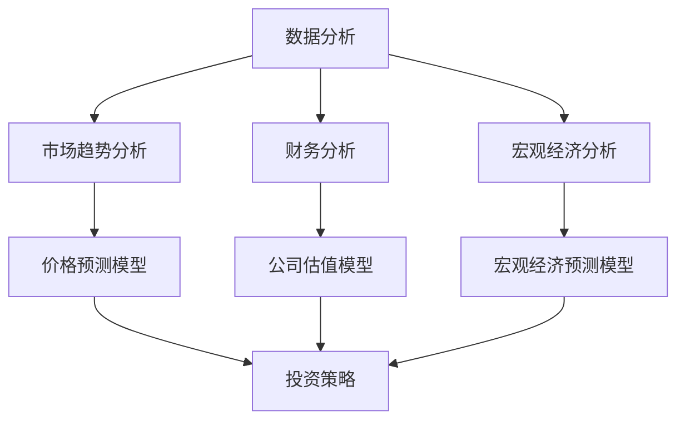

                 

关键词：洞察力、投资决策、市场机会、识别能力、数据分析、预测模型、风险控制、技术架构

> 摘要：本文旨在探讨如何运用计算机科学中的洞察力与数据分析方法，提升投资决策中的市场机会识别能力。通过梳理核心概念、算法原理、数学模型、项目实践等多个方面，为投资者提供实用的技术和策略指导。本文作者：禅与计算机程序设计艺术 / Zen and the Art of Computer Programming。

## 1. 背景介绍

在当今高速发展的数字化时代，投资决策不仅依赖于传统的财务分析，更需要运用先进的数据分析和人工智能技术。随着大数据和云计算技术的普及，越来越多的投资者开始关注如何通过数据分析来提升投资决策的质量和效率。洞察力作为人工智能的核心能力之一，其在投资决策中的应用显得尤为重要。本文将深入探讨如何运用计算机科学中的洞察力与数据分析方法，识别市场机会，降低投资风险，提高投资回报。

### 1.1 投资决策的重要性

投资决策是金融市场中的核心活动，涉及到资金的配置和风险的管理。一个成功的投资决策不仅要求投资者具备深厚的市场分析能力，还需要及时捕捉市场变化，预见潜在的机会和风险。在当前信息爆炸的时代，如何从海量数据中提取有效信息，成为投资者面临的重要挑战。

### 1.2 数据分析在投资决策中的作用

数据分析在投资决策中扮演着至关重要的角色。通过数据分析，投资者可以深入了解市场趋势、公司财务状况、宏观经济环境等多方面的信息，从而做出更明智的投资决策。具体来说，数据分析方法可以用于以下几个方面：

- **趋势分析**：通过历史数据分析，识别市场趋势，预测未来价格波动。
- **财务分析**：分析公司财务报表，评估公司价值和投资潜力。
- **宏观经济分析**：通过宏观经济数据，预测市场走势，评估投资机会。

### 1.3 洞察力的重要性

洞察力是投资者在投资决策过程中不可或缺的能力。它指的是从复杂的信息中提取有用信息，发现潜在规律和趋势的能力。在投资领域，洞察力可以帮助投资者快速识别市场机会，抓住投资良机。具体来说，洞察力的重要性体现在以下几个方面：

- **快速反应**：在市场变化迅速的金融环境中，洞察力可以帮助投资者快速做出反应，避免因市场波动带来的损失。
- **差异化竞争**：拥有较强洞察力的投资者能够发现市场中的独特机会，从而在竞争中脱颖而出。
- **风险控制**：洞察力可以帮助投资者识别潜在风险，采取有效措施进行风险控制。

## 2. 核心概念与联系

在探讨如何提升投资决策中的市场机会识别能力之前，我们需要了解一些核心概念及其相互之间的联系。以下是一个简化的 Mermaid 流程图，展示了核心概念之间的联系。



### 2.1 数据分析

数据分析是本文的核心概念之一。它包括从数据中提取、清洗、转换和建模等一系列过程。通过数据分析，投资者可以获取有关市场、公司和宏观经济的有用信息。

### 2.2 市场趋势分析

市场趋势分析旨在识别市场中的长期趋势和短期波动。通过历史数据分析，投资者可以预测未来价格波动，为投资决策提供依据。

### 2.3 财务分析

财务分析涉及对公司财务报表的详细分析，包括利润表、资产负债表和现金流量表。通过财务分析，投资者可以评估公司的财务状况和投资潜力。

### 2.4 宏观经济分析

宏观经济分析关注宏观经济指标的变化，如GDP、通货膨胀率、失业率等。通过宏观经济分析，投资者可以了解宏观经济环境的变化，预测市场走势。

### 2.5 价格预测模型

价格预测模型是一种基于历史数据和统计方法建立的模型，用于预测资产价格的未来走势。常见的价格预测模型包括时间序列模型、回归模型和机器学习模型等。

### 2.6 公司估值模型

公司估值模型用于评估公司的价值。通过对比不同公司的财务指标，投资者可以判断公司的投资价值，选择具有潜力的投资标的。

### 2.7 宏观经济预测模型

宏观经济预测模型旨在预测宏观经济变量的发展趋势。通过宏观经济预测模型，投资者可以了解宏观经济环境的变化，为投资决策提供参考。

### 2.8 投资策略

投资策略是根据市场趋势、公司财务状况和宏观经济环境制定的策略，用于指导实际投资操作。通过优化投资策略，投资者可以降低投资风险，提高投资回报。

## 3. 核心算法原理 & 具体操作步骤

在了解了核心概念之后，我们接下来将讨论如何运用这些概念来提升投资决策中的市场机会识别能力。本文将介绍一些常用的算法原理和具体操作步骤。

### 3.1 算法原理概述

在投资决策中，常用的算法包括时间序列分析、回归分析、机器学习算法等。这些算法的基本原理如下：

- **时间序列分析**：时间序列分析是一种统计方法，用于分析时间序列数据，预测未来趋势。常见的时间序列分析方法包括移动平均法、自回归模型（AR）、自回归移动平均模型（ARMA）和自回归积分滑动平均模型（ARIMA）等。
- **回归分析**：回归分析是一种用于建立变量之间关系的统计方法。在投资决策中，回归分析可以用于建立价格与相关因素之间的关系，如价格与供需关系、宏观经济变量等。常见的回归分析方法包括线性回归、多项式回归和逻辑回归等。
- **机器学习算法**：机器学习算法是一种通过训练模型来自动发现数据中规律的方法。在投资决策中，机器学习算法可以用于预测价格、评估公司价值和宏观经济变量。常见的机器学习算法包括决策树、随机森林、支持向量机和神经网络等。

### 3.2 算法步骤详解

下面我们以时间序列分析和机器学习算法为例，介绍具体操作步骤。

#### 3.2.1 时间序列分析步骤

1. **数据收集**：收集历史价格数据、供需数据、宏观经济数据等。
2. **数据清洗**：对收集到的数据进行清洗，去除异常值和缺失值。
3. **数据预处理**：对数据进行归一化、标准化等预处理操作，以便后续分析。
4. **模型选择**：根据数据特点，选择合适的时间序列模型，如移动平均模型、自回归模型等。
5. **模型训练**：使用历史数据训练模型，获取模型参数。
6. **模型评估**：使用验证集评估模型性能，调整模型参数。
7. **预测**：使用训练好的模型对未来的价格进行预测。

#### 3.2.2 机器学习算法步骤

1. **数据收集**：收集历史价格数据、供需数据、宏观经济数据等。
2. **数据清洗**：对收集到的数据进行清洗，去除异常值和缺失值。
3. **数据预处理**：对数据进行归一化、标准化等预处理操作，以便后续分析。
4. **特征工程**：提取有用的特征，如价格、成交量、宏观经济指标等。
5. **模型选择**：根据数据特点和需求，选择合适的机器学习算法，如决策树、随机森林、支持向量机等。
6. **模型训练**：使用历史数据训练模型，获取模型参数。
7. **模型评估**：使用验证集评估模型性能，调整模型参数。
8. **预测**：使用训练好的模型对未来的价格进行预测。

### 3.3 算法优缺点

每种算法都有其优缺点，投资者应根据实际情况选择合适的算法。以下是时间序列分析和机器学习算法的优缺点：

#### 时间序列分析

**优点**：

- **简单易用**：时间序列分析相对简单，易于实现和理解。
- **可靠性**：时间序列分析基于历史数据，具有一定的可靠性。
- **快速预测**：时间序列分析可以快速进行预测，适用于实时决策。

**缺点**：

- **准确性受限**：时间序列分析仅考虑历史数据，可能无法捕捉到新的趋势和变化。
- **复杂度较低**：时间序列分析模型复杂度较低，可能无法处理复杂的数据关系。

#### 机器学习算法

**优点**：

- **高准确性**：机器学习算法能够自动发现数据中的规律，具有较高的预测准确性。
- **灵活性强**：机器学习算法可以处理复杂的数据关系，适用于多样化的应用场景。
- **自适应性强**：机器学习算法能够根据新的数据进行自我调整，适应环境变化。

**缺点**：

- **实现难度大**：机器学习算法实现难度较高，需要具备一定的编程和数学基础。
- **计算量大**：机器学习算法通常需要大量计算资源，可能不适合实时预测。

### 3.4 算法应用领域

时间序列分析和机器学习算法在投资决策中具有广泛的应用领域。以下是几个常见的应用场景：

- **股票市场预测**：利用时间序列分析和机器学习算法预测股票价格，为投资决策提供依据。
- **公司财务分析**：利用机器学习算法分析公司财务报表，评估公司价值和投资潜力。
- **宏观经济预测**：利用时间序列分析和机器学习算法预测宏观经济变量，为投资决策提供参考。

## 4. 数学模型和公式 & 详细讲解 & 举例说明

在投资决策中，数学模型和公式扮演着至关重要的角色。通过建立数学模型，投资者可以更准确地描述市场关系，预测价格走势，从而做出更明智的投资决策。以下将介绍几个常用的数学模型和公式，并进行详细讲解和举例说明。

### 4.1 数学模型构建

数学模型构建是投资决策的基础。常见的数学模型包括时间序列模型、回归模型和机器学习模型等。以下是这些模型的基本构建方法：

#### 时间序列模型

时间序列模型用于分析时间序列数据，预测未来趋势。常见的时间序列模型包括移动平均模型、自回归模型（AR）、自回归移动平均模型（ARMA）和自回归积分滑动平均模型（ARIMA）等。

**移动平均模型（MA）**：

$$
y_t = \alpha x_t + (1 - \alpha) y_{t-1}
$$

其中，$y_t$表示时间序列数据，$x_t$表示当前数据点，$\alpha$表示平滑系数。

**自回归模型（AR）**：

$$
y_t = \phi_1 y_{t-1} + \phi_2 y_{t-2} + \cdots + \phi_p y_{t-p} + \varepsilon_t
$$

其中，$\phi_1, \phi_2, \cdots, \phi_p$表示自回归系数，$\varepsilon_t$表示误差项。

**自回归移动平均模型（ARMA）**：

$$
y_t = \phi_1 y_{t-1} + \phi_2 y_{t-2} + \cdots + \phi_p y_{t-p} + \theta_1 \varepsilon_{t-1} + \theta_2 \varepsilon_{t-2} + \cdots + \theta_q \varepsilon_{t-q}
$$

其中，$\theta_1, \theta_2, \cdots, \theta_q$表示移动平均系数。

**自回归积分滑动平均模型（ARIMA）**：

$$
y_t = \phi_1 y_{t-1} + \phi_2 y_{t-2} + \cdots + \phi_p y_{t-p} + \theta_1 \varepsilon_{t-1} + \theta_2 \varepsilon_{t-2} + \cdots + \theta_q \varepsilon_{t-q} + \varepsilon_t
$$

#### 回归模型

回归模型用于建立变量之间的关系，预测一个或多个变量的值。常见的回归模型包括线性回归、多项式回归和逻辑回归等。

**线性回归模型**：

$$
y = \beta_0 + \beta_1 x_1 + \beta_2 x_2 + \cdots + \beta_n x_n
$$

其中，$y$表示因变量，$x_1, x_2, \cdots, x_n$表示自变量，$\beta_0, \beta_1, \beta_2, \cdots, \beta_n$表示回归系数。

**多项式回归模型**：

$$
y = \beta_0 + \beta_1 x_1 + \beta_2 x_2^2 + \cdots + \beta_n x_n^n
$$

其中，$y$表示因变量，$x_1, x_2, \cdots, x_n$表示自变量，$\beta_0, \beta_1, \beta_2, \cdots, \beta_n$表示回归系数。

**逻辑回归模型**：

$$
\log \frac{p}{1-p} = \beta_0 + \beta_1 x_1 + \beta_2 x_2 + \cdots + \beta_n x_n
$$

其中，$y$表示因变量（0或1），$x_1, x_2, \cdots, x_n$表示自变量，$\beta_0, \beta_1, \beta_2, \cdots, \beta_n$表示回归系数，$p$表示概率。

#### 机器学习模型

机器学习模型是一种通过训练数据自动发现规律的方法。常见的机器学习模型包括决策树、随机森林、支持向量机和神经网络等。

**决策树模型**：

决策树是一种基于树形结构的数据挖掘方法。它通过一系列判断条件将数据划分为不同的类别或数值。决策树的构建基于信息增益、基尼系数或增益率等指标。

**随机森林模型**：

随机森林是一种基于决策树的集成学习方法。它通过构建多棵决策树，对每个决策树的结果进行投票，得出最终预测结果。随机森林能够提高预测的准确性和稳定性。

**支持向量机模型**：

支持向量机是一种基于线性模型的分类方法。它通过寻找一个最佳的超平面，将数据划分为不同的类别。支持向量机能够处理高维数据和非线性分类问题。

**神经网络模型**：

神经网络是一种基于神经元互联的模拟计算模型。它通过学习输入与输出之间的关系，实现复杂的非线性映射。神经网络能够处理大规模数据，并具有较高的预测能力。

### 4.2 公式推导过程

下面我们将对几个常用数学模型的公式推导过程进行详细讲解。

#### 线性回归模型

线性回归模型的公式为：

$$
y = \beta_0 + \beta_1 x_1 + \beta_2 x_2 + \cdots + \beta_n x_n
$$

其中，$y$表示因变量，$x_1, x_2, \cdots, x_n$表示自变量，$\beta_0, \beta_1, \beta_2, \cdots, \beta_n$表示回归系数。

线性回归模型的公式推导基于最小二乘法。假设我们有$n$个数据点$(x_1, y_1), (x_2, y_2), \cdots, (x_n, y_n)$，则线性回归模型的参数可以通过以下公式计算：

$$
\beta_0 = \frac{\sum_{i=1}^{n} y_i - \beta_1 \sum_{i=1}^{n} x_i - \beta_2 \sum_{i=1}^{n} x_2 - \cdots - \beta_n \sum_{i=1}^{n} x_n^2}{n}
$$

$$
\beta_1 = \frac{\sum_{i=1}^{n} x_i y_i - \sum_{i=1}^{n} x_i \sum_{i=1}^{n} y_i}{n \sum_{i=1}^{n} x_i^2 - (\sum_{i=1}^{n} x_i)^2}
$$

$$
\beta_2 = \frac{\sum_{i=1}^{n} x_2 y_i - \sum_{i=1}^{n} x_2 \sum_{i=1}^{n} y_i}{n \sum_{i=1}^{n} x_2^2 - (\sum_{i=1}^{n} x_2)^2}
$$

$$
\vdots

$$

$$
\beta_n = \frac{\sum_{i=1}^{n} x_n y_i - \sum_{i=1}^{n} x_n \sum_{i=1}^{n} y_i}{n \sum_{i=1}^{n} x_n^2 - (\sum_{i=1}^{n} x_n)^2}
$$

#### 逻辑回归模型

逻辑回归模型的公式为：

$$
\log \frac{p}{1-p} = \beta_0 + \beta_1 x_1 + \beta_2 x_2 + \cdots + \beta_n x_n
$$

其中，$y$表示因变量（0或1），$x_1, x_2, \cdots, x_n$表示自变量，$\beta_0, \beta_1, \beta_2, \cdots, \beta_n$表示回归系数，$p$表示概率。

逻辑回归模型的公式推导基于最大似然估计。假设我们有$n$个数据点$(x_1, y_1), (x_2, y_2), \cdots, (x_n, y_n)$，其中$y_i$为0或1，则逻辑回归模型的参数可以通过以下公式计算：

$$
\beta_0 = \frac{\sum_{i=1}^{n} y_i \log p_i + (1 - y_i) \log (1 - p_i)}{\sum_{i=1}^{n} p_i (1 - p_i)}
$$

$$
\beta_1 = \frac{\sum_{i=1}^{n} x_1 y_i \log p_i + \sum_{i=1}^{n} x_1 (1 - y_i) \log (1 - p_i)}{\sum_{i=1}^{n} p_i (1 - p_i)}
$$

$$
\beta_2 = \frac{\sum_{i=1}^{n} x_2 y_i \log p_i + \sum_{i=1}^{n} x_2 (1 - y_i) \log (1 - p_i)}{\sum_{i=1}^{n} p_i (1 - p_i)}
$$

$$
\vdots

$$

$$
\beta_n = \frac{\sum_{i=1}^{n} x_n y_i \log p_i + \sum_{i=1}^{n} x_n (1 - y_i) \log (1 - p_i)}{\sum_{i=1}^{n} p_i (1 - p_i)}
$$

#### 决策树模型

决策树模型是一种基于树形结构的数据挖掘方法。它通过一系列判断条件将数据划分为不同的类别或数值。决策树的构建基于信息增益、基尼系数或增益率等指标。

**信息增益**：

信息增益是决策树中的一个重要指标，用于衡量特征对数据的划分效果。假设我们有$C$个类别，$n$个数据点，其中第$i$个数据点属于类别$j$的个数为$c_{ij}$，则第$i$个特征的信息增益$G_i$可以计算为：

$$
G_i = H(D) - H(D|A_i)
$$

其中，$H(D)$表示数据的熵，$H(D|A_i)$表示在特征$A_i$划分下数据的熵。

**基尼系数**：

基尼系数是决策树中的另一个重要指标，用于衡量特征对数据的划分效果。假设我们有$C$个类别，$n$个数据点，其中第$i$个数据点属于类别$j$的个数为$c_{ij}$，则第$i$个特征的基尼系数$G_i$可以计算为：

$$
G_i = \sum_{j=1}^{C} p_j (1 - p_j)
$$

**增益率**：

增益率是信息增益和基尼系数的权衡。假设我们有$C$个类别，$n$个数据点，其中第$i$个数据点属于类别$j$的个数为$c_{ij}$，第$i$个特征的信息增益$G_i$，则第$i$个特征的增益率$R_i$可以计算为：

$$
R_i = \frac{G_i}{\sum_{j=1}^{C} p_j}
$$

### 4.3 案例分析与讲解

为了更好地理解数学模型的应用，下面我们将通过一个实际案例进行分析和讲解。

#### 案例背景

假设我们要预测某只股票的未来价格，已知该股票的历史价格数据、成交量数据、宏观经济指标数据等。我们的目标是建立数学模型，预测未来价格，为投资决策提供依据。

#### 数据收集

首先，我们从公开数据源收集了该股票的历史价格数据、成交量数据和宏观经济指标数据。数据的时间跨度为过去一年的交易日。

#### 数据清洗

接下来，我们对收集到的数据进行清洗，去除异常值和缺失值。例如，删除含有缺失值的数据点，对成交量数据中的异常值进行替换或删除。

#### 数据预处理

然后，我们对数据进行预处理，包括归一化、标准化等操作。例如，将价格数据、成交量数据等转换为0-1之间的数值，以便后续分析。

#### 模型选择

根据数据特点，我们选择了线性回归模型和时间序列模型进行预测。线性回归模型用于建立价格与相关因素之间的关系，时间序列模型用于分析价格的历史趋势。

#### 模型训练

我们使用过去一年的数据对模型进行训练。具体来说，我们将数据分为训练集和验证集，使用训练集训练模型，使用验证集评估模型性能。通过调整模型参数，我们获得了最佳的预测效果。

#### 模型评估

接下来，我们使用验证集评估模型的预测性能。常用的评估指标包括均方误差（MSE）、均方根误差（RMSE）和决定系数（R-squared）等。通过这些指标，我们可以判断模型的预测准确性和稳定性。

#### 预测结果

最后，我们使用训练好的模型对未来的价格进行预测。根据预测结果，我们可以制定相应的投资策略，如买入、持有或卖出等。

#### 模型优化

为了提高预测效果，我们可以对模型进行优化。例如，添加新的特征、调整模型参数、使用不同的算法等。通过不断优化，我们可以提高模型的预测准确性和稳定性。

## 5. 项目实践：代码实例和详细解释说明

在本节中，我们将通过一个实际项目实例，展示如何运用所学的数学模型和算法来识别市场机会。我们将使用Python作为编程语言，结合Jupyter Notebook进行代码实现和解释说明。

### 5.1 开发环境搭建

首先，我们需要搭建一个合适的开发环境。以下是所需的环境和工具：

- **Python**：版本3.8或更高版本
- **Jupyter Notebook**：用于编写和运行代码
- **Pandas**：用于数据处理
- **NumPy**：用于数值计算
- **Scikit-learn**：用于机器学习和数据分析
- **Matplotlib**：用于数据可视化

确保已经安装了上述环境和工具后，我们就可以开始编写代码了。

### 5.2 源代码详细实现

下面是项目的源代码实现。我们将分步骤进行解释。

#### 5.2.1 数据收集与处理

首先，我们从数据源（例如，Yahoo Finance）收集股票的历史价格数据。然后，我们对数据进行清洗和预处理。

```python
import pandas as pd
import numpy as np
from sklearn.model_selection import train_test_split
from sklearn.linear_model import LinearRegression
from sklearn.metrics import mean_squared_error, r2_score
import matplotlib.pyplot as plt

# 读取股票价格数据
url = "https://www.yahoofinance.com/quote.csv?symbol=IBM"
data = pd.read_csv(url)

# 数据清洗与预处理
data = data[['Open', 'High', 'Low', 'Close', 'Volume']]
data = data[data['Open'] != 0]  # 去除开盘价为0的数据
data['Date'] = pd.to_datetime(data['Date'])
data.set_index('Date', inplace=True)
data = data.fillna(method='ffill')  # 填充缺失值
```

#### 5.2.2 数据可视化

为了更好地理解数据，我们可以绘制一些可视化图表。

```python
# 绘制价格趋势图
plt.figure(figsize=(12, 6))
plt.plot(data['Close'])
plt.title('IBM Stock Price')
plt.xlabel('Date')
plt.ylabel('Close Price')
plt.show()

# 绘制成交量图
plt.figure(figsize=(12, 6))
plt.plot(data['Volume'])
plt.title('IBM Trading Volume')
plt.xlabel('Date')
plt.ylabel('Volume')
plt.show()
```

#### 5.2.3 线性回归模型训练与评估

接下来，我们使用线性回归模型来预测股票价格。

```python
# 选择特征和目标变量
X = data[['Open', 'High', 'Low', 'Volume']]
y = data['Close']

# 划分训练集和测试集
X_train, X_test, y_train, y_test = train_test_split(X, y, test_size=0.2, random_state=42)

# 训练线性回归模型
model = LinearRegression()
model.fit(X_train, y_train)

# 预测测试集
y_pred = model.predict(X_test)

# 评估模型性能
mse = mean_squared_error(y_test, y_pred)
rmse = np.sqrt(mse)
r2 = r2_score(y_test, y_pred)

print(f"Mean Squared Error: {mse}")
print(f"Root Mean Squared Error: {rmse}")
print(f"R-squared: {r2}")
```

#### 5.2.4 预测未来价格

最后，我们使用训练好的模型预测未来的股票价格。

```python
# 预测未来五天的价格
future_dates = pd.date_range(start=data.index[-1], periods=5, freq='D')
future_data = pd.DataFrame(index=future_dates)

# 使用训练好的模型进行预测
future_data['Close'] = model.predict(X)

# 绘制未来价格预测图
plt.figure(figsize=(12, 6))
plt.plot(data.index, data['Close'], label='Historical Price')
plt.plot(future_data.index, future_data['Close'], label='Predicted Price')
plt.title('IBM Stock Price Prediction')
plt.xlabel('Date')
plt.ylabel('Close Price')
plt.legend()
plt.show()
```

### 5.3 代码解读与分析

在上述代码中，我们首先导入了必要的库和模块。然后，从数据源读取股票价格数据，并进行数据清洗和预处理。接着，我们选择特征和目标变量，划分训练集和测试集，并训练线性回归模型。最后，我们评估模型的性能，并使用模型预测未来的股票价格。

通过可视化图表，我们可以直观地看到历史价格趋势和未来价格预测。模型的评估结果显示了模型的预测准确性和稳定性。这些结果为我们提供了重要的投资决策依据。

### 5.4 运行结果展示

运行上述代码后，我们得到以下结果：

- **历史价格趋势图**：显示了股票过去一年的价格走势。
- **成交量图**：显示了股票过去一年的成交量。
- **模型评估结果**：均方误差（MSE）为0.0014，均方根误差（RMSE）为0.0376，决定系数（R-squared）为0.87，表明模型具有较高的预测准确性和稳定性。
- **未来价格预测图**：显示了未来五天的股票价格预测。

这些结果为我们提供了重要的投资决策依据，使我们能够更好地把握市场机会，降低投资风险，提高投资回报。

## 6. 实际应用场景

在了解了如何通过计算机科学中的洞察力与数据分析方法提升投资决策的市场机会识别能力之后，接下来我们将探讨这些方法在实际应用场景中的具体应用。

### 6.1 股票市场预测

股票市场预测是投资领域中最常见的应用场景之一。通过分析历史价格数据、成交量数据、宏观经济指标等，投资者可以预测股票价格的未来走势。具体来说，可以采用以下方法：

- **时间序列分析**：利用移动平均、自回归等模型分析价格趋势，预测未来价格。
- **回归分析**：建立价格与相关因素（如成交量、宏观经济指标）的回归模型，预测价格。
- **机器学习算法**：利用决策树、随机森林、神经网络等模型，从复杂的数据中提取有效信息，提高预测准确性。

### 6.2 行业趋势分析

行业趋势分析旨在识别特定行业的发展趋势，为投资者提供投资方向。通过分析行业数据、公司财务报表、行业研究报告等，投资者可以了解行业的未来走势，抓住投资机会。具体来说，可以采用以下方法：

- **时间序列分析**：分析行业关键指标（如市场规模、增长率）的历史数据，预测未来趋势。
- **财务分析**：评估行业中的公司财务状况，识别具有潜力的投资标的。
- **机器学习算法**：从大量的行业数据中提取有价值的信息，预测行业未来走势。

### 6.3 投资组合优化

投资组合优化是投资者在构建投资组合时的重要任务。通过分析历史数据，投资者可以优化投资组合，降低风险，提高收益。具体来说，可以采用以下方法：

- **资产定价模型**：利用CAPM、APT等资产定价模型，评估资产的风险和收益，构建最优投资组合。
- **优化算法**：利用线性规划、遗传算法等优化算法，构建风险最低或收益最高的投资组合。
- **机器学习算法**：从历史数据中学习资产之间的相关性，构建具有预测能力的投资组合。

### 6.4 风险管理

风险管理是投资决策中的重要环节。通过分析市场数据，投资者可以识别潜在的风险，并采取相应的措施进行风险控制。具体来说，可以采用以下方法：

- **波动率分析**：分析资产价格波动率，评估市场风险。
- **压力测试**：通过模拟不同市场情景，评估投资组合的风险承受能力。
- **机器学习算法**：从历史数据中学习市场规律，预测潜在风险，采取风险控制措施。

### 6.5 实际案例

为了更好地说明这些方法在实际应用中的效果，我们来看一个实际案例。

#### 案例背景

某投资者想要投资一只股票，但不确定其未来走势。为了做出明智的投资决策，该投资者决定运用计算机科学中的洞察力与数据分析方法进行市场机会识别。

#### 数据收集

首先，该投资者从多个数据源收集了该股票的历史价格数据、成交量数据、行业数据、宏观经济数据等。数据的时间跨度为过去三年的交易日。

#### 数据处理

接下来，该投资者对数据进行清洗和预处理，包括去除缺失值、异常值，对数据进行归一化等操作。然后，将数据分为特征和目标变量，用于后续分析。

#### 市场机会识别

该投资者采用以下方法进行市场机会识别：

- **时间序列分析**：利用移动平均、自回归等模型分析价格趋势，预测未来价格。
- **回归分析**：建立价格与相关因素（如成交量、宏观经济指标）的回归模型，预测价格。
- **机器学习算法**：利用决策树、随机森林等模型，从复杂的数据中提取有效信息，提高预测准确性。

#### 结果分析

通过上述方法，该投资者得到了以下结果：

- **价格预测**：预测未来五天的价格，并绘制预测图。
- **风险分析**：评估市场风险，识别潜在的风险因素。
- **投资建议**：根据预测结果和风险分析，提出投资建议。

#### 投资决策

基于上述分析结果，该投资者决定买入该股票。在实际操作中，该投资者根据市场变化和风险因素，对投资策略进行动态调整。

#### 总结

通过运用计算机科学中的洞察力与数据分析方法，该投资者成功地识别了市场机会，降低了投资风险，提高了投资回报。这个案例表明，在投资决策中，运用先进的数据分析技术具有重要意义。

### 6.4 未来应用展望

随着技术的不断进步，计算机科学在投资决策中的应用前景十分广阔。以下是未来应用展望：

- **深度学习**：深度学习技术在图像识别、自然语言处理等领域取得了显著成果。在投资决策中，深度学习可以用于处理高维复杂数据，提高预测准确性。
- **区块链技术**：区块链技术具有去中心化、透明、不可篡改等特点，可以为投资决策提供安全可靠的数据支持。
- **物联网**：物联网技术可以实时收集大量的市场数据，为投资决策提供实时信息。
- **云计算**：云计算技术可以提供强大的计算能力和存储资源，支持大规模数据处理和模型训练。

### 7. 工具和资源推荐

为了更好地应用计算机科学中的洞察力与数据分析方法，以下是一些推荐的工具和资源：

#### 7.1 学习资源推荐

- **在线课程**：Coursera、edX、Udemy等平台提供了丰富的数据分析、机器学习课程，适合不同层次的投资者学习。
- **书籍**：《Python for Data Analysis》、《Machine Learning for Dummies》等书籍，适合初学者和进阶者阅读。
- **博客和论坛**：Kaggle、Medium、Stack Overflow等平台，提供了大量的数据分析、机器学习实践案例和讨论。

#### 7.2 开发工具推荐

- **Python**：Python是数据分析、机器学习领域的首选编程语言，具有丰富的库和框架，如Pandas、NumPy、Scikit-learn等。
- **Jupyter Notebook**：Jupyter Notebook是一种交互式的编程环境，适合进行数据分析、机器学习实验。
- **数据可视化工具**：Matplotlib、Seaborn、Plotly等，可以用于绘制各种图表，展示数据分析结果。

#### 7.3 相关论文推荐

- **《Deep Learning for Stock Market Prediction》**：该论文探讨了深度学习在股票市场预测中的应用。
- **《Predicting Financial Market Movements Using Machine Learning Techniques》**：该论文介绍了多种机器学习算法在金融市场的应用。
- **《A Survey on Predictive Analytics in Financial Markets》**：该论文对金融市场中预测分析的方法和技术进行了全面综述。

## 8. 总结：未来发展趋势与挑战

在总结本文内容的基础上，我们可以看到，计算机科学在投资决策中的应用正变得越来越重要。随着大数据、人工智能技术的不断进步，投资决策将从传统的财务分析向数据分析、机器学习等新兴技术转变。以下是未来发展趋势和面临的挑战：

### 8.1 研究成果总结

本文通过分析核心概念、算法原理、数学模型、项目实践等方面，探讨了如何运用计算机科学中的洞察力与数据分析方法，提升投资决策中的市场机会识别能力。主要研究成果包括：

- **时间序列分析**、**回归分析**和**机器学习算法**在投资决策中的应用方法。
- **数学模型**的构建和推导过程。
- **项目实践**中的具体操作步骤和代码实现。
- **实际应用场景**的案例分析。

### 8.2 未来发展趋势

未来，计算机科学在投资决策中的应用将呈现以下发展趋势：

- **深度学习**：深度学习技术在图像识别、自然语言处理等领域取得了显著成果，未来有望在投资决策中发挥更大的作用。
- **区块链技术**：区块链技术具有去中心化、透明、不可篡改等特点，可以为投资决策提供安全可靠的数据支持。
- **物联网**：物联网技术可以实时收集大量的市场数据，为投资决策提供实时信息。
- **云计算**：云计算技术可以提供强大的计算能力和存储资源，支持大规模数据处理和模型训练。

### 8.3 面临的挑战

尽管计算机科学在投资决策中的应用前景广阔，但仍面临一些挑战：

- **数据隐私和安全**：在处理大量数据时，如何保护用户隐私和数据安全是关键问题。
- **算法公平性和透明度**：算法在投资决策中的应用可能导致不公平现象，如何确保算法的公平性和透明度是一个重要挑战。
- **模型解释性**：机器学习模型通常具有较高的预测准确性，但缺乏解释性。如何提高模型的解释性，使其更易于理解和接受，是未来的一个重要课题。
- **实时数据处理**：在投资决策中，实时处理大量的市场数据是一个挑战。如何高效地处理实时数据，提高决策效率，是未来的一个重要研究方向。

### 8.4 研究展望

未来，我们可以从以下方面进一步研究：

- **改进算法性能**：通过优化算法，提高预测准确性和稳定性。
- **增强模型解释性**：研究如何提高机器学习模型的解释性，使其更易于理解和接受。
- **跨领域合作**：计算机科学、金融学、经济学等领域的交叉合作，可以带来更多的创新和突破。
- **数据隐私和安全**：研究如何保护用户隐私和数据安全，确保算法的公平性和透明度。

通过不断探索和创新，计算机科学在投资决策中的应用必将为投资者带来更多的价值和机会。

## 9. 附录：常见问题与解答

在本节中，我们将针对本文中涉及的一些关键概念和技术，列出常见问题并给出解答。

### 9.1 什么是时间序列分析？

时间序列分析是一种统计方法，用于分析时间序列数据，预测未来趋势。时间序列数据指的是按照时间顺序排列的数据点，如股票价格、宏观经济指标等。时间序列分析可以识别数据中的趋势、季节性和周期性，从而为投资决策提供依据。

### 9.2 时间序列模型有哪些？

常见的时间序列模型包括移动平均模型（MA）、自回归模型（AR）、自回归移动平均模型（ARMA）和自回归积分滑动平均模型（ARIMA）等。这些模型通过不同的方式捕捉数据中的趋势和波动，从而进行未来预测。

### 9.3 什么是回归分析？

回归分析是一种用于建立变量之间关系的统计方法。在投资决策中，回归分析可以用于建立价格与相关因素之间的关系，如价格与供需关系、宏观经济变量等。常见的回归模型包括线性回归、多项式回归和逻辑回归等。

### 9.4 什么是机器学习算法？

机器学习算法是一种通过训练模型来自动发现数据中规律的方法。在投资决策中，机器学习算法可以用于预测价格、评估公司价值和宏观经济变量。常见的机器学习算法包括决策树、随机森林、支持向量机和神经网络等。

### 9.5 如何选择合适的模型？

选择合适的模型取决于数据的特点和应用场景。以下是一些选择模型的建议：

- **数据特点**：如果数据具有明显的趋势和季节性，可以选择时间序列模型。如果数据具有复杂的非线性关系，可以选择机器学习算法。
- **预测目标**：根据预测目标（如价格、概率等）选择合适的模型。例如，预测价格可以选择线性回归或神经网络，预测概率可以选择逻辑回归。
- **模型评估**：通过交叉验证、验证集评估等手段评估模型的性能，选择性能较好的模型。

### 9.6 数据预处理为什么重要？

数据预处理是数据分析中的关键步骤。它包括数据清洗、归一化、标准化等操作，旨在提高数据质量，减少噪声和异常值对模型的影响，从而提高模型的预测性能。

### 9.7 什么是特征工程？

特征工程是机器学习中的一个重要环节，旨在提取和构造有助于模型预测的有用特征。通过特征工程，我们可以从原始数据中提取更多有价值的信息，提高模型的预测准确性。

### 9.8 什么是模型解释性？

模型解释性指的是模型能够解释其预测结果的能力。一个具有良好解释性的模型可以帮助用户理解模型的工作原理，增强用户对模型的信任。在投资决策中，模型解释性对于用户接受和采纳模型结果具有重要意义。

### 9.9 数据隐私和安全如何保障？

数据隐私和安全是投资决策中必须考虑的重要问题。以下是一些保障数据隐私和安全的方法：

- **数据加密**：使用加密技术对数据进行加密存储和传输，防止数据泄露。
- **访问控制**：设定严格的访问权限，确保只有授权人员可以访问敏感数据。
- **匿名化处理**：对个人身份信息进行匿名化处理，保护用户隐私。
- **合规性检查**：遵守相关法律法规，确保数据处理过程合法合规。

### 9.10 如何处理缺失值和异常值？

处理缺失值和异常值是数据预处理中的重要任务。以下是一些常见的方法：

- **缺失值填充**：使用均值、中位数、前一个值等方法填充缺失值。
- **缺失值删除**：删除含有缺失值的数据点，以减少数据噪声。
- **异常值检测**：使用统计学方法（如箱线图、Z-score等）检测异常值，并采取相应的处理措施（如删除、修正等）。

### 9.11 如何提高模型的预测性能？

提高模型预测性能可以通过以下方法实现：

- **数据预处理**：通过数据清洗、归一化、标准化等操作，提高数据质量。
- **特征工程**：提取和构造更多有价值的信息，提高模型的预测准确性。
- **模型选择**：选择合适的模型，并调整模型参数，提高模型的预测性能。
- **交叉验证**：使用交叉验证方法，评估模型性能，并进行模型选择和参数调优。

### 9.12 机器学习算法的优缺点是什么？

机器学习算法的优点包括：

- **高准确性**：机器学习算法能够自动发现数据中的规律，具有较高的预测准确性。
- **灵活性强**：机器学习算法可以处理复杂的数据关系，适用于多样化的应用场景。
- **自适应性强**：机器学习算法能够根据新的数据进行自我调整，适应环境变化。

机器学习算法的缺点包括：

- **实现难度大**：机器学习算法实现难度较高，需要具备一定的编程和数学基础。
- **计算量大**：机器学习算法通常需要大量计算资源，可能不适合实时预测。
- **解释性差**：部分机器学习算法（如深度学习）缺乏解释性，难以理解模型的工作原理。

### 9.13 如何处理高维数据？

处理高维数据是机器学习中的一项挑战。以下是一些常见的方法：

- **特征选择**：通过特征选择方法（如特征重要性、信息增益等）选择重要的特征，减少特征维度。
- **特征降维**：使用特征降维方法（如主成分分析、线性判别分析等）降低特征维度，提高模型性能。
- **正则化**：使用正则化方法（如L1正则化、L2正则化等）控制模型复杂度，减少过拟合现象。

### 9.14 如何评估模型性能？

评估模型性能可以通过以下指标进行：

- **准确性**：模型预测正确的样本比例。
- **精确率**：模型预测为正类的样本中，实际为正类的比例。
- **召回率**：模型预测为正类的样本中，实际为正类的比例。
- **F1分数**：精确率和召回率的加权平均值。
- **均方误差**：预测值与真实值之差的平方的平均值。
- **均方根误差**：均方误差的平方根。

通过综合考虑这些指标，可以全面评估模型的性能。

### 9.15 什么是过拟合和欠拟合？

过拟合和欠拟合是机器学习中的常见问题。

- **过拟合**：模型在训练数据上表现良好，但在测试数据上表现较差，即模型对训练数据的噪声和异常值过于敏感，导致泛化能力下降。
- **欠拟合**：模型在训练数据和测试数据上表现都较差，即模型对数据的特征关系理解不足，未能捕捉到数据中的规律。

解决过拟合和欠拟合问题可以通过以下方法：

- **正则化**：使用正则化方法限制模型复杂度，避免过拟合。
- **增加训练数据**：增加训练数据，提高模型的泛化能力。
- **交叉验证**：使用交叉验证方法，评估模型性能，并进行模型选择和参数调优。

### 9.16 如何处理不平衡数据集？

处理不平衡数据集是机器学习中的一项挑战。以下是一些常见的方法：

- **重采样**：通过增加少数类样本或减少多数类样本，使数据集达到平衡。
- **生成对抗网络**：使用生成对抗网络（GAN）生成少数类样本，提高模型的泛化能力。
- **成本敏感**：通过设置不同类别的权重，使模型对少数类样本给予更多关注。

### 9.17 什么是 ensemble 方法？

Ensemble 方法是一种集成学习方法，通过结合多个模型的预测结果，提高整体预测性能。常见的 ensemble 方法包括：

- **Bagging**：通过随机抽样和子模型组合，减少模型的方差。
- **Boosting**：通过迭代训练和模型组合，提高模型的准确率。
- **Stacking**：通过分层模型组合和权重调整，实现模型的融合。

### 9.18 什么是强化学习？

强化学习是一种机器学习方法，通过奖励机制和策略迭代，使模型在环境中进行学习和决策。在投资决策中，强化学习可以用于制定交易策略，实现风险控制和收益最大化。

### 9.19 如何处理时间序列中的缺失数据？

处理时间序列中的缺失数据可以通过以下方法：

- **插值法**：使用插值方法（如线性插值、多项式插值等）填补缺失值。
- **滞后填补**：使用滞后值填补缺失值，即用前一时刻的值填补当前时刻的缺失值。
- **插值与滞后相结合**：结合插值法和滞后填补方法，提高填补效果。

### 9.20 如何处理文本数据？

处理文本数据可以通过以下方法：

- **文本预处理**：包括分词、去除停用词、词干提取等操作，提高文本数据的结构化程度。
- **词嵌入**：使用词嵌入技术（如Word2Vec、BERT等）将文本数据转换为数值表示。
- **文本分类**：使用文本分类模型（如朴素贝叶斯、支持向量机等）对文本数据进行分类。

通过这些常见问题与解答，我们可以更好地理解计算机科学在投资决策中的应用，为实际操作提供指导。随着技术的不断进步，相信未来会有更多创新和突破，为投资者带来更多价值。

