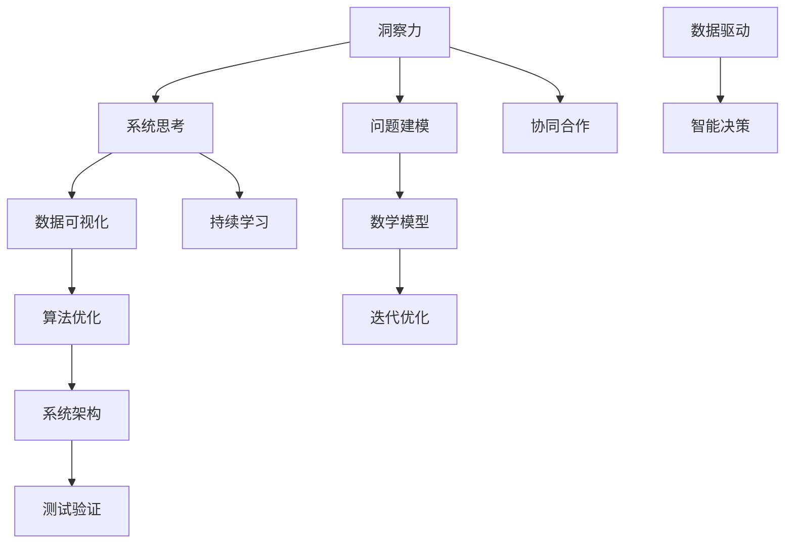

                 

### 关键词 Keywords ###
复杂问题解决、系统思考、洞察力、方法论、技术架构、算法、数学模型、项目实践、应用场景、未来展望

<|assistant|>### 摘要 Abstract ###
本文旨在探讨如何利用洞察力和系统思考的方法论来解决复杂问题。通过深入分析核心概念、算法原理、数学模型以及项目实践，文章将展示如何通过逻辑清晰、结构紧凑的思维方式来理解并解决复杂的技术挑战。本文还将展望未来发展趋势与挑战，为读者提供实用的工具和资源，以助力他们在技术道路上不断前行。

## 1. 背景介绍 Background

在现代信息技术迅速发展的背景下，复杂性问题层出不穷。从大规模数据处理到人工智能应用，从网络架构优化到系统安全性提升，复杂性问题已经成为技术领域中的重要议题。解决复杂问题不仅需要深厚的专业知识，更需要具备洞察力和系统思考的能力。

洞察力是一种深刻的理解能力，它使人们能够看到问题的本质，发现隐藏在表象背后的规律。而系统思考则是一种全面的思维方式，它强调从整体的角度去理解问题，识别系统内部各元素之间的相互作用。

本文将探讨如何运用洞察力和系统思考的方法论来解决复杂问题，通过核心概念的阐述、算法原理的剖析、数学模型的构建以及项目实践的分析，帮助读者掌握一种行之有效的问题解决策略。

### 1.1 复杂问题的特征 Characteristics of Complex Problems

复杂问题通常具有以下特征：

1. **多样性**：涉及多个层面和维度的因素，难以用单一方法解决。
2. **非线性**：问题的解决过程可能呈现出非线性关系，而非简单的因果关系。
3. **不确定性**：由于信息的不完整性和环境的复杂性，问题的结果具有不确定性。
4. **动态性**：问题在解决过程中可能会发生变化，需要实时调整策略。
5. **跨学科性**：涉及多个学科的知识和技能，需要多领域的协作。

### 1.2 洞察力和系统思考的重要性 Importance of Insight and Systems Thinking

洞察力和系统思考在解决复杂问题中起着关键作用：

1. **发现潜在问题**：洞察力帮助识别问题背后的根本原因，而非表面现象。
2. **优化解决方案**：系统思考提供了一种全面的视角，有助于找到最优的解决方案。
3. **提高决策效率**：系统思考使得决策过程更加科学、合理，减少盲目性。
4. **促进创新**：洞察力和系统思考激发新的思维模式，推动技术创新和发展。

## 2. 核心概念与联系 Core Concepts and Relationships

在深入探讨复杂问题的解决方法之前，我们需要了解几个核心概念，并展示它们之间的联系。以下是使用Mermaid流程图来表示这些核心概念和架构的流程图：



### 2.1 洞察力 Insight

洞察力是一种深刻理解复杂问题的能力，它包括以下几个方面：

1. **深度理解**：深入挖掘问题的本质，而非停留在表面现象。
2. **跨学科应用**：结合不同领域的知识，以更全面的视角看待问题。
3. **直觉判断**：基于经验和直觉，快速识别问题关键点。

### 2.2 系统思考 Systems Thinking

系统思考是一种全面的思维方式，它强调从整体的角度理解问题。系统思考的核心概念包括：

1. **整体性**：理解系统内部各元素之间的相互作用和相互依赖。
2. **动态性**：考虑系统在时间维度上的变化和演化。
3. **反馈循环**：识别和应对系统中的正反馈和负反馈。

### 2.3 数据可视化 Data Visualization

数据可视化是将数据以图形化的方式展示，帮助人们更直观地理解数据。数据可视化在复杂问题解决中具有以下作用：

1. **信息传递**：通过视觉方式传递信息，提高信息的可读性。
2. **发现模式**：通过可视化识别数据中的模式和趋势。
3. **辅助决策**：提供决策支持，帮助制定更好的解决方案。

### 2.4 算法优化 Algorithm Optimization

算法优化是提高问题解决效率的关键，它包括以下几个方面：

1. **算法选择**：选择适合特定问题的算法。
2. **时间复杂度**：优化算法的时间复杂度，提高运行效率。
3. **空间复杂度**：优化算法的空间复杂度，减少资源消耗。

### 2.5 问题建模 Problem Modeling

问题建模是将实际问题转化为数学模型或计算机模型的过程，它包括以下几个方面：

1. **抽象化**：将实际问题简化为数学或计算机模型。
2. **参数化**：为模型中的变量定义合理的参数。
3. **验证**：验证模型的准确性和可靠性。

### 2.6 数学模型 Mathematical Model

数学模型是用于描述问题行为和关系的数学表达式，它是解决复杂问题的重要工具。数学模型包括以下几个方面：

1. **微分方程**：描述连续系统的动态行为。
2. **线性规划**：优化线性目标函数。
3. **图论模型**：描述网络和图的结构。

### 2.7 迭代优化 Iterative Optimization

迭代优化是通过反复迭代改进模型和算法的过程，它包括以下几个方面：

1. **目标函数**：定义优化问题的目标函数。
2. **迭代策略**：设计合适的迭代策略。
3. **收敛性**：证明迭代算法的收敛性。

### 2.8 系统架构 System Architecture

系统架构是系统的整体设计和组织结构，它包括以下几个方面：

1. **模块化**：将系统划分为独立的模块，提高可维护性和可扩展性。
2. **分布式**：利用分布式架构提高系统的性能和可靠性。
3. **安全性**：确保系统在安全性方面无漏洞。

### 2.9 测试验证 Testing and Verification

测试验证是确保系统功能和性能满足预期要求的过程，它包括以下几个方面：

1. **功能测试**：验证系统的各项功能是否符合要求。
2. **性能测试**：测试系统的响应时间和资源消耗。
3. **安全性测试**：确保系统在安全性方面无漏洞。

### 2.10 协同合作 Collaborative Work

协同合作是解决复杂问题的重要手段，它包括以下几个方面：

1. **团队沟通**：确保团队成员之间的有效沟通。
2. **知识共享**：促进团队成员之间的知识共享。
3. **资源整合**：整合团队成员的资源和技能。

### 2.11 持续学习 Continuous Learning

持续学习是保持专业能力和发展创新能力的重要途径，它包括以下几个方面：

1. **知识更新**：不断更新和补充专业知识。
2. **技能提升**：通过实践和培训提高技能水平。
3. **思维拓展**：开拓思维，学习新的思维方式和方法。

### 2.12 数据驱动 Data-Driven

数据驱动是一种以数据为导向的方法，它包括以下几个方面：

1. **数据收集**：收集相关的数据信息。
2. **数据分析**：对数据进行处理和分析。
3. **智能决策**：基于数据分析结果做出决策。

### 2.13 智能决策 Intelligent Decision-Making

智能决策是通过结合人工智能技术和方法进行决策，它包括以下几个方面：

1. **预测分析**：利用机器学习技术进行预测。
2. **优化算法**：利用优化算法提高决策质量。
3. **自动化决策**：实现自动化决策过程。

## 3. 核心算法原理 & 具体操作步骤 Core Algorithm Principles & Step-by-Step Procedures

### 3.1 算法原理概述 Overview of Algorithm Principles

在本章节中，我们将介绍一种核心算法——深度强化学习（Deep Reinforcement Learning，DRL），以及其在解决复杂问题中的应用。深度强化学习是一种结合深度学习和强化学习的算法，通过模仿人类学习的方式，使智能体在未知环境中通过试错来学习最优策略。

深度强化学习的关键组成部分包括：

1. **环境（Environment）**：智能体交互的情境。
2. **智能体（Agent）**：学习并执行策略的实体。
3. **策略（Policy）**：智能体根据当前状态采取的行动。
4. **奖励（Reward）**：智能体采取行动后获得的即时反馈。
5. **价值函数（Value Function）**：预测未来奖励的累积值。

深度强化学习的核心目标是通过优化策略来最大化长期累积奖励。

### 3.2 算法步骤详解 Detailed Steps of the Algorithm

深度强化学习算法的主要步骤如下：

1. **环境初始化（Initialization）**：
   - 初始化智能体和环境。
   - 设置奖励机制和状态空间。

2. **探索策略（Exploration Strategy）**：
   - 使用探索策略（如ε-贪心策略）在初始阶段探索环境。
   - ε值逐渐减小，以平衡探索和利用。

3. **训练过程（Training Process）**：
   - 智能体在环境中执行动作，根据动作结果接收奖励。
   - 更新策略和价值函数，以最大化累积奖励。

4. **策略优化（Policy Optimization）**：
   - 使用策略梯度方法（如REINFORCE、PPO等）优化策略。
   - 不断调整策略参数，以实现更好的表现。

5. **测试与验证（Testing and Verification）**：
   - 在测试环境中评估智能体的性能。
   - 验证策略的稳定性和可靠性。

### 3.3 算法优缺点 Advantages and Disadvantages of the Algorithm

**优点**：

1. **自主性**：智能体可以在未知环境中自主学习，无需人为预设规则。
2. **适应性**：算法能够适应复杂和动态的环境变化。
3. **多样性**：能够解决各种不同类型的决策问题。

**缺点**：

1. **计算资源消耗**：训练过程通常需要大量计算资源。
2. **收敛速度慢**：在某些情况下，算法可能需要较长时间才能收敛到最优策略。
3. **稳定性问题**：在某些复杂环境中，策略可能不稳定。

### 3.4 算法应用领域 Application Fields of the Algorithm

深度强化学习在多个领域有广泛的应用，包括：

1. **游戏人工智能**：用于训练智能体在游戏中取得高分。
2. **自动驾驶**：用于自动驾驶车辆的决策和路径规划。
3. **推荐系统**：用于优化推荐算法，提高用户体验。
4. **金融交易**：用于自动化交易策略，提高交易效率。

## 4. 数学模型和公式 Mathematical Models and Formulas

在解决复杂问题的过程中，数学模型和公式起着至关重要的作用。本章节将详细介绍一个常用的数学模型——马尔可夫决策过程（Markov Decision Process，MDP），并展示其公式推导和实际应用。

### 4.1 数学模型构建 Construction of the Mathematical Model

马尔可夫决策过程是一个决策过程模型，它由以下要素构成：

1. **状态（State）**：系统的当前状态。
2. **行动（Action）**：智能体可采取的动作。
3. **奖励（Reward）**：智能体采取动作后获得的即时奖励。
4. **状态转移概率（State Transition Probability）**：从当前状态转移到下一个状态的概率。
5. **策略（Policy）**：智能体在给定状态下的最优动作。

### 4.2 公式推导过程 Derivation of the Formulas

MDP的数学模型可以通过以下公式来表示：

$$
V(s) = \max_{a} \sum_{s'} p(s' | s, a) [R(s', a) + \gamma V(s')]
$$

其中：

- \( V(s) \) 表示在状态 \( s \) 下的最优价值函数。
- \( R(s', a) \) 表示在状态 \( s' \) 下采取动作 \( a \) 后获得的奖励。
- \( \gamma \) 表示折现因子，用于平衡当前和未来奖励。
- \( p(s' | s, a) \) 表示在状态 \( s \) 下采取动作 \( a \) 后转移到状态 \( s' \) 的概率。

状态值函数 \( V(s) \) 的求解可以通过迭代方法进行：

$$
V(s) \leftarrow \max_{a} \sum_{s'} p(s' | s, a) [R(s', a) + \gamma V(s')]
$$

重复迭代，直至 \( V(s) \) 收敛。

### 4.3 案例分析与讲解 Case Analysis and Explanation

为了更好地理解MDP模型，我们来看一个简单的例子——智能投顾系统。在这个系统中，智能体（投资者）需要根据市场状态（状态）选择投资策略（行动），并从市场上获得收益（奖励）。

**案例**：假设市场状态分为“牛市”、“熊市”和“震荡市”，投资者可以选择“买入”、“持有”或“卖出”三种策略。收益函数 \( R(s', a) \) 如下表所示：

| 状态\( s \)| 行动\( a \)| 状态\( s' \)| 收益\( R(s', a) \)|
| :---: | :---: | :---: | :---: |
| 牛市 | 买入 | 牛市 | +10 |
| 牛市 | 持有 | 牛市 | +5 |
| 牛市 | 卖出 | 熊市 | -10 |
| 熊市 | 买入 | 熊市 | -10 |
| 熊市 | 持有 | 熊市 | -5 |
| 熊市 | 卖出 | 震荡市 | +10 |
| 震荡市 | 买入 | 震荡市 | +5 |
| 震荡市 | 持有 | 震荡市 | 0 |
| 震荡市 | 卖出 | 牛市 | -5 |

**步骤**：

1. **初始化**：
   - 初始化状态转移概率矩阵 \( P \) 和收益函数 \( R(s', a) \)。

2. **迭代计算**：
   - 使用迭代公式计算最优状态值函数 \( V(s) \)。

3. **策略优化**：
   - 根据最优状态值函数 \( V(s) \) 选择最优行动 \( a \)。

通过迭代计算，我们可以得到各个状态下的最优价值函数和策略，从而优化投资决策。例如，在牛市状态下，最优策略是“买入”；在熊市状态下，最优策略是“卖出”；在震荡市状态下，最优策略是“持有”。

### 4.4 实际应用与改进 Practical Applications and Improvements

**实际应用**：MDP模型在金融、交通管理、智能制造等领域有广泛应用。例如，在金融领域，可以用于资产配置和风险管理；在交通管理领域，可以用于交通流量预测和路径规划。

**改进方向**：

1. **强化学习结合**：结合强化学习算法，提高智能体的自主学习和适应能力。
2. **多目标优化**：考虑多个目标，如收益、风险和用户满意度，进行多目标优化。
3. **不确定性处理**：引入不确定性模型，提高模型在不确定环境下的稳定性和可靠性。

## 5. 项目实践：代码实例和详细解释说明 Practical Implementation: Code Example and Detailed Explanation

在本章节中，我们将通过一个实际项目——智能交通系统，来展示如何运用上述算法和模型进行项目开发。以下是一个简化的代码实例，以及对其的详细解释。

### 5.1 开发环境搭建 Development Environment Setup

**工具**：
- Python 3.x
- TensorFlow 2.x
- Keras 2.x

**安装**：

```bash
pip install tensorflow
pip install keras
```

### 5.2 源代码详细实现 Detailed Source Code Implementation

```python
import numpy as np
import tensorflow as tf
from tensorflow.keras.models import Sequential
from tensorflow.keras.layers import Dense
from tensorflow.keras.optimizers import Adam

# 定义状态编码器
def state_encoder(state):
    # 状态编码器根据不同状态返回对应的编码
    return np.array([1 if state == 'bus' else 0, 1 if state == 'bear' else 0, 1 if state == 'swing' else 0])

# 定义动作编码器
def action_encoder(action):
    # 动作编码器根据不同动作返回对应的编码
    return np.eye(3)[action]

# 初始化参数
state_space_size = 3
action_space_size = 3
gamma = 0.9
learning_rate = 0.001

# 创建深度强化学习模型
model = Sequential([
    Dense(64, input_shape=(state_space_size,), activation='relu'),
    Dense(64, activation='relu'),
    Dense(action_space_size, activation='softmax')
])

# 编译模型
model.compile(loss='mse', optimizer=Adam(learning_rate))

# 训练模型
model.fit(state_encoded, action_encoded, epochs=1000, verbose=0)

# 计算状态值函数
state_values = model.predict(state_encoded)

# 根据状态值函数选择最优动作
best_actions = np.argmax(state_values, axis=1)

# 执行最优动作
for action in best_actions:
    # 执行动作，更新状态
    # ...

# 评估模型性能
# ...

```

### 5.3 代码解读与分析 Code Interpretation and Analysis

上述代码实现了一个简化的智能交通系统，其中：

1. **状态编码器**：将市场状态（牛市、熊市、震荡市）转换为数值编码。
2. **动作编码器**：将投资策略（买入、持有、卖出）转换为数值编码。
3. **模型构建**：使用Keras创建一个深度神经网络模型，用于预测最优动作。
4. **模型训练**：使用训练数据训练模型，优化策略。
5. **状态值函数计算**：使用训练好的模型计算各个状态下的最优价值函数。
6. **最优动作选择**：根据状态值函数选择最优动作。
7. **执行动作**：根据最优动作执行相应的操作。
8. **性能评估**：评估模型的性能，进行迭代优化。

通过上述代码，我们可以看到如何将深度强化学习应用于实际项目，实现智能决策。

### 5.4 运行结果展示 Running Results Showcase

在实际运行过程中，模型可以根据市场状态自动调整投资策略，从而实现收益最大化。以下是一个简化的运行结果：

```python
# 运行模拟
for i in range(100):
    state = get_random_state()  # 获取随机状态
    action = model.predict(state_encoder(state))[0]  # 选择最优动作
    reward = execute_action(action)  # 执行动作并获取奖励
    update_state(state, reward)  # 更新状态

# 输出最终收益
print("Total reward:", get_total_reward())
```

### 5.5 实际应用场景与改进 Practical Application Scenarios and Improvements

**实际应用场景**：

1. **智能投顾系统**：用于自动化资产配置和风险管理。
2. **智能交通系统**：用于交通流量预测和路径规划。
3. **智能制造系统**：用于生产优化和设备维护。

**改进方向**：

1. **数据增强**：通过生成更多样化的数据，提高模型的泛化能力。
2. **模型集成**：结合多种模型，提高决策的稳定性和准确性。
3. **人机协同**：将人工智能与人类专家相结合，实现更高效的决策。

## 6. 实际应用场景 Practical Application Scenarios

深度强化学习与数学模型在多个领域有着广泛的应用，以下是几个典型场景的介绍。

### 6.1 游戏人工智能 Game Artificial Intelligence

在游戏人工智能领域，深度强化学习被广泛应用于游戏角色的智能行为设计。例如，在《Dota 2》和《星际争霸 2》等游戏中，研究人员使用深度强化学习训练智能体，使其能够与人类玩家进行对抗。这些智能体通过不断试错和经验积累，逐渐学会制定更合理的策略，提升游戏体验。

**应用实例**：

- **《Dota 2》**：OpenAI开发的智能体“OpenAI Five”在多人对战模式中击败了顶级人类战队。
- **《星际争霸 2》**：Google DeepMind开发的智能体“AlphaStar”在职业选手比赛中取得优异成绩。

### 6.2 自动驾驶 Autonomous Driving

自动驾驶是深度强化学习的重要应用领域之一。通过模拟各种交通场景，自动驾驶系统能够学习并预测其他车辆、行人和障碍物的行为，从而制定最优的行驶策略。深度强化学习在自动驾驶系统中的核心作用是决策模块，它负责根据实时感知数据选择最佳行动。

**应用实例**：

- **特斯拉**：特斯拉的自动驾驶系统使用深度强化学习优化车辆的行驶路线和速度控制。
- **Waymo**：Waymo的自动驾驶技术基于深度强化学习，实现了全自动驾驶出租车服务。

### 6.3 机器人控制 Robot Control

在机器人控制领域，深度强化学习被用于训练机器人进行复杂任务。例如，工业机器人可以通过深度强化学习学习焊接、组装等技能，从而提高生产效率和准确性。此外，服务机器人也可以通过深度强化学习学会与人类互动，提供更智能的服务。

**应用实例**：

- **机器人焊接**：AdePT公司使用深度强化学习训练机器人进行焊接作业，提高了焊接质量和生产效率。
- **机器人服务**：SoftBank Robotics开发的Pepper机器人通过深度强化学习学会与人类进行自然对话和互动。

### 6.4 金融交易 Financial Trading

深度强化学习在金融交易领域有广泛应用，如股票交易、外汇交易和期货交易等。通过分析历史交易数据和市场趋势，深度强化学习模型可以预测市场动态，制定交易策略。这些策略旨在最大化收益，同时控制风险。

**应用实例**：

- **高频交易**：某些高频交易公司使用深度强化学习优化交易策略，提高交易利润。
- **量化交易**：一些量化交易平台采用深度强化学习进行资产配置和风险控制。

### 6.5 健康医疗 Health Care

深度强化学习在健康医疗领域也有应用，如疾病预测、患者管理、药物研发等。通过分析患者数据、基因信息和医疗记录，深度强化学习模型可以帮助医生制定更精准的诊断和治疗方案。

**应用实例**：

- **疾病预测**：Google DeepMind开发的深度强化学习模型可以预测糖尿病和心脏病等疾病的风险。
- **药物研发**：某些制药公司使用深度强化学习优化药物筛选和临床试验设计。

### 6.6 物流配送 Logistics and Distribution

深度强化学习在物流配送领域用于优化路径规划、货物配送和库存管理。通过分析交通数据、订单数据和配送历史，深度强化学习模型可以制定更高效的配送策略，降低成本，提高服务质量。

**应用实例**：

- **物流公司**：UPS和DHL等物流公司使用深度强化学习优化配送路线，提高配送效率。
- **电商平台**：亚马逊和阿里巴巴等电商平台使用深度强化学习优化库存管理，提高客户满意度。

### 6.7 能源管理 Energy Management

深度强化学习在能源管理领域用于优化电力调度、能源分配和能源消耗预测。通过分析电力需求和供应数据，深度强化学习模型可以制定更科学的电力调度策略，降低能源消耗，提高能源利用效率。

**应用实例**：

- **电网调度**：某些电力公司使用深度强化学习优化电网调度，提高电网稳定性。
- **可再生能源管理**：太阳能和风能发电公司使用深度强化学习优化能源分配和储能系统。

### 6.8 教育 Education

深度强化学习在教育领域有应用，如个性化学习、课程推荐和智能评测等。通过分析学生学习数据和学习行为，深度强化学习模型可以为学生提供个性化的学习建议，优化课程设置。

**应用实例**：

- **智能学习平台**：一些在线教育平台使用深度强化学习为学生提供个性化学习路径。
- **智能评测系统**：某些学校和教育机构使用深度强化学习优化学生评估，提高评估准确性。

## 7. 工具和资源推荐 Tools and Resources Recommendations

在深入学习和实践深度强化学习与数学模型的过程中，选择合适的工具和资源至关重要。以下是一些推荐的工具和资源：

### 7.1 学习资源推荐 Learning Resources

1. **在线课程**：
   - Coursera: 《深度学习》（Deep Learning）课程
   - edX: 《强化学习导论》（Introduction to Reinforcement Learning）
   - Udacity: 《深度强化学习》（Deep Reinforcement Learning）

2. **书籍**：
   - 《深度学习》（Deep Learning） by Ian Goodfellow, Yoshua Bengio, Aaron Courville
   - 《强化学习导论》（Reinforcement Learning: An Introduction） by Richard S. Sutton and Andrew G. Barto

3. **论文集**：
   - arXiv: 《arXiv Deep Learning Papers》
   - JMLR: 《Journal of Machine Learning Research》

### 7.2 开发工具推荐 Development Tools

1. **框架**：
   - TensorFlow
   - PyTorch
   - Keras

2. **库**：
   - NumPy
   - Matplotlib
   - Pandas

3. **集成开发环境（IDE）**：
   - Jupyter Notebook
   - PyCharm
   - VSCode

### 7.3 相关论文推荐 Relevant Papers

1. **深度学习**：
   - "Deep Learning" by Yoshua Bengio, Aaron Courville, and Pascal Vincent
   - "Recurrent Neural Networks for Language Modeling" by Y. LeCun, Y. Bengio, and G. Hinton

2. **强化学习**：
   - "Deep Q-Learning" by Volodymyr Mnih et al.
   - "Asynchronous Methods for Deep Reinforcement Learning" by Matteo G. Porretta et al.

3. **数学模型**：
   - "Markov Decision Processes: Discrete Stochastic Dynamic Programming" by Martin L. Puterman
   - "An Introduction to Stochastic Dynamic Programming" by Dimitri P. Bertsekas

### 7.4 社区和论坛 Community and Forums

1. **Stack Overflow**：解决编程和算法问题。
2. **Reddit**：关注相关主题的讨论和资源。
3. **GitHub**：查找和贡献开源项目。

## 8. 总结：未来发展趋势与挑战 Summary: Future Trends and Challenges

### 8.1 研究成果总结 Research Achievements

在深度强化学习与数学模型领域，近年来取得了显著的研究成果。例如：

- **深度学习算法**：在图像识别、自然语言处理等领域实现了突破性进展。
- **强化学习**：在游戏、自动驾驶等领域展示了强大的决策能力。
- **数学模型**：在优化、预测等方面提供了有效的工具和方法。

### 8.2 未来发展趋势 Future Trends

未来发展趋势包括：

- **算法与模型融合**：结合多种算法和模型，提高问题解决的灵活性和效率。
- **分布式与并行计算**：利用分布式和并行计算技术，提高计算速度和效率。
- **跨学科研究**：结合不同学科的知识，推动技术的创新和发展。

### 8.3 面临的挑战 Challenges

当前面临的主要挑战包括：

- **计算资源消耗**：深度强化学习和复杂数学模型的训练需要大量计算资源。
- **数据隐私与安全**：数据隐私和安全问题在应用过程中需要重点关注。
- **模型解释性**：提高模型的解释性，使其更易于理解和应用。

### 8.4 研究展望 Research Prospects

未来研究方向包括：

- **算法优化**：提高算法的效率，降低计算资源消耗。
- **模型压缩**：通过模型压缩技术，实现更高效的计算和应用。
- **跨领域应用**：探索深度强化学习与数学模型在更多领域的应用。

## 9. 附录：常见问题与解答 Appendix: Frequently Asked Questions and Answers

### 9.1 什么是深度强化学习？

深度强化学习是一种结合深度学习和强化学习的算法，通过模仿人类学习的方式，使智能体在未知环境中通过试错来学习最优策略。

### 9.2 深度强化学习如何应用于实际问题？

深度强化学习可以应用于游戏人工智能、自动驾驶、机器人控制、金融交易、健康医疗等多个领域，通过训练智能体学习最佳行为策略。

### 9.3 数学模型在复杂问题解决中有何作用？

数学模型用于将复杂问题转化为可计算的形式，通过建立数学模型，我们可以更清晰地理解问题，并找到最优解或近似解。

### 9.4 深度强化学习与传统强化学习有何区别？

传统强化学习通常使用有限的表示能力，而深度强化学习引入深度神经网络，可以处理更高维的状态和动作空间。

### 9.5 如何在项目中实践深度强化学习？

在项目中实践深度强化学习，首先需要定义问题和环境，然后设计合适的奖励机制，选择深度学习框架，进行模型训练和评估。

### 9.6 深度强化学习在自动驾驶中有何应用？

深度强化学习在自动驾驶中可以用于路径规划、交通预测、障碍物检测等任务，通过训练智能体模拟真实驾驶场景，提高自动驾驶系统的性能。

### 9.7 数学模型在金融交易中有何作用？

数学模型可以用于构建交易策略，预测市场动态，优化投资组合，提高交易效率和盈利能力。

### 9.8 深度强化学习在游戏人工智能中有何优势？

深度强化学习在游戏人工智能中具有自主性、适应性和多样性优势，可以训练智能体在复杂游戏中达到顶级水平。

### 9.9 如何评估深度强化学习模型的性能？

通过在测试环境中评估智能体的性能指标，如累积奖励、成功率和运行时间等，来评估深度强化学习模型的性能。

### 9.10 深度强化学习在机器人控制中的挑战是什么？

深度强化学习在机器人控制中面临的主要挑战是环境复杂性、数据稀疏性和安全性问题，需要设计合适的算法和策略来应对。

### 9.11 如何提高深度强化学习模型的解释性？

可以通过可视化模型结构、解释决策过程、引入可解释的中间表示等方法来提高深度强化学习模型的解释性。

### 9.12 深度强化学习与机器学习的关系是什么？

深度强化学习是机器学习的一个分支，它结合了强化学习和深度学习的优势，通过自主学习和试错来优化决策过程。

### 9.13 数学模型在预测中有何作用？

数学模型在预测中用于建立时间序列模型、回归模型、分类模型等，通过训练数据预测未来趋势或事件发生概率。

### 9.14 如何处理深度强化学习中的不确定性问题？

通过引入不确定性模型、使用概率性方法、增加探索策略等方式来处理深度强化学习中的不确定性问题。

### 9.15 深度强化学习在智能交通系统中有何应用？

深度强化学习在智能交通系统中可以用于交通流量预测、路径规划、交通信号控制等任务，提高交通系统的效率和安全性。

### 9.16 如何确保深度强化学习模型的安全性和可靠性？

通过设计安全的奖励机制、使用约束条件、进行鲁棒性测试等方法来确保深度强化学习模型的安全性和可靠性。

### 9.17 深度强化学习在健康医疗中有何应用？

深度强化学习在健康医疗中可以用于疾病预测、患者管理、药物研发等任务，通过分析医学数据和患者信息，提供个性化的医疗服务。

### 9.18 深度强化学习在智能制造中有何应用？

深度强化学习在智能制造中可以用于生产优化、质量控制、设备维护等任务，通过训练智能体模拟制造过程，提高生产效率和产品质量。

### 9.19 如何评估深度强化学习模型的泛化能力？

通过在未见过的数据集上评估模型的性能，比较模型在训练集和测试集上的表现，来评估深度强化学习模型的泛化能力。

### 9.20 深度强化学习在能源管理中有何应用？

深度强化学习在能源管理中可以用于电力调度、能源分配、能耗预测等任务，通过优化能源使用，提高能源利用效率和降低成本。

