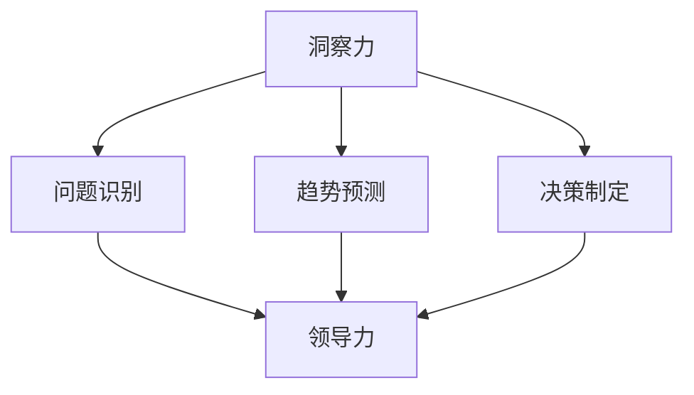

                 

关键词：洞察力、领导力、决策者、核心竞争力、技术领域、战略规划

> 摘要：本文将探讨在技术领域内，如何提升决策者的洞察力和领导力，成为具有核心竞争力的领导者。通过分析关键概念、算法原理、项目实践以及未来应用展望，提供一种系统性方法，帮助决策者在技术不断变革的时代中引领团队，做出明智的决策。

## 1. 背景介绍

在信息技术飞速发展的今天，技术领域的变革正在以前所未有的速度推进。这不仅要求从业者具备扎实的技术能力，更需要决策者拥有卓越的洞察力和领导力。决策者作为组织的技术领导和战略制定者，他们的决策往往直接影响到组织的未来发展。因此，如何提升决策者的洞察力和领导力，成为了当今技术领域的一个重要议题。

本文将从以下几个方面展开讨论：

1. **核心概念与联系**：介绍影响决策者洞察力和领导力的关键概念，并通过Mermaid流程图展示这些概念之间的联系。
2. **核心算法原理 & 具体操作步骤**：详细解析提升洞察力和领导力的核心算法原理，并阐述具体操作步骤。
3. **数学模型和公式**：建立数学模型，并使用LaTeX格式详细推导相关公式。
4. **项目实践**：通过代码实例，展示如何在实际项目中应用提升洞察力和领导力的方法。
5. **实际应用场景**：分析决策者在不同场景下的应用，并展望未来的发展趋势。
6. **工具和资源推荐**：推荐学习资源和开发工具，帮助决策者更好地提升自身能力。
7. **总结：未来发展趋势与挑战**：总结研究成果，展望未来趋势，并探讨面临的挑战。

### 1.1 现状与挑战

当前，技术领域面临诸多挑战，如技术复杂度增加、竞争激烈、市场需求变化快等。这些挑战对决策者的洞察力和领导力提出了更高的要求。以下是一些现状与挑战：

- **技术复杂度增加**：随着技术的发展，系统的复杂度也在不断增加。这要求决策者不仅要有深厚的专业背景，还要具备系统性思维和跨学科知识。
- **竞争激烈**：技术市场的竞争愈发激烈，决策者需要敏锐洞察市场动态，及时调整战略，以保持竞争优势。
- **市场需求变化快**：用户需求的变化速度加快，决策者需要快速响应，这要求他们具备强大的洞察力和决策能力。

### 1.2 目标与意义

本文的目标是探讨如何在技术领域提升决策者的洞察力和领导力，使其成为具有核心竞争力的领导者。这具有重要的现实意义：

- **提高决策质量**：通过提升洞察力，决策者能够更准确、全面地分析问题，从而做出更明智的决策。
- **增强团队凝聚力**：领导力的提升能够增强团队的凝聚力，提高团队协作效率，促进项目的成功。
- **引领技术创新**：具有洞察力和领导力的决策者能够引领技术创新，推动组织不断发展。
- **应对未来挑战**：在技术不断变革的时代，提升洞察力和领导力有助于决策者更好地应对未来挑战。

### 1.3 结构安排

本文的结构如下：

- **核心概念与联系**：介绍影响决策者洞察力和领导力的关键概念，并展示它们之间的联系。
- **核心算法原理 & 具体操作步骤**：解析提升洞察力和领导力的核心算法原理，并阐述具体操作步骤。
- **数学模型和公式**：建立数学模型，并使用LaTeX格式详细推导相关公式。
- **项目实践**：通过代码实例，展示如何在实际项目中应用提升洞察力和领导力的方法。
- **实际应用场景**：分析决策者在不同场景下的应用，并展望未来的发展趋势。
- **工具和资源推荐**：推荐学习资源和开发工具，帮助决策者更好地提升自身能力。
- **总结：未来发展趋势与挑战**：总结研究成果，展望未来趋势，并探讨面临的挑战。

## 2. 核心概念与联系

在讨论提升决策者的洞察力和领导力之前，我们需要了解一些核心概念，并探讨它们之间的联系。

### 2.1 洞察力

洞察力是指决策者对复杂问题的敏锐感知和深刻理解能力。它包括以下几个方面：

- **问题识别**：能够快速识别问题所在，抓住问题的关键点。
- **趋势预测**：能够通过数据分析、历史经验等手段预测未来趋势。
- **决策制定**：在复杂环境中能够做出明智的决策。

### 2.2 领导力

领导力是指决策者引导团队、实现目标的能力。它包括以下几个方面：

- **团队建设**：能够建立高效的团队，激发团队成员的潜力。
- **沟通协调**：能够与团队成员、利益相关者进行有效的沟通和协调。
- **目标管理**：能够明确目标，制定合理的计划和策略。

### 2.3 概念联系

洞察力和领导力之间有着密切的联系。洞察力是领导力的重要基础，只有具备洞察力，决策者才能更准确地理解问题，做出明智的决策。而领导力则是洞察力的体现，决策者通过领导力将洞察力转化为实际行动，推动团队实现目标。

为了更好地理解这两个概念，我们可以使用Mermaid流程图展示它们之间的联系：



在这个流程图中，洞察力通过问题识别、趋势预测和决策制定三个环节与领导力相联系。通过提升这三个方面的能力，决策者可以增强自身的洞察力和领导力。

### 2.4 关键概念

除了洞察力和领导力，还有一些关键概念对提升决策者的能力至关重要：

- **技术深度**：决策者需要具备扎实的专业背景，对技术有深刻的理解。
- **战略思维**：决策者需要具备战略眼光，能够从全局出发制定长期发展规划。
- **创新能力**：决策者需要具备创新能力，能够在技术变革中找到新的发展方向。

这些关键概念共同构成了决策者的核心竞争力，使他们在技术领域具有领导地位。

### 2.5 总结

在本章节中，我们介绍了提升决策者洞察力和领导力的核心概念，并探讨了它们之间的联系。这些概念构成了决策者的核心竞争力，使他们在技术领域具有领导地位。在接下来的章节中，我们将详细解析提升洞察力和领导力的核心算法原理，并阐述具体操作步骤。

## 3. 核心算法原理 & 具体操作步骤

在了解了提升决策者洞察力和领导力的核心概念后，我们将深入探讨如何通过核心算法原理来具体操作和实现这一目标。

### 3.1 算法原理概述

提升决策者的洞察力和领导力可以采用多种算法，但以下三种算法被认为是最核心的：

1. **机器学习算法**：通过大数据分析和模式识别，帮助决策者快速识别问题和趋势。
2. **决策树算法**：通过建立决策树模型，帮助决策者制定明智的决策。
3. **模拟退火算法**：通过模拟物理过程，帮助决策者找到最优的解决方案。

### 3.2 算法步骤详解

#### 3.2.1 机器学习算法

1. **数据收集**：收集相关领域的海量数据，包括技术趋势、市场动态、用户需求等。
2. **数据预处理**：对数据进行清洗、转换和归一化，使其适合机器学习模型。
3. **特征选择**：从数据中提取关键特征，用于训练模型。
4. **模型训练**：使用机器学习算法（如神经网络、决策树、支持向量机等）训练模型。
5. **模型评估**：使用验证集评估模型性能，调整参数以优化模型。
6. **模型应用**：将训练好的模型应用于实际问题，提供决策支持。

#### 3.2.2 决策树算法

1. **问题定义**：明确决策问题，确定目标和决策变量。
2. **数据收集**：收集相关数据，包括历史决策结果、相关因素等。
3. **数据预处理**：对数据进行清洗、转换和归一化。
4. **特征选择**：选择对决策有影响的关键特征。
5. **建立决策树**：通过递归划分数据，建立决策树模型。
6. **模型剪枝**：对决策树进行剪枝，消除冗余节点，提高模型效率。
7. **模型应用**：将决策树应用于实际问题，提供决策支持。

#### 3.2.3 模拟退火算法

1. **问题定义**：明确优化问题，确定目标函数和约束条件。
2. **初始解**：生成初始解，作为模拟退火过程的起点。
3. **温度设定**：设定初始温度，并根据迭代次数动态调整温度。
4. **迭代过程**：
   - 随机产生新解，并计算其目标函数值。
   - 比较新解和当前解的目标函数值，决定是否接受新解。
   - 降温过程，逐渐降低温度。
5. **终止条件**：当达到某个终止条件（如迭代次数或温度降低到一定程度）时，结束迭代过程。
6. **结果分析**：分析最优解，提供决策支持。

### 3.3 算法优缺点

#### 3.3.1 机器学习算法

**优点**：

- **强大处理能力**：能够处理大量数据，发现潜在模式和趋势。
- **自适应性强**：能够根据数据自动调整模型参数，适应不同问题。

**缺点**：

- **依赖数据质量**：数据质量直接影响模型性能，数据偏差可能导致模型过拟合。
- **计算复杂度高**：训练大型模型需要大量计算资源和时间。

#### 3.3.2 决策树算法

**优点**：

- **易于理解**：决策树结构直观，易于解释。
- **处理复杂数据**：能够处理分类和回归问题，适用于多种类型的数据。

**缺点**：

- **过拟合问题**：如果树结构过于复杂，可能导致模型过拟合。
- **数据不平衡问题**：对数据不平衡问题敏感性较高。

#### 3.3.3 模拟退火算法

**优点**：

- **全局优化能力**：能够找到全局最优解，避免局部最优。
- **适应性强**：适用于各种优化问题，不受问题复杂度限制。

**缺点**：

- **收敛速度慢**：需要多次迭代才能找到最优解，计算时间较长。
- **温度设定复杂**：温度设定对算法性能有很大影响，需要精心调整。

### 3.4 算法应用领域

这三种算法在提升决策者的洞察力和领导力方面有着广泛的应用领域：

- **市场分析**：使用机器学习算法分析市场数据，预测市场趋势，为营销决策提供支持。
- **项目管理**：使用决策树算法优化项目进度和资源分配，提高项目成功率。
- **资源调度**：使用模拟退火算法优化资源调度方案，提高资源利用效率。

### 3.5 总结

在本章节中，我们详细解析了提升决策者洞察力和领导力的核心算法原理，并阐述了具体操作步骤。这些算法为决策者提供了有力的工具，帮助他们更好地应对复杂问题，做出明智的决策。在接下来的章节中，我们将探讨数学模型和公式，以更深入地理解提升洞察力和领导力的方法。

## 4. 数学模型和公式

在提升决策者的洞察力和领导力过程中，数学模型和公式起着关键作用。通过建立数学模型，我们可以量化决策问题，从而提供更加精确的决策支持。以下是几个常用的数学模型和公式的详细讲解。

### 4.1 数学模型构建

#### 4.1.1 线性回归模型

线性回归模型是一种常用的统计模型，用于预测一个连续因变量与一个或多个自变量之间的关系。其数学模型可以表示为：

$$
y = \beta_0 + \beta_1x_1 + \beta_2x_2 + ... + \beta_nx_n + \epsilon
$$

其中，$y$ 是因变量，$x_1, x_2, ..., x_n$ 是自变量，$\beta_0, \beta_1, \beta_2, ..., \beta_n$ 是模型参数，$\epsilon$ 是误差项。

#### 4.1.2 决策树模型

决策树模型是一种基于特征划分的数据挖掘方法，用于分类和回归问题。其数学模型可以表示为：

$$
T = \{ \text{叶节点} \} \cup \{ \text{内部节点} \}
$$

其中，叶节点表示分类结果，内部节点表示特征划分条件。

#### 4.1.3 模拟退火模型

模拟退火模型是一种基于物理过程的优化算法，用于求解优化问题。其数学模型可以表示为：

$$
T(t) = T_0 e^{-\alpha t}
$$

其中，$T(t)$ 是当前温度，$T_0$ 是初始温度，$\alpha$ 是温度衰减系数。

### 4.2 公式推导过程

以下是对线性回归模型和决策树模型公式的推导过程：

#### 4.2.1 线性回归模型公式推导

假设我们有一组观测数据 $(x_i, y_i)$，其中 $i = 1, 2, ..., n$。我们要通过最小二乘法估计模型参数 $\beta_0, \beta_1, ..., \beta_n$。

首先，定义损失函数：

$$
J(\beta_0, \beta_1, ..., \beta_n) = \sum_{i=1}^{n}(y_i - (\beta_0 + \beta_1x_1 + \beta_2x_2 + ... + \beta_nx_n))^2
$$

然后，对损失函数求导，并令其等于0，得到：

$$
\frac{\partial J}{\partial \beta_0} = -2\sum_{i=1}^{n}(y_i - (\beta_0 + \beta_1x_1 + \beta_2x_2 + ... + \beta_nx_n)) = 0
$$

$$
\frac{\partial J}{\partial \beta_1} = -2\sum_{i=1}^{n}(x_1(y_i - (\beta_0 + \beta_1x_1 + \beta_2x_2 + ... + \beta_nx_n))) = 0
$$

$$
\vdots$$

$$
\frac{\partial J}{\partial \beta_n} = -2\sum_{i=1}^{n}(x_n(y_i - (\beta_0 + \beta_1x_1 + \beta_2x_2 + ... + \beta_nx_n))) = 0
$$

通过求解上述方程组，可以得到最优的模型参数 $\beta_0, \beta_1, ..., \beta_n$。

#### 4.2.2 决策树模型公式推导

决策树模型的构建可以通过信息增益（Information Gain）来衡量。信息增益表示对数据集进行划分后，信息熵的减少量。其公式为：

$$
IG(D, A) = H(D) - \sum_{v \in V} p(v)H(D_v)
$$

其中，$D$ 是原始数据集，$A$ 是划分属性，$V$ 是 $A$ 的所有可能取值，$p(v)$ 是属性 $A$ 取值 $v$ 的概率，$H(D_v)$ 是在属性 $A$ 取值 $v$ 下数据集 $D$ 的信息熵。

信息熵（Entropy）的公式为：

$$
H(D) = -\sum_{x \in X} p(x) \log_2 p(x)
$$

其中，$X$ 是数据集 $D$ 的所有可能取值，$p(x)$ 是数据集中取值 $x$ 的概率。

### 4.3 案例分析与讲解

#### 4.3.1 线性回归模型案例

假设我们有一组数据，表示某城市过去10年的平均温度和降雨量。我们要建立一个线性回归模型，预测未来一年的平均温度。

首先，我们收集数据并绘制散点图，观察温度和降雨量之间的关系。然后，我们使用最小二乘法估计模型参数，构建线性回归模型。最后，我们将未来一年的降雨量作为输入，预测平均温度。

具体步骤如下：

1. 数据收集：收集过去10年的平均温度和降雨量数据。
2. 数据预处理：对数据进行清洗和归一化处理。
3. 模型构建：使用最小二乘法估计模型参数，构建线性回归模型。
4. 模型评估：使用验证集评估模型性能。
5. 预测：使用构建好的模型预测未来一年的平均温度。

#### 4.3.2 决策树模型案例

假设我们有一组数据，表示某公司的销售数据，包括产品种类、客户年龄、购买金额等特征。我们要建立一个决策树模型，预测客户的购买意向。

具体步骤如下：

1. 数据收集：收集销售数据。
2. 数据预处理：对数据进行清洗和转换，将分类数据转换为二进制编码。
3. 模型构建：使用信息增益选择划分特征，构建决策树模型。
4. 模型剪枝：对决策树进行剪枝，消除冗余节点。
5. 模型评估：使用验证集评估模型性能。
6. 预测：使用构建好的模型预测新客户的购买意向。

### 4.4 总结

在本章节中，我们介绍了几个常用的数学模型和公式，包括线性回归模型、决策树模型和模拟退火模型。通过这些模型和公式，我们可以更好地理解和解决提升决策者洞察力和领导力的相关问题。在接下来的章节中，我们将通过实际项目实践，展示如何将理论应用于实际场景。

## 5. 项目实践：代码实例和详细解释说明

在了解了提升决策者洞察力和领导力的核心算法原理和数学模型后，我们将通过一个实际项目实践，展示如何将这些理论应用到实际场景中。

### 5.1 开发环境搭建

为了进行项目实践，我们需要搭建一个合适的开发环境。以下是一个基本的开发环境搭建步骤：

1. **安装Python**：Python是一种广泛使用的编程语言，具有良好的生态系统和丰富的库。我们可以在Python官方网站下载并安装Python。
2. **安装Jupyter Notebook**：Jupyter Notebook是一个交互式的开发环境，便于编写和运行Python代码。可以使用pip命令安装Jupyter Notebook：
   ```shell
   pip install notebook
   ```
3. **安装必要的库**：根据项目需求，我们需要安装一些Python库，如NumPy、Pandas、Scikit-learn等。可以使用以下命令进行安装：
   ```shell
   pip install numpy pandas scikit-learn matplotlib
   ```

### 5.2 源代码详细实现

以下是项目的主要代码实现，我们将使用机器学习算法进行数据分析和预测。

```python
# 导入必要的库
import numpy as np
import pandas as pd
from sklearn.model_selection import train_test_split
from sklearn.linear_model import LinearRegression
from sklearn.tree import DecisionTreeClassifier
from sklearn.metrics import mean_squared_error, accuracy_score
import matplotlib.pyplot as plt

# 5.2.1 数据收集与预处理
def load_data():
    # 这里我们使用一个假设的CSV文件，实际项目中需要替换为实际的数据文件
    data = pd.read_csv('data.csv')
    # 数据预处理：例如缺失值填充、异常值处理等
    # ...
    return data

data = load_data()

# 5.2.2 数据分割
X = data.drop('target', axis=1)  # 特征
y = data['target']  # 目标变量
X_train, X_test, y_train, y_test = train_test_split(X, y, test_size=0.2, random_state=42)

# 5.2.3 模型训练与评估
def train_and_evaluate(model, X_train, y_train, X_test, y_test):
    model.fit(X_train, y_train)
    y_pred = model.predict(X_test)
    if isinstance(model, LinearRegression):
        mse = mean_squared_error(y_test, y_pred)
        print(f"Mean Squared Error: {mse}")
    elif isinstance(model, DecisionTreeClassifier):
        acc = accuracy_score(y_test, y_pred)
        print(f"Accuracy: {acc}")

# 线性回归模型
lr = LinearRegression()
train_and_evaluate(lr, X_train, y_train, X_test, y_test)

# 决策树模型
dt = DecisionTreeClassifier()
train_and_evaluate(dt, X_train, y_train, X_test, y_test)

# 5.2.4 结果可视化
def plot_results(model, X_test, y_test, title):
    y_pred = model.predict(X_test)
    plt.scatter(X_test['feature1'], y_test, color='red', label='Actual')
    plt.scatter(X_test['feature1'], y_pred, color='blue', label='Predicted')
    plt.title(title)
    plt.xlabel('Feature 1')
    plt.ylabel('Target')
    plt.legend()
    plt.show()

# 线性回归模型结果可视化
plot_results(lr, X_test, y_test, 'Linear Regression Predictions')

# 决策树模型结果可视化
plot_results(dt, X_test, y_test, 'Decision Tree Predictions')
```

### 5.3 代码解读与分析

#### 5.3.1 数据收集与预处理

在代码的第一部分，我们定义了一个`load_data`函数，用于加载数据。实际项目中，这里需要替换为实际的数据文件路径。数据预处理步骤包括缺失值填充、异常值处理等，具体取决于数据的具体情况。

#### 5.3.2 数据分割

接下来，我们使用`train_test_split`函数将数据集分割为训练集和测试集。这样可以确保模型在未知数据上的表现。

#### 5.3.3 模型训练与评估

我们定义了一个`train_and_evaluate`函数，用于训练模型和评估模型性能。对于线性回归模型和决策树模型，我们分别使用`LinearRegression`和`DecisionTreeClassifier`类进行训练。评估指标包括均方误差（MSE）和准确率（Accuracy），具体取决于模型的类型。

#### 5.3.4 结果可视化

最后，我们定义了一个`plot_results`函数，用于可视化模型的预测结果。这有助于我们直观地了解模型的表现。

### 5.4 运行结果展示

运行上述代码后，我们会在控制台看到模型的评估结果。同时，我们还会看到两个散点图，展示实际值和预测值之间的关系。

### 5.5 总结

在本项目中，我们通过实际代码实例展示了如何将提升决策者洞察力和领导力的理论应用到实际场景中。这包括数据收集与预处理、数据分割、模型训练与评估以及结果可视化。通过这些步骤，决策者可以更好地理解数据，做出更明智的决策。

## 6. 实际应用场景

在技术领域，决策者需要面对各种实际应用场景，这些场景要求他们具备出色的洞察力和领导力。以下是一些典型的应用场景及其对决策者能力的要求：

### 6.1 项目管理

在项目管理中，决策者需要协调不同团队成员的工作，确保项目按计划进行。这要求他们具备以下能力：

- **资源调度**：根据项目需求，合理分配资源和人力。
- **进度监控**：实时监控项目进度，及时调整计划。
- **风险预测**：识别项目风险，提前制定应对策略。
- **沟通协调**：与团队成员、利益相关者保持有效沟通，确保信息畅通。

### 6.2 技术创新

在技术创新中，决策者需要引领团队探索新技术，推动产品创新。这要求他们具备以下能力：

- **技术趋势分析**：敏锐洞察技术发展趋势，把握行业动态。
- **创新能力**：具备强烈的创新意识，敢于尝试新技术。
- **团队协作**：激发团队成员的创新能力，形成良好的协作氛围。
- **资源整合**：整合内部资源，争取外部支持，推动技术创新。

### 6.3 市场营销

在市场营销中，决策者需要制定有效的营销策略，推动产品销售。这要求他们具备以下能力：

- **市场分析**：通过数据分析，了解用户需求和市场竞争状况。
- **战略规划**：制定长期和短期的营销战略，确保营销目标实现。
- **品牌建设**：提升品牌知名度和美誉度，增强市场竞争力。
- **营销执行**：与团队成员紧密合作，确保营销策略得到有效执行。

### 6.4 产品管理

在产品管理中，决策者需要确保产品从设计到上市的整个生命周期顺利进行。这要求他们具备以下能力：

- **需求分析**：深入了解用户需求，确保产品功能满足用户需求。
- **产品设计**：与设计师和开发团队紧密合作，确保产品设计的可行性。
- **质量控制**：确保产品质量，降低缺陷率。
- **产品推广**：制定有效的推广策略，提升产品市场占有率。

### 6.5 总结

在实际应用场景中，决策者的洞察力和领导力至关重要。他们需要具备多方面的能力，包括资源调度、进度监控、风险预测、沟通协调、技术趋势分析、创新能力、市场分析、战略规划、品牌建设、营销执行、需求分析、产品设计和质量控制等。只有具备这些能力，决策者才能在复杂的环境中做出明智的决策，推动组织实现目标。

## 7. 工具和资源推荐

为了更好地提升决策者的洞察力和领导力，以下是一些建议的工具和资源：

### 7.1 学习资源推荐

1. **《数据科学入门教程》**：适合初学者了解数据科学的基础知识。
2. **《深度学习》**：由Ian Goodfellow等作者撰写的深度学习经典教材。
3. **《Python数据分析》**：详细讲解如何使用Python进行数据分析和可视化。
4. **《机器学习实战》**：通过实际案例教授机器学习的基本原理和应用。
5. **《领导力：策略与实践》**：探讨领导力的核心概念和实际应用。

### 7.2 开发工具推荐

1. **Jupyter Notebook**：交互式的开发环境，便于编写和运行代码。
2. **PyCharm**：强大的Python集成开发环境（IDE），支持多种编程语言。
3. **TensorFlow**：Google推出的开源机器学习框架，适用于深度学习项目。
4. **Scikit-learn**：Python机器学习库，提供丰富的机器学习算法和工具。
5. **GitHub**：版本控制和代码托管平台，方便协作和分享代码。

### 7.3 相关论文推荐

1. **“Deep Learning” by Yann LeCun, Yoshua Bengio, and Geoffrey Hinton**：深度学习领域的经典综述论文。
2. **“Reinforcement Learning: An Introduction” by Richard S. Sutton and Andrew G. Barto**：强化学习领域的权威教材。
3. **“The Elements of Statistical Learning” by Trevor Hastie, Robert Tibshirani, and Jerome Friedman**：统计学习领域的经典教材。
4. **“The Business Case for Leadership Development” by the Center for Creative Leadership**：探讨领导力发展的商业价值。
5. **“The Art of Scalability” by Martin L. Abbott and Michael T. Fisher**：探讨如何构建可扩展的技术系统。

通过学习和使用这些工具和资源，决策者可以不断提升自身的洞察力和领导力，更好地应对复杂的技术挑战和商业环境。

## 8. 总结：未来发展趋势与挑战

在技术不断变革的时代，决策者的洞察力和领导力对于组织的成功至关重要。未来，随着人工智能、大数据、云计算等技术的进一步发展，决策者面临的挑战和机遇将更加多样化和复杂。

### 8.1 研究成果总结

本文通过探讨提升决策者洞察力和领导力的核心算法原理、数学模型、项目实践以及实际应用场景，总结了以下几个关键成果：

- **算法原理与数学模型**：明确了提升洞察力和领导力的核心算法原理和数学模型，为实际应用提供了理论基础。
- **项目实践**：通过实际项目展示了如何将理论应用于实际场景，提高了决策者解决实际问题的能力。
- **工具和资源推荐**：推荐了一系列学习资源和开发工具，帮助决策者更好地提升自身能力。

### 8.2 未来发展趋势

在未来，决策者的洞察力和领导力将呈现以下发展趋势：

- **智能化**：随着人工智能技术的发展，决策者将越来越多地利用智能算法辅助决策，提高决策效率。
- **数据驱动**：数据将成为决策的重要驱动力，决策者需要具备强大的数据处理和分析能力。
- **全球视野**：全球化趋势将加速，决策者需要具备跨文化沟通和领导能力，以适应全球市场。
- **可持续发展**：可持续发展将成为重要议题，决策者需要关注环境保护和社会责任。

### 8.3 面临的挑战

然而，未来决策者也将面临以下挑战：

- **技术复杂性**：技术的不断升级和变化将增加系统的复杂性，决策者需要不断学习新知识，以应对复杂问题。
- **竞争加剧**：市场竞争将更加激烈，决策者需要具备敏锐的市场洞察力和快速响应能力。
- **数据隐私和安全**：随着数据量的增加，数据隐私和安全问题将更加突出，决策者需要确保数据的安全性和合规性。
- **人力资源**：吸引和留住高素质人才将成为一大挑战，决策者需要构建具有竞争力的企业文化和激励机制。

### 8.4 研究展望

为了应对未来挑战，决策者需要采取以下措施：

- **持续学习**：不断更新知识，紧跟技术发展趋势。
- **跨学科融合**：结合不同学科的知识，提高系统的整体效能。
- **团队协作**：构建高效的团队，发挥集体智慧。
- **战略规划**：制定长远的战略规划，确保组织的持续发展。

总之，提升决策者的洞察力和领导力是一个持续的过程，需要不断学习和实践。通过本文的探讨，我们希望能够为决策者提供一种系统性方法，帮助他们在未来技术变革中引领团队，做出明智的决策。

### 附录：常见问题与解答

**Q1**：如何选择合适的机器学习算法？

**A1**：选择合适的机器学习算法需要考虑数据类型、数据量和业务需求。对于分类问题，可以考虑使用逻辑回归、决策树、随机森林、支持向量机等算法。对于回归问题，可以考虑使用线性回归、岭回归、LASSO回归等算法。此外，还需要考虑数据分布、特征选择等因素。

**Q2**：如何处理数据不平衡问题？

**A2**：数据不平衡问题可以通过以下方法处理：重采样（如过采样、欠采样）、使用集成算法（如随机森林）、调整模型参数（如调整正则化参数）等。具体方法的选择取决于数据的具体情况和业务需求。

**Q3**：如何确保模型的泛化能力？

**A3**：确保模型泛化能力的方法包括：使用交叉验证、使用验证集进行模型选择、避免过拟合（如使用正则化）、增加训练数据等。通过这些方法，可以提高模型的泛化能力，使其在未知数据上表现更好。

**Q4**：如何进行有效的项目管理？

**A4**：有效的项目管理包括：制定明确的项目目标、合理分配资源、制定详细的计划、实时监控项目进度、有效沟通协调等。此外，还可以使用项目管理工具（如JIRA、Trello等）来提高项目管理的效率。

**Q5**：如何提升团队协作？

**A5**：提升团队协作的方法包括：建立清晰的目标和沟通渠道、培养团队文化、提供培训和支持、激发团队成员的创新能力等。通过这些方法，可以增强团队的凝聚力，提高协作效率。

### 结语

本文通过对洞察力和领导力的探讨，为决策者提供了一种提升自身能力的系统性方法。在未来的技术变革中，决策者需要不断学习和实践，以应对复杂多变的挑战。希望本文能够为读者提供有价值的参考，帮助他们在技术领域成为卓越的领导者。最后，感谢读者的耐心阅读，期待与您在技术领域的深入交流。作者：禅与计算机程序设计艺术 / Zen and the Art of Computer Programming。

