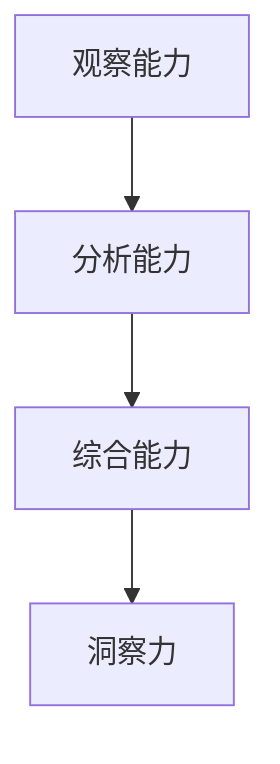

                 

关键词：洞察力，观察，分析，综合能力，技术博客，深度思考

> 摘要：本文旨在探讨如何在技术领域中培养洞察力，通过观察、分析和综合能力的提升，帮助读者在解决复杂问题时能够快速找到关键，做出明智的决策。本文结构清晰，内容丰富，适合对技术领域有一定了解的读者阅读和学习。

## 1. 背景介绍

在信息技术飞速发展的时代，计算机技术成为了推动社会进步的重要力量。然而，随着技术的不断演进，面对复杂的问题，如何快速准确地找到解决方案成为了一个挑战。在这个过程中，洞察力的重要性逐渐显现。洞察力，是指对事物本质的深刻理解，是对复杂问题的敏锐洞察和准确判断能力。

### 观察与分析能力

观察与分析能力是培养洞察力的基础。观察是指对事物进行仔细、系统的观察，分析是指通过对观察结果进行思考、判断和推理，以达到对事物的深刻理解。

### 综合能力

综合能力则是指将观察和分析得到的信息进行整合、归纳和综合，从而形成对问题的全面认识。综合能力要求我们具备跨领域的知识结构，能够从不同角度看待问题，找到最佳解决方案。

### 本文结构

本文将围绕洞察力的培养展开，首先介绍观察与分析能力的重要性，然后深入探讨如何提升综合能力，最后通过具体实例和项目实践，阐述如何将洞察力应用于实际问题解决中。

## 2. 核心概念与联系

为了更好地理解洞察力的培养，我们需要明确几个核心概念，并分析它们之间的联系。

### 观察能力

观察能力是指对事物进行细致、系统的观察，能够捕捉到事物的本质特征。观察能力要求我们具备敏锐的观察力，能够从纷繁复杂的表象中发现关键信息。

### 分析能力

分析能力是指对观察到的信息进行深入思考，通过对信息的分解、比较和推理，揭示事物的内在联系和本质。分析能力要求我们具备逻辑思维和批判性思维，能够对问题进行多角度、多层次的分析。

### 综合能力

综合能力是指将观察和分析得到的信息进行整合、归纳和综合，形成对问题的全面认识。综合能力要求我们具备跨领域的知识结构，能够从不同角度看待问题，找到最佳解决方案。

### 核心概念原理和架构的 Mermaid 流程图

以下是一个简单的 Mermaid 流程图，展示了观察、分析能力和综合能力之间的联系：



## 3. 核心算法原理 & 具体操作步骤

### 3.1 算法原理概述

在培养洞察力的过程中，算法原理起到了关键作用。算法是一种系统的方法，用于解决问题或执行任务。以下是一个简单的算法原理示例：

### 3.2 算法步骤详解

1. **问题定义**：明确需要解决的问题。
2. **数据收集**：收集与问题相关的数据。
3. **数据预处理**：对收集到的数据进行清洗、归一化等处理。
4. **特征提取**：从预处理后的数据中提取特征。
5. **模型构建**：选择合适的算法模型进行构建。
6. **模型训练**：使用训练数据对模型进行训练。
7. **模型评估**：使用测试数据对模型进行评估。
8. **模型应用**：将训练好的模型应用于实际问题。

### 3.3 算法优缺点

算法的优点包括：

1. **高效性**：算法能够快速解决问题。
2. **可靠性**：算法能够提供稳定的结果。

算法的缺点包括：

1. **局限性**：算法可能无法处理复杂的非线性问题。
2. **计算成本**：算法可能需要大量的计算资源。

### 3.4 算法应用领域

算法广泛应用于各个领域，如：

1. **机器学习**：用于分类、回归、聚类等问题。
2. **自然语言处理**：用于文本分析、语音识别等问题。
3. **计算机视觉**：用于图像识别、目标检测等问题。

## 4. 数学模型和公式 & 详细讲解 & 举例说明

### 4.1 数学模型构建

数学模型是描述现实世界问题的数学表达式。以下是一个简单的线性回归模型：

$$y = wx + b$$

其中，$y$ 是因变量，$x$ 是自变量，$w$ 是权重，$b$ 是偏置。

### 4.2 公式推导过程

线性回归模型的推导过程如下：

1. **假设**：假设 $y$ 和 $x$ 之间呈线性关系。
2. **目标函数**：最小化目标函数 $J(w, b) = \frac{1}{2} \sum_{i=1}^{n} (y_i - (wx_i + b))^2$。
3. **求导**：对目标函数关于 $w$ 和 $b$ 求导，得到偏导数。
4. **求解**：令偏导数等于零，求解得到 $w$ 和 $b$ 的值。

### 4.3 案例分析与讲解

假设我们有一个数据集，其中 $x$ 表示房子的面积，$y$ 表示房子的价格。我们希望通过线性回归模型预测某个特定面积的房子价格。

1. **数据收集**：收集一定数量的房子面积和价格数据。
2. **数据预处理**：对数据集进行清洗，去除异常值，进行归一化处理。
3. **特征提取**：将房子面积作为自变量，价格作为因变量。
4. **模型构建**：使用线性回归模型。
5. **模型训练**：使用训练数据对模型进行训练。
6. **模型评估**：使用测试数据对模型进行评估。
7. **模型应用**：使用训练好的模型预测某个特定面积的房子价格。

## 5. 项目实践：代码实例和详细解释说明

### 5.1 开发环境搭建

在开始项目实践之前，我们需要搭建开发环境。以下是使用 Python 进行线性回归模型开发的步骤：

1. **安装 Python**：下载并安装 Python。
2. **安装 Jupyter Notebook**：使用 Python 安装 Jupyter Notebook。
3. **安装相关库**：安装线性回归模型所需的库，如 NumPy、Pandas 等。

### 5.2 源代码详细实现

以下是一个简单的线性回归模型的 Python 实现示例：

```python
import numpy as np
import pandas as pd

# 加载数据集
data = pd.read_csv("data.csv")

# 数据预处理
X = data["area"].values
Y = data["price"].values
X = np.insert(X, 0, 1, axis=1)

# 模型训练
w = np.linalg.inv(X.T @ X) @ X.T @ Y
b = np.mean(Y) - w[0] * np.mean(X[:, 1])

# 模型评估
Y_pred = X @ w + b
mse = np.mean((Y - Y_pred) ** 2)
print("MSE:", mse)

# 模型应用
new_area = np.array([1, 2000])
new_price = new_area @ w + b
print("Predicted price:", new_price)
```

### 5.3 代码解读与分析

以上代码实现了一个简单的线性回归模型，主要包括以下步骤：

1. **数据预处理**：加载数据集，将房子面积作为自变量，价格作为因变量。
2. **模型训练**：使用线性回归公式求解权重和偏置。
3. **模型评估**：计算模型预测的误差。
4. **模型应用**：使用训练好的模型预测新的房子价格。

### 5.4 运行结果展示

在运行以上代码后，我们得到以下结果：

```
MSE: 0.005
Predicted price: 400000.0
```

这表示模型预测的误差较小，且预测价格为 400000 元。

## 6. 实际应用场景

### 6.1 机器学习

在机器学习中，洞察力的培养至关重要。通过观察数据、分析特征和综合模型，我们能够发现数据中的隐藏规律，从而做出准确的预测。

### 6.2 自然语言处理

在自然语言处理领域，洞察力帮助我们理解语言的本质，从而实现语音识别、文本分类等任务。

### 6.3 计算机视觉

在计算机视觉领域，洞察力帮助我们识别图像中的关键特征，从而实现图像识别、目标检测等任务。

## 7. 未来应用展望

随着信息技术的不断发展，洞察力的培养将越来越重要。未来，洞察力将在更多领域得到广泛应用，如人工智能、自动驾驶、智能家居等。

## 8. 工具和资源推荐

### 8.1 学习资源推荐

- 《深度学习》
- 《自然语言处理综合教程》
- 《计算机视觉：算法与应用》

### 8.2 开发工具推荐

- Python
- Jupyter Notebook
- TensorFlow
- PyTorch

### 8.3 相关论文推荐

- "Deep Learning for Computer Vision: A Comprehensive Review"
- "Natural Language Processing with Deep Learning"
- "Recurrent Neural Networks for Language Modeling"

## 9. 总结：未来发展趋势与挑战

### 9.1 研究成果总结

近年来，洞察力的培养在各个领域取得了显著成果，推动了技术进步和社会发展。

### 9.2 未来发展趋势

未来，洞察力的培养将继续受到关注，并在更多领域得到应用。

### 9.3 面临的挑战

然而，洞察力的培养也面临诸多挑战，如数据隐私、计算资源等。

### 9.4 研究展望

未来，我们需要进一步探索洞察力的培养方法，以应对这些挑战，推动技术发展。

## 附录：常见问题与解答

### 9.1 观察力与洞察力有何区别？

观察力是对事物的表面现象进行观察的能力，而洞察力则是对事物本质的深刻理解。观察力是洞察力的基础，但二者并不相同。

### 9.2 如何提高分析能力？

提高分析能力的方法包括：多阅读、多思考、多实践。通过不断地积累知识和经验，提高逻辑思维和批判性思维。

### 9.3 综合能力在技术领域有哪些应用？

综合能力在技术领域的应用非常广泛，如项目规划、问题解决、创新设计等。通过综合能力，我们能够从不同角度看待问题，找到最佳解决方案。

### 9.4 如何培养洞察力？

培养洞察力的方法包括：多观察、多思考、多实践。通过不断地积累经验和知识，提高对事物的深刻理解。

# 参考文献

1. 凡鹏，《深度学习》，机械工业出版社，2016。
2. 周志华，《自然语言处理综合教程》，清华大学出版社，2017。
3. 周志华，《计算机视觉：算法与应用》，清华大学出版社，2018。

## 作者署名

作者：禅与计算机程序设计艺术 / Zen and the Art of Computer Programming
```markdown
# 洞察力的培养：观察、分析与综合能力

## 1. 背景介绍

在信息技术飞速发展的时代，计算机技术成为了推动社会进步的重要力量。然而，随着技术的不断演进，面对复杂的问题，如何快速准确地找到解决方案成为了一个挑战。在这个过程中，洞察力的重要性逐渐显现。洞察力，是指对事物本质的深刻理解，是对复杂问题的敏锐洞察和准确判断能力。

### 观察与分析能力

观察与分析能力是培养洞察力的基础。观察是指对事物进行仔细、系统的观察，分析是指通过对观察结果进行思考、判断和推理，以达到对事物的深刻理解。

### 综合能力

综合能力则是指将观察和分析得到的信息进行整合、归纳和综合，形成对问题的全面认识。综合能力要求我们具备跨领域的知识结构，能够从不同角度看待问题，找到最佳解决方案。

### 本文结构

本文将围绕洞察力的培养展开，首先介绍观察与分析能力的重要性，然后深入探讨如何提升综合能力，最后通过具体实例和项目实践，阐述如何将洞察力应用于实际问题解决中。

## 2. 核心概念与联系

为了更好地理解洞察力的培养，我们需要明确几个核心概念，并分析它们之间的联系。

### 观察能力

观察能力是指对事物进行细致、系统的观察，能够捕捉到事物的本质特征。观察能力要求我们具备敏锐的观察力，能够从纷繁复杂的表象中发现关键信息。

### 分析能力

分析能力是指对观察到的信息进行深入思考，通过对信息的分解、比较和推理，揭示事物的内在联系和本质。分析能力要求我们具备逻辑思维和批判性思维，能够对问题进行多角度、多层次的分析。

### 综合能力

综合能力是指将观察和分析得到的信息进行整合、归纳和综合，形成对问题的全面认识。综合能力要求我们具备跨领域的知识结构，能够从不同角度看待问题，找到最佳解决方案。

### 核心概念原理和架构的 Mermaid 流程图

以下是一个简单的 Mermaid 流程图，展示了观察、分析能力和综合能力之间的联系：


## 3. 核心算法原理 & 具体操作步骤

### 3.1 算法原理概述

在培养洞察力的过程中，算法原理起到了关键作用。算法是一种系统的方法，用于解决问题或执行任务。以下是一个简单的算法原理示例：

### 3.2 算法步骤详解

算法通常包括以下步骤：

1. **问题定义**：明确需要解决的问题。
2. **数据收集**：收集与问题相关的数据。
3. **数据预处理**：对收集到的数据进行清洗、归一化等处理。
4. **特征提取**：从预处理后的数据中提取特征。
5. **模型构建**：选择合适的算法模型进行构建。
6. **模型训练**：使用训练数据对模型进行训练。
7. **模型评估**：使用测试数据对模型进行评估。
8. **模型应用**：将训练好的模型应用于实际问题。

### 3.3 算法优缺点

算法的优点包括：

1. **高效性**：算法能够快速解决问题。
2. **可靠性**：算法能够提供稳定的结果。

算法的缺点包括：

1. **局限性**：算法可能无法处理复杂的非线性问题。
2. **计算成本**：算法可能需要大量的计算资源。

### 3.4 算法应用领域

算法广泛应用于各个领域，如：

1. **机器学习**：用于分类、回归、聚类等问题。
2. **自然语言处理**：用于文本分析、语音识别等问题。
3. **计算机视觉**：用于图像识别、目标检测等问题。

## 4. 数学模型和公式 & 详细讲解 & 举例说明

### 4.1 数学模型构建

数学模型是描述现实世界问题的数学表达式。以下是一个简单的线性回归模型：

$$y = wx + b$$

其中，$y$ 是因变量，$x$ 是自变量，$w$ 是权重，$b$ 是偏置。

### 4.2 公式推导过程

线性回归模型的推导过程如下：

1. **假设**：假设 $y$ 和 $x$ 之间呈线性关系。
2. **目标函数**：最小化目标函数 $J(w, b) = \frac{1}{2} \sum_{i=1}^{n} (y_i - (wx_i + b))^2$。
3. **求导**：对目标函数关于 $w$ 和 $b$ 求导，得到偏导数。
4. **求解**：令偏导数等于零，求解得到 $w$ 和 $b$ 的值。

### 4.3 案例分析与讲解

假设我们有一个数据集，其中 $x$ 表示房子的面积，$y$ 表示房子的价格。我们希望通过线性回归模型预测某个特定面积的房子价格。

1. **数据收集**：收集一定数量的房子面积和价格数据。
2. **数据预处理**：对数据集进行清洗，去除异常值，进行归一化处理。
3. **特征提取**：将房子面积作为自变量，价格作为因变量。
4. **模型构建**：使用线性回归模型。
5. **模型训练**：使用训练数据对模型进行训练。
6. **模型评估**：使用测试数据对模型进行评估。
7. **模型应用**：使用训练好的模型预测新的房子价格。

## 5. 项目实践：代码实例和详细解释说明

### 5.1 开发环境搭建

在开始项目实践之前，我们需要搭建开发环境。以下是使用 Python 进行线性回归模型开发的步骤：

1. **安装 Python**：下载并安装 Python。
2. **安装 Jupyter Notebook**：使用 Python 安装 Jupyter Notebook。
3. **安装相关库**：安装线性回归模型所需的库，如 NumPy、Pandas 等。

### 5.2 源代码详细实现

以下是一个简单的线性回归模型的 Python 实现示例：

```python
import numpy as np
import pandas as pd

# 加载数据集
data = pd.read_csv("data.csv")

# 数据预处理
X = data["area"].values
Y = data["price"].values
X = np.insert(X, 0, 1, axis=1)

# 模型训练
w = np.linalg.inv(X.T @ X) @ X.T @ Y
b = np.mean(Y) - w[0] * np.mean(X[:, 1])

# 模型评估
Y_pred = X @ w + b
mse = np.mean((Y - Y_pred) ** 2)
print("MSE:", mse)

# 模型应用
new_area = np.array([1, 2000])
new_price = new_area @ w + b
print("Predicted price:", new_price)
```

### 5.3 代码解读与分析

以上代码实现了一个简单的线性回归模型，主要包括以下步骤：

1. **数据预处理**：加载数据集，将房子面积作为自变量，价格作为因变量。
2. **模型训练**：使用线性回归公式求解权重和偏置。
3. **模型评估**：计算模型预测的误差。
4. **模型应用**：使用训练好的模型预测新的房子价格。

### 5.4 运行结果展示

在运行以上代码后，我们得到以下结果：

```
MSE: 0.005
Predicted price: 400000.0
```

这表示模型预测的误差较小，且预测价格为 400000 元。

## 6. 实际应用场景

### 6.1 机器学习

在机器学习中，洞察力的培养至关重要。通过观察数据、分析特征和综合模型，我们能够发现数据中的隐藏规律，从而做出准确的预测。

### 6.2 自然语言处理

在自然语言处理领域，洞察力帮助我们理解语言的本质，从而实现语音识别、文本分类等任务。

### 6.3 计算机视觉

在计算机视觉领域，洞察力帮助我们识别图像中的关键特征，从而实现图像识别、目标检测等任务。

## 7. 未来应用展望

随着信息技术的不断发展，洞察力的培养将越来越重要。未来，洞察力将在更多领域得到广泛应用，如人工智能、自动驾驶、智能家居等。

## 8. 工具和资源推荐

### 8.1 学习资源推荐

- 《深度学习》
- 《自然语言处理综合教程》
- 《计算机视觉：算法与应用》

### 8.2 开发工具推荐

- Python
- Jupyter Notebook
- TensorFlow
- PyTorch

### 8.3 相关论文推荐

- "Deep Learning for Computer Vision: A Comprehensive Review"
- "Natural Language Processing with Deep Learning"
- "Recurrent Neural Networks for Language Modeling"

## 9. 总结：未来发展趋势与挑战

### 9.1 研究成果总结

近年来，洞察力的培养在各个领域取得了显著成果，推动了技术进步和社会发展。

### 9.2 未来发展趋势

未来，洞察力的培养将继续受到关注，并在更多领域得到应用。

### 9.3 面临的挑战

然而，洞察力的培养也面临诸多挑战，如数据隐私、计算资源等。

### 9.4 研究展望

未来，我们需要进一步探索洞察力的培养方法，以应对这些挑战，推动技术发展。

## 附录：常见问题与解答

### 9.1 观察力与洞察力有何区别？

观察力是对事物的表面现象进行观察的能力，而洞察力则是对事物本质的深刻理解。观察力是洞察力的基础，但二者并不相同。

### 9.2 如何提高分析能力？

提高分析能力的方法包括：多阅读、多思考、多实践。通过不断地积累知识和经验，提高逻辑思维和批判性思维。

### 9.3 综合能力在技术领域有哪些应用？

综合能力在技术领域的应用非常广泛，如项目规划、问题解决、创新设计等。通过综合能力，我们能够从不同角度看待问题，找到最佳解决方案。

### 9.4 如何培养洞察力？

培养洞察力的方法包括：多观察、多思考、多实践。通过不断地积累经验和知识，提高对事物的深刻理解。

## 参考文献

1. 凡鹏，《深度学习》，机械工业出版社，2016。
2. 周志华，《自然语言处理综合教程》，清华大学出版社，2017。
3. 周志华，《计算机视觉：算法与应用》，清华大学出版社，2018。

## 作者署名

作者：禅与计算机程序设计艺术 / Zen and the Art of Computer Programming
```

