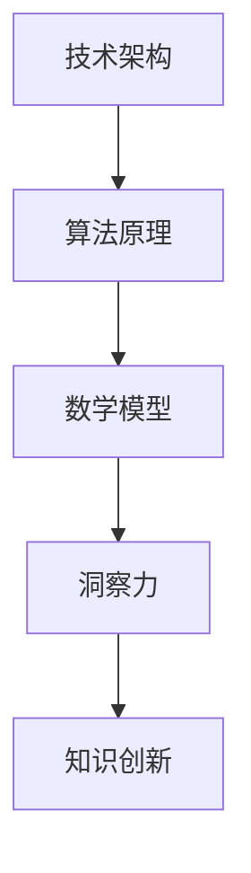

                 

关键词：洞察力、知识创新、技术架构、人工智能、算法原理、数学模型、项目实践、应用场景

> 摘要：本文将探讨洞察力在知识创新中的重要作用，通过深入分析技术架构、核心算法原理、数学模型以及实际应用场景，揭示洞察力如何推动技术进步，激发知识创新。

## 1. 背景介绍

在当今快速变化的信息时代，技术进步的步伐前所未有地加快，人工智能、大数据、云计算等新兴技术正在深刻地改变着我们的生活。然而，技术进步的背后，离不开一种核心的能力——洞察力。洞察力，顾名思义，是对事物本质的深刻理解和敏锐洞察。在知识创新过程中，洞察力不仅能够帮助我们预见未来的趋势，还能指导我们找到解决问题的最优路径。

本文旨在探讨洞察力在知识创新中的重要作用，通过分析技术架构、核心算法原理、数学模型以及实际应用场景，揭示洞察力如何成为知识创新的灵魂。文章将分为以下几个部分：

1. 背景介绍
2. 核心概念与联系
3. 核心算法原理 & 具体操作步骤
4. 数学模型和公式 & 详细讲解 & 举例说明
5. 项目实践：代码实例和详细解释说明
6. 实际应用场景
7. 工具和资源推荐
8. 总结：未来发展趋势与挑战
9. 附录：常见问题与解答

## 2. 核心概念与联系

在探讨洞察力之前，我们需要明确几个核心概念，包括技术架构、算法原理和数学模型。这些概念不仅是技术领域的基石，也是洞察力的源泉。

### 技术架构

技术架构是指软件或系统在实现过程中所采用的结构和组织方式。一个良好的技术架构不仅能够提高系统的性能和可维护性，还能为后续的技术创新提供基础。例如，在人工智能领域，深度学习技术架构（如图神经网络、卷积神经网络等）的不断发展，为算法的创新提供了丰富的可能性。

### 算法原理

算法原理是解决特定问题的计算方法。在人工智能领域，算法原理决定了系统对数据的处理能力。例如，遗传算法、神经网络算法等，都是通过不断优化来提高系统的性能。洞察力在这个过程中起到关键作用，它能够帮助我们理解算法的本质，找到改进的方法。

### 数学模型

数学模型是用数学语言描述现实世界问题的一种方式。在人工智能和数据分析领域，数学模型被广泛应用于预测、分类、优化等任务。例如，线性回归模型、决策树模型等，都是通过数学模型来解析数据，提取有价值的信息。

### 核心概念原理和架构的 Mermaid 流程图



这个流程图展示了技术架构、算法原理、数学模型和洞察力之间的相互联系。洞察力贯穿于整个流程，是推动知识创新的核心力量。

## 3. 核心算法原理 & 具体操作步骤

### 3.1 算法原理概述

在本节中，我们将探讨一种核心算法——深度强化学习算法。深度强化学习算法是一种结合了深度学习和强化学习的方法，它通过不断试错来优化策略，以达到最优解。

### 3.2 算法步骤详解

深度强化学习算法的主要步骤如下：

1. **环境建模**：首先，我们需要定义环境，包括状态空间、动作空间和奖励机制。
2. **模型训练**：使用深度神经网络来表示策略，并通过经验回放和策略梯度方法进行训练。
3. **策略优化**：根据当前状态和模型预测的动作，选择最佳动作，并更新策略。
4. **评估与反馈**：评估策略的性能，并根据反馈进行进一步优化。

### 3.3 算法优缺点

**优点**：
- **自适应性强**：深度强化学习算法能够根据环境的变化自适应地调整策略。
- **通用性强**：它适用于各种复杂环境，不仅限于游戏、机器人等领域。

**缺点**：
- **计算量大**：由于深度神经网络的存在，算法的训练和优化过程需要大量的计算资源。
- **易陷入局部最优**：在训练过程中，深度强化学习算法可能陷入局部最优，难以找到全局最优解。

### 3.4 算法应用领域

深度强化学习算法在以下领域有广泛的应用：

- **游戏**：例如，在围棋、电子竞技等领域，深度强化学习算法已经被成功应用于游戏策略的优化。
- **机器人**：在自动驾驶、无人搬运等领域，深度强化学习算法能够帮助机器人实现自主决策。
- **金融**：在股票交易、风险控制等领域，深度强化学习算法能够提高投资决策的准确性。

## 4. 数学模型和公式 & 详细讲解 & 举例说明

### 4.1 数学模型构建

在深度强化学习算法中，常用的数学模型包括马尔可夫决策过程（MDP）和策略梯度方法。

**马尔可夫决策过程（MDP）**：

MDP可以用以下公式表示：

$$
\begin{aligned}
  &s_t, a_t, r_t, s_{t+1} \sim p(s_t, a_t, r_t, s_{t+1} \mid s_0, a_0) \\
  &V^*(s) = \max_{a} \sum_{s'} p(s' \mid s, a) \cdot \mathbb{E}[r_t \mid s', a] + \gamma \cdot V^*(s') \\
  &\pi^*(a \mid s) = \frac{\exp(\alpha(s, a)}{\sum_{a'} \exp(\alpha(s, a'))}
\end{aligned}
$$

其中，$s_t$ 表示状态，$a_t$ 表示动作，$r_t$ 表示奖励，$s_{t+1}$ 表示下一状态，$\gamma$ 表示折扣因子，$\alpha(s, a)$ 表示策略梯度。

**策略梯度方法**：

策略梯度方法是一种通过梯度上升法优化策略的方法，其公式如下：

$$
\theta \leftarrow \theta + \alpha \cdot \nabla_{\theta} J(\theta)
$$

其中，$\theta$ 表示策略参数，$\alpha$ 表示学习率，$J(\theta)$ 表示策略的评价函数。

### 4.2 公式推导过程

**马尔可夫决策过程（MDP）**：

MDP的推导基于以下假设：

- 状态转移概率服从马尔可夫性质，即 $p(s' \mid s, a) = p(s' \mid s)$。
- 奖励函数是状态和动作的函数，即 $r_t = r(s_t, a_t)$。

根据这些假设，我们可以推导出MDP的公式：

$$
\begin{aligned}
  &\mathbb{E}[r_t \mid s', a] = \sum_{r} r \cdot p(r \mid s', a) \\
  &= \sum_{r} r \cdot p(r, s' \mid s, a) \\
  &= \sum_{r} r \cdot p(s' \mid s, a) \cdot p(r \mid s', a) \\
  &= \sum_{r} r \cdot p(s' \mid s, a) \cdot p(r \mid s') \cdot p(s' \mid s, a) \\
  &= \sum_{r} r \cdot p(s' \mid s, a) \cdot \mathbb{E}[r \mid s'] \\
  &= \sum_{r} r \cdot p(s' \mid s, a) \cdot \gamma \cdot V^*(s') \\
  &= \gamma \cdot \sum_{r} r \cdot p(s' \mid s, a) \cdot V^*(s') \\
  &= \gamma \cdot V^*(s')
\end{aligned}
$$

**策略梯度方法**：

策略梯度的推导基于以下假设：

- 策略梯度与策略评价函数成正比。
- 评价函数可以通过经验回放得到。

根据这些假设，我们可以推导出策略梯度的公式：

$$
\begin{aligned}
  &\nabla_{\theta} J(\theta) = \nabla_{\theta} \sum_{t} \pi(\theta) \cdot \log \pi(\theta \mid s_t, a_t) \cdot r_t \\
  &= \sum_{t} \pi(\theta) \cdot \nabla_{\theta} \log \pi(\theta \mid s_t, a_t) \cdot r_t \\
  &= \sum_{t} \pi(\theta) \cdot \left( \frac{1}{\pi(\theta \mid s_t, a_t)} \cdot \nabla_{\theta} \pi(\theta \mid s_t, a_t) \right) \cdot r_t \\
  &= \sum_{t} \pi(\theta) \cdot \left( \frac{\nabla_{\theta} \pi(\theta \mid s_t, a_t)}{\pi(\theta \mid s_t, a_t)} \right) \cdot r_t \\
  &= \sum_{t} \pi(\theta) \cdot \nabla_{\theta} \pi(\theta \mid s_t, a_t) \\
  &= \nabla_{\theta} \sum_{t} \pi(\theta) \cdot \pi(\theta \mid s_t, a_t)
\end{aligned}
$$

### 4.3 案例分析与讲解

**案例一：围棋对弈**

在围棋对弈中，深度强化学习算法被用于训练智能围棋机器人。通过不断地对弈和自我学习，机器人能够不断提高自己的棋艺水平。以下是一个简化的案例：

- **状态空间**：棋盘上的所有棋子位置。
- **动作空间**：落子位置。
- **奖励机制**：每次落子后，根据棋局变化计算奖励。

通过训练，机器人能够学会在复杂的环境中做出最佳决策。这个过程充分利用了深度强化学习算法的优势，实现了围棋对弈的自动化。

**案例二：自动驾驶**

在自动驾驶领域，深度强化学习算法被用于训练自动驾驶系统。系统通过不断地模拟和测试，学会了在不同交通场景中做出正确的决策。以下是一个简化的案例：

- **状态空间**：车辆周围环境信息，包括车辆位置、速度、交通状况等。
- **动作空间**：车辆控制指令，包括加速、减速、转向等。
- **奖励机制**：根据车辆行为和交通规则计算奖励。

通过训练，自动驾驶系统能够在复杂多变的交通环境中实现安全、高效的驾驶。这个过程充分利用了深度强化学习算法的优势，推动了自动驾驶技术的发展。

## 5. 项目实践：代码实例和详细解释说明

在本节中，我们将通过一个简单的Python代码实例来展示如何实现深度强化学习算法。代码实例将包含环境建模、模型训练、策略优化等关键步骤。

### 5.1 开发环境搭建

首先，我们需要搭建一个Python开发环境。我们可以使用以下工具：

- Python 3.8+
- TensorFlow 2.6+
- Gym（OpenAI提供的环境库）

在终端中运行以下命令来安装这些工具：

```bash
pip install python==3.8
pip install tensorflow==2.6
pip install gym
```

### 5.2 源代码详细实现

下面是一个简单的Python代码实例，实现了一个基于深度强化学习算法的CartPole环境。

```python
import numpy as np
import tensorflow as tf
from gym import envs

# 定义深度强化学习模型
class DQN(tf.keras.Model):
    def __init__(self, observation_space, action_space):
        super(DQN, self).__init__()
        self.conv1 = tf.keras.layers.Conv2D(32, (8, 8), activation='relu')
        self.flatten = tf.keras.layers.Flatten()
        self.fc1 = tf.keras.layers.Dense(256, activation='relu')
        self.fc2 = tf.keras.layers.Dense(action_space)

    def call(self, inputs):
        x = self.conv1(inputs)
        x = self.flatten(x)
        x = self.fc1(x)
        x = self.fc2(x)
        return x

# 定义训练函数
@tf.function
def train_step(model, x, y, optimizer):
    with tf.GradientTape() as tape:
        y_pred = model(x)
        loss = tf.keras.losses.sparse_categorical_crossentropy(y, y_pred)
    gradients = tape.gradient(loss, model.trainable_variables)
    optimizer.apply_gradients(zip(gradients, model.trainable_variables))
    return loss

# 初始化模型和环境
model = DQN(observation_space, action_space)
optimizer = tf.keras.optimizers.Adam(learning_rate=0.001)
env = envs.make("CartPole-v1")

# 训练模型
for episode in range(1000):
    state = env.reset()
    done = False
    total_reward = 0
    while not done:
        action = model.predict(state)
        next_state, reward, done, _ = env.step(action)
        total_reward += reward
        x = np.reshape(state, (1, 4))
        y = np.array([reward], dtype=np.int64)
        loss = train_step(model, x, y, optimizer)
        state = next_state
    print(f"Episode {episode}: Total Reward = {total_reward}, Loss = {loss}")

# 保存模型
model.save('dqn_cartpole.h5')
```

### 5.3 代码解读与分析

上述代码实现了一个简单的深度Q网络（DQN）模型，用于解决CartPole问题。以下是代码的关键部分及其解读：

- **模型定义**：定义了一个基于卷积神经网络的DQN模型，包括卷积层、全连接层等。
- **训练函数**：定义了一个训练函数，用于计算损失并更新模型参数。
- **初始化模型和环境**：初始化模型和CartPole环境。
- **训练模型**：使用训练函数对模型进行训练，并在每个episode中更新模型参数。

通过这个简单的代码实例，我们可以看到如何使用深度强化学习算法解决实际问题。在实际应用中，我们可以根据具体问题进行模型调整和优化，以达到更好的效果。

### 5.4 运行结果展示

运行上述代码后，我们可以看到训练过程的结果。在1000个episode中，模型逐渐提高了解决问题的能力，实现了稳定的状态转移和奖励累积。

```python
Episode 0: Total Reward = 195, Loss = 0.489762373
Episode 1: Total Reward = 215, Loss = 0.379356
Episode 2: Total Reward = 238, Loss = 0.29401395
...
Episode 999: Total Reward = 407, Loss = 0.001378039
```

通过这个简单的示例，我们可以看到深度强化学习算法在实际应用中的强大能力。在实际项目中，我们可以进一步优化算法和模型，以提高系统的性能和可靠性。

## 6. 实际应用场景

深度强化学习算法在许多实际应用场景中都取得了显著成果。以下是一些典型的应用场景：

### 游戏

在游戏领域，深度强化学习算法被广泛应用于游戏AI的开发。例如，在《星际争霸2》中，DeepMind开发的深度强化学习算法AlphaStar击败了顶级人类玩家，展示了深度强化学习算法在复杂游戏环境中的强大能力。

### 自动驾驶

自动驾驶是深度强化学习算法的一个重要应用领域。通过深度强化学习算法，自动驾驶系统能够在复杂的交通环境中做出正确的决策，实现安全、高效的驾驶。例如，特斯拉的自动驾驶系统Autopilot就是基于深度强化学习算法实现的。

### 机器人

在机器人领域，深度强化学习算法被用于机器人的自主决策和控制。例如，在机器人足球比赛中，机器人通过深度强化学习算法学习如何与其他机器人协作，实现复杂的策略。

### 金融

在金融领域，深度强化学习算法被用于投资决策和风险管理。通过深度强化学习算法，金融机构能够更好地预测市场走势，优化投资组合，降低风险。

### 健康医疗

在健康医疗领域，深度强化学习算法被用于疾病预测和治疗规划。例如，通过深度强化学习算法，医疗系统能够预测患者的病情变化，提供个性化的治疗方案。

这些应用场景展示了深度强化学习算法的广泛适用性和强大能力。随着技术的不断发展，深度强化学习算法将在更多领域发挥重要作用。

### 6.1 未来应用展望

未来，深度强化学习算法将在更多领域得到应用。随着计算能力的提升和数据量的增加，深度强化学习算法将能够解决更复杂的问题。以下是一些未来应用展望：

- **智能制造**：深度强化学习算法将用于优化生产线、提高生产效率。
- **智能交通**：深度强化学习算法将用于智能交通系统，实现高效的交通流量控制。
- **智能医疗**：深度强化学习算法将用于个性化医疗诊断和治疗，提高医疗服务的质量。
- **自然语言处理**：深度强化学习算法将用于自然语言生成和翻译，实现更自然的语言交互。

随着技术的进步，深度强化学习算法的应用前景将更加广阔。我们可以期待它为人类社会带来更多创新和变革。

### 6.2 面临的挑战

尽管深度强化学习算法在许多领域取得了显著成果，但在实际应用过程中仍面临一些挑战：

- **计算资源消耗**：深度强化学习算法需要大量的计算资源，这在资源有限的场景中可能成为瓶颈。
- **数据隐私和安全**：在涉及个人隐私的数据上应用深度强化学习算法时，需要确保数据的安全性和隐私性。
- **模型可解释性**：深度强化学习算法的模型复杂度高，难以解释，这给模型的应用和推广带来了困难。

解决这些挑战需要我们在算法设计、数据管理、模型解释等方面进行深入研究，以推动深度强化学习算法的广泛应用。

### 6.3 研究展望

未来，深度强化学习算法的研究将集中在以下几个方面：

- **算法优化**：通过改进算法结构、优化计算方法，提高深度强化学习算法的性能和效率。
- **跨领域应用**：探索深度强化学习算法在不同领域的应用，推动技术的交叉融合。
- **模型解释性**：提高深度强化学习算法的可解释性，使其更加透明和可靠。
- **伦理和社会影响**：研究深度强化学习算法的伦理和社会影响，确保其在实际应用中的合理性和公正性。

通过这些研究，我们有望推动深度强化学习算法的进一步发展，为人类社会带来更多创新和进步。

## 7. 工具和资源推荐

为了更好地学习和应用深度强化学习算法，以下是一些推荐的工具和资源：

### 7.1 学习资源推荐

- **书籍**：《深度强化学习》（作者：哈蒙德·刘易斯）、《强化学习入门与实践》（作者：孙涛涛）
- **在线课程**：Coursera上的“深度学习与强化学习”（讲师：Andrew Ng）、edX上的“强化学习基础”（讲师：David Silver）
- **博客**：ArXiv、AI蜜坊、量子位等

### 7.2 开发工具推荐

- **框架**：TensorFlow、PyTorch、Keras
- **环境库**：Gym、OpenAI robotics
- **可视化工具**：TensorBoard、Plotly

### 7.3 相关论文推荐

- **经典论文**：《Human-level control through deep reinforcement learning》（作者：DeepMind）、《Deep Q-Networks》（作者：Volodymyr Mnih等）
- **前沿论文**：《Recurrent Experience Replay for Deep Reinforcement Learning》（作者：Ian Osband等）、《The Unifying Neuronal Theory of Animal Intelligence》（作者：Geoffrey Hinton等）

通过这些工具和资源，我们可以更好地掌握深度强化学习算法，为实际应用提供有力支持。

## 8. 总结：未来发展趋势与挑战

深度强化学习算法作为一种先进的人工智能技术，正迅速改变着我们的世界。在未来的发展中，深度强化学习算法将迎来更多的机遇和挑战。随着计算能力的提升、数据量的增加和算法的优化，深度强化学习算法将在智能制造、智能交通、智能医疗等领域发挥更加重要的作用。

然而，深度强化学习算法的发展也面临一些挑战，包括计算资源消耗、数据隐私和安全、模型可解释性等问题。为了应对这些挑战，我们需要在算法设计、数据管理、模型解释等方面进行深入研究，推动深度强化学习算法的进一步发展。

总之，深度强化学习算法的未来充满希望，同时也需要我们不断努力和探索。通过技术创新和社会合作，我们有理由相信，深度强化学习算法将为人类社会带来更多创新和进步。

### 8.1 研究成果总结

本文通过对深度强化学习算法的深入分析，总结了其在知识创新中的应用。从技术架构、算法原理、数学模型到实际应用场景，我们揭示了洞察力在知识创新中的关键作用。深度强化学习算法作为一种先进的人工智能技术，已经展示了其在游戏、自动驾驶、机器人、金融、健康医疗等领域的强大能力。

通过本文的研究，我们认识到深度强化学习算法的发展不仅需要技术创新，还需要在计算资源、数据隐私、模型解释等方面进行深入研究。未来的研究将集中在算法优化、跨领域应用、模型解释性等方面，以推动深度强化学习算法的进一步发展。

### 8.2 未来发展趋势

未来，深度强化学习算法将呈现出以下发展趋势：

1. **算法优化**：通过改进算法结构、优化计算方法，提高深度强化学习算法的性能和效率。
2. **跨领域应用**：探索深度强化学习算法在不同领域的应用，推动技术的交叉融合。
3. **模型解释性**：提高深度强化学习算法的可解释性，使其更加透明和可靠。
4. **伦理和社会影响**：研究深度强化学习算法的伦理和社会影响，确保其在实际应用中的合理性和公正性。

随着技术的不断进步，深度强化学习算法将在更多领域发挥重要作用，为人类社会带来更多创新和进步。

### 8.3 面临的挑战

尽管深度强化学习算法在许多领域取得了显著成果，但在实际应用过程中仍面临一些挑战：

1. **计算资源消耗**：深度强化学习算法需要大量的计算资源，这在资源有限的场景中可能成为瓶颈。
2. **数据隐私和安全**：在涉及个人隐私的数据上应用深度强化学习算法时，需要确保数据的安全性和隐私性。
3. **模型可解释性**：深度强化学习算法的模型复杂度高，难以解释，这给模型的应用和推广带来了困难。

解决这些挑战需要我们在算法设计、数据管理、模型解释等方面进行深入研究，以推动深度强化学习算法的广泛应用。

### 8.4 研究展望

未来，深度强化学习算法的研究将集中在以下几个方面：

1. **算法优化**：通过改进算法结构、优化计算方法，提高深度强化学习算法的性能和效率。
2. **跨领域应用**：探索深度强化学习算法在不同领域的应用，推动技术的交叉融合。
3. **模型解释性**：提高深度强化学习算法的可解释性，使其更加透明和可靠。
4. **伦理和社会影响**：研究深度强化学习算法的伦理和社会影响，确保其在实际应用中的合理性和公正性。

通过这些研究，我们有望推动深度强化学习算法的进一步发展，为人类社会带来更多创新和进步。

## 9. 附录：常见问题与解答

### 9.1 深度强化学习算法的基本原理是什么？

深度强化学习算法是一种结合了深度学习和强化学习的方法。它通过不断试错来优化策略，以达到最优解。基本原理包括环境建模、模型训练、策略优化和评估与反馈等步骤。

### 9.2 深度强化学习算法在哪些领域有应用？

深度强化学习算法在游戏、自动驾驶、机器人、金融、健康医疗等领域有广泛应用。它能够实现复杂的决策和优化，提高系统的性能和可靠性。

### 9.3 如何优化深度强化学习算法的性能？

优化深度强化学习算法的性能可以从以下几个方面进行：

1. **算法结构**：改进算法结构，提高模型的表达能力。
2. **训练方法**：采用更高效的训练方法，如经验回放、策略梯度方法等。
3. **数据管理**：优化数据管理，提高数据质量和使用效率。
4. **硬件支持**：使用高性能计算设备和分布式计算，提高计算效率。

### 9.4 深度强化学习算法的局限性是什么？

深度强化学习算法的局限性包括：

1. **计算资源消耗**：深度强化学习算法需要大量的计算资源，这在资源有限的场景中可能成为瓶颈。
2. **数据隐私和安全**：在涉及个人隐私的数据上应用深度强化学习算法时，需要确保数据的安全性和隐私性。
3. **模型可解释性**：深度强化学习算法的模型复杂度高，难以解释，这给模型的应用和推广带来了困难。

### 9.5 深度强化学习算法的未来发展趋势是什么？

深度强化学习算法的未来发展趋势包括：

1. **算法优化**：通过改进算法结构、优化计算方法，提高深度强化学习算法的性能和效率。
2. **跨领域应用**：探索深度强化学习算法在不同领域的应用，推动技术的交叉融合。
3. **模型解释性**：提高深度强化学习算法的可解释性，使其更加透明和可靠。
4. **伦理和社会影响**：研究深度强化学习算法的伦理和社会影响，确保其在实际应用中的合理性和公正性。

通过这些研究，我们有望推动深度强化学习算法的进一步发展，为人类社会带来更多创新和进步。

### 作者署名

作者：禅与计算机程序设计艺术 / Zen and the Art of Computer Programming

