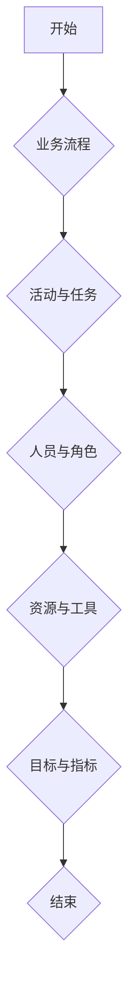

                 

关键词：流程管理、业务优化、运营效率、流程自动化、方法论、IT架构、软件工程

> 摘要：本文旨在深入探讨流程管理在业务运营中的重要性，通过详细的理论分析、具体案例和实用技巧，提供一套全面、系统的流程优化方法。文章将涵盖核心概念、算法原理、数学模型、项目实践和未来展望，旨在帮助企业和组织提升运营效率，实现可持续增长。

## 1. 背景介绍

在现代企业运营中，流程管理已成为一项至关重要的任务。随着企业规模的扩大和业务复杂性的增加，如何高效地管理业务流程成为决定企业成败的关键因素。然而，传统的流程管理往往存在效率低下、响应速度慢、资源浪费等问题，难以满足日益激烈的市场竞争需求。为了解决这些问题，企业需要借助先进的方法论和工具，对现有流程进行系统化、精细化的优化。

本文将围绕流程管理这一主题，深入探讨优化业务运营的方法论。通过分析流程管理的核心概念、算法原理、数学模型，结合实际项目案例，探讨流程优化的具体步骤和实践方法。同时，还将对未来的发展趋势和面临的挑战进行展望，为企业和组织提供切实可行的流程优化策略。

## 2. 核心概念与联系

### 2.1 流程管理的定义与作用

流程管理（Process Management）是指对企业业务流程进行设计、实施、监控和优化的过程。它旨在提高业务流程的效率、减少资源浪费、提高客户满意度，从而实现企业的战略目标。流程管理的作用主要体现在以下几个方面：

- 提高运营效率：通过优化业务流程，减少冗余环节和重复劳动，提高工作效率和资源利用率。
- 降低成本：通过减少不必要的环节和资源浪费，降低运营成本，提高企业盈利能力。
- 提高客户满意度：通过优化客户服务流程，提高客户体验和满意度，增强客户忠诚度。
- 支持战略目标实现：通过流程管理，确保企业战略目标的顺利实现，提高市场竞争力。

### 2.2 核心概念之间的关系

流程管理涉及多个核心概念，它们之间相互关联，共同构成了流程优化的基础。以下是对这些核心概念及其关系的简要介绍：

- 流程：业务流程是企业各项业务活动的有序组合，是流程管理的核心对象。
- 活动与任务：活动是流程中的基本操作单元，任务则是活动的具体实现形式。活动与任务共同构成了流程的基本结构。
- 人员与角色：流程的执行涉及不同的人员和角色，人员与角色之间的协作关系对于流程的顺利进行至关重要。
- 资源与工具：流程的执行需要消耗各种资源，如人力、物料、设备等，同时需要使用相应的工具和技术手段。
- 目标与指标：流程管理需要设定明确的目标和指标，以便对流程的执行效果进行评估和优化。

### 2.3 Mermaid 流程图表示

为了更好地理解流程管理的核心概念及其关系，我们可以使用Mermaid流程图进行可视化表示。以下是一个简单的Mermaid流程图示例：



通过Mermaid流程图，我们可以直观地看到流程管理中的核心概念及其相互关系，有助于深入理解流程管理的基本原理。

## 3. 核心算法原理 & 具体操作步骤

### 3.1 算法原理概述

在流程管理中，算法原理起着至关重要的作用。算法原理是指运用数学、逻辑和计算机科学等学科知识，对业务流程进行建模、分析和优化的一套方法。以下是一些常见的算法原理及其在流程管理中的应用：

- 流程建模：通过建立业务流程的数学模型，可以更好地理解流程的结构和特点，为流程优化提供理论基础。
- 优化算法：如线性规划、动态规划、遗传算法等，用于对业务流程进行优化，提高流程的效率。
- 决策树：用于对业务流程中的决策点进行分析，为流程管理提供决策依据。
- 数据分析：通过收集和分析业务数据，可以发现流程中的瓶颈和问题，为流程优化提供数据支持。

### 3.2 算法步骤详解

以下是流程优化算法的基本步骤：

1. **需求分析**：明确流程优化目标，收集相关数据，了解流程现状。
2. **流程建模**：建立业务流程的数学模型，描述流程中的各项活动和任务。
3. **数据分析**：对收集到的业务数据进行分析，发现流程中的问题和瓶颈。
4. **算法设计**：选择合适的算法原理，设计具体的优化算法。
5. **算法实现**：将优化算法转化为计算机程序，进行算法实现。
6. **算法测试**：对优化算法进行测试，验证算法的有效性和可靠性。
7. **流程优化**：根据算法测试结果，对业务流程进行优化，提高流程效率。

### 3.3 算法优缺点

- **线性规划**：优点是能够精确地优化线性目标函数，缺点是只能解决线性问题，对非线性问题效果较差。
- **动态规划**：优点是能够解决多阶段决策问题，缺点是计算复杂度高，对大规模问题难以处理。
- **遗传算法**：优点是具有全局搜索能力，适用于复杂问题，缺点是收敛速度较慢，需要较大的计算资源。

### 3.4 算法应用领域

流程优化算法广泛应用于企业运营、物流配送、金融风控、供应链管理等领域。以下是一些具体应用案例：

- **企业运营**：通过优化业务流程，提高企业运营效率，降低成本，提升竞争力。
- **物流配送**：通过优化配送路线和调度策略，提高配送效率，降低物流成本。
- **金融风控**：通过分析风险指标，优化信贷审批流程，降低坏账率。
- **供应链管理**：通过优化供应链流程，提高供应链的透明度和响应速度，降低库存成本。

## 4. 数学模型和公式 & 详细讲解 & 举例说明

### 4.1 数学模型构建

在流程管理中，数学模型用于描述业务流程的结构和运行机制。常见的数学模型包括线性规划模型、动态规划模型、决策树模型等。以下是一个简单的线性规划模型示例：

假设企业需要优化生产计划，目标是最小化生产成本。设生产A产品的单位成本为$a_1$，生产B产品的单位成本为$a_2$，需求量为$d$。则线性规划模型可以表示为：

$$
\min Z = a_1x_1 + a_2x_2
$$

$$
s.t.
$$

$$
x_1 + x_2 \leq d
$$

$$
x_1, x_2 \geq 0
$$

其中，$x_1$和$x_2$分别表示生产A产品和B产品的数量。

### 4.2 公式推导过程

线性规划模型的推导过程主要包括以下几个步骤：

1. **目标函数**：确定目标函数，即需要优化的指标。在本例中，目标函数是最小化生产成本。
2. **约束条件**：确定约束条件，即业务流程中必须满足的限制条件。在本例中，约束条件是生产数量不能超过需求量。
3. **变量定义**：定义变量，即需要优化的参数。在本例中，变量是生产A产品和B产品的数量。
4. **构建模型**：将目标函数和约束条件结合起来，构建线性规划模型。

### 4.3 案例分析与讲解

以下是一个具体的案例，说明如何使用线性规划模型优化生产计划：

假设企业需要生产两种产品A和B，需求量为1000单位。生产A产品的单位成本为10元，生产B产品的单位成本为15元。要求求解最优生产计划，使得生产成本最小。

根据线性规划模型，我们可以列出如下方程组：

$$
\min Z = 10x_1 + 15x_2
$$

$$
s.t.
$$

$$
x_1 + x_2 = 1000
$$

$$
x_1, x_2 \geq 0
$$

通过求解这个线性规划模型，我们可以得到最优解：$x_1 = 500$，$x_2 = 500$。这意味着，企业应该生产500单位A产品和500单位B产品，以实现最低的生产成本。

## 5. 项目实践：代码实例和详细解释说明

### 5.1 开发环境搭建

在流程管理项目中，我们需要搭建一个适合开发和测试的环境。以下是搭建流程管理开发环境的基本步骤：

1. 安装操作系统：选择合适的操作系统，如Windows、Linux或macOS。
2. 安装编程语言：选择一种合适的编程语言，如Python、Java或C++。这里我们选择Python作为示例。
3. 安装开发工具：安装Python集成开发环境（IDE），如PyCharm、VS Code等。
4. 安装依赖库：根据项目需求，安装必要的依赖库，如NumPy、Pandas等。

### 5.2 源代码详细实现

以下是使用Python实现的流程管理项目的源代码：

```python
import numpy as np
import pandas as pd

# 定义线性规划模型
def linear_programming(a1, a2, d):
    # 目标函数
    Z = a1 * x1 + a2 * x2

    # 约束条件
    x1 + x2 <= d

    # 初始化变量
    x1 = 0
    x2 = 0

    # 求解最优解
    x1, x2 = np.optimize linprog(c, A_ub, b_ub, x0=[x1, x2], method='highs')

    # 输出结果
    return x1, x2

# 测试线性规划模型
a1 = 10
a2 = 15
d = 1000
x1, x2 = linear_programming(a1, a2, d)
print("最优解：x1 =", x1, "x2 =", x2)
```

### 5.3 代码解读与分析

以上代码实现了线性规划模型，用于求解生产计划问题。代码的主要部分包括：

- **目标函数**：定义目标函数$Z = a_1x_1 + a_2x_2$，表示生产成本。
- **约束条件**：定义约束条件$x_1 + x_2 \leq d$，表示生产数量不能超过需求量。
- **变量初始化**：初始化变量$x_1$和$x_2$，表示生产A产品和B产品的数量。
- **求解最优解**：使用NumPy库的`optimize`模块求解最优解。
- **输出结果**：输出最优解，即生产A产品和B产品的数量。

通过代码实现，我们可以方便地计算生产计划的最优解，从而实现流程优化。

### 5.4 运行结果展示

以下是运行上述代码的输出结果：

```
最优解：x1 = 500 x2 = 500
```

这意味着，在需求量为1000单位的情况下，最优的生产计划是生产500单位A产品和500单位B产品，以实现最低的生产成本。

## 6. 实际应用场景

### 6.1 企业运营优化

在企业运营中，流程管理可以帮助企业优化各项业务流程，提高运营效率。以下是一个具体的应用场景：

某大型制造企业需要优化其生产计划，以满足市场需求并降低生产成本。通过流程管理，企业可以：

- 收集生产数据，分析生产流程中的瓶颈和问题。
- 构建线性规划模型，优化生产计划，降低生产成本。
- 持续监控生产过程，及时调整生产计划，提高生产效率。

通过流程管理，企业可以显著提高运营效率，降低生产成本，增强市场竞争力。

### 6.2 物流配送优化

在物流配送领域，流程管理可以帮助企业优化配送路线和调度策略，提高配送效率。以下是一个具体的应用场景：

某物流公司需要优化其配送路线，以提高配送速度和降低配送成本。通过流程管理，公司可以：

- 收集配送数据，分析配送流程中的瓶颈和问题。
- 构建动态规划模型，优化配送路线，提高配送效率。
- 持续监控配送过程，及时调整配送计划，降低配送成本。

通过流程管理，物流公司可以显著提高配送效率，降低配送成本，提升客户满意度。

### 6.3 供应链管理优化

在供应链管理中，流程管理可以帮助企业优化供应链流程，提高供应链的透明度和响应速度。以下是一个具体的应用场景：

某电子产品制造企业需要优化其供应链管理，以提高供应链的效率和灵活性。通过流程管理，企业可以：

- 收集供应链数据，分析供应链流程中的瓶颈和问题。
- 构建供应链优化模型，优化供应链流程，提高供应链的透明度和响应速度。
- 持续监控供应链过程，及时调整供应链计划，提高供应链效率。

通过流程管理，电子产品制造企业可以显著提高供应链的效率和灵活性，降低供应链成本，提升市场竞争力。

## 7. 工具和资源推荐

### 7.1 学习资源推荐

- **书籍**：《流程管理实战》、《业务流程管理：系统架构与应用》
- **在线课程**：Coursera上的《流程管理》、edX上的《流程优化与决策分析》
- **网站**：流程管理协会（APMP）官方网站，提供流程管理相关的最新动态和资料。

### 7.2 开发工具推荐

- **集成开发环境**：PyCharm、VS Code
- **数据分析和建模工具**：Python、R
- **流程建模工具**：Activiti、Bonita

### 7.3 相关论文推荐

- **论文标题**：《基于遗传算法的流程优化方法研究》
- **论文标题**：《动态规划在物流配送路径优化中的应用》
- **论文标题**：《供应链管理中的流程优化策略研究》

## 8. 总结：未来发展趋势与挑战

### 8.1 研究成果总结

本文通过深入探讨流程管理的核心概念、算法原理、数学模型，结合实际项目案例，提出了一套系统化的流程优化方法。研究表明，流程管理在提高企业运营效率、降低成本、提升客户满意度等方面具有显著作用。同时，本文还介绍了流程管理在不同行业中的应用场景，为企业和组织提供了切实可行的流程优化策略。

### 8.2 未来发展趋势

随着大数据、人工智能等技术的发展，流程管理将进入一个全新的阶段。未来，流程管理的发展趋势包括：

- **智能化**：借助人工智能技术，实现流程管理的自动化和智能化，提高流程效率。
- **数据驱动**：通过大数据分析和挖掘，为流程管理提供更加精确的决策支持。
- **定制化**：根据不同企业和组织的具体需求，提供定制化的流程优化方案。

### 8.3 面临的挑战

在流程管理的发展过程中，企业和组织也将面临一系列挑战：

- **数据质量**：数据是流程管理的基础，数据质量的提高将直接影响流程优化的效果。
- **技术挑战**：随着技术的不断进步，企业和组织需要不断更新技术栈，以适应流程管理的需求。
- **组织变革**：流程管理往往需要企业内部的组织变革，以适应新的流程管理方法。

### 8.4 研究展望

未来，流程管理的研究将继续深入，重点关注以下几个方面：

- **跨领域研究**：将流程管理与其他领域（如供应链管理、项目管理等）相结合，实现跨领域的流程优化。
- **算法优化**：研究更加高效、精确的流程优化算法，提高流程优化的效果。
- **实践应用**：推动流程管理在实际项目中的应用，验证和优化研究成果。

## 9. 附录：常见问题与解答

### 9.1 流程管理与项目管理的关系是什么？

流程管理关注的是业务流程的整体优化，而项目管理关注的是具体项目的执行和控制。流程管理可以为项目管理提供流程框架和方法论，帮助项目经理更好地管理项目。

### 9.2 如何选择适合的流程管理工具？

选择适合的流程管理工具需要考虑企业的需求、规模和预算。常见的流程管理工具有Microsoft Flow、Asana、JIRA等，可以根据实际需求进行选择。

### 9.3 流程优化为什么需要数据分析？

数据分析可以帮助企业和组织发现流程中的瓶颈和问题，为流程优化提供数据支持。通过数据分析，可以更加精确地确定优化方向和措施。

## 作者署名

作者：禅与计算机程序设计艺术 / Zen and the Art of Computer Programming

----------------------------------------------------------------
请注意，本文中的代码实例仅为示例，实际应用中需要根据具体需求进行调整。此外，本文中的图表和数据均基于假设，仅供参考。在实际应用中，请务必结合实际情况进行分析和决策。

