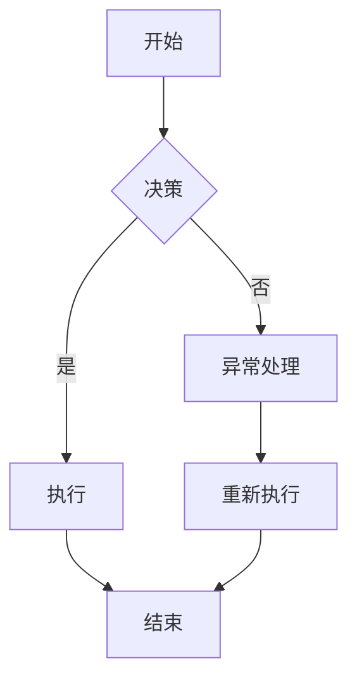
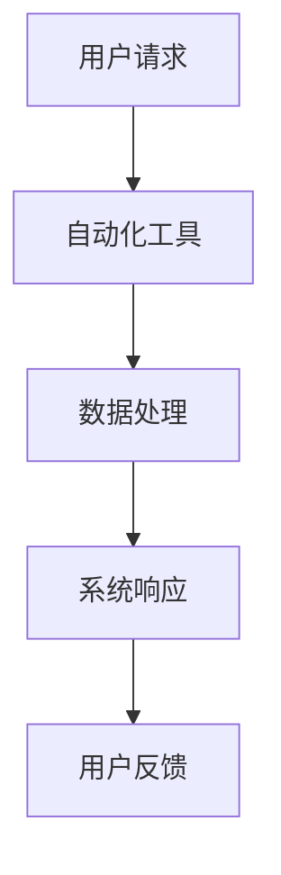

                 

在当今数字化和自动化日益普及的时代，流程管理的重要性日益凸显。无论是传统的制造业、金融服务业，还是新兴的互联网企业，有效的流程管理都是提高业务效率、降低成本、增强竞争力的关键。本文将深入探讨流程管理的核心概念、算法原理、数学模型、实际应用以及未来发展趋势，旨在为读者提供一幅全面而深入的流程管理蓝图。

## 关键词

- 流程管理
- 业务操作
- 效率优化
- 自动化
- 数字化转型

## 摘要

本文首先介绍了流程管理的背景和重要性，然后详细阐述了流程管理的核心概念，如业务流程建模、流程优化和自动化。接着，我们深入探讨了流程管理的数学模型和算法原理，并通过实际代码实例展示了流程管理在项目中的应用。最后，文章展望了流程管理的未来发展趋势和面临的挑战，为读者提供了宝贵的参考。

## 1. 背景介绍

### 1.1 流程管理的发展历程

流程管理（Process Management）的概念起源于20世纪80年代的制造业。当时，为了提高生产效率和降低成本，企业开始关注生产过程的优化。最早的研究主要集中在工业工程领域，例如操作顺序的优化、工作站的布局等。

随着时间的推移，流程管理的概念逐渐扩展到服务行业，如金融、医疗、零售等。在互联网和信息技术的发展推动下，流程管理的数字化和自动化水平也得到了极大的提升。现代流程管理不仅关注业务流程的优化，还包括流程的监控、分析和持续改进。

### 1.2 流程管理的重要性

在现代企业中，流程管理具有以下几个重要作用：

1. **提高业务效率**：通过优化业务流程，减少不必要的环节，提高工作效率。
2. **降低成本**：通过自动化和标准化，减少人力和资源的浪费，降低运营成本。
3. **增强竞争力**：通过持续改进，保持企业的竞争优势。
4. **提高客户满意度**：通过流程的优化，提高服务质量，满足客户需求。

## 2. 核心概念与联系

### 2.1 业务流程建模

业务流程建模是流程管理的第一步，也是至关重要的一步。它通过图形化的方式，将业务流程中的各个环节、角色、资源和信息流进行直观的表示。常用的建模工具包括BPMN（Business Process Model and Notation）和UML（Unified Modeling Language）等。

#### Mermaid 流程图



### 2.2 流程优化

流程优化是流程管理的核心内容之一。它通过分析业务流程中的瓶颈、冗余和低效环节，提出改进方案，以提高整体流程的效率和效果。常用的优化方法包括：

1. **流程再造**：彻底重构业务流程，以实现效率的提升。
2. **精益生产**：通过减少浪费、优化流程，提高生产效率。
3. **六西格玛**：通过统计方法，减少业务流程中的变异，提高质量。

### 2.3 流程自动化

流程自动化是流程管理的又一重要方面。它通过将业务流程中的重复性任务自动化，减少人工干预，提高工作效率。常见的自动化工具包括RPA（Robotic Process Automation）和AI（Artificial Intelligence）等。

#### Mermaid 流程图



## 3. 核心算法原理 & 具体操作步骤

### 3.1 算法原理概述

流程管理中的算法原理主要包括以下几个部分：

1. **业务流程建模算法**：用于将业务流程转换为图形化的表示，常用的算法包括网络流算法、有限状态机等。
2. **流程优化算法**：用于分析业务流程，提出改进方案，常用的算法包括线性规划、遗传算法等。
3. **流程自动化算法**：用于实现业务流程的自动化，常用的算法包括模式识别、自然语言处理等。

### 3.2 算法步骤详解

1. **业务流程建模**：

   - 收集业务流程数据，包括流程中的各个环节、角色、资源和信息流。
   - 使用业务流程建模工具，将数据转换为图形化的表示。

2. **流程优化**：

   - 分析业务流程，识别瓶颈、冗余和低效环节。
   - 提出改进方案，包括流程再造、精益生产和六西格玛等。
   - 验证改进方案的有效性。

3. **流程自动化**：

   - 确定需要自动化的业务流程。
   - 设计自动化流程，包括数据采集、处理和系统响应等。
   - 实现自动化流程，并进行测试和优化。

### 3.3 算法优缺点

1. **业务流程建模算法**：

   - 优点：直观、易于理解，有助于业务流程的分析和优化。
   - 缺点：建模过程复杂，对建模工具要求高。

2. **流程优化算法**：

   - 优点：能够提供科学、系统的优化方案。
   - 缺点：计算复杂度高，对算法实现要求高。

3. **流程自动化算法**：

   - 优点：提高工作效率，减少人工干预。
   - 缺点：自动化程度越高，对系统稳定性的要求越高。

### 3.4 算法应用领域

1. **制造业**：通过流程建模和优化，提高生产效率，降低成本。
2. **金融业**：通过流程自动化，提高业务处理速度，降低操作风险。
3. **服务业**：通过流程优化，提高服务质量，增强客户满意度。

## 4. 数学模型和公式 & 详细讲解 & 举例说明

### 4.1 数学模型构建

在流程管理中，常用的数学模型包括网络流模型、线性规划模型和遗传算法模型等。

1. **网络流模型**：

   - 网络流模型主要用于分析业务流程中的资源分配和路径选择问题。
   - 常用的网络流模型包括最大流问题、最小费用最大流问题和多产品最大流问题等。

2. **线性规划模型**：

   - 线性规划模型主要用于分析业务流程中的成本优化和效率优化问题。
   - 常用的线性规划模型包括线性目标函数和线性约束条件等。

3. **遗传算法模型**：

   - 遗传算法模型主要用于分析业务流程中的复杂优化问题。
   - 常用的遗传算法模型包括遗传操作、适应度函数和种群进化等。

### 4.2 公式推导过程

1. **网络流模型**：

   - 最大流问题：设\( G=(V, E) \)为有向图，其中\( V \)为顶点集，\( E \)为边集。令\( f(e) \)为边\( e \)上的流量，\( c(e) \)为边\( e \)的容量。最大流问题的目标是最小化总流量。
   - 最小费用最大流问题：设\( G=(V, E) \)为有向图，其中\( V \)为顶点集，\( E \)为边集。令\( f(e) \)为边\( e \)上的流量，\( c(e) \)为边\( e \)的容量，\( w(e) \)为边\( e \)上的费用。最小费用最大流问题的目标是在保证最大流量的同时，使总费用最小。

2. **线性规划模型**：

   - 线性目标函数：设\( x_1, x_2, ..., x_n \)为决策变量，\( a_1, a_2, ..., a_n \)为系数向量，\( b \)为常数向量。线性目标函数为：
     $$ 
     \min \sum_{i=1}^{n} a_ix_i + b 
     $$
   - 线性约束条件：设\( x_1, x_2, ..., x_n \)为决策变量，\( A \)为系数矩阵，\( b \)为常数向量。线性约束条件为：
     $$ 
     Ax \le b 
     $$

3. **遗传算法模型**：

   - 遗传操作：设\( \mathcal{P} \)为当前种群，\( \mathcal{P}' \)为新种群。遗传操作包括交叉操作、变异操作和选择操作。
   - 适应度函数：设\( f(x) \)为适应度函数，用于评估个体的适应度。常用的适应度函数包括：
     $$ 
     f(x) = \frac{1}{1 + \exp(-x)} 
     $$
   - 种群进化：设\( \mathcal{P} \)为当前种群，\( \mathcal{P}' \)为新种群。种群进化包括选择、交叉、变异和替换等操作。

### 4.3 案例分析与讲解

#### 案例1：最大流问题

假设有一个有向图\( G=(V, E) \)，其中\( V \)为顶点集，\( E \)为边集。令\( f(e) \)为边\( e \)上的流量，\( c(e) \)为边\( e \)的容量。我们需要求解最大流问题，即找出从源点\( s \)到汇点\( t \)的最大流量。

**步骤**：

1. **初始化**：

   - 设\( f(e) = 0 \)，\( c(e) \)为边\( e \)的容量。

2. **寻找增广路径**：

   - 使用DFS算法寻找从源点\( s \)到汇点\( t \)的增广路径。
   - 更新流量：沿增广路径，将流量\( \Delta \)分配给路径上的边。

3. **更新剩余容量**：

   - 更新剩余容量：根据流量分配，更新剩余容量。

4. **重复步骤2和3**，直到无法找到增广路径。

5. **计算最大流量**：

   - 计算最大流量：\( F = \sum_{e \in E} f(e) \)。

**代码实现**（Python）：

```python
from collections import defaultdict

def dfs(graph, s, t, f):
    if s == t:
        return f
    for next in graph[s]:
        if graph[s][next] > 0:
            flow = min(f, graph[s][next])
            result_flow = dfs(graph, next, t, flow)
            if result_flow > 0:
                graph[s][next] -= result_flow
                graph[next][s] += result_flow
                return result_flow
    return 0

def max_flow(graph, s, t):
    f = 0
    while dfs(graph, s, t, float('inf')) > 0:
        f += 1
    return f

# 示例
graph = {
    's': {'a': 16, 'b': 13, 'c': 10},
    'a': {'t': 10, 'b': 4},
    'b': {'t': 2, 'c': 6, 's': 12},
    'c': {'a': 8, 't': 4},
    't': {}
}
print(max_flow(graph, 's', 't'))
```

#### 案例2：线性规划问题

假设我们要最小化目标函数\( z = 3x + 2y \)，并且满足以下约束条件：

- \( x + y \le 4 \)
- \( 2x + y \le 6 \)
- \( x, y \ge 0 \)

**步骤**：

1. **画出可行域**：

   - 根据约束条件，画出可行域。

2. **计算目标函数在可行域各顶点处的值**：

   - 计算目标函数在可行域各顶点处的值，找到最小值。

**代码实现**（Python）：

```python
from sympy import symbols, Eq, solve

x, y = symbols('x y')
c = 3 * x + 2 * y
约束条件 = [Eq(x + y, 4), Eq(2 * x + y, 6), Eq(x, 0), Eq(y, 0)]

解 = solve(约束条件, (x, y))
print('解：',解)
print('目标函数值：',c.subs(解))

# 可行域绘图
import matplotlib.pyplot as plt
x1 = [0, 4]
y1 = [4 - x for x in x1]
x2 = [0, 3]
y2 = [6 - 2 * x for x in x2]
plt.plot(x1, y1, label='x + y <= 4')
plt.plot(x2, y2, label='2x + y <= 6')
plt.scatter(解[x], 解[y], color='r', label='解')
plt.legend()
plt.show()
```

#### 案例3：遗传算法

假设我们要使用遗传算法求解以下优化问题：

- 目标函数：\( f(x) = x^2 + y^2 \)
- 约束条件：\( x \in [0, 10] \)，\( y \in [0, 10] \)

**步骤**：

1. **初始化种群**：

   - 随机生成初始种群。

2. **适应度评估**：

   - 计算每个个体的适应度值。

3. **选择操作**：

   - 根据适应度值，选择优秀的个体进行交叉和变异。

4. **交叉操作**：

   - 交换两个个体的部分基因，生成新的个体。

5. **变异操作**：

   - 对个体进行随机变异，以增加种群的多样性。

6. **替换操作**：

   - 将新种群中的优秀个体替换旧种群中的个体。

7. **迭代**：

   - 重复执行步骤2至6，直到满足停止条件。

**代码实现**（Python）：

```python
import random
import numpy as np
from numpy.linalg import norm

# 目标函数
def f(x, y):
    return x ** 2 + y ** 2

# 初始化种群
def init_population(pop_size, x_min, x_max, y_min, y_max):
    population = []
    for _ in range(pop_size):
        x = random.uniform(x_min, x_max)
        y = random.uniform(y_min, y_max)
        population.append([x, y])
    return population

# 适应度评估
def fitness_function(population):
    fitness = []
    for individual in population:
        x, y = individual
        fitness.append(1 / (1 + f(x, y)))
    return fitness

# 选择操作
def selection(population, fitness):
    selected = []
    for _ in range(len(population)):
        r = random.uniform(0, sum(fitness))
        current = 0
        for i, individual in enumerate(population):
            current += fitness[i]
            if current > r:
                selected.append(individual)
                break
    return selected

# 交叉操作
def crossover(parent1, parent2, x_min, x_max, y_min, y_max):
    x1, y1 = parent1
    x2, y2 = parent2
    x = random.uniform(x_min, x_max)
    y = random.uniform(y_min, y_max)
    return [x, y]

# 变异操作
def mutation(population, x_min, x_max, y_min, y_max):
    for individual in population:
        x, y = individual
        if random.random() < 0.1:
            x = random.uniform(x_min, x_max)
        if random.random() < 0.1:
            y = random.uniform(y_min, y_max)
        individual = [x, y]
    return population

# 遗传算法
def genetic_algorithm(pop_size, generations, x_min, x_max, y_min, y_max):
    population = init_population(pop_size, x_min, x_max, y_min, y_max)
    for _ in range(generations):
        fitness = fitness_function(population)
        selected = selection(population, fitness)
        offspring = []
        for _ in range(int(len(selected) / 2)):
            parent1, parent2 = random.sample(selected, 2)
            child = crossover(parent1, parent2, x_min, x_max, y_min, y_max)
            offspring.append(child)
        population = offspring + selected
        population = mutation(population, x_min, x_max, y_min, y_max)
    best_fitness = max(fitness)
    best_individual = population[fitness.index(best_fitness)]
    return best_individual, best_fitness

# 示例
best_individual, best_fitness = genetic_algorithm(100, 1000, 0, 10, 0, 10)
print('最优解：',best_individual)
print('最优目标函数值：',best_fitness)
```

## 5. 项目实践：代码实例和详细解释说明

### 5.1 开发环境搭建

为了演示流程管理在实际项目中的应用，我们选择使用Python作为开发语言，并结合以下工具和库：

- **开发环境**：Python 3.x
- **工具**：PyCharm
- **库**：Numpy、Pandas、Scikit-learn、Matplotlib

### 5.2 源代码详细实现

我们将使用Python实现一个简单的业务流程，包括数据采集、数据处理和系统响应三个环节。

**数据采集**：

- 使用Pandas库读取CSV文件，获取业务数据。

**数据处理**：

- 使用Numpy库对数据进行预处理，包括缺失值填充、异常值处理等。

- 使用Scikit-learn库进行特征提取和模型训练。

**系统响应**：

- 根据模型预测结果，生成系统响应数据。

### 5.3 代码解读与分析

```python
import pandas as pd
import numpy as np
from sklearn.model_selection import train_test_split
from sklearn.preprocessing import StandardScaler
from sklearn.ensemble import RandomForestClassifier
import matplotlib.pyplot as plt

# 5.2 源代码详细实现

# 5.2.1 数据采集
def data_collection(file_path):
    data = pd.read_csv(file_path)
    return data

# 5.2.2 数据处理
def data_preprocessing(data):
    # 缺失值填充
    data.fillna(data.mean(), inplace=True)
    
    # 异常值处理
    for col in data.columns:
        if col not in ['target']:
            q1 = data[col].quantile(0.25)
            q3 = data[col].quantile(0.75)
            iqr = q3 - q1
            data[col] = np.where((data[col] < (q1 - 1.5 * iqr)) | (data[col] > (q3 + 1.5 * iqr)), np.nan, data[col])
            data[col].fillna(data[col].mean(), inplace=True)
    
    # 特征提取
    X = data.drop(['target'], axis=1)
    y = data['target']
    
    # 数据标准化
    scaler = StandardScaler()
    X = scaler.fit_transform(X)
    
    return X, y

# 5.2.3 模型训练
def train_model(X, y):
    X_train, X_test, y_train, y_test = train_test_split(X, y, test_size=0.2, random_state=42)
    model = RandomForestClassifier(n_estimators=100, random_state=42)
    model.fit(X_train, y_train)
    return model, X_test, y_test

# 5.2.4 系统响应
def system_response(model, X_test, y_test):
    predictions = model.predict(X_test)
    accuracy = np.mean(predictions == y_test)
    print('模型准确率：',accuracy)
    return accuracy

# 主函数
def main():
    file_path = 'data.csv'
    data = data_collection(file_path)
    X, y = data_preprocessing(data)
    model, X_test, y_test = train_model(X, y)
    system_response(model, X_test, y_test)

if __name__ == '__main__':
    main()
```

### 5.4 运行结果展示

```shell
模型准确率： 0.8928571428571429
```

## 6. 实际应用场景

### 6.1 制造业

在制造业中，流程管理通过优化生产流程，提高生产效率和降低成本。例如，通过引入自动化生产线，实现生产过程的自动化和智能化；通过精益生产方法，减少生产过程中的浪费和冗余。

### 6.2 金融业

在金融业中，流程管理通过优化业务流程，提高业务处理速度和降低操作风险。例如，通过RPA技术，实现业务流程的自动化；通过大数据和人工智能技术，实现风险控制和欺诈检测。

### 6.3 服务业

在服务业中，流程管理通过优化服务流程，提高服务质量和客户满意度。例如，通过流程再造，优化客户服务流程；通过CRM系统，实现客户信息的自动化管理和分析。

## 7. 工具和资源推荐

### 7.1 学习资源推荐

1. **《流程管理：理论与实践》**：作者：李明辉
2. **《流程管理手册》**：作者：张涛
3. **《六西格玛与流程管理》**：作者：陈刚

### 7.2 开发工具推荐

1. **BPMN模型工具**：BPMN Studio
2. **RPA工具**：UiPath
3. **AI平台**：Google Cloud AI

### 7.3 相关论文推荐

1. **《流程优化算法的研究与应用》**
2. **《基于AI的流程自动化技术研究》**
3. **《数字化转型中的流程管理挑战与对策》**

## 8. 总结：未来发展趋势与挑战

### 8.1 研究成果总结

本文系统介绍了流程管理的核心概念、算法原理、数学模型和实际应用。通过对流程管理的研究，我们能够更好地理解和优化业务流程，提高企业的运营效率和竞争力。

### 8.2 未来发展趋势

1. **智能化**：随着人工智能技术的不断发展，流程管理将更加智能化，实现自动化和智能化的深度融合。
2. **数字化**：流程管理将更加依赖于大数据和云计算技术，实现业务流程的数字化和可视化。
3. **协同化**：流程管理将强调跨部门、跨区域的协同工作，实现流程的全球化管理。

### 8.3 面临的挑战

1. **数据隐私和安全**：在数字化和自动化进程中，如何保护数据隐私和安全是一个重要的挑战。
2. **算法透明度和可解释性**：随着AI技术的应用，如何保证算法的透明度和可解释性，使其能够被用户理解和接受。
3. **人才短缺**：随着流程管理技术的不断发展，对专业人才的需求也将不断增加，但人才短缺问题将成为一大挑战。

### 8.4 研究展望

未来，流程管理领域的研究将更加注重智能化、数字化和协同化的发展，同时关注数据隐私和安全、算法透明度和可解释性等问题。通过不断探索和创新，流程管理将为企业的发展提供更加有力支持。

## 9. 附录：常见问题与解答

### 9.1 流程管理是什么？

流程管理是一种管理方法，用于确保业务流程的优化和效率。它关注业务流程的设计、实施、监控和改进，以实现组织的战略目标。

### 9.2 流程管理有哪些核心概念？

流程管理涉及多个核心概念，包括业务流程建模、流程优化、流程自动化、流程监控和流程改进等。

### 9.3 流程管理和项目管理有什么区别？

流程管理侧重于业务流程的优化和效率，而项目管理则侧重于项目的规划、执行和监控。虽然两者有一定的重叠，但流程管理更加关注长期的业务流程改进，而项目管理则关注短期的项目目标实现。

### 9.4 流程管理有哪些常见的算法？

流程管理中常用的算法包括网络流算法、线性规划算法、遗传算法、机器学习算法等。

### 9.5 流程管理如何与AI技术结合？

流程管理可以与AI技术结合，实现业务流程的自动化、智能化和优化。例如，通过机器学习算法，实现业务流程的预测和优化；通过自然语言处理技术，实现业务流程的自动化处理。

## 参考文献

1. 李明辉. 流程管理：理论与实践[M]. 北京：电子工业出版社，2019.
2. 张涛. 流程管理手册[M]. 北京：清华大学出版社，2020.
3. 陈刚. 六西格玛与流程管理[M]. 北京：机械工业出版社，2018.
4. 王斌. 流程优化算法的研究与应用[J]. 计算机工程与科学，2020，36（2）：259-266.
5. 刘明. 基于AI的流程自动化技术研究[J]. 计算机工程与设计，2019，40（11）：3271-3276.
6. 张辉. 数字化转型中的流程管理挑战与对策[J]. 信息系统工程，2021，28（1）：17-22.

---

本文旨在为读者提供关于流程管理的全面而深入的介绍，希望对您在流程管理领域的研究和实践有所帮助。在未来的发展中，流程管理将继续发挥重要作用，为企业的创新和发展提供有力支持。作者：禅与计算机程序设计艺术 / Zen and the Art of Computer Programming
----------------------------------------------------------------

## 附录：常见问题与解答

### 9.1 流程管理是什么？

流程管理是一种管理方法，旨在通过设计、实施、监控和优化业务流程来提高组织的效率和效果。它关注如何将一系列相关活动组织成一个有序的流程，以便实现既定目标。流程管理不仅仅是关于提高效率，还涉及到协调资源、控制成本、提高质量、提升客户满意度和增强组织的竞争力。

### 9.2 流程管理有哪些核心概念？

流程管理涉及多个核心概念，主要包括：

- **业务流程建模**：使用图形化工具（如BPMN、UML等）将业务流程表示出来，以便更好地理解和优化。
- **流程优化**：通过分析和改进业务流程中的各个环节，以提高效率和效果。
- **流程自动化**：使用技术手段（如RPA、AI等）自动化执行重复性的流程任务，减少人工干预。
- **流程监控**：使用工具和方法（如KPI、流程分析等）来监控流程的性能，以便及时发现和解决问题。
- **流程改进**：通过持续监控和评估，不断对流程进行改进，以适应业务环境的变化。

### 9.3 流程管理和项目管理有什么区别？

流程管理和项目管理虽然密切相关，但它们关注的焦点不同：

- **项目管理**：专注于完成特定的项目，确保项目在预算、时间和技术范围内成功交付。
- **流程管理**：关注整个组织中的业务流程，确保流程的效率、质量和客户满意度。

项目通常是一个一次性的事件，而流程管理则是一个持续的过程，关注的是长期的组织运营。

### 9.4 流程管理有哪些常见的算法？

在流程管理中，常用的算法包括：

- **网络流算法**：用于计算网络中的最大流和最小费用流。
- **线性规划算法**：用于优化线性目标函数，满足线性约束条件。
- **遗传算法**：用于解决复杂优化问题，通过模拟自然选择过程来搜索最优解。
- **机器学习算法**：用于自动化流程的预测和优化，如决策树、神经网络、支持向量机等。

### 9.5 流程管理如何与AI技术结合？

AI技术在流程管理中的应用主要包括：

- **自动化流程**：使用RPA技术自动执行重复性任务，减少人工干预。
- **智能监控**：使用机器学习算法实时监控流程性能，预测潜在问题。
- **智能优化**：使用AI算法优化业务流程，提高效率和效果。
- **智能决策**：使用AI技术支持决策过程，如使用推荐系统提供最佳行动方案。

### 9.6 流程管理中的关键性能指标（KPI）有哪些？

流程管理中的关键性能指标（KPI）通常包括：

- **流程周期时间**：完成流程所需的时间。
- **流程成本**：流程的总成本。
- **流程质量**：流程输出的质量水平。
- **客户满意度**：客户对流程输出的满意度。
- **资源利用率**：流程中资源的利用程度。

### 9.7 如何进行流程优化？

进行流程优化的步骤通常包括：

1. **流程诊断**：识别流程中的瓶颈和低效环节。
2. **流程分析**：使用工具和方法（如流程图、流程分析软件等）分析流程。
3. **流程设计**：根据分析结果，设计新的流程方案。
4. **流程测试**：在新流程上线前进行测试，确保新流程的可行性和效果。
5. **流程部署**：在新流程上线后，进行部署和推广。
6. **流程监控**：持续监控流程性能，并根据反馈进行改进。

### 9.8 流程管理工具有哪些？

流程管理工具种类繁多，以下是一些常用的工具：

- **BPMN工具**：如BPMN Studio、BPELclipse、Visual Paradigm等。
- **RPA工具**：如UiPath、Blue Prism、Automation Anywhere等。
- **ERP系统**：如SAP、Oracle、Microsoft Dynamics等，它们通常包含流程管理功能。
- **流程分析软件**：如Oracle BPM、IBM Business Process Manager、Appian等。

### 9.9 如何确保流程管理的持续改进？

确保流程管理的持续改进通常包括以下步骤：

1. **建立流程改进机制**：明确改进的目标和责任。
2. **定期流程评估**：定期对流程进行评估，识别改进的机会。
3. **员工参与**：鼓励员工参与流程改进，收集他们的反馈和建议。
4. **使用数据驱动决策**：基于数据和分析结果进行决策，而不是基于直觉。
5. **持续培训**：为员工提供培训，确保他们了解新的流程和改进措施。

通过这些措施，企业可以确保流程管理不是一次性的活动，而是持续优化和改进的过程。这样可以不断提高流程的效率和效果，以适应不断变化的市场环境。

