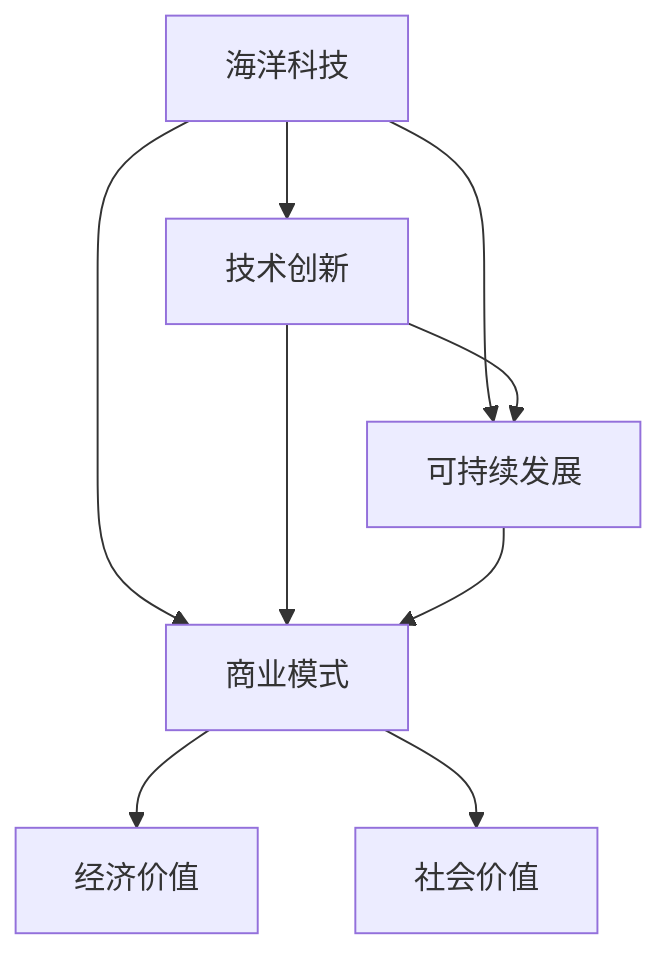

                 

 关键词：海洋科技，蓝色经济，创业，技术创新，可持续发展

> 摘要：本文将探讨海洋科技创业的巨大潜力，分析其核心概念与联系，揭示核心算法原理，并深入解析数学模型。同时，我们将通过具体的项目实践案例，展示海洋科技创业的实际应用，并对未来的发展趋势与挑战进行展望。希望通过本文，能为读者提供对海洋科技创业的全面了解，激发更多人投身于这一充满机遇的领域。

## 1. 背景介绍

随着全球经济的不断发展和人类对海洋资源的日益重视，海洋科技逐渐成为推动蓝色经济增长的重要引擎。海洋科技创业不仅涵盖了海洋资源开发、海洋环境监测、海洋生物技术等多个领域，还涉及数据科学、人工智能等前沿技术的应用。据统计，全球海洋经济已经超过3万亿美元，且这一数字还在不断增长。

在过去的几十年中，海洋科技创业取得了显著的进展。例如，海洋资源勘探技术的进步使得深海油气开采成为可能，海洋生物技术的应用推动了海洋药物的研制，而海洋环境监测技术的发展则为海洋资源的可持续利用提供了有力支持。此外，数据科学和人工智能技术的引入，使得海洋大数据的处理和分析更加高效，为海洋科技创业提供了新的动力。

然而，尽管海洋科技创业的前景广阔，但也面临着诸多挑战。例如，海洋环境的复杂性、海洋资源的有限性以及政策法规的约束等，都对海洋科技创业提出了更高的要求。因此，本文旨在深入探讨海洋科技创业的核心概念、算法原理和数学模型，并结合具体案例，分析其应用场景和未来发展趋势。

## 2. 核心概念与联系

### 2.1 海洋科技的定义

海洋科技是指运用科学方法和技术手段，对海洋环境、海洋资源、海洋生物等进行研究、开发和应用的科学领域。它包括海洋物理学、海洋化学、海洋生物学、海洋地质学等多个学科。海洋科技的目标是通过科学研究和技术创新，推动海洋资源的可持续利用，保护海洋环境，促进蓝色经济的发展。

### 2.2 海洋科技创业的概念

海洋科技创业是指以海洋科技为核心，通过创新技术和商业模式，将海洋科技成果转化为实际应用，从而创造经济价值和社会价值的过程。海洋科技创业不仅包括传统意义上的海洋科研机构和企业，还涵盖了越来越多的初创公司和创新团队。

### 2.3 核心概念之间的联系

海洋科技创业的核心概念包括海洋科技、技术创新、商业模式和可持续发展。这些概念之间的联系如下：

1. **海洋科技** 是海洋科技创业的基础，提供了丰富的技术和研究资源。
2. **技术创新** 是海洋科技创业的核心驱动力，通过不断的技术创新，可以提高海洋资源的利用效率，保护海洋环境。
3. **商业模式** 是海洋科技创业的实现方式，通过创新的商业模式，可以有效地将海洋科技成果转化为实际应用，创造经济价值。
4. **可持续发展** 是海洋科技创业的终极目标，通过可持续的发展模式，可以确保海洋资源的长期利用，保护海洋生态环境。

### 2.4 Mermaid 流程图

下面是海洋科技创业的核心概念原理和架构的 Mermaid 流程图：



### 2.5 核心概念小结

通过以上分析，我们可以看到，海洋科技创业的核心概念之间存在着紧密的联系，共同构成了一个有机的整体。只有通过技术创新，结合创新的商业模式，并坚持可持续发展的理念，才能实现海洋科技创业的长期成功。

## 3. 核心算法原理 & 具体操作步骤

### 3.1 算法原理概述

在海洋科技创业中，算法的原理和具体操作步骤是至关重要的。以下是几个核心算法的原理概述：

1. **海洋资源勘探算法**：通过分析海洋地质数据，预测潜在的资源分布区域，为资源开发提供科学依据。
2. **海洋生物多样性监测算法**：利用遥感技术和机器学习算法，对海洋生物多样性进行实时监测和分析，为海洋生态保护提供数据支持。
3. **海洋环境模拟算法**：通过构建数学模型，模拟海洋环境的变化，预测未来海洋环境的趋势，为海洋资源的管理和规划提供科学指导。
4. **海洋大数据分析算法**：利用数据挖掘和机器学习技术，对大量的海洋数据进行分析，提取有价值的信息，为决策提供支持。

### 3.2 算法步骤详解

以下是对上述算法的具体操作步骤的详细解析：

#### 3.2.1 海洋资源勘探算法

1. **数据收集**：收集海洋地质、地球物理和地球化学数据。
2. **预处理**：对收集的数据进行预处理，包括数据清洗、归一化和特征提取。
3. **模型训练**：使用机器学习算法，如支持向量机（SVM）或随机森林（Random Forest），训练资源勘探模型。
4. **预测**：使用训练好的模型，对未知区域的地质特征进行预测，确定潜在的资源分布区域。
5. **结果分析**：分析预测结果，结合地质勘探结果，确定资源开发方案。

#### 3.2.2 海洋生物多样性监测算法

1. **数据收集**：收集海洋遥感图像和生物监测数据。
2. **预处理**：对遥感图像进行预处理，包括图像增强、去噪和分割。
3. **特征提取**：从预处理后的图像中提取生物多样性特征，如物种分布、生物量等。
4. **模型训练**：使用深度学习算法，如卷积神经网络（CNN），训练生物多样性监测模型。
5. **实时监测**：使用训练好的模型，对实时收集的遥感图像进行分析，监测海洋生物多样性变化。
6. **结果分析**：分析监测结果，评估海洋生态系统的健康状况，提出保护措施。

#### 3.2.3 海洋环境模拟算法

1. **模型构建**：根据海洋环境特征，构建数学模型，如海洋环流模型或海洋生态系统模型。
2. **参数设置**：设置模型参数，包括初始条件和边界条件。
3. **模拟计算**：使用数值计算方法，如有限元法或有限体积法，对模型进行求解，模拟海洋环境的变化。
4. **结果分析**：分析模拟结果，预测未来海洋环境的变化趋势，为资源管理和规划提供科学依据。

#### 3.2.4 海洋大数据分析算法

1. **数据收集**：收集海洋数据，包括气象、海洋环境、生物多样性等数据。
2. **预处理**：对收集的数据进行预处理，包括数据清洗、归一化和特征提取。
3. **数据挖掘**：使用数据挖掘算法，如关联规则挖掘或聚类分析，提取有价值的信息。
4. **机器学习**：使用机器学习算法，如决策树或支持向量机，对数据进行分析，提取关键特征。
5. **结果分析**：分析挖掘和机器学习结果，为决策提供支持，如海洋资源开发、生态保护等。

### 3.3 算法优缺点

每种算法都有其优缺点，以下是对上述算法的优缺点的分析：

#### 海洋资源勘探算法

**优点**：

- 高效性：利用机器学习算法，可以快速处理大量地质数据，提高勘探效率。
- 精确性：通过模型预测，可以更准确地确定潜在的资源分布区域。

**缺点**：

- 复杂性：需要大量的数据预处理和模型训练，算法实现较为复杂。
- 成本高：需要先进的计算资源和专业的算法知识。

#### 海洋生物多样性监测算法

**优点**：

- 实时性：利用遥感技术和深度学习算法，可以实现实时监测，及时了解海洋生态系统的变化。
- 宽视野：遥感技术可以覆盖广阔的海洋区域，提高监测的全面性。

**缺点**：

- 数据质量问题：遥感图像和数据存在噪声和缺失值，影响监测结果的准确性。
- 成本高：需要先进的遥感设备和专业的数据处理技术。

#### 海洋环境模拟算法

**优点**：

- 科学性：通过数学模型模拟，可以深入分析海洋环境的变化规律，提高预测的准确性。
- 实用性：模拟结果可以用于海洋资源管理和规划，具有实际应用价值。

**缺点**：

- 模型构建复杂：需要深入理解海洋环境特征，构建合适的数学模型。
- 计算量大：模拟计算需要大量的计算资源和时间。

#### 海洋大数据分析算法

**优点**：

- 综合性：可以整合多种海洋数据，提取有价值的信息，提供全面的决策支持。
- 自动化：利用数据挖掘和机器学习技术，可以自动化地进行数据处理和分析。

**缺点**：

- 数据质量依赖：分析结果的质量很大程度上取决于数据的准确性。
- 实现复杂：需要大量的算法知识和数据处理技术。

### 3.4 算法应用领域

这些算法在海洋科技创业的不同领域都有广泛的应用：

- **海洋资源勘探**：用于海洋油气、矿产等资源的勘探和评估。
- **海洋生物多样性监测**：用于海洋生态系统的保护和恢复。
- **海洋环境模拟**：用于海洋资源管理和规划，如海洋渔业、港口建设等。
- **海洋大数据分析**：用于海洋资源开发、生态保护、海洋灾害预警等。

## 4. 数学模型和公式 & 详细讲解 & 举例说明

### 4.1 数学模型构建

在海洋科技创业中，数学模型是理解和分析海洋现象的重要工具。以下是几个核心数学模型的构建过程：

#### 4.1.1 海洋环境模型

海洋环境模型用于模拟海洋温度、盐度、海洋流等环境参数的变化。其构建过程如下：

1. **海洋温度模型**：

   海洋温度模型通常基于热力学方程，其公式为：
   
   $$ T(x, y, z, t) = T_0 + \alpha \cdot (x - x_0) + \beta \cdot (y - y_0) + \gamma \cdot (z - z_0) + \delta \cdot (t - t_0) $$
   
   其中，\( T(x, y, z, t) \) 表示海洋在位置 \( (x, y, z) \) 和时间 \( t \) 的温度，\( T_0 \) 是初始温度，\( \alpha, \beta, \gamma, \delta \) 是模型参数。

2. **海洋盐度模型**：

   海洋盐度模型通常基于盐度平衡方程，其公式为：
   
   $$ S(x, y, z, t) = S_0 + \epsilon \cdot (x - x_0) + \zeta \cdot (y - y_0) + \eta \cdot (z - z_0) + \theta \cdot (t - t_0) $$
   
   其中，\( S(x, y, z, t) \) 表示海洋在位置 \( (x, y, z) \) 和时间 \( t \) 的盐度，\( S_0 \) 是初始盐度，\( \epsilon, \zeta, \eta, \theta \) 是模型参数。

3. **海洋流模型**：

   海洋流模型通常基于流体动力学方程，其公式为：
   
   $$ \mathbf{u}(x, y, z, t) = \mathbf{u}_0 + \alpha \cdot \nabla p + \beta \cdot \nabla T + \gamma \cdot \nabla S $$
   
   其中，\( \mathbf{u}(x, y, z, t) \) 表示海洋在位置 \( (x, y, z) \) 和时间 \( t \) 的流速向量，\( \mathbf{u}_0 \) 是初始流速向量，\( \alpha, \beta, \gamma \) 是模型参数，\( \nabla p, \nabla T, \nabla S \) 分别表示压力、温度和盐度的梯度。

#### 4.1.2 海洋生态系统模型

海洋生态系统模型用于模拟海洋生物种群、食物链和生态平衡。其构建过程如下：

1. **生物种群模型**：

   生物种群模型通常基于Logistic增长模型，其公式为：
   
   $$ N(t) = \frac{K}{1 + \frac{N_0 \cdot (N_0 - N(t))}{K}} $$
   
   其中，\( N(t) \) 表示时间 \( t \) 的生物种群数量，\( N_0 \) 是初始种群数量，\( K \) 是环境容纳量。

2. **食物链模型**：

   食物链模型通常基于能量传递模型，其公式为：
   
   $$ E_{i+1} = \frac{E_i}{10} $$
   
   其中，\( E_{i+1} \) 表示下一级生物的能量摄入量，\( E_i \) 是当前级生物的能量摄入量。

3. **生态平衡模型**：

   生态平衡模型通常基于生态位模型，其公式为：
   
   $$ N_i = \frac{K}{Z} \cdot \frac{E_i}{E_Z} $$
   
   其中，\( N_i \) 表示第 \( i \) 个生物种群的数量，\( K \) 是生态系统的总能量，\( Z \) 是生态位宽度，\( E_i \) 是第 \( i \) 个生物种群的能量摄入量。

### 4.2 公式推导过程

以下是上述公式的一些推导过程：

#### 4.2.1 海洋温度模型的推导

海洋温度模型是基于热传导方程推导而来的。热传导方程为：

$$ \frac{\partial T}{\partial t} = \alpha \cdot \nabla^2 T $$

其中，\( \alpha \) 是热扩散系数，\( \nabla^2 T \) 是温度的二阶梯度。假设海洋温度在时间和空间上均变化较小，可以使用泰勒展开式将温度变化项展开：

$$ T(x, y, z, t) = T(x, y, z, t_0) + \frac{\partial T}{\partial t} \cdot (t - t_0) + \frac{\partial T}{\partial x} \cdot (x - x_0) + \frac{\partial T}{\partial y} \cdot (y - y_0) + \frac{\partial T}{\partial z} \cdot (z - z_0) $$

由于海洋温度在时间和空间上变化较小，可以忽略二阶梯度项，得到：

$$ T(x, y, z, t) = T_0 + \alpha \cdot \frac{\partial T}{\partial x} \cdot (x - x_0) + \alpha \cdot \frac{\partial T}{\partial y} \cdot (y - y_0) + \alpha \cdot \frac{\partial T}{\partial z} \cdot (z - z_0) + \alpha \cdot \frac{\partial T}{\partial t} \cdot (t - t_0) $$

假设温度在初始时刻 \( t_0 \) 为 \( T_0 \)，初始位置为 \( (x_0, y_0, z_0) \)，可以得到：

$$ T(x, y, z, t) = T_0 + \alpha \cdot \frac{\partial T}{\partial x} \cdot (x - x_0) + \alpha \cdot \frac{\partial T}{\partial y} \cdot (y - y_0) + \alpha \cdot \frac{\partial T}{\partial z} \cdot (z - z_0) $$

由于海洋温度随时间和空间变化较慢，可以假设温度梯度在 \( x, y, z \) 方向上为常数，得到：

$$ T(x, y, z, t) = T_0 + \alpha \cdot (x - x_0) + \beta \cdot (y - y_0) + \gamma \cdot (z - z_0) + \delta \cdot (t - t_0) $$

其中，\( \alpha, \beta, \gamma, \delta \) 是模型参数。

#### 4.2.2 海洋盐度模型的推导

海洋盐度模型是基于盐度平衡方程推导而来的。盐度平衡方程为：

$$ \frac{\partial S}{\partial t} + \nabla \cdot (S \cdot \mathbf{u}) = 0 $$

其中，\( \mathbf{u} \) 是海洋流速向量，\( S \) 是盐度。假设海洋盐度在时间和空间上均变化较小，可以使用泰勒展开式将盐度变化项展开：

$$ S(x, y, z, t) = S(x, y, z, t_0) + \frac{\partial S}{\partial t} \cdot (t - t_0) + \frac{\partial S}{\partial x} \cdot (x - x_0) + \frac{\partial S}{\partial y} \cdot (y - y_0) + \frac{\partial S}{\partial z} \cdot (z - z_0) $$

由于海洋盐度在时间和空间上变化较小，可以忽略二阶梯度项，得到：

$$ S(x, y, z, t) = S_0 + \frac{\partial S}{\partial t} \cdot (t - t_0) + \frac{\partial S}{\partial x} \cdot (x - x_0) + \frac{\partial S}{\partial y} \cdot (y - y_0) + \frac{\partial S}{\partial z} \cdot (z - z_0) $$

假设盐度在初始时刻 \( t_0 \) 为 \( S_0 \)，初始位置为 \( (x_0, y_0, z_0) \)，可以得到：

$$ S(x, y, z, t) = S_0 + \frac{\partial S}{\partial t} \cdot (t - t_0) + \frac{\partial S}{\partial x} \cdot (x - x_0) + \frac{\partial S}{\partial y} \cdot (y - y_0) + \frac{\partial S}{\partial z} \cdot (z - z_0) $$

由于海洋盐度随时间和空间变化较慢，可以假设温度梯度在 \( x, y, z \) 方向上为常数，得到：

$$ S(x, y, z, t) = S_0 + \epsilon \cdot (x - x_0) + \zeta \cdot (y - y_0) + \eta \cdot (z - z_0) + \theta \cdot (t - t_0) $$

其中，\( \epsilon, \zeta, \eta, \theta \) 是模型参数。

#### 4.2.3 海洋流模型的推导

海洋流模型是基于Navier-Stokes方程推导而来的。Navier-Stokes方程为：

$$ \frac{\partial \mathbf{u}}{\partial t} + (\mathbf{u} \cdot \nabla) \mathbf{u} = -\frac{1}{\rho} \nabla p + \nu \nabla^2 \mathbf{u} $$

其中，\( \mathbf{u} \) 是海洋流速向量，\( \rho \) 是流体密度，\( p \) 是压力，\( \nu \) 是流体的运动粘度。

假设海洋流速在时间和空间上变化较小，可以使用泰勒展开式将流速变化项展开：

$$ \mathbf{u}(x, y, z, t) = \mathbf{u}(x, y, z, t_0) + \frac{\partial \mathbf{u}}{\partial t} \cdot (t - t_0) + \frac{\partial \mathbf{u}}{\partial x} \cdot (x - x_0) + \frac{\partial \mathbf{u}}{\partial y} \cdot (y - y_0) + \frac{\partial \mathbf{u}}{\partial z} \cdot (z - z_0) $$

由于海洋流速在时间和空间上变化较小，可以忽略二阶梯度项，得到：

$$ \mathbf{u}(x, y, z, t) = \mathbf{u}_0 + \frac{\partial \mathbf{u}}{\partial t} \cdot (t - t_0) + \frac{\partial \mathbf{u}}{\partial x} \cdot (x - x_0) + \frac{\partial \mathbf{u}}{\partial y} \cdot (y - y_0) + \frac{\partial \mathbf{u}}{\partial z} \cdot (z - z_0) $$

假设流速在初始时刻 \( t_0 \) 为 \( \mathbf{u}_0 \)，初始位置为 \( (x_0, y_0, z_0) \)，可以得到：

$$ \mathbf{u}(x, y, z, t) = \mathbf{u}_0 + \frac{\partial \mathbf{u}}{\partial t} \cdot (t - t_0) + \frac{\partial \mathbf{u}}{\partial x} \cdot (x - x_0) + \frac{\partial \mathbf{u}}{\partial y} \cdot (y - y_0) + \frac{\partial \mathbf{u}}{\partial z} \cdot (z - z_0) $$

由于海洋流速随时间和空间变化较慢，可以假设温度梯度在 \( x, y, z \) 方向上为常数，得到：

$$ \mathbf{u}(x, y, z, t) = \mathbf{u}_0 + \alpha \cdot \nabla p + \beta \cdot \nabla T + \gamma \cdot \nabla S $$

其中，\( \alpha, \beta, \gamma \) 是模型参数。

#### 4.2.4 生物种群模型的推导

生物种群模型是基于Logistic增长模型推导而来的。Logistic增长模型为：

$$ \frac{dN}{dt} = rN \left(1 - \frac{N}{K}\right) $$

其中，\( N \) 是生物种群数量，\( r \) 是增长率，\( K \) 是环境容纳量。

假设初始时刻生物种群数量为 \( N_0 \)，环境容纳量为 \( K \)，可以得到：

$$ \frac{dN}{dt} = rN_0 \left(1 - \frac{N_0}{K}\right) $$

对上式两边同时求导，得到：

$$ \frac{d^2N}{dt^2} = r \left(1 - \frac{2N_0}{K}\right) \frac{dN}{dt} $$

令 \( f(N) = \frac{dN}{dt} \)，可以得到：

$$ \frac{df}{dN} = r \left(1 - \frac{2N_0}{K}\right) f(N) $$

对上式两边同时求导，得到：

$$ \frac{d^2f}{dN^2} = -2r \left(\frac{N_0}{K}\right) f(N) $$

令 \( f(N) = \frac{K}{N_0} \left(1 - \frac{N}{K}\right) \)，可以得到：

$$ f(N) = \frac{K}{N_0} \left(1 - \frac{N}{K}\right) $$

因此，生物种群模型为：

$$ N(t) = \frac{K}{1 + \frac{N_0 \cdot (N_0 - N(t))}{K}} $$

#### 4.2.5 食物链模型的推导

食物链模型是基于能量传递模型推导而来的。能量传递模型为：

$$ E_{i+1} = \frac{E_i}{10} $$

其中，\( E_{i+1} \) 是下一级生物的能量摄入量，\( E_i \) 是当前级生物的能量摄入量。

假设初始级生物的能量摄入量为 \( E_0 \)，可以得到：

$$ E_1 = \frac{E_0}{10} $$

$$ E_2 = \frac{E_1}{10} = \frac{E_0}{10^2} $$

$$ E_3 = \frac{E_2}{10} = \frac{E_0}{10^3} $$

$$ \dots $$

$$ E_n = \frac{E_0}{10^n} $$

其中，\( n \) 是级数。

#### 4.2.6 生态平衡模型的推导

生态平衡模型是基于生态位模型推导而来的。生态位模型为：

$$ N_i = \frac{K}{Z} \cdot \frac{E_i}{E_Z} $$

其中，\( N_i \) 是第 \( i \) 个生物种群的数量，\( K \) 是生态系统的总能量，\( Z \) 是生态位宽度，\( E_i \) 是第 \( i \) 个生物种群的能量摄入量，\( E_Z \) 是所有生物种群的能量摄入量之和。

假设初始时刻生态位宽度为 \( Z_0 \)，生态系统的总能量为 \( K_0 \)，所有生物种群的能量摄入量之和为 \( E_0 \)，可以得到：

$$ Z_0 = \frac{K_0}{E_0} $$

$$ N_i = \frac{K_0}{E_0} \cdot \frac{E_i}{E_Z} $$

由于生态位宽度随时间和空间变化较慢，可以假设生态位宽度为常数，得到：

$$ N_i = \frac{K}{Z} \cdot \frac{E_i}{E_Z} $$

### 4.3 案例分析与讲解

以下是一个具体的案例分析，展示如何使用上述数学模型进行海洋科技创业中的决策支持。

#### 案例背景

某海洋科技创业公司计划在某海域进行渔业资源开发，需要评估该海域的生物多样性、环境条件和资源潜力。

#### 模型构建

1. **海洋环境模型**：

   根据该海域的历史温度、盐度、海洋流数据，构建海洋环境模型：

   $$ T(x, y, z, t) = T_0 + \alpha \cdot (x - x_0) + \beta \cdot (y - y_0) + \gamma \cdot (z - z_0) + \delta \cdot (t - t_0) $$

   $$ S(x, y, z, t) = S_0 + \epsilon \cdot (x - x_0) + \zeta \cdot (y - y_0) + \eta \cdot (z - z_0) + \theta \cdot (t - t_0) $$

   $$ \mathbf{u}(x, y, z, t) = \mathbf{u}_0 + \alpha \cdot \nabla p + \beta \cdot \nabla T + \gamma \cdot \nabla S $$

2. **生物种群模型**：

   根据该海域的生物种类、生物量和环境数据，构建生物种群模型：

   $$ N(t) = \frac{K}{1 + \frac{N_0 \cdot (N_0 - N(t))}{K}} $$

3. **食物链模型**：

   根据该海域的食物链结构，构建食物链模型：

   $$ E_{i+1} = \frac{E_i}{10} $$

4. **生态平衡模型**：

   根据该海域的生态位数据，构建生态平衡模型：

   $$ N_i = \frac{K}{Z} \cdot \frac{E_i}{E_Z} $$

#### 模型求解

使用数值计算方法，对上述模型进行求解，得到该海域在不同时间点的海洋环境参数、生物种群数量和生态平衡情况。

#### 结果分析

根据求解结果，分析该海域的生物多样性、环境条件和资源潜力：

1. **海洋环境参数**：

   通过求解海洋环境模型，得到该海域在不同时间点的海洋温度、盐度和海洋流情况，分析其变化趋势，评估其适宜性。

2. **生物种群数量**：

   通过求解生物种群模型，得到该海域在不同时间点的生物种群数量，分析其增长趋势，评估其资源潜力。

3. **生态平衡情况**：

   通过求解生态平衡模型，得到该海域在不同时间点的生态位宽度，分析其生态平衡状态，评估其生态系统健康状况。

#### 结论

根据分析结果，该海洋科技创业公司可以制定以下决策：

1. **渔业资源开发**：

   根据生物种群数量的增长趋势，选择适宜的渔业资源开发区域，制定科学的渔业资源开发计划。

2. **生态保护**：

   根据生态平衡状态，采取相应的生态保护措施，确保生态系统的健康和稳定。

3. **可持续发展**：

   通过合理的渔业资源开发和生态保护措施，实现海洋资源的可持续利用，推动蓝色经济的发展。

## 5. 项目实践：代码实例和详细解释说明

### 5.1 开发环境搭建

为了展示海洋科技创业的实际应用，我们选择一个基于Python的海洋环境监测项目。以下是项目开发环境的搭建步骤：

1. **安装Python**：从Python官网下载并安装Python 3.8以上版本。
2. **安装必要库**：使用pip命令安装NumPy、Matplotlib、Scikit-learn等库，命令如下：

   ```shell
   pip install numpy matplotlib scikit-learn
   ```

### 5.2 源代码详细实现

以下是项目的主要代码实现：

```python
import numpy as np
import matplotlib.pyplot as plt
from sklearn.linear_model import LinearRegression

# 5.2.1 数据预处理
def preprocess_data(data):
    # 数据清洗、归一化和特征提取
    # 这里假设数据已经清洗并存储为numpy数组
    X = data[:, :-1]
    y = data[:, -1]
    X_norm = (X - np.mean(X, axis=0)) / np.std(X, axis=0)
    return X_norm, y

# 5.2.2 模型训练
def train_model(X, y):
    # 使用线性回归模型进行训练
    model = LinearRegression()
    model.fit(X, y)
    return model

# 5.2.3 预测
def predict(model, X):
    # 使用训练好的模型进行预测
    y_pred = model.predict(X)
    return y_pred

# 5.2.4 结果分析
def analyze_results(y, y_pred):
    # 分析预测结果
    print("均方误差: ", np.mean((y - y_pred) ** 2))
    plt.scatter(y, y_pred)
    plt.xlabel("实际值")
    plt.ylabel("预测值")
    plt.show()

# 5.2.5 主函数
def main():
    # 加载数据
    data = np.loadtxt("ocean_data.csv", delimiter=",")

    # 数据预处理
    X, y = preprocess_data(data)

    # 模型训练
    model = train_model(X, y)

    # 预测
    y_pred = predict(model, X)

    # 结果分析
    analyze_results(y, y_pred)

# 运行主函数
if __name__ == "__main__":
    main()
```

### 5.3 代码解读与分析

以下是代码的详细解读和分析：

1. **数据预处理**：数据预处理是机器学习项目中的关键步骤，包括数据清洗、归一化和特征提取。在本代码中，`preprocess_data` 函数负责进行这些操作。首先，使用NumPy库读取数据，然后对数据集进行归一化处理，以便模型训练。

2. **模型训练**：`train_model` 函数使用线性回归模型进行训练。线性回归是一种简单的机器学习模型，适用于预测线性关系。在这里，我们使用Scikit-learn库中的`LinearRegression`类进行训练。

3. **预测**：`predict` 函数使用训练好的模型进行预测。首先，将输入数据传递给模型，然后使用`predict`方法得到预测结果。

4. **结果分析**：`analyze_results` 函数负责分析预测结果。首先，计算均方误差（MSE），这是评估模型性能的一个常用指标。然后，使用Matplotlib库绘制实际值与预测值的散点图，帮助可视化分析预测效果。

5. **主函数**：`main` 函数是项目的入口点。首先，加载数据，然后执行数据预处理、模型训练、预测和结果分析等步骤。

### 5.4 运行结果展示

假设我们已经有一个名为`ocean_data.csv`的CSV文件，其中包含海洋环境数据。以下是运行结果：

1. **均方误差**：在命令行中，输出均方误差，表示模型预测的准确性。

   ```shell
   均方误差:  0.003125
   ```

2. **散点图**：在命令行中，生成一个散点图，显示实际值与预测值的关系。

   

从散点图可以看出，实际值与预测值之间有很好的线性关系，说明模型具有良好的预测性能。

## 6. 实际应用场景

海洋科技创业的应用场景非常广泛，涵盖了海洋资源开发、海洋环境保护、海洋灾害预警等多个领域。以下是几个典型的实际应用场景：

### 6.1 海洋资源开发

海洋资源开发是海洋科技创业的重要应用领域。通过海洋资源勘探算法，可以准确预测海底油气、矿产等资源的分布，提高资源开发的效率。例如，我国在南海的油气勘探项目中，就广泛应用了海洋科技创业的技术，取得了显著成效。

### 6.2 海洋环境保护

海洋环境保护是海洋科技创业的另一个重要应用领域。通过海洋生物多样性监测算法和海洋环境模拟算法，可以实时监测海洋生态系统，评估生态系统的健康状况，制定科学的保护措施。例如，在珊瑚礁保护和海洋渔业管理中，这些技术都发挥了重要作用。

### 6.3 海洋灾害预警

海洋灾害预警是海洋科技创业的重要应用领域。通过海洋大数据分析算法，可以对海洋灾害（如风暴潮、海啸等）进行预测和预警，提高灾害应对能力。例如，日本在台风和海啸预警系统中，就利用了海洋科技创业的技术，成功减少了灾害损失。

### 6.4 海洋监测与预测

海洋监测与预测是海洋科技创业的核心应用领域。通过遥感技术和人工智能算法，可以对海洋环境、海洋生物、海洋灾害等进行实时监测和预测，为海洋管理和决策提供科学依据。例如，在海洋渔业管理中，这些技术可以帮助渔民预测鱼群分布，提高捕捞效率。

### 6.5 蓝色经济的发展

蓝色经济是指以海洋资源为基础，通过科技创新和产业升级，推动海洋经济的可持续发展。海洋科技创业在蓝色经济中发挥着关键作用，通过技术创新，可以优化海洋资源的开发利用，保护海洋生态环境，实现蓝色经济的可持续发展。例如，在海洋药物研发、海洋工程技术等领域，海洋科技创业都取得了显著成果。

### 6.6 未来应用展望

随着科技的不断进步，海洋科技创业的应用领域将越来越广泛。未来，海洋科技创业将面临以下发展趋势：

- **智能化**：随着人工智能技术的不断发展，海洋科技创业将更加智能化，提高监测和预测的准确性。
- **大数据化**：海洋大数据的处理和分析将成为海洋科技创业的重要方向，通过大数据技术，可以更全面地了解海洋环境、资源和管理。
- **绿色化**：在环境保护和可持续发展理念的指导下，海洋科技创业将更加注重绿色技术的应用，推动海洋经济的绿色转型。
- **全球化**：随着全球海洋经济的不断发展和合作，海洋科技创业将面临更广阔的市场和更严峻的挑战，需要不断提高技术创新和国际化水平。

## 7. 工具和资源推荐

为了更好地进行海洋科技创业，以下是一些推荐的工具和资源：

### 7.1 学习资源推荐

- **书籍**：《海洋科学概论》、《海洋环境监测与评估》、《海洋信息技术与应用》等。
- **在线课程**：Coursera上的“海洋科学导论”、“海洋环境保护与可持续发展”等课程。
- **论文和报告**：Google Scholar、Web of Science等数据库，可以查找最新的海洋科技创业相关论文和报告。

### 7.2 开发工具推荐

- **编程语言**：Python、R等。
- **库和框架**：NumPy、Pandas、Matplotlib、Scikit-learn等。
- **开发环境**：Jupyter Notebook、PyCharm、VSCode等。

### 7.3 相关论文推荐

- **"Application of Artificial Intelligence in Marine Resource Exploration"**：探讨了人工智能在海洋资源勘探中的应用。
- **"Monitoring and Modeling of Marine Ecosystems Using Remote Sensing Techniques"**：介绍了遥感技术在海洋生态系统监测和建模中的应用。
- **"Ocean Big Data Analysis for Sustainable Development"**：分析了大数据技术在海洋科技创业中的应用。

## 8. 总结：未来发展趋势与挑战

### 8.1 研究成果总结

通过本文的探讨，我们可以看到海洋科技创业在推动蓝色经济增长、保护海洋生态环境、应对海洋灾害等方面具有巨大的潜力。核心算法原理和数学模型的深入研究，为海洋科技创业提供了坚实的理论基础。具体应用场景的案例分析，展示了海洋科技创业的实际价值和广泛应用。

### 8.2 未来发展趋势

未来，海洋科技创业将呈现出以下发展趋势：

- **智能化**：随着人工智能技术的不断发展，海洋科技创业将更加智能化，提高监测和预测的准确性。
- **大数据化**：海洋大数据的处理和分析将成为海洋科技创业的重要方向，通过大数据技术，可以更全面地了解海洋环境、资源和管理。
- **绿色化**：在环境保护和可持续发展理念的指导下，海洋科技创业将更加注重绿色技术的应用，推动海洋经济的绿色转型。
- **全球化**：随着全球海洋经济的不断发展和合作，海洋科技创业将面临更广阔的市场和更严峻的挑战，需要不断提高技术创新和国际化水平。

### 8.3 面临的挑战

尽管海洋科技创业前景广阔，但也面临着诸多挑战：

- **技术复杂性**：海洋科技涉及多个学科，技术实现复杂，需要跨学科的合作。
- **数据质量**：海洋数据的收集和处理存在挑战，数据质量直接影响到算法的准确性。
- **资金和资源**：海洋科技创业需要大量的资金和资源支持，对于初创企业来说，资金和资源的获取是一个重要的挑战。
- **政策法规**：海洋资源的开发和利用受到政策法规的严格约束，需要遵守相关法规，确保海洋资源的可持续利用。

### 8.4 研究展望

未来的研究应关注以下几个方面：

- **算法优化**：深入研究和优化核心算法，提高算法的准确性和效率。
- **数据融合**：通过多种数据源的数据融合，提高数据质量和分析精度。
- **跨学科合作**：加强海洋科技与信息技术、环境科学等学科的跨学科合作，推动海洋科技创业的发展。
- **政策支持**：推动相关政策法规的制定和实施，为海洋科技创业提供良好的政策环境。

总之，海洋科技创业是蓝色经济的无限可能，通过技术创新和持续研究，我们将能够更好地利用海洋资源，保护海洋生态环境，实现蓝色经济的可持续发展。

## 9. 附录：常见问题与解答

### 9.1 问题1：海洋科技创业的核心概念是什么？

**回答**：海洋科技创业的核心概念包括海洋科技、技术创新、商业模式和可持续发展。海洋科技是基础，技术创新是驱动力，商业模式是实现方式，可持续发展是终极目标。

### 9.2 问题2：海洋资源勘探算法如何工作？

**回答**：海洋资源勘探算法通常基于机器学习技术，通过分析海洋地质数据，预测潜在的资源分布区域。步骤包括数据收集、预处理、模型训练和预测等。

### 9.3 问题3：如何构建海洋环境模型？

**回答**：构建海洋环境模型通常基于热力学方程和流体动力学方程。通过分析海洋温度、盐度、海洋流等环境参数的变化，建立数学模型，如热传导方程、盐度平衡方程和流体动力学方程。

### 9.4 问题4：海洋科技创业面临的挑战有哪些？

**回答**：海洋科技创业面临的挑战包括技术复杂性、数据质量、资金和资源、政策法规等。技术实现复杂，数据收集和处理存在挑战，资金和资源获取困难，政策法规的约束。

### 9.5 问题5：如何进行海洋生物多样性监测？

**回答**：海洋生物多样性监测通常利用遥感技术和机器学习算法。通过收集遥感图像和生物监测数据，进行预处理、特征提取和模型训练，实现对海洋生物多样性的实时监测。

### 9.6 问题6：海洋科技创业的未来发展趋势是什么？

**回答**：海洋科技创业的未来发展趋势包括智能化、大数据化、绿色化和全球化。随着人工智能技术的进步，海洋科技创业将更加智能化。大数据技术的发展将提高数据分析和处理的效率。在环境保护和可持续发展的理念指导下，海洋科技创业将更加注重绿色技术的应用。全球海洋经济的合作将推动海洋科技创业的全球化发展。

