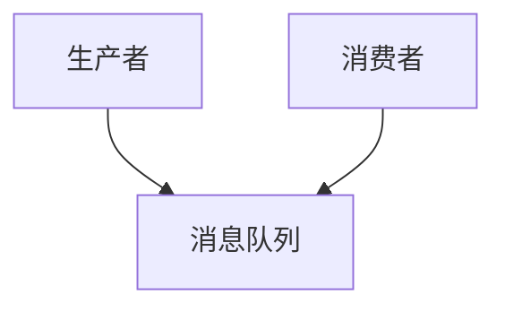
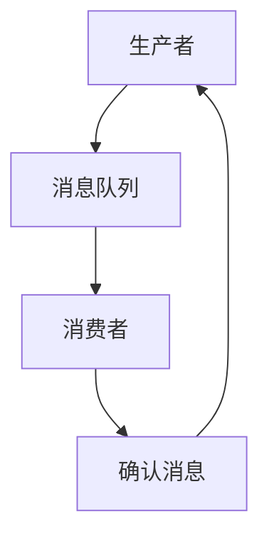
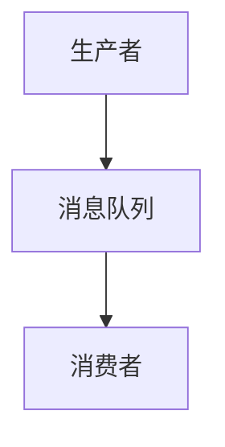

                 

 消息队列作为现代分布式系统中的一项关键基础设施，其重要性日益凸显。本文旨在探讨消息队列的核心概念、原理、应用场景以及未来发展趋势，帮助读者深入理解消息队列在现代系统设计中的重要作用。

## 关键词
- 消息队列
- 分布式系统
- 解耦
- 高可用
- 流处理
- 事件驱动架构

## 摘要
本文首先介绍消息队列的基本概念和背景，然后详细阐述其核心原理，包括生产者-消费者模型、异步通信和可靠消息传递。接着，我们通过一个简单的Mermaid流程图，展示消息队列的架构。文章还将探讨消息队列的核心算法原理及其应用领域。随后，我们将使用数学模型和公式详细讲解消息队列的工作机制，并通过一个实际项目实例，展示如何在实际中实现消息队列。最后，文章将分析消息队列在实际应用中的场景，并展望其未来的发展趋势和面临的挑战。

## 1. 背景介绍

随着互联网和云计算的飞速发展，现代应用系统的规模和复杂性不断增长。传统的单体架构已无法满足快速变化的需求，分布式系统逐渐成为主流。在分布式系统中，各个组件之间的通信和协调变得尤为重要。此时，消息队列作为一种异步通信机制，起到了解耦系统组件的关键作用。

### 1.1 消息队列的定义

消息队列是一种在分布式系统中用于传输数据的通信工具。它允许不同组件之间通过消息进行异步通信，从而实现数据的传递和任务的调度。消息队列的主要特点是松散耦合、高可用性和高扩展性。

### 1.2 消息队列的发展历程

消息队列的概念起源于1970年代的电子邮件系统。随着时间的推移，消息队列技术不断演进，逐渐成为分布式系统中的一个重要组成部分。从早期的消息中间件如JMS（Java Message Service）到现代流行的开源消息队列如RabbitMQ、Kafka，消息队列技术已经发展得非常成熟。

### 1.3 消息队列的应用场景

消息队列在分布式系统中具有广泛的应用场景，以下是几个典型的应用：

- **异步处理**：消息队列可以用于处理耗时较长的任务，如图片处理、邮件发送等，从而提高系统的响应速度和用户体验。
- **分布式事务**：在分布式系统中，消息队列可以用于实现分布式事务，确保数据的一致性。
- **服务解耦**：消息队列可以解耦系统的各个组件，使得每个组件可以独立开发和部署，提高系统的灵活性和可维护性。
- **流处理**：消息队列可以与流处理框架如Apache Kafka结合，实现大规模数据流的高效处理。
- **事件驱动架构**：消息队列是实现事件驱动架构的重要组件，可以用于处理实时事件和业务逻辑的触发。

## 2. 核心概念与联系

在深入探讨消息队列之前，我们需要了解一些核心概念，这些概念是理解消息队列工作原理的基础。

### 2.1 生产者-消费者模型

生产者-消费者模型是消息队列的核心概念之一。在这个模型中，生产者负责生成消息并将消息发送到消息队列中，而消费者则从消息队列中获取消息并执行相应的操作。



### 2.2 异步通信

异步通信是指消息的发送者和接收者不需要在同一个时间点进行交互。生产者可以将消息发送到消息队列，然后继续执行其他任务，而不需要等待消费者处理消息。消费者可以在任何时间从消息队列中获取消息进行处理。

### 2.3 可靠消息传递

可靠消息传递是消息队列的重要特性之一。它确保了消息能够从生产者传递到消费者，即使在系统出现故障时也能保证消息不丢失。可靠消息传递通常包括以下机制：

- **消息持久化**：消息被持久化存储在数据库或其他存储系统中，确保即使在系统重启时也不会丢失。
- **消息确认**：消费者在处理完消息后，向生产者发送确认消息，确保消息已被正确处理。
- **重试机制**：如果消费者在处理消息时发生错误，消息队列可以重试发送消息，直到成功处理。



### 2.4 消息队列的架构

消息队列的架构通常包括以下几个主要组件：

- **生产者**：生成消息并将其发送到消息队列。
- **消息队列**：存储和管理消息，提供消息传递的中间层。
- **消费者**：从消息队列中获取消息并执行相应的操作。



### 2.5 消息队列与数据库的区别

虽然消息队列和数据库都是用于数据存储的工具，但它们在用途和架构上存在显著差异。以下是两者的主要区别：

- **用途**：数据库主要用于数据的持久化存储和查询，而消息队列主要用于数据的传递和异步处理。
- **架构**：数据库通常具有复杂的查询优化和并发控制机制，而消息队列则更加关注消息的可靠传递和有序处理。
- **性能**：数据库通常用于读写密集型应用，而消息队列则更适用于高吞吐量的场景。

## 3. 核心算法原理 & 具体操作步骤

### 3.1 算法原理概述

消息队列的核心算法原理主要涉及消息的生产、传输和消费。以下是消息队列的基本算法原理：

- **消息生产**：生产者生成消息，并按照一定的策略将其发送到消息队列中。
- **消息传输**：消息队列负责将消息从生产者传递到消费者。
- **消息消费**：消费者从消息队列中获取消息，并执行相应的操作。

### 3.2 算法步骤详解

以下是消息队列的具体操作步骤：

1. **消息生产**：
   - 生产者生成消息。
   - 生产者将消息发送到消息队列。

2. **消息传输**：
   - 消息队列接收消息，并进行持久化存储。
   - 消息队列按照一定的策略将消息传递给消费者。

3. **消息消费**：
   - 消费者从消息队列中获取消息。
   - 消费者处理消息，并返回确认消息给生产者。

### 3.3 算法优缺点

消息队列具有以下优缺点：

- **优点**：
  - **解耦**：消息队列可以解耦系统的各个组件，提高系统的灵活性和可维护性。
  - **异步处理**：消息队列支持异步处理，提高系统的吞吐量和响应速度。
  - **高可用**：消息队列具有可靠的消息传递机制，确保消息不会丢失。

- **缺点**：
  - **延迟**：消息队列可能导致消息的处理延迟，特别是在高吞吐量的场景中。
  - **复杂度**：消息队列的架构和算法相对复杂，需要一定的时间和精力进行学习和维护。

### 3.4 算法应用领域

消息队列广泛应用于以下领域：

- **分布式系统**：消息队列可以用于分布式系统的组件间通信，实现数据的一致性和高可用性。
- **流处理**：消息队列可以与流处理框架如Apache Kafka结合，实现大规模数据流的高效处理。
- **事件驱动架构**：消息队列是实现事件驱动架构的重要组件，可以用于处理实时事件和业务逻辑的触发。
- **异步处理**：消息队列可以用于处理耗时较长的任务，如图片处理、邮件发送等。

## 4. 数学模型和公式 & 详细讲解 & 举例说明

### 4.1 数学模型构建

消息队列的数学模型主要涉及以下几个参数：

- **消息生成速率**（λ）：表示单位时间内生产者的消息生成速率。
- **消息处理速率**（μ）：表示单位时间内消费者的消息处理速率。
- **消息队列长度**（L）：表示消息队列中消息的数量。

### 4.2 公式推导过程

以下是消息队列的一些基本公式：

- **消息队列长度**（L）的计算：
  $$ L = \frac{\lambda}{\mu} \left(1 - e^{-\lambda/\mu}\right) $$

- **消息延迟**（W）的计算：
  $$ W = \frac{L}{\lambda} $$

- **系统吞吐量**（θ）的计算：
  $$ \theta = \frac{\lambda \mu}{\mu + \lambda} $$

### 4.3 案例分析与讲解

假设我们有一个消息队列系统，消息生成速率为10条/秒，消息处理速率为5条/秒。我们可以使用上述公式计算系统的一些关键指标：

- **消息队列长度**（L）：
  $$ L = \frac{10}{5} \left(1 - e^{-10/5}\right) \approx 3.3 $$

- **消息延迟**（W）：
  $$ W = \frac{3.3}{10} \approx 0.33秒 $$

- **系统吞吐量**（θ）：
  $$ \theta = \frac{10 \times 5}{5 + 10} \approx 4.17条/秒 $$

通过这些公式，我们可以评估消息队列系统的性能和效率。在实际应用中，这些指标可以帮助我们优化系统设计，提高系统的响应速度和处理能力。

## 5. 项目实践：代码实例和详细解释说明

### 5.1 开发环境搭建

在本节中，我们将使用RabbitMQ作为消息队列的实例，演示如何搭建一个简单的消息队列系统。以下是搭建RabbitMQ开发环境的步骤：

1. **安装Erlang**：RabbitMQ是基于Erlang语言开发的，因此首先需要安装Erlang。
   ```bash
   sudo apt-get install erlang
   ```

2. **安装RabbitMQ**：安装RabbitMQ的包管理器Erlang Solutions Package Manager（EPMD）。
   ```bash
   wget https://www.rabbitmq.com/rabbitmq-epmd-3.6.2-1.all.all.noarch.rpm
   sudo rpm -ivh rabbitmq-epmd-3.6.2-1.all.all.noarch.rpm
   ```

3. **安装RabbitMQ**：安装RabbitMQ的核心包。
   ```bash
   wget https://www.rabbitmq.com/rabbitmq-server-3.6.2-1.noarch.rpm
   sudo rpm -ivh rabbitmq-server-3.6.2-1.noarch.rpm
   ```

4. **启动RabbitMQ**：启动RabbitMQ服务。
   ```bash
   sudo systemctl start rabbitmq-server
   ```

### 5.2 源代码详细实现

在本节中，我们将使用Python编写一个简单的生产者-消费者模型，演示如何使用RabbitMQ进行消息的生产和消费。

**生产者**（`producer.py`）：
```python
import pika

# 连接到RabbitMQ
connection = pika.BlockingConnection(pika.ConnectionParameters('localhost'))
channel = connection.channel()

# 声明一个队列
channel.queue_declare(queue='hello')

# 发送消息
for i in range(10):
    channel.basic_publish(exchange='',
                          routing_key='hello',
                          body=f'Hello {i}')
    print(f" [x] Sent '{f'Hello {i}'}'")

# 关闭连接
connection.close()
```

**消费者**（`consumer.py`）：
```python
import pika

def callback(ch, method, properties, body):
    print(f" [x] Received {body}")

# 连接到RabbitMQ
connection = pika.BlockingConnection(pika.ConnectionParameters('localhost'))
channel = connection.channel()

# 声明一个队列
channel.queue_declare(queue='hello')

# 消费消息
channel.basic_consume(queue='hello',
                      on_message_callback=callback,
                      auto_ack=True)

print(' [*] Waiting for messages. To exit press CTRL+C')
channel.start_consuming()
```

### 5.3 代码解读与分析

**生产者**（`producer.py`）：

- 导入pika库。
- 创建一个连接到RabbitMQ的阻塞连接。
- 创建一个通道。
- 声明一个名为`hello`的队列。
- 循环发送10条消息，每条消息包含一个简单的字符串。

**消费者**（`consumer.py`）：

- 定义一个回调函数`callback`，用于处理接收到的消息。
- 创建一个连接到RabbitMQ的阻塞连接。
- 创建一个通道。
- 声明一个名为`hello`的队列。
- 设置消费消息的回调函数。
- 打印消息等待状态，并开始消费消息。

通过上述代码，我们可以实现一个简单的消息队列系统，其中生产者负责发送消息，消费者负责接收并处理消息。这个示例展示了消息队列的基本工作原理，在实际项目中，我们可以根据需求进行扩展和优化。

### 5.4 运行结果展示

运行生产者程序`producer.py`，会发送10条消息到RabbitMQ的消息队列。

```bash
python producer.py
```

运行消费者程序`consumer.py`，会从RabbitMQ的消息队列中接收并打印消息。

```bash
python consumer.py
```

输出结果如下：

```
[+] Waiting for messages. To exit press CTRL+C
[+] Received Hello 0
[+] Received Hello 1
[+] Received Hello 2
[+] Received Hello 3
[+] Received Hello 4
[+] Received Hello 5
[+] Received Hello 6
[+] Received Hello 7
[+] Received Hello 8
[+] Received Hello 9
```

通过这个简单的示例，我们可以看到消息队列的基本工作流程：生产者生成消息并发送到队列，消费者从队列中接收并处理消息。这个示例虽然简单，但足以展示消息队列的核心原理和功能。

## 6. 实际应用场景

消息队列在现代分布式系统中具有广泛的应用，以下是一些典型的实际应用场景：

### 6.1 异步处理

异步处理是消息队列最常见和最重要的应用场景之一。在许多应用中，某些任务需要较长的时间才能完成，例如图片处理、日志分析、邮件发送等。将这些任务作为消息发送到消息队列，可以避免阻塞主线程，提高系统的响应速度和用户体验。

### 6.2 分布式事务

在分布式系统中，事务的协调和一致性是一个挑战。消息队列可以用于实现分布式事务，确保多个节点上的操作要么全部成功，要么全部失败，从而保持数据的一致性。

### 6.3 服务解耦

通过消息队列，可以将系统的各个服务解耦，使得每个服务可以独立开发和部署。这种解耦可以提高系统的灵活性和可维护性，使得系统更容易扩展和更新。

### 6.4 流处理

消息队列可以与流处理框架如Apache Kafka结合，实现大规模数据流的高效处理。流处理可以实时处理和分析数据，为业务决策提供支持。

### 6.5 事件驱动架构

消息队列是实现事件驱动架构的关键组件。在事件驱动架构中，系统中的各个组件通过消息进行通信，事件的发生和传递驱动系统的运行。消息队列可以确保事件的实时传递和处理，使得系统更加灵活和响应迅速。

### 6.6 大规模数据处理

在处理大规模数据时，消息队列可以用于实现数据的批量处理和异步处理，从而提高系统的性能和吞吐量。例如，在处理大量日志数据时，可以将日志数据作为消息发送到消息队列，然后由消费者进行日志分析和处理。

### 6.7 实时消息通知

在实时应用中，消息队列可以用于实现实时消息通知，例如社交网络中的点赞、评论、私信等。消息队列可以确保消息的及时传递，为用户提供实时的体验。

## 7. 工具和资源推荐

### 7.1 学习资源推荐

- **《消息队列实践》**：这是一本非常实用的消息队列技术书籍，涵盖了消息队列的基本概念、设计和实现方法。
- **《RabbitMQ实战》**：这本书详细介绍了RabbitMQ的安装、配置和高级特性，是学习RabbitMQ的良师益友。
- **《分布式系统设计》**：这本书深入探讨了分布式系统的设计原则和最佳实践，包括消息队列的应用。

### 7.2 开发工具推荐

- **RabbitMQ**：这是一个功能强大且开源的消息队列中间件，适用于各种应用场景。
- **Apache Kafka**：这是一个高性能、可扩展的分布式流处理平台，适用于大规模数据流处理。
- **Pulsar**：这是一个新一代的消息队列系统，具有高可用、高吞吐量和低延迟的特点。

### 7.3 相关论文推荐

- **《Message Passing in Distributed Systems》**：这篇论文详细介绍了消息传递在分布式系统中的应用和实现。
- **《Event-Driven Architecture》**：这篇论文探讨了事件驱动架构的设计原则和实现方法。
- **《The Design and Implementation of a High-Performance Messaging System》**：这篇论文详细介绍了高性能消息队列系统的设计和实现。

## 8. 总结：未来发展趋势与挑战

### 8.1 研究成果总结

消息队列作为一种关键的分布式系统基础设施，已经在众多应用场景中得到了广泛应用。通过消息队列，系统可以实现组件之间的异步通信，提高系统的可维护性和扩展性。近年来，随着云计算和物联网的快速发展，消息队列技术得到了进一步的研究和优化，涌现出了许多新的消息队列系统和框架。

### 8.2 未来发展趋势

- **高可用性和高可靠性**：随着应用场景的多样化，消息队列系统将更加注重高可用性和高可靠性，确保消息的可靠传递和系统的不间断运行。
- **流处理与消息队列的结合**：流处理和消息队列的结合将越来越紧密，为实时数据处理提供更强大的支持。
- **云原生消息队列**：随着云计算的普及，云原生消息队列将成为发展趋势，提供更加灵活、可扩展和易于部署的消息队列服务。
- **跨语言和跨平台的支持**：未来的消息队列系统将更加注重跨语言和跨平台的支持，使得开发者可以更加方便地集成和使用消息队列。

### 8.3 面临的挑战

- **消息丢失**：消息队列系统需要确保消息的可靠传递，避免消息丢失。
- **性能瓶颈**：在处理大规模数据和高吞吐量的场景中，消息队列系统需要解决性能瓶颈，提高系统的处理能力。
- **消息排序**：在处理顺序敏感的消息时，如何确保消息的有序传递是一个挑战。
- **消息安全**：消息队列系统需要保证消息的安全传输，防止消息被篡改或泄露。

### 8.4 研究展望

未来的研究将主要集中在以下几个方面：

- **消息队列的性能优化**：通过算法优化、硬件加速和分布式架构，进一步提高消息队列的性能和吞吐量。
- **消息队列的可靠性增强**：研究新的消息传递机制和可靠性保障措施，确保消息的可靠传递和系统的稳定性。
- **消息队列的智能化**：结合人工智能技术，实现消息队列的自动配置、故障检测和优化调度。
- **跨语言和跨平台的消息队列**：研究跨语言和跨平台的消息队列实现，提供统一的接口和协议，简化开发者的使用。

通过不断的研究和优化，消息队列将在未来发挥更加重要的作用，为分布式系统和实时数据处理提供强有力的支持。

## 9. 附录：常见问题与解答

### 9.1 消息队列与传统数据库的区别是什么？

**答：** 消息队列与传统数据库的主要区别在于用途和架构。数据库主要用于数据的持久化存储和查询，而消息队列主要用于数据的传递和异步处理。数据库具有复杂的查询优化和并发控制机制，而消息队列则更加关注消息的可靠传递和有序处理。

### 9.2 如何确保消息队列的高可用性？

**答：** 确保消息队列的高可用性可以通过以下措施实现：

- **消息持久化**：将消息持久化存储在磁盘或数据库中，确保系统重启时不会丢失消息。
- **集群部署**：将消息队列部署在集群中，实现负载均衡和故障转移。
- **分布式事务**：使用分布式事务机制，确保消息传递的原子性和一致性。
- **监控与报警**：定期监控系统状态，及时发现和处理故障。

### 9.3 消息队列的主要优势是什么？

**答：** 消息队列的主要优势包括：

- **解耦**：消息队列可以解耦系统的各个组件，提高系统的灵活性和可维护性。
- **异步处理**：支持异步处理，提高系统的吞吐量和响应速度。
- **高可用**：通过消息持久化和集群部署，确保系统的高可用性。
- **扩展性**：支持水平扩展，可以轻松应对大规模数据和高并发场景。

### 9.4 如何选择合适的消息队列系统？

**答：** 选择合适的消息队列系统需要考虑以下因素：

- **性能需求**：根据系统的性能需求，选择适合的消息队列系统。
- **可靠性要求**：根据系统的可靠性要求，选择具有高可用性和可靠消息传递机制的系统。
- **功能需求**：根据系统的功能需求，选择具有所需特性的消息队列系统。
- **开发经验**：根据开发团队的熟悉程度，选择易于开发和维护的消息队列系统。

### 9.5 消息队列在哪些场景下不适用？

**答：** 消息队列在某些场景下不适用，包括：

- **实时处理**：对于要求实时响应的应用，消息队列可能会引入延迟。
- **小规模应用**：对于小规模的应用，使用消息队列可能会增加系统的复杂度和维护成本。
- **简单通信**：对于简单的组件间通信，使用消息队列可能过于复杂。
- **数据一致性要求高**：对于要求高度一致性的应用，消息队列可能无法完全满足需求。

