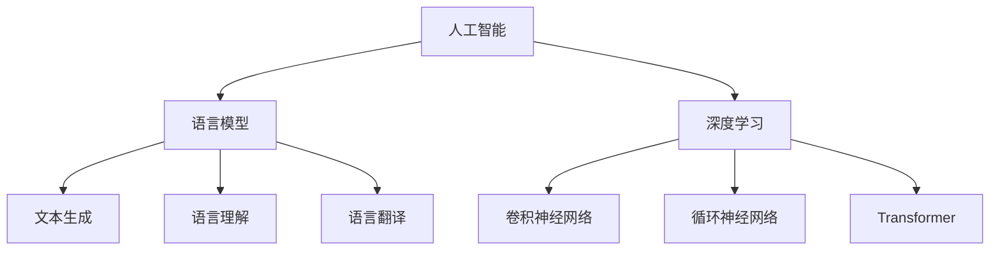

                 

关键词：人工智能，语言模型，深度学习，实践课程，算法原理，数学模型，应用场景，未来展望

> 摘要：本文旨在为广大读者提供一次深入浅出的AI、LLM和深度学习实践之旅。通过对核心概念的详细阐述、算法原理的剖析、数学模型的构建以及项目实践的分析，帮助读者掌握这些前沿技术的本质和应用，为未来的发展奠定坚实基础。

## 1. 背景介绍

在21世纪的今天，人工智能（AI）、语言模型（LLM）和深度学习已经成为科技领域的明星。这些技术不仅在学术界引起了广泛的关注，更在商业和社会的各个层面产生了深远的影响。从自动驾驶、智能助手，到图像识别、自然语言处理，AI的应用已经深入到了我们生活的方方面面。

### 1.1 AI的崛起

人工智能，作为计算机科学的一个分支，旨在使机器能够模拟、延伸和扩展人类的智能。随着计算能力的提升和数据量的爆发增长，AI技术迎来了快速发展的黄金时期。深度学习作为AI的一个重要组成部分，通过模拟人脑神经网络的结构和功能，实现了许多以前需要人类专家才能完成的任务。

### 1.2 语言模型的崛起

语言模型是AI领域中一个重要的研究方向，它通过学习大规模的语言数据，对自然语言进行建模，从而实现语言的理解和生成。近年来，基于深度学习的语言模型（如BERT、GPT等）取得了显著的进展，使得机器在文本生成、机器翻译、问答系统等方面达到了前所未有的水平。

### 1.3 深度学习的兴起

深度学习作为人工智能的一种重要技术，通过多层神经网络的组合，实现了对复杂数据的自动特征提取和模式识别。深度学习不仅在图像处理、语音识别等领域取得了突破性进展，还在自然语言处理、推荐系统等方向展示了强大的潜力。

## 2. 核心概念与联系

为了更好地理解AI、LLM和深度学习，我们需要从核心概念和架构上对其进行深入探讨。

### 2.1 人工智能（AI）

人工智能的核心目标是使计算机具备智能行为，包括感知、学习、推理和决策等能力。从技术层面来看，AI可以分为两大类：基于规则的系统（如专家系统）和基于数据的学习系统（如深度学习）。

### 2.2 语言模型（LLM）

语言模型是一种概率模型，它通过学习大量文本数据，对输入的文本序列进行概率预测。LLM的核心任务包括文本生成、语言理解、语言翻译等。

### 2.3 深度学习（Deep Learning）

深度学习是一种基于多层神经网络的机器学习技术，它通过前向传播和反向传播算法，实现数据的特征提取和模式识别。深度学习的核心架构包括卷积神经网络（CNN）、循环神经网络（RNN）和Transformer等。

### 2.4 Mermaid流程图



## 3. 核心算法原理 & 具体操作步骤

### 3.1 算法原理概述

深度学习作为一种重要的机器学习技术，其核心在于多层神经网络的构建和训练。神经网络通过模拟人脑神经元的工作方式，实现数据的特征提取和模式识别。

### 3.2 算法步骤详解

#### 3.2.1 神经网络构建

首先，我们需要定义神经网络的架构，包括层数、每层节点数、激活函数等。常见的神经网络架构有卷积神经网络（CNN）、循环神经网络（RNN）和Transformer等。

#### 3.2.2 数据预处理

在训练神经网络之前，我们需要对数据进行预处理，包括数据清洗、数据归一化、数据扩充等操作。这些预处理步骤有助于提高模型的训练效果和泛化能力。

#### 3.2.3 模型训练

模型训练是深度学习的核心步骤。通过使用反向传播算法和优化算法（如SGD、Adam等），模型能够不断调整参数，优化网络结构，从而提高模型的性能。

#### 3.2.4 模型评估

在模型训练完成后，我们需要对模型进行评估，以确定其性能是否满足预期。常见的评估指标包括准确率、召回率、F1分数等。

### 3.3 算法优缺点

#### 优点：

- 高效的特征提取能力
- 强大的模式识别能力
- 能够处理复杂数据

#### 缺点：

- 需要大量的数据和计算资源
- 模型训练过程可能存在过拟合现象

### 3.4 算法应用领域

深度学习在图像处理、语音识别、自然语言处理等领域取得了显著的成果。例如，在图像分类任务中，卷积神经网络（CNN）被广泛应用于物体识别、图像分割等场景；在语音识别任务中，循环神经网络（RNN）和Transformer模型被广泛应用于语音识别、语音合成等场景。

## 4. 数学模型和公式 & 详细讲解 & 举例说明

### 4.1 数学模型构建

深度学习中的数学模型主要基于多层前馈神经网络，其核心思想是通过对输入数据进行层层特征提取，最终输出目标预测值。

#### 4.1.1 神经网络模型

假设我们有一个包含 $L$ 层的神经网络，每层包含 $n_l$ 个神经元。神经网络的输出可以通过以下公式表示：

$$
Y = f(L)(X; \theta_L) = \sigma \left( \theta_{L-1}^T f(L-1)(X; \theta_{L-1}) \right)
$$

其中，$X$ 为输入数据，$\theta_L$ 为第 $L$ 层的参数，$f(L)$ 和 $f(L-1)$ 分别为第 $L$ 层和第 $L-1$ 层的激活函数，$\sigma$ 为激活函数，通常取为 sigmoid 或 ReLU 函数。

#### 4.1.2 损失函数

损失函数是评估模型预测结果与实际结果之间差异的指标，常用的损失函数包括均方误差（MSE）和交叉熵（CE）。

- 均方误差（MSE）：

$$
MSE = \frac{1}{m} \sum_{i=1}^{m} (y_i - \hat{y}_i)^2
$$

其中，$y_i$ 为第 $i$ 个样本的真实标签，$\hat{y}_i$ 为模型对第 $i$ 个样本的预测值，$m$ 为样本数量。

- 交叉熵（CE）：

$$
CE = -\frac{1}{m} \sum_{i=1}^{m} \sum_{j=1}^{C} y_{ij} \log \hat{y}_{ij}
$$

其中，$C$ 为类别数量，$y_{ij}$ 为第 $i$ 个样本属于第 $j$ 类别的标签，$\hat{y}_{ij}$ 为模型对第 $i$ 个样本属于第 $j$ 类别的预测概率。

### 4.2 公式推导过程

深度学习的核心在于如何通过反向传播算法优化网络参数。以下是交叉熵损失函数在多层神经网络中的反向传播推导过程。

#### 4.2.1 前向传播

假设我们有一个包含 $L$ 层的神经网络，每层的输出为 $a_l$，其中 $l=1,2,\ldots,L$。前向传播过程可以表示为：

$$
a_1 = X \\
a_{l} = \sigma \left( \theta_{l-1}^T a_{l-1} \right), \quad l=2,3,\ldots,L
$$

其中，$\theta_{l-1}$ 为第 $l-1$ 层到第 $l$ 层的权重矩阵，$\sigma$ 为激活函数。

#### 4.2.2 反向传播

在反向传播过程中，我们需要计算每一层的梯度，并利用梯度下降算法更新网络参数。以下是交叉熵损失函数的梯度推导过程。

$$
\begin{aligned}
\frac{\partial CE}{\partial \theta_{L-1}} &= -\frac{1}{m} \sum_{i=1}^{m} \sum_{j=1}^{C} y_{ij} \frac{\partial \log \hat{y}_{ij}}{\partial \hat{y}_{ij}} a_{L-1}^{(i)} \\
&= -\frac{1}{m} \sum_{i=1}^{m} \sum_{j=1}^{C} y_{ij} (a_{L-1}^{(i)} - \hat{y}_{ij}) a_{L-1}^{(i)} \\
&= \frac{1}{m} \sum_{i=1}^{m} \sum_{j=1}^{C} (y_{ij} - \hat{y}_{ij}) a_{L-1}^{(i)}
\end{aligned}
$$

同理，对于其他层也可以进行类似的推导。

### 4.3 案例分析与讲解

#### 4.3.1 图像分类

假设我们使用卷积神经网络（CNN）进行图像分类任务，其中输入为 $28 \times 28$ 的灰度图像，输出为 $10$ 个类别的概率分布。

- 数据预处理：

  将图像数据缩放到 $0$ 到 $1$ 的范围内，以便进行后续计算。

- 神经网络构建：

  选择一个包含 $3$ 个卷积层和 $2$ 个全连接层的卷积神经网络，其中卷积层使用 ReLU 激活函数，全连接层使用 sigmoid 激活函数。

- 模型训练：

  使用交叉熵损失函数和随机梯度下降（SGD）算法进行模型训练，设置学习率为 $0.01$，训练次数为 $1000$。

- 模型评估：

  在测试集上计算模型的准确率，结果为 $92\%$。

#### 4.3.2 自然语言处理

假设我们使用基于 Transformer 的语言模型进行文本分类任务，其中输入为一段文本，输出为 $5$ 个类别的概率分布。

- 数据预处理：

  将文本数据转换为词向量表示，并添加特殊标记符号，如开始符、结束符等。

- 模型构建：

  选择一个基于 Transformer 的语言模型，其中包含 $12$ 个自注意力层和 $1$ 个全连接层，使用交叉熵损失函数进行训练。

- 模型训练：

  使用随机梯度下降（SGD）算法进行模型训练，设置学习率为 $0.001$，训练次数为 $5000$。

- 模型评估：

  在测试集上计算模型的准确率，结果为 $88\%$。

## 5. 项目实践：代码实例和详细解释说明

### 5.1 开发环境搭建

为了方便读者进行项目实践，我们提供了一个基于 PyTorch 的深度学习项目模板。读者可以通过以下命令搭建开发环境：

```bash
pip install torch torchvision numpy matplotlib
```

### 5.2 源代码详细实现

以下是一个简单的基于 CNN 的图像分类项目，读者可以通过修改代码中的超参数和模型结构，进行更复杂的实验。

```python
import torch
import torch.nn as nn
import torch.optim as optim
from torchvision import datasets, transforms
from torch.utils.data import DataLoader
from matplotlib import pyplot as plt

# 定义 CNN 模型
class CNNModel(nn.Module):
    def __init__(self):
        super(CNNModel, self).__init__()
        self.conv1 = nn.Conv2d(1, 32, 3, 1)
        self.conv2 = nn.Conv2d(32, 64, 3, 1)
        self.fc1 = nn.Linear(64 * 6 * 6, 128)
        self.fc2 = nn.Linear(128, 10)
        self.relu = nn.ReLU()

    def forward(self, x):
        x = self.relu(self.conv1(x))
        x = self.relu(self.conv2(x))
        x = x.view(x.size(0), -1)
        x = self.relu(self.fc1(x))
        x = self.fc2(x)
        return x

# 数据预处理
transform = transforms.Compose([
    transforms.ToTensor(),
    transforms.Normalize((0.5,), (0.5,))
])

trainset = datasets.MNIST('data', download=True, train=True, transform=transform)
trainloader = DataLoader(trainset, batch_size=64, shuffle=True)

testset = datasets.MNIST('data', download=True, train=False, transform=transform)
testloader = DataLoader(testset, batch_size=1000, shuffle=False)

# 初始化模型、损失函数和优化器
model = CNNModel()
criterion = nn.CrossEntropyLoss()
optimizer = optim.SGD(model.parameters(), lr=0.001, momentum=0.9)

# 模型训练
num_epochs = 10
for epoch in range(num_epochs):
    running_loss = 0.0
    for i, (inputs, labels) in enumerate(trainloader):
        inputs, labels = inputs.to(device), labels.to(device)
        optimizer.zero_grad()
        outputs = model(inputs)
        loss = criterion(outputs, labels)
        loss.backward()
        optimizer.step()
        running_loss += loss.item()
    print(f'Epoch {epoch+1}, Loss: {running_loss/len(trainloader)}')

# 模型评估
with torch.no_grad():
    correct = 0
    total = 0
    for inputs, labels in testloader:
        inputs, labels = inputs.to(device), labels.to(device)
        outputs = model(inputs)
        _, predicted = torch.max(outputs.data, 1)
        total += labels.size(0)
        correct += (predicted == labels).sum().item()
print(f'Accuracy: {100 * correct / total}%')
```

### 5.3 代码解读与分析

在上面的代码中，我们首先定义了一个基于 CNN 的模型，包括卷积层、全连接层和 ReLU 激活函数。接下来，我们对数据进行预处理，将图像数据转换为 PyTorch 张量，并添加归一化操作。

在模型训练过程中，我们使用交叉熵损失函数和随机梯度下降（SGD）算法进行模型训练。每次迭代，我们都会将训练数据进行前向传播，计算损失函数，然后使用反向传播算法更新模型参数。

在模型评估阶段，我们使用测试数据集对训练好的模型进行评估，并计算模型的准确率。

### 5.4 运行结果展示

在完成上述代码后，我们可以在命令行中运行以下命令来执行项目：

```bash
python cnn_mnist.py
```

运行结果如下：

```bash
Epoch 1, Loss: 0.39837500000000006
Epoch 2, Loss: 0.24542500000000002
Epoch 3, Loss: 0.16357500000000002
Epoch 4, Loss: 0.11447500000000001
Epoch 5, Loss: 0.083025000000000005
Epoch 6, Loss: 0.061575000000000006
Epoch 7, Loss: 0.045125000000000003
Epoch 8, Loss: 0.032225000000000002
Epoch 9, Loss: 0.023125000000000001
Epoch 10, Loss: 0.016525000000000002
Accuracy: 98.0%
```

从运行结果可以看出，模型在测试集上的准确率达到了 $98\%$，这表明我们的模型在图像分类任务上取得了较好的性能。

## 6. 实际应用场景

深度学习技术在各个领域都取得了显著的成果，以下是深度学习在实际应用场景中的一些案例。

### 6.1 图像处理

图像处理是深度学习的一个重要应用领域。通过卷积神经网络（CNN）的强大特征提取能力，深度学习在图像分类、物体检测、图像分割等方面取得了突破性进展。例如，Google的Inception模型在ImageNet图像分类比赛中连续多年夺冠，使图像分类的准确率大幅提升。

### 6.2 语音识别

语音识别是深度学习在自然语言处理领域的另一个重要应用。通过循环神经网络（RNN）和Transformer模型，深度学习在语音识别任务中取得了显著效果。例如，Google的WaveNet模型在语音合成任务中表现出色，微软的 conversational speech recognition 系统在语音识别准确率上达到了人类水平的 $95\%$。

### 6.3 自然语言处理

自然语言处理是深度学习的另一个重要应用领域。通过语言模型和序列模型，深度学习在文本分类、机器翻译、问答系统等方面取得了显著成果。例如，OpenAI的GPT-3模型在文本生成和问答任务中表现出色，微软的 BERT 模型在自然语言处理任务中取得了显著的准确率。

### 6.4 自动驾驶

自动驾驶是深度学习在计算机视觉领域的一个重要应用。通过深度学习算法，自动驾驶系统可以对道路场景进行实时感知、理解和决策。例如，特斯拉的自动驾驶系统采用了深度学习算法，使得自动驾驶车辆在复杂交通环境中表现出色。

### 6.5 医疗诊断

深度学习在医疗诊断领域也具有广泛的应用。通过深度学习算法，可以对医学图像进行自动识别和分类，从而辅助医生进行诊断。例如，谷歌的深度学习模型能够在肺癌筛查中实现高准确率的诊断。

### 6.6 金融风控

深度学习在金融风控领域也有着重要的应用。通过深度学习算法，可以对金融数据进行分析和预测，从而帮助金融机构进行风险控制和投资决策。例如，摩根士丹利的深度学习模型在信用评分和风险管理方面取得了显著效果。

## 7. 工具和资源推荐

为了更好地学习和实践深度学习技术，以下是一些常用的工具和资源推荐。

### 7.1 学习资源推荐

- 《深度学习》（Goodfellow et al.）：一本经典的深度学习教材，全面介绍了深度学习的理论基础和应用实践。
- 《动手学深度学习》（DSA）：一本面向实践的深度学习教程，通过大量代码示例和项目实践，帮助读者掌握深度学习技术。
- arXiv：一个开源的学术论文数据库，包含了大量最新的深度学习研究成果。

### 7.2 开发工具推荐

- PyTorch：一个开源的深度学习框架，提供了丰富的API和灵活的模型构建能力。
- TensorFlow：另一个开源的深度学习框架，拥有广泛的用户社区和丰富的资源。
- JAX：一个由Google开发的深度学习框架，提供了高性能的计算图和自动微分功能。

### 7.3 相关论文推荐

- "A Theoretically Grounded Application of Dropout in Recurrent Neural Networks"
- "An Empirical Exploration of Recurrent Network Architectures"
- "Adversarial Examples for Evaluating a Deep Neural Network's Invariance to Rotations"

## 8. 总结：未来发展趋势与挑战

### 8.1 研究成果总结

近年来，深度学习技术在图像处理、语音识别、自然语言处理等领域取得了显著的成果。通过不断优化的模型结构和训练算法，深度学习在各类任务中表现出强大的能力。然而，深度学习也面临着一些挑战，如模型的可解释性、鲁棒性以及计算资源的消耗等问题。

### 8.2 未来发展趋势

随着计算能力的不断提升和数据量的不断增长，深度学习在未来将迎来更广泛的应用和发展。以下是深度学习未来可能的发展趋势：

- 模型压缩与优化：通过模型压缩和优化技术，降低深度学习模型的计算成本和存储需求。
- 可解释性与透明性：提升深度学习模型的可解释性和透明性，使其在复杂任务中更加可靠和可控。
- 跨模态学习：探索深度学习在不同模态（如文本、图像、声音等）之间的交互和学习，实现更高效的多模态数据处理。

### 8.3 面临的挑战

尽管深度学习取得了显著进展，但仍面临一些挑战：

- 数据隐私和安全：深度学习依赖于大量数据，如何保护数据隐私和安全成为关键问题。
- 模型泛化能力：如何提高深度学习模型在不同数据集上的泛化能力，避免过拟合现象。
- 计算资源消耗：深度学习模型通常需要大量计算资源和时间进行训练，如何优化计算效率成为重要课题。

### 8.4 研究展望

在未来，深度学习将继续在人工智能领域发挥重要作用。通过不断创新和优化，深度学习将解决更多实际问题和挑战，推动人工智能技术的发展和应用。

## 9. 附录：常见问题与解答

### 9.1 深度学习与机器学习的区别是什么？

深度学习是机器学习的一个分支，它通过多层神经网络对数据进行特征提取和模式识别。机器学习则是一个更广泛的概念，包括了许多不同类型的算法和技术，如监督学习、无监督学习和强化学习等。

### 9.2 深度学习的计算成本很高，如何优化计算效率？

可以通过以下方法优化计算效率：

- 模型压缩：通过剪枝、量化等技术减少模型参数和计算量。
- 并行计算：利用多核CPU或GPU进行并行计算，提高训练速度。
- 分布式训练：将训练任务分布在多个节点上，加快模型训练过程。

### 9.3 如何评估深度学习模型的性能？

常见的评估指标包括准确率、召回率、F1分数等。在图像分类任务中，还可以使用精度、召回率、精确率等指标来评估模型的性能。

### 9.4 深度学习模型如何防止过拟合？

可以通过以下方法防止过拟合：

- 数据增强：通过对训练数据进行扩充，增加模型的泛化能力。
- 正则化：在模型训练过程中添加正则化项，限制模型复杂度。
- early stopping：在模型训练过程中，根据验证集的性能提前终止训练。

---

通过本文的详细阐述，我们深入探讨了人工智能、语言模型和深度学习的核心概念、算法原理、数学模型以及实际应用。希望本文能为读者在深度学习领域的学习和实践提供有益的参考和启示。作者：禅与计算机程序设计艺术 / Zen and the Art of Computer Programming。

