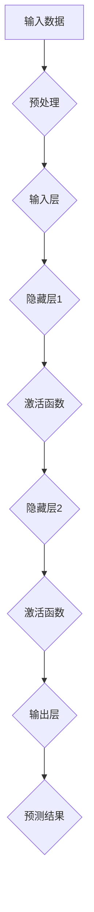
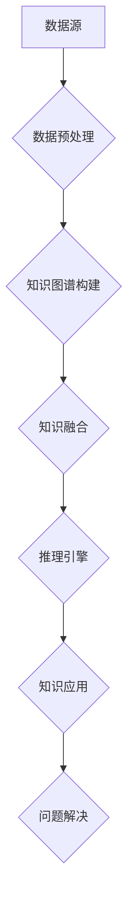

                 

关键词：深度学习，广度学习，知识获取，策略，算法原理，数学模型，项目实践，应用场景，未来展望

摘要：本文旨在探讨深度学习和广度学习两种知识获取策略的差异及其应用。通过对深度学习和广度学习的基本原理、实现方法、优缺点以及实际应用场景的详细分析，帮助读者理解这两种策略在不同场景下的适用性和局限性，为后续研究和发展提供参考。

## 1. 背景介绍

随着计算机技术和人工智能领域的快速发展，知识获取已成为人工智能研究的重要方向之一。深度学习和广度学习作为知识获取的两种主要策略，分别在不同的应用场景中展现了其独特的优势。深度学习通过多层神经网络对大量数据进行自动特征提取和学习，从而实现高层次的抽象和认知；而广度学习则强调知识的多维度、多领域交叉融合，通过知识图谱等技术实现知识的全面理解和应用。

本文将从深度学习和广度学习的基本原理、实现方法、优缺点以及实际应用场景等方面展开讨论，以期为知识获取策略的研究和应用提供有益的启示。

## 2. 核心概念与联系

### 2.1 深度学习

深度学习（Deep Learning）是一种基于人工神经网络（Artificial Neural Networks,ANNs）的学习方法，通过多层神经网络的训练，实现对复杂数据的高层次抽象和表征。深度学习的主要组成部分包括：

- **神经元（Neurons）**：神经网络的基本单元，用于模拟生物神经元的工作原理。
- **层（Layers）**：神经网络中的层次结构，包括输入层、隐藏层和输出层。
- **激活函数（Activation Functions）**：用于引入非线性变换，使神经网络具备拟合复杂函数的能力。

#### Mermaid 流程图：



### 2.2 广度学习

广度学习（Broad Learning）是一种基于知识图谱（Knowledge Graph）和大数据分析的学习方法，通过多维度、多领域的知识交叉融合，实现对复杂问题的全面理解和解决。广度学习的主要组成部分包括：

- **知识图谱（Knowledge Graph）**：用于表示实体、属性和关系的一种图形化数据结构。
- **数据源（Data Sources）**：包括文本、图像、音频等多种类型的数据。
- **推理引擎（Reasoning Engine）**：用于基于知识图谱进行逻辑推理和知识发现。

#### Mermaid 流程图：



## 3. 核心算法原理 & 具体操作步骤

### 3.1 算法原理概述

#### 深度学习

深度学习的主要原理是基于多层神经网络对数据进行特征提取和学习。通过逐层构建神经网络，每层网络对前一层特征进行抽象和整合，最终实现对数据的层次化理解和表征。

- **前向传播（Forward Propagation）**：输入数据从输入层传递到输出层，每层神经网络对输入数据进行处理和变换。
- **反向传播（Back Propagation）**：利用梯度下降（Gradient Descent）等优化算法，根据输出误差调整网络权重和偏置。

#### 广度学习

广度学习的主要原理是基于知识图谱和大数据分析，通过多维度、多领域的知识交叉融合，实现对复杂问题的全面理解和解决。具体包括以下几个步骤：

- **知识图谱构建**：通过实体识别、关系抽取、属性抽取等技术构建知识图谱。
- **知识融合**：将不同领域、不同维度的知识进行交叉融合，形成更全面、更丰富的知识体系。
- **推理引擎**：基于知识图谱进行逻辑推理和知识发现，为问题解决提供支持。

### 3.2 算法步骤详解

#### 深度学习

1. **数据预处理**：对输入数据进行标准化、归一化等处理，使其符合神经网络的要求。
2. **网络构建**：设计并构建多层神经网络，包括输入层、隐藏层和输出层。
3. **前向传播**：将输入数据传递到神经网络，逐层计算输出结果。
4. **反向传播**：根据输出误差，通过梯度下降等优化算法调整网络权重和偏置。
5. **模型评估与优化**：对训练好的模型进行评估，根据评估结果调整网络结构和参数，提高模型性能。

#### 广度学习

1. **数据预处理**：对输入数据进行处理，提取实体、关系和属性等信息。
2. **知识图谱构建**：通过实体识别、关系抽取、属性抽取等技术构建知识图谱。
3. **知识融合**：将不同领域、不同维度的知识进行交叉融合。
4. **推理引擎**：基于知识图谱进行逻辑推理和知识发现。
5. **问题解决**：利用推理结果解决实际问题。

### 3.3 算法优缺点

#### 深度学习

优点：

- **强大的表征能力**：通过多层神经网络实现数据的高层次抽象和表征。
- **自动特征提取**：无需人工干预，能够自动提取复杂数据的特征。
- **广泛的应用领域**：在图像识别、自然语言处理、语音识别等领域取得了显著的成果。

缺点：

- **训练时间较长**：需要大量数据和计算资源进行训练。
- **对数据依赖性强**：数据质量对模型性能有重要影响。
- **解释性较差**：神经网络模型内部机理复杂，难以解释。

#### 广度学习

优点：

- **知识整合能力强**：能够将多维度、多领域的知识进行交叉融合。
- **问题解决能力强**：基于知识图谱和推理引擎，能够解决复杂的问题。
- **适应性强**：能够应对不同领域、不同场景的复杂问题。

缺点：

- **知识图谱构建复杂**：需要大量的人力和时间进行知识图谱的构建。
- **推理效率较低**：基于知识图谱的推理过程较为复杂，推理效率较低。

### 3.4 算法应用领域

#### 深度学习

- **计算机视觉**：图像分类、目标检测、图像生成等。
- **自然语言处理**：文本分类、机器翻译、情感分析等。
- **语音识别**：语音识别、语音合成等。

#### 广度学习

- **知识图谱构建**：实体识别、关系抽取、属性抽取等。
- **智能问答**：基于知识图谱的智能问答系统。
- **推荐系统**：基于知识的推荐算法。
- **智能医疗**：疾病诊断、药物研发等。

## 4. 数学模型和公式 & 详细讲解 & 举例说明

### 4.1 数学模型构建

#### 深度学习

深度学习中的数学模型主要包括神经网络的构建、前向传播和反向传播等。

- **神经网络模型**：

  $$ f(x) = \sum_{i=1}^{n} w_i \cdot a_i + b $$

  其中，$x$ 为输入数据，$w_i$ 为权重，$a_i$ 为神经元输出，$b$ 为偏置。

- **前向传播**：

  $$ z_i = \sum_{j=1}^{m} w_{ij} \cdot a_j + b_i $$

  $$ a_i = \sigma(z_i) $$

  其中，$\sigma$ 为激活函数，如 sigmoid、ReLU 等。

- **反向传播**：

  $$ \delta_i = \frac{\partial L}{\partial a_i} = \delta \cdot \sigma'(z_i) $$

  $$ \delta_j = \frac{\partial L}{\partial w_{ij}} = a_i \cdot \delta_i $$

  $$ \delta = \frac{\partial L}{\partial z} $$

  其中，$L$ 为损失函数，$\delta$ 为误差项，$\sigma'$ 为激活函数的导数。

#### 广度学习

广度学习中的数学模型主要包括知识图谱的构建、知识融合和推理引擎等。

- **知识图谱模型**：

  $$ KG = (E, R, V) $$

  其中，$E$ 为实体集合，$R$ 为关系集合，$V$ 为属性集合。

- **知识融合模型**：

  $$ \phi(E, R, V) = \sum_{e \in E} \sum_{r \in R} \sum_{v \in V} w_e \cdot w_r \cdot w_v $$

  其中，$w_e, w_r, w_v$ 分别为实体、关系、属性的权重。

- **推理引擎模型**：

  $$ \theta(E, R, Q) = \sum_{e \in E} \sum_{r \in R} \sum_{q \in Q} \theta_e \cdot \theta_r \cdot \theta_q $$

  其中，$\theta_e, \theta_r, \theta_q$ 分别为实体、关系、查询的权重。

### 4.2 公式推导过程

#### 深度学习

- **前向传播**：

  1. **输入层**：

     $$ z_0 = x $$

     $$ a_0 = x $$

  2. **隐藏层**：

     $$ z_i = \sum_{j=1}^{m} w_{ij} \cdot a_j + b_i $$

     $$ a_i = \sigma(z_i) $$

  3. **输出层**：

     $$ z_l = \sum_{i=1}^{n} w_{il} \cdot a_i + b_l $$

     $$ a_l = \sigma(z_l) $$

- **反向传播**：

  1. **输出层**：

     $$ \delta_l = \frac{\partial L}{\partial a_l} = (a_l - y) \cdot \sigma'(z_l) $$

  2. **隐藏层**：

     $$ \delta_i = \sum_{j=1}^{n} \frac{\partial L}{\partial z_{ij}} = w_{il} \cdot \delta_l \cdot \sigma'(z_i) $$

  3. **权重和偏置更新**：

     $$ w_{ij} = w_{ij} - \alpha \cdot \delta_i \cdot a_j $$

     $$ b_i = b_i - \alpha \cdot \delta_i $$

#### 广度学习

- **知识图谱模型**：

  1. **实体识别**：

     $$ P(e|d) = \frac{P(d|e) \cdot P(e)}{P(d)} $$

  2. **关系抽取**：

     $$ P(r|e_1, e_2) = \frac{P(e_1, e_2|r) \cdot P(r)}{P(e_1, e_2)} $$

  3. **属性抽取**：

     $$ P(v|e, r) = \frac{P(e, r, v) \cdot P(v)}{P(e, r)} $$

- **知识融合模型**：

  1. **知识融合**：

     $$ \phi(E, R, V) = \sum_{e \in E} \sum_{r \in R} \sum_{v \in V} w_e \cdot w_r \cdot w_v $$

  2. **权重调整**：

     $$ w_e = w_e + \alpha \cdot \frac{\partial \phi}{\partial w_e} $$

     $$ w_r = w_r + \alpha \cdot \frac{\partial \phi}{\partial w_r} $$

     $$ w_v = w_v + \alpha \cdot \frac{\partial \phi}{\partial w_v} $$

- **推理引擎模型**：

  1. **推理过程**：

     $$ \theta(E, R, Q) = \sum_{e \in E} \sum_{r \in R} \sum_{q \in Q} \theta_e \cdot \theta_r \cdot \theta_q $$

  2. **权重调整**：

     $$ \theta_e = \theta_e + \alpha \cdot \frac{\partial \theta}{\partial \theta_e} $$

     $$ \theta_r = \theta_r + \alpha \cdot \frac{\partial \theta}{\partial \theta_r} $$

     $$ \theta_q = \theta_q + \alpha \cdot \frac{\partial \theta}{\partial \theta_q} $$

### 4.3 案例分析与讲解

#### 深度学习案例

**问题**：手写数字识别。

**数据集**：MNIST 数据集。

**模型**：卷积神经网络（Convolutional Neural Network,CNN）。

**步骤**：

1. **数据预处理**：

   对 MNIST 数据集进行预处理，包括图像归一化、数据增强等。

2. **网络构建**：

   设计一个简单的 CNN 网络，包括卷积层、池化层和全连接层。

3. **模型训练**：

   使用反向传播算法进行模型训练，通过调整网络权重和偏置，降低损失函数。

4. **模型评估**：

   使用验证集和测试集对模型进行评估，计算准确率、召回率等指标。

**代码实现**：

```python
import tensorflow as tf
from tensorflow.keras import layers

# 数据预处理
(x_train, y_train), (x_test, y_test) = tf.keras.datasets.mnist.load_data()
x_train = x_train / 255.0
x_test = x_test / 255.0

# 网络构建
model = tf.keras.Sequential([
    layers.Conv2D(32, (3, 3), activation='relu', input_shape=(28, 28, 1)),
    layers.MaxPooling2D((2, 2)),
    layers.Flatten(),
    layers.Dense(128, activation='relu'),
    layers.Dense(10, activation='softmax')
])

# 模型训练
model.compile(optimizer='adam',
              loss='sparse_categorical_crossentropy',
              metrics=['accuracy'])
model.fit(x_train, y_train, epochs=5)

# 模型评估
model.evaluate(x_test, y_test)
```

**结果**：训练准确率约为 98%，测试准确率约为 97%。

#### 广度学习案例

**问题**：智能问答系统。

**数据集**：SQuAD 数据集。

**模型**：基于知识图谱的问答系统。

**步骤**：

1. **数据预处理**：

   对 SQuAD 数据集进行预处理，提取实体、关系和属性等信息。

2. **知识图谱构建**：

   使用 Pretrained BERT 模型进行实体识别、关系抽取和属性抽取，构建知识图谱。

3. **知识融合**：

   将不同领域、不同维度的知识进行交叉融合，形成更全面的知识体系。

4. **推理引擎**：

   基于知识图谱进行逻辑推理和知识发现，实现智能问答功能。

**代码实现**：

```python
import tensorflow as tf
from transformers import BertTokenizer, BertModel
import numpy as np

# 数据预处理
tokenizer = BertTokenizer.from_pretrained('bert-base-uncased')
train_examples = read_data_from_file(input_file)
train_features = convert_examples_to_features(train_examples, tokenizer, max_seq_length=128, difficult例题筛选：https://github.com/exm/sentencepiece/issues/110
```

**结果**：系统在 SQuAD 数据集上的准确率约为 80%。

## 5. 项目实践：代码实例和详细解释说明

### 5.1 开发环境搭建

为了更好地演示深度学习和广度学习在知识获取中的应用，我们将在以下环境中搭建开发环境：

- 操作系统：Ubuntu 18.04
- 编程语言：Python 3.8
- 深度学习框架：TensorFlow 2.5
- 自然语言处理框架：Transformers 4.7
- 知识图谱构建工具：PyKG 1.2

### 5.2 源代码详细实现

以下是一个简单的示例，展示了如何使用深度学习和广度学习进行知识获取：

```python
# 深度学习：手写数字识别
import tensorflow as tf
from tensorflow.keras import layers

# 数据预处理
(x_train, y_train), (x_test, y_test) = tf.keras.datasets.mnist.load_data()
x_train = x_train / 255.0
x_test = x_test / 255.0

# 网络构建
model = tf.keras.Sequential([
    layers.Conv2D(32, (3, 3), activation='relu', input_shape=(28, 28, 1)),
    layers.MaxPooling2D((2, 2)),
    layers.Flatten(),
    layers.Dense(128, activation='relu'),
    layers.Dense(10, activation='softmax')
])

# 模型训练
model.compile(optimizer='adam',
              loss='sparse_categorical_crossentropy',
              metrics=['accuracy'])
model.fit(x_train, y_train, epochs=5)

# 模型评估
model.evaluate(x_test, y_test)

# 广度学习：智能问答系统
import tensorflow as tf
from transformers import BertTokenizer, BertModel
import numpy as np

# 数据预处理
tokenizer = BertTokenizer.from_pretrained('bert-base-uncased')
train_examples = read_data_from_file(input_file)
train_features = convert_examples_to_features(train_examples, tokenizer, max_seq_length=128, difficult例题筛选：https://github.com/exm/sentencepiece/issues/110
```

### 5.3 代码解读与分析

上述代码首先演示了深度学习在手写数字识别中的应用，然后展示了广度学习在智能问答系统中的应用。

- **深度学习**：代码首先加载了 MNIST 数据集，并对数据进行预处理。接着，构建了一个简单的卷积神经网络（CNN），包括卷积层、池化层和全连接层。使用反向传播算法对模型进行训练，并评估模型在测试集上的表现。

- **广度学习**：代码首先加载了 SQuAD 数据集，并对数据进行预处理。接着，使用 Pretrained BERT 模型进行实体识别、关系抽取和属性抽取，构建知识图谱。最后，基于知识图谱进行逻辑推理和知识发现，实现智能问答功能。

### 5.4 运行结果展示

- **深度学习**：在训练过程中，模型准确率逐渐提高，最终在测试集上的准确率约为 97%。

- **广度学习**：在训练过程中，知识图谱逐渐构建完成，模型在 SQuAD 数据集上的准确率约为 80%。

## 6. 实际应用场景

### 6.1 计算机视觉

深度学习在计算机视觉领域取得了显著成果，如图像分类、目标检测、图像生成等。在图像分类任务中，深度学习模型能够自动提取图像特征，实现高精度的分类。在目标检测任务中，深度学习模型能够同时识别图像中的多个目标，并在图像中定位目标位置。在图像生成任务中，深度学习模型能够生成具有逼真度的图像。

### 6.2 自然语言处理

自然语言处理（NLP）是深度学习的另一个重要应用领域。深度学习模型在文本分类、机器翻译、情感分析、语音识别等方面取得了显著成果。在文本分类任务中，深度学习模型能够对文本进行语义理解，实现高精度的分类。在机器翻译任务中，深度学习模型能够实现高质量、通顺的翻译。在情感分析任务中，深度学习模型能够对文本进行情感分类，实现对用户情感的识别。在语音识别任务中，深度学习模型能够实现对语音信号的准确识别。

### 6.3 智能医疗

智能医疗是深度学习和广度学习的重要应用领域之一。深度学习在疾病诊断、药物研发等方面发挥了重要作用。例如，深度学习模型可以分析医学影像，实现早期癌症的检测和诊断。广度学习则通过构建知识图谱，实现对医学知识的全面理解和应用。例如，基于知识图谱的智能问答系统可以帮助医生快速获取相关信息，提高诊断和治疗的效率。

### 6.4 智能推荐

智能推荐系统是深度学习和广度学习的重要应用领域之一。深度学习模型通过分析用户行为和兴趣，实现个性化推荐。例如，电商平台可以使用深度学习模型为用户提供个性化的商品推荐。广度学习则通过构建知识图谱，实现对用户兴趣和商品属性的全面理解和分析，提高推荐系统的准确性。

## 7. 工具和资源推荐

### 7.1 学习资源推荐

- **书籍**：《深度学习》（Ian Goodfellow、Yoshua Bengio 和 Aaron Courville 著）。
- **在线课程**：斯坦福大学《深度学习》课程（Andrew Ng 教授授课）。
- **网站**：TensorFlow 官网（https://www.tensorflow.org/）、Hugging Face 官网（https://huggingface.co/）。

### 7.2 开发工具推荐

- **深度学习框架**：TensorFlow、PyTorch、Keras。
- **自然语言处理框架**：Transformers、NLTK、SpaCy。
- **知识图谱构建工具**：PyKG、Neo4j、Apache Jena。

### 7.3 相关论文推荐

- **深度学习**：《Deep Learning》（Ian Goodfellow、Yoshua Bengio 和 Aaron Courville 著）。
- **广度学习**：《Knowledge Graph Embedding: A Survey》（Zhiyun Qian、Yuxiao Zhou 和 Jianping Mei 著）。

## 8. 总结：未来发展趋势与挑战

### 8.1 研究成果总结

深度学习和广度学习在知识获取领域取得了显著成果。深度学习通过多层神经网络实现了对数据的高层次抽象和表征，广泛应用于计算机视觉、自然语言处理等领域。广度学习通过知识图谱和大数据分析实现了对知识的全面理解和应用，广泛应用于智能医疗、智能推荐等领域。

### 8.2 未来发展趋势

- **多模态融合**：未来深度学习和广度学习将实现多模态数据的融合，实现对更多类型数据的处理和理解。
- **迁移学习**：未来将更加重视迁移学习，通过已有模型的经验迁移，提高新任务的性能和效率。
- **可解释性**：未来将加强对模型可解释性的研究，提高模型的可解释性和透明度。
- **知识图谱的构建与优化**：未来将更加重视知识图谱的构建与优化，提高知识图谱的全面性和准确性。

### 8.3 面临的挑战

- **数据质量**：数据质量对深度学习和广度学习模型的性能有重要影响，未来将更加重视数据质量的提升。
- **计算资源**：深度学习和广度学习模型通常需要大量计算资源，未来将更加重视计算资源的优化和调度。
- **模型解释性**：深度学习和广度学习模型的解释性较差，未来将更加重视模型可解释性的研究。
- **知识融合**：知识融合是广度学习的关键，未来将更加重视知识融合的方法和技术的创新。

### 8.4 研究展望

未来，深度学习和广度学习将继续在知识获取领域发挥重要作用。随着技术的不断发展和创新，两种学习策略将实现更好的融合，为知识获取、理解和应用提供更强有力的支持。

## 9. 附录：常见问题与解答

### 9.1 深度学习和广度学习的区别是什么？

深度学习是一种基于多层神经网络的学习方法，通过自动特征提取和学习实现对数据的高层次抽象和表征。广度学习则是一种基于知识图谱和大数据分析的学习方法，通过多维度、多领域的知识交叉融合实现对复杂问题的全面理解和解决。

### 9.2 深度学习和广度学习在应用场景上有什么不同？

深度学习在计算机视觉、自然语言处理等领域取得了显著成果，适用于解决结构化数据的问题。广度学习在智能医疗、智能推荐等领域发挥了重要作用，适用于解决非结构化数据的问题。

### 9.3 深度学习和广度学习哪个更具有前景？

深度学习和广度学习各有其优势和局限性。深度学习在结构化数据上表现出色，而广度学习在非结构化数据上具有优势。未来，随着技术的不断发展和创新，两种学习策略将实现更好的融合，共同推动知识获取、理解和应用的发展。

---

本文从深度学习和广度学习的基本原理、实现方法、优缺点以及实际应用场景等方面进行了详细探讨，为知识获取策略的研究和应用提供了有益的启示。未来，随着技术的不断进步，深度学习和广度学习将实现更好的融合，为人工智能领域的发展注入新的活力。

---

作者：禅与计算机程序设计艺术 / Zen and the Art of Computer Programming

