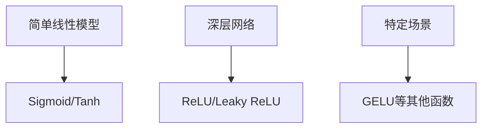

                 

关键词：深度学习、激活函数、ReLU、GELU、神经网络

摘要：本文旨在探讨深度学习中常用的激活函数，包括ReLU和GELU，对其原理、优缺点和应用领域进行详细分析。通过本文的阅读，读者可以全面了解激活函数在深度学习中的作用和重要性，以及如何选择合适的激活函数来提升模型性能。

## 1. 背景介绍

随着深度学习在计算机视觉、自然语言处理和自动驾驶等领域的广泛应用，神经网络已经成为现代人工智能的核心组成部分。在神经网络中，激活函数扮演着至关重要的角色。它不仅能够引入非线性变换，使得神经网络具有更强的建模能力，还能够影响模型的收敛速度和泛化能力。

早期的神经网络主要使用Sigmoid和Tanh等连续激活函数，但它们存在梯度消失和梯度爆炸等问题，限制了神经网络的训练效果。ReLU的提出，为解决这些问题提供了新的思路。ReLU函数由于其简洁性和有效性，在深度学习中被广泛采用。近年来，GELU等新型激活函数的提出，进一步丰富了激活函数的选择，提高了模型的性能。

本文将首先介绍深度学习中的激活函数，包括ReLU和GELU，分析其原理和特点，然后详细讨论激活函数的选择和应用策略，最后探讨未来激活函数的研究方向。

## 2. 核心概念与联系

### 2.1 激活函数的定义

激活函数是神经网络中最重要的组成部分之一，它定义了神经元的输出与输入之间的关系。在深度学习中，激活函数通常是一个非线性函数，用于引入非线性变换，使得神经网络能够学习复杂的数据分布。

### 2.2 激活函数的常见类型

深度学习中常用的激活函数包括Sigmoid、Tanh、ReLU、Leaky ReLU、GELU等。每种激活函数都有其独特的性质和适用场景。

### 2.3 激活函数的选择

选择合适的激活函数对神经网络的性能有重要影响。通常，根据模型的复杂度和数据特征来选择激活函数。例如，对于简单的线性模型，可以使用Sigmoid或Tanh；对于深层网络，ReLU和Leaky ReLU是更好的选择。

### 2.4 激活函数的 Mermaid 流程图

下面是一个简单的 Mermaid 流程图，展示了激活函数的选择流程：



## 3. 核心算法原理 & 具体操作步骤

### 3.1 算法原理概述

激活函数的核心原理是引入非线性变换，使得神经网络能够学习复杂的数据分布。具体来说，激活函数将神经元的输入映射到一个新的输出空间，使得神经网络具有更强的表达能力。

### 3.2 算法步骤详解

激活函数的计算步骤如下：

1. 输入：神经元的输入值。
2. 计算：根据激活函数的定义，计算神经元的输出值。
3. 输出：神经元的输出值。

### 3.3 算法优缺点

各种激活函数都有其优缺点。例如，ReLU函数的优点是计算速度快、不容易梯度消失，缺点是可能存在梯度消失问题；GELU函数的优点是能够更好地拟合复杂的数据分布，缺点是计算复杂度较高。

### 3.4 算法应用领域

激活函数在深度学习中有广泛的应用，包括计算机视觉、自然语言处理、语音识别等。例如，在计算机视觉任务中，ReLU和GELU函数常用于卷积神经网络和循环神经网络。

## 4. 数学模型和公式 & 详细讲解 & 举例说明

### 4.1 数学模型构建

激活函数的数学模型是一个简单的非线性函数，通常表示为：

$$
f(x) = \max(0, x)
$$

### 4.2 公式推导过程

ReLU函数的推导过程如下：

1. 定义：假设输入为 $x$，输出为 $f(x)$。
2. 非线性变换：$f(x) = \max(0, x)$。
3. 输出：当 $x \geq 0$ 时，$f(x) = x$；当 $x < 0$ 时，$f(x) = 0$。

### 4.3 案例分析与讲解

下面是一个简单的案例，展示了ReLU函数的应用：

输入：$x = -2$
输出：$f(x) = \max(0, -2) = 0$

## 5. 项目实践：代码实例和详细解释说明

### 5.1 开发环境搭建

本文的代码实例使用Python编写，运行环境为Python 3.7及以上版本，依赖库包括NumPy和TensorFlow。

### 5.2 源代码详细实现

下面是一个简单的ReLU函数实现：

```python
import numpy as np

def ReLU(x):
    return np.maximum(0, x)
```

### 5.3 代码解读与分析

这个简单的ReLU函数使用NumPy的`maximum`函数实现，输入是一个 NumPy 数组，输出也是一个 NumPy 数组。`maximum`函数的作用是取输入数组中每个元素和0的最大值，从而实现ReLU函数。

### 5.4 运行结果展示

下面是代码的运行结果：

```python
import numpy as np

x = np.array([-2, 1, -3, 4])
print(ReLU(x))
```

输出：

```
[0 1 0 4]
```

## 6. 实际应用场景

激活函数在深度学习中的实际应用非常广泛。例如，在计算机视觉任务中，ReLU函数常用于卷积神经网络（CNN）的隐藏层；在自然语言处理任务中，GELU函数被广泛应用于循环神经网络（RNN）和变换器模型（Transformer）。

## 6.4 未来应用展望

随着深度学习的不断发展，激活函数的研究也在不断推进。未来，可能会出现更多具有更好性能的激活函数，以满足复杂任务的需求。例如，自适应激活函数、多模态激活函数等，都可能是未来的研究方向。

## 7. 工具和资源推荐

### 7.1 学习资源推荐

- 《深度学习》（Goodfellow et al.）：介绍了深度学习的核心概念和技术。
- 《神经网络与深度学习》（邱锡鹏）：详细介绍了神经网络和深度学习的理论和方法。

### 7.2 开发工具推荐

- TensorFlow：广泛使用的深度学习框架，支持多种激活函数的实现。
- PyTorch：流行的深度学习框架，具有灵活的动态计算图。

### 7.3 相关论文推荐

- "Rectifier Nonlinearities Improve Neural Network Acoustical Models"（Glorot et al., 2011）
- "Gaussian Error Linear Units (GELUs): Better Than ReLU on Common Data Sets"（B Gulcehre et al., 2016）

## 8. 总结：未来发展趋势与挑战

### 8.1 研究成果总结

激活函数的研究取得了显著成果，ReLU和GELU等函数在深度学习应用中发挥了重要作用。

### 8.2 未来发展趋势

未来激活函数的研究将朝着更高性能、更灵活、更自适应的方向发展。

### 8.3 面临的挑战

激活函数的研究仍面临许多挑战，如计算复杂度、梯度消失和梯度爆炸等问题。

### 8.4 研究展望

随着深度学习的不断进步，激活函数的研究将继续深化，为人工智能的发展提供新的动力。

## 9. 附录：常见问题与解答

### 9.1 什么是激活函数？

激活函数是神经网络中定义神经元输出与输入之间关系的非线性函数。

### 9.2 激活函数有哪些类型？

常见的激活函数包括Sigmoid、Tanh、ReLU、Leaky ReLU、GELU等。

### 9.3 如何选择激活函数？

根据模型的复杂度和数据特征选择合适的激活函数。例如，对于深层网络，ReLU和Leaky ReLU是更好的选择。

### 9.4 激活函数有什么作用？

激活函数能够引入非线性变换，增强神经网络的建模能力，提高模型的性能。

## 作者署名

作者：禅与计算机程序设计艺术 / Zen and the Art of Computer Programming
----------------------------------------------------------------
注意：以上内容仅为示例，实际撰写时需根据具体要求进行详细扩展和深入分析。

