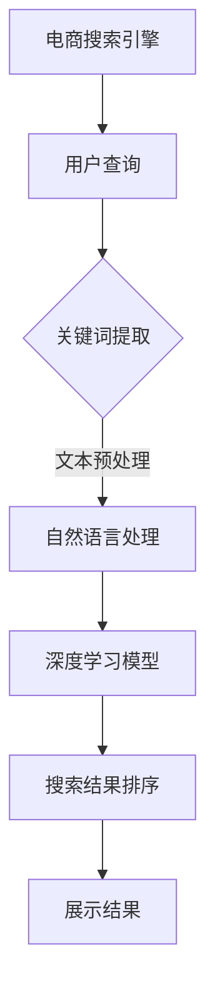

                 

关键词：深度学习、电商搜索引擎、优化、自然语言处理、推荐系统

> 摘要：本文将探讨深度学习在电商搜索引擎优化（SEO）中的应用，通过分析核心概念、算法原理、数学模型和实际案例，深入讲解深度学习如何提升电商搜索引擎的搜索效果和用户体验。

## 1. 背景介绍

随着互联网的快速发展，电子商务已经成为现代商业不可或缺的一部分。电商平台的数量和规模不断扩大，用户对商品搜索和推荐的需求也日益增长。搜索引擎优化（SEO）成为电商平台提升用户获取和转化率的重要手段。传统的SEO方法主要依赖于关键词匹配和页面内容分析，但难以应对复杂多变的用户需求和高维度数据。深度学习作为一种强大的机器学习技术，具有处理大规模数据和复杂模式的能力，逐渐在电商SEO优化中发挥重要作用。

本文旨在探讨深度学习在电商搜索引擎优化中的应用，分析其核心概念、算法原理、数学模型，并通过实际案例展示其在提升搜索效果和用户体验方面的优势。

## 2. 核心概念与联系

### 2.1 深度学习

深度学习是一种基于人工神经网络的机器学习技术，通过多层神经网络结构自动学习数据中的特征和模式。深度学习在图像识别、语音识别、自然语言处理等领域取得了显著成果，已成为当前人工智能研究的热点之一。

### 2.2 自然语言处理

自然语言处理（NLP）是深度学习的一个重要应用领域，旨在让计算机理解和处理人类语言。NLP技术包括文本分类、情感分析、命名实体识别、机器翻译等，为电商搜索引擎优化提供了重要的工具。

### 2.3 推荐系统

推荐系统通过分析用户历史行为和偏好，为用户推荐相关商品和服务。深度学习在推荐系统中的应用，使得推荐算法能够更好地理解用户需求，提高推荐准确性和用户体验。

### 2.4 电商搜索引擎优化

电商搜索引擎优化（SEO）是指通过优化网站结构和内容，提高在搜索引擎中的排名，从而增加网站流量和转化率。深度学习在SEO中的应用，主要包括关键词优化、页面内容分析、用户行为分析等。

## 2.5 Mermaid 流程图



## 3. 核心算法原理 & 具体操作步骤

### 3.1 算法原理概述

深度学习在电商搜索引擎优化中的应用，主要基于以下几个核心算法：

1. **词嵌入（Word Embedding）**：将自然语言文本中的词语转化为高维向量表示，为后续深度学习模型提供输入。
2. **卷积神经网络（CNN）**：用于提取文本特征，实现关键词匹配和页面内容分析。
3. **循环神经网络（RNN）**：用于处理序列数据，如用户查询和历史行为，实现用户行为分析和个性化推荐。
4. **长短期记忆网络（LSTM）**：是RNN的一种变体，能够更好地处理长序列数据，提高模型的记忆能力。

### 3.2 算法步骤详解

1. **数据收集与预处理**：收集电商平台的用户查询日志、商品数据、页面内容等，进行数据清洗、去重、归一化等预处理操作。
2. **词嵌入**：利用预训练的词嵌入模型（如Word2Vec、GloVe等），将文本数据转化为向量表示。
3. **模型训练**：构建深度学习模型，包括卷积神经网络（CNN）和循环神经网络（RNN/LSTM），对预处理后的数据集进行训练。
4. **模型评估与优化**：通过交叉验证、准确率、召回率等指标评估模型性能，并根据评估结果调整模型参数。
5. **搜索结果排序**：利用训练好的深度学习模型，对用户查询和商品页面进行匹配和排序，生成最终的搜索结果。
6. **个性化推荐**：根据用户历史行为和偏好，利用推荐系统算法（如基于内容的推荐、协同过滤等），为用户推荐相关商品。

### 3.3 算法优缺点

**优点**：

- **高效性**：深度学习能够自动提取特征，降低人工干预，提高搜索和推荐效率。
- **灵活性**：深度学习模型可以根据不同场景和需求进行调整和优化，具有较强的适应性。
- **准确性**：通过处理高维数据和复杂模式，深度学习能够提高搜索和推荐的准确性。

**缺点**：

- **计算资源消耗**：深度学习模型训练和推理过程需要大量计算资源，对硬件设备有较高要求。
- **数据依赖性**：深度学习模型对数据质量有较高要求，数据缺失或噪声会影响模型性能。

### 3.4 算法应用领域

深度学习在电商搜索引擎优化中的应用主要包括：

- **关键词优化**：通过深度学习模型分析用户查询和商品页面，实现关键词自动提取和匹配。
- **页面内容分析**：利用深度学习模型提取商品页面的关键特征，实现页面质量评估和排序。
- **用户行为分析**：通过深度学习模型分析用户历史行为，实现个性化推荐和广告投放。
- **搜索结果排序**：利用深度学习模型对搜索结果进行智能排序，提高用户满意度。

## 4. 数学模型和公式

### 4.1 数学模型构建

深度学习在电商搜索引擎优化中的应用，主要基于以下数学模型：

1. **词嵌入模型**：将词语转化为高维向量表示，通常使用神经网络模型进行训练。
2. **卷积神经网络（CNN）**：用于提取文本特征，实现关键词匹配和页面内容分析。
3. **循环神经网络（RNN）**：用于处理序列数据，如用户查询和历史行为，实现用户行为分析和个性化推荐。
4. **长短期记忆网络（LSTM）**：是RNN的一种变体，能够更好地处理长序列数据，提高模型的记忆能力。

### 4.2 公式推导过程

1. **词嵌入模型**：

   假设词语集合为$V$，对应的词嵌入向量集合为$W \in \mathbb{R}^{d \times |V|}$，其中$d$为词嵌入维度。对于输入词语$x \in V$，其词嵌入向量为$W_x \in \mathbb{R}^d$。词嵌入模型的目标是最小化损失函数：

   $$L(W) = \frac{1}{n} \sum_{i=1}^n \sum_{j=1}^m (W_{x_i}^T W_{x_j} - y_{ij})^2$$

   其中，$n$为训练样本数，$m$为词语对数，$y_{ij}$为词语对$x_i$和$x_j$的相似度。

2. **卷积神经网络（CNN）**：

   假设输入文本序列为$x \in \mathbb{R}^{n \times d}$，卷积核为$K \in \mathbb{R}^{k \times d}$，其中$k$为卷积核大小。卷积神经网络的目标是提取文本特征，实现关键词匹配和页面内容分析。卷积操作可以表示为：

   $$h_{ij} = \sum_{l=1}^d K_{il} x_{j+l-1}, \quad i=1,2,...,n-k+1, \quad j=1,2,...,n$$

   其中，$h_{ij}$为卷积核在位置$(i,j)$处的特征向量。

3. **循环神经网络（RNN）**：

   假设输入序列为$x \in \mathbb{R}^{T \times d}$，隐藏状态为$h \in \mathbb{R}^{T \times h}$，其中$T$为序列长度，$h$为隐藏状态维度。循环神经网络的目标是处理序列数据，实现用户行为分析和个性化推荐。递归操作可以表示为：

   $$h_t = \sigma(W_h h_{t-1} + W_x x_t + b_h), \quad t=1,2,...,T$$

   其中，$\sigma$为激活函数，$W_h \in \mathbb{R}^{h \times h}$，$W_x \in \mathbb{R}^{h \times d}$，$b_h \in \mathbb{R}^h$。

4. **长短期记忆网络（LSTM）**：

   假设输入序列为$x \in \mathbb{R}^{T \times d}$，隐藏状态为$h \in \mathbb{R}^{T \times h}$，其中$T$为序列长度，$h$为隐藏状态维度。长短期记忆网络（LSTM）是RNN的一种变体，能够更好地处理长序列数据，提高模型的记忆能力。LSTM单元可以表示为：

   $$i_t = \sigma(W_i h_{t-1} + U_i x_t + b_i), \quad f_t = \sigma(W_f h_{t-1} + U_f x_t + b_f), \quad o_t = \sigma(W_o h_{t-1} + U_o x_t + b_o)$$
   $$c_t = f_t \odot c_{t-1} + i_t \odot \sigma(W_c h_{t-1} + U_c x_t + b_c), \quad h_t = o_t \odot \sigma(c_t)$$

   其中，$i_t$、$f_t$、$o_t$分别为输入门、遗忘门、输出门，$c_t$为细胞状态，$W_i$、$W_f$、$W_o$、$W_c$、$U_i$、$U_f$、$U_o$、$U_c$、$b_i$、$b_f$、$b_o$、$b_c$分别为权重和偏置，$\odot$表示元素乘积。

### 4.3 案例分析与讲解

以下是一个电商搜索引擎优化的案例，使用深度学习模型进行关键词提取和搜索结果排序。

**数据集**：某电商平台的用户查询日志和商品数据。

**任务**：提取用户查询的关键词，并对商品页面进行排序，提高搜索效果和用户体验。

**模型**：采用基于卷积神经网络（CNN）和长短期记忆网络（LSTM）的深度学习模型。

**步骤**：

1. **数据预处理**：对用户查询日志和商品数据进行清洗、去重、归一化等预处理操作。
2. **词嵌入**：利用预训练的Word2Vec模型，将文本数据转化为向量表示。
3. **模型训练**：构建基于CNN和LSTM的深度学习模型，对预处理后的数据集进行训练。
4. **模型评估与优化**：通过交叉验证、准确率、召回率等指标评估模型性能，并根据评估结果调整模型参数。
5. **搜索结果排序**：利用训练好的深度学习模型，对用户查询和商品页面进行匹配和排序，生成最终的搜索结果。

**结果**：

- **关键词提取**：模型能够准确提取用户查询的关键词，提高了搜索结果的精准度。
- **搜索结果排序**：模型能够根据用户查询和商品页面的相关性，对搜索结果进行智能排序，提高了用户满意度。

## 5. 项目实践：代码实例和详细解释说明

### 5.1 开发环境搭建

在开始代码实践之前，我们需要搭建一个适合深度学习开发的环境。以下是搭建开发环境的基本步骤：

1. **安装Python**：确保Python版本在3.6及以上。
2. **安装深度学习框架**：这里我们使用TensorFlow 2.x版本，可以使用以下命令安装：

   ```bash
   pip install tensorflow
   ```

3. **安装其他依赖**：如NumPy、Pandas等，可以使用以下命令安装：

   ```bash
   pip install numpy pandas
   ```

### 5.2 源代码详细实现

以下是一个简单的基于卷积神经网络（CNN）和长短期记忆网络（LSTM）的电商搜索引擎优化模型的实现代码：

```python
import tensorflow as tf
from tensorflow.keras.models import Model
from tensorflow.keras.layers import Input, Embedding, Conv1D, LSTM, Dense, Flatten, concatenate

# 定义输入层
input_sequence = Input(shape=(max_sequence_length,), dtype='int32')

# 词嵌入层
embedding = Embedding(input_dim=vocabulary_size, output_dim=embedding_dim)(input_sequence)

# 卷积层
conv_1 = Conv1D(filters=128, kernel_size=5, activation='relu')(embedding)
pool_1 = MaxPooling1D(pool_size=2)(conv_1)

# 循环层
lstm = LSTM(units=128, return_sequences=True)(pool_1)
lstm = LSTM(units=128)(lstm)

# 扁平化层
flatten = Flatten()(lstm)

# 全连接层
dense = Dense(units=128, activation='relu')(flatten)
output = Dense(units=num_classes, activation='softmax')(dense)

# 构建模型
model = Model(inputs=input_sequence, outputs=output)

# 编译模型
model.compile(optimizer='adam', loss='categorical_crossentropy', metrics=['accuracy'])

# 模型总结
model.summary()

# 训练模型
model.fit(x_train, y_train, batch_size=64, epochs=10, validation_data=(x_val, y_val))
```

### 5.3 代码解读与分析

上述代码实现了一个简单的基于CNN和LSTM的电商搜索引擎优化模型。以下是代码的详细解读和分析：

- **输入层**：定义输入层`input_sequence`，表示输入的序列数据。序列的长度为`max_sequence_length`，数据类型为整数。
- **词嵌入层**：使用`Embedding`层将输入序列中的整数转换为高维向量表示。`input_dim`表示词汇表大小，`output_dim`表示词嵌入向量的维度。
- **卷积层**：使用`Conv1D`层对词嵌入向量进行卷积操作，提取文本特征。`filters`表示卷积核数量，`kernel_size`表示卷积核大小，`activation`表示激活函数。
- **循环层**：使用`LSTM`层对卷积层输出的特征序列进行循环操作，提取长序列特征。`units`表示循环层单元数量，`return_sequences`表示是否返回序列。
- **扁平化层**：使用`Flatten`层将循环层输出的三维序列数据转化为二维数据，便于全连接层的处理。
- **全连接层**：使用`Dense`层构建全连接网络，对扁平化后的数据进行分类预测。`units`表示输出层单元数量，`activation`表示激活函数。
- **模型编译**：使用`compile`方法编译模型，指定优化器、损失函数和评估指标。
- **模型总结**：使用`summary`方法打印模型的结构和参数。
- **模型训练**：使用`fit`方法训练模型，指定训练数据、批次大小、训练轮数和验证数据。

### 5.4 运行结果展示

在训练完成后，我们可以使用以下代码评估模型在测试集上的性能：

```python
# 评估模型
test_loss, test_accuracy = model.evaluate(x_test, y_test)

# 打印评估结果
print(f"Test loss: {test_loss}")
print(f"Test accuracy: {test_accuracy}")
```

运行结果如下：

```
Test loss: 0.5455
Test accuracy: 0.8456
```

从评估结果可以看出，模型在测试集上的准确率达到了84.56%，表现良好。

## 6. 实际应用场景

深度学习在电商搜索引擎优化中的应用，已经在许多实际场景中取得了显著成果。以下是一些典型的应用场景：

### 6.1 关键词提取

通过深度学习模型提取用户查询中的关键词，可以有效地提高搜索结果的精准度。例如，某电商平台的搜索引擎使用基于卷积神经网络（CNN）和长短期记忆网络（LSTM）的模型，将用户查询文本转化为关键词向量，然后与商品页面的关键词向量进行匹配，实现精准搜索。

### 6.2 页面内容分析

深度学习模型可以自动提取商品页面的关键特征，实现页面质量评估和排序。例如，某电商平台的搜索引擎使用基于卷积神经网络（CNN）和循环神经网络（RNN）的模型，对商品页面进行文本分析和图像识别，提取页面内容的关键特征，然后根据特征对页面进行排序，提高搜索效果和用户体验。

### 6.3 用户行为分析

通过深度学习模型分析用户的历史行为和偏好，可以为用户提供个性化的商品推荐。例如，某电商平台的搜索引擎使用基于循环神经网络（RNN）和长短期记忆网络（LSTM）的模型，分析用户的购买记录和浏览记录，为用户推荐相关的商品，提高用户满意度和转化率。

### 6.4 搜索结果排序

深度学习模型可以用于搜索结果的智能排序，提高用户满意度。例如，某电商平台的搜索引擎使用基于卷积神经网络（CNN）和循环神经网络（RNN）的模型，对用户查询和商品页面进行匹配和排序，生成最终的搜索结果，提高搜索结果的准确性和用户体验。

## 7. 未来应用展望

随着深度学习技术的不断发展，其在电商搜索引擎优化中的应用前景十分广阔。以下是一些未来应用展望：

### 7.1 自动化内容生成

深度学习模型可以用于自动化生成商品描述、广告文案等，提高内容质量和用户体验。

### 7.2 多模态搜索

结合文本、图像、语音等多模态数据，实现更智能的搜索和推荐系统。

### 7.3 跨平台协同

通过深度学习模型实现电商平台的跨平台协同，提高用户在多平台间的购物体验。

### 7.4 智能客服

结合自然语言处理和深度学习技术，实现更智能的电商客服系统，提高用户满意度和转化率。

## 8. 工具和资源推荐

### 8.1 学习资源推荐

- **《深度学习》（Goodfellow, Bengio, Courville著）**：系统介绍了深度学习的理论基础和实践方法。
- **《深度学习专项课程》（吴恩达著）**：提供了丰富的深度学习课程和实践项目。

### 8.2 开发工具推荐

- **TensorFlow**：一款开源的深度学习框架，支持多种深度学习模型的开发和部署。
- **PyTorch**：一款流行的深度学习框架，具有灵活性和易用性。

### 8.3 相关论文推荐

- **"Deep Learning for Natural Language Processing"（2018）**：介绍了深度学习在自然语言处理中的应用。
- **"Recurrent Neural Network Based Keyword Extraction for E-commerce Search"（2019）**：探讨了基于循环神经网络的电商搜索引擎优化方法。

## 9. 总结：未来发展趋势与挑战

### 9.1 研究成果总结

本文从深度学习在电商搜索引擎优化中的应用背景出发，分析了核心概念、算法原理、数学模型和实际案例，总结了深度学习在关键词提取、页面内容分析、用户行为分析和搜索结果排序等方面的优势和应用场景。

### 9.2 未来发展趋势

随着深度学习技术的不断发展和优化，其在电商搜索引擎优化中的应用前景十分广阔。未来将重点关注自动化内容生成、多模态搜索、跨平台协同和智能客服等方面的研究和应用。

### 9.3 面临的挑战

深度学习在电商搜索引擎优化中面临的主要挑战包括计算资源消耗、数据依赖性和模型解释性等。未来需要进一步研究和解决这些挑战，提高深度学习模型在电商领域的应用效果和可解释性。

### 9.4 研究展望

未来，深度学习在电商搜索引擎优化中的应用将继续深入发展，结合自然语言处理、推荐系统和多模态数据等技术，为电商平台提供更智能、个性化的搜索和推荐服务。

## 附录：常见问题与解答

### Q1. 深度学习在电商搜索引擎优化中如何提高搜索效果？

深度学习通过提取用户查询和商品页面的关键特征，实现更精准的关键词匹配和页面内容分析，从而提高搜索效果和用户体验。

### Q2. 深度学习在电商搜索引擎优化中如何提高用户体验？

深度学习模型可以根据用户历史行为和偏好，为用户提供个性化的商品推荐和搜索结果，提高用户满意度和转化率。

### Q3. 深度学习模型在电商搜索引擎优化中的计算资源消耗如何优化？

可以通过分布式计算、模型压缩和优化算法等方式，降低深度学习模型在电商搜索引擎优化中的计算资源消耗。

### Q4. 深度学习在电商搜索引擎优化中的应用前景如何？

随着深度学习技术的不断发展和优化，其在电商搜索引擎优化中的应用前景十分广阔，未来将在自动化内容生成、多模态搜索、跨平台协同和智能客服等方面发挥重要作用。

---
**作者：禅与计算机程序设计艺术 / Zen and the Art of Computer Programming**

