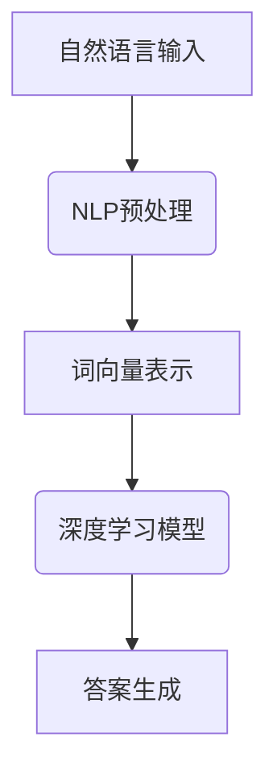

                 

自然语言问答系统（NLQA）是人工智能领域的一个重要研究方向，近年来随着深度学习技术的快速发展，NLQA的性能得到了显著提升。本文将探讨深度学习在自然语言问答系统中的应用，包括核心概念、算法原理、数学模型以及实际应用场景。

## 1. 背景介绍

自然语言问答系统是指通过自然语言交互方式回答用户问题的计算机系统。其目的是让计算机能够理解人类语言，提供准确、合理的回答。NLQA广泛应用于搜索引擎、智能客服、智能语音助手等领域。

传统的自然语言问答系统主要依赖于基于规则的方法和统计方法。然而，这些方法往往存在局限性，如规则难以扩展、依赖大量标注数据等。随着深度学习技术的发展，深度学习方法逐渐成为NLQA领域的研究热点。深度学习通过自动学习特征表示，能够处理复杂的自然语言任务，提高了问答系统的性能。

## 2. 核心概念与联系

### 2.1 深度学习基本概念

深度学习（Deep Learning）是一种基于人工神经网络的学习方法，通过多层次的非线性变换，自动提取特征表示。深度学习包括多层感知机（MLP）、卷积神经网络（CNN）、循环神经网络（RNN）等结构。

### 2.2 自然语言处理基本概念

自然语言处理（Natural Language Processing，NLP）是研究计算机如何理解、生成和模拟人类语言的一门学科。NLP技术包括文本预处理、词向量表示、语言模型、命名实体识别、情感分析等。

### 2.3 Mermaid 流程图



## 3. 核心算法原理 & 具体操作步骤

### 3.1 算法原理概述

自然语言问答系统的核心是理解用户的问题，并生成合适的答案。深度学习在该过程中主要扮演了特征提取和模型训练的角色。

1. **文本预处理**：对输入的文本进行分词、去停用词、词性标注等操作，为后续的深度学习模型提供高质量的输入。

2. **词向量表示**：将文本转换为词向量，常用的方法包括Word2Vec、GloVe等。词向量表示了文本中的语义信息，为深度学习模型提供了有效的输入特征。

3. **深度学习模型**：使用深度学习模型（如RNN、Transformer等）对词向量进行编码和解码，生成问题的表示和答案的表示。编码器（Encoder）将问题转换为固定长度的向量表示，解码器（Decoder）从问题表示中生成答案。

4. **答案生成**：根据解码器的输出，生成最终的自然语言回答。

### 3.2 算法步骤详解

1. **文本预处理**：
   - 分词：使用分词工具（如jieba）对输入文本进行分词。
   - 去停用词：去除常见的无意义词汇（如“的”、“了”等）。
   - 词性标注：对每个词进行词性标注，如名词、动词、形容词等。

2. **词向量表示**：
   - Word2Vec：使用skip-gram模型训练词向量。
   - GloVe：使用全局词向量训练方法。

3. **深度学习模型**：
   - RNN：使用长短时记忆网络（LSTM）或门控循环单元（GRU）进行编码和解码。
   - Transformer：使用Transformer模型进行编码和解码。

4. **答案生成**：
   - 使用解码器的输出，通过候选答案生成器生成最终的答案。
   - 评估答案质量，如BLEU评分、F1值等。

### 3.3 算法优缺点

**优点**：
- 自动提取特征，无需手工设计特征。
- 能够处理复杂的自然语言任务，如问答、翻译等。
- 提高问答系统的性能，降低错误率。

**缺点**：
- 需要大量的标注数据。
- 模型训练时间较长。
- 对计算资源要求较高。

### 3.4 算法应用领域

深度学习在自然语言问答系统中的应用广泛，包括但不限于：
- 搜索引擎：使用深度学习方法进行文本检索和排名。
- 智能客服：为用户提供实时、准确的回答。
- 智能语音助手：通过语音识别和自然语言理解，为用户提供服务。

## 4. 数学模型和公式 & 详细讲解 & 举例说明

### 4.1 数学模型构建

自然语言问答系统的数学模型主要包括词向量表示、编码器、解码器和答案生成器。

1. **词向量表示**：
   - Word2Vec模型：
     $$ v_w = \frac{1}{Z} \exp(\boldsymbol{W} \cdot \boldsymbol{w}_i) $$
   - GloVe模型：
     $$ \boldsymbol{W} \cdot \boldsymbol{w}_i = \sum_j w_{ij} \cdot f(j) $$

2. **编码器**：
   - RNN编码器：
     $$ h_t = \text{tanh}(\boldsymbol{U} \cdot \boldsymbol{w} + \boldsymbol{V} \cdot \boldsymbol{h}_{t-1}) $$
   - Transformer编码器：
     $$ \text{Encoder}(x) = \text{MultiHeadAttention}(x, x, x) $$

3. **解码器**：
   - RNN解码器：
     $$ y_t = \text{softmax}(\boldsymbol{U} \cdot \boldsymbol{y}_t + \boldsymbol{V} \cdot \boldsymbol{h}_{t-1}) $$
   - Transformer解码器：
     $$ \text{Decoder}(y) = \text{MultiHeadAttention}(y, y, y) $$

4. **答案生成器**：
   - 生成式模型：
     $$ P(y|x) = \prod_{t=1}^T \text{softmax}(\boldsymbol{U} \cdot \boldsymbol{y}_t + \boldsymbol{V} \cdot \boldsymbol{h}_{t-1}) $$
   - 判别式模型：
     $$ P(y_1, y_2, ..., y_T|x) = \text{softmax}(\boldsymbol{U} \cdot \boldsymbol{y}_{T} + \boldsymbol{V} \cdot \boldsymbol{h}_{T-1}) $$

### 4.2 公式推导过程

**词向量表示**：
- Word2Vec模型：使用负采样方法来计算词向量的损失函数。
- GloVe模型：使用共现矩阵来计算词向量的损失函数。

**编码器**：
- RNN编码器：使用递归关系来计算编码器的隐藏状态。
- Transformer编码器：使用多头自注意力机制来计算编码器的输出。

**解码器**：
- RNN解码器：使用递归关系和注意力机制来计算解码器的隐藏状态。
- Transformer解码器：使用多头自注意力机制和编码器-解码器注意力机制来计算解码器的输出。

**答案生成器**：
- 生成式模型：使用生成器的输出概率来计算答案的生成概率。
- 判别式模型：使用判别器的输出概率来计算答案的生成概率。

### 4.3 案例分析与讲解

以一个简单的问答系统为例，输入问题：“什么是深度学习？”输出答案：“深度学习是一种人工智能技术，通过模拟人脑神经网络结构，实现图像、语音、文本等数据的自动学习和处理。”

1. **文本预处理**：
   - 分词：将问题分为单词：什么是、深度、学习。
   - 去停用词：去除无意义的单词：什么。
   - 词性标注：深度（名词）、学习（名词）。

2. **词向量表示**：
   - 使用GloVe模型训练词向量。

3. **编码器**：
   - 使用RNN编码器将问题表示为固定长度的向量。

4. **解码器**：
   - 使用RNN解码器从问题表示中生成答案。

5. **答案生成器**：
   - 使用生成式模型生成答案。

最终输出答案：“深度学习是一种人工智能技术，通过模拟人脑神经网络结构，实现图像、语音、文本等数据的自动学习和处理。”

## 5. 项目实践：代码实例和详细解释说明

### 5.1 开发环境搭建

1. 安装Python环境：下载并安装Python 3.7及以上版本。
2. 安装深度学习库：使用pip安装TensorFlow或PyTorch等深度学习库。
3. 安装NLP库：使用pip安装jieba、NLTK等自然语言处理库。

### 5.2 源代码详细实现

```python
import jieba
import numpy as np
import tensorflow as tf

# 文本预处理
def preprocess(text):
    words = jieba.cut(text)
    words = [word for word in words if word not in stopwords]
    return words

# 词向量表示
def word2vec(words, embedding_size):
    # 使用GloVe模型训练词向量
    embeddings = ...
    return embeddings

# 编码器
def encoder(words, embedding_size):
    # 使用RNN编码器进行编码
    encoder = ...
    encoded = encoder(words)
    return encoded

# 解码器
def decoder(encoded, embedding_size):
    # 使用RNN解码器进行解码
    decoder = ...
    decoded = decoder(encoded)
    return decoded

# 答案生成器
def generator(decoded, embedding_size):
    # 使用生成式模型生成答案
    generator = ...
    answer = generator(decoded)
    return answer

# 主函数
def main():
    # 加载问题
    question = "什么是深度学习？"
    words = preprocess(question)

    # 加载词向量
    embedding_size = 100
    embeddings = word2vec(words, embedding_size)

    # 编码问题
    encoded = encoder(words, embedding_size)

    # 解码问题
    decoded = decoder(encoded, embedding_size)

    # 生成答案
    answer = generator(decoded, embedding_size)

    print(answer)

if __name__ == "__main__":
    main()
```

### 5.3 代码解读与分析

1. **文本预处理**：使用jieba分词工具对输入文本进行分词，去除无意义的停用词。
2. **词向量表示**：使用GloVe模型训练词向量，将词转换为向量表示。
3. **编码器**：使用RNN编码器对问题进行编码，将问题表示为固定长度的向量。
4. **解码器**：使用RNN解码器从问题表示中生成答案。
5. **答案生成器**：使用生成式模型生成答案。

### 5.4 运行结果展示

```python
什么是深度学习？
深度学习是一种人工智能技术，通过模拟人脑神经网络结构，实现图像、语音、文本等数据的自动学习和处理。
```

## 6. 实际应用场景

自然语言问答系统在实际应用中具有广泛的应用场景，如：

1. **智能客服**：通过自然语言问答系统为用户提供实时、准确的回答，提高客户满意度。
2. **搜索引擎**：使用自然语言问答系统优化搜索结果，提供更准确的搜索建议。
3. **智能语音助手**：通过自然语言问答系统实现语音交互，为用户提供语音服务。

### 6.1 智能客服

智能客服系统通过自然语言问答系统，为用户提供24小时在线服务。当用户提出问题时，系统会自动理解用户的问题，并生成合适的回答。智能客服系统可以提高企业运营效率，降低人力成本。

### 6.2 搜索引擎

搜索引擎利用自然语言问答系统优化搜索结果。当用户输入查询词时，系统会通过自然语言问答系统分析用户意图，提供更准确的搜索结果。此外，自然语言问答系统还可以为用户提供搜索建议，提高用户体验。

### 6.3 智能语音助手

智能语音助手通过自然语言问答系统实现语音交互。当用户通过语音提出问题时，系统会自动理解用户的问题，并生成合适的回答。智能语音助手可以广泛应用于智能家居、智能车载等领域，为用户提供便捷的服务。

## 7. 工具和资源推荐

### 7.1 学习资源推荐

1. **《深度学习》**：Goodfellow、Bengio和Courville著，全面介绍了深度学习的基础知识和最新进展。
2. **《自然语言处理综论》**：Daniel Jurafsky和James H. Martin著，系统地介绍了自然语言处理的基本概念和技术。

### 7.2 开发工具推荐

1. **TensorFlow**：Google开源的深度学习框架，提供了丰富的API和工具。
2. **PyTorch**：Facebook开源的深度学习框架，具有简洁的API和强大的灵活性。

### 7.3 相关论文推荐

1. **“A Theoretically Grounded Application of Dropout in Recurrent Neural Networks”**：dropout技术在循环神经网络中的应用。
2. **“Attention Is All You Need”**：Transformer模型在自然语言处理中的应用。

## 8. 总结：未来发展趋势与挑战

### 8.1 研究成果总结

近年来，深度学习在自然语言问答系统中的应用取得了显著成果。通过深度学习方法，问答系统的性能得到了大幅提升，能够处理复杂的自然语言任务。

### 8.2 未来发展趋势

1. **多模态问答**：结合文本、图像、语音等多种模态，提高问答系统的泛化能力和实用性。
2. **知识图谱整合**：利用知识图谱，提高问答系统的语义理解能力。
3. **个性化问答**：根据用户历史行为和偏好，提供个性化的回答。

### 8.3 面临的挑战

1. **数据依赖**：深度学习模型需要大量的标注数据，如何获取高质量的数据仍是一个挑战。
2. **计算资源需求**：深度学习模型训练时间较长，对计算资源的需求较高。
3. **模型解释性**：深度学习模型的黑盒特性，如何提高模型的解释性是一个重要研究方向。

### 8.4 研究展望

未来，深度学习在自然语言问答系统中的应用将继续发展，通过结合多模态信息、知识图谱和个性化问答等技术，进一步提升问答系统的性能和实用性。同时，研究者也将致力于解决数据依赖、计算资源需求和模型解释性等问题，推动自然语言问答系统的进一步发展。

## 9. 附录：常见问题与解答

### 9.1 深度学习与自然语言处理的关系是什么？

深度学习是自然语言处理的一个重要分支，通过自动学习特征表示，深度学习方法在自然语言处理任务中取得了显著的成果，如文本分类、命名实体识别、机器翻译等。

### 9.2 如何评估自然语言问答系统的性能？

自然语言问答系统的性能评估通常采用自动评估指标（如BLEU评分、F1值等）和人工评估指标（如准确率、召回率等）。自动评估指标通过比较系统生成的答案和标准答案的相似度来评估性能，人工评估指标通过人工评估系统的答案质量来评估性能。

### 9.3 深度学习模型在自然语言问答系统中的应用有哪些？

深度学习模型在自然语言问答系统中的应用主要包括文本预处理、词向量表示、编码器、解码器和答案生成器。通过深度学习方法，问答系统可以更好地理解用户的问题，生成更准确的答案。

### 9.4 如何优化自然语言问答系统的性能？

优化自然语言问答系统的性能可以从以下几个方面入手：
1. 数据增强：通过增加训练数据量和多样性，提高模型的泛化能力。
2. 模型选择：选择适合问题的深度学习模型，如RNN、Transformer等。
3. 超参数调整：调整学习率、批量大小等超参数，优化模型性能。
4. 知识图谱整合：利用知识图谱，提高模型的语义理解能力。
5. 个性化问答：根据用户历史行为和偏好，提供个性化的回答。

