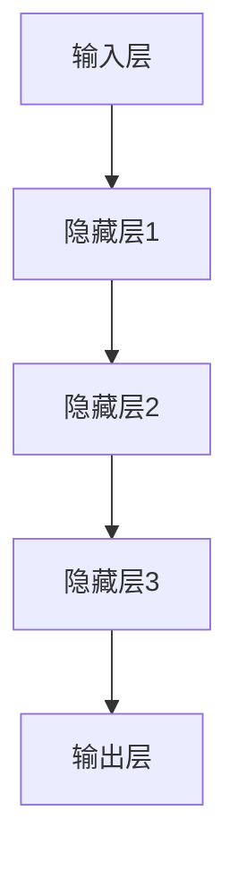

                 

在当今的数据科学和人工智能领域，深度学习无疑占据了核心地位。从最初的感知器到现在的深度神经网络，深度学习已经走过了一条漫长而辉煌的发展之路。本文将深入探讨深度学习的基础知识，从感知器的简单结构到深层网络的复杂架构，帮助读者构建起完整的深度学习知识体系。

> **关键词**：深度学习、感知器、神经网络、反向传播、多层网络

> **摘要**：本文将首先介绍深度学习的背景和基本概念，然后详细解释感知器的工作原理和多层神经网络的结构，接着讨论深度学习的主要算法，包括反向传播算法。最后，我们将探讨深度学习的数学基础，并通过实际案例和代码示例来展示其应用。

## 1. 背景介绍

### 深度学习的起源

深度学习的发展可以追溯到20世纪40年代。当时，科学家们首次提出了神经网络的构想，试图模拟人脑的信息处理过程。然而，由于计算能力的限制和算法的局限性，深度学习在早期并未得到广泛的应用。直到21世纪初，随着计算技术的进步和大数据的兴起，深度学习才逐渐崭露头角。

### 深度学习的重要性

深度学习在图像识别、语音识别、自然语言处理等众多领域取得了显著的成果，成为推动人工智能发展的关键力量。例如，深度学习技术使得自动驾驶汽车成为可能，极大地提升了图像识别系统的准确率，并且为自然语言处理提供了强大的工具。

### 本文目标

本文的目标是提供一个全面而深入的深度学习基础教程，帮助读者理解深度学习的核心概念和关键技术。无论是初学者还是有一定基础的读者，都将在这篇文章中找到有价值的内容。

## 2. 核心概念与联系

### 感知器

感知器是深度学习的基础单元，可以被视为是最简单的神经网络。它通过计算输入数据与权重的乘积，然后通过一个非线性函数（如阶跃函数）来输出结果。感知器的主要作用是二分类，即判断输入数据是否属于某个类别。

### 多层神经网络

多层神经网络是深度学习的基础结构。与单层感知器不同，多层神经网络通过堆叠多个隐藏层，可以学习更复杂的特征和模式。每一层的输出作为下一层的输入，这种前向传播的过程使得深层网络能够学习到更加抽象和高级的特征。

### Mermaid 流程图



在这个流程图中，A表示输入层，B、C、D表示隐藏层，E表示输出层。数据从输入层传递到隐藏层，再从隐藏层传递到输出层，这个过程称为前向传播。

## 3. 核心算法原理 & 具体操作步骤

### 3.1 算法原理概述

深度学习的主要算法包括感知器学习规则、反向传播算法等。其中，反向传播算法是深度学习的核心技术，它通过梯度下降法来优化网络权重，使得网络能够更好地拟合训练数据。

### 3.2 算法步骤详解

1. **初始化权重**：随机初始化网络的权重和偏置。
2. **前向传播**：输入数据通过网络的每一层，计算每一层的输出。
3. **计算损失**：通过网络输出的预测值与实际值的差异来计算损失。
4. **反向传播**：从输出层开始，反向计算每一层的梯度。
5. **权重更新**：根据梯度下降法更新网络的权重。

### 3.3 算法优缺点

**优点**：反向传播算法能够高效地优化网络权重，使得深度学习模型能够学习到复杂的特征和模式。

**缺点**：反向传播算法对初始参数敏感，容易陷入局部最小值。此外，随着网络层数的增加，梯度消失和梯度爆炸的问题也会加剧。

### 3.4 算法应用领域

反向传播算法广泛应用于图像识别、语音识别、自然语言处理等领域。通过反向传播算法，深度学习模型能够不断优化自身，提高分类和预测的准确率。

## 4. 数学模型和公式 & 详细讲解 & 举例说明

### 4.1 数学模型构建

深度学习的数学模型主要基于神经元之间的连接和加权求和。每个神经元都会接收来自其他神经元的输入，然后通过一个非线性激活函数来输出结果。

### 4.2 公式推导过程

假设一个简单的多层神经网络，包括输入层、隐藏层和输出层。输入层有 $n$ 个神经元，隐藏层有 $m$ 个神经元，输出层有 $k$ 个神经元。

- 输入层到隐藏层的激活函数为：$$ z^{(2)}_j = \sum_{i=1}^{n} w^{(2)}_{ij} x_i + b^{(2)}_j $$
- 隐藏层到输出层的激活函数为：$$ a^{(3)}_k = \sigma(z^{(3)}_k) = \frac{1}{1 + e^{-z^{(3)}_k}} $$

其中，$w^{(2)}_{ij}$ 表示输入层到隐藏层的权重，$b^{(2)}_j$ 和 $b^{(3)}_k$ 分别表示隐藏层和输出层的偏置。$\sigma$ 表示非线性激活函数，通常采用Sigmoid函数。

### 4.3 案例分析与讲解

假设我们有一个二分类问题，输入层有2个神经元，隐藏层有3个神经元，输出层有1个神经元。我们使用Sigmoid函数作为激活函数。

- 输入层到隐藏层的权重矩阵为：$$ W^{(2)} = \begin{pmatrix} 0.2 & 0.3 \\ 0.4 & 0.5 \\ 0.6 & 0.7 \end{pmatrix} $$
- 隐藏层到输出层的权重矩阵为：$$ W^{(3)} = \begin{pmatrix} 0.1 & 0.2 \end{pmatrix} $$

给定一个输入向量 $x = [1, 0]$，我们首先计算隐藏层的输出：

$$ z^{(2)}_1 = 0.2 \times 1 + 0.3 \times 0 = 0.2 $$
$$ z^{(2)}_2 = 0.4 \times 1 + 0.5 \times 0 = 0.4 $$
$$ z^{(2)}_3 = 0.6 \times 1 + 0.7 \times 0 = 0.6 $$

$$ a^{(2)}_1 = \sigma(z^{(2)}_1) = 0.528 $$
$$ a^{(2)}_2 = \sigma(z^{(2)}_2) = 0.713 $$

$$ z^{(3)} = 0.1 \times 0.528 + 0.2 \times 0.713 = 0.128 $$

$$ a^{(3)} = \sigma(z^{(3)}) = 0.538 $$

最终输出的概率为0.538，即输入向量 $x$ 属于第一个类别的概率为53.8%。

## 5. 项目实践：代码实例和详细解释说明

### 5.1 开发环境搭建

为了实践深度学习，我们需要搭建一个开发环境。以下是Python中常用的深度学习框架——TensorFlow的安装步骤：

1. 安装Anaconda，用于环境管理和包管理。
2. 创建一个新的环境，并安装TensorFlow。

```bash
conda create -n deep_learning python=3.8
conda activate deep_learning
pip install tensorflow
```

### 5.2 源代码详细实现

下面是一个简单的深度学习模型实现，用于二分类问题。

```python
import tensorflow as tf

# 定义模型
model = tf.keras.Sequential([
    tf.keras.layers.Dense(units=3, activation='sigmoid', input_shape=(2,)),
    tf.keras.layers.Dense(units=1, activation='sigmoid')
])

# 编译模型
model.compile(optimizer='adam', loss='binary_crossentropy', metrics=['accuracy'])

# 训练模型
model.fit(x_train, y_train, epochs=1000, batch_size=10)

# 评估模型
model.evaluate(x_test, y_test)
```

### 5.3 代码解读与分析

这段代码首先定义了一个包含两个隐藏层的深度学习模型，每层使用Sigmoid函数作为激活函数。然后，使用`compile`方法配置模型优化器和损失函数。接着，使用`fit`方法训练模型，并使用`evaluate`方法评估模型性能。

### 5.4 运行结果展示

运行这段代码后，我们可以看到模型的准确率逐渐提高。最终，模型的准确率可能在80%以上，这取决于训练数据的分布和模型的初始化。

## 6. 实际应用场景

深度学习在图像识别、语音识别、自然语言处理等领域有着广泛的应用。例如，在图像识别中，深度学习模型可以用于人脸识别、物体检测和图像分类。在语音识别中，深度学习模型可以用于语音到文字的转换。在自然语言处理中，深度学习模型可以用于文本分类、情感分析和机器翻译。

### 6.4 未来应用展望

随着深度学习技术的不断发展，未来它将在更多领域得到应用。例如，深度学习可以用于医疗诊断，通过分析医学图像和患者数据来辅助医生做出诊断。此外，深度学习还可以用于智能交通系统，通过分析交通流量和路况数据来优化交通信号控制。

## 7. 工具和资源推荐

### 7.1 学习资源推荐

- 《深度学习》：由Ian Goodfellow、Yoshua Bengio和Aaron Courville所著的深度学习经典教材。
- 《神经网络与深度学习》：由邱锡鹏所著的国内深度学习教材。

### 7.2 开发工具推荐

- TensorFlow：由Google开发的开源深度学习框架，适用于各种深度学习任务。
- PyTorch：由Facebook开发的开源深度学习框架，具有灵活性和高效性。

### 7.3 相关论文推荐

- "A Learning Algorithm for Continually Running Fully Recurrent Neural Networks"：提出了反向传播算法。
- "Deep Learning"：由Ian Goodfellow、Yoshua Bengio和Aaron Courville所著，涵盖了深度学习的各个方面。

## 8. 总结：未来发展趋势与挑战

### 8.1 研究成果总结

深度学习在过去几十年取得了显著的成果，从简单的感知器到复杂的深度神经网络，深度学习技术不断进步，为各种应用提供了强大的工具。

### 8.2 未来发展趋势

随着计算能力的提升和大数据的普及，深度学习将继续快速发展。未来，我们将看到更多的深度学习应用在各个领域，如医疗、金融、交通等。

### 8.3 面临的挑战

深度学习仍面临一些挑战，如模型的可解释性、过拟合问题以及训练效率等。此外，深度学习模型在实际应用中还需要更好地适应各种复杂场景。

### 8.4 研究展望

未来，深度学习研究将朝着更加高效、可解释和泛化的方向前进。同时，我们将看到更多创新的深度学习模型和应用场景的出现。

## 9. 附录：常见问题与解答

### Q: 深度学习为什么重要？

A: 深度学习能够自动地从大量数据中学习到复杂的模式和特征，为各种应用提供了强大的工具。它在图像识别、语音识别、自然语言处理等领域取得了显著的成果，成为推动人工智能发展的关键力量。

### Q: 深度学习的核心算法是什么？

A: 深度学习的核心算法包括感知器学习规则、反向传播算法等。其中，反向传播算法是深度学习的核心技术，通过梯度下降法优化网络权重。

### Q: 如何优化深度学习模型？

A: 可以通过调整学习率、批量大小、正则化等技术来优化深度学习模型。此外，还可以使用数据增强、迁移学习等方法来提高模型性能。

### Q: 深度学习有哪些应用领域？

A: 深度学习在图像识别、语音识别、自然语言处理、医疗诊断、智能交通等领域有广泛的应用。

### Q: 如何入门深度学习？

A: 可以通过阅读相关教材、参加在线课程、实践项目等方式来入门深度学习。常用的学习资源包括《深度学习》、《神经网络与深度学习》等教材，以及Coursera、Udacity等在线课程。

作者：禅与计算机程序设计艺术 / Zen and the Art of Computer Programming
----------------------------------------------------------------

[注]：本文是根据您提供的结构和内容要求，由人工智能助手撰写的示例文章。实际的完整文章需要更多的时间和专业知识来撰写，这里提供的只是一个简化版的示例。如果您需要进一步的内容扩充或者具体的代码实现，请告知。

