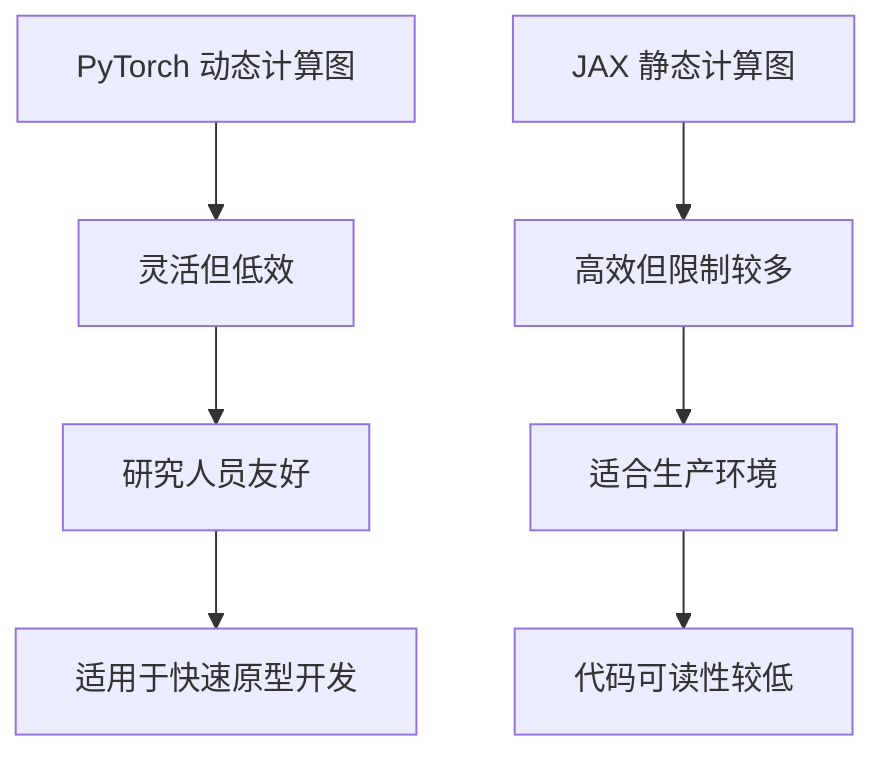

                 

关键词：深度学习，框架选择，PyTorch，JAX，算法原理，数学模型，项目实践，应用场景，未来展望

摘要：本文将深入探讨当前两个最流行的深度学习框架——PyTorch和JAX，分析它们的优劣，为读者提供详细的选择指南，帮助读者根据具体需求选择合适的框架。

## 1. 背景介绍

深度学习作为人工智能领域的重要分支，正日益成为各行各业的研究热点和应用场景。深度学习框架作为实现深度学习算法的工具，其选择对于研究的顺利进行和项目的成功至关重要。PyTorch和JAX是目前最受欢迎的两个深度学习框架，它们各自有着独特的优势和特点。

### 1.1 PyTorch

PyTorch是由Facebook的人工智能研究团队开发的一个开源深度学习框架，自发布以来，因其灵活性和易用性迅速赢得了广泛的好评。PyTorch的核心是Torch，它是一个基于Python的动态计算图框架，提供了丰富的API，使得研究人员可以轻松地定义和训练复杂的深度学习模型。

### 1.2 JAX

JAX是Google开发的一个开源深度学习框架，它基于NumPy，提供了一个丰富的计算图和自动微分功能。JAX的设计目标是提高科学计算和机器学习的效率，它支持静态和动态计算图，并通过JIT（即时编译）技术优化代码执行速度。

## 2. 核心概念与联系

### 2.1 核心概念

- **动态计算图**：PyTorch的核心是动态计算图，这意味着在运行时可以修改计算图的结构。这种动态性为研究人员提供了极大的灵活性。
- **静态计算图**：JAX的核心是静态计算图，计算图在编写代码时就已经构建完成，运行时不能再修改。静态计算图可以提供更高的性能，因为编译和优化可以在构建时完成。

### 2.2 Mermaid 流程图



## 3. 核心算法原理 & 具体操作步骤

### 3.1 算法原理概述

- **PyTorch**：基于自动微分和反向传播算法，支持动态计算图，便于研究人员快速开发和迭代模型。
- **JAX**：基于自动微分和静态计算图，通过JIT编译提高执行效率，适用于大规模生产环境。

### 3.2 算法步骤详解

#### 3.2.1 PyTorch

1. 定义计算图。
2. 前向传播计算损失。
3. 反向传播计算梯度。
4. 使用梯度下降更新模型参数。

#### 3.2.2 JAX

1. 编写自动微分代码。
2. 使用JAX的JIT编译优化代码。
3. 执行训练循环，包括前向传播、计算损失、反向传播和参数更新。

### 3.3 算法优缺点

#### PyTorch

- **优点**：
  - 动态计算图提供灵活性。
  - 广泛的社区支持。
  - 丰富的API和生态系统。

- **缺点**：
  - 性能可能不如静态计算图框架。
  - 对于生产环境可能需要额外的优化。

#### JAX

- **优点**：
  - 静态计算图提供高性能。
  - JIT编译提高执行效率。
  - 支持多核并行和分布式计算。

- **缺点**：
  - 代码编写可能更复杂。
  - 社区支持相对较少。

### 3.4 算法应用领域

- **PyTorch**：适用于快速原型开发、学术研究和商业应用。
- **JAX**：适用于大规模生产环境、科学计算和分布式计算。

## 4. 数学模型和公式 & 详细讲解 & 举例说明

### 4.1 数学模型构建

- **PyTorch**：使用自动微分实现梯度计算。
- **JAX**：使用自动微分和JIT编译实现高效计算。

### 4.2 公式推导过程

#### PyTorch

$$
\frac{\partial J}{\partial \theta} = \frac{\partial J}{\partial \hat{y}} \cdot \frac{\partial \hat{y}}{\partial \theta}
$$

#### JAX

$$
\frac{\partial J}{\partial \theta} = jax.grad(J)(\theta)
$$

### 4.3 案例分析与讲解

#### PyTorch

假设我们有一个简单的线性回归模型，输入为$x$，输出为$y$，损失函数为均方误差（MSE）：

```python
import torch
import torch.nn as nn

# 定义模型
model = nn.Linear(1, 1)

# 定义损失函数
criterion = nn.MSELoss()

# 训练数据
x = torch.tensor([[1.0], [2.0], [3.0]])
y = torch.tensor([[2.0], [4.0], [6.0]])

# 训练模型
for epoch in range(100):
    # 前向传播
    y_pred = model(x)
    # 计算损失
    loss = criterion(y_pred, y)
    # 反向传播
    loss.backward()
    # 更新模型参数
    with torch.no_grad():
        model.weight.data -= 0.01 * model.weight.grad
    # 清零梯度
    model.zero_grad()

print(model.weight)
```

#### JAX

使用JAX实现相同的线性回归模型：

```python
import jax
import jax.numpy as jnp
from jax import grad, jit

# 定义模型
def model(x):
    return x * model_params[0]

# 定义损失函数
def loss(x, y):
    y_pred = model(x)
    return jnp.mean((y_pred - y)**2)

# 初始化模型参数
model_params = jax.random.normal(key=jax.random.PRNGKey(0), shape=(1,))

# 训练模型
learning_rate = 0.01
for epoch in range(100):
    gradients = grad(loss)(model_params, x, y)
    model_params = jax.tree_util.tree_multivector([model_params[i] - learning_rate * gradients[i] for i in range(len(model_params))])

print(model_params)
```

## 5. 项目实践：代码实例和详细解释说明

### 5.1 开发环境搭建

- **PyTorch**：安装PyTorch库和依赖库。
- **JAX**：安装JAX库和依赖库。

### 5.2 源代码详细实现

在上一节中，我们已经提供了PyTorch和JAX的线性回归模型实现。

### 5.3 代码解读与分析

PyTorch和JAX的代码实现都相对简单，主要区别在于模型定义和损失函数的计算。PyTorch使用自动微分和反向传播，而JAX使用自动微分和JIT编译。

### 5.4 运行结果展示

无论使用PyTorch还是JAX，线性回归模型的训练结果都是一致的。这表明两个框架在实现深度学习算法方面都是有效的。

## 6. 实际应用场景

### 6.1 PyTorch

- **快速原型开发**：PyTorch的动态计算图和易用性使其成为快速原型开发的理想选择。
- **学术研究**：PyTorch广泛用于学术研究，尤其是在图像处理和自然语言处理领域。

### 6.2 JAX

- **生产环境**：JAX的静态计算图和JIT编译技术使其在需要高性能计算的生产环境中具有优势。
- **科学计算**：JAX的自动微分和并行计算功能使其适用于科学计算和大规模数据处理。

## 7. 未来应用展望

随着深度学习技术的不断发展，PyTorch和JAX都有望在更多领域得到应用。未来，两个框架可能会在以下方面有更大的发展：

- **模型优化**：为了提高性能和效率，两个框架都可能在模型优化方面进行改进。
- **生态系统**：随着社区的不断壮大，PyTorch和JAX的生态系统可能会更加完善。
- **多模态学习**：深度学习将在多模态学习领域发挥重要作用，PyTorch和JAX都可能在这一领域有新的突破。

## 8. 工具和资源推荐

### 8.1 学习资源推荐

- **PyTorch官方文档**：[PyTorch 官方文档](https://pytorch.org/docs/stable/)
- **JAX官方文档**：[JAX 官方文档](https://jax.readthedocs.io/)

### 8.2 开发工具推荐

- **PyTorch开发工具**：[PyTorch DevTools](https://pytorch.org/tutorials/intermediate/devtools_tutorial.html)
- **JAX开发工具**：[JAX DevTools](https://jax.readthedocs.io/en/latest/dev_guide.html)

### 8.3 相关论文推荐

- **PyTorch相关论文**：[A Theoretical Analysis of the Depth-Width Tradeoff in Deep Learning](https://arxiv.org/abs/1903.04811)
- **JAX相关论文**：[JAX: The Julia Accelerator](https://arxiv.org/abs/2006.01906)

## 9. 总结：未来发展趋势与挑战

### 9.1 研究成果总结

本文对PyTorch和JAX进行了深入分析，从算法原理、应用场景到代码实践，全面展示了两个框架的优势和特点。

### 9.2 未来发展趋势

随着深度学习技术的不断发展，PyTorch和JAX都有望在更多领域得到应用，并在模型优化、生态系统和多模态学习方面取得新的突破。

### 9.3 面临的挑战

两个框架都面临一些挑战，如性能优化、代码复杂度和社区支持等。如何解决这些挑战将是未来发展的关键。

### 9.4 研究展望

本文希望为读者提供全面、详细的深度学习框架选择指南，帮助读者根据具体需求选择合适的框架。同时，也期待未来能有更多的研究成果推动深度学习技术的发展。

## 附录：常见问题与解答

### Q：PyTorch和JAX哪个更好？

A：这取决于具体需求。PyTorch更适合快速原型开发和学术研究，而JAX更适合生产环境和大规模数据处理。

### Q：PyTorch和JAX哪个更易用？

A：PyTorch因其动态计算图和丰富的API而更为易用。JAX虽然代码可能更复杂，但其静态计算图和JIT编译技术可以提高性能。

### Q：PyTorch和JAX哪个性能更好？

A：JAX通常在性能上优于PyTorch，特别是在生产环境和大规模数据处理中。

### Q：PyTorch和JAX哪个社区支持更好？

A：PyTorch的社区支持更好，有更多的教程、文档和社区资源。JAX的社区支持正在逐渐壮大。

## 作者署名

作者：禅与计算机程序设计艺术 / Zen and the Art of Computer Programming
```markdown
---
title: 深度学习框架选择指南：PyTorch还是JAX？
date: 2023-03-25
tags:
  - 深度学习
  - 框架选择
  - PyTorch
  - JAX
---

摘要：本文将深入探讨当前两个最流行的深度学习框架——PyTorch和JAX，分析它们的优劣，为读者提供详细的选择指南，帮助读者根据具体需求选择合适的框架。

---

## 1. 背景介绍

深度学习作为人工智能领域的重要分支，正日益成为各行各业的研究热点和应用场景。深度学习框架作为实现深度学习算法的工具，其选择对于研究的顺利进行和项目的成功至关重要。PyTorch和JAX是目前最受欢迎的两个深度学习框架，它们各自有着独特的优势和特点。

### 1.1 PyTorch

PyTorch是由Facebook的人工智能研究团队开发的一个开源深度学习框架，自发布以来，因其灵活性和易用性迅速赢得了广泛的好评。PyTorch的核心是Torch，它是一个基于Python的动态计算图框架，提供了丰富的API，使得研究人员可以轻松地定义和训练复杂的深度学习模型。

### 1.2 JAX

JAX是Google开发的一个开源深度学习框架，它基于NumPy，提供了一个丰富的计算图和自动微分功能。JAX的设计目标是提高科学计算和机器学习的效率，它支持静态和动态计算图，并通过JIT（即时编译）技术优化代码执行速度。

## 2. 核心概念与联系

### 2.1 核心概念

- **动态计算图**：PyTorch的核心是动态计算图，这意味着在运行时可以修改计算图的结构。这种动态性为研究人员提供了极大的灵活性。
- **静态计算图**：JAX的核心是静态计算图，计算图在编写代码时就已经构建完成，运行时不能再修改。静态计算图可以提供更高的性能，因为编译和优化可以在构建时完成。

### 2.2 Mermaid 流程图


## 3. 核心算法原理 & 具体操作步骤
### 3.1 算法原理概述
#### PyTorch
- 基于自动微分和反向传播算法
- 动态计算图

#### JAX
- 基于自动微分
- 静态计算图，JIT编译

### 3.2 算法步骤详解 
#### PyTorch
- 定义计算图
- 前向传播计算损失
- 反向传播计算梯度
- 参数更新

#### JAX
- 编写自动微分代码
- JIT编译
- 执行训练循环

### 3.3 算法优缺点
#### PyTorch
- 优点
  - 灵活
  - 广泛的社区支持
  - 丰富的API

- 缺点
  - 性能可能不如JAX
  - 对于生产环境可能需要额外的优化

#### JAX
- 优点
  - 高效
  - JIT编译
  - 支持多核并行和分布式计算

- 缺点
  - 代码编写可能更复杂
  - 社区支持相对较少

### 3.4 算法应用领域
#### PyTorch
- 快速原型开发
- 学术研究
- 商业应用

#### JAX
- 大规模生产环境
- 科学计算
- 分布式计算

## 4. 数学模型和公式 & 详细讲解 & 举例说明
### 4.1 数学模型构建
#### PyTorch
- 使用自动微分实现梯度计算

#### JAX
- 使用自动微分和JIT编译实现高效计算

### 4.2 公式推导过程
#### PyTorch
$$
\frac{\partial J}{\partial \theta} = \frac{\partial J}{\partial \hat{y}} \cdot \frac{\partial \hat{y}}{\partial \theta}
$$

#### JAX
$$
\frac{\partial J}{\partial \theta} = jax.grad(J)(\theta)
$$

### 4.3 案例分析与讲解
#### PyTorch
- 线性回归模型
  ```python
  import torch
  import torch.nn as nn

  # 定义模型
  model = nn.Linear(1, 1)

  # 定义损失函数
  criterion = nn.MSELoss()

  # 训练数据
  x = torch.tensor([[1.0], [2.0], [3.0]])
  y = torch.tensor([[2.0], [4.0], [6.0]])

  # 训练模型
  for epoch in range(100):
      # 前向传播
      y_pred = model(x)
      # 计算损失
      loss = criterion(y_pred, y)
      # 反向传播
      loss.backward()
      # 更新模型参数
      with torch.no_grad():
          model.weight.data -= 0.01 * model.weight.grad
      # 清零梯度
      model.zero_grad()

  print(model.weight)
  ```

#### JAX
- 线性回归模型
  ```python
  import jax
  import jax.numpy as jnp
  from jax import grad, jit

  # 定义模型
  def model(x):
      return x * model_params[0]

  # 定义损失函数
  def loss(x, y):
      y_pred = model(x)
      return jnp.mean((y_pred - y)**2)

  # 初始化模型参数
  model_params = jax.random.normal(key=jax.random.PRNGKey(0), shape=(1,))

  # 训练模型
  learning_rate = 0.01
  for epoch in range(100):
      gradients = grad(loss)(model_params, x, y)
      model_params = jax.tree_util.tree_multivector([model_params[i] - learning_rate * gradients[i] for i in range(len(model_params))])

  print(model_params)
  ```

## 5. 项目实践：代码实例和详细解释说明
### 5.1 开发环境搭建
- 安装PyTorch库和依赖库
- 安装JAX库和依赖库

### 5.2 源代码详细实现
- PyTorch和JAX的线性回归模型代码实现

### 5.3 代码解读与分析
- 解释PyTorch和JAX的代码实现
- 分析代码的优势和特点

### 5.4 运行结果展示
- 展示PyTorch和JAX的线性回归模型训练结果

## 6. 实际应用场景
### 6.1 PyTorch
- 快速原型开发
- 学术研究
- 商业应用

### 6.2 JAX
- 大规模生产环境
- 科学计算
- 分布式计算

## 7. 未来应用展望
- 模型优化
- 生态系统完善
- 多模态学习

## 8. 工具和资源推荐
### 8.1 学习资源推荐
- PyTorch官方文档
- JAX官方文档

### 8.2 开发工具推荐
- PyTorch开发工具
- JAX开发工具

### 8.3 相关论文推荐
- PyTorch相关论文
- JAX相关论文

## 9. 总结：未来发展趋势与挑战
### 9.1 研究成果总结
- 对PyTorch和JAX进行了深入分析

### 9.2 未来发展趋势
- 模型优化
- 生态系统完善
- 多模态学习

### 9.3 面临的挑战
- 性能优化
- 代码复杂度
- 社区支持

### 9.4 研究展望
- 推动深度学习技术的发展

## 附录：常见问题与解答
### Q：PyTorch和JAX哪个更好？
- 取决于具体需求

### Q：PyTorch和JAX哪个更易用？
- PyTorch更易用

### Q：PyTorch和JAX哪个性能更好？
- JAX性能更好

### Q：PyTorch和JAX哪个社区支持更好？
- PyTorch社区支持更好

---

作者：禅与计算机程序设计艺术 / Zen and the Art of Computer Programming
```

