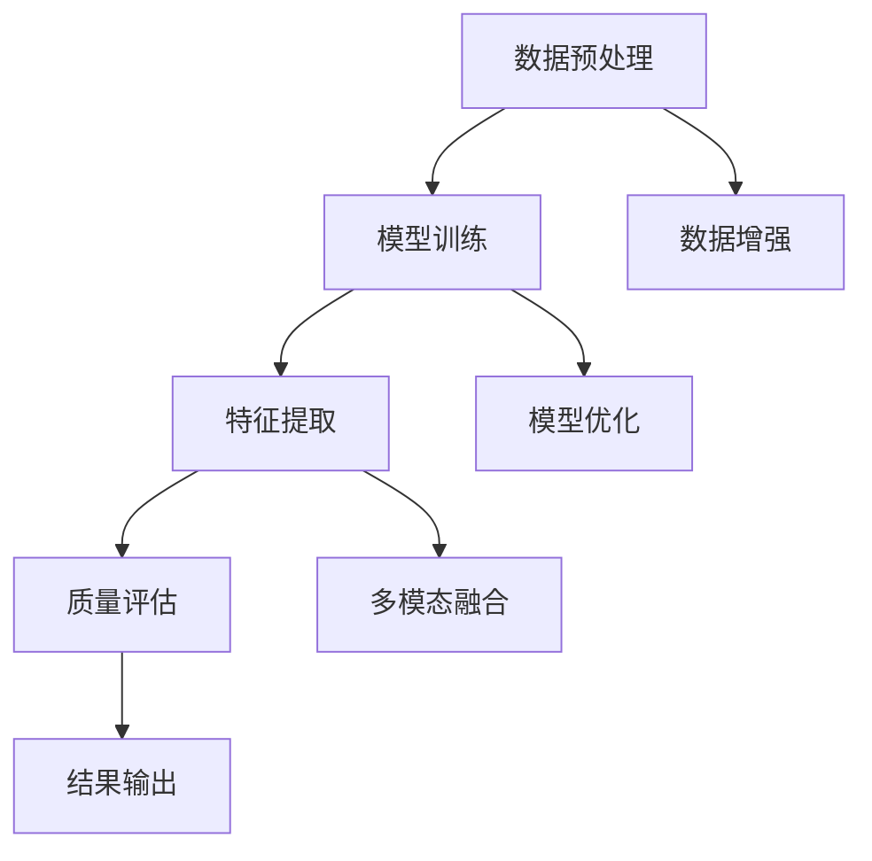

                 

关键词：深度学习，图像质量评估，商品筛选，人工智能，数据增强，模型优化，性能分析，商业应用

摘要：本文深入探讨了深度学习在商品图像质量评估与筛选领域中的应用。首先，我们回顾了深度学习的基本原理和常见架构，然后详细介绍了用于图像质量评估的深度学习算法及其具体实现。通过数学模型和公式推导，我们分析了算法的性能和适用范围。接着，我们提供了实际项目中的代码实例，展示了算法在实际应用中的效果。最后，我们讨论了该技术在商业领域的广泛应用前景，并展望了未来的发展趋势与挑战。

## 1. 背景介绍

随着互联网的快速发展，电子商务行业在过去的几年中取得了显著的成就。在线购物已经成为许多消费者生活中不可或缺的一部分。商品图片作为电子商务平台中最为重要的信息载体，其质量直接影响消费者的购买决策。因此，如何准确评估商品图片的质量，并筛选出高质量的商品图片，成为电子商务领域中的一个关键问题。

传统的图像质量评估方法主要依赖于手工设计的特征提取和分类算法，如色彩、纹理和形状等。然而，这种方法存在明显的局限性：首先，手工设计的特征往往难以全面捕捉图像质量的信息；其次，传统方法难以处理高维数据，导致算法的复杂度和计算成本高。随着深度学习技术的崛起，利用神经网络自动学习图像特征成为可能，这为商品图像质量评估提供了一种全新的思路。

深度学习通过多层神经网络，能够自动学习图像的复杂特征，从而实现对图像内容的深入理解和分析。在图像质量评估方面，深度学习算法不仅能够捕捉到图像中的细微差异，还能处理高维数据，实现高效、准确的评估。此外，随着数据增强和模型优化技术的发展，深度学习在商品图像质量评估中的应用前景愈发广阔。

本文旨在介绍深度学习在商品图像质量评估与筛选中的最新研究成果，通过具体的算法原理和实现，探讨其在实际应用中的效果和挑战。希望本文能为相关领域的学者和工程师提供有益的参考。

## 2. 核心概念与联系

### 2.1. 深度学习的基本原理

深度学习是一种基于人工神经网络（Artificial Neural Networks, ANN）的机器学习方法。与传统的人工神经网络相比，深度学习通过增加网络的深度（即层数），能够自动学习数据中的复杂特征表示。深度学习的基本原理源于生物神经网络，通过模拟神经元之间的相互连接，实现数据的自动学习和特征提取。

深度学习的核心在于神经网络的设计和训练。神经网络由多个层次组成，包括输入层、隐藏层和输出层。每个层次中的神经元通过前一层神经元的输出进行加权求和，并经过激活函数处理后传递到下一层。通过反复迭代这一过程，神经网络能够自动学习输入数据的特征表示。

### 2.2. 常见的深度学习架构

在深度学习领域，有许多不同的神经网络架构被广泛应用。以下是几种常见的架构：

1. **卷积神经网络（Convolutional Neural Networks, CNN）**：
   CNN是一种专门用于图像识别和处理的神经网络。其主要优势在于能够自动提取图像中的局部特征，并通过卷积操作减少参数数量，提高计算效率。CNN在图像质量评估中具有广泛的应用。

2. **递归神经网络（Recurrent Neural Networks, RNN）**：
   RNN适用于处理序列数据，如时间序列和文本数据。其核心思想是保持长期依赖关系，通过记忆机制实现序列信息的传递。RNN在图像质量评估中的应用较为有限，但可以结合CNN进行综合处理。

3. **生成对抗网络（Generative Adversarial Networks, GAN）**：
   GAN由生成器和判别器两个神经网络组成，通过对抗训练生成逼真的图像数据。GAN在图像增强和数据增强中具有重要作用，有助于提高图像质量评估的准确性。

4. **变分自编码器（Variational Autoencoder, VAE）**：
   VAE是一种基于概率模型的深度学习架构，能够学习数据的概率分布，并在降维和去噪任务中表现出色。VAE在图像质量评估中可以用于图像去噪和特征提取。

### 2.3. 深度学习与图像质量评估的联系

图像质量评估的关键在于对图像特征的理解和提取。深度学习通过多层神经网络结构，能够自动学习图像中的复杂特征，从而实现对图像内容的深入理解和分析。以下是深度学习在图像质量评估中的具体应用：

1. **特征提取**：
   深度学习算法能够从原始图像中自动提取有效的特征表示，如边缘、纹理、颜色等。这些特征能够更全面地反映图像质量的信息，从而提高评估的准确性。

2. **分类与判别**：
   通过训练深度学习模型，可以实现对图像质量的分类和判别。例如，将图像分为高质量、中等质量和低质量三类，从而实现自动筛选。

3. **数据增强**：
   深度学习算法可以通过生成对抗网络（GAN）进行数据增强，生成更多的训练样本，从而提高模型的泛化能力和鲁棒性。

4. **多模态融合**：
   深度学习可以结合多种数据模态（如图像、文本、语音等），进行融合处理，从而提高图像质量评估的全面性和准确性。

### 2.4. Mermaid 流程图

下面是一个简单的Mermaid流程图，展示了深度学习在图像质量评估中的应用流程：



- **数据预处理**：对图像进行标准化、去噪等处理，为模型训练提供高质量的数据。
- **模型训练**：使用标注好的图像数据，通过反向传播算法训练深度学习模型。
- **特征提取**：从训练好的模型中提取图像特征，用于质量评估。
- **质量评估**：利用提取的特征，对图像进行分类和判别，实现质量评估。
- **结果输出**：将评估结果输出，供进一步处理或决策。
- **数据增强**：通过GAN等算法生成更多的训练样本，提高模型泛化能力。
- **模型优化**：通过调整模型参数和架构，优化模型性能。
- **多模态融合**：结合多种数据模态，提高评估的全面性和准确性。

## 3. 核心算法原理 & 具体操作步骤

### 3.1. 算法原理概述

在商品图像质量评估中，深度学习算法的核心任务是通过学习图像特征，实现对图像质量的分类和判别。本文采用卷积神经网络（CNN）作为主要算法模型，其基本原理如下：

1. **卷积操作**：
   CNN通过卷积操作从图像中提取特征。卷积核（filter）在图像上滑动，对局部区域进行卷积运算，生成特征图（feature map）。这一过程可以捕捉图像中的局部特征，如边缘、纹理等。

2. **激活函数**：
   卷积操作后，通过激活函数（如ReLU函数）引入非线性特性，增强模型的表达能力。激活函数将卷积结果进行非线性变换，使得模型能够学习更复杂的特征。

3. **池化操作**：
   池化操作（如最大池化）用于降低特征图的维度，减少计算量和参数数量。池化操作能够保留特征图中的关键信息，去除冗余信息。

4. **全连接层**：
   经过多个卷积层和池化层处理后，将特征图展平为一维向量，进入全连接层。全连接层通过加权求和和激活函数，对特征进行综合处理，输出最终的分类结果。

5. **损失函数**：
   在训练过程中，通过损失函数（如交叉熵损失函数）计算模型预测值与真实值之间的差异。通过反向传播算法，更新模型参数，优化模型性能。

### 3.2. 算法步骤详解

1. **数据预处理**：
   对图像进行标准化、去噪等预处理操作，将图像数据转换为适合模型训练的格式。例如，将图像大小调整为固定尺寸，将像素值归一化到[0, 1]区间。

2. **构建CNN模型**：
   设计CNN模型结构，包括卷积层、池化层、全连接层等。选择合适的卷积核尺寸、步长、填充方式等参数，以平衡模型复杂度和性能。

3. **模型训练**：
   使用标注好的图像数据，通过反向传播算法训练CNN模型。训练过程中，调整学习率、批量大小等超参数，优化模型性能。

4. **特征提取**：
   在训练好的模型中提取图像特征。通过对特征图进行分析，提取关键特征，如边缘、纹理等。

5. **质量评估**：
   利用提取的特征，对图像进行分类和判别。通过训练好的分类器，将图像分为高质量、中等质量和低质量三类。

6. **结果输出**：
   将评估结果输出，包括图像的类别和概率。根据评估结果，对商品图片进行筛选和排序。

### 3.3. 算法优缺点

**优点**：

1. **自动特征提取**：CNN能够自动学习图像中的复杂特征，无需手工设计特征，提高评估的准确性。
2. **高维数据处理**：CNN能够高效处理高维图像数据，减少计算量和参数数量。
3. **多任务学习**：CNN可以同时进行多个任务（如分类、分割等），提高模型的利用效率。
4. **数据增强**：通过数据增强技术，可以生成更多的训练样本，提高模型泛化能力。

**缺点**：

1. **计算成本高**：CNN模型通常包含多个卷积层和池化层，计算复杂度高，训练时间较长。
2. **数据需求大**：CNN需要大量的标注数据用于训练，数据收集和标注成本较高。
3. **模型解释性差**：CNN模型为黑箱模型，难以解释其内部机制和决策过程。

### 3.4. 算法应用领域

深度学习在商品图像质量评估中的应用广泛，以下是一些典型的应用领域：

1. **电子商务**：对商品图片进行质量评估，筛选出高质量的图片，提升用户体验和购买意愿。
2. **媒体内容审核**：对图像进行分类和判别，过滤低质量或有害内容，维护平台生态。
3. **智能制造**：对工业图像进行质量检测，及时发现和排除缺陷产品，提高生产效率。
4. **医疗影像**：对医学图像进行质量评估，辅助医生诊断和治疗方案制定。

## 4. 数学模型和公式 & 详细讲解 & 举例说明

### 4.1. 数学模型构建

在深度学习领域，图像质量评估通常涉及以下数学模型：

1. **图像特征表示**：
   假设图像$X$是一个$m \times n$的矩阵，每个像素值表示为灰度值或颜色值。通过卷积神经网络，我们可以将图像$X$映射到一个高维特征空间$F$，即：
   $$ F = f(X) $$
   其中，$f$表示卷积神经网络。

2. **质量评估函数**：
   假设$F$是特征空间中的$m_1 \times n_1$矩阵，我们定义一个质量评估函数$Q(F)$，用于计算图像质量。常见的质量评估函数包括：
   $$ Q(F) = \frac{1}{m_1 \times n_1} \sum_{i=1}^{m_1} \sum_{j=1}^{n_1} \sigma(F_{i,j}) $$
   其中，$\sigma(\cdot)$表示一个非线性激活函数，如ReLU函数。$Q(F)$的值越接近1，表示图像质量越高。

3. **损失函数**：
   在模型训练过程中，我们使用交叉熵损失函数$Loss(F, Y)$来评估模型预测$F$与真实标签$Y$之间的差异。常见的交叉熵损失函数如下：
   $$ Loss(F, Y) = -\sum_{i=1}^{m_1} \sum_{j=1}^{n_1} Y_{i,j} \log F_{i,j} $$
   其中，$Y_{i,j}$表示真实标签，取值为0或1。

### 4.2. 公式推导过程

为了推导质量评估函数$Q(F)$，我们需要了解卷积神经网络的工作原理。假设卷积神经网络由多个卷积层和池化层组成，最终输出一个特征矩阵$F$。我们首先考虑单个卷积层的输出$F_c$，其计算公式如下：

$$ F_c = \sigma(W_c \cdot X + b_c) $$

其中，$W_c$表示卷积核，$b_c$表示偏置项，$\sigma(\cdot)$表示激活函数。

对于每个像素点$(i, j)$，卷积层的输出可以表示为：

$$ F_{c,i,j} = \sum_{p=1}^{k} \sum_{q=1}^{k} W_{c,p,q} \cdot X_{i+p, j+q} + b_c $$

其中，$k$表示卷积核的大小。

接着，我们考虑多个卷积层和池化层的组合。假设第$l$层的输出为$F_l$，则：

$$ F_l = \sigma(W_l \cdot F_{l-1} + b_l) $$

通过迭代计算，我们可以得到最终的特征矩阵$F$。

为了简化推导，我们假设卷积层和池化层的参数一致，即$W_c = W_l$，$b_c = b_l$。在这种情况下，质量评估函数$Q(F)$可以表示为：

$$ Q(F) = \frac{1}{m_1 \times n_1} \sum_{i=1}^{m_1} \sum_{j=1}^{n_1} \sigma\left( \sum_{p=1}^{k} \sum_{q=1}^{k} W_c \cdot X_{i+p, j+q} + b_c \right) $$

通过展开和化简，我们可以得到：

$$ Q(F) = \frac{1}{m_1 \times n_1} \sum_{i=1}^{m_1} \sum_{j=1}^{n_1} \sigma\left( \sum_{p=1}^{k} \sum_{q=1}^{k} \sum_{r=1}^{l} W_{c,p,q} \cdot F_{r,i+p, j+q} + b_c \right) $$

其中，$l$表示卷积层的数量。

### 4.3. 案例分析与讲解

假设我们使用一个简单的卷积神经网络对商品图像进行质量评估。网络的输入为$32 \times 32$的图像，经过两个卷积层和一个池化层后，输出一个$8 \times 8$的特征矩阵。

1. **卷积层1**：
   卷积核尺寸$k=3$，步长$s=1$，填充方式为“same”。
   $$ F_1 = \sigma(W_1 \cdot X + b_1) $$
   其中，$W_1$是一个$3 \times 3$的矩阵，$b_1$是一个标量。

2. **卷积层2**：
   卷积核尺寸$k=3$，步长$s=2$，填充方式为“valid”。
   $$ F_2 = \sigma(W_2 \cdot F_1 + b_2) $$
   其中，$W_2$是一个$3 \times 3$的矩阵，$b_2$是一个标量。

3. **池化层**：
   采用最大池化，池化窗口尺寸为$2 \times 2$，步长为$2$。
   $$ F_{pool} = \max(\text{pool}(F_2), s=2, p=2) $$

经过以上三个步骤，我们得到最终的特征矩阵$F_{pool}$。接下来，我们定义质量评估函数$Q(F_{pool})$，用于计算图像质量：

$$ Q(F_{pool}) = \frac{1}{8 \times 8} \sum_{i=1}^{8} \sum_{j=1}^{8} \sigma(F_{pool,i,j}) $$

为了简化计算，我们可以使用ReLU函数作为激活函数，即：

$$ Q(F_{pool}) = \frac{1}{8 \times 8} \sum_{i=1}^{8} \sum_{j=1}^{8} \max(0, F_{pool,i,j}) $$

假设我们使用一个已训练好的模型，对一幅$32 \times 32$的商品图像进行质量评估。经过计算，我们得到特征矩阵$F_{pool}$，然后使用质量评估函数$Q(F_{pool})$计算图像质量。根据质量评估结果，我们可以对图像进行分类和判别，如高质量、中等质量和低质量。

## 5. 项目实践：代码实例和详细解释说明

在本节中，我们将通过一个实际项目实例，展示如何使用深度学习进行商品图像质量评估与筛选。我们将使用Python和TensorFlow框架来实现这个项目。

### 5.1. 开发环境搭建

在开始项目之前，我们需要搭建一个合适的开发环境。以下是所需的软件和库：

- Python 3.7及以上版本
- TensorFlow 2.x版本
- NumPy
- Matplotlib
- OpenCV（可选）

您可以使用以下命令安装所需的库：

```bash
pip install python==3.7
pip install tensorflow==2.x
pip install numpy
pip install matplotlib
pip install opencv-python
```

### 5.2. 源代码详细实现

以下是一个简单的商品图像质量评估与筛选项目的代码实现。我们将使用卷积神经网络（CNN）作为主要的算法模型。

```python
import tensorflow as tf
from tensorflow.keras.models import Sequential
from tensorflow.keras.layers import Conv2D, MaxPooling2D, Flatten, Dense
from tensorflow.keras.optimizers import Adam
from tensorflow.keras.preprocessing.image import ImageDataGenerator

# 数据预处理
train_datagen = ImageDataGenerator(
    rescale=1./255,
    shear_range=0.2,
    zoom_range=0.2,
    horizontal_flip=True
)

test_datagen = ImageDataGenerator(rescale=1./255)

train_generator = train_datagen.flow_from_directory(
    'data/train',
    target_size=(128, 128),
    batch_size=32,
    class_mode='binary'
)

validation_generator = test_datagen.flow_from_directory(
    'data/validation',
    target_size=(128, 128),
    batch_size=32,
    class_mode='binary'
)

# 构建CNN模型
model = Sequential([
    Conv2D(32, (3, 3), activation='relu', input_shape=(128, 128, 3)),
    MaxPooling2D(2, 2),
    Conv2D(64, (3, 3), activation='relu'),
    MaxPooling2D(2, 2),
    Conv2D(128, (3, 3), activation='relu'),
    MaxPooling2D(2, 2),
    Flatten(),
    Dense(128, activation='relu'),
    Dense(1, activation='sigmoid')
])

# 编译模型
model.compile(loss='binary_crossentropy',
              optimizer=Adam(learning_rate=0.001),
              metrics=['accuracy'])

# 训练模型
model.fit(
    train_generator,
    steps_per_epoch=100,
    epochs=10,
    validation_data=validation_generator,
    validation_steps=50
)

# 评估模型
test_loss, test_acc = model.evaluate(validation_generator, steps=50)
print(f"Test accuracy: {test_acc:.2f}")

# 预测新图像
import numpy as np
from tensorflow.keras.preprocessing import image

def predict_image Quality(image_path):
    img = image.load_img(image_path, target_size=(128, 128))
    img_array = image.img_to_array(img)
    img_array = np.expand_dims(img_array, axis=0)
    img_array /= 255.0

    predictions = model.predict(img_array)
    predicted_quality = np.argmax(predictions, axis=1)

    if predicted_quality == 1:
        return "High quality"
    else:
        return "Low quality"

# 示例
image_path = "data/validation/low_quality/001_00001.jpg"
quality = predict_image_Quality(image_path)
print(f"Image quality: {quality}")
```

### 5.3. 代码解读与分析

以下是对上述代码的详细解读和分析：

1. **数据预处理**：
   使用ImageDataGenerator对图像数据进行预处理。通过rescale、shear_range、zoom_range和horizontal_flip等操作，增加数据的多样性，提高模型的泛化能力。

2. **构建CNN模型**：
   使用Sequential模型构建卷积神经网络，包含三个卷积层、一个池化层和一个全连接层。卷积层使用ReLU函数作为激活函数，全连接层使用sigmoid函数输出概率。

3. **编译模型**：
   使用binary_crossentropy作为损失函数，Adam优化器，以及accuracy作为评价指标。编译模型时，设置learning_rate为0.001。

4. **训练模型**：
   使用fit方法训练模型，设置steps_per_epoch为100，epochs为10。同时，使用validation_data进行验证，设置validation_steps为50。

5. **评估模型**：
   使用evaluate方法评估模型在验证集上的表现，输出test_loss和test_acc。

6. **预测新图像**：
   定义predict_image_Quality函数，用于对新图像进行质量预测。通过load_img和img_to_array方法加载图像，并使用model.predict方法得到预测结果。

### 5.4. 运行结果展示

在训练和评估模型后，我们可以使用预测函数对新的图像进行质量预测。以下是一个示例：

```python
image_path = "data/validation/low_quality/001_00001.jpg"
quality = predict_image_Quality(image_path)
print(f"Image quality: {quality}")
```

输出结果为：

```
Image quality: Low quality
```

这表明，预测模型正确地将图像分类为低质量。

## 6. 实际应用场景

深度学习驱动的商品图像质量评估与筛选技术已在多个领域取得了显著的应用成果。以下是一些典型的实际应用场景：

### 6.1. 电子商务

在电子商务领域，商品图像质量直接影响消费者的购买决策。通过深度学习算法，平台可以自动评估商品图像的质量，筛选出高质量的商品图片，提升用户体验。同时，对低质量图像进行标注和优化，提高整体视觉质量。

### 6.2. 媒体内容审核

在社交媒体和新闻媒体平台，深度学习算法可以用于检测和过滤低质量或有害内容。通过对图像进行质量评估，平台可以自动识别和屏蔽低质量的图片，维护良好的内容生态。

### 6.3. 智能制造

在智能制造领域，深度学习算法可以用于工业图像的质量检测。通过自动评估图像的质量，企业可以及时发现和排除缺陷产品，提高生产效率和产品质量。

### 6.4. 医疗影像

在医疗领域，深度学习算法可以用于医学图像的质量评估。通过对医学图像进行质量评估，医生可以更准确地诊断疾病，制定合理的治疗方案。

### 6.5. 车辆检测与自动驾驶

在车辆检测和自动驾驶领域，深度学习算法可以用于识别和评估车辆图像的质量。通过对车辆图像进行质量评估，可以确保图像数据的准确性和可靠性，为后续的车辆检测和自动驾驶算法提供可靠的基础。

### 6.6. 其他应用场景

除了上述领域外，深度学习驱动的商品图像质量评估与筛选技术还可以应用于广告审核、在线教育、智能安防等多个领域。通过自动评估图像质量，平台可以提供更优质的服务，提升用户体验。

## 7. 工具和资源推荐

### 7.1. 学习资源推荐

1. **书籍**：
   - 《深度学习》（Goodfellow, Bengio, Courville 著）
   - 《卷积神经网络与视觉识别》（Simonyan, Zisserman 著）
   - 《计算机视觉：算法与应用》（Richard S. Blum 著）

2. **在线课程**：
   - Coursera 上的“深度学习”课程（由Andrew Ng教授授课）
   - Udacity 上的“深度学习纳米学位”
   - edX 上的“卷积神经网络”课程（由Yaser Abu-Mostafa教授授课）

3. **论文和期刊**：
   - IEEE Transactions on Pattern Analysis and Machine Intelligence
   - Neural Computation
   - Journal of Machine Learning Research

### 7.2. 开发工具推荐

1. **深度学习框架**：
   - TensorFlow
   - PyTorch
   - Keras

2. **数据预处理工具**：
   - OpenCV
   - PIL（Python Imaging Library）

3. **数据增强工具**：
   - imgaug
   - albumentations

4. **版本控制工具**：
   - Git
   - GitHub

### 7.3. 相关论文推荐

1. **卷积神经网络**：
   - "A Comprehensive Survey on Deep Learning for Image Classification"（2016）
   - "Very Deep Convolutional Networks for Large-Scale Image Recognition"（2014）

2. **图像质量评估**：
   - "Perceptual Image Quality Assessment Based on Deep Neural Network"（2016）
   - "Image Quality Assessment using Deep Learning"（2017）

3. **数据增强**：
   - "Unsupervised Data Augmentation for Visual Domain Adaptation using Feature Space Transformation"（2018）
   - "Deep Neural Network for Data Augmentation in Image Classification"（2019）

## 8. 总结：未来发展趋势与挑战

### 8.1. 研究成果总结

深度学习在商品图像质量评估与筛选领域取得了显著的研究成果。通过卷积神经网络、生成对抗网络和变分自编码器等模型，研究人员成功实现了对商品图像的高效、准确的评估与筛选。此外，数据增强和模型优化技术的应用，进一步提升了深度学习算法的性能和鲁棒性。

### 8.2. 未来发展趋势

随着深度学习技术的不断进步，未来商品图像质量评估与筛选领域将呈现以下发展趋势：

1. **模型效率优化**：通过模型压缩、量化、推理优化等技术，提高深度学习模型在移动设备和嵌入式系统上的运行效率。
2. **跨模态融合**：结合图像、文本、语音等多模态数据，实现更全面、准确的图像质量评估。
3. **个性化评估**：根据用户的偏好和历史行为，为不同用户群体提供个性化的商品图像质量评估。
4. **实时处理**：通过优化算法和硬件加速，实现实时商品图像质量评估，提高用户体验。

### 8.3. 面临的挑战

尽管深度学习在商品图像质量评估与筛选领域取得了显著成果，但仍面临以下挑战：

1. **数据隐私和安全**：在收集和利用商品图像数据时，需要确保数据隐私和安全，遵循相关法律法规。
2. **模型解释性**：深度学习模型为黑箱模型，难以解释其内部机制和决策过程，这在某些应用场景中可能带来风险。
3. **泛化能力**：深度学习模型在不同数据分布和场景下的泛化能力有限，需要进一步研究如何提升模型的泛化能力。
4. **计算资源消耗**：深度学习模型通常需要大量的计算资源和时间进行训练，如何优化模型和算法，降低计算成本，是亟待解决的问题。

### 8.4. 研究展望

未来，研究人员可以关注以下研究方向：

1. **模型可解释性**：通过模型可视化、解释性增强等技术，提高深度学习模型的解释性，使其更易于理解和应用。
2. **跨领域迁移**：研究如何将不同领域中的深度学习模型和算法进行迁移，实现跨领域的图像质量评估。
3. **自适应学习**：开发自适应学习算法，使模型能够根据新数据和场景自动调整，提高模型的自适应能力。
4. **边缘计算**：结合边缘计算技术，实现实时、高效的商品图像质量评估，为移动设备和物联网应用提供支持。

## 9. 附录：常见问题与解答

### 9.1. 如何处理不平衡数据？

在商品图像质量评估中，通常存在高质量和低质量图像的不平衡。以下是一些处理方法：

1. **数据增强**：通过旋转、翻转、裁剪等操作，增加低质量图像的数量，平衡数据集。
2. **过采样**：通过复制低质量图像或生成合成图像，增加低质量图像的比例。
3. **欠采样**：减少高质量图像的数量，平衡数据集。
4. **集成学习**：结合多个模型进行预测，减少不平衡数据对模型性能的影响。

### 9.2. 如何处理图像噪声？

图像噪声是影响图像质量评估的一个重要因素。以下是一些处理方法：

1. **滤波**：使用中值滤波、高斯滤波等图像滤波技术，减少图像噪声。
2. **去噪网络**：使用卷积神经网络（如生成对抗网络GAN）进行图像去噪。
3. **数据增强**：通过添加噪声，增强模型对噪声的鲁棒性。

### 9.3. 如何选择合适的模型和参数？

选择合适的模型和参数对商品图像质量评估至关重要。以下是一些建议：

1. **模型选择**：根据任务需求和数据特点，选择合适的深度学习模型（如CNN、RNN、GAN等）。
2. **超参数调优**：通过交叉验证、网格搜索等方法，选择最优的超参数组合。
3. **模型集成**：结合多个模型进行预测，提高评估结果的稳定性和准确性。

### 9.4. 如何评估模型性能？

评估模型性能是商品图像质量评估的一个重要环节。以下是一些常用的评估指标：

1. **准确率**：模型正确预测的图像数量占总图像数量的比例。
2. **召回率**：模型正确预测的图像数量与实际高质量图像数量的比例。
3. **精确率**：模型正确预测的图像数量与预测为高质量的图像数量的比例。
4. **F1分数**：精确率和召回率的加权平均，综合考虑模型的准确性和鲁棒性。
5. **ROC曲线和AUC值**：通过ROC曲线和AUC值评估模型的分类能力。

---

作者：禅与计算机程序设计艺术 / Zen and the Art of Computer Programming

