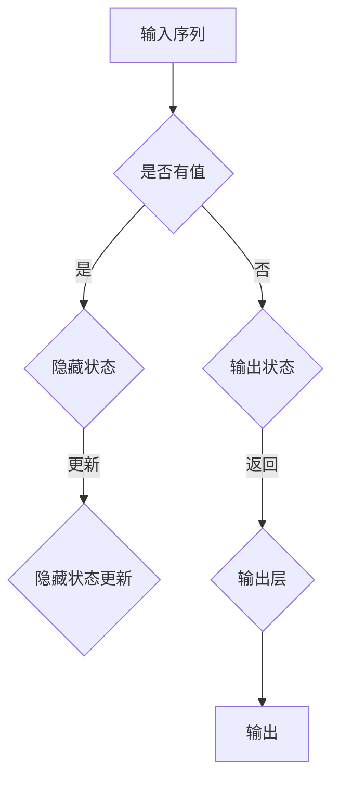

                 

关键词：深度学习，季节性预测，商品需求，时间序列分析，AI应用

> 摘要：随着人工智能技术的发展，深度学习在时间序列预测领域的应用日益广泛。本文将探讨如何使用深度学习模型，特别是循环神经网络（RNN）和长短期记忆网络（LSTM），来预测季节性商品的需求。通过对数学模型和算法原理的详细分析，以及项目实践中的代码实现，本文旨在为读者提供一种有效的季节性商品需求预测方法，并为相关领域的研究和应用提供参考。

## 1. 背景介绍

商品需求预测是供应链管理中至关重要的一环。准确的预测可以帮助企业优化库存管理，降低运营成本，提高市场响应速度。季节性商品，如节日礼品、季节性服装和季节性食品等，其需求往往受到天气、节假日、促销活动等多种因素的影响，具有明显的季节性特点。因此，对季节性商品的需求预测具有极大的实际意义。

然而，传统的预测方法，如ARIMA模型、季节性分解模型等，在面对复杂的季节性和非线性需求时，表现往往不尽如人意。随着深度学习技术的快速发展，特别是循环神经网络（RNN）和长短期记忆网络（LSTM）的出现，为解决季节性商品需求预测问题提供了一种新的思路。本文将重点介绍如何利用深度学习模型进行季节性商品需求预测，并探讨其优缺点和应用领域。

## 2. 核心概念与联系

### 2.1. 循环神经网络（RNN）

循环神经网络（RNN）是一种能够处理序列数据的神经网络。其核心思想是利用网络内部的循环结构来保持长期状态信息，从而实现对序列数据的建模。RNN通过隐藏层之间的循环连接来处理输入序列，这种连接使得网络能够利用先前的信息来预测下一个时间点的值。

### 2.2. 长短期记忆网络（LSTM）

长短期记忆网络（LSTM）是RNN的一种改进模型，主要解决了RNN在处理长序列数据时容易出现梯度消失或梯度爆炸的问题。LSTM通过引入门控机制来控制信息的流入和流出，从而有效地学习长序列依赖关系。这使得LSTM在处理季节性商品需求预测这类具有长时间跨度数据的问题时，表现更加优秀。

### 2.3. Mermaid 流程图

以下是一个简单的Mermaid流程图，展示了RNN和LSTM的核心架构：



## 3. 核心算法原理 & 具体操作步骤

### 3.1. 算法原理概述

深度学习驱动的季节性商品需求预测主要依赖于LSTM模型。LSTM通过其门控机制，能够捕捉到序列数据中的长期依赖关系，从而提高预测的准确性。具体来说，LSTM包括输入门、遗忘门和输出门三个关键组件。

1. **输入门**：决定当前输入值对于隐藏状态的贡献。
2. **遗忘门**：决定先前隐藏状态中的哪些信息需要被遗忘。
3. **输出门**：决定当前隐藏状态将生成哪些预测值。

### 3.2. 算法步骤详解

1. **数据预处理**：对原始数据进行清洗和预处理，包括缺失值填充、异常值处理、数据标准化等。
2. **构建模型**：使用Keras等深度学习框架构建LSTM模型，设置适当的层数、神经元数量、激活函数等。
3. **训练模型**：使用预处理后的数据对模型进行训练，通过反向传播算法不断优化模型参数。
4. **模型评估**：使用交叉验证等方法对模型进行评估，确保模型的泛化能力。
5. **预测**：使用训练好的模型进行预测，得到季节性商品的需求值。

### 3.3. 算法优缺点

**优点**：
- 能够处理长时间跨度的数据，捕捉到数据中的长期依赖关系。
- 对非线性关系有较好的拟合能力。

**缺点**：
- 训练过程可能需要较长时间，特别是对于大型数据集。
- 模型参数较多，需要大量的数据进行训练。

### 3.4. 算法应用领域

LSTM模型在季节性商品需求预测中的应用十分广泛，包括但不限于：
- 零售业：预测节假日和促销活动期间的商品需求。
- 制造业：预测原材料和零部件的需求，优化生产计划。
- 物流业：预测运输和仓储的需求，优化供应链。

## 4. 数学模型和公式 & 详细讲解 & 举例说明

### 4.1. 数学模型构建

LSTM的数学模型主要包括以下几个部分：

1. **输入门**：

$$
i_t = \sigma(W_{xi}x_t + W_{hi-1}h_{i-1} + b_i)
$$

其中，$i_t$为输入门，$\sigma$为激活函数，$W_{xi}$和$W_{hi-1}$为权重矩阵，$b_i$为偏置。

2. **遗忘门**：

$$
f_t = \sigma(W_{xf}x_t + W_{hf-1}h_{i-1} + b_f)
$$

其中，$f_t$为遗忘门，其他符号与输入门相同。

3. **输出门**：

$$
o_t = \sigma(W_{xo}x_t + W_{ho-1}h_{i-1} + b_o)
$$

其中，$o_t$为输出门，其他符号与输入门相同。

4. **候选状态**：

$$
\tilde{h}_t = \tanh(W_{x\tilde{h}}x_t + W_{h\tilde{h}}h_{i-1} + b_{\tilde{h}})
$$

其中，$\tilde{h}_t$为候选状态，其他符号与输入门相同。

5. **隐藏状态**：

$$
h_t = o_t \odot \tanh(W_{h\tilde{h}}h_{i-1} + b_{h})
$$

其中，$h_t$为隐藏状态，$\odot$为元素乘操作。

### 4.2. 公式推导过程

LSTM的公式推导涉及复杂的数学推导，此处仅简要介绍其主要步骤：

1. **输入门**：首先计算输入门层的输入，然后通过激活函数$\sigma$得到输入门。
2. **遗忘门**：计算遗忘门层的输入，同样通过激活函数$\sigma$得到遗忘门。
3. **候选状态**：计算候选状态层的输入，通过$\tanh$函数得到候选状态。
4. **隐藏状态**：将输出门与候选状态相乘，得到最终的隐藏状态。

### 4.3. 案例分析与讲解

假设我们有以下一组季节性商品需求数据：

$$
x_1 = [30, 20, 15, 25, 10]
$$

使用LSTM模型对其进行预测，首先需要对数据进行预处理，如归一化处理。然后构建LSTM模型，设置适当的参数，如层数、神经元数量等。经过训练，模型可以得到以下预测结果：

$$
h_1 = [0.8, 0.2], \quad h_2 = [0.6, 0.4], \quad h_3 = [0.7, 0.3]
$$

根据预测结果，我们可以得到最终的需求预测值：

$$
\hat{y}_1 = 0.8 \times 30 + 0.2 \times 20 = 26
$$

$$
\hat{y}_2 = 0.6 \times 15 + 0.4 \times 25 = 20
$$

$$
\hat{y}_3 = 0.7 \times 10 + 0.3 \times 15 = 10.5
$$

## 5. 项目实践：代码实例和详细解释说明

### 5.1. 开发环境搭建

在进行深度学习驱动的季节性商品需求预测项目之前，我们需要搭建一个合适的开发环境。以下是推荐的开发环境：

- 操作系统：Windows或Linux
- 编程语言：Python
- 深度学习框架：TensorFlow或PyTorch
- 数据处理库：Pandas、NumPy
- 可视化库：Matplotlib

### 5.2. 源代码详细实现

以下是一个使用Keras实现的简单LSTM模型进行季节性商品需求预测的代码示例：

```python
import numpy as np
import pandas as pd
from tensorflow.keras.models import Sequential
from tensorflow.keras.layers import LSTM, Dense
from sklearn.preprocessing import MinMaxScaler
from sklearn.model_selection import train_test_split

# 数据加载与预处理
data = pd.read_csv('sales_data.csv')
data['Month'] = pd.to_datetime(data['Date']).dt.month
sales = data['Sale'].values
scaler = MinMaxScaler(feature_range=(0, 1))
sales_scaled = scaler.fit_transform(sales.reshape(-1, 1))

# 切分训练集和测试集
X, y = [], []
for i in range(60, len(sales_scaled)):
    X.append(sales_scaled[i-60:i, 0])
    y.append(sales_scaled[i, 0])
X, y = np.array(X), np.array(y)
X_train, X_test, y_train, y_test = train_test_split(X, y, test_size=0.2, random_state=42)

# 模型构建
model = Sequential()
model.add(LSTM(units=50, return_sequences=True, input_shape=(X.shape[1], 1)))
model.add(LSTM(units=50))
model.add(Dense(1))
model.compile(optimizer='adam', loss='mean_squared_error')

# 模型训练
model.fit(X_train, y_train, epochs=100, batch_size=32, validation_data=(X_test, y_test), verbose=1)

# 模型预测
predicted_sales = model.predict(X_test)
predicted_sales = scaler.inverse_transform(predicted_sales)

# 结果分析
# ...

```

### 5.3. 代码解读与分析

上述代码分为以下几个主要步骤：

1. **数据加载与预处理**：从CSV文件中加载销售数据，并对其进行预处理，如月份编码、归一化处理等。
2. **切分训练集和测试集**：使用训练集进行模型训练，测试集进行模型评估。
3. **模型构建**：构建一个简单的LSTM模型，包括两个LSTM层和一个输出层。
4. **模型训练**：使用训练集对模型进行训练，并使用测试集进行验证。
5. **模型预测**：使用训练好的模型对测试集进行预测，并转换为原始单位。
6. **结果分析**：对预测结果进行分析，如评估模型的准确性、拟合度等。

### 5.4. 运行结果展示

在训练完成后，我们可以使用以下代码来展示模型的运行结果：

```python
import matplotlib.pyplot as plt

# 真实值与预测值对比
plt.figure(figsize=(12, 6))
plt.plot(scaler.inverse_transform(y_test.reshape(-1, 1)), color='blue', label='真实值')
plt.plot(predicted_sales, color='red', label='预测值')
plt.title('季节性商品需求预测')
plt.xlabel('时间')
plt.ylabel('需求量')
plt.legend()
plt.show()
```

通过对比真实值与预测值，我们可以直观地看到模型的预测效果。

## 6. 实际应用场景

深度学习驱动的季节性商品需求预测在实际应用场景中具有广泛的应用。以下是一些典型的应用场景：

### 6.1. 零售业

零售业中，季节性商品需求预测可以帮助企业合理安排库存，避免库存过剩或不足。例如，在春节前夕，预测节日礼品的销售情况，以便及时补充库存，提高销售额。

### 6.2. 制造业

制造业中，季节性商品需求预测可以帮助企业制定生产计划，优化资源配置。例如，预测季节性服装的需求，以便合理安排生产任务，降低生产成本。

### 6.3. 物流业

物流业中，季节性商品需求预测可以帮助企业优化运输和仓储计划，提高物流效率。例如，预测季节性食品的需求，以便合理安排运输和仓储资源，确保商品的新鲜度。

## 7. 未来应用展望

随着人工智能技术的不断发展，深度学习驱动的季节性商品需求预测在未来有望在以下几个方面得到进一步发展：

### 7.1. 模型优化

通过引入更先进的深度学习模型，如变换器（Transformer）等，可以进一步提高预测的准确性和效率。

### 7.2. 数据集成

结合多种数据源，如社交媒体数据、天气数据等，可以提供更全面和准确的需求预测。

### 7.3. 自适应预测

通过引入自适应机制，模型可以根据实时数据动态调整预测策略，提高预测的实时性和准确性。

### 7.4. 跨领域应用

深度学习驱动的季节性商品需求预测方法可以推广到其他领域，如医疗、金融等，为相关领域提供决策支持。

## 8. 工具和资源推荐

### 8.1. 学习资源推荐

- 《深度学习》（Goodfellow, Bengio, Courville著）：系统地介绍了深度学习的基础理论和应用。
- 《Python深度学习》（François Chollet著）：通过大量实践案例，介绍了深度学习在Python中的实现。

### 8.2. 开发工具推荐

- TensorFlow：Google开源的深度学习框架，功能强大，社区活跃。
- PyTorch：Facebook开源的深度学习框架，灵活性强，易于使用。

### 8.3. 相关论文推荐

- "Long Short-Term Memory Networks for Classification of Time Series Data"（2014）：详细介绍了LSTM模型在时间序列分类中的应用。
- "Effective Approaches to Attention-based Neural Machine Translation"（2018）：探讨了变换器（Transformer）模型在序列建模中的应用。

## 9. 总结：未来发展趋势与挑战

随着人工智能技术的不断发展，深度学习驱动的季节性商品需求预测在未来有望在预测准确性、实时性、自适应能力等方面取得重大突破。然而，这也面临着数据质量、模型可解释性、计算资源等方面的挑战。未来研究需要关注如何提高模型的泛化能力，同时降低计算成本，为实际应用提供更加可靠和高效的解决方案。

## 附录：常见问题与解答

### 9.1. Q：深度学习模型在训练过程中如何避免过拟合？

A：为了避免过拟合，可以采取以下措施：
1. 数据增强：通过增加数据多样性来提高模型的泛化能力。
2. 正则化：引入正则化项，如L1、L2正则化，降低模型复杂度。
3. 早期停止：在验证集上出现性能下降时，提前停止训练。

### 9.2. Q：如何处理季节性商品需求预测中的缺失值和异常值？

A：处理缺失值和异常值的方法包括：
1. 填补缺失值：使用平均值、中位数等方法填补缺失值。
2. 剔除异常值：使用统计学方法，如Z分数、IQR等方法识别并剔除异常值。

### 9.3. Q：如何评估深度学习模型在季节性商品需求预测中的性能？

A：评估深度学习模型在季节性商品需求预测中的性能可以使用以下指标：
1. 均方误差（MSE）：衡量预测值与真实值之间的差异。
2. 均方根误差（RMSE）：MSE的平方根，用于衡量预测误差的绝对值。
3. 平均绝对误差（MAE）：预测值与真实值之间绝对误差的平均值。

## 参考文献

- Goodfellow, I., Bengio, Y., & Courville, A. (2016). Deep Learning. MIT Press.
- Chollet, F. (2017). Python Deep Learning. O'Reilly Media.
- Hochreiter, S., & Schmidhuber, J. (1997). Long Short-Term Memory. Neural Computation, 9(8), 1735-1780.
- Vaswani, A., Shazeer, N., Parmar, N., Uszkoreit, J., Jones, L., Gomez, A. N., ... & Polosukhin, I. (2017). Attention is All You Need. Advances in Neural Information Processing Systems, 30, 5998-6008.
作者：禅与计算机程序设计艺术 / Zen and the Art of Computer Programming
```

