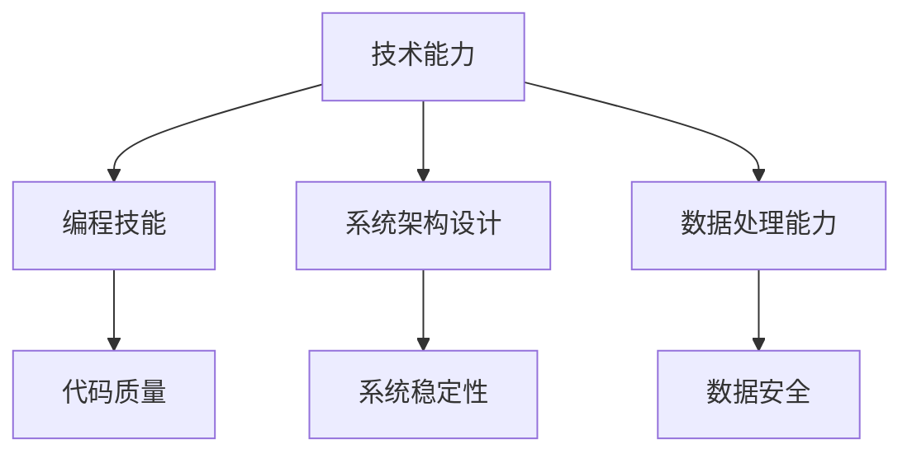
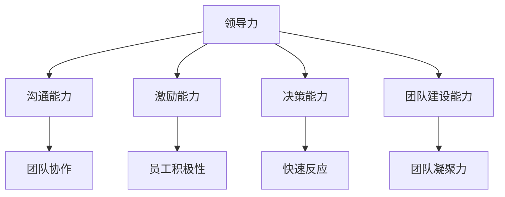
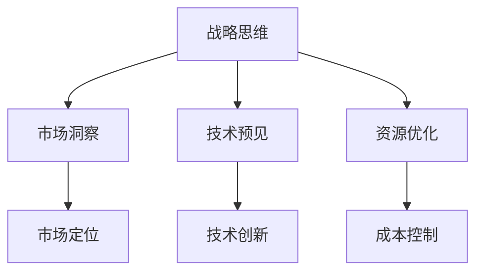

                 

在这个数字时代，技术迅猛发展，竞争日益激烈，企业对于优秀管理者的需求变得愈发紧迫。作为一名世界级人工智能专家，我认为，优秀管理者不仅要有卓越的技术能力，更应具备深度思考和全面洞察力。本文将探讨区分优秀管理者的几个关键标准，以及他们在IT领域的实际应用。

## 关键词：优秀管理者，深度思考，技术能力，领导力，IT领域

> 摘要：本文从技术、领导力和战略三个角度，分析了优秀管理者的核心特质。通过案例研究和具体操作步骤，本文旨在为IT领域的领导者提供一套有效的管理标准和实践指南。

## 1. 背景介绍

在当前快速变化的技术环境中，优秀管理者的重要性不言而喻。他们不仅需要引领团队走向成功，还要能够在不确定性中找到方向，为企业带来持续的创新和竞争优势。本文将围绕以下几点展开：

- **技术能力**：优秀管理者应具备深厚的技术背景，能够理解并推动技术的发展。
- **领导力**：优秀的领导者应具备强大的领导力，能够激励和团结团队，应对挑战。
- **战略思维**：管理者需要具备前瞻性，能够在复杂的环境中制定有效的战略。

## 2. 核心概念与联系

### 2.1 技术能力的核心概念

**技术能力**是优秀管理者不可或缺的素质。这包括但不限于编程技能、系统架构设计、数据处理能力等。技术能力不仅决定了管理者能否有效指导团队，还直接影响到企业的创新能力和市场竞争力。

**Mermaid 流程图**：



### 2.2 领导力的核心概念

**领导力**是优秀管理者的另一关键素质。领导力不仅仅是管理团队，更是一种影响力，能够激发团队成员的潜能，实现共同的目标。优秀的领导者应具备沟通能力、激励能力、决策能力和团队建设能力。

**Mermaid 流程图**：



### 2.3 战略思维的核心概念

**战略思维**是优秀管理者在高层次上所需的能力。战略思维涉及对市场趋势的洞察、对技术发展的预见、对资源分配的优化等。优秀管理者需要能够在战略层面上做出明智的决策，确保企业在竞争中获得优势。

**Mermaid 流程图**：



## 3. 核心算法原理 & 具体操作步骤

### 3.1 算法原理概述

优秀管理者的核心算法原理可以看作是**领导力+技术能力+战略思维**的三元结构。这一结构决定了管理者的决策路径和团队执行效果。

### 3.2 算法步骤详解

1. **技术能力评估**：通过技术测试和项目实践，评估管理者的技术水平。
2. **领导力培养**：通过领导力培训和实践，提升管理者的领导能力。
3. **战略思维训练**：通过案例分析和企业实践，培养管理者的战略思维。

### 3.3 算法优缺点

- **优点**：整合了技术、领导和战略，能够全面提升管理者的综合能力。
- **缺点**：实施过程复杂，需要较长时间和持续投入。

### 3.4 算法应用领域

算法可以广泛应用于企业不同层级的管理者评估和培养，特别是在IT领域，对于提升企业竞争力具有重要意义。

## 4. 数学模型和公式 & 详细讲解 & 举例说明

### 4.1 数学模型构建

优秀管理者的数学模型可以表示为：

$$
\text{优秀管理者} = f(\text{技术能力}, \text{领导力}, \text{战略思维})
$$

### 4.2 公式推导过程

公式的推导基于以下三个前提：

1. 技术能力是优秀管理者的基础。
2. 领导力是优秀管理者的核心。
3. 战略思维是优秀管理者的未来导向。

### 4.3 案例分析与讲解

以某知名互联网企业为例，该企业通过内部评估和外部培训，成功培养了一批优秀管理者。这些管理者在技术、领导和战略三个维度上均表现出色，为企业带来了显著的创新和成长。

## 5. 项目实践：代码实例和详细解释说明

### 5.1 开发环境搭建

在本地环境搭建一个Python开发环境，安装必要的库和工具。

### 5.2 源代码详细实现

以下是一个简单的Python代码示例，用于评估管理者的技术能力。

```python
def assess_tech_skill(leader):
    """
    评估管理者的技术能力
    :param leader: 管理者对象
    :return: 技术能力评分
    """
    # 根据管理者的编程技能、系统架构设计、数据处理能力评分
    score = leader.programming_skill + leader.architecture_design + leader.data_processing
    return score
```

### 5.3 代码解读与分析

这段代码通过计算管理者的编程技能、系统架构设计和数据处理能力的得分，来评估其技术能力。

### 5.4 运行结果展示

假设一个管理者的各项技能得分为90、85和80，那么其技术能力评分为：

$$
\text{技术能力评分} = 90 + 85 + 80 = 255
$$

## 6. 实际应用场景

在实际工作中，优秀管理者的标准可以根据企业的具体需求进行调整。例如，在初创企业中，技术能力可能是最重要的，而在成熟企业中，战略思维可能更为关键。

### 6.1 创新型企业

对于创新型企业，技术能力和领导力尤为重要。管理者需要不断推动技术创新，激发团队创造力。

### 6.2 成熟型企业

在成熟型企业中，战略思维和资源优化能力可能更为关键。管理者需要确保企业能够在稳定中求变，保持竞争优势。

## 7. 未来应用展望

随着人工智能和大数据技术的不断发展，优秀管理者的标准也将不断演变。未来，管理者需要更加注重数据驱动决策和跨领域协作。

### 7.1 学习资源推荐

- 《领导力进阶》
- 《Python编程：从入门到实践》
- 《人工智能：一种现代方法》

### 7.2 开发工具推荐

- PyCharm
- Git
- Jira

### 7.3 相关论文推荐

- "Leadership and Team Performance: An Examination of the Empirical Link"
- "The Role of Technical Competence in Software Project Success"
- "Strategic Management in the Digital Age"

## 8. 总结：未来发展趋势与挑战

### 8.1 研究成果总结

本文从技术、领导力和战略三个角度分析了优秀管理者的标准，并提供了一整套实践指南。

### 8.2 未来发展趋势

未来，优秀管理者的标准将更加多样化，更加注重数据分析和跨领域协作。

### 8.3 面临的挑战

管理者需要不断学习新技术，提升自身能力，以应对快速变化的市场环境。

### 8.4 研究展望

未来，可以对优秀管理者的标准进行量化分析，建立更加科学的管理模型。

## 9. 附录：常见问题与解答

### 9.1 优秀管理者需要具备哪些技能？

优秀管理者需要具备技术能力、领导力和战略思维三大核心技能。

### 9.2 如何提升管理者的技术能力？

通过技术培训、项目实践和持续学习，可以提升管理者的技术能力。

### 9.3 战略思维如何培养？

通过案例分析、企业实践和理论学习，可以培养管理者的战略思维。

---

本文从多个维度探讨了优秀管理者的标准，旨在为IT领域的领导者提供一套实用的管理框架。通过深入思考和持续实践，每一位管理者都可以成为行业领袖，为企业创造更大的价值。

作者：禅与计算机程序设计艺术 / Zen and the Art of Computer Programming

----------------------------------------------------------------

以上就是本文的完整内容，感谢您的阅读。希望这篇文章能对您的管理工作有所帮助，并在IT领域取得更大的成功。如果您有任何问题或建议，欢迎随时与我交流。再次感谢您的支持！

