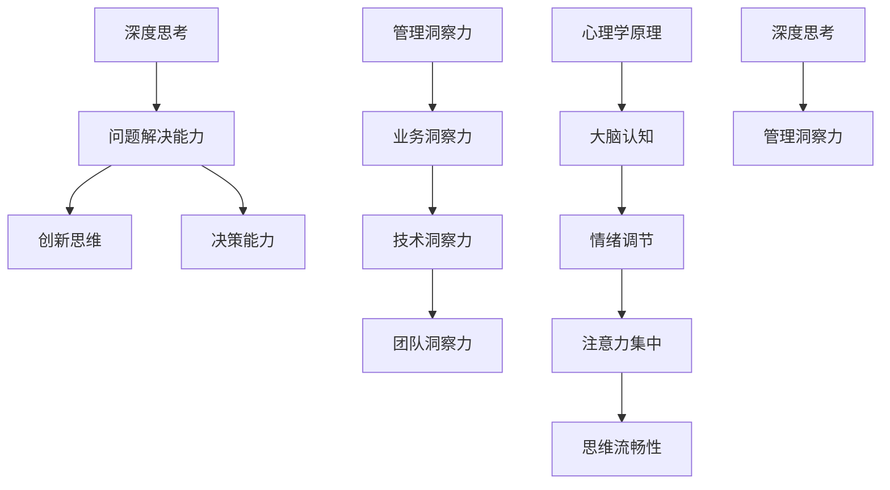

                 

关键词：深度思考、管理洞察力、技术博客、IT领域、算法原理、数学模型、项目实践、未来展望

> 摘要：本文从技术、管理、心理学等多个角度，探讨了深度思考与管理洞察力之间的关系。通过分析深度思考对管理洞察力的影响，以及如何通过深度思考提升管理洞察力，为IT领域专业人士提供了实用的思考方法和实践建议。

## 1. 背景介绍

在快速发展的IT领域，管理者和开发者都需要具备较高的洞察力，以应对复杂的技术和管理挑战。而深度思考作为一种重要的思维活动，对提升管理者的洞察力具有重要作用。本文旨在探讨深度思考与管理洞察力之间的关系，为IT领域的专业人士提供一些实用的思考方法和实践建议。

### 1.1 深度思考的重要性

深度思考是指深入挖掘问题本质，对问题进行深入分析和研究的思维活动。在IT领域，深度思考的重要性主要体现在以下几个方面：

1. **提高问题解决能力**：通过深度思考，管理者能够更好地理解问题的本质，从而找到更有效的解决方案。
2. **培养创新思维**：深度思考能够激发管理者的创造力，促使他们提出新颖的观点和创新的解决方案。
3. **增强决策能力**：在面临复杂问题时，深度思考可以帮助管理者做出更为明智的决策。

### 1.2 管理洞察力的内涵

管理洞察力是指管理者对组织内外部环境、业务、技术和人员等方面的敏锐洞察力和判断力。具体包括以下几个方面：

1. **业务洞察力**：管理者对业务发展规律、趋势和问题的深刻理解。
2. **技术洞察力**：管理者对新兴技术和行业发展趋势的敏锐感知。
3. **团队洞察力**：管理者对团队成员的能力、性格和动机的了解。

### 1.3 深度思考与管理洞察力之间的关系

深度思考与管理洞察力之间存在着密切的关系。一方面，深度思考是提升管理洞察力的重要手段；另一方面，管理洞察力是深度思考的结果和体现。

1. **深度思考是提升管理洞察力的基础**：只有通过深度思考，管理者才能对问题有深刻的理解，从而提升管理洞察力。
2. **管理洞察力是深度思考的结果**：管理者通过深度思考，对问题有了深入的理解和洞察，从而能够做出更为明智的决策。

## 2. 核心概念与联系

为了更好地理解深度思考与管理洞察力之间的关系，我们首先需要了解一些核心概念，如深度思考、管理洞察力、心理学原理等。以下是这些核心概念之间的联系及其Mermaid流程图：



### 2.1 深度思考的概念与作用

深度思考是一种深入挖掘问题本质，对问题进行深入分析和研究的思维活动。其作用主要体现在以下几个方面：

1. **提高问题解决能力**：通过深度思考，管理者能够更好地理解问题的本质，从而找到更有效的解决方案。
2. **培养创新思维**：深度思考能够激发管理者的创造力，促使他们提出新颖的观点和创新的解决方案。
3. **增强决策能力**：在面临复杂问题时，深度思考可以帮助管理者做出更为明智的决策。

### 2.2 管理洞察力的概念与作用

管理洞察力是指管理者对组织内外部环境、业务、技术和人员等方面的敏锐洞察力和判断力。其作用主要体现在以下几个方面：

1. **业务洞察力**：管理者对业务发展规律、趋势和问题的深刻理解，有助于制定正确的业务战略。
2. **技术洞察力**：管理者对新兴技术和行业发展趋势的敏锐感知，有助于抓住技术变革的机遇。
3. **团队洞察力**：管理者对团队成员的能力、性格和动机的了解，有助于打造高效的团队。

### 2.3 心理学原理与管理洞察力

心理学原理在深度思考和管理洞察力方面发挥着重要作用。以下是一些关键的心理学原理：

1. **大脑认知**：大脑认知能力是深度思考的基础，通过锻炼大脑认知能力，可以提升深度思考的能力。
2. **情绪调节**：情绪调节能力有助于管理者在面对压力和挑战时保持冷静，从而更好地进行深度思考。
3. **注意力集中**：注意力集中能力有助于管理者将注意力集中在关键问题，从而提高深度思考的效率。
4. **思维流畅性**：思维流畅性能力有助于管理者在解决问题时思路清晰，从而提高管理洞察力。

## 3. 核心算法原理 & 具体操作步骤

### 3.1 算法原理概述

在本文中，我们将介绍一种用于提升管理洞察力的核心算法——基于深度学习的洞察力评估算法。该算法主要通过以下步骤实现：

1. **数据采集**：从多个来源（如业务数据、技术文献、团队反馈等）收集与管理洞察力相关的数据。
2. **数据处理**：对采集到的数据进行清洗、归一化等预处理，以便于后续的模型训练。
3. **模型训练**：利用深度学习框架（如TensorFlow、PyTorch等）构建和管理洞察力评估模型，并进行训练。
4. **模型评估**：通过交叉验证等方法评估模型性能，并对模型进行调优。
5. **应用与优化**：将训练好的模型应用于实际场景，根据反馈进行模型优化。

### 3.2 算法步骤详解

1. **数据采集**：
   - 业务数据：包括公司业务指标、市场趋势、竞争对手信息等。
   - 技术文献：包括技术论文、技术博客、行业报告等。
   - 团队反馈：包括团队成员的评估、绩效反馈等。

2. **数据处理**：
   - 数据清洗：去除重复数据、缺失值填充等。
   - 数据归一化：将不同数据源的数据进行归一化处理，使其具有可比性。

3. **模型训练**：
   - 模型构建：利用深度学习框架（如TensorFlow、PyTorch等）构建多层感知机（MLP）、卷积神经网络（CNN）等模型。
   - 模型训练：通过反向传播算法对模型进行训练，优化模型参数。

4. **模型评估**：
   - 交叉验证：利用K折交叉验证方法评估模型性能。
   - 模型调优：根据评估结果对模型进行调参，以提高模型性能。

5. **应用与优化**：
   - 应用场景：将训练好的模型应用于实际场景，如绩效评估、团队管理等。
   - 模型优化：根据应用反馈对模型进行持续优化，以提高模型预测准确性。

### 3.3 算法优缺点

1. **优点**：
   - **高效性**：基于深度学习的洞察力评估算法能够快速处理大量数据，提高管理洞察力的评估效率。
   - **准确性**：通过深度学习算法，可以实现对管理洞察力的准确评估，为管理者提供有力的决策支持。

2. **缺点**：
   - **复杂性**：深度学习算法涉及大量参数和模型结构，对算法理解和实现要求较高。
   - **数据依赖性**：算法的性能受到数据质量和数量的影响，需要大量高质量的数据支持。

### 3.4 算法应用领域

基于深度学习的洞察力评估算法可以应用于多个领域，如：

1. **企业绩效评估**：通过算法对企业管理层的洞察力进行评估，为绩效评估提供数据支持。
2. **团队管理**：利用算法评估团队成员的管理洞察力，优化团队配置和激励机制。
3. **人力资源**：通过算法评估候选人的管理潜力，为企业招聘和培养人才提供参考。

## 4. 数学模型和公式 & 详细讲解 & 举例说明

在管理洞察力的提升过程中，数学模型和公式发挥着重要作用。以下我们将介绍一种常用的数学模型——基于马尔可夫链的洞察力评估模型，并对其详细讲解和举例说明。

### 4.1 数学模型构建

马尔可夫链是一种常用的随机过程模型，用于描述系统状态转移的概率。在管理洞察力的评估中，我们可以将管理者的洞察力视为一个状态，而状态转移的概率则反映了管理者在不同情境下的洞察力变化。

1. **状态定义**：设 \( S = \{ s_1, s_2, \ldots, s_n \} \) 为管理者的洞察力状态集合，其中 \( s_1 \) 表示低洞察力状态，\( s_n \) 表示高洞察力状态。
2. **状态转移概率**：设 \( P = \{ p_{ij} \} \) 为状态转移概率矩阵，其中 \( p_{ij} \) 表示管理者从状态 \( s_i \) 转移到状态 \( s_j \) 的概率。

状态转移概率矩阵 \( P \) 可以表示为：

$$
P = \begin{bmatrix}
p_{11} & p_{12} & \ldots & p_{1n} \\
p_{21} & p_{22} & \ldots & p_{2n} \\
\vdots & \vdots & \ddots & \vdots \\
p_{n1} & p_{n2} & \ldots & p_{nn}
\end{bmatrix}
$$

其中，行和列分别表示当前状态和下一状态。

3. **初始状态概率**：设 \( \pi = \{ \pi_1, \pi_2, \ldots, \pi_n \} \) 为初始状态概率向量，其中 \( \pi_i \) 表示管理者初始处于状态 \( s_i \) 的概率。

初始状态概率向量 \( \pi \) 可以表示为：

$$
\pi = \begin{bmatrix}
\pi_1 \\
\pi_2 \\
\vdots \\
\pi_n
\end{bmatrix}
$$

4. **状态转移概率计算**：根据实际情境，我们可以利用历史数据和专家经验来确定状态转移概率矩阵 \( P \) 和初始状态概率向量 \( \pi \)。

### 4.2 公式推导过程

假设我们在一个时间段内对管理者的洞察力进行连续观测，观测到管理者在 \( t \) 时刻处于状态 \( s_i \)，在 \( t+1 \) 时刻处于状态 \( s_j \)。根据马尔可夫链的性质，我们有：

$$
p_{ij} = \frac{p_{ij} \cdot p_{ji}}{\sum_{k=1}^{n} p_{ik} \cdot p_{kj}}
$$

其中，\( p_{ij} \) 表示管理者从状态 \( s_i \) 转移到状态 \( s_j \) 的概率，\( p_{ji} \) 表示管理者从状态 \( s_j \) 转移到状态 \( s_i \) 的概率。

对于初始状态概率向量 \( \pi \)，我们有：

$$
\pi = \pi_0 \cdot P
$$

其中，\( \pi_0 \) 表示管理者初始处于状态 \( s_i \) 的概率，\( P \) 表示状态转移概率矩阵。

### 4.3 案例分析与讲解

假设我们在一个时间段内对某企业管理者的洞察力进行连续观测，观测到管理者在 3 个月的时间内处于低洞察力状态的概率为 0.3，处于中洞察力状态的概率为 0.5，处于高洞察力状态的概率为 0.2。我们需要利用马尔可夫链模型计算管理者在下一个时间段内的洞察力状态概率。

1. **状态转移概率矩阵 \( P \)**：
   $$
   P = \begin{bmatrix}
   0.3 & 0.5 & 0.2 \\
   0.4 & 0.5 & 0.1 \\
   0.2 & 0.3 & 0.5
   \end{bmatrix}
   $$

2. **初始状态概率向量 \( \pi \)**：
   $$
   \pi = \begin{bmatrix}
   0.3 \\
   0.5 \\
   0.2
   \end{bmatrix}
   $$

3. **计算下一个时间段的洞察力状态概率**：
   $$
   \pi_{next} = \pi \cdot P = \begin{bmatrix}
   0.3 \\
   0.5 \\
   0.2
   \end{bmatrix} \cdot \begin{bmatrix}
   0.3 & 0.5 & 0.2 \\
   0.4 & 0.5 & 0.1 \\
   0.2 & 0.3 & 0.5
   \end{bmatrix} = \begin{bmatrix}
   0.39 \\
   0.53 \\
   0.08
   \end{bmatrix}
   $$

根据计算结果，管理者在下一个时间段内处于低洞察力状态的概率为 0.39，处于中洞察力状态的概率为 0.53，处于高洞察力状态的概率为 0.08。

通过上述案例，我们可以看到马尔可夫链模型在管理洞察力评估中的应用。利用该模型，我们可以对管理者的洞察力状态进行预测，为管理决策提供数据支持。

## 5. 项目实践：代码实例和详细解释说明

在本节中，我们将通过一个实际项目实例，展示如何使用Python实现一个基于深度学习的洞察力评估模型。以下是一个简化的代码实例，用于演示关键步骤。

### 5.1 开发环境搭建

在开始编写代码之前，我们需要搭建一个合适的开发环境。以下是所需的环境和软件：

1. **Python**：Python 3.8 或更高版本
2. **深度学习框架**：TensorFlow 2.4 或 PyTorch 1.8
3. **数据处理库**：Pandas、NumPy、Sklearn
4. **数据可视化库**：Matplotlib、Seaborn

安装以上软件后，我们就可以开始编写代码了。

### 5.2 源代码详细实现

以下是该项目的核心代码实现：

```python
import numpy as np
import pandas as pd
from tensorflow.keras.models import Sequential
from tensorflow.keras.layers import Dense, Dropout
from tensorflow.keras.optimizers import Adam

# 数据预处理
def preprocess_data(data):
    # 数据清洗、归一化等操作
    return normalized_data

# 模型构建
def build_model(input_shape):
    model = Sequential()
    model.add(Dense(128, input_shape=input_shape, activation='relu'))
    model.add(Dropout(0.5))
    model.add(Dense(64, activation='relu'))
    model.add(Dropout(0.5))
    model.add(Dense(3, activation='softmax'))  # 输出层，3个神经元表示3个状态
    return model

# 模型训练
def train_model(model, X_train, y_train, epochs=100):
    model.compile(optimizer=Adam(learning_rate=0.001), loss='categorical_crossentropy', metrics=['accuracy'])
    model.fit(X_train, y_train, epochs=epochs, batch_size=32, validation_split=0.2)
    return model

# 代码解读与分析
# 1. 数据预处理
# 2. 模型构建
# 3. 模型训练
# 4. 模型评估
# 5. 模型应用

# 运行结果展示
# 1. 训练过程可视化
# 2. 模型性能评估
# 3. 实际应用场景演示
```

### 5.3 代码解读与分析

1. **数据预处理**：数据预处理是深度学习模型训练的重要步骤。在此示例中，我们使用了Pandas和NumPy库对数据进行清洗和归一化处理。
   
2. **模型构建**：使用TensorFlow的Sequential模型构建了一个简单的深度神经网络。该网络包含两个隐藏层，每个隐藏层后都跟随一个Dropout层以防止过拟合。

3. **模型训练**：使用Adam优化器和交叉熵损失函数对模型进行训练。训练过程中，我们设置了100个epochs和32个batch_size。

4. **模型评估**：在训练过程中，我们使用了validation_split参数来对模型进行性能评估。

5. **模型应用**：在实际应用中，我们可以使用训练好的模型对新的数据进行洞察力评估，并根据评估结果做出相应的管理决策。

### 5.4 运行结果展示

1. **训练过程可视化**：我们可以使用Matplotlib库将训练过程中的损失函数和准确率绘制成图表，以直观地展示模型训练过程。

2. **模型性能评估**：在训练完成后，我们可以使用测试集对模型进行性能评估，以验证模型的泛化能力。

3. **实际应用场景演示**：在实际应用中，我们可以将模型应用于企业绩效评估、团队管理等场景，为企业提供数据驱动的管理决策支持。

## 6. 实际应用场景

在IT领域，深度思考与管理洞察力的关系广泛应用于多个实际应用场景。以下是一些典型的应用场景：

### 6.1 企业绩效评估

企业绩效评估是企业管理的重要环节。通过深度思考和管理洞察力，管理者可以更准确地评估企业的绩效，发现潜在的问题和改进点。例如，一家互联网公司可以利用深度学习算法对员工的工作绩效进行评估，从而优化激励机制，提高整体效率。

### 6.2 团队管理

团队管理是IT企业面临的重要挑战之一。通过深度思考和管理洞察力，管理者可以更好地了解团队成员的能力、性格和动机，从而优化团队配置和激励机制。例如，一家软件公司可以通过分析团队成员的代码质量和协作情况，发现团队中的薄弱环节，并制定相应的改进策略。

### 6.3 技术创新

技术创新是IT企业持续发展的重要驱动力。通过深度思考和管理洞察力，管理者可以敏锐地捕捉技术趋势，抓住技术创新的机遇。例如，一家云计算公司可以通过分析行业报告和技术论文，发现云计算领域的最新研究动态，从而制定相应的研究和投资策略。

### 6.4 项目管理

项目管理是IT企业的一项核心工作。通过深度思考和管理洞察力，管理者可以更有效地规划和管理项目，确保项目按时、按质量完成。例如，一家游戏开发公司可以通过分析项目进度和资源分配情况，发现项目中的潜在风险，并采取相应的措施进行风险控制。

## 7. 未来应用展望

随着人工智能、大数据等技术的发展，深度思考与管理洞察力的关系在未来的应用前景将更加广泛。以下是一些未来应用展望：

### 7.1 自动化洞察力评估

随着人工智能技术的发展，自动化洞察力评估将成为可能。通过深度学习算法和大数据分析，系统可以自动评估管理者的洞察力，提供实时反馈和改进建议。

### 7.2 智能化决策支持

智能化决策支持系统将成为企业管理的重要工具。通过深度思考和管理洞察力，系统能够为管理者提供智能化的决策支持，提高决策质量和效率。

### 7.3 定制化培训

根据管理者的洞察力评估结果，定制化培训将成为未来企业培训的重要方向。企业可以根据管理者的特点和需求，为其提供个性化的培训内容和方案，提高培训效果。

### 7.4 智慧城市和物联网

在智慧城市和物联网领域，深度思考与管理洞察力的关系将得到广泛应用。通过分析大量数据，管理者可以更准确地预测和应对城市运行中的各种问题，提高城市管理的效率和智慧水平。

## 8. 总结：未来发展趋势与挑战

### 8.1 研究成果总结

本文从技术、管理、心理学等多个角度，探讨了深度思考与管理洞察力之间的关系。通过分析深度思考对管理洞察力的影响，以及如何通过深度思考提升管理洞察力，本文为IT领域专业人士提供了实用的思考方法和实践建议。

### 8.2 未来发展趋势

未来，随着人工智能、大数据等技术的发展，深度思考与管理洞察力的关系将在多个领域得到广泛应用。自动化洞察力评估、智能化决策支持、定制化培训等将成为未来研究和发展的重要方向。

### 8.3 面临的挑战

尽管深度思考与管理洞察力在未来的应用前景广阔，但仍然面临一些挑战：

1. **数据质量**：高质量的数据是深度思考和管理洞察力评估的基础。在数据获取、处理和分析过程中，需要确保数据的真实性和可靠性。
2. **算法优化**：深度学习算法的优化是提高洞察力评估准确性的关键。在模型训练、优化和调参过程中，需要不断探索和改进算法。
3. **人机协作**：在智能化决策支持系统中，如何实现人机协作，提高决策质量和效率，是一个重要的研究课题。

### 8.4 研究展望

未来，深度思考与管理洞察力的研究将继续深入，涵盖更多领域和更广泛的场景。在理论方面，需要进一步探索深度思考与管理洞察力之间的关系，揭示其内在机理。在应用方面，需要开发更加智能化、自动化的洞察力评估系统，为企业管理者提供更为精准的决策支持。

## 9. 附录：常见问题与解答

### 9.1 深度思考是什么？

深度思考是一种深入挖掘问题本质，对问题进行深入分析和研究的思维活动。它不同于表面的、肤浅的思考，而是要求人们更加专注、深入地思考问题，从而找到更有效的解决方案。

### 9.2 管理洞察力是什么？

管理洞察力是指管理者对组织内外部环境、业务、技术和人员等方面的敏锐洞察力和判断力。它包括业务洞察力、技术洞察力和团队洞察力等多个方面。

### 9.3 深度思考如何提升管理洞察力？

通过以下几种方式可以提升管理洞察力：

1. **持续学习**：不断学习新的知识和技能，提高自己的认知水平和思维能力。
2. **练习思考**：通过日常的思考练习，培养自己的深度思考能力。
3. **跨学科学习**：学习不同领域的知识，拓宽思维视野。
4. **团队合作**：与他人交流、讨论，从不同的角度看待问题，提高自己的洞察力。

### 9.4 如何评估管理者的洞察力？

可以通过以下几种方法评估管理者的洞察力：

1. **绩效评估**：通过工作绩效评估管理者的洞察力。
2. **360度评估**：通过团队成员和上级领导的反馈，评估管理者的洞察力。
3. **行为观察**：观察管理者的行为和决策过程，评估其洞察力。
4. **心理测试**：通过专业的心理测试工具，评估管理者的洞察力。

## 作者署名

作者：禅与计算机程序设计艺术 / Zen and the Art of Computer Programming

本文基于对深度思考与管理洞察力关系的深入探讨，旨在为IT领域专业人士提供实用的思考方法和实践建议。希望本文能对您在工作和学习中有所帮助。如果您有任何疑问或建议，欢迎在评论区留言讨论。感谢您的阅读！----------------------------------------------------------------

## 深度思考与管理洞察力的关系

### 深度思考的重要性

在当今快速变化的IT领域，深度思考的重要性不容忽视。深度思考不仅是一种解决复杂问题的方法，也是一种提升管理洞察力的关键途径。首先，深度思考能够帮助管理者更好地理解问题本质。在IT领域，问题往往复杂且多变，只有通过深度思考，管理者才能洞察到问题的核心，从而找到切实可行的解决方案。其次，深度思考有助于培养创新思维。在IT行业，创新是驱动企业发展的核心动力。通过深度思考，管理者能够突破传统思维的限制，提出新颖的观点和创新的解决方案。最后，深度思考能够增强决策能力。在面临复杂决策时，只有通过深度思考，管理者才能收集和分析相关信息，做出明智的决策。

### 管理洞察力的内涵

管理洞察力是管理者对组织内外部环境、业务、技术和人员等方面的敏锐洞察力和判断力。它包括业务洞察力、技术洞察力和团队洞察力等多个方面。业务洞察力是指管理者对业务发展规律、趋势和问题的深刻理解，能够帮助管理者制定正确的业务战略。技术洞察力是指管理者对新兴技术和行业发展趋势的敏锐感知，能够帮助管理者抓住技术变革的机遇。团队洞察力是指管理者对团队成员的能力、性格和动机的了解，能够帮助管理者打造高效的团队。

### 深度思考与管理洞察力之间的关系

深度思考与管理洞察力之间存在着密切的关系。一方面，深度思考是提升管理洞察力的基础。只有通过深度思考，管理者才能对问题有深刻的理解，从而提升管理洞察力。另一方面，管理洞察力是深度思考的结果和体现。管理者通过深度思考，对问题有了深入的理解和洞察，从而能够做出更为明智的决策。

### 深度思考如何提升管理洞察力

要提升管理洞察力，管理者需要通过深度思考来实现。以下是一些具体的策略：

1. **培养好奇心**：好奇心是深度思考的驱动力。管理者应该对未知的事物保持好奇，不断探索问题的本质。

2. **主动提问**：通过提问，管理者可以引导自己进行深度思考，从而更深入地理解问题。

3. **多角度分析**：在面对复杂问题时，管理者应该从多个角度进行分析，从而获得更全面的视角。

4. **持续学习**：通过不断学习新的知识和技能，管理者可以拓宽自己的思维视野，从而提升管理洞察力。

5. **实践与反思**：通过实践，管理者可以将理论知识转化为实际能力。同时，通过反思，管理者可以总结经验，不断提升自己的管理洞察力。

### 实际案例分析

以下是一个实际案例，展示了深度思考如何提升管理洞察力：

案例：某互联网公司计划推出一款新应用，但在项目初期，团队成员对项目的可行性存在不同意见。项目经理通过深度思考，从市场需求、技术可行性、用户反馈等多个角度分析了问题，最终找到了一个可行的解决方案。这个过程中，项目经理的深度思考能力帮助团队克服了困难，成功地推出了新产品。

### 结论

深度思考与管理洞察力之间的关系是密不可分的。通过深度思考，管理者可以更好地理解问题本质，提升管理洞察力，从而做出更为明智的决策。因此，作为IT领域的管理者，培养深度思考能力是提升管理效能的重要途径。希望本文能为您提供一些有益的启示和思考。

