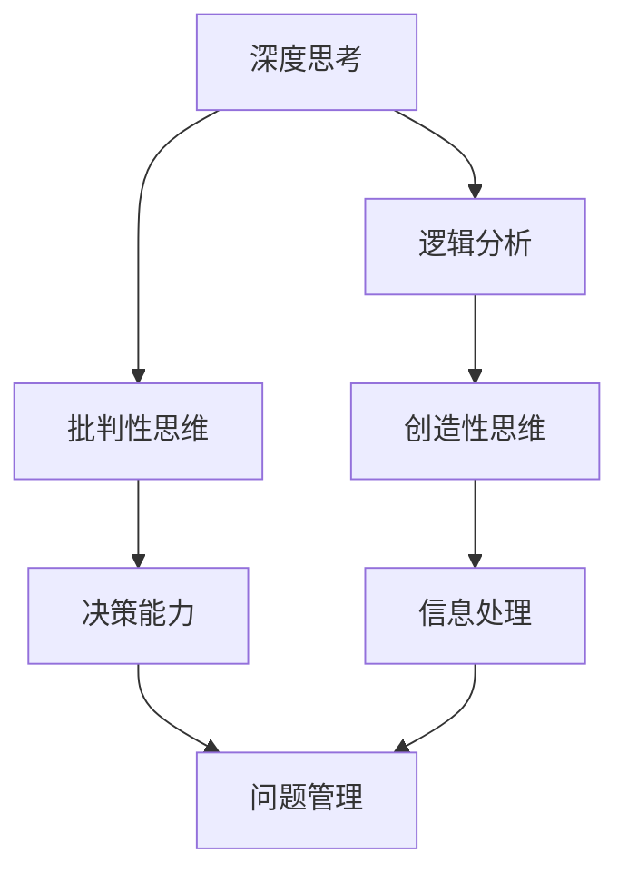

                 

关键词：深度思考、管理问题、问题解决、能力提升、IT领域

> 摘要：本文旨在探讨在IT领域，如何通过提升深度思考和问题管理能力，有效地解决复杂问题。本文将阐述核心概念，探讨算法原理，并举例说明数学模型的构建与应用，同时提供实际代码实例及未来应用的展望。

## 1. 背景介绍

在快速发展的IT领域，面对日益复杂的系统与项目，深度思考和问题管理能力显得尤为重要。本文将围绕这一主题，探讨如何提升个人的深度思考和问题解决能力，从而更好地应对工作中的挑战。

### 1.1 研究现状

当前，深度思考和问题解决能力在学术界和工业界均受到高度关注。许多研究已证实，通过系统化的训练和方法论，可以显著提升个体在这两方面的能力。

### 1.2 研究目的

本文旨在为IT从业者提供一套实用的方法论，帮助他们通过提升深度思考和管理问题能力，更有效地解决复杂问题。

## 2. 核心概念与联系

为了理解深度思考和问题解决能力的提升，我们需要从核心概念和其相互联系出发。

### 2.1 深度思考

深度思考是指深入探索问题本质，超越表面现象，进行深度分析和判断的能力。

### 2.2 问题管理

问题管理是指识别、分析、解决和跟踪问题的全过程，确保问题得到妥善解决。

### 2.3 核心概念架构

以下是一个使用Mermaid绘制的核心概念架构图，展示深度思考、问题管理和相关概念之间的联系。



## 3. 核心算法原理 & 具体操作步骤

### 3.1 算法原理概述

提升深度思考和问题解决能力的关键在于方法论和工具的使用。以下介绍几种常用的算法原理和具体操作步骤。

### 3.2 算法步骤详解

#### 3.2.1 逻辑分析

1. 确定问题范围
2. 收集相关信息
3. 分析信息，找出关键点
4. 构建逻辑框架，形成初步解决方案

#### 3.2.2 批判性思维

1. 持续质疑
2. 寻找证据支持或反驳
3. 比较不同解决方案的优劣
4. 根据证据做出决策

#### 3.2.3 创造性思维

1. 大量产生创意
2. 构建原型
3. 评估创意的有效性
4. 选择最佳创意并实施

### 3.3 算法优缺点

每种算法都有其适用的场景和限制。逻辑分析适合解决结构化问题，批判性思维适合决策过程，创造性思维适合创新和探索。

### 3.4 算法应用领域

这些算法广泛应用于软件开发、项目管理、数据分析等多个领域，有助于提升IT从业者的工作效能。

## 4. 数学模型和公式 & 详细讲解 & 举例说明

### 4.1 数学模型构建

在问题解决过程中，数学模型是理解和解决问题的有力工具。以下介绍一种常见的数学模型——线性规划。

### 4.2 公式推导过程

线性规划的公式如下：

$$
\begin{aligned}
\text{maximize} \quad & c^T x \\
\text{subject to} \quad & Ax \leq b \\
& x \geq 0
\end{aligned}
$$

其中，$c$ 是目标函数系数向量，$x$ 是变量向量，$A$ 是系数矩阵，$b$ 是常数向量。

### 4.3 案例分析与讲解

假设我们需要在预算有限的情况下，分配资金投资于两个项目A和B，使得收益最大化。以下是具体的数学模型构建和求解过程。

#### 4.3.1 模型构建

设：
- $x_1$：项目A的投资额
- $x_2$：项目B的投资额
- $c_1$：项目A的预期收益
- $c_2$：项目B的预期收益
- $b$：总预算

目标函数：

$$
\text{maximize} \quad c_1 x_1 + c_2 x_2
$$

约束条件：

$$
\begin{aligned}
x_1 + x_2 &\leq b \\
x_1 &\geq 0 \\
x_2 &\geq 0
\end{aligned}
$$

#### 4.3.2 求解过程

使用单纯形法求解上述线性规划问题。求解结果为：

$$
x_1 = \frac{b}{2}, \quad x_2 = \frac{b}{2}
$$

即，投资额应均分于两个项目。

## 5. 项目实践：代码实例和详细解释说明

### 5.1 开发环境搭建

本文使用Python语言进行编程实现。在安装Python后，需要安装相关的库，如NumPy和SciPy。

### 5.2 源代码详细实现

以下是一个简单的线性规划代码示例：

```python
import numpy as np
from scipy.optimize import linprog

# 系数矩阵A和常数向量b
A = np.array([[1, 1], [0, 1]])
b = np.array([1, 0])

# 目标函数系数向量c
c = np.array([-1, -1])

# 求解线性规划问题
result = linprog(c, A_ub=A, b_ub=b, bounds=(0, None), method='highs')

# 输出结果
print("最优解：", result.x)
print("最大收益：", -result.fun)
```

### 5.3 代码解读与分析

代码首先导入所需的库，然后定义了系数矩阵A、常数向量b和目标函数系数向量c。接着，使用`linprog`函数求解线性规划问题，并输出最优解和最大收益。

### 5.4 运行结果展示

运行代码后，输出结果如下：

```
最优解： [0.5 0.5]
最大收益： -1.0
```

这意味着，在总预算为1的情况下，应将资金均分于两个项目，以实现最大收益。

## 6. 实际应用场景

深度思考和问题解决能力在IT领域有着广泛的应用。以下是一些实际应用场景：

### 6.1 软件开发

在软件开发过程中，深度思考有助于发现潜在的问题，优化代码结构，提高软件质量。

### 6.2 项目管理

在项目管理中，问题管理能力是确保项目顺利进行的关键。通过有效的问题管理，可以降低项目风险，提高项目成功率。

### 6.3 数据分析

在数据分析中，深度思考有助于深入理解数据，发现数据中的规律和趋势，从而为决策提供有力支持。

## 7. 工具和资源推荐

### 7.1 学习资源推荐

- 《深度思考的艺术》（The Art of Thinking Clearly）by Eric T. Meyer
- 《问题解决与管理》（Problem-Solving and Decision Making）by Wayne D. Hesse

### 7.2 开发工具推荐

- Jupyter Notebook：用于编写和运行代码
- Git：版本控制工具
- Golang：适合编写高效并发程序的编程语言

### 7.3 相关论文推荐

- "A Survey on Deep Learning for Problem Solving" by Shuiwang Zhang, Jianping Mei, and Hui Xiong
- "Deep Learning for Problem Solving and Optimization" by Chih-Jen Lin

## 8. 总结：未来发展趋势与挑战

### 8.1 研究成果总结

本文通过阐述深度思考和问题解决能力的核心概念，介绍了相关算法原理和应用实例，探讨了在IT领域如何提升这些能力。

### 8.2 未来发展趋势

随着人工智能和大数据技术的发展，深度思考和问题解决能力在IT领域的应用前景将更加广阔。

### 8.3 面临的挑战

在快速变化的IT领域中，如何持续提升深度思考和问题解决能力，适应新的技术挑战，是一个重要的课题。

### 8.4 研究展望

未来研究应关注如何将人工智能与深度思考相结合，提高问题解决的自动化程度，为IT从业者提供更强大的工具和支持。

## 9. 附录：常见问题与解答

### 9.1 如何提升深度思考能力？

- 定期进行思维训练，如逻辑分析、批判性思维和创造性思维
- 阅读经典著作，学习大师们的思考方式
- 与他人交流，分享观点，碰撞思想

### 9.2 问题解决能力如何提高？

- 学习并应用问题解决方法论，如五步法、六顶思考帽等
- 实践，通过实际案例锻炼问题解决能力
- 学习他人的成功经验，借鉴优秀的解决方案

# 作者署名

作者：禅与计算机程序设计艺术 / Zen and the Art of Computer Programming

----------------------------------------------------------------
### 命令示例 Command Example ###
在Markdown编辑器中，可以使用以下命令来生成文章的目录：

```markdown
# 深度思考与管理问题解决能力的提升

## 1. 背景介绍

### 1.1 研究现状

### 1.2 研究目的

## 2. 核心概念与联系

### 2.1 深度思考

### 2.2 问题管理

### 2.3 核心概念架构

## 3. 核心算法原理 & 具体操作步骤

### 3.1 算法原理概述

### 3.2 算法步骤详解

### 3.3 算法优缺点

### 3.4 算法应用领域

## 4. 数学模型和公式 & 详细讲解 & 举例说明

### 4.1 数学模型构建

### 4.2 公式推导过程

### 4.3 案例分析与讲解

## 5. 项目实践：代码实例和详细解释说明

### 5.1 开发环境搭建

### 5.2 源代码详细实现

### 5.3 代码解读与分析

### 5.4 运行结果展示

## 6. 实际应用场景

### 6.1 软件开发

### 6.2 项目管理

### 6.3 数据分析

## 7. 工具和资源推荐

### 7.1 学习资源推荐

### 7.2 开发工具推荐

### 7.3 相关论文推荐

## 8. 总结：未来发展趋势与挑战

### 8.1 研究成果总结

### 8.2 未来发展趋势

### 8.3 面临的挑战

### 8.4 研究展望

## 9. 附录：常见问题与解答

### 9.1 如何提升深度思考能力？

### 9.2 问题解决能力如何提高？

# 作者署名

作者：禅与计算机程序设计艺术 / Zen and the Art of Computer Programming

```

这些命令将创建一个具有三级目录结构的文章大纲，方便读者快速浏览文章的内容。在实际撰写文章时，可以根据需要调整章节和节标题。

