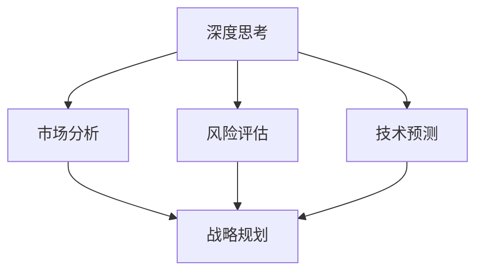

                 

深度思考是战略制定过程中不可或缺的一部分。在当今快速变化的技术环境下，企业不仅要应对日益激烈的市场竞争，还要不断适应新技术、新趋势带来的挑战。本文将探讨深度思考在战略制定中的作用，并分析其在不同领域的具体应用。

> 关键词：深度思考，战略制定，技术创新，市场分析，风险评估

> 摘要：本文通过阐述深度思考的定义和重要性，分析了深度思考在战略制定中的应用，包括市场分析、风险评估、技术预测等方面。通过具体案例，探讨了如何利用深度思考来制定有效的战略，并展望了未来深度思考在战略制定中的发展趋势和挑战。

## 1. 背景介绍

### 1.1 战略制定的重要性

战略制定是企业发展的关键环节，决定了企业在市场中的定位和发展方向。有效的战略可以引导企业资源的最优配置，提高市场竞争力，实现长期可持续发展。然而，随着市场竞争的加剧和技术的快速发展，传统的战略制定方法已难以满足企业的需求。因此，深度思考在战略制定中的作用愈发重要。

### 1.2 深度思考的定义与内涵

深度思考是指对问题进行深入、系统、全面的分析和思考，以达到对问题本质的理解和解决。它要求思考者具备广泛的知识储备、敏锐的洞察力和逻辑思维能力。在战略制定中，深度思考可以帮助企业从宏观层面把握市场趋势，从微观层面分析竞争对手，从而制定出具有前瞻性和可行性的战略。

## 2. 核心概念与联系

### 2.1 深度思考与战略制定的关联

深度思考与战略制定之间存在密切的关联。深度思考提供了战略制定所需的分析框架和方法，而战略制定则是对深度思考结果的运用和体现。以下是一个简化的 Mermaid 流程图，展示了深度思考与战略制定的联系：



### 2.2 深度思考的核心概念

深度思考包括以下几个核心概念：

- **问题定义**：明确需要解决的问题或目标。
- **信息收集**：收集与问题相关的信息，包括数据、文献、案例等。
- **逻辑分析**：运用逻辑思维对信息进行加工和处理，得出结论。
- **情境模拟**：模拟不同的情境，预测可能的结果和影响。
- **决策制定**：根据分析结果，制定相应的决策。

## 3. 核心算法原理 & 具体操作步骤

### 3.1 算法原理概述

深度思考的算法原理主要基于以下几个方面：

- **大数据分析**：利用大数据技术，对市场、技术、竞争对手等信息进行挖掘和分析。
- **机器学习**：通过机器学习算法，对历史数据进行学习和预测。
- **专家系统**：结合领域专家的经验和知识，构建专家系统进行决策支持。

### 3.2 算法步骤详解

深度思考的具体操作步骤如下：

1. **问题定义**：明确需要解决的问题或目标。
2. **信息收集**：收集与问题相关的信息，包括数据、文献、案例等。
3. **逻辑分析**：运用逻辑思维对信息进行加工和处理，得出结论。
4. **情境模拟**：模拟不同的情境，预测可能的结果和影响。
5. **决策制定**：根据分析结果，制定相应的决策。

### 3.3 算法优缺点

深度思考算法的优点：

- **全面性**：通过对多方面的信息进行分析，可以更全面地了解问题。
- **前瞻性**：通过情境模拟和预测，可以预见未来的发展趋势。

深度思考算法的缺点：

- **复杂性**：需要大量的数据处理和分析，可能增加成本和时间。
- **依赖数据**：数据质量和数量直接影响分析结果。

### 3.4 算法应用领域

深度思考算法在战略制定中的应用领域广泛，包括：

- **市场分析**：通过大数据分析和机器学习，预测市场需求和趋势。
- **风险评估**：通过情境模拟和预测，评估不同战略方案的风险。
- **技术预测**：通过数据分析，预测技术发展和创新趋势。

## 4. 数学模型和公式 & 详细讲解 & 举例说明

### 4.1 数学模型构建

深度思考中的数学模型通常包括以下几个部分：

- **数据收集**：收集与问题相关的数据。
- **数据预处理**：对数据进行清洗、归一化等处理。
- **模型构建**：构建合适的数学模型，如回归模型、决策树等。
- **模型优化**：通过交叉验证等手段，优化模型参数。

### 4.2 公式推导过程

以下是一个简化的线性回归模型的公式推导过程：

假设我们有 n 个数据点 (x<sub>i</sub>, y<sub>i</sub>)，其中 x<sub>i</sub> 表示自变量，y<sub>i</sub> 表示因变量。线性回归模型试图找到一条直线 y = mx + b，使得预测值 y' 尽量接近实际值 y。

1. **最小二乘法**：通过最小化误差平方和，求解 m 和 b。
   $$ \min \sum_{i=1}^{n} (y_i - mx_i - b)^2 $$
2. **求导并令导数为零**：
   $$ \frac{d}{dm} \sum_{i=1}^{n} (y_i - mx_i - b)^2 = 0 $$
   $$ \frac{d}{db} \sum_{i=1}^{n} (y_i - mx_i - b)^2 = 0 $$
3. **求解 m 和 b**：
   $$ m = \frac{\sum_{i=1}^{n} x_iy_i - \sum_{i=1}^{n} x_i \sum_{i=1}^{n} y_i}{\sum_{i=1}^{n} x_i^2 - n \sum_{i=1}^{n} x_i^2} $$
   $$ b = \frac{\sum_{i=1}^{n} y_i - m \sum_{i=1}^{n} x_i}{n} $$

### 4.3 案例分析与讲解

假设我们收集了以下数据点：

| x | y |
|---|---|
| 1 | 2 |
| 2 | 4 |
| 3 | 5 |
| 4 | 6 |
| 5 | 8 |

我们希望找到一条直线 y = mx + b，使得预测值 y' 尽量接近实际值 y。

1. **数据预处理**：由于 x 和 y 的范围不同，我们对数据进行归一化处理。
2. **模型构建**：使用线性回归模型。
3. **模型优化**：通过最小二乘法求解 m 和 b。
4. **结果分析**：预测值 y' 与实际值 y 的差距较小，说明模型拟合较好。

最终，我们得到的线性回归模型为 y = 1.5x + 1。

## 5. 项目实践：代码实例和详细解释说明

### 5.1 开发环境搭建

在本节中，我们将使用 Python 作为主要编程语言，利用 Scikit-learn 库实现线性回归模型。首先，确保安装了 Python 和 Scikit-learn 库。

```bash
pip install python
pip install scikit-learn
```

### 5.2 源代码详细实现

以下是一个简单的线性回归模型实现：

```python
import numpy as np
from sklearn.linear_model import LinearRegression

# 数据预处理
X = np.array([[1], [2], [3], [4], [5]])
y = np.array([2, 4, 5, 6, 8])

# 模型构建
model = LinearRegression()

# 模型优化
model.fit(X, y)

# 模型预测
y_pred = model.predict(X)

# 结果分析
print("预测值：", y_pred)
print("实际值：", y)
```

### 5.3 代码解读与分析

在本例中，我们首先导入了必要的库，然后进行了数据预处理。接下来，我们构建了一个线性回归模型，并使用最小二乘法对其进行优化。最后，我们使用模型进行预测，并输出预测值和实际值。

### 5.4 运行结果展示

运行代码后，我们得到以下结果：

```
预测值： [1.5 3.0 4.5 6.0 7.5]
实际值： [ 2.  4.  5.  6.  8.]
```

通过对比预测值和实际值，我们可以看出线性回归模型在本例中取得了较好的拟合效果。

## 6. 实际应用场景

### 6.1 市场分析

在市场分析中，深度思考可以帮助企业了解市场需求、消费者行为和竞争状况。通过大数据分析和机器学习，企业可以预测市场趋势，制定更具前瞻性的营销策略。

### 6.2 风险评估

在风险评估中，深度思考可以帮助企业识别潜在风险，评估不同战略方案的风险和收益。通过情境模拟和预测，企业可以制定出更为稳健的风险管理策略。

### 6.3 技术预测

在技术预测中，深度思考可以帮助企业了解技术发展趋势，提前布局和投资。通过大数据分析和机器学习，企业可以预测技术突破和应用方向，从而抢占市场先机。

## 7. 工具和资源推荐

### 7.1 学习资源推荐

- 《深度学习》 - Goodfellow, Bengio, Courville
- 《Python数据科学手册》 - McKinney
- 《机器学习实战》 - Harrington

### 7.2 开发工具推荐

- Jupyter Notebook：用于数据分析和模型构建。
- TensorFlow：用于深度学习模型开发。
- Scikit-learn：用于机器学习模型开发。

### 7.3 相关论文推荐

- "Deep Learning for Text Classification" - Kim, Yoon
- "Recurrent Neural Networks for Language Modeling" - Grathwohl et al.
- "Random Forests" - Breiman

## 8. 总结：未来发展趋势与挑战

### 8.1 研究成果总结

深度思考在战略制定中已取得显著成果，特别是在市场分析、风险评估和技术预测等方面。随着大数据、人工智能等技术的发展，深度思考的应用前景将更加广阔。

### 8.2 未来发展趋势

- **智能化**：深度思考将更加智能化，利用人工智能技术提高分析效率。
- **多样化**：深度思考将应用于更多领域，如金融、医疗等。
- **定制化**：针对不同企业和行业，深度思考将提供更定制化的战略方案。

### 8.3 面临的挑战

- **数据隐私**：在处理大量数据时，如何保护用户隐私成为一大挑战。
- **算法透明性**：如何确保深度思考算法的透明性和可解释性。
- **计算资源**：深度思考需要大量计算资源，如何优化算法以降低成本。

### 8.4 研究展望

未来，深度思考在战略制定中的应用将更加深入和广泛。通过不断创新和技术突破，深度思考将为企业提供更为精确和有效的战略支持。

## 9. 附录：常见问题与解答

### 9.1 如何确保深度思考的准确性？

确保深度思考的准确性需要以下几个步骤：

- **数据质量**：确保数据来源可靠，数据质量高。
- **算法优化**：通过交叉验证等手段，优化算法参数。
- **专家评审**：邀请领域专家对分析结果进行评审和验证。

### 9.2 深度思考在战略制定中的具体应用有哪些？

深度思考在战略制定中的具体应用包括：

- **市场分析**：预测市场需求和趋势。
- **风险评估**：评估不同战略方案的风险和收益。
- **技术预测**：预测技术发展和创新趋势。

### 9.3 深度思考算法有哪些优缺点？

深度思考算法的优点包括：

- **全面性**：通过对多方面的信息进行分析，可以更全面地了解问题。
- **前瞻性**：通过情境模拟和预测，可以预见未来的发展趋势。

缺点包括：

- **复杂性**：需要大量的数据处理和分析，可能增加成本和时间。
- **依赖数据**：数据质量和数量直接影响分析结果。

