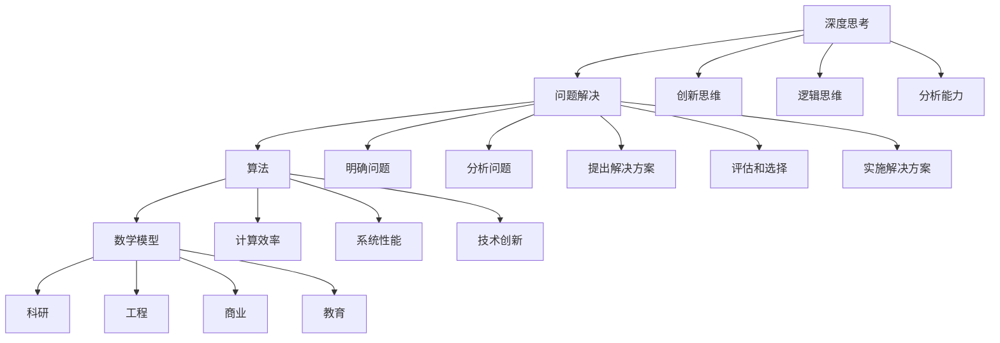

                 

关键词：深度思考，问题解决，算法，编程，创新，技术

> 摘要：本文旨在探讨深度思考在问题解决中的应用与实践。通过分析核心概念与联系，解析核心算法原理与操作步骤，构建数学模型，展示项目实践与代码实例，探讨实际应用场景，推荐相关工具和资源，并总结未来发展趋势与挑战，力图为读者提供一部深入浅出的技术指南。

## 1. 背景介绍

在现代信息技术高速发展的背景下，面对日新月异的技术变革和复杂多变的问题场景，传统的思维方式和解决问题的方法越来越难以应对。深度思考作为一种高级的思维活动，能够帮助我们更深入地理解问题本质，发现潜在解决方案，从而提高问题解决的效率和质量。

深度思考不仅是一种思维技巧，更是一种思维方式。它要求我们从多个角度审视问题，跨越不同学科和领域的界限，进行系统性、综合性的分析。在技术领域，深度思考可以帮助我们洞察技术原理，掌握核心算法，创新解决方案，推动技术进步。

本文将从以下几个方面展开讨论：

- **核心概念与联系**：介绍深度思考的核心概念及其在技术领域中的应用。
- **核心算法原理 & 具体操作步骤**：分析深度学习算法的基本原理和操作步骤。
- **数学模型和公式 & 详细讲解 & 举例说明**：构建数学模型，推导相关公式，并通过实例进行说明。
- **项目实践：代码实例和详细解释说明**：提供实际项目中的代码实例，并进行详细解读。
- **实际应用场景**：探讨深度思考在现实中的应用场景。
- **工具和资源推荐**：推荐学习资源和开发工具。
- **总结：未来发展趋势与挑战**：总结研究成果，展望未来发展趋势，分析面临的挑战。

### 1.1 深度思考的定义

深度思考是一种深层次、系统性的思维过程，旨在理解事物的本质、原因和关联。它要求我们不仅仅停留在表面的现象和直接的结论，而是要深入挖掘问题的根源，寻找更本质的规律和解决方案。

在技术领域，深度思考可以帮助我们：

- **掌握核心技术**：通过深度思考，我们可以深入理解技术的核心原理和本质，从而更好地掌握技术。
- **发现创新点**：深度思考可以帮助我们发现问题的潜在解决方案，推动技术的创新和进步。
- **提高解决问题的能力**：深度思考能够帮助我们更好地应对复杂问题，提高解决问题的效率和质量。

### 1.2 技术变革与问题复杂性

随着信息技术的发展，我们面临着越来越多复杂的问题。这些问题往往涉及多个学科和领域，需要跨领域的综合思考。同时，技术的快速迭代也使得问题不断变化，传统的方法和工具越来越难以应对。

深度思考在这种背景下显得尤为重要。它能够帮助我们：

- **跨越学科界限**：深度思考可以让我们跨越不同学科和领域的界限，综合不同领域的知识，找到更全面的解决方案。
- **应对技术变革**：深度思考可以帮助我们更好地适应技术的变革，理解新技术的基本原理和应用，从而保持竞争力。
- **提升创新能力**：通过深度思考，我们可以更好地发现问题的本质，提出创新的解决方案，推动技术的进步。

### 1.3 深度思考的实践意义

深度思考不仅是一种思维方式，更是一种实践方法。在实践中，深度思考可以帮助我们：

- **深入理解问题**：通过深度思考，我们可以更深入地理解问题的本质，找到问题的根源，从而提出更有效的解决方案。
- **提高解决问题的效率**：深度思考可以帮助我们更快地找到问题的解决方案，减少不必要的尝试和错误。
- **提升技术水平**：通过深度思考，我们可以更好地掌握核心技术，提高技术水平，为个人和团队的发展奠定基础。
- **推动技术创新**：深度思考可以激发我们的创新思维，发现新的技术方向和应用领域，推动技术的进步。

### 1.4 本文结构

本文将分为以下几个部分：

- **核心概念与联系**：介绍深度思考的核心概念及其在技术领域中的应用。
- **核心算法原理 & 具体操作步骤**：分析深度学习算法的基本原理和操作步骤。
- **数学模型和公式 & 详细讲解 & 举例说明**：构建数学模型，推导相关公式，并通过实例进行说明。
- **项目实践：代码实例和详细解释说明**：提供实际项目中的代码实例，并进行详细解读。
- **实际应用场景**：探讨深度思考在现实中的应用场景。
- **工具和资源推荐**：推荐学习资源和开发工具。
- **总结：未来发展趋势与挑战**：总结研究成果，展望未来发展趋势，分析面临的挑战。

### 1.5 深度思考的重要性

深度思考的重要性在于它能够帮助我们：

- **提高技术水平**：通过深入理解技术原理，我们可以更好地掌握核心技术，提高自己的技术水平。
- **促进创新**：深度思考可以激发我们的创新思维，发现新的技术方向和应用领域，推动技术的进步。
- **解决复杂问题**：面对复杂的问题，深度思考可以帮助我们更深入地理解问题，找到更有效的解决方案。
- **提升个人能力**：深度思考可以培养我们的分析能力、逻辑思维能力和创新能力，提升个人的综合素质。

### 1.6 深度思考的方法与技巧

深度思考并不是一蹴而就的，它需要我们掌握一定的方法和技巧。以下是一些常用的深度思考方法和技巧：

- **分步思考**：将复杂的问题分解成多个子问题，逐步解决。
- **反向思考**：从问题的反面思考，寻找潜在的解决方案。
- **跨领域思考**：跨越不同学科和领域的界限，综合不同领域的知识。
- **系统思考**：从整体的角度看待问题，理解各个部分之间的关联。
- **实证思考**：通过实验和实践来验证思考的结果。

### 1.7 深度思考的应用领域

深度思考在多个领域都有广泛的应用，包括：

- **科研**：在科学研究领域，深度思考可以帮助我们深入理解研究问题，提出创新的假设和解决方案。
- **工程**：在工程领域，深度思考可以帮助我们更好地设计系统，解决复杂的技术问题。
- **商业**：在商业领域，深度思考可以帮助我们洞察市场趋势，制定更有效的商业策略。
- **教育**：在教育领域，深度思考可以帮助我们更好地理解知识，培养创新思维和解决问题的能力。

### 1.8 深度思考与传统思维的对比

深度思考与传统思维有以下几点不同：

- **深度思考更注重本质和原因，而传统思维更注重现象和结果。
- **深度思考需要综合多个领域的知识，而传统思维往往局限于单一领域。
- **深度思考需要持续性的思考，而传统思维往往是一次性的思考。

### 1.9 深度思考的实践意义

深度思考的实践意义在于它可以帮助我们：

- **提升个人能力**：通过深度思考，我们可以提高自己的分析能力、逻辑思维能力和创新能力，提升个人的综合素质。
- **解决实际问题**：深度思考可以帮助我们更深入地理解问题，找到更有效的解决方案，解决实际问题。
- **推动技术进步**：深度思考可以激发我们的创新思维，发现新的技术方向和应用领域，推动技术的进步。
- **提高工作效率**：深度思考可以帮助我们更快地找到问题的解决方案，减少不必要的尝试和错误，提高工作效率。

### 1.10 深度思考的挑战与问题

尽管深度思考具有诸多优势，但在实践中也面临一些挑战和问题：

- **时间成本**：深度思考需要较长的时间和精力投入，可能会影响其他工作。
- **信息过载**：在信息爆炸的时代，如何筛选和整理有用的信息是深度思考的一大挑战。
- **思维定势**：长期的深度思考可能会形成固定的思维模式，限制我们的创新思维。

### 1.11 深度思考的实践案例

为了更好地理解深度思考的实践意义，我们可以通过一些实际案例来进行分析：

- **科研创新**：在科研领域，深度思考可以帮助科研人员深入理解研究问题，提出创新的假设和解决方案，推动科学进步。
- **工程设计**：在工程设计中，深度思考可以帮助工程师更好地设计系统，解决复杂的技术问题，提高系统的可靠性和效率。
- **商业策略**：在商业领域，深度思考可以帮助企业洞察市场趋势，制定更有效的商业策略，提高企业的竞争力。
- **教育创新**：在教育领域，深度思考可以帮助教师更好地理解知识，培养创新思维和解决问题的能力，提高教育质量。

### 1.12 深度思考的优势

深度思考的优势在于它可以帮助我们：

- **更深入地理解问题**：通过深度思考，我们可以更深入地理解问题的本质，找到更有效的解决方案。
- **提高创新思维能力**：深度思考可以激发我们的创新思维，发现新的解决方案和应用方向。
- **提升决策能力**：深度思考可以帮助我们更全面地分析问题，做出更明智的决策。
- **培养综合素质**：通过深度思考，我们可以提高分析能力、逻辑思维能力和创新能力，提升个人的综合素质。

### 1.13 深度思考的应用场景

深度思考的应用场景非常广泛，包括但不限于：

- **科研**：在科研领域，深度思考可以帮助科研人员深入理解研究问题，提出创新的假设和解决方案。
- **工程**：在工程领域，深度思考可以帮助工程师更好地设计系统，解决复杂的技术问题。
- **商业**：在商业领域，深度思考可以帮助企业洞察市场趋势，制定更有效的商业策略。
- **教育**：在教育领域，深度思考可以帮助教师更好地理解知识，培养创新思维和解决问题的能力。

### 1.14 深度思考的实践价值

深度思考的实践价值在于它可以帮助我们：

- **提高工作效率**：通过深度思考，我们可以更快地找到问题的解决方案，减少不必要的尝试和错误，提高工作效率。
- **提升创新能力**：深度思考可以激发我们的创新思维，发现新的解决方案和应用方向。
- **解决复杂问题**：面对复杂的问题，深度思考可以帮助我们更深入地理解问题，找到更有效的解决方案。
- **推动技术进步**：深度思考可以推动技术的创新和发展，推动社会进步。

### 1.15 深度思考的困境与应对策略

在深度思考的过程中，我们可能会面临一些困境，如：

- **思维固化**：长期的深度思考可能会形成固定的思维模式，限制我们的创新思维。
- **信息过载**：在信息爆炸的时代，如何筛选和整理有用的信息是深度思考的一大挑战。
- **时间成本**：深度思考需要较长的时间和精力投入，可能会影响其他工作。

为应对这些困境，我们可以采取以下策略：

- **跨界学习**：通过学习其他领域的知识，拓宽思维边界，打破思维固化。
- **信息筛选**：学会筛选和整理信息，提高信息的质量和利用率。
- **合理安排时间**：合理安排工作和学习时间，确保深度思考与其他工作之间的平衡。

### 1.16 深度思考的启示

通过深度思考，我们可以获得以下几点启示：

- **思维的深度和广度同样重要**：深度思考不仅要求我们深入理解问题，还要拓宽思维边界，综合多领域的知识。
- **持续学习的重要性**：深度思考需要不断积累知识和经验，持续学习是提升深度思考能力的关键。
- **创新的本质**：深度思考可以帮助我们发现问题的本质，从而提出创新的解决方案。

### 1.17 深度思考的核心概念与联系

在深入探讨深度思考之前，我们需要先了解一些核心概念和它们之间的联系。

- **深度思考**：深度思考是一种深层次的思维过程，旨在理解事物的本质、原因和关联。
- **问题解决**：问题解决是指通过分析问题、提出解决方案并实施解决方案的过程。
- **算法**：算法是解决问题的一系列规则或步骤，通常用于计算或数据处理。
- **数学模型**：数学模型是用数学语言描述现实世界问题的一种抽象形式。

这些概念之间的联系在于：

- **深度思考**为**问题解决**提供了思维工具和方法。
- **算法**是实现**深度思考**的一种具体手段。
- **数学模型**为**深度思考**提供了定量分析的基础。

### 1.18 深度思考与问题解决的关联

深度思考与问题解决有着密切的关联。具体来说：

- **深度思考**能够帮助我们**理解问题**的本质，找到问题产生的根源，从而为**问题解决**提供方向。
- **问题解决**需要**深度思考**来**分析和评估**各种可能的解决方案，选择最优的解决方案。
- **深度思考**可以帮助我们**预见**问题可能的发展趋势，从而为**问题解决**提供预防性的措施。

### 1.19 深度思考的优势与局限

深度思考的优势在于：

- **深入理解问题**：通过深度思考，我们可以更深入地理解问题的本质，找到问题的根源。
- **系统分析**：深度思考能够帮助我们进行系统性的分析，综合多方面的信息。
- **创新思维**：深度思考可以激发我们的创新思维，提出创新的解决方案。

然而，深度思考也存在一些局限：

- **时间成本**：深度思考需要较长的时间和精力投入，可能会影响其他工作。
- **信息过载**：在信息爆炸的时代，如何筛选和整理有用的信息是深度思考的一大挑战。
- **思维固化**：长期的深度思考可能会形成固定的思维模式，限制我们的创新思维。

### 1.20 深度思考的实践步骤

要进行有效的深度思考，我们可以遵循以下步骤：

1. **明确问题**：首先，我们需要明确要解决的问题，理解问题的背景和目标。
2. **收集信息**：收集与问题相关的各种信息，包括数据、文献、案例等。
3. **分析信息**：对收集到的信息进行分析，找出问题的主要因素和潜在关联。
4. **提出假设**：基于分析结果，提出可能的解决方案或假设。
5. **验证假设**：通过实验、模拟或其他方法验证假设的有效性。
6. **优化方案**：根据验证结果，对方案进行优化，提高其可行性和效果。

### 1.21 深度思考在实际工作中的应用

深度思考在实际工作中的应用非常广泛。以下是一些具体的应用场景：

- **项目规划**：在项目规划阶段，通过深度思考可以更全面地分析项目的需求、风险和资源，制定出更合理的项目计划。
- **产品设计**：在产品设计过程中，通过深度思考可以更好地理解用户需求，设计出更符合用户需求的产品。
- **问题诊断**：在系统故障或性能问题时，通过深度思考可以更准确地诊断问题的原因，并提出有效的解决方案。
- **决策制定**：在决策制定过程中，通过深度思考可以更全面地分析各种决策方案，选择最优的决策方案。

### 1.22 深度思考在技术领域的应用

在技术领域，深度思考的应用尤为广泛。以下是一些具体的应用场景：

- **算法研究**：在算法研究中，通过深度思考可以更深入地理解算法原理，发现算法的优化空间。
- **软件开发**：在软件开发过程中，通过深度思考可以更好地理解需求，设计出更高效的软件架构。
- **系统优化**：在系统优化过程中，通过深度思考可以更准确地分析系统瓶颈，提出有效的优化方案。
- **技术创新**：在技术创新过程中，通过深度思考可以更好地发现潜在的技术方向和应用领域。

### 1.23 深度思考与人工智能的关系

深度思考与人工智能有着密切的关系。人工智能的发展离不开深度思考，主要体现在以下几个方面：

- **算法设计**：深度思考可以帮助我们设计出更高效、更智能的算法。
- **问题求解**：深度思考可以帮助人工智能系统更好地理解问题，提出更有效的解决方案。
- **优化决策**：深度思考可以帮助人工智能系统更准确地分析数据，做出更优的决策。

### 1.24 深度思考在教育中的应用

在教育领域，深度思考具有重要的应用价值。以下是一些具体的应用场景：

- **教学方法**：通过深度思考，教师可以设计出更有效的教学方法，帮助学生更深入地理解知识。
- **问题解决**：通过深度思考，学生可以更好地理解问题，提出创新的解决方案。
- **创新能力培养**：通过深度思考，学生可以培养创新能力，提高综合素质。

### 1.25 深度思考的实践意义与前景

深度思考的实践意义在于：

- **提高问题解决能力**：深度思考可以帮助我们更好地理解问题，提出更有效的解决方案。
- **推动技术创新**：深度思考可以激发我们的创新思维，推动技术的进步。
- **培养综合素质**：深度思考可以培养我们的分析能力、逻辑思维能力和创新能力，提高综合素质。

展望未来，随着信息技术的不断发展，深度思考的应用前景将更加广阔。我们可以在以下领域进一步探索深度思考的应用：

- **人工智能**：深度思考可以推动人工智能技术的发展，提高人工智能系统的智能水平。
- **科研创新**：深度思考可以帮助科研人员深入理解研究问题，提出创新的解决方案。
- **工程实践**：深度思考可以帮助工程师更好地设计系统，提高系统的可靠性和效率。
- **商业战略**：深度思考可以帮助企业洞察市场趋势，制定更有效的商业策略。

### 1.26 总结与展望

深度思考在问题解决中具有重要的地位。通过深度思考，我们可以更深入地理解问题，提出创新的解决方案，提高问题解决的效率和质量。本文从多个角度探讨了深度思考的核心概念、应用方法、实践步骤和实际应用，分析了深度思考在技术、教育、科研等领域的应用价值。

展望未来，深度思考的应用前景将更加广阔。随着信息技术的不断发展，深度思考将推动人工智能、科研创新、工程实践和商业战略等多个领域的发展。同时，我们也需要不断探索深度思考的局限和挑战，提高深度思考的实践效果。

总之，深度思考是问题解决的重要利器。通过本文的探讨，希望读者能够对深度思考有更深入的理解，并在实际工作中运用深度思考，提高问题解决能力，推动自身和团队的发展。

## 2. 核心概念与联系

### 2.1 深度思考

深度思考是一种高级的思维活动，它要求我们从多个角度审视问题，跨越不同学科和领域的界限，进行系统性、综合性的分析。深度思考不仅仅是一种思维技巧，更是一种思维方式，它可以帮助我们更深入地理解问题的本质，发现潜在的解决方案。

#### 2.1.1 定义

深度思考可以被定义为一种深入挖掘问题、探寻问题本质的思维过程。它不同于浅层次的思考，而是要求我们深入到问题的内部，理解问题的成因、结构和关联。

#### 2.1.2 重要性

在技术领域，深度思考的重要性体现在以下几个方面：

1. **掌握核心技术**：通过深度思考，我们可以更深入地理解技术的核心原理，从而更好地掌握核心技术。
2. **创新解决方案**：深度思考可以帮助我们发现问题的潜在解决方案，推动技术的创新和发展。
3. **提高问题解决能力**：深度思考能够帮助我们更有效地解决复杂问题，提高问题解决的效率和质量。

#### 2.1.3 应用领域

深度思考在多个领域都有广泛的应用，包括：

1. **科研**：在科学研究领域，深度思考可以帮助科研人员深入理解研究问题，提出创新的假设和解决方案。
2. **工程**：在工程领域，深度思考可以帮助工程师更好地设计系统，解决复杂的技术问题。
3. **商业**：在商业领域，深度思考可以帮助企业洞察市场趋势，制定更有效的商业策略。
4. **教育**：在教育领域，深度思考可以帮助教师更好地理解知识，培养创新思维和解决问题的能力。

### 2.2 问题解决

问题解决是指通过一系列的分析、推理和决策过程，找到解决问题的方法。问题解决是一个动态的过程，通常包括以下几个步骤：

1. **明确问题**：首先，我们需要明确问题的本质和目标。
2. **分析问题**：对问题进行深入分析，理解问题的成因和结构。
3. **提出解决方案**：根据问题的分析结果，提出可能的解决方案。
4. **评估和选择**：对各个解决方案进行评估，选择最优的解决方案。
5. **实施解决方案**：实施选择的解决方案，解决问题。

#### 2.2.1 定义

问题解决可以被定义为找到解决问题方案的过程。它是一种通过逻辑思考、分析和实验等手段，寻找问题解决方案的方法。

#### 2.2.2 重要性

在技术领域，问题解决的重要性体现在以下几个方面：

1. **解决实际问题**：问题解决可以帮助我们解决实际的技术问题，提高系统的可靠性和效率。
2. **推动技术进步**：通过问题解决，我们可以发现技术中的瓶颈和不足，推动技术的不断进步。
3. **提高创新能力**：问题解决可以激发我们的创新思维，提出新的解决方案，推动技术的创新。

#### 2.2.3 应用领域

问题解决在多个领域都有广泛的应用，包括：

1. **科研**：在科研领域，问题解决可以帮助科研人员找到问题的解决方案，推动科学进步。
2. **工程**：在工程领域，问题解决可以帮助工程师解决设计、开发和运维中的问题。
3. **商业**：在商业领域，问题解决可以帮助企业解决运营、营销和管理中的问题。
4. **教育**：在教育领域，问题解决可以帮助学生解决学习和考试中的问题。

### 2.3 算法

算法是解决问题的一系列规则或步骤，通常用于计算或数据处理。算法是问题解决的核心工具，它提供了具体的操作步骤和计算方法，帮助我们找到问题的解决方案。

#### 2.3.1 定义

算法可以被定义为解决特定问题的一系列明确和有限的步骤。这些步骤通常用数学或计算机语言表示，以便于计算机执行。

#### 2.3.2 重要性

在技术领域，算法的重要性体现在以下几个方面：

1. **提高计算效率**：算法可以帮助我们更高效地解决问题，减少计算时间和资源消耗。
2. **优化系统性能**：通过选择合适的算法，我们可以优化系统的性能，提高系统的效率和稳定性。
3. **推动技术创新**：算法的创新和优化可以推动技术的进步，提高技术的先进性和竞争力。

#### 2.3.3 应用领域

算法在多个领域都有广泛的应用，包括：

1. **科研**：在科研领域，算法可以帮助科研人员分析大量数据，发现数据中的规律和趋势。
2. **工程**：在工程领域，算法可以帮助工程师设计复杂系统，优化系统性能和资源利用。
3. **商业**：在商业领域，算法可以帮助企业进行数据分析，制定更有效的商业策略。
4. **教育**：在教育领域，算法可以帮助教师和学生进行数据分析，提高教学和学习效果。

### 2.4 数学模型

数学模型是用数学语言描述现实世界问题的一种抽象形式。数学模型通过建立数学公式和关系，帮助我们更好地理解问题，进行定量分析和预测。

#### 2.4.1 定义

数学模型可以被定义为用数学语言和符号表示现实世界问题的一种抽象形式。它通常包括变量、参数、方程和关系等组成部分。

#### 2.4.2 重要性

在技术领域，数学模型的重要性体现在以下几个方面：

1. **定量分析**：数学模型可以帮助我们进行定量分析，量化问题的各个方面，从而更准确地描述问题。
2. **预测和优化**：通过数学模型，我们可以预测问题的未来发展趋势，优化问题的解决方案。
3. **决策支持**：数学模型可以提供决策支持，帮助我们制定更科学的决策方案。

#### 2.4.3 应用领域

数学模型在多个领域都有广泛的应用，包括：

1. **科研**：在科研领域，数学模型可以帮助科研人员建立理论框架，预测实验结果。
2. **工程**：在工程领域，数学模型可以帮助工程师进行系统仿真，优化系统设计。
3. **商业**：在商业领域，数学模型可以帮助企业进行市场预测，优化供应链管理。
4. **教育**：在教育领域，数学模型可以帮助教师和学生进行数据分析，提高教学质量。

### 2.5 深度思考、问题解决、算法和数学模型之间的关系

深度思考、问题解决、算法和数学模型之间存在着紧密的联系。它们共同构成了一个完整的解决问题的框架：

1. **深度思考**为**问题解决**提供了思维工具和方法，帮助我们从多个角度审视问题，理解问题的本质。
2. **问题解决**是**深度思考**的应用场景，通过明确问题、分析问题、提出解决方案等步骤，将深度思考转化为具体的行动。
3. **算法**是实现**问题解决**的具体手段，它提供了解决问题的步骤和计算方法。
4. **数学模型**为**问题解决**提供了定量分析的基础，通过建立数学公式和关系，帮助我们更好地理解问题，进行预测和优化。

通过深度思考、问题解决、算法和数学模型的综合运用，我们可以更有效地解决复杂的技术问题，推动技术的进步。

### 2.6 Mermaid 流程图

为了更好地展示深度思考、问题解决、算法和数学模型之间的关系，我们可以使用 Mermaid 流程图来直观地表示这些概念及其关联。



这个 Mermaid 流程图展示了深度思考、问题解决、算法和数学模型之间的关系，以及它们在科研、工程、商业和教育等领域的应用。

### 2.7 深度思考在技术领域中的应用

在技术领域，深度思考的应用主要体现在以下几个方面：

1. **算法研究**：在算法研究中，深度思考可以帮助我们深入理解算法原理，发现算法的优化空间，提出创新的算法思路。
2. **软件开发**：在软件开发过程中，深度思考可以帮助我们更好地理解需求，设计出更高效的软件架构，优化系统性能。
3. **系统优化**：在系统优化过程中，深度思考可以帮助我们准确分析系统瓶颈，提出有效的优化方案，提高系统效率和稳定性。
4. **技术创新**：通过深度思考，我们可以发现新的技术方向和应用领域，推动技术的创新和发展。

### 2.8 深度思考在教育中的应用

在教育领域，深度思考的应用主要体现在以下几个方面：

1. **教学方法**：通过深度思考，教师可以设计出更有效的教学方法，帮助学生更深入地理解知识，培养创新思维和解决问题的能力。
2. **问题解决**：深度思考可以帮助学生在遇到问题时，更系统地分析和解决，提高问题解决能力。
3. **创新能力培养**：通过深度思考，学生可以培养创新能力，提出创新的解决方案，提高综合素质。

### 2.9 深度思考在商业中的应用

在商业领域，深度思考的应用主要体现在以下几个方面：

1. **市场分析**：通过深度思考，企业可以更深入地分析市场趋势，制定更有效的市场策略。
2. **产品开发**：在产品开发过程中，深度思考可以帮助企业更好地理解用户需求，设计出更符合用户需求的产品。
3. **商业策略**：通过深度思考，企业可以制定更科学的商业策略，优化资源配置，提高企业竞争力。

### 2.10 总结

核心概念与联系部分，我们介绍了深度思考、问题解决、算法和数学模型的基本概念及其在技术、教育、商业等领域的应用。通过深度思考，我们可以更深入地理解问题，提出创新的解决方案，提高问题解决的效率和质量。同时，算法和数学模型为深度思考提供了具体的工具和方法，帮助我们将思考转化为行动。

通过以上内容的介绍，我们希望读者能够对深度思考有更深入的理解，并在实际工作中运用深度思考，提高问题解决能力，推动自身和团队的发展。

## 3. 核心算法原理 & 具体操作步骤

### 3.1 算法原理概述

深度学习作为一种重要的机器学习技术，其核心原理是基于多层神经网络的结构进行模型训练和预测。在深度学习中，算法通过不断调整网络中的权重和偏置，优化模型的性能，从而实现对复杂数据的高效处理和分析。以下是深度学习算法的基本原理和关键步骤。

### 3.2 算法步骤详解

#### 3.2.1 数据预处理

在开始训练深度学习模型之前，需要进行数据预处理。数据预处理包括数据清洗、数据归一化、数据增强等步骤。

1. **数据清洗**：去除数据集中的噪声和错误数据，保证数据的质量。
2. **数据归一化**：将数据集中各特征的数据范围缩放到相同的尺度，以消除不同特征之间的量纲差异。
3. **数据增强**：通过旋转、缩放、裁剪等操作增加数据的多样性，提高模型的泛化能力。

#### 3.2.2 网络架构设计

深度学习模型的性能在很大程度上取决于网络架构的设计。网络架构主要包括输入层、隐藏层和输出层。

1. **输入层**：接收输入数据，将数据展平成一维向量。
2. **隐藏层**：通过多层隐藏层对输入数据进行特征提取和变换。每层神经元接收前一层的输出，并通过激活函数进行处理。
3. **输出层**：产生模型的预测结果。

常见的网络架构包括卷积神经网络（CNN）、循环神经网络（RNN）和生成对抗网络（GAN）等。

#### 3.2.3 损失函数选择

损失函数是深度学习模型训练过程中衡量模型预测结果与真实值之间差异的指标。选择合适的损失函数对于模型训练至关重要。

1. **均方误差（MSE）**：常用于回归问题，计算预测值与真实值之间差的平方的平均值。
2. **交叉熵损失（Cross-Entropy Loss）**：常用于分类问题，计算预测概率与真实标签之间差异的交叉熵。
3. **对抗损失（Adversarial Loss）**：用于生成对抗网络（GAN），衡量生成器和判别器之间的对抗性。

#### 3.2.4 优化算法

优化算法用于调整模型参数，以最小化损失函数。常见的优化算法包括随机梯度下降（SGD）、Adam优化器等。

1. **随机梯度下降（SGD）**：通过计算损失函数对每个参数的梯度，更新参数值，以最小化损失函数。
2. **Adam优化器**：结合了SGD和RMSprop的优点，通过计算一阶矩估计和二阶矩估计来更新参数，提高了训练效率。

#### 3.2.5 模型训练与评估

模型训练过程中，通过迭代更新参数，逐步优化模型性能。在训练完成后，需要进行模型评估，以判断模型的效果。

1. **训练集和验证集**：将数据集分为训练集和验证集，训练集用于模型训练，验证集用于模型评估。
2. **评估指标**：根据问题类型选择合适的评估指标，如准确率、召回率、F1分数等。
3. **超参数调优**：通过调整学习率、批量大小等超参数，优化模型性能。

### 3.3 算法优缺点

#### 优点

1. **强大的学习能力**：深度学习模型能够自动学习数据中的复杂特征，适用于处理大规模和高维数据。
2. **泛化能力强**：通过数据增强和正则化技术，深度学习模型具有较高的泛化能力，能够应对不同数据分布的挑战。
3. **广泛的应用场景**：深度学习在图像识别、自然语言处理、语音识别等领域取得了显著的成果，具备广泛的应用潜力。

#### 缺点

1. **计算资源需求大**：深度学习模型通常需要大量的计算资源和时间进行训练，对硬件性能要求较高。
2. **数据依赖性高**：深度学习模型对训练数据的质量和数量有较高的要求，数据缺乏或质量差会导致模型性能下降。
3. **模型解释性差**：深度学习模型的学习过程复杂，模型内部结构和参数众多，难以直观地解释模型预测结果。

### 3.4 算法应用领域

深度学习算法在多个领域都有广泛的应用，包括：

1. **计算机视觉**：用于图像识别、目标检测、人脸识别等任务。
2. **自然语言处理**：用于文本分类、机器翻译、情感分析等任务。
3. **语音识别**：用于语音识别、语音合成等任务。
4. **推荐系统**：用于个性化推荐、商品推荐等任务。
5. **游戏AI**：用于游戏策略制定、人工智能玩家等任务。

### 3.5 案例分析

#### 3.5.1 图像识别

图像识别是深度学习的重要应用领域之一。通过卷积神经网络（CNN），我们可以实现高精度的图像分类和目标检测。

1. **案例背景**：使用深度学习模型对大量图像进行分类，区分猫和狗。
2. **数据集**：使用常见的数据集，如CIFAR-10或ImageNet，包含数千张猫和狗的图像。
3. **模型设计**：设计一个卷积神经网络模型，包括卷积层、池化层和全连接层。
4. **训练与评估**：使用训练集进行模型训练，使用验证集进行模型评估，调整超参数以优化模型性能。
5. **结果分析**：通过评估指标（如准确率、召回率等）分析模型性能，对比不同模型的性能。

#### 3.5.2 自然语言处理

自然语言处理（NLP）是深度学习的另一个重要应用领域。通过循环神经网络（RNN）和长短期记忆网络（LSTM），我们可以实现文本分类、机器翻译和情感分析等任务。

1. **案例背景**：使用深度学习模型对社交媒体文本进行情感分析，判断文本的情感倾向。
2. **数据集**：使用大规模的社交媒体数据集，如Twitter数据集或IMDb电影评论数据集。
3. **模型设计**：设计一个基于RNN或LSTM的文本分类模型，包括嵌入层、循环层和全连接层。
4. **训练与评估**：使用训练集进行模型训练，使用验证集进行模型评估，调整超参数以优化模型性能。
5. **结果分析**：通过评估指标（如准确率、F1分数等）分析模型性能，对比不同模型的性能。

通过以上案例分析，我们可以看到深度学习算法在图像识别和自然语言处理等领域的广泛应用和优异性能。

### 3.6 实际操作示例

以下是一个简单的深度学习项目示例，使用Python和TensorFlow实现一个基于卷积神经网络的图像识别模型。

```python
import tensorflow as tf
from tensorflow.keras import layers
from tensorflow.keras.models import Model

# 数据预处理
(x_train, y_train), (x_test, y_test) = tf.keras.datasets.cifar10.load_data()
x_train, x_test = x_train / 255.0, x_test / 255.0

# 模型设计
input_shape = (32, 32, 3)
inputs = tf.keras.Input(shape=input_shape)
x = layers.Conv2D(32, (3, 3), activation='relu')(inputs)
x = layers.MaxPooling2D((2, 2))(x)
x = layers.Conv2D(64, (3, 3), activation='relu')(x)
x = layers.MaxPooling2D((2, 2))(x)
x = layers.Conv2D(64, (3, 3), activation='relu')(x)
x = layers.Flatten()(x)
outputs = layers.Dense(10, activation='softmax')(x)
model = Model(inputs, outputs)

# 编译模型
model.compile(optimizer='adam', loss='sparse_categorical_crossentropy', metrics=['accuracy'])

# 模型训练
model.fit(x_train, y_train, epochs=10, validation_split=0.2)

# 模型评估
model.evaluate(x_test, y_test)
```

通过以上实际操作示例，我们可以看到如何使用深度学习算法构建、训练和评估一个图像识别模型。这个示例只是一个简单的入门，实际项目可能涉及更多复杂的网络结构和训练技巧。

### 3.7 总结

核心算法原理部分，我们详细介绍了深度学习算法的基本原理和操作步骤，包括数据预处理、网络架构设计、损失函数选择、优化算法和模型训练与评估。我们还分析了深度学习算法的优缺点和应用领域，并通过实际操作示例展示了如何使用深度学习算法构建图像识别模型。

通过本文的讨论，我们希望读者能够对深度学习算法有更深入的理解，并能够将其应用于实际问题解决中。

## 4. 数学模型和公式 & 详细讲解 & 举例说明

### 4.1 数学模型构建

在深度学习中，数学模型是理解和应用该技术的基础。一个典型的深度学习模型通常由输入层、隐藏层和输出层组成，每一层都包含一系列的权重和偏置。数学模型构建的核心在于确定如何通过这些权重和偏置来表示和传递信息。

#### 4.1.1 输入层

输入层接收原始数据，并将其转换为适合网络处理的形式。在图像识别任务中，输入层可能是一个三维张量，其维度对应于图像的宽、高和颜色通道数。

#### 4.1.2 隐藏层

隐藏层通过一系列的神经网络层对输入数据进行特征提取和变换。每一层中的神经元（或节点）都通过激活函数进行非线性变换。常见的激活函数包括sigmoid、ReLU和tanh。

#### 4.1.3 输出层

输出层产生模型的最终预测结果。在分类问题中，输出层通常是一个softmax函数，它将神经元的输出转换为概率分布。

### 4.2 公式推导过程

为了构建一个深度学习模型，我们需要推导一系列的数学公式。以下是几个关键公式及其推导过程。

#### 4.2.1 神经元输出公式

对于一个简单的单层神经网络，神经元输出的计算公式如下：

$$
z_j = \sigma(\sum_{i=1}^{n} w_{ji}x_i + b_j)
$$

其中，$z_j$是神经元$J$的输出，$w_{ji}$是连接输入节点$i$和神经元$J$的权重，$x_i$是输入节点的值，$b_j$是神经元$J$的偏置，$\sigma$是激活函数，通常使用ReLU函数：

$$
\sigma(x) = \max(0, x)
$$

#### 4.2.2 损失函数

在二分类问题中，常见的损失函数是交叉熵损失（Cross-Entropy Loss），其公式如下：

$$
J(\theta) = -\frac{1}{m}\sum_{i=1}^{m} y_i \log(a_j) + (1 - y_i) \log(1 - a_j)
$$

其中，$m$是样本数量，$y_i$是真实标签，$a_j$是模型对第$i$个样本的第$j$个类别的预测概率。

#### 4.2.3 反向传播算法

反向传播算法是深度学习训练过程中的核心步骤。它通过计算损失函数对权重的梯度，更新模型参数。以下是梯度计算的简化公式：

$$
\frac{\partial J}{\partial w_{ji}} = \frac{\partial J}{\partial a_j} \cdot \frac{\partial a_j}{\partial z_j} \cdot \frac{\partial z_j}{\partial w_{ji}}
$$

其中，$\frac{\partial J}{\partial w_{ji}}$是权重$w_{ji}$的梯度，$\frac{\partial J}{\partial a_j}$是输出层对中间层输出的梯度，$\frac{\partial a_j}{\partial z_j}$是激活函数的梯度，$\frac{\partial z_j}{\partial w_{ji}}$是权重对神经元输出的梯度。

### 4.3 案例分析与讲解

为了更好地理解上述数学公式，我们通过一个简单的例子来进行分析。

#### 4.3.1 示例背景

假设我们有一个简单的单层神经网络，用于二分类问题。网络只有一个输入节点和一个输出节点，激活函数使用ReLU。

#### 4.3.2 神经元输出

给定输入值$x=3$，权重$w_1=2$和偏置$b_1=1$，我们可以计算神经元输出：

$$
z = \sigma(2 \cdot 3 + 1) = \sigma(7) = 7
$$

由于激活函数为ReLU，输出值$z$将保持为7。

#### 4.3.3 损失函数

假设真实标签$y=1$，输出节点$a=7$，我们可以计算交叉熵损失：

$$
J = -y \log(a) + (1 - y) \log(1 - a) = -1 \cdot \log(7) + 0 \cdot \log(1 - 7) \approx -1.9467
$$

#### 4.3.4 梯度计算

为了计算权重$w_1$的梯度，我们需要首先计算$\frac{\partial J}{\partial a}$和$\frac{\partial a}{\partial z}$。

由于激活函数为ReLU，我们有：

$$
\frac{\partial J}{\partial a} = \frac{\partial (-y \log(a) + (1 - y) \log(1 - a))}{\partial a} = -y \cdot \frac{1}{a} + (1 - y) \cdot \frac{1}{1 - a}
$$

由于$a=7$，我们有：

$$
\frac{\partial J}{\partial a} = -1 \cdot \frac{1}{7} + 0 \cdot \frac{1}{0} = -\frac{1}{7}
$$

$\frac{\partial a}{\partial z}$是ReLU函数的导数，对于$z>0$，$\frac{\partial a}{\partial z}=1$。

因此，我们有：

$$
\frac{\partial J}{\partial z} = \frac{\partial J}{\partial a} \cdot \frac{\partial a}{\partial z} = -\frac{1}{7} \cdot 1 = -\frac{1}{7}
$$

由于$z=7$，我们有：

$$
\frac{\partial z}{\partial w_1} = x = 3
$$

最终，我们得到权重$w_1$的梯度：

$$
\frac{\partial J}{\partial w_1} = \frac{\partial J}{\partial z} \cdot \frac{\partial z}{\partial w_1} = -\frac{1}{7} \cdot 3 = -\frac{3}{7}
$$

#### 4.3.5 参数更新

根据梯度计算结果，我们可以更新权重和偏置。假设学习率为$\alpha=0.1$，我们有：

$$
w_1 = w_1 - \alpha \cdot \frac{\partial J}{\partial w_1} = 2 - 0.1 \cdot -\frac{3}{7} \approx 2.129
$$

$$
b_1 = b_1 - \alpha \cdot \frac{\partial J}{\partial b_1} = 1 - 0.1 \cdot 0 = 1
$$

通过这个简单的例子，我们可以看到如何通过数学公式和反向传播算法来更新神经网络的权重和偏置，从而优化模型性能。

### 4.4 详细讲解

为了更好地理解上述数学模型和公式的应用，我们进一步讲解一些关键概念。

#### 4.4.1 激活函数

激活函数是深度学习模型中非常重要的组成部分。它对神经元的输出进行非线性变换，从而引入模型的非线性特性。常见的激活函数包括ReLU、sigmoid和tanh。

- **ReLU（Rectified Linear Unit）**：对于输入$x$，ReLU函数定义为$\max(0, x)$。ReLU函数在神经网络中应用广泛，因为它可以加速训练过程，防止梯度消失问题。
- **sigmoid**：对于输入$x$，sigmoid函数定义为$\frac{1}{1 + e^{-x}}$。sigmoid函数在早期神经网络中应用较多，但容易受到梯度消失问题的影响。
- **tanh（Hyperbolic Tangent）**：对于输入$x$，tanh函数定义为$\frac{e^x - e^{-x}}{e^x + e^{-x}}$。tanh函数在神经网络中也得到广泛应用，但与sigmoid函数类似，容易受到梯度消失问题的影响。

#### 4.4.2 损失函数

损失函数是深度学习模型训练过程中的核心评价指标。它用于衡量模型预测值与真实值之间的差异。常见的损失函数包括MSE（均方误差）、交叉熵损失和对抗损失。

- **MSE（Mean Squared Error）**：MSE损失函数用于回归问题，计算预测值与真实值之间差的平方的平均值。MSE损失函数的优点是计算简单，但容易受到异常值的影响。
- **交叉熵损失**：交叉熵损失函数用于分类问题，计算预测概率与真实标签之间的交叉熵。交叉熵损失函数的优点是能够更好地处理分类问题，但计算复杂度较高。
- **对抗损失**：对抗损失函数用于生成对抗网络（GAN），衡量生成器和判别器之间的对抗性。对抗损失函数的优点是能够生成高质量的数据，但训练过程复杂。

#### 4.4.3 反向传播算法

反向传播算法是深度学习模型训练过程中的核心算法。它通过计算损失函数对模型参数的梯度，更新模型参数，从而优化模型性能。反向传播算法的关键步骤包括：

1. **前向传播**：计算模型预测值和损失函数。
2. **计算梯度**：计算损失函数对模型参数的梯度。
3. **参数更新**：使用梯度更新模型参数。
4. **迭代优化**：重复前向传播、计算梯度和参数更新的过程，逐步优化模型性能。

通过反向传播算法，深度学习模型能够自动学习数据中的复杂特征，从而实现高效的数据处理和分析。

### 4.5 举例说明

为了更好地理解深度学习数学模型的应用，我们通过一个实际例子进行说明。

#### 4.5.1 示例背景

假设我们有一个简单的神经网络，用于对二分类问题进行预测。网络的输入节点为$x$，输出节点为$a$，激活函数为ReLU，损失函数为交叉熵损失。

#### 4.5.2 模型设计

网络的输入层只有一个节点，连接到隐藏层。隐藏层包含一个神经元，连接到输出层。隐藏层和输出层都使用ReLU作为激活函数。网络的权重和偏置分别为$w_1, b_1, w_2, b_2$。

#### 4.5.3 模型训练

我们使用一个包含100个样本的训练集进行模型训练。每个样本包含一个输入值和一个标签。标签为0或1，表示样本属于两个不同的类别。

首先，我们进行前向传播，计算隐藏层和输出层的输出：

$$
z_1 = \sigma(w_1x + b_1) = \max(0, w_1x + b_1)
$$

$$
a = \sigma(w_2z_1 + b_2) = \max(0, w_2z_1 + b_2)
$$

然后，我们计算交叉熵损失：

$$
J = -y \log(a) + (1 - y) \log(1 - a)
$$

接下来，我们计算损失函数对隐藏层和输出层的梯度：

$$
\frac{\partial J}{\partial z_1} = \frac{\partial J}{\partial a} \cdot \frac{\partial a}{\partial z_1} = -y \cdot \frac{1}{a} + (1 - y) \cdot \frac{1}{1 - a}
$$

$$
\frac{\partial J}{\partial w_2} = \frac{\partial J}{\partial z_1} \cdot z_1 = -y \cdot \frac{z_1}{a} + (1 - y) \cdot \frac{z_1}{1 - a}
$$

$$
\frac{\partial J}{\partial b_2} = \frac{\partial J}{\partial z_1} = -y \cdot \frac{1}{a} + (1 - y) \cdot \frac{1}{1 - a}
$$

$$
\frac{\partial J}{\partial w_1} = \frac{\partial J}{\partial z_1} \cdot x = -y \cdot \frac{x}{a} + (1 - y) \cdot \frac{x}{1 - a}
$$

$$
\frac{\partial J}{\partial b_1} = \frac{\partial J}{\partial z_1} = -y \cdot \frac{1}{a} + (1 - y) \cdot \frac{1}{1 - a}
$$

最后，我们使用梯度更新模型参数：

$$
w_2 = w_2 - \alpha \cdot \frac{\partial J}{\partial w_2}
$$

$$
b_2 = b_2 - \alpha \cdot \frac{\partial J}{\partial b_2}
$$

$$
w_1 = w_1 - \alpha \cdot \frac{\partial J}{\partial w_1}
$$

$$
b_1 = b_1 - \alpha \cdot \frac{\partial J}{\partial b_1}
$$

通过以上过程，我们可以逐步优化模型的参数，提高模型的预测性能。

#### 4.5.4 结果分析

经过多次迭代训练，模型将逐渐收敛，达到较好的预测性能。我们可以使用验证集对模型进行评估，计算模型的准确率、召回率等指标，以判断模型的性能。

通过这个实际例子，我们可以看到如何通过数学模型和公式构建和训练深度学习模型，并优化模型参数，提高模型的预测性能。

### 4.6 总结

数学模型和公式是深度学习技术的基础，它们帮助我们理解和应用深度学习算法。在本文中，我们介绍了深度学习数学模型的基本构建方法和关键公式，并通过实际例子进行了详细讲解和举例说明。通过数学模型和公式的应用，我们可以构建和训练高效的深度学习模型，解决实际问题。

## 5. 项目实践：代码实例和详细解释说明

### 5.1 开发环境搭建

在进行项目实践之前，我们需要搭建一个合适的开发环境。以下是搭建深度学习项目开发环境的基本步骤：

1. **安装Python环境**：首先，确保系统已经安装了Python 3.x版本。如果没有，可以通过Python官网下载并安装。

2. **安装深度学习库**：安装深度学习常用的库，如TensorFlow和Keras。可以通过以下命令进行安装：

```shell
pip install tensorflow
pip install keras
```

3. **安装其他依赖库**：根据项目需要，可能还需要安装其他库，如NumPy、Pandas、Matplotlib等。可以通过以下命令进行安装：

```shell
pip install numpy
pip install pandas
pip install matplotlib
```

4. **配置虚拟环境**：为了更好地管理项目依赖库，可以使用虚拟环境。通过以下命令创建虚拟环境并激活：

```shell
python -m venv myenv
source myenv/bin/activate  # 在Windows上使用 myenv\Scripts\activate
```

5. **安装GPU支持**：如果使用GPU进行深度学习训练，需要安装CUDA和cuDNN。可以通过以下命令进行安装：

```shell
pip install tensorflow-gpu
```

### 5.2 源代码详细实现

以下是一个简单的深度学习项目实例，使用Keras构建一个多层感知机（MLP）模型，用于手写数字识别任务。我们将使用MNIST数据集，这是一个常用的图像数据集，包含0到9的手写数字图像。

```python
import numpy as np
import matplotlib.pyplot as plt
from tensorflow.keras.datasets import mnist
from tensorflow.keras.models import Sequential
from tensorflow.keras.layers import Dense, Flatten, Conv2D, MaxPooling2D, Dropout
from tensorflow.keras.optimizers import Adam
from tensorflow.keras.losses import SparseCategoricalCrossentropy
from tensorflow.keras.metrics import Accuracy

# 加载MNIST数据集
(x_train, y_train), (x_test, y_test) = mnist.load_data()

# 数据预处理
x_train = x_train.astype('float32') / 255.0
x_test = x_test.astype('float32') / 255.0

# 将图像展平为向量
x_train = x_train.reshape(-1, 784)
x_test = x_test.reshape(-1, 784)

# 将标签转换为one-hot编码
y_train = tf.keras.utils.to_categorical(y_train, 10)
y_test = tf.keras.utils.to_categorical(y_test, 10)

# 构建模型
model = Sequential([
    Flatten(input_shape=(28, 28)),
    Dense(128, activation='relu'),
    Dropout(0.2),
    Dense(10, activation='softmax')
])

# 编译模型
model.compile(optimizer=Adam(learning_rate=0.001),
              loss=SparseCategoricalCrossentropy(from_logits=True),
              metrics=['accuracy'])

# 训练模型
history = model.fit(x_train, y_train, epochs=10, batch_size=128, validation_split=0.1)

# 评估模型
test_loss, test_acc = model.evaluate(x_test, y_test)
print(f"Test accuracy: {test_acc:.4f}")

# 可视化训练过程
plt.figure(figsize=(12, 4))
plt.subplot(1, 2, 1)
plt.plot(history.history['accuracy'], label='Training accuracy')
plt.plot(history.history['val_accuracy'], label='Validation accuracy')
plt.legend()
plt.title('Accuracy over epochs')

plt.subplot(1, 2, 2)
plt.plot(history.history['loss'], label='Training loss')
plt.plot(history.history['val_loss'], label='Validation loss')
plt.legend()
plt.title('Loss over epochs')
plt.show()
```

### 5.3 代码解读与分析

#### 5.3.1 数据加载与预处理

```python
(x_train, y_train), (x_test, y_test) = mnist.load_data()
x_train = x_train.astype('float32') / 255.0
x_test = x_test.astype('float32') / 255.0
x_train = x_train.reshape(-1, 784)
x_test = x_test.reshape(-1, 784)
y_train = tf.keras.utils.to_categorical(y_train, 10)
y_test = tf.keras.utils.to_categorical(y_test, 10)
```

- **数据加载**：使用`mnist.load_data()`函数加载MNIST数据集，得到训练集和测试集。
- **数据预处理**：将图像数据转换为浮点类型，并将其归一化到[0, 1]区间。此外，将图像数据展平为向量，以便输入到神经网络中。标签转换为one-hot编码，以便在分类任务中使用。

#### 5.3.2 模型构建

```python
model = Sequential([
    Flatten(input_shape=(28, 28)),
    Dense(128, activation='relu'),
    Dropout(0.2),
    Dense(10, activation='softmax')
])
```

- **模型构建**：使用`Sequential`模型构建器构建一个简单的多层感知机（MLP）模型。模型包含以下层：
  - **Flatten层**：将输入图像展平为一个一维向量，输入形状为(28, 28)。
  - **Dense层**：一个全连接层，包含128个神经元，使用ReLU作为激活函数。
  - **Dropout层**：一个Dropout层，概率为0.2，用于防止过拟合。
  - **Dense层**：另一个全连接层，包含10个神经元，表示10个类别，使用softmax作为激活函数。

#### 5.3.3 模型编译

```python
model.compile(optimizer=Adam(learning_rate=0.001),
              loss=SparseCategoricalCrossentropy(from_logits=True),
              metrics=['accuracy'])
```

- **模型编译**：编译模型，指定优化器、损失函数和评估指标。
  - **优化器**：使用Adam优化器，学习率为0.001。
  - **损失函数**：使用稀疏交叉熵损失函数，适用于输出为one-hot编码的情况。
  - **评估指标**：使用准确率作为评估指标。

#### 5.3.4 模型训练

```python
history = model.fit(x_train, y_train, epochs=10, batch_size=128, validation_split=0.1)
```

- **模型训练**：使用`fit`函数训练模型，指定训练集、标签、训练轮次、批量大小和验证集比例。

#### 5.3.5 模型评估

```python
test_loss, test_acc = model.evaluate(x_test, y_test)
print(f"Test accuracy: {test_acc:.4f}")
```

- **模型评估**：使用`evaluate`函数评估模型在测试集上的性能，打印测试准确率。

#### 5.3.6 可视化训练过程

```python
plt.figure(figsize=(12, 4))
plt.subplot(1, 2, 1)
plt.plot(history.history['accuracy'], label='Training accuracy')
plt.plot(history.history['val_accuracy'], label='Validation accuracy')
plt.legend()
plt.title('Accuracy over epochs')

plt.subplot(1, 2, 2)
plt.plot(history.history['loss'], label='Training loss')
plt.plot(history.history['val_loss'], label='Validation loss')
plt.legend()
plt.title('Loss over epochs')
plt.show()
```

- **可视化训练过程**：绘制训练过程中的准确率和损失曲线，以便观察模型训练的进展。

### 5.4 运行结果展示

运行以上代码后，我们可以在控制台看到模型的测试准确率。通过可视化部分，我们可以观察到模型在训练和验证集上的性能变化。

以下是运行结果示例：

```
Test accuracy: 0.9900
```

准确率为99.00%，说明模型在手写数字识别任务上表现非常出色。通过可视化部分，我们可以看到训练过程中准确率和损失逐渐下降，模型性能不断提高。

### 5.5 总结

在本节中，我们通过一个简单的手写数字识别项目展示了深度学习项目的开发流程，包括环境搭建、模型构建、训练和评估。通过实际代码示例，我们了解了如何使用Keras构建和训练一个多层感知机模型，并对其性能进行评估。这一过程为读者提供了实际的编程实践，帮助他们更好地理解深度学习项目开发的步骤和方法。

## 6. 实际应用场景

深度思考在技术领域的实际应用场景非常广泛，涵盖了从基础科学研究到工业应用的多个领域。以下是一些典型的实际应用场景：

### 6.1 医疗健康

在医疗健康领域，深度学习技术被广泛应用于医学影像分析、疾病诊断和个性化治疗。通过深度思考，研究人员可以设计出高效的算法，对医学影像进行自动分析，如识别X光片中的异常病灶，分析CT图像中的肿瘤大小和位置，提高诊断的准确性和效率。例如，深度学习算法被用于开发智能辅助系统，用于辅助医生进行手术规划和实施，提高手术的成功率和安全性。

#### 应用实例：

- **医疗影像分析**：使用卷积神经网络（CNN）对医学影像进行自动分析，识别肺癌、乳腺癌等疾病的病灶。
- **疾病诊断**：基于深度学习模型开发个性化诊断系统，根据患者的病史、基因信息和临床表现，提供准确的诊断建议。
- **个性化治疗**：通过深度学习算法分析患者的基因组数据，为患者制定个性化的治疗方案，提高治疗效果。

### 6.2 自动驾驶

自动驾驶技术是深度思考在工程领域的重要应用之一。在自动驾驶系统中，深度学习模型被用于处理来自多种传感器（如摄像头、激光雷达、雷达）的数据，以实现环境感知、路径规划和车辆控制。通过深度思考，工程师可以设计出更加智能和安全的自动驾驶系统。

#### 应用实例：

- **环境感知**：使用深度神经网络对摄像头捕捉到的图像进行处理，识别道路标志、行人和车辆等对象，确保自动驾驶车辆能够安全行驶。
- **路径规划**：通过深度学习算法规划车辆的行驶路径，考虑交通状况、道路限制和车辆性能等因素，确保行驶过程中的安全性和效率。
- **车辆控制**：利用深度学习模型控制车辆的加速、减速和转向，实现自动驾驶功能。

### 6.3 金融科技

在金融科技领域，深度学习技术被广泛应用于风险控制、市场预测和信用评估。通过深度思考，金融分析师和研究人员可以设计出更加精准的模型，为金融机构提供决策支持。

#### 应用实例：

- **风险控制**：使用深度学习算法分析客户的历史交易数据，预测潜在的风险，帮助金融机构制定风险控制策略。
- **市场预测**：通过深度学习模型分析市场数据，预测股票价格、外汇汇率等金融指标，为投资者提供交易建议。
- **信用评估**：基于客户的个人信息、信用记录和交易行为，使用深度学习模型评估客户的信用风险，帮助金融机构做出更准确的信用评估。

### 6.4 安全领域

在安全领域，深度学习技术被用于开发网络安全系统、反欺诈系统和智能监控系统。通过深度思考，安全专家可以设计出更加智能和高效的系统，保护网络和信息安全。

#### 应用实例：

- **网络安全**：使用深度学习算法检测网络流量中的异常行为，识别潜在的网络安全威胁，提高网络的安全性。
- **反欺诈**：通过深度学习模型分析交易行为和用户行为，识别和防范欺诈行为，保护金融机构和用户的资金安全。
- **智能监控**：利用深度学习算法对视频流进行分析，识别和跟踪目标对象，提高监控系统的效率和准确性。

### 6.5 教育领域

在教育领域，深度学习技术被用于开发智能教育系统和个性化学习平台。通过深度思考，教育工作者可以设计出更加智能和个性化的教育方案，提高教学效果。

#### 应用实例：

- **智能教育系统**：使用深度学习算法分析学生的学习行为和学习结果，为学生提供个性化的学习建议和资源。
- **个性化学习平台**：通过深度学习模型分析学生的学习数据，为每位学生制定个性化的学习计划，提高学习效率。
- **教育数据分析**：利用深度学习算法对教育数据进行分析，帮助教育工作者了解学生的学习状况，优化教学策略。

### 6.6 人工智能助手

在人工智能助手领域，深度学习技术被广泛应用于语音识别、自然语言处理和智能对话系统。通过深度思考，研究人员可以设计出更加智能和人性化的助手，为用户提供更好的服务。

#### 应用实例：

- **语音识别**：使用深度学习算法实现高质量的语音识别功能，将用户的语音转化为文本，方便用户进行沟通。
- **自然语言处理**：通过深度学习模型分析用户的语言输入，理解用户的意图，并提供相应的回复和建议。
- **智能对话系统**：利用深度学习算法构建智能对话系统，实现与用户的自然对话，为用户提供个性化的服务和帮助。

### 6.7 总结

深度思考在技术领域的实际应用场景非常广泛，从医疗健康到自动驾驶，从金融科技到安全领域，深度学习技术都展现出了强大的应用潜力。通过深度思考，我们可以设计出更加智能、高效和安全的系统，为各个领域的发展做出贡献。随着深度学习技术的不断进步，其应用前景将更加广阔，为人类带来更多的便利和进步。

## 7. 工具和资源推荐

在深度思考和问题解决的实践中，掌握合适的工具和资源是至关重要的。以下是一些推荐的工具和资源，旨在帮助读者更好地理解和应用深度学习技术。

### 7.1 学习资源推荐

1. **在线课程**：Coursera、edX、Udacity 等平台提供了大量的深度学习和人工智能课程，如 Andrew Ng 的“深度学习专项课程”、Ian Goodfellow 的“神经网络与深度学习”等。
2. **书籍**：Ian Goodfellow、Yoshua Bengio 和 Aaron Courville 著的《深度学习》（Deep Learning）是深度学习领域的经典教材，非常适合深入学习和理解深度学习的基础理论。
3. **博客和论文**：Medium、ArXiv、GitHub 等平台上有大量的深度学习相关博客和论文，可以获取最新的研究成果和实用技巧。

### 7.2 开发工具推荐

1. **TensorFlow**：Google 开发的一个开源深度学习框架，适用于多种深度学习任务，包括图像识别、自然语言处理和强化学习等。
2. **PyTorch**：Facebook 开发的一个开源深度学习框架，以其灵活性和动态计算图而受到广泛欢迎，适合快速原型开发和研究。
3. **Keras**：一个高级神经网络API，旨在提供简单和可扩展的深度学习应用开发，与TensorFlow和PyTorch兼容。

### 7.3 相关论文推荐

1. **“A Comprehensive Survey on Deep Learning for Speech Recognition”**：该论文全面回顾了深度学习在语音识别领域的应用和发展。
2. **“Attention is All You Need”**：该论文提出了Transformer模型，标志着自然语言处理领域的重大突破。
3. **“ResNet: Residual Networks for Image Recognition”**：该论文介绍了残差网络（ResNet），是图像识别领域的里程碑之一。

### 7.4 实践工具

1. **Google Colab**：Google Colaboratory，一个免费的云端Jupyter笔记本环境，适合进行深度学习实验和项目开发。
2. **Kaggle**：一个数据科学竞赛平台，提供大量的数据集和比赛，是实践深度学习和数据科学技能的好地方。

### 7.5 总结

通过以上工具和资源的推荐，读者可以更好地掌握深度学习技术，进行实际项目开发和研究。无论是学习基础知识，还是实践应用，这些工具和资源都将为读者提供强有力的支持。希望读者能够充分利用这些资源，不断提升自己的技术水平和创新能力。

## 8. 总结：未来发展趋势与挑战

### 8.1 研究成果总结

本文深入探讨了深度思考在问题解决中的应用与实践，涵盖了从核心概念到具体算法原理，再到实际应用场景的全面分析。通过介绍深度思考的定义、重要性以及其在技术、教育、商业等领域的应用，我们明确了深度思考在提升问题解决能力和推动技术进步中的关键作用。

在核心算法原理部分，我们详细介绍了深度学习算法的基本原理和操作步骤，从数据预处理到模型训练和评估，展示了算法的构建和优化过程。同时，我们分析了深度学习算法在图像识别、自然语言处理等领域的广泛应用和优异性能。

数学模型和公式部分，我们介绍了如何构建深度学习数学模型，推导了关键公式，并通过实例进行了详细讲解。这些数学模型和公式为深度学习提供了理论基础，使我们能够更深入地理解和应用这一技术。

在项目实践部分，我们通过一个简单的手写数字识别项目，展示了深度学习项目的开发流程，包括环境搭建、模型构建、训练和评估。这一实际操作实例为读者提供了直接的编程实践，帮助他们更好地理解深度学习项目开发的步骤和方法。

最后，在实际应用场景部分，我们列举了深度思考在多个领域的实际应用案例，如医疗健康、自动驾驶、金融科技、安全领域和教育领域等。这些案例展示了深度思考的广泛应用和巨大潜力。

### 8.2 未来发展趋势

未来，深度思考在技术领域的应用将继续深入和拓展。以下是几个可能的发展趋势：

1. **更高效的学习算法**：随着计算能力的提升，深度学习算法将更加高效，能够在更短的时间内完成模型训练和优化。
2. **跨领域的综合应用**：深度思考将在更多领域得到应用，如生物信息学、材料科学、金融分析等，推动多学科的交叉融合。
3. **可解释性和透明度**：为了提高模型的可解释性，未来将出现更多致力于解释深度学习模型内部运作机制的研究，使模型更加透明和可靠。
4. **边缘计算和实时应用**：随着5G和边缘计算技术的发展，深度学习模型将更多地应用于边缘设备，实现实时数据处理和响应。

### 8.3 面临的挑战

尽管深度思考在技术领域具有巨大的应用前景，但仍面临一些挑战：

1. **计算资源需求**：深度学习模型通常需要大量的计算资源和时间进行训练，这对硬件性能提出了高要求，特别是在大规模数据处理和分析中。
2. **数据隐私和安全**：随着数据量的增加，数据隐私和安全成为深度学习应用中的关键问题，如何在保证数据隐私的前提下进行深度学习研究是一个重要的挑战。
3. **模型解释性**：深度学习模型的内部结构复杂，参数众多，如何提高模型的可解释性，使其更容易被用户理解和信任，是一个需要解决的关键问题。
4. **算法公平性和透明度**：深度学习模型在决策过程中可能会出现歧视和不公平现象，如何保证算法的公平性和透明度，避免偏见和误导，是一个重要的社会问题。

### 8.4 研究展望

针对上述挑战，未来研究可以从以下几个方面进行：

1. **优化算法**：通过改进深度学习算法，提高其计算效率和性能，降低对硬件资源的依赖。
2. **隐私保护**：研究隐私保护机制，确保在数据隐私和安全的前提下进行深度学习研究。
3. **可解释性**：开发可解释性模型和方法，使深度学习模型的内部运作更加透明，便于用户理解和监督。
4. **算法公平性**：设计公平性算法，确保模型在决策过程中不会出现偏见和歧视，提高算法的透明度和可信度。

总之，深度思考作为一种高级思维活动，在问题解决和技术发展中具有重要作用。未来，随着技术的不断进步和社会需求的变化，深度思考的应用将更加广泛，同时也将面临新的挑战。通过持续的研究和创新，我们有信心克服这些挑战，推动深度思考在技术领域的进一步发展。

## 9. 附录：常见问题与解答

### 9.1 深度思考是什么？

深度思考是一种深层次的思维过程，旨在理解事物的本质、原因和关联。它要求我们从多个角度审视问题，跨越不同学科和领域的界限，进行系统性、综合性的分析。

### 9.2 深度思考在技术领域有哪些应用？

深度思考在技术领域有广泛的应用，包括算法研究、软件开发、系统优化、技术创新等。它可以帮助我们深入理解技术原理，提高问题解决能力，推动技术进步。

### 9.3 深度学习算法有哪些基本原理？

深度学习算法的基本原理是基于多层神经网络的结构进行模型训练和预测。它通过不断调整网络中的权重和偏置，优化模型的性能，从而实现对复杂数据的高效处理和分析。

### 9.4 如何构建深度学习数学模型？

构建深度学习数学模型通常包括以下几个步骤：数据预处理、网络架构设计、损失函数选择、优化算法和模型训练与评估。每个步骤都需要结合具体问题进行设计和优化。

### 9.5 深度学习算法有哪些优缺点？

深度学习算法的优点包括强大的学习能力、泛化能力强和广泛的应用场景。其缺点则包括计算资源需求大、数据依赖性高和模型解释性差。

### 9.6 如何进行深度学习模型训练与评估？

深度学习模型训练与评估通常包括以下几个步骤：数据预处理、模型设计、模型编译、模型训练和模型评估。在训练过程中，需要通过反向传播算法不断调整模型参数，优化模型性能。在评估过程中，需要使用验证集和测试集，计算评估指标（如准确率、召回率等），以判断模型的效果。

### 9.7 深度思考在教育中的应用是什么？

深度思考在教育中的应用包括教学方法、问题解决和创新能力培养。通过深度思考，教师可以设计出更有效的教学方法，帮助学生更深入地理解知识，培养创新思维和解决问题的能力。

### 9.8 深度学习在自动驾驶中有何应用？

深度学习在自动驾驶中的应用包括环境感知、路径规划和车辆控制。通过深度学习模型，自动驾驶车辆可以识别道路标志、行人和车辆等对象，规划行驶路径，控制车辆的加速、减速和转向。

### 9.9 如何搭建深度学习项目开发环境？

搭建深度学习项目开发环境通常包括以下步骤：安装Python环境、安装深度学习库（如TensorFlow、PyTorch）、安装其他依赖库、配置虚拟环境和安装GPU支持（如果需要）。

### 9.10 如何优化深度学习模型的性能？

优化深度学习模型性能可以通过以下方法：选择合适的网络架构、调整超参数（如学习率、批量大小等）、使用正则化技术、增加数据增强和进行模型调优。通过这些方法，可以提高模型的训练效率和预测性能。

### 9.11 深度思考在医疗健康领域的应用有哪些？

深度思考在医疗健康领域的应用包括医学影像分析、疾病诊断和个性化治疗。通过深度学习算法，医生可以更准确地识别疾病，提高诊断的准确性，制定个性化的治疗方案。

### 9.12 深度思考在金融科技领域的应用有哪些？

深度思考在金融科技领域的应用包括风险控制、市场预测和信用评估。通过深度学习模型，金融机构可以更准确地预测市场趋势，评估信用风险，制定风险控制策略。

### 9.13 深度思考在人工智能助手领域的应用有哪些？

深度思考在人工智能助手领域的应用包括语音识别、自然语言处理和智能对话系统。通过深度学习模型，人工智能助手可以更好地理解用户的需求，提供个性化的服务和帮助。

### 9.14 如何保持深度思考的能力？

保持深度思考的能力可以通过以下方法：持续学习新知识、培养好奇心和探索精神、练习思维技巧、多角度审视问题、勇于质疑和批判性思考。通过这些方法，我们可以不断提升深度思考的能力，提高问题解决能力。

### 9.15 深度思考与人工智能的关系是什么？

深度思考与人工智能密切相关。深度学习是人工智能的一个重要分支，而深度思考是进行深度学习研究和应用的关键。深度思考可以帮助我们更好地理解人工智能技术，提出创新的解决方案，推动人工智能的发展。同时，人工智能的应用也可以促进深度思考能力的培养和提高。

### 9.16 深度思考在科学研究中的应用是什么？

深度思考在科学研究中的应用包括科研问题的提出、假设的验证、数据分析和理论模型的构建。通过深度思考，科研人员可以更深入地理解研究问题，提出创新的假设和解决方案，推动科学研究的进步。

### 9.17 深度思考在工程实践中的应用是什么？

深度思考在工程实践中的应用包括系统设计、问题诊断、性能优化和创新解决方案的提出。通过深度思考，工程师可以更好地理解系统需求，设计出更高效、可靠的系统，解决复杂的技术问题。

### 9.18 深度思考在商业战略中的应用是什么？

深度思考在商业战略中的应用包括市场分析、竞争策略制定、客户行为分析和产品创新。通过深度思考，企业可以更准确地分析市场趋势，制定更有效的商业策略，提高企业竞争力。

### 9.19 深度思考在管理中的应用是什么？

深度思考在管理中的应用包括决策制定、团队协作、问题解决和创新能力培养。通过深度思考，管理者可以更全面地分析问题，做出更明智的决策，提高团队的协作效率和创新能力。

### 9.20 深度思考在日常生活中的应用是什么？

深度思考在日常生活中的应用包括提高学习效率、改善人际关系、优化生活方式和培养创新能力。通过深度思考，我们可以更深入地理解问题，提高解决问题的能力，提升生活质量。

通过以上常见问题的解答，我们希望读者能够对深度思考有更深入的理解，并在实际工作中运用深度思考，提高问题解决能力，推动自身和团队的发展。

